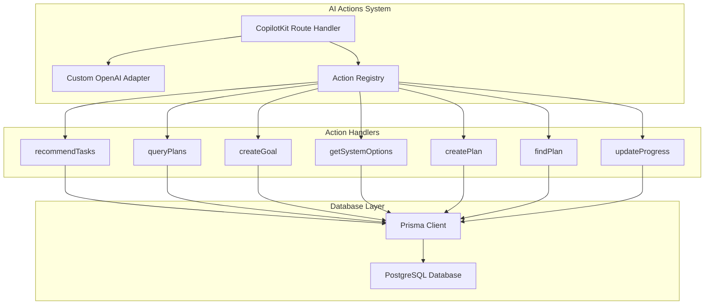
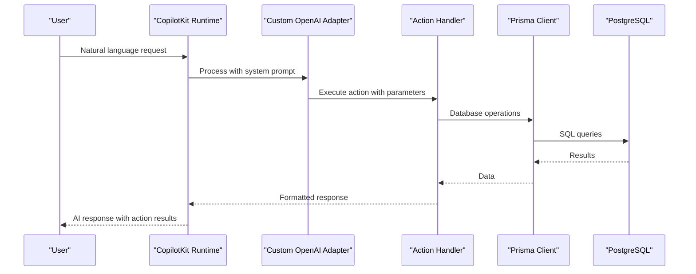
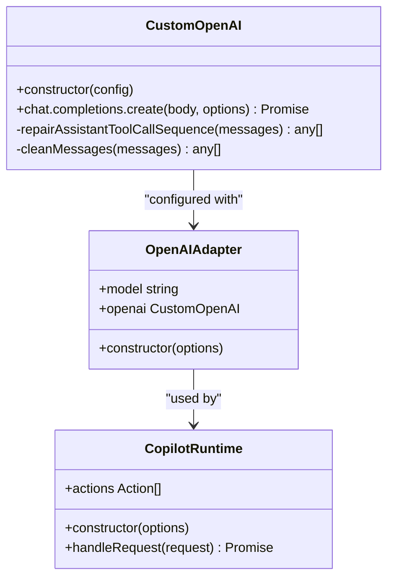
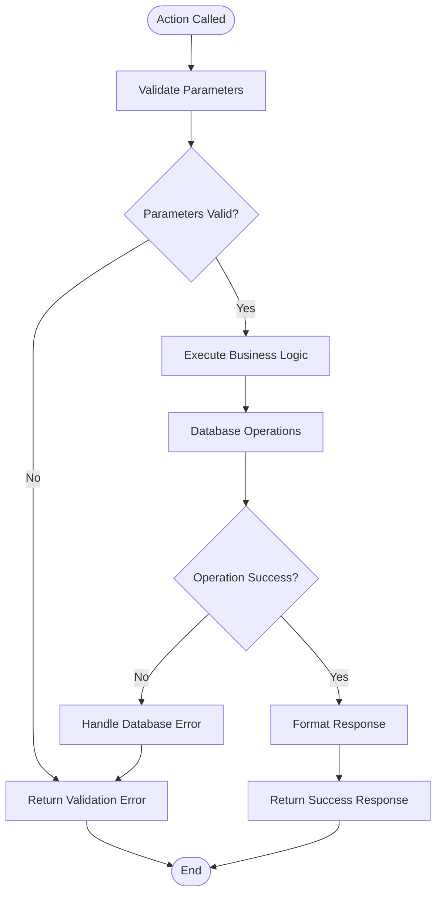
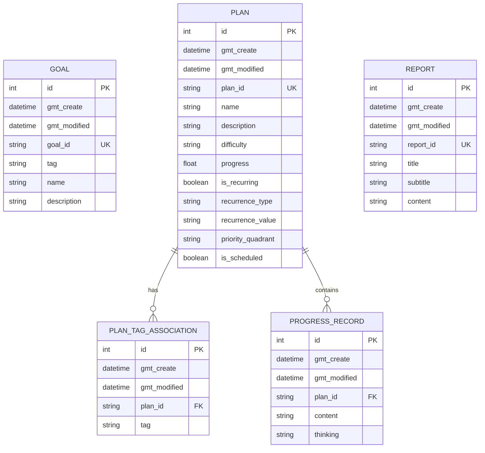
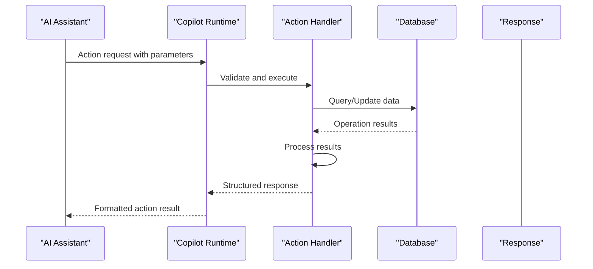
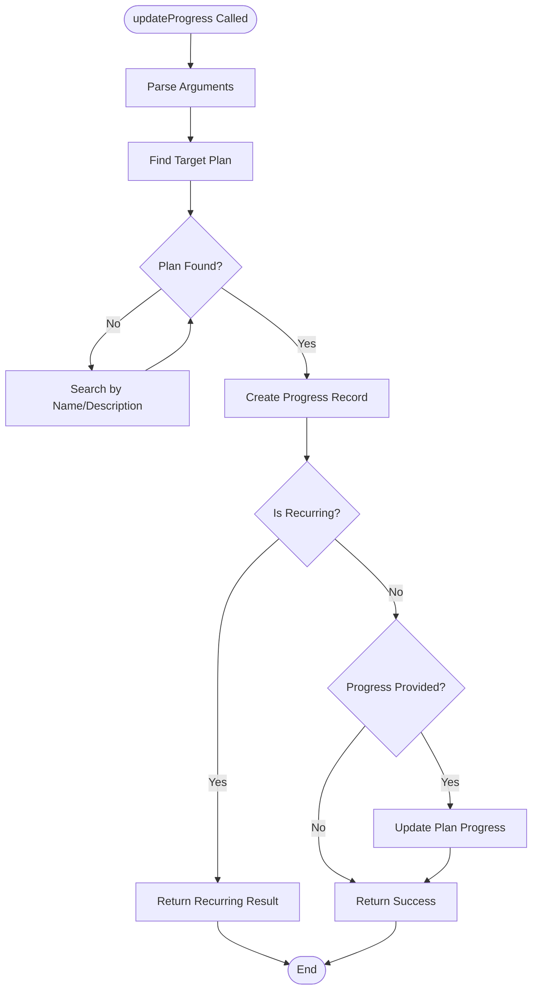

# AI Actions System

<cite>
**Referenced Files in This Document**
- [route.ts](file://src/app/api/copilotkit/route.ts)
- [schema.prisma](file://prisma/schema.prisma)
- [test-action/route.ts](file://src/app/api/test-action/route.ts)
- [README.md](file://README.md)
</cite>

## Table of Contents
1. [Introduction](#introduction)
2. [Project Structure](#project-structure)
3. [Core Components](#core-components)
4. [Architecture Overview](#architecture-overview)
5. [Detailed Component Analysis](#detailed-component-analysis)
6. [Action Parameter Schemas](#action-parameter-schemas)
7. [Database Interactions](#database-interactions)
8. [Action Execution Flow](#action-execution-flow)
9. [Error Handling](#error-handling)
10. [Response Formatting](#response-formatting)
11. [Practical Examples](#practical-examples)
12. [Extending the Action System](#extending-the-action-system)
13. [Debugging Guide](#debugging-guide)
14. [Conclusion](#conclusion)

## Introduction

The AI Actions System in Goal Mate is built around CopilotKit integration, providing intelligent automation capabilities for goal and plan management. The system enables natural language interactions with AI assistants that can automatically detect user intents and execute corresponding system actions.

The system currently implements six core AI actions: `recommendTasks`, `queryPlans`, `createGoal`, `getSystemOptions`, `createPlan`, `findPlan`, and `updateProgress`. These actions work together to provide a comprehensive AI-powered productivity management solution.

## Project Structure

The AI actions system is primarily implemented in the CopilotKit API route file, with supporting database models defined in Prisma schema:



**Diagram sources**
- [route.ts:286-1452](file://src/app/api/copilotkit/route.ts#L286-L1452)
- [schema.prisma:16-61](file://prisma/schema.prisma#L16-L61)

**Section sources**
- [route.ts:1-1636](file://src/app/api/copilotkit/route.ts#L1-1636)
- [schema.prisma:1-72](file://prisma/schema.prisma#L1-L72)

## Core Components

The AI Actions System consists of several key components working together:

### 1. Copilot Runtime Configuration
The system initializes CopilotRuntime with a comprehensive set of actions that handle various AI-assisted workflows.

### 2. Custom OpenAI Adapter
A specialized adapter that intercepts and modifies OpenAI API calls to ensure proper tool call sequences and message filtering.

### 3. Action Registry
A centralized registry containing all available AI actions with their parameter schemas and handler implementations.

### 4. Database Integration
Prisma client integration providing type-safe database operations for all action handlers.

**Section sources**
- [route.ts:286-1452](file://src/app/api/copilotkit/route.ts#L286-L1452)
- [route.ts:11-11](file://src/app/api/copilotkit/route.ts#L11-L11)

## Architecture Overview

The AI Actions System follows a modular architecture with clear separation of concerns:



**Diagram sources**
- [route.ts:1456-1635](file://src/app/api/copilotkit/route.ts#L1456-L1635)
- [route.ts:88-271](file://src/app/api/copilotkit/route.ts#L88-L271)

## Detailed Component Analysis

### Custom OpenAI Adapter Implementation

The Custom OpenAI Adapter provides essential functionality for handling AI model interactions:



**Diagram sources**
- [route.ts:88-271](file://src/app/api/copilotkit/route.ts#L88-L271)
- [route.ts:273-282](file://src/app/api/copilotkit/route.ts#L273-L282)
- [route.ts:287-287](file://src/app/api/copilotkit/route.ts#L287-L287)

The adapter implements several critical features:

1. **Tool Call Sequence Repair**: Ensures proper tool call completion sequences for AI models
2. **Message Cleaning**: Filters out unsupported message roles and developer roles
3. **System Prompt Injection**: Adds comprehensive system prompts for AI behavior control
4. **Search Functionality**: Enables web search capabilities for Qwen models

**Section sources**
- [route.ts:88-271](file://src/app/api/copilotkit/route.ts#L88-L271)

### Action Handler Architecture

Each action follows a consistent pattern with parameter validation, database operations, and structured response formatting:



**Diagram sources**
- [route.ts:307-366](file://src/app/api/copilotkit/route.ts#L307-L366)
- [route.ts:393-435](file://src/app/api/copilotkit/route.ts#L393-L435)

**Section sources**
- [route.ts:286-1452](file://src/app/api/copilotkit/route.ts#L286-L1452)

## Action Parameter Schemas

### recommendTasks
- **userState** (string, required): User's current state description
- **filterCriteria** (string, optional): Additional filtering criteria (difficulty, tags)

### queryPlans
- **difficulty** (string, optional): Filter by difficulty level
- **tag** (string, optional): Filter by specific tag
- **keyword** (string, optional): Search term for name/description

### createGoal
- **name** (string, required): Goal name
- **tag** (string, required): Goal tag
- **description** (string, optional): Goal description

### getSystemOptions
- **No parameters**: Returns available tags and difficulty options

### createPlan
- **name** (string, required): Plan name
- **description** (string, optional): Plan description
- **difficulty** (string, required): Must be 'easy', 'medium', or 'hard'
- **tags** (string, required): Comma-separated tag list

### findPlan
- **searchTerm** (string, required): Search keywords for plan name, description, or tags

### updateProgress
- **plan_id** (string, required): Target plan identifier
- **progress** (number, optional): Progress percentage (0-100)
- **content** (string, optional): Progress description
- **thinking** (string, optional): Reflection content
- **custom_time** (string, optional): Natural language time description

**Section sources**
- [route.ts:293-306](file://src/app/api/copilotkit/route.ts#L293-L306)
- [route.ts:373-392](file://src/app/api/copilotkit/route.ts#L373-L392)
- [route.ts:442-461](file://src/app/api/copilotkit/route.ts#L442-L461)
- [route.ts:487-487](file://src/app/api/copilotkit/route.ts#L487-L487)
- [route.ts:549-549](file://src/app/api/copilotkit/route.ts#L549-L549)
- [route.ts:627-627](file://src/app/api/copilotkit/route.ts#L627-L627)
- [route.ts:739-739](file://src/app/api/copilotkit/route.ts#L739-L739)

## Database Interactions

The system uses Prisma ORM for all database operations, with the following model relationships:



**Diagram sources**
- [schema.prisma:16-61](file://prisma/schema.prisma#L16-L61)

**Section sources**
- [schema.prisma:16-61](file://prisma/schema.prisma#L16-L61)

## Action Execution Flow

### Standard Action Flow
Each action follows a consistent execution pattern:



**Diagram sources**
- [route.ts:1456-1635](file://src/app/api/copilotkit/route.ts#L1456-L1635)

### Specialized Flows

#### Progress Update Flow
The `updateProgress` action implements sophisticated logic for handling different types of progress updates:



**Diagram sources**
- [route.ts:835-987](file://src/app/api/copilotkit/route.ts#L835-L987)

**Section sources**
- [route.ts:835-987](file://src/app/api/copilotkit/route.ts#L835-L987)

## Error Handling

The system implements comprehensive error handling across all action handlers:

### Error Response Pattern
All actions follow a consistent error response format:
```json
{
  "success": false,
  "error": "Error message",
  "details": "Additional error details (optional)"
}
```

### Validation Errors
Parameter validation errors are handled gracefully with specific error messages indicating which parameters are invalid.

### Database Errors
Database operation failures are caught and returned with appropriate error messages while maintaining system stability.

### Network Errors
The system handles network connectivity issues and API rate limiting gracefully.

**Section sources**
- [route.ts:362-366](file://src/app/api/copilotkit/route.ts#L362-L366)
- [route.ts:431-435](file://src/app/api/copilotkit/route.ts#L431-L435)
- [route.ts:509-517](file://src/app/api/copilotkit/route.ts#L509-L517)
- [route.ts:557-563](file://src/app/api/copilotkit/route.ts#L557-L563)
- [route.ts:697-701](file://src/app/api/copilotkit/route.ts#L697-L701)
- [route.ts:980-987](file://src/app/api/copilotkit/route.ts#L980-L987)

## Response Formatting

All action handlers return responses in a standardized format:

### Success Response Pattern
```json
{
  "success": true,
  "data": { /* Action-specific data */ },
  "message": "Human-readable success message (optional)"
}
```

### Action-Specific Data Formats

#### recommendTasks Response
```json
{
  "message": "Recommendation explanation",
  "userState": "Original user state",
  "tasks": [
    {
      "plan_id": "plan_unique_id",
      "name": "Plan Name",
      "description": "Plan Description",
      "difficulty": "easy|medium|hard",
      "progress": 0.25,
      "tags": ["tag1", "tag2"]
    }
  ],
  "totalAvailable": 10
}
```

#### createPlan Response
```json
{
  "message": "Detailed creation confirmation",
  "data": {
    "plan_id": "plan_unique_id",
    "name": "Plan Name",
    "description": "Plan Description",
    "difficulty": "medium",
    "progress": 0,
    "tags": ["tag1", "tag2"]
  }
}
```

#### updateProgress Response
```json
{
  "message": "Progress update confirmation",
  "data": {
    "plan": {
      "plan_id": "plan_unique_id",
      "name": "Plan Name",
      "progress": 0.5
    },
    "record": {
      "content": "Progress content",
      "thinking": "Reflection content",
      "gmt_create": "2024-01-01T12:00:00Z"
    }
  }
}
```

**Section sources**
- [route.ts:353-361](file://src/app/api/copilotkit/route.ts#L353-L361)
- [route.ts:604-609](file://src/app/api/copilotkit/route.ts#L604-L609)
- [route.ts:907-915](file://src/app/api/copilotkit/route.ts#L907-L915)

## Practical Examples

### Example 1: Task Recommendation
**Input:**
```json
{
  "userState": "Just finished my morning workout and feeling energetic",
  "filterCriteria": "medium"
}
```

**Output:**
```json
{
  "success": true,
  "data": {
    "message": "Based on current state \"Just finished my morning workout and feeling energetic\" we recommend the following tasks",
    "userState": "Just finished my morning workout and feeling energetic",
    "tasks": [
      {
        "plan_id": "plan_abc123",
        "name": "Learn React Hooks",
        "difficulty": "medium",
        "progress": 0.3,
        "tags": ["programming", "learning"]
      }
    ],
    "totalAvailable": 8
  }
}
```

### Example 2: Plan Creation
**Input:**
```json
{
  "name": "Complete React Project",
  "description": "Build a full-stack React application with TypeScript",
  "difficulty": "hard",
  "tags": "programming,react,typescript"
}
```

**Output:**
```json
{
  "success": true,
  "message": "Plan successfully created with ID: plan_def456",
  "data": {
    "plan_id": "plan_def456",
    "name": "Complete React Project",
    "difficulty": "hard",
    "tags": ["programming", "react", "typescript"]
  }
}
```

### Example 3: Progress Update
**Input:**
```json
{
  "plan_id": "plan_abc123",
  "progress": 50,
  "content": "Completed first module of React tutorial",
  "thinking": "React hooks are challenging but interesting",
  "custom_time": "今天下午3点"
}
```

**Output:**
```json
{
  "success": true,
  "data": {
    "plan": {
      "plan_id": "plan_abc123",
      "name": "Learn React Hooks",
      "progress": 0.5
    },
    "record": {
      "content": "Completed first module of React tutorial",
      "thinking": "React hooks are challenging but interesting",
      "gmt_create": "2024-01-01T15:00:00Z"
    },
    "message": "Successfully updated plan \"Learn React Hooks\" progress to 50%"
  }
}
```

**Section sources**
- [route.ts:307-366](file://src/app/api/copilotkit/route.ts#L307-L366)
- [route.ts:550-613](file://src/app/api/copilotkit/route.ts#L550-L613)
- [route.ts:835-987](file://src/app/api/copilotkit/route.ts#L835-L987)

## Extending the Action System

### Adding New Actions

To add a new AI action to the system:

1. **Define Action Schema**: Add action definition to the actions array with parameters and handler
2. **Implement Handler Logic**: Write the handler function with parameter validation and database operations
3. **Test Implementation**: Verify action works correctly with various input scenarios
4. **Update Documentation**: Document the new action's parameters and behavior

### Best Practices for Custom Actions

1. **Consistent Error Handling**: Always return standardized error responses
2. **Parameter Validation**: Validate all input parameters before processing
3. **Database Transactions**: Use transactions for complex operations when needed
4. **Logging**: Implement comprehensive logging for debugging and monitoring
5. **Security**: Sanitize all user inputs and validate permissions

### Action Registration Process

The system uses a declarative approach for action registration:

```typescript
{
  name: "actionName",
  description: "Action description",
  parameters: [
    {
      name: "paramName",
      type: "string",
      description: "Parameter description",
      required: true
    }
  ],
  handler: async (args) => {
    // Implementation here
  }
}
```

**Section sources**
- [route.ts:286-1452](file://src/app/api/copilotkit/route.ts#L286-L1452)
- [README.md:189-196](file://README.md#L189-L196)

## Debugging Guide

### Common Issues and Solutions

#### Issue 1: Action Not Recognized
**Symptoms**: AI assistant ignores action requests
**Solution**: 
1. Verify action name matches exactly in action registry
2. Check parameter names and types
3. Ensure action is properly registered in the actions array

#### Issue 2: Database Connection Problems
**Symptoms**: Actions fail with database errors
**Solution**:
1. Verify DATABASE_URL environment variable
2. Check database connectivity
3. Ensure Prisma client is properly initialized

#### Issue 3: Parameter Validation Failures
**Symptoms**: Actions return validation errors
**Solution**:
1. Check required parameters are provided
2. Verify parameter types match expected types
3. Ensure string parameters meet length requirements

### Debugging Tools

#### Logging Configuration
The system includes comprehensive logging for debugging:

1. **Action Execution Logs**: Track when actions are called and their parameters
2. **Database Operation Logs**: Monitor all database queries and responses
3. **Error Logs**: Capture detailed error information with stack traces
4. **Message Filtering Logs**: Debug message role transformations

#### Testing Strategies

1. **Unit Testing**: Test individual action handlers in isolation
2. **Integration Testing**: Test action handlers with database operations
3. **End-to-End Testing**: Test complete action execution flows
4. **Load Testing**: Test action performance under load

**Section sources**
- [route.ts:1456-1635](file://src/app/api/copilotkit/route.ts#L1456-L1635)
- [test-action/route.ts:1-153](file://src/app/api/test-action/route.ts#L1-L153)

## Conclusion

The AI Actions System in Goal Mate provides a robust foundation for AI-powered productivity management. The system's modular architecture, comprehensive error handling, and standardized response formats make it easy to extend and maintain.

Key strengths of the system include:

1. **Comprehensive Coverage**: Six core actions covering the main productivity workflows
2. **Robust Architecture**: Clear separation of concerns with proper error handling
3. **Extensible Design**: Easy to add new actions following established patterns
4. **Developer-Friendly**: Consistent APIs and comprehensive logging for debugging

The system successfully demonstrates how AI assistants can be integrated into productivity applications to automate routine tasks while maintaining flexibility for custom extensions.

Future enhancements could include additional AI actions, improved recommendation algorithms, and expanded search capabilities to further enhance the user experience.