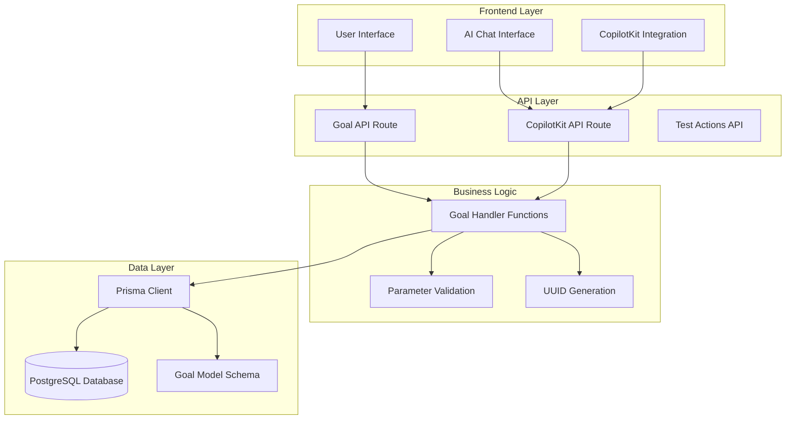
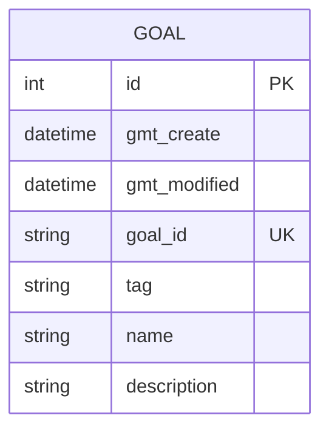
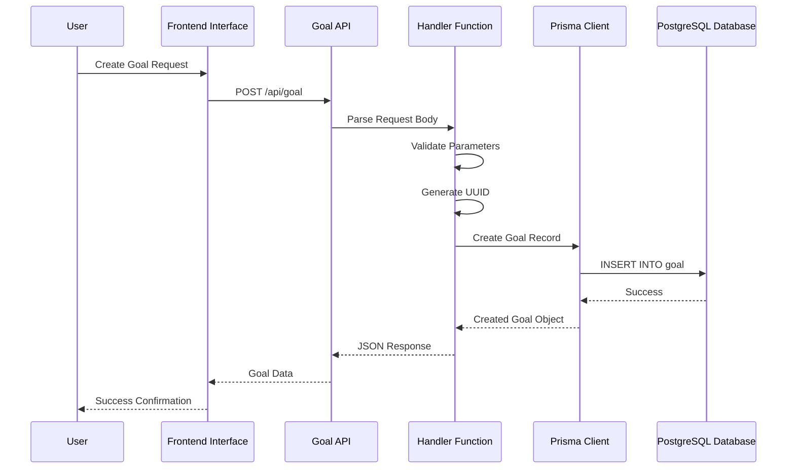
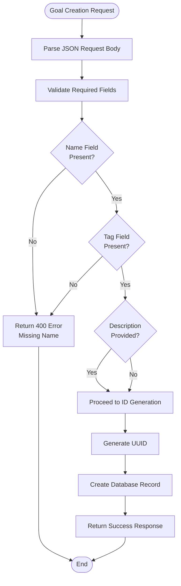
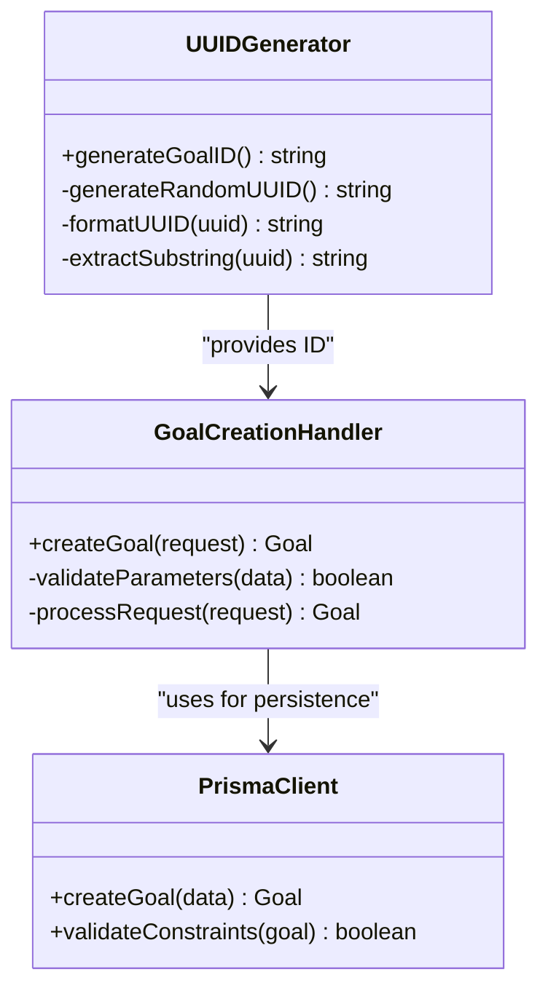
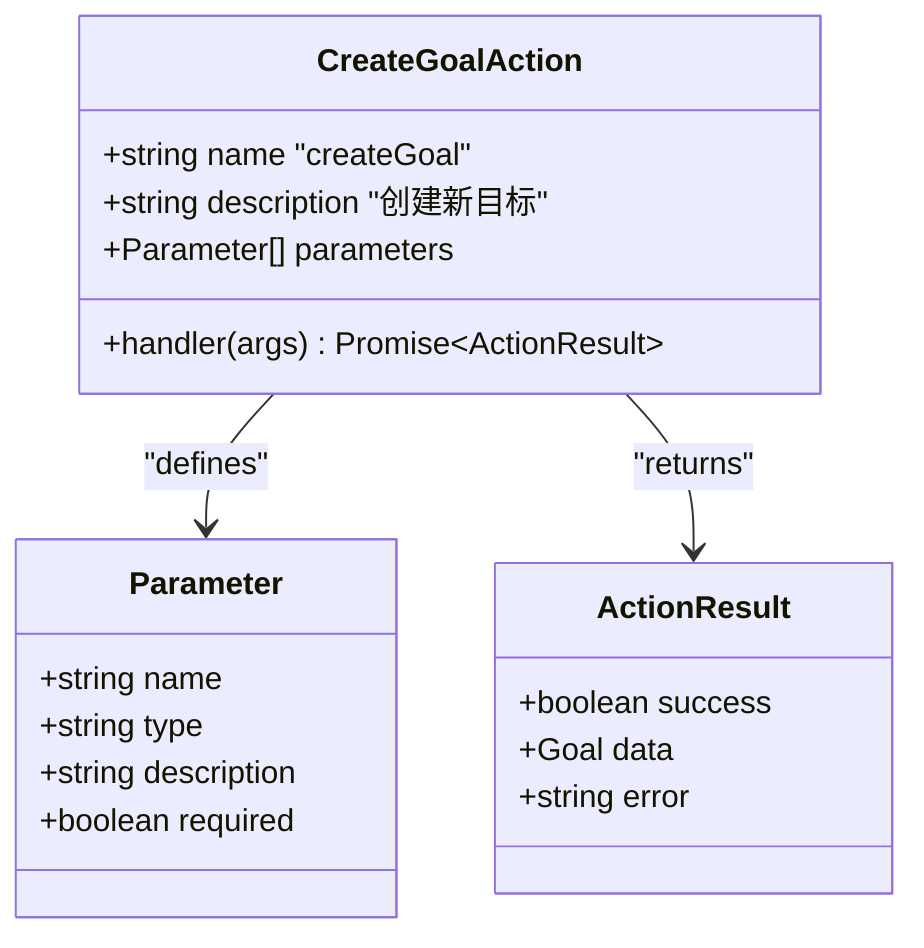
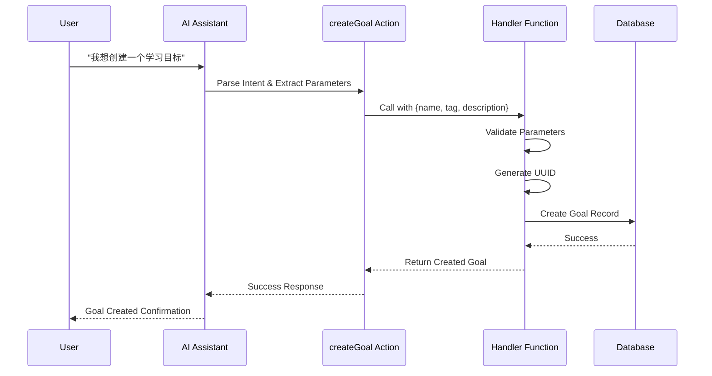

# Goal Creation Action

<cite>
**Referenced Files in This Document**
- [route.ts](file://src/app/api/goal/route.ts)
- [route.ts](file://src/app/api/copilotkit/route.ts)
- [schema.prisma](file://prisma/schema.prisma)
- [page.tsx](file://src/app/copilotkit/page.tsx)
- [chat-wrapper.tsx](file://src/components/chat-wrapper.tsx)
- [setup.md](file://setup.md)
- [README.md](file://README.md)
</cite>

## Table of Contents
1. [Introduction](#introduction)
2. [Project Structure](#project-structure)
3. [Core Components](#core-components)
4. [Architecture Overview](#architecture-overview)
5. [Detailed Component Analysis](#detailed-component-analysis)
6. [Dependency Analysis](#dependency-analysis)
7. [Performance Considerations](#performance-considerations)
8. [Troubleshooting Guide](#troubleshooting-guide)
9. [Conclusion](#conclusion)

## Introduction

The Goal Creation Action system is a core component of the Goal Mate AI intelligent goal management platform. This system enables users to create new goals through both traditional API endpoints and AI-powered natural language interactions. The system integrates seamlessly with the CopilotKit AI framework, allowing users to create goals through conversational interfaces while maintaining robust backend validation and database persistence.

The goal creation workflow supports two primary interaction modes:
- **Direct API Integration**: Traditional REST API calls for programmatic goal creation
- **AI-Powered Conversations**: Natural language interactions through the CopilotKit AI assistant

## Project Structure

The goal creation system spans multiple architectural layers within the Goal Mate application:



**Diagram sources**
- [route.ts:1-51](file://src/app/api/goal/route.ts#L1-L51)
- [route.ts:438-481](file://src/app/api/copilotkit/route.ts#L438-L481)
- [schema.prisma:16-24](file://prisma/schema.prisma#L16-L24)

**Section sources**
- [route.ts:1-51](file://src/app/api/goal/route.ts#L1-L51)
- [route.ts:1-800](file://src/app/api/copilotkit/route.ts#L1-L800)
- [schema.prisma:1-72](file://prisma/schema.prisma#L1-L72)

## Core Components

### Goal Model Structure

The goal system is built around a well-defined data model that ensures data integrity and consistency:



**Diagram sources**
- [schema.prisma:16-24](file://prisma/schema.prisma#L16-L24)

The goal model includes the following key attributes:

- **id**: Auto-incrementing primary key for internal database identification
- **gmt_create**: Automatic timestamp tracking goal creation time
- **gmt_modified**: Automatic timestamp tracking last modification time
- **goal_id**: Unique identifier with format `goal_[10-character-hex-string]`
- **tag**: Required category/tag for goal classification
- **name**: Required goal title or description
- **description**: Optional detailed explanation or context

### API Endpoints

The system provides dual API interfaces for goal creation:

#### Direct API Endpoint
- **Method**: POST `/api/goal`
- **Purpose**: Standard REST API for programmatic goal creation
- **Response**: Returns the created goal object with generated ID

#### AI-Powered Endpoint
- **Method**: POST `/api/copilotkit`
- **Action**: `createGoal`
- **Purpose**: Natural language goal creation through AI assistant
- **Response**: Structured success/error response with created goal data

**Section sources**
- [route.ts:26-31](file://src/app/api/goal/route.ts#L26-L31)
- [route.ts:438-481](file://src/app/api/copilotkit/route.ts#L438-L481)
- [schema.prisma:16-24](file://prisma/schema.prisma#L16-L24)

## Architecture Overview

The goal creation system follows a layered architecture pattern with clear separation of concerns:



**Diagram sources**
- [route.ts:26-31](file://src/app/api/goal/route.ts#L26-L31)
- [route.ts:27-30](file://src/app/api/goal/route.ts#L27-L30)

The architecture ensures:
- **Separation of Concerns**: Clear distinction between API routing, business logic, and data persistence
- **Validation Layer**: Parameter validation occurs before database operations
- **Error Handling**: Comprehensive error handling with meaningful error messages
- **Consistent Response Format**: Standardized response structure across all endpoints

## Detailed Component Analysis

### Goal Creation Handler Implementation

The goal creation handler implements a robust workflow for processing goal creation requests:

#### Parameter Validation Process

The handler performs essential validation checks before processing requests:



**Diagram sources**
- [route.ts:26-31](file://src/app/api/goal/route.ts#L26-L31)

#### UUID Generation Strategy

The system employs a sophisticated UUID generation approach:



**Diagram sources**
- [route.ts](file://src/app/api/goal/route.ts#L29)
- [route.ts](file://src/app/api/copilotkit/route.ts#L468)

The UUID generation strategy creates identifiers with the format `goal_[10-character-hex-string]`:
- Uses `crypto.randomUUID()` for cryptographically secure randomness
- Removes hyphens with `replace(/-/g, '')`
- Extracts first 10 characters with `substring(0, 10)`
- Prefixes with `goal_` for clear identification

#### Database Insertion Logic

The database insertion process follows these steps:

1. **Data Preparation**: Combines incoming request data with generated `goal_id`
2. **Constraint Validation**: Ensures uniqueness of `goal_id` and other constraints
3. **Transaction Management**: Handles database operations atomically
4. **Timestamp Management**: Automatically sets creation and modification timestamps
5. **Response Formatting**: Returns standardized success response with created data

**Section sources**
- [route.ts:26-31](file://src/app/api/goal/route.ts#L26-L31)
- [route.ts:462-480](file://src/app/api/copilotkit/route.ts#L462-L480)

### AI System Integration

The goal creation action integrates seamlessly with the CopilotKit AI system:

#### Action Definition

The AI action is defined with comprehensive parameter specifications:



**Diagram sources**
- [route.ts:438-481](file://src/app/api/copilotkit/route.ts#L438-L481)

#### AI Workflow Integration

The AI system processes user requests through a structured workflow:



**Diagram sources**
- [route.ts:462-480](file://src/app/api/copilotkit/route.ts#L462-L480)

**Section sources**
- [route.ts:438-481](file://src/app/api/copilotkit/route.ts#L438-L481)
- [page.tsx:12-26](file://src/app/copilotkit/page.tsx#L12-L26)

### Practical Usage Examples

#### Example 1: Direct API Usage

```javascript
// Basic goal creation
const response = await fetch('/api/goal', {
  method: 'POST',
  headers: {
    'Content-Type': 'application/json',
  },
  body: JSON.stringify({
    name: "学习深度学习",
    tag: "learning",
    description: "掌握深度学习基础理论和实践技能"
  })
});

const goal = await response.json();
console.log('Created goal:', goal.goal_id);
```

#### Example 2: AI-Assisted Creation

```javascript
// Through AI assistant
const aiResponse = await fetch('/api/copilotkit', {
  method: 'POST',
  headers: {
    'Content-Type': 'application/json',
  },
  body: JSON.stringify({
    action: 'createGoal',
    args: {
      name: "完成项目文档",
      tag: "work",
      description: "整理项目技术文档和用户手册"
    }
  })
});
```

#### Example 3: Advanced Usage with Error Handling

```javascript
try {
  const response = await fetch('/api/goal', {
    method: 'POST',
    headers: {
      'Content-Type': 'application/json',
    },
    body: JSON.stringify({
      name: "学习React Hooks",
      tag: "programming",
      description: "深入理解React Hooks的工作原理和最佳实践"
    })
  });

  if (!response.ok) {
    throw new Error(`HTTP error! status: ${response.status}`);
  }

  const goal = await response.json();
  console.log('Goal created successfully:', goal.goal_id);

} catch (error) {
  console.error('Failed to create goal:', error.message);
  // Handle error appropriately
}
```

**Section sources**
- [route.ts:26-31](file://src/app/api/goal/route.ts#L26-L31)
- [route.ts:462-480](file://src/app/api/copilotkit/route.ts#L462-L480)

## Dependency Analysis

The goal creation system has well-defined dependencies that ensure maintainability and scalability:

```mermaid
graph TD
subgraph "External Dependencies"
Crypto[crypto.randomUUID]
Prisma[@prisma/client]
NextJS[next/server]
end
subgraph "Internal Dependencies"
GoalRoute[src/app/api/goal/route.ts]
CopilotRoute[src/app/api/copilotkit/route.ts]
Schema[prisma/schema.prisma]
Utils[Utility Functions]
end
subgraph "Runtime Dependencies"
Database[PostgreSQL]
Environment[Environment Variables]
end
GoalRoute --> Prisma
GoalRoute --> NextJS
GoalRoute --> Crypto
CopilotRoute --> Prisma
CopilotRoute --> NextJS
CopilotRoute --> Crypto
Prisma --> Schema
Prisma --> Database
GoalRoute --> Environment
CopilotRoute --> Environment
```

**Diagram sources**
- [route.ts:1-5](file://src/app/api/goal/route.ts#L1-L5)
- [route.ts:1-11](file://src/app/api/copilotkit/route.ts#L1-L11)
- [schema.prisma:1-14](file://prisma/schema.prisma#L1-L14)

### Key Dependencies Analysis

| Component | Purpose | Version/Implementation |
|-----------|---------|----------------------|
| crypto.randomUUID | Cryptographically secure UUID generation | Built-in Node.js module |
| @prisma/client | Database ORM and type safety | Prisma Client |
| next/server | Next.js API route utilities | Next.js framework |
| PostgreSQL | Persistent storage | Database engine |

**Section sources**
- [route.ts:1-5](file://src/app/api/goal/route.ts#L1-L5)
- [route.ts:1-11](file://src/app/api/copilotkit/route.ts#L1-L11)
- [schema.prisma:11-14](file://prisma/schema.prisma#L11-L14)

## Performance Considerations

### Database Performance

The goal creation system is optimized for performance through several mechanisms:

- **Connection Pooling**: Prisma manages database connections efficiently
- **Atomic Operations**: Single transaction for ID generation and database insertion
- **Index Optimization**: Unique constraint on `goal_id` ensures fast lookups
- **Minimal Payload**: Only essential fields are stored and transmitted

### Memory Management

- **Stream Processing**: Large payloads are processed incrementally
- **Garbage Collection**: Automatic memory cleanup after request completion
- **Resource Limits**: Configurable limits prevent resource exhaustion

### Scalability Factors

- **Horizontal Scaling**: Stateless design allows easy horizontal scaling
- **Database Sharding**: Potential for future sharding based on `goal_id`
- **Caching Strategy**: Response caching for frequently accessed goals

## Troubleshooting Guide

### Common Issues and Solutions

#### Issue 1: Missing Required Parameters
**Symptoms**: HTTP 400 error with validation failure
**Causes**: Missing `name` or `tag` fields in request
**Solution**: Ensure both `name` and `tag` are provided in the request body

#### Issue 2: Duplicate Goal ID
**Symptoms**: Database constraint violation error
**Causes**: UUID collision (extremely rare)
**Solution**: System automatically generates new UUID; retry request

#### Issue 3: Database Connection Failure
**Symptoms**: Internal server error (500)
**Causes**: Database connectivity issues
**Solution**: Check database connection string and credentials

#### Issue 4: AI Action Timeout
**Symptoms**: AI action fails with timeout error
**Solution**: Verify AI service availability and network connectivity

### Error Response Format

All error responses follow a consistent format:

```json
{
  "success": false,
  "error": "Error message describing the issue"
}
```

### Debugging Tips

1. **Enable Logging**: Check server logs for detailed error information
2. **Validate Input**: Use the AI assistant to validate parameter formats
3. **Test Connectivity**: Verify database and AI service connectivity
4. **Monitor Resources**: Check system resources during peak usage

**Section sources**
- [route.ts:45-51](file://src/app/api/goal/route.ts#L45-L51)
- [route.ts:476-479](file://src/app/api/copilotkit/route.ts#L476-L479)

## Conclusion

The Goal Creation Action system represents a robust, scalable solution for goal management within the Goal Mate platform. The system successfully combines traditional API patterns with modern AI integration, providing users with flexible and intuitive goal creation capabilities.

Key strengths of the implementation include:

- **Dual Interface Design**: Supports both direct API usage and AI-powered interactions
- **Robust Validation**: Comprehensive parameter validation ensures data integrity
- **Secure ID Generation**: Cryptographically secure UUID generation prevents collisions
- **Flexible Architecture**: Modular design allows for easy extension and maintenance
- **Consistent Error Handling**: Standardized error responses improve developer experience

The system's integration with the CopilotKit AI framework demonstrates the potential for intelligent automation in goal management workflows, enabling users to create goals through natural language conversations while maintaining the reliability and performance of traditional API patterns.

Future enhancements could include advanced validation rules, batch creation capabilities, and integration with external goal management systems. The current architecture provides a solid foundation for these extensions while maintaining backward compatibility and system stability.