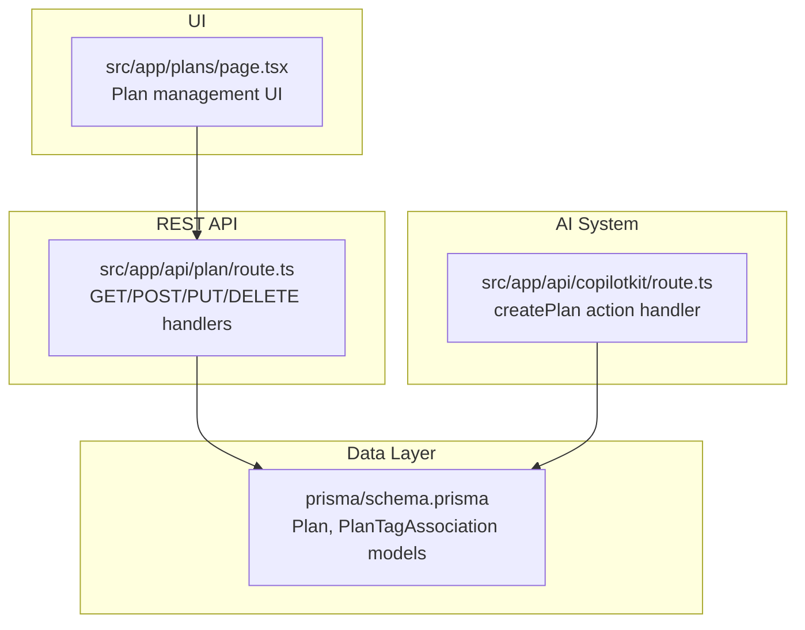
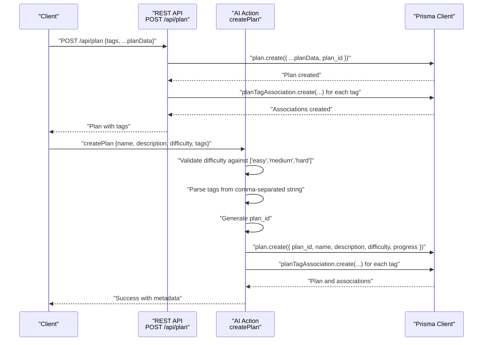
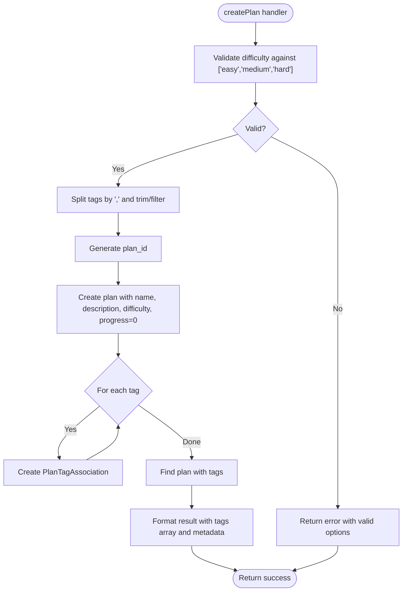
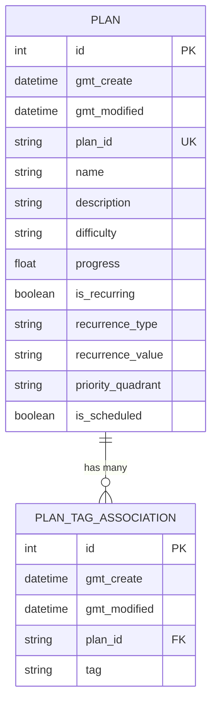
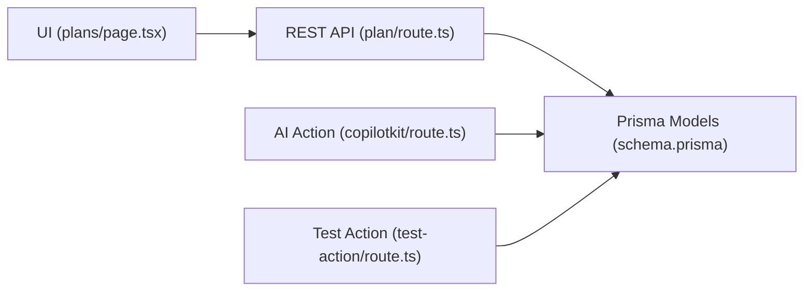

# Plan Creation Action

<cite>
**Referenced Files in This Document**
- [route.ts](file://src/app/api/plan/route.ts)
- [route.ts](file://src/app/api/copilotkit/route.ts)
- [schema.prisma](file://prisma/schema.prisma)
- [page.tsx](file://src/app/plans/page.tsx)
- [route.ts](file://src/app/api/test-action/route.ts)
</cite>

## Table of Contents
1. [Introduction](#introduction)
2. [Project Structure](#project-structure)
3. [Core Components](#core-components)
4. [Architecture Overview](#architecture-overview)
5. [Detailed Component Analysis](#detailed-component-analysis)
6. [Dependency Analysis](#dependency-analysis)
7. [Performance Considerations](#performance-considerations)
8. [Troubleshooting Guide](#troubleshooting-guide)
9. [Conclusion](#conclusion)

## Introduction
This document explains the plan creation action system in Goal Mate, focusing on the createPlan action implementation. It covers parameter validation, difficulty value checking against standard options, tag processing and association creation, unique ID generation, and the handler's complex workflow. It also details the integration with the AI system for plan management, including how validation and association patterns maintain data integrity.

## Project Structure
The plan creation action is implemented in two primary locations:
- REST API endpoint for direct plan creation and updates
- AI-driven CopilotKit action for natural-language plan creation

**Diagram sources**
- [route.ts:1-114](file://src/app/api/plan/route.ts#L1-L114)
- [route.ts:520-614](file://src/app/api/copilotkit/route.ts#L520-L614)
- [schema.prisma:26-51](file://prisma/schema.prisma#L26-L51)
- [page.tsx:1-807](file://src/app/plans/page.tsx#L1-L807)

**Section sources**
- [route.ts:1-114](file://src/app/api/plan/route.ts#L1-L114)
- [route.ts:520-614](file://src/app/api/copilotkit/route.ts#L520-L614)
- [schema.prisma:26-51](file://prisma/schema.prisma#L26-L51)
- [page.tsx:1-807](file://src/app/plans/page.tsx#L1-L807)

## Core Components
- Plan model and associations: The Plan entity stores plan metadata and links to tags via PlanTagAssociation. The schema defines plan_id as a unique identifier and supports tags and progress records.
- REST endpoint: Provides CRUD operations for plans, including plan creation with automatic unique ID generation and tag association creation.
- AI action: Implements the createPlan action with validation, tag parsing, unique ID generation, plan creation, and association establishment, returning comprehensive metadata.

Key implementation highlights:
- Unique ID generation: Both REST and AI handlers generate plan_id using a UUID-based scheme.
- Tag processing: Tags are parsed from comma-separated strings and associated with the plan.
- Validation: Difficulty values are validated against standard options.
- Metadata formatting: Results include enriched metadata for downstream consumption.

**Section sources**
- [schema.prisma:26-51](file://prisma/schema.prisma#L26-L51)
- [route.ts:69-83](file://src/app/api/plan/route.ts#L69-L83)
- [route.ts:550-614](file://src/app/api/copilotkit/route.ts#L550-L614)

## Architecture Overview
The plan creation action integrates REST and AI pathways, both converging on the same data model and validation logic.

**Diagram sources**
- [route.ts:69-83](file://src/app/api/plan/route.ts#L69-L83)
- [route.ts:550-614](file://src/app/api/copilotkit/route.ts#L550-L614)
- [schema.prisma:26-51](file://prisma/schema.prisma#L26-L51)

## Detailed Component Analysis

### REST Endpoint: POST /api/plan
The REST endpoint handles direct plan creation with the following workflow:
- Extract payload: Separate tags from plan data.
- Create plan: Persist plan with generated unique plan_id.
- Create associations: For each tag, create a PlanTagAssociation record linking the plan to the tag.
- Respond: Return the created plan.

Validation and processing:
- Parameter extraction: The endpoint expects a JSON payload containing tags and plan fields.
- Unique ID generation: Uses a UUID-based scheme to produce plan_id.
- Tag association: Creates associations for each provided tag.

Result formatting:
- Returns the created plan object. The UI layer transforms this to include tag arrays for display.

**Section sources**
- [route.ts:69-83](file://src/app/api/plan/route.ts#L69-L83)

### AI Action: createPlan
The AI-driven createPlan action enforces stricter validation and richer metadata:
- Parameter validation:
  - Difficulty must be one of the standard options: easy, medium, hard.
  - Tags must be provided as a comma-separated string.
- Tag processing:
  - Split by comma, trim whitespace, filter empty entries.
- Unique ID generation:
  - Generates plan_id using a UUID-based scheme.
- Plan creation:
  - Creates the plan with name, description, difficulty, and progress initialized to zero.
- Association establishment:
  - Creates a PlanTagAssociation record for each processed tag.
- Result formatting:
  - Queries the plan with tags included.
  - Returns a structured result with enriched metadata and a formatted message.

**Diagram sources**
- [route.ts:550-614](file://src/app/api/copilotkit/route.ts#L550-L614)
- [schema.prisma:26-51](file://prisma/schema.prisma#L26-L51)

**Section sources**
- [route.ts:550-614](file://src/app/api/copilotkit/route.ts#L550-L614)

### Data Model and Associations
The Prisma schema defines:
- Plan: Contains plan_id (unique), name, description, difficulty, progress, scheduling, and relations to tags and progress records.
- PlanTagAssociation: Links plans to tags with a composite plan_id and tag field.

**Diagram sources**
- [schema.prisma:26-51](file://prisma/schema.prisma#L26-L51)

**Section sources**
- [schema.prisma:26-51](file://prisma/schema.prisma#L26-L51)

### UI Integration and Usage Patterns
The Plan management UI demonstrates practical usage patterns:
- Creating plans with tags: Users can select existing tags or enter new ones; the UI sends tags as an array to the REST endpoint.
- Filtering and sorting: The UI supports filtering by difficulty, tags, and other criteria, aligning with backend query capabilities.
- Practical examples:
  - Easy reading plan with tags "reading,book".
  - Medium study plan with tags "study,programming".
  - Hard project plan with tags "work,project".

These examples illustrate how tags are processed and associated during plan creation.

**Section sources**
- [page.tsx:1-807](file://src/app/plans/page.tsx#L1-L807)

## Dependency Analysis
The system exhibits clear separation of concerns:
- REST endpoint depends on Prisma models for persistence.
- AI action depends on Prisma models and implements validation and formatting logic.
- UI depends on REST endpoint for plan operations.

**Diagram sources**
- [page.tsx:1-807](file://src/app/plans/page.tsx#L1-L807)
- [route.ts:1-114](file://src/app/api/plan/route.ts#L1-L114)
- [route.ts:520-614](file://src/app/api/copilotkit/route.ts#L520-L614)
- [route.ts:1-153](file://src/app/api/test-action/route.ts#L1-L153)
- [schema.prisma:26-51](file://prisma/schema.prisma#L26-L51)

**Section sources**
- [page.tsx:1-807](file://src/app/plans/page.tsx#L1-L807)
- [route.ts:1-114](file://src/app/api/plan/route.ts#L1-L114)
- [route.ts:520-614](file://src/app/api/copilotkit/route.ts#L520-L614)
- [route.ts:1-153](file://src/app/api/test-action/route.ts#L1-L153)
- [schema.prisma:26-51](file://prisma/schema.prisma#L26-L51)

## Performance Considerations
- Batch tag creation: The REST endpoint uses Promise.all to create associations concurrently, reducing latency when many tags are provided.
- Query efficiency: The UI fetches a large list and performs local filtering/sorting, minimizing repeated network requests.
- AI action overhead: The AI action performs validation and association creation synchronously; consider batching for high-volume scenarios.

## Troubleshooting Guide
Common issues and resolutions:
- Invalid difficulty value:
  - Symptom: AI action returns an error indicating invalid difficulty.
  - Resolution: Ensure difficulty is one of the standard options: easy, medium, hard.
- Malformed tags:
  - Symptom: Unexpected tag associations or missing tags.
  - Resolution: Provide tags as a comma-separated string; the AI action trims and filters entries.
- Missing plan_id:
  - Symptom: REST DELETE fails with a 400 error.
  - Resolution: Ensure plan_id is present in the query parameters.
- Duplicate or conflicting tags:
  - Symptom: Unexpected duplicates in tag lists.
  - Resolution: Prefer existing tags obtained via getSystemOptions to avoid duplicates.

**Section sources**
- [route.ts:555-563](file://src/app/api/copilotkit/route.ts#L555-L563)
- [route.ts:107-114](file://src/app/api/plan/route.ts#L107-L114)

## Conclusion
The plan creation action system combines robust validation, standardized difficulty options, precise tag processing, and unique ID generation. Both REST and AI pathways converge on the same data model and validation logic, ensuring consistent behavior and data integrity. The AI action adds rich metadata and structured responses, while the REST endpoint provides straightforward CRUD operations. Together, they support practical examples such as reading, study, and project plans with various tag configurations, maintaining data integrity through strict validation and association patterns.