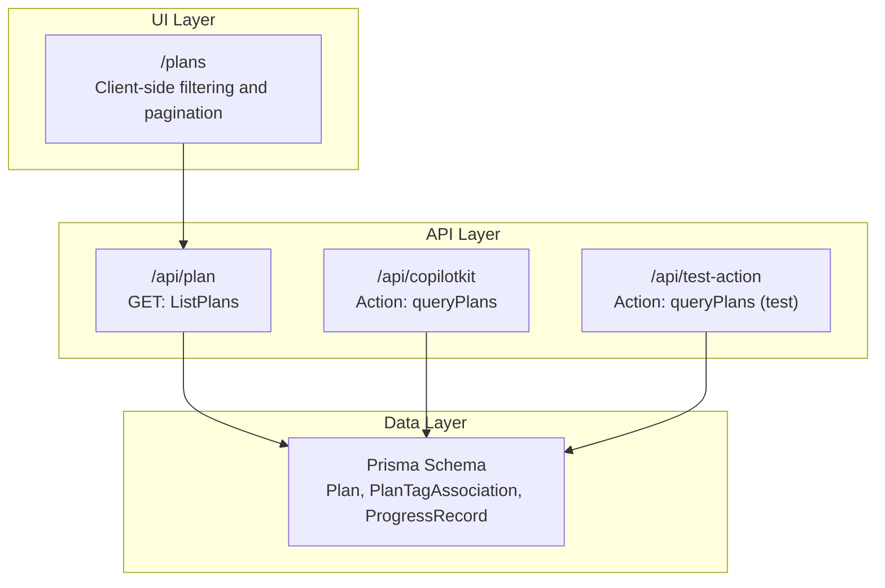
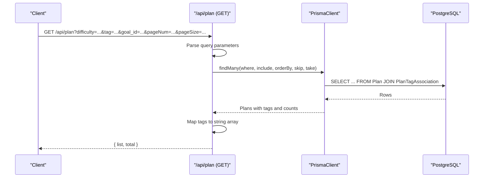
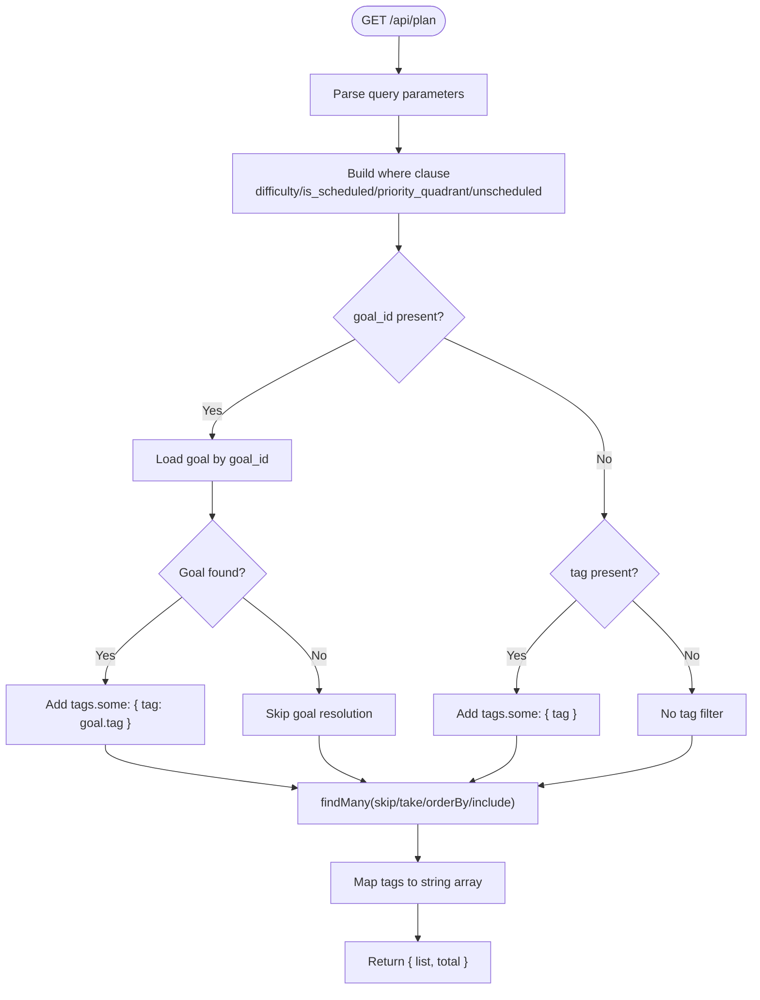
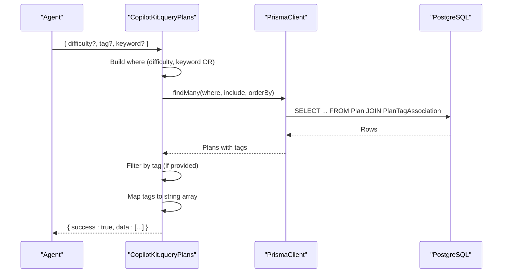
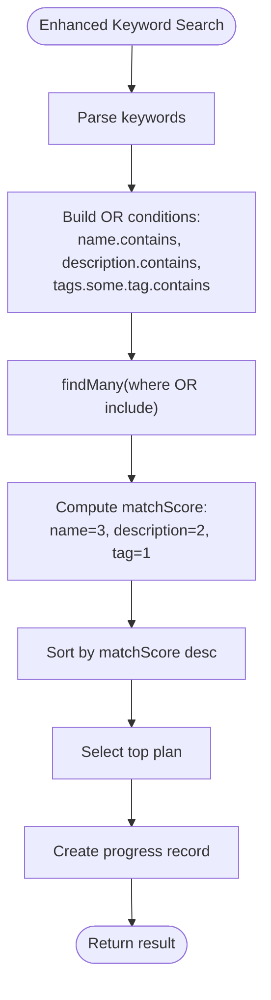
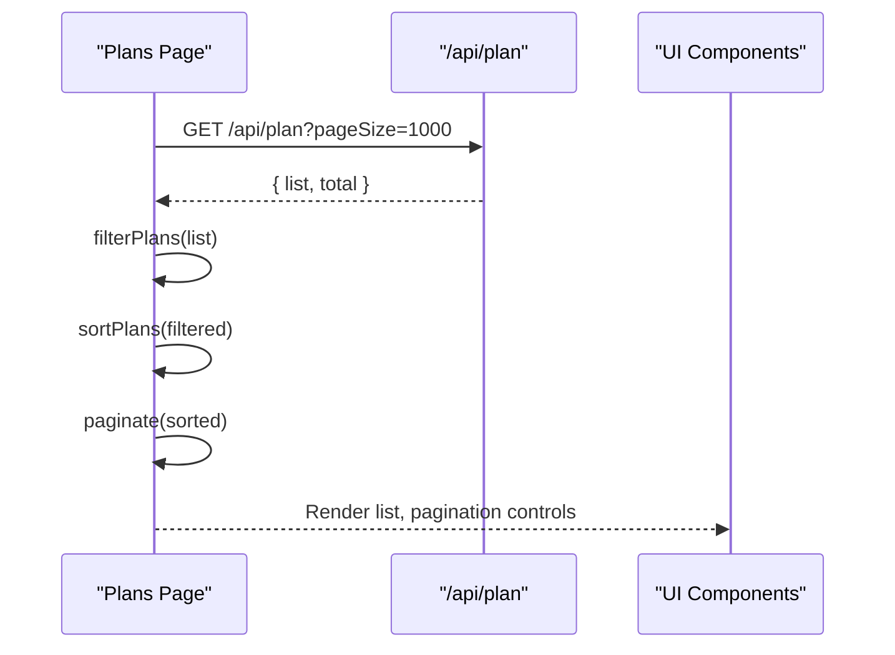
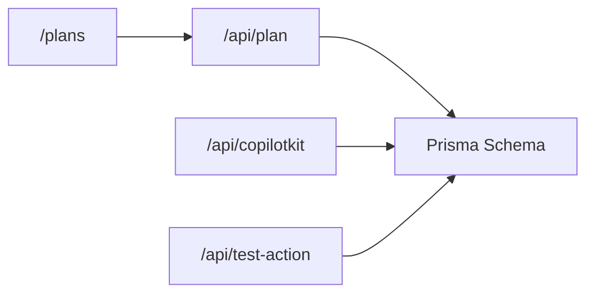

# Plan Query Action

<cite>
**Referenced Files in This Document**
- [route.ts](file://src/app/api/plan/route.ts)
- [route.ts](file://src/app/api/copilotkit/route.ts)
- [schema.prisma](file://prisma/schema.prisma)
- [page.tsx](file://src/app/plans/page.tsx)
- [route.ts](file://src/app/api/test-action/route.ts)
</cite>

## Table of Contents
1. [Introduction](#introduction)
2. [Project Structure](#project-structure)
3. [Core Components](#core-components)
4. [Architecture Overview](#architecture-overview)
5. [Detailed Component Analysis](#detailed-component-analysis)
6. [Dependency Analysis](#dependency-analysis)
7. [Performance Considerations](#performance-considerations)
8. [Troubleshooting Guide](#troubleshooting-guide)
9. [Conclusion](#conclusion)

## Introduction
This document explains the plan query action system that powers plan discovery and management in the AI workflow. It covers:
- The queryPlans action implementation with difficulty filtering, tag-based filtering, and keyword search
- Parameter processing, Prisma query construction with OR conditions, and result formatting
- Database interaction patterns for retrieving plans with associated tags and ordering by creation date
- Practical examples of query scenarios with various filter combinations
- The action’s role in the AI workflow and how it supports plan discovery and management
- Query optimization and performance considerations for complex searches

## Project Structure
The plan query system spans multiple layers:
- API routes for plan CRUD and AI actions
- Prisma schema defining Plan, PlanTagAssociation, and ProgressRecord models
- Frontend page that consumes the plan API and performs client-side filtering
- Test action route demonstrating a minimal queryPlans implementation

**Diagram sources**
- [route.ts:1-114](file://src/app/api/plan/route.ts#L1-L114)
- [route.ts:370-436](file://src/app/api/copilotkit/route.ts#L370-L436)
- [route.ts:1-29](file://src/app/api/test-action/route.ts#L1-L29)
- [schema.prisma:26-51](file://prisma/schema.prisma#L26-L51)
- [page.tsx:141-163](file://src/app/plans/page.tsx#L141-L163)

**Section sources**
- [route.ts:1-114](file://src/app/api/plan/route.ts#L1-L114)
- [route.ts:370-436](file://src/app/api/copilotkit/route.ts#L370-L436)
- [route.ts:1-29](file://src/app/api/test-action/route.ts#L1-L29)
- [schema.prisma:26-51](file://prisma/schema.prisma#L26-L51)
- [page.tsx:141-163](file://src/app/plans/page.tsx#L141-L163)

## Core Components
- Plan API route: Implements GET queryPlans with pagination, filters, and result formatting
- CopilotKit action: Provides AI-driven queryPlans with keyword search and scoring
- Prisma schema: Defines Plan, PlanTagAssociation, and ProgressRecord relationships
- Frontend plans page: Fetches all plans and applies client-side filtering and pagination
- Test action route: Demonstrates a minimal queryPlans implementation for testing

Key capabilities:
- Difficulty filtering
- Tag-based filtering (including goal-based tag filtering)
- Keyword search across name, description, and tags
- Pagination and ordering by creation date
- Result formatting to expose tags as a string array

**Section sources**
- [route.ts:7-67](file://src/app/api/plan/route.ts#L7-L67)
- [route.ts:370-436](file://src/app/api/copilotkit/route.ts#L370-L436)
- [schema.prisma:26-51](file://prisma/schema.prisma#L26-L51)
- [page.tsx:115-163](file://src/app/plans/page.tsx#L115-L163)
- [route.ts:13-29](file://src/app/api/test-action/route.ts#L13-L29)

## Architecture Overview
The plan query system integrates API routes, Prisma ORM, and UI components. Two primary query paths exist:
- REST API: Server-side filtering and pagination
- AI Action: Keyword-based search with scoring and additional tag filtering

**Diagram sources**
- [route.ts:8-67](file://src/app/api/plan/route.ts#L8-L67)
- [schema.prisma:26-51](file://prisma/schema.prisma#L26-L51)

## Detailed Component Analysis

### REST API: GET /api/plan (ListPlans)
- Purpose: Retrieve paginated plans with optional filters and include associated tags and latest progress records
- Filters:
  - difficulty: exact match
  - is_scheduled: boolean (true/false)
  - priority_quadrant: exact match
  - unscheduled: boolean flag that sets is_scheduled=false
  - goal_id: resolves to goal.tag and filters plans with that tag
  - tag: filters plans containing the given tag
- Pagination: pageNum and pageSize with skip/take
- Ordering: gmt_create descending
- Result formatting: maps tags to a string array for easy consumption

**Diagram sources**
- [route.ts:8-67](file://src/app/api/plan/route.ts#L8-L67)

**Section sources**
- [route.ts:8-67](file://src/app/api/plan/route.ts#L8-L67)

### AI Action: queryPlans (CopilotKit)
- Purpose: AI-driven plan discovery with keyword search and scoring
- Parameters:
  - difficulty: optional
  - tag: optional
  - keyword: optional
- Behavior:
  - Builds where clause with difficulty and keyword (OR across name and description)
  - Executes findMany with include: { tags: true } and orderBy: { gmt_create: 'desc' }
  - Applies additional tag filtering client-side if tag is provided
  - Formats result by extracting tag strings
  - Returns success with data array

**Diagram sources**
- [route.ts:370-436](file://src/app/api/copilotkit/route.ts#L370-L436)
- [schema.prisma:26-51](file://prisma/schema.prisma#L26-L51)

**Section sources**
- [route.ts:370-436](file://src/app/api/copilotkit/route.ts#L370-L436)

### Enhanced Keyword Search with Scoring (CopilotKit)
- Purpose: Advanced keyword search that considers name, description, and tags with weighted scoring
- Behavior:
  - Constructs OR conditions across name, description, and tags.some.tag
  - Calculates matchScore based on keyword presence and weight
  - Sorts by matchScore descending and selects the top plan
  - Creates progress records for discovered plans

**Diagram sources**
- [route.ts:1290-1450](file://src/app/api/copilotkit/route.ts#L1290-L1450)
- [schema.prisma:26-51](file://prisma/schema.prisma#L26-L51)

**Section sources**
- [route.ts:1290-1450](file://src/app/api/copilotkit/route.ts#L1290-L1450)

### Frontend Integration: Client-Side Filtering
- Purpose: Provide interactive filtering and pagination for plan lists
- Behavior:
  - Fetches all plans (pageSize=1000) from the REST API
  - Applies client-side filters: name search, selected tags, difficulty, task type, progress
  - Sorts plans and paginates results
  - Supports highlighting a specific plan and adjusting pagination accordingly

**Diagram sources**
- [page.tsx:141-163](file://src/app/plans/page.tsx#L141-L163)
- [page.tsx:115-139](file://src/app/plans/page.tsx#L115-L139)

**Section sources**
- [page.tsx:115-163](file://src/app/plans/page.tsx#L115-L163)

### Test Action Route: Minimal queryPlans
- Purpose: Demonstrate a minimal queryPlans implementation for testing
- Behavior:
  - Retrieves plans with tags included
  - Maps tags to string array
  - Returns success with data and count

**Section sources**
- [route.ts:13-29](file://src/app/api/test-action/route.ts#L13-L29)

## Dependency Analysis
- Plan API depends on Prisma schema for Plan and PlanTagAssociation relations
- CopilotKit actions depend on Prisma for advanced queries and scoring
- Frontend depends on REST API for initial data load and client-side filtering
- Test action route demonstrates a simplified query pattern for validation

**Diagram sources**
- [route.ts:1-114](file://src/app/api/plan/route.ts#L1-L114)
- [route.ts:370-436](file://src/app/api/copilotkit/route.ts#L370-L436)
- [route.ts:1-29](file://src/app/api/test-action/route.ts#L1-L29)
- [schema.prisma:26-51](file://prisma/schema.prisma#L26-L51)
- [page.tsx:141-163](file://src/app/plans/page.tsx#L141-L163)

**Section sources**
- [route.ts:1-114](file://src/app/api/plan/route.ts#L1-L114)
- [route.ts:370-436](file://src/app/api/copilotkit/route.ts#L370-L436)
- [route.ts:1-29](file://src/app/api/test-action/route.ts#L1-L29)
- [schema.prisma:26-51](file://prisma/schema.prisma#L26-L51)
- [page.tsx:141-163](file://src/app/plans/page.tsx#L141-L163)

## Performance Considerations
- Indexing recommendations:
  - Add indexes on Plan.difficulty, Plan.priority_quadrant, Plan.is_scheduled, Plan.gmt_create
  - Add indexes on PlanTagAssociation.plan_id and PlanTagAssociation.tag for efficient tag lookups
- Query patterns:
  - Prefer server-side pagination (pageNum, pageSize) to limit payload sizes
  - Use include: { tags: true } judiciously; consider fetching only required fields if performance becomes an issue
  - For AI actions, consider limiting keyword search scope and applying early exits when no keywords are provided
- Caching:
  - Cache frequently accessed tag lists and system options to reduce repeated database queries
- Scoring:
  - For enhanced keyword search, consider precomputing keyword indices or materialized views if keyword matching becomes frequent and heavy
- Monitoring:
  - Track query latency and error rates for queryPlans endpoints and optimize based on observed usage patterns

[No sources needed since this section provides general guidance]

## Troubleshooting Guide
Common issues and resolutions:
- Empty results:
  - Verify filters: ensure difficulty, tag, and keyword values match stored data
  - Confirm goal_id exists if using goal-based tag filtering
- Unexpected pagination:
  - Check pageNum and pageSize values; ensure they are integers
  - Remember that total reflects filtered count, not raw plan count
- Tag mismatch:
  - Ensure tag values are exact matches; consider case-insensitive comparisons if needed
- Performance degradation:
  - Reduce pageSize for large datasets
  - Limit keyword search scope or disable keyword filtering temporarily
- Frontend filtering not working:
  - Confirm that tags are exposed as strings after API response formatting
  - Verify client-side filter logic aligns with backend filtering

**Section sources**
- [route.ts:8-67](file://src/app/api/plan/route.ts#L8-L67)
- [page.tsx:115-163](file://src/app/plans/page.tsx#L115-L163)

## Conclusion
The plan query action system provides robust plan discovery and management through:
- A flexible REST API with pagination, filters, and result formatting
- An AI-driven action with keyword search and scoring for intelligent plan selection
- A frontend that enables interactive filtering and pagination
- Clear database relationships that support efficient queries and joins

By combining server-side filtering with client-side refinement and AI-powered search, the system delivers both precision and flexibility for plan discovery and management within the AI workflow.