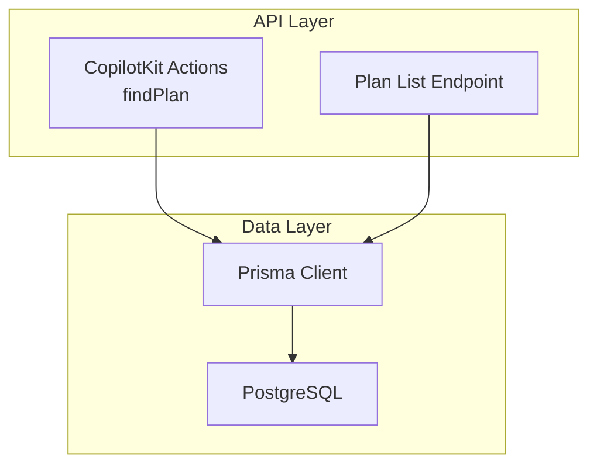
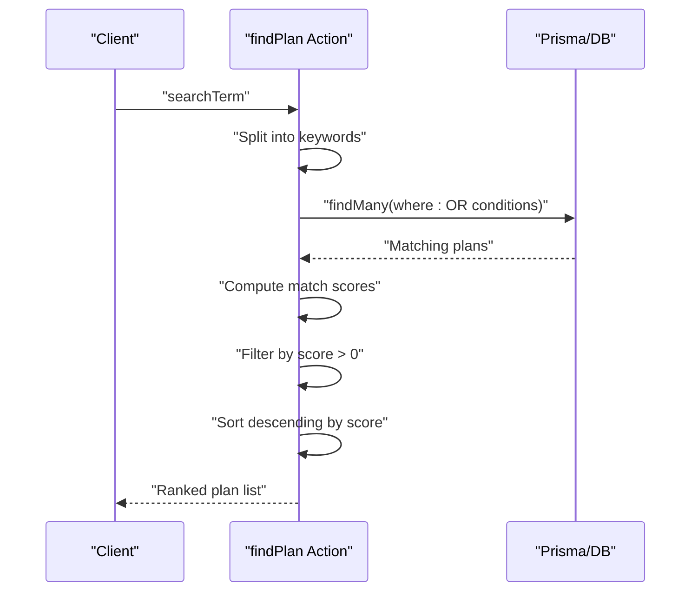
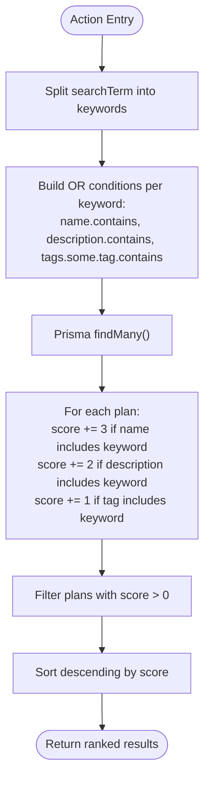
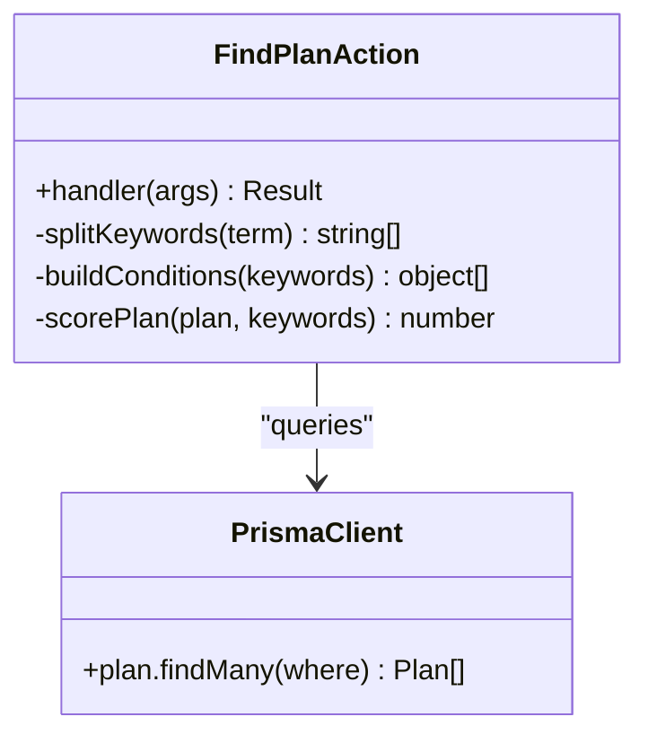
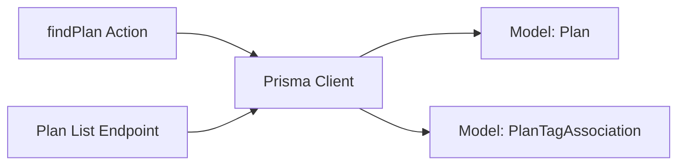

# Plan Search Action

<cite>
**Referenced Files in This Document**
- [route.ts](file://src/app/api/copilotkit/route.ts)
- [route.ts](file://src/app/api/plan/route.ts)
- [schema.prisma](file://prisma/schema.prisma)
</cite>

## Table of Contents
1. [Introduction](#introduction)
2. [Project Structure](#project-structure)
3. [Core Components](#core-components)
4. [Architecture Overview](#architecture-overview)
5. [Detailed Component Analysis](#detailed-component-analysis)
6. [Dependency Analysis](#dependency-analysis)
7. [Performance Considerations](#performance-considerations)
8. [Troubleshooting Guide](#troubleshooting-guide)
9. [Conclusion](#conclusion)

## Introduction
This document explains the plan search action system, focusing on the findPlan action implementation. It covers keyword splitting, fuzzy search logic, case-insensitive matching, and the match scoring algorithm that ranks results by relevance. Practical examples illustrate multi-keyword searches and scoring behavior, and the document concludes with performance considerations and optimization strategies for large datasets.

## Project Structure
The plan search functionality is implemented as part of the CopilotKit runtime actions. The relevant files are:
- CopilotKit actions endpoint: [route.ts](file://src/app/api/copilotkit/route.ts)
- Plan listing endpoint (used for comparison): [route.ts](file://src/app/api/plan/route.ts)
- Database schema: [schema.prisma](file://prisma/schema.prisma)

**Diagram sources**
- [route.ts:616-702](file://src/app/api/copilotkit/route.ts#L616-L702)
- [route.ts:8-67](file://src/app/api/plan/route.ts#L8-L67)
- [schema.prisma:26-42](file://prisma/schema.prisma#L26-L42)

**Section sources**
- [route.ts:616-702](file://src/app/api/copilotkit/route.ts#L616-L702)
- [route.ts:8-67](file://src/app/api/plan/route.ts#L8-L67)
- [schema.prisma:26-42](file://prisma/schema.prisma#L26-L42)

## Core Components
- findPlan action: Parses a search term into multiple keywords, performs case-insensitive fuzzy searches across plan name, description, and associated tags, and ranks results by a custom scoring algorithm.
- Plan listing endpoint: Provides paginated filtering by difficulty, tag, goal_id, scheduling flags, and priority quadrant. Useful for comparison and complementary filtering.

Key implementation highlights:
- Keyword extraction supports spaces, commas, and Chinese punctuation.
- Case-insensitive fuzzy matching via Prisma contains with insensitive mode.
- Scoring weights prioritize exact name matches, followed by description matches, then tag matches.
- Results are filtered to positive scores and sorted descending by score.

**Section sources**
- [route.ts:616-702](file://src/app/api/copilotkit/route.ts#L616-L702)
- [route.ts:8-67](file://src/app/api/plan/route.ts#L8-L67)

## Architecture Overview
The findPlan action orchestrates a multi-stage process:
1. Parse the search term into keywords.
2. Build OR conditions across name, description, and tags for each keyword.
3. Query the database for matching plans.
4. Compute a relevance score per plan based on keyword matches.
5. Filter and sort results by score.

**Diagram sources**
- [route.ts:616-702](file://src/app/api/copilotkit/route.ts#L616-L702)

## Detailed Component Analysis

### findPlan Action Implementation
The findPlan action performs:
- Keyword splitting using a regex that handles spaces and common punctuation.
- Building OR conditions for each keyword across name, description, and tags.
- Case-insensitive fuzzy matching using Prisma's contains with insensitive mode.
- Scoring algorithm that rewards exact name matches most, then description matches, then tag matches.
- Filtering out zero-score results and sorting descending by score.

**Diagram sources**
- [route.ts:616-702](file://src/app/api/copilotkit/route.ts#L616-L702)

**Section sources**
- [route.ts:616-702](file://src/app/api/copilotkit/route.ts#L616-L702)

### Handler Logic Details
- Keyword splitting: Uses a regex to split on whitespace and common separators, filtering empty tokens.
- Search conditions: For each keyword, generates three conditions (name, description, tags) combined with OR.
- Case-insensitive matching: Applies Prisma's insensitive mode for contains operations.
- Scoring: Accumulates score per keyword match across name, description, and tags.
- Ranking: Filters to positive scores and sorts descending.

**Diagram sources**
- [route.ts:616-702](file://src/app/api/copilotkit/route.ts#L616-L702)

**Section sources**
- [route.ts:616-702](file://src/app/api/copilotkit/route.ts#L616-L702)

### Practical Examples

Example 1: Multi-keyword search with exact name match
- Input: "CSAPP assembly"
- Behavior: Plans with "CSAPP" in name receive higher scores; plans with "assembly" in description or tags contribute less.
- Outcome: Highest-ranked plan is the one whose name contains "CSAPP".

Example 2: Mixed field matches
- Input: "reading book"
- Behavior: Exact name match for "reading" yields highest score; plans with "book" in description or tags contribute incrementally.
- Outcome: Plans are ordered by combined score, with name matches weighted highest.

Example 3: Tag-only match
- Input: "programming"
- Behavior: No exact name match; plans with "programming" in tags receive score increments.
- Outcome: Lower-scoring plans compared to name matches, but still included if score > 0.

These examples illustrate how the scoring algorithm prioritizes exact name matches, then description matches, and finally tag matches, enabling intuitive relevance ranking.

**Section sources**
- [route.ts:616-702](file://src/app/api/copilotkit/route.ts#L616-L702)

### Comparison with Plan Listing Endpoint
While findPlan focuses on fuzzy keyword search and relevance scoring, the plan listing endpoint provides structured filtering:
- Supports pagination, difficulty, tag, goal_id, scheduling flags, priority quadrant, and unscheduled filtering.
- Returns plans with tags flattened to string arrays and includes progress records.

Use findPlan when you need flexible keyword-based discovery; use the plan listing endpoint for precise filtering and structured retrieval.

**Section sources**
- [route.ts:8-67](file://src/app/api/plan/route.ts#L8-L67)

## Dependency Analysis
- findPlan depends on Prisma client for database queries.
- Plan listing endpoint also uses Prisma and returns enriched plan data with tags and progress records.
- Both endpoints share the Plan and PlanTagAssociation models defined in the schema.

**Diagram sources**
- [route.ts:616-702](file://src/app/api/copilotkit/route.ts#L616-L702)
- [route.ts:8-67](file://src/app/api/plan/route.ts#L8-L67)
- [schema.prisma:26-51](file://prisma/schema.prisma#L26-L51)

**Section sources**
- [route.ts:616-702](file://src/app/api/copilotkit/route.ts#L616-L702)
- [route.ts:8-67](file://src/app/api/plan/route.ts#L8-L67)
- [schema.prisma:26-51](file://prisma/schema.prisma#L26-L51)

## Performance Considerations
- Indexing: Ensure database indexes exist on frequently queried fields (name, description, tag). Without proper indexing, OR conditions across multiple fields can degrade performance on large datasets.
- Query complexity: Each keyword generates three conditions (name, description, tags). With N keywords, the OR clause grows linearly, increasing query cost.
- Scoring overhead: Computing scores client-side after fetching results adds CPU overhead proportional to plan count × keyword count.
- Pagination: For large datasets, consider combining findPlan with pagination or additional filters to limit result sets before scoring.

Recommendations:
- Add database indexes on plan.name, plan.description, and plan_tag_association.tag.
- Limit the number of keywords processed (e.g., cap at 5–10) to prevent excessive OR clauses.
- Apply pre-filtering (e.g., difficulty, tag, or goal_id) before fuzzy search to reduce candidate sets.
- Cache frequent search terms with their top-N results when appropriate.

[No sources needed since this section provides general guidance]

## Troubleshooting Guide
Common issues and resolutions:
- No results returned:
  - Verify searchTerm contains meaningful keywords; empty or overly broad terms may yield zero matches.
  - Confirm case-insensitive mode is applied; ensure tags and descriptions are populated.
- Unexpected ordering:
  - Check that scoring logic is applied consistently; ensure score computation occurs after initial filtering.
- Performance degradation:
  - Review database indexes on name, description, and tag fields.
  - Reduce keyword count or add pre-filters to limit result set size.

**Section sources**
- [route.ts:616-702](file://src/app/api/copilotkit/route.ts#L616-L702)

## Conclusion
The findPlan action delivers a robust, case-insensitive fuzzy search across plan names, descriptions, and tags, with a clear scoring mechanism that prioritizes exact name matches. By combining keyword splitting, OR-based conditions, and client-side scoring, it enables intuitive relevance ranking. For production use, ensure proper indexing, consider pre-filtering, and monitor performance as dataset scales.