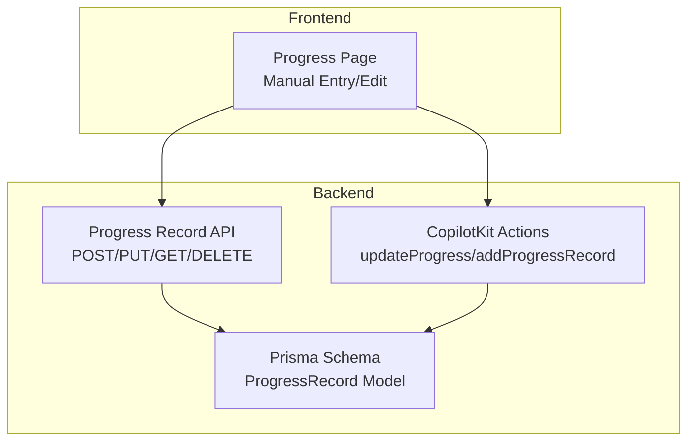
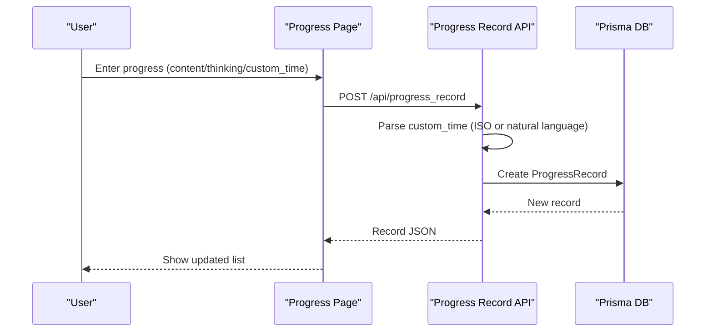
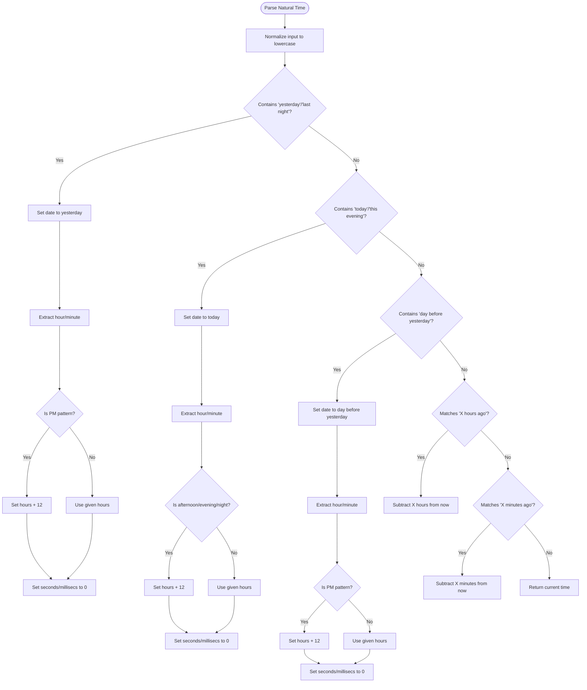
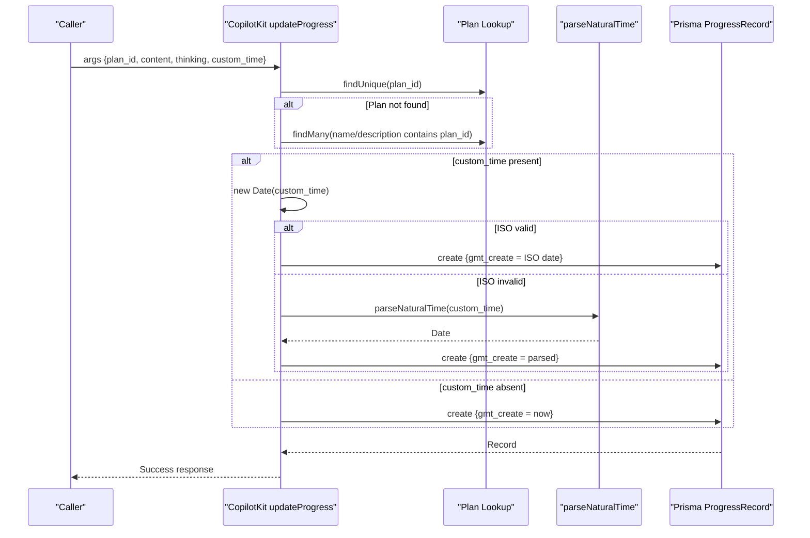
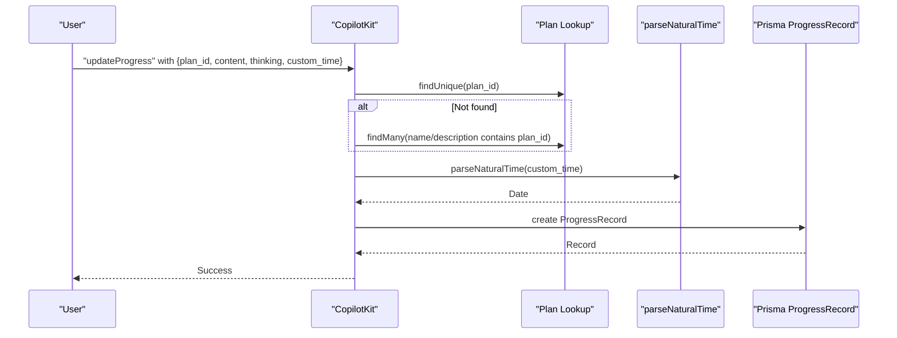
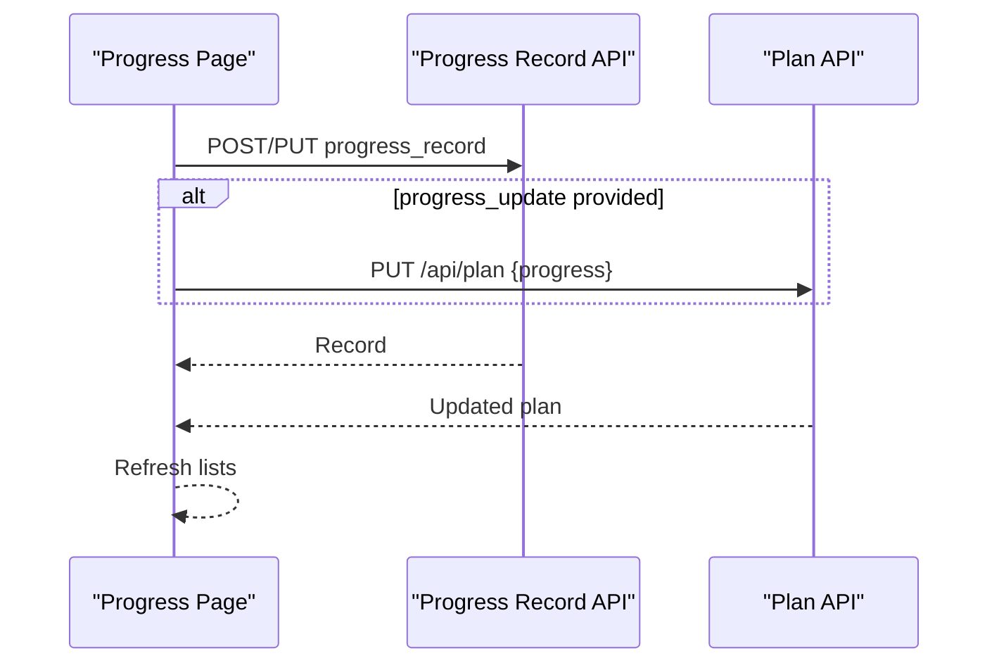
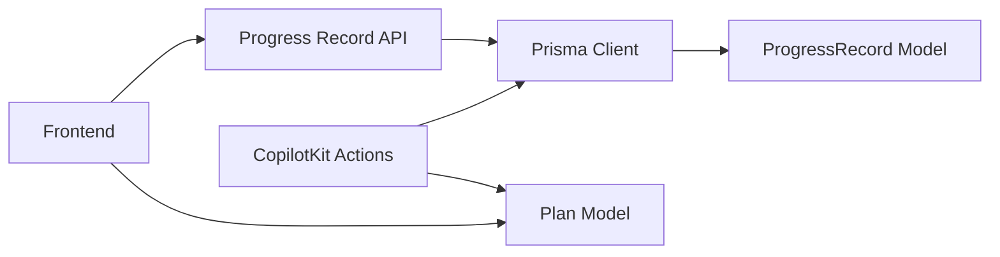

# Progress Update Action

<cite>
**Referenced Files in This Document**
- [route.ts](file://src/app/api/progress_record/route.ts)
- [route.ts](file://src/app/api/copilotkit/route.ts)
- [schema.prisma](file://prisma/schema.prisma)
- [page.tsx](file://src/app/progress/page.tsx)
- [route.ts](file://src/app/api/test-action/route.ts)
</cite>

## Table of Contents
1. [Introduction](#introduction)
2. [Project Structure](#project-structure)
3. [Core Components](#core-components)
4. [Architecture Overview](#architecture-overview)
5. [Detailed Component Analysis](#detailed-component-analysis)
6. [Dependency Analysis](#dependency-analysis)
7. [Performance Considerations](#performance-considerations)
8. [Troubleshooting Guide](#troubleshooting-guide)
9. [Conclusion](#conclusion)

## Introduction
This document explains the progress update action system that enables intelligent progress tracking with flexible time inputs. It covers:
- Natural language time parsing for expressions like “yesterday evening at 11:59”, “today afternoon at 3:00”, and “the day before yesterday”
- Progress record creation with content and thinking separation
- Custom timestamp handling and edge-case management
- Integration with the AI system for automated progress recording
- Validation rules, error handling, and best practices

## Project Structure
The progress update system spans backend APIs, database schema, and frontend integration:
- Backend API routes for progress record CRUD operations
- CopilotKit actions for AI-driven progress updates and natural language parsing
- Prisma schema defining the ProgressRecord model
- Frontend pages for manual progress entry and editing

**Diagram sources**
- [route.ts:1-154](file://src/app/api/progress_record/route.ts#L1-L154)
- [route.ts:704-900](file://src/app/api/copilotkit/route.ts#L704-L900)
- [schema.prisma:53-61](file://prisma/schema.prisma#L53-L61)
- [page.tsx:113-174](file://src/app/progress/page.tsx#L113-L174)

**Section sources**
- [route.ts:1-154](file://src/app/api/progress_record/route.ts#L1-L154)
- [route.ts:704-900](file://src/app/api/copilotkit/route.ts#L704-L900)
- [schema.prisma:53-61](file://prisma/schema.prisma#L53-L61)
- [page.tsx:113-174](file://src/app/progress/page.tsx#L113-L174)

## Core Components
- Progress Record API: Handles creation, update, listing, and deletion of progress records with optional custom timestamps.
- CopilotKit updateProgress: Parses natural language time and integrates with plan selection and progress updates.
- ProgressRecord model: Defines fields for plan association, content, thinking, and timestamps.
- Frontend integration: Provides manual entry/editing UI and local datetime handling for editing.

**Section sources**
- [route.ts:25-127](file://src/app/api/progress_record/route.ts#L25-L127)
- [route.ts:704-900](file://src/app/api/copilotkit/route.ts#L704-L900)
- [schema.prisma:53-61](file://prisma/schema.prisma#L53-L61)
- [page.tsx:176-196](file://src/app/progress/page.tsx#L176-L196)

## Architecture Overview
The system supports two primary flows:
- Manual entry via the frontend forms that call the Progress Record API
- AI-assisted entry via CopilotKit actions that parse natural language and create records automatically

**Diagram sources**
- [route.ts:25-70](file://src/app/api/progress_record/route.ts#L25-L70)
- [page.tsx:113-151](file://src/app/progress/page.tsx#L113-L151)

## Detailed Component Analysis

### Natural Language Time Parsing
The system supports flexible time inputs:
- ISO-like strings (including YYYY-MM-DDTHH:mm) and arbitrary natural language
- Fallback to current time if parsing fails

Supported patterns include:
- Yesterday/last night with optional time
- Today/this evening with optional time
- The day before yesterday with optional time
- Hours ago and minutes ago
- Fallback to current time if no pattern matches

**Diagram sources**
- [route.ts:744-833](file://src/app/api/copilotkit/route.ts#L744-L833)

**Section sources**
- [route.ts:744-833](file://src/app/api/copilotkit/route.ts#L744-L833)

### Progress Record Creation and Content/Thinking Separation
- Fields: plan_id, content, thinking, gmt_create
- Content vs thinking separation is explicit in the API parameters and handled by the handler
- When custom_time is provided, the system attempts ISO parsing first; if that fails, it falls back to natural language parsing

**Diagram sources**
- [route.ts:835-897](file://src/app/api/copilotkit/route.ts#L835-L897)

**Section sources**
- [route.ts:835-897](file://src/app/api/copilotkit/route.ts#L835-L897)

### Custom Timestamp Handling
- ISO-like strings: parsed directly; if the input is exactly YYYY-MM-DDTHH:mm, it is interpreted as local time to avoid UTC conversion surprises
- Natural language fallback: Uses the parser described above
- Edge cases:
  - Missing time in natural language defaults to 8:00 PM for yesterday/the day before yesterday
  - Today’s time defaults to current hour/minute if unspecified
  - Invalid inputs fall back to current time

**Section sources**
- [route.ts:43-56](file://src/app/api/progress_record/route.ts#L43-L56)
- [route.ts:100-112](file://src/app/api/progress_record/route.ts#L100-L112)
- [route.ts:744-833](file://src/app/api/copilotkit/route.ts#L744-L833)

### Integration with AI System
- updateProgress action: Accepts plan_id, progress, content, thinking, and custom_time; resolves plan by ID or name; parses time; creates record; optionally updates plan progress
- addProgressRecord action: Alternative entry point with plan_identifier, content, thinking, and record_time; similar parsing logic
- analyzeAndRecordProgress: Advanced AI parsing that extracts activity, thinking, and time from user reports, then records the result

**Diagram sources**
- [route.ts:704-900](file://src/app/api/copilotkit/route.ts#L704-L900)

**Section sources**
- [route.ts:704-900](file://src/app/api/copilotkit/route.ts#L704-L900)

### Frontend Integration and Editing
- Manual entry: Submits to POST /api/progress_record
- Edit mode: Converts existing gmt_create to local datetime-local format (YYYY-MM-DDTHH:mm) for editing
- Updating plan progress: When progress_update is provided, the system calls PUT /api/plan to update plan progress

**Diagram sources**
- [page.tsx:113-174](file://src/app/progress/page.tsx#L113-L174)

**Section sources**
- [page.tsx:176-196](file://src/app/progress/page.tsx#L176-L196)
- [page.tsx:113-174](file://src/app/progress/page.tsx#L113-L174)

## Dependency Analysis
- ProgressRecord model depends on Plan via plan_id
- API routes depend on Prisma client for persistence
- CopilotKit actions depend on plan resolution and natural language parsing
- Frontend depends on API endpoints for CRUD operations

**Diagram sources**
- [schema.prisma:53-61](file://prisma/schema.prisma#L53-L61)
- [route.ts:1-4](file://src/app/api/progress_record/route.ts#L1-L4)
- [route.ts:839-844](file://src/app/api/copilotkit/route.ts#L839-L844)

**Section sources**
- [schema.prisma:53-61](file://prisma/schema.prisma#L53-L61)
- [route.ts:1-4](file://src/app/api/progress_record/route.ts#L1-L4)
- [route.ts:839-844](file://src/app/api/copilotkit/route.ts#L839-L844)

## Performance Considerations
- Natural language parsing uses lightweight regex matching; keep input concise for predictable performance
- ISO parsing avoids expensive fallback logic when valid
- Frontend edits convert timestamps locally to reduce server-side timezone conversions
- Batch operations should avoid frequent small writes; group updates when possible

## Troubleshooting Guide
Common issues and resolutions:
- Missing plan_id: The system returns an error; ensure plan_id exists or pass a name/description that resolves to a plan
- Invalid custom_time: Falls back to current time; verify input format or use natural language expressions
- Local vs UTC confusion: For YYYY-MM-DDTHH:mm, the backend interprets as local time to prevent unexpected shifts
- Editing existing records: Ensure the datetime-local value is correctly formatted for the user’s timezone

Validation and error handling:
- Missing record ID on update triggers a 400 error
- Database errors return 500 with a standardized error payload
- CopilotKit actions return structured success/error payloads with suggestions

Best practices:
- Prefer ISO-like strings for precise timestamps
- Use natural language for quick entries (“yesterday at 11:59”)
- Separate content and thinking clearly to improve later analysis
- When updating plan progress, ensure progress_update is provided only for ordinary tasks

**Section sources**
- [route.ts:78-83](file://src/app/api/progress_record/route.ts#L78-L83)
- [route.ts:135-139](file://src/app/api/progress_record/route.ts#L135-L139)
- [route.ts:63-69](file://src/app/api/progress_record/route.ts#L63-L69)
- [route.ts:846-863](file://src/app/api/copilotkit/route.ts#L846-L863)

## Conclusion
The progress update action system combines robust manual entry with AI-powered natural language processing. It supports flexible time inputs, clear content/thinking separation, and seamless integration with plan progress tracking. By following the validation rules and best practices outlined here, teams can maintain accurate, searchable progress logs that support both human readability and AI-driven insights.