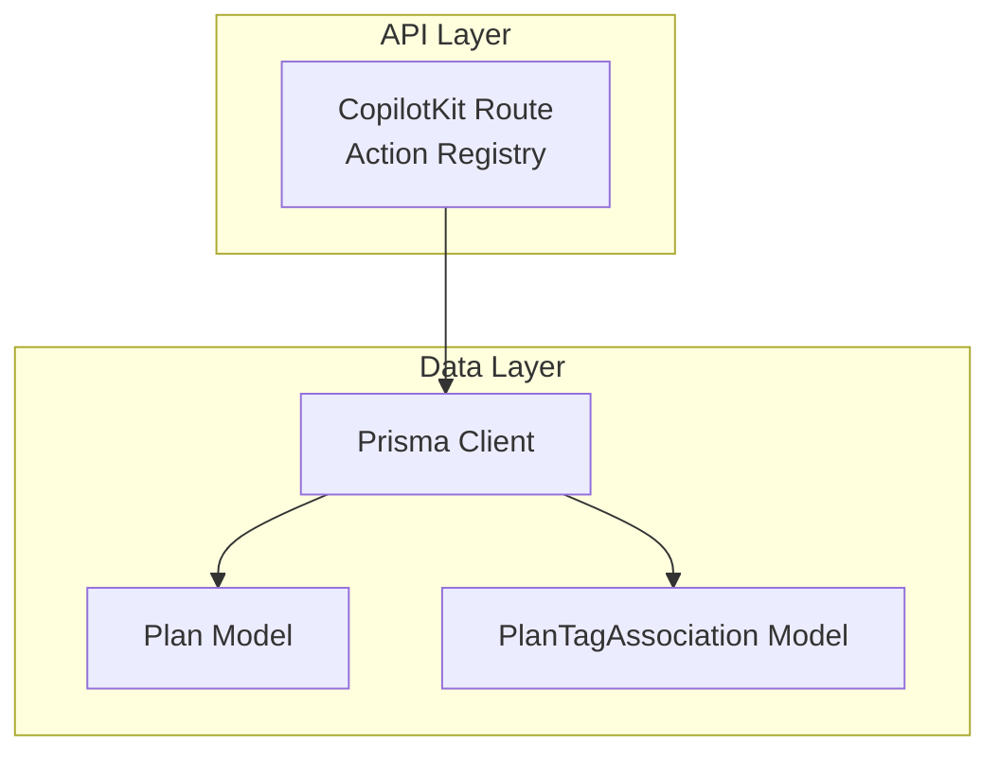
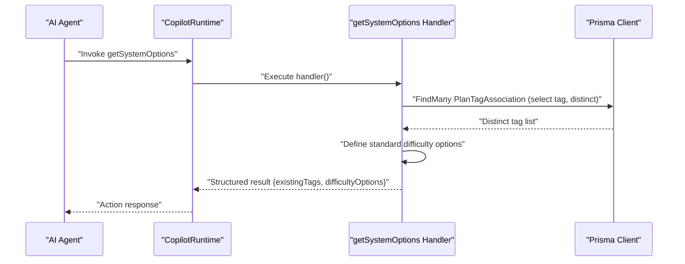
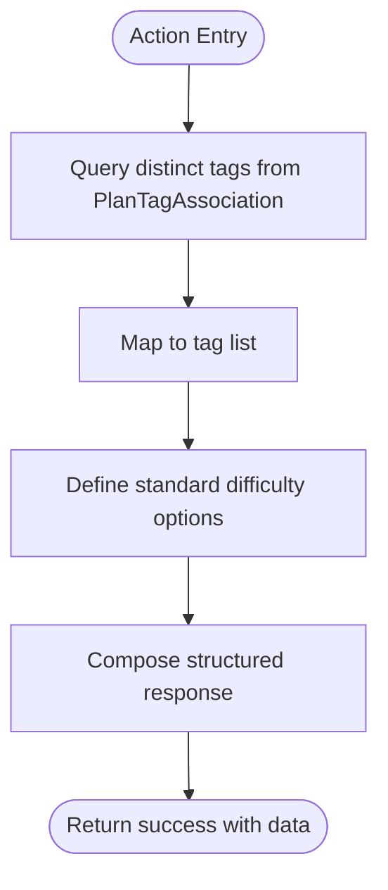
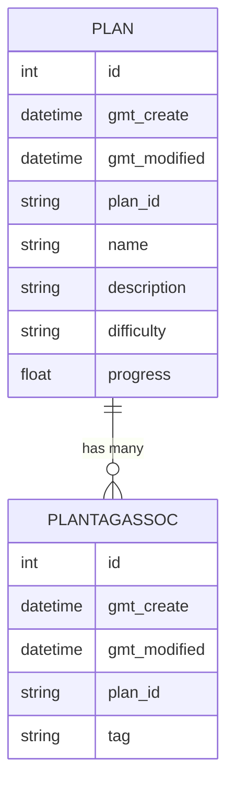
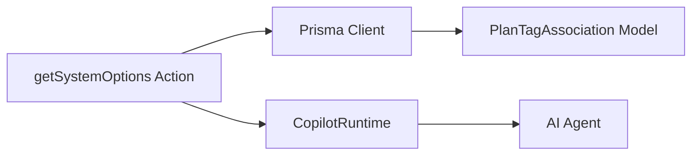

# System Options Action

<cite>
**Referenced Files in This Document**
- [route.ts](file://src/app/api/copilotkit/route.ts)
- [schema.prisma](file://prisma/schema.prisma)
- [route.ts](file://src/app/api/plan/route.ts)
</cite>

## Table of Contents
1. [Introduction](#introduction)
2. [Project Structure](#project-structure)
3. [Core Components](#core-components)
4. [Architecture Overview](#architecture-overview)
5. [Detailed Component Analysis](#detailed-component-analysis)
6. [Dependency Analysis](#dependency-analysis)
7. [Performance Considerations](#performance-considerations)
8. [Troubleshooting Guide](#troubleshooting-guide)
9. [Conclusion](#conclusion)

## Introduction
This document explains the system options action that provides context-aware assistance for plan creation and goal management. It focuses on the getSystemOptions action implementation, including:
- Retrieving existing tags from the planTagAssociation table
- Standardizing difficulty options (easy, medium, hard)
- Formatting the response for downstream consumption
- Role in guiding consistent user interactions and preventing data quality issues

The action is part of the CopilotKit runtime actions exposed via the API endpoint and is designed to be invoked by AI agents to ensure consistent tagging and difficulty values when creating plans.

## Project Structure
The system options action resides in the CopilotKit API route and leverages Prisma models defined in the schema. The relevant components are:
- CopilotKit runtime actions definition and handler implementation
- Prisma schema defining the Plan and PlanTagAssociation models
- Plan API route demonstrating tag retrieval and response formatting patterns

**Diagram sources**
- [route.ts:287-518](file://src/app/api/copilotkit/route.ts#L287-L518)
- [schema.prisma:26-51](file://prisma/schema.prisma#L26-L51)

**Section sources**
- [route.ts:287-518](file://src/app/api/copilotkit/route.ts#L287-L518)
- [schema.prisma:26-51](file://prisma/schema.prisma#L26-L51)

## Core Components
- getSystemOptions action: Returns existing tags and standardized difficulty options to guide plan creation.
- Prisma models:
  - Plan: stores plan metadata including difficulty and relations to tags.
  - PlanTagAssociation: many-to-many bridge between plans and tags.

Key behaviors:
- Tag retrieval uses distinct selection on the tag field from PlanTagAssociation.
- Difficulty options are hardcoded to a standard set.
- Response includes a structured data payload and a human-readable message summarizing available options.

**Section sources**
- [route.ts:483-518](file://src/app/api/copilotkit/route.ts#L483-L518)
- [schema.prisma:26-51](file://prisma/schema.prisma#L26-L51)

## Architecture Overview
The getSystemOptions action is registered as a CopilotKit action and executed by the runtime. It performs two primary database queries:
- Retrieve distinct tags from PlanTagAssociation
- Return a fixed set of difficulty options

**Diagram sources**
- [route.ts:483-518](file://src/app/api/copilotkit/route.ts#L483-L518)

## Detailed Component Analysis

### getSystemOptions Action Implementation
- Purpose: Provide existing tags and standardized difficulty options for plan creation.
- Inputs: None (no parameters).
- Outputs: Structured data containing:
  - existingTags: array of tag strings
  - difficultyOptions: array of standardized difficulty strings
  - message: summary text for display

Implementation highlights:
- Tag retrieval: Queries PlanTagAssociation with select on tag and distinct to avoid duplicates.
- Difficulty standardization: Hardcoded standard values ensure consistency.
- Response formatting: success flag, data payload, and a descriptive message.

**Diagram sources**
- [route.ts:483-518](file://src/app/api/copilotkit/route.ts#L483-L518)
- [schema.prisma:44-51](file://prisma/schema.prisma#L44-L51)

**Section sources**
- [route.ts:483-518](file://src/app/api/copilotkit/route.ts#L483-L518)

### Data Model Relationships
The getSystemOptions action relies on the PlanTagAssociation model to enumerate existing tags. The schema defines:
- Plan model with fields for plan metadata and optional difficulty.
- PlanTagAssociation linking plans to tags with a relation to Plan.

**Diagram sources**
- [schema.prisma:26-51](file://prisma/schema.prisma#L26-L51)

**Section sources**
- [schema.prisma:26-51](file://prisma/schema.prisma#L26-L51)

### Practical Usage in AI Conversations
The system prompt instructs the AI to:
- Query existing plans first
- Use getSystemOptions to discover existing tags before creating new plans
- Prefer existing tags and use standardized difficulty values

Example scenarios:
- User wants to create a plan with a specific topic; the AI calls getSystemOptions to suggest existing tags and difficulty options.
- User mentions a new skill area; the AI suggests using an existing tag if available or proposes a standard difficulty level.

These practices maintain consistency and prevent data quality issues by:
- Enforcing a controlled vocabulary for tags
- Standardizing difficulty values across plans

**Section sources**
- [route.ts:130-230](file://src/app/api/copilotkit/route.ts#L130-L230)

### Response Formatting and Consistency
- The action returns a success flag and a data object with:
  - existingTags: deduplicated list of tags
  - difficultyOptions: standardized values
  - message: contextual guidance for the AI and user
- This structure enables downstream handlers (e.g., createPlan) to validate inputs and provide meaningful feedback.

**Section sources**
- [route.ts:483-518](file://src/app/api/copilotkit/route.ts#L483-L518)

## Dependency Analysis
- getSystemOptions depends on Prisma client to query PlanTagAssociation for distinct tags.
- The action is registered within the CopilotRuntime action registry and is callable by the AI agent.
- The Plan model’s difficulty field and PlanTagAssociation relation define the data landscape used by the action.

**Diagram sources**
- [route.ts:287-518](file://src/app/api/copilotkit/route.ts#L287-L518)
- [schema.prisma:44-51](file://prisma/schema.prisma#L44-L51)

**Section sources**
- [route.ts:287-518](file://src/app/api/copilotkit/route.ts#L287-L518)
- [schema.prisma:44-51](file://prisma/schema.prisma#L44-L51)

## Performance Considerations
- Distinct tag retrieval: Using distinct on the tag column reduces result size and avoids redundant processing.
- Fixed difficulty options: No database query is needed for difficulty values, minimizing latency.
- Recommendation: Keep the tag list manageable; if tag cardinality grows significantly, consider indexing the tag column in the database.

[No sources needed since this section provides general guidance]

## Troubleshooting Guide
Common issues and resolutions:
- Empty tag list: If no tags exist yet, the action still returns success with an empty list and a message indicating no tags are available. Downstream plan creation should handle this gracefully.
- Unexpected difficulty values: The action enforces standard difficulty options. If a client passes a non-standard value, downstream validation (e.g., createPlan) will reject it; ensure clients call getSystemOptions first.
- Database connectivity errors: Wrap calls in error handling to return structured failures with error messages.

**Section sources**
- [route.ts:483-518](file://src/app/api/copilotkit/route.ts#L483-L518)

## Conclusion
The getSystemOptions action centralizes the provision of existing tags and standardized difficulty options, ensuring consistent and high-quality plan creation. By retrieving distinct tags from PlanTagAssociation and enforcing a fixed set of difficulty values, it prevents data quality issues and improves user experience through predictable, context-aware assistance.