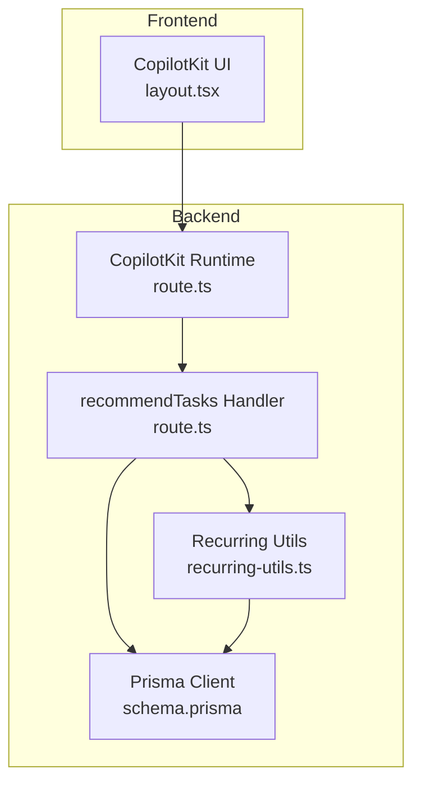
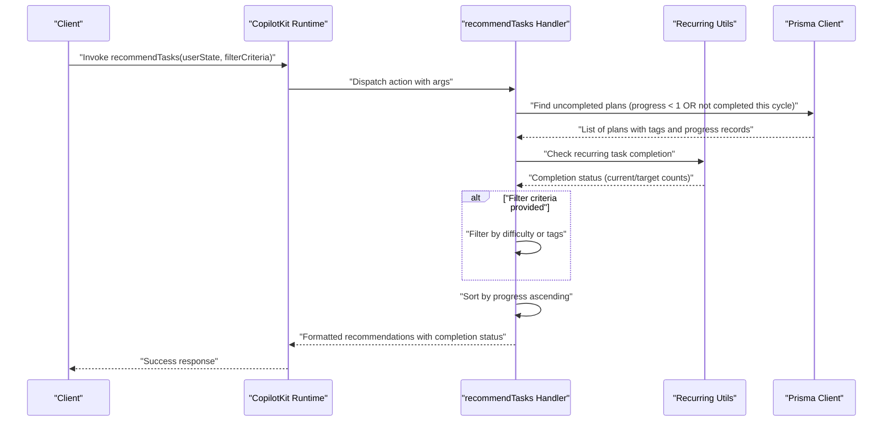
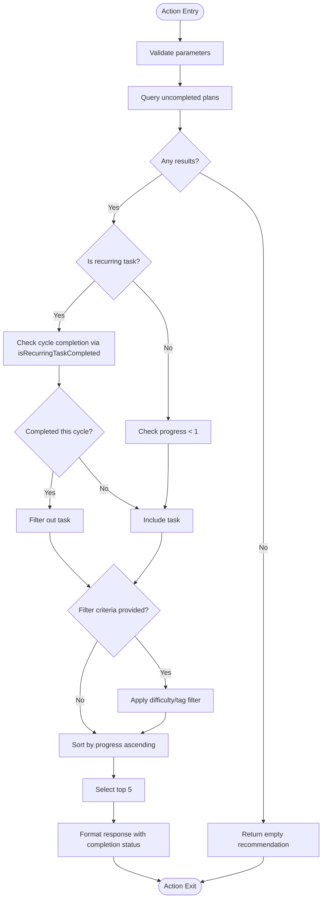
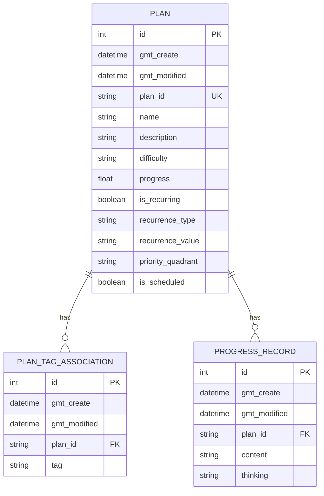
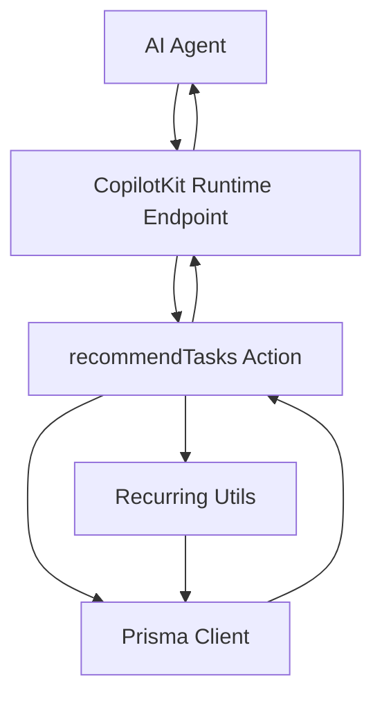

# Task Recommendation Action

<cite>
**Referenced Files in This Document**
- [route.ts](file://src/app/api/copilotkit/route.ts)
- [recurring-utils.ts](file://src/lib/recurring-utils.ts)
- [schema.prisma](file://prisma/schema.prisma)
- [layout.tsx](file://src/app/copilotkit/layout.tsx)
- [page.tsx](file://src/app/plans/page.tsx)
- [route.ts](file://src/app/api/test-action/route.ts)
</cite>

## Update Summary
**Changes Made**
- Enhanced cycle-based task completion detection logic with isRecurringTaskCompleted utility function
- Improved task recommendation filtering with intelligent target count inference based on task names
- Added comprehensive recurring task completion detection across recommendTasks, queryPlans, and findPlan actions
- Integrated intelligent target count inference supporting various task naming patterns

## Table of Contents
1. [Introduction](#introduction)
2. [Project Structure](#project-structure)
3. [Core Components](#core-components)
4. [Architecture Overview](#architecture-overview)
5. [Detailed Component Analysis](#detailed-component-analysis)
6. [Dependency Analysis](#dependency-analysis)
7. [Performance Considerations](#performance-considerations)
8. [Troubleshooting Guide](#troubleshooting-guide)
9. [Conclusion](#conclusion)

## Introduction
This document provides a comprehensive guide to the task recommendation action system, focusing on the enhanced recommendTasks action implementation with cycle-based task completion detection and intelligent filtering logic. The system now features sophisticated recurring task management through the isRecurringTaskCompleted utility function and intelligent target count inference based on task names. It covers parameter validation, filtering logic, recommendation algorithm, database query patterns, handler implementation, error handling, response formatting, AI integration, and practical usage scenarios.

## Project Structure
The task recommendation system is implemented as part of the CopilotKit runtime actions within the Next.js application. The enhanced architecture now includes dedicated utilities for recurring task management alongside the main CopilotKit runtime components.

**Diagram sources**
- [route.ts:287-367](file://src/app/api/copilotkit/route.ts#L287-L367)
- [recurring-utils.ts:135-186](file://src/lib/recurring-utils.ts#L135-L186)
- [schema.prisma:26-42](file://prisma/schema.prisma#L26-L42)
- [layout.tsx:10-18](file://src/app/copilotkit/layout.tsx#L10-L18)

**Section sources**
- [route.ts:1-L1707](file707)
- [recurring-utils.ts:1-218](file://src/lib/recurring-utils.ts#L1-L218)
- [schema.prisma:1-72](file://prisma/schema.prisma#L1-L72)
- [layout.tsx:1-19](file://src/app/copilotkit/layout.tsx#L1-L19)

## Core Components
- **Enhanced recommendTasks action**: Now includes cycle-based task completion detection through isRecurringTaskCompleted utility function
- **Intelligent filtering logic**: Supports difficulty and tag-based criteria with improved recurring task handling
- **Recurring task utilities**: Comprehensive set of functions for cycle-based task management including completion detection and target count inference
- **Smart target count inference**: Intelligent default value calculation based on task names with support for various naming patterns
- **Multi-action integration**: Enhanced completion detection across recommendTasks, queryPlans, and findPlan actions

Key implementation highlights:
- **Cycle-based completion detection**: Uses getCurrentPeriodCount and getTargetCount to determine recurring task completion status
- **Intelligent target inference**: Parses task names for patterns like "2-3次", "一次", "两次", "三次" to infer reasonable defaults
- **Comprehensive filtering**: Applies completion detection across all task recommendation endpoints
- **Enhanced response formatting**: Includes detailed completion status information for recurring tasks

**Section sources**
- [route.ts:340-396](file://src/app/api/copilotkit/route.ts#L340-L396)
- [recurring-utils.ts:88-147](file://src/lib/recurring-utils.ts#L88-L147)

## Architecture Overview
The enhanced recommendTasks action now follows a more sophisticated flow with cycle-based completion detection:

**Diagram sources**
- [route.ts:340-396](file://src/app/api/copilotkit/route.ts#L340-L396)
- [recurring-utils.ts:135-186](file://src/lib/recurring-utils.ts#L135-L186)

## Detailed Component Analysis

### Enhanced recommendTasks Action Implementation
The recommendTasks action now includes sophisticated cycle-based completion detection:

- **Parameters**:
  - userState (required): Describes the user's current state to inform recommendations
  - filterCriteria (optional): Allows narrowing recommendations by difficulty or tags
- **Enhanced completion detection**:
  - Uses isRecurringTaskCompleted utility for recurring tasks
  - Filters out tasks that are completed in the current cycle
  - Maintains backward compatibility with traditional progress-based filtering for non-recurring tasks
- **Intelligent target inference**:
  - Automatically infers target completion counts from task names
  - Supports patterns like "2-3次", "一次", "两次", "三次"
  - Falls back to cycle-type defaults (daily=1, weekly=1, monthly=1)
- **Improved filtering logic**:
  - Combines completion detection with difficulty and tag-based filtering
  - Maintains the same recommendation semantics while adding cycle awareness

**Diagram sources**
- [route.ts:340-396](file://src/app/api/copilotkit/route.ts#L340-L396)
- [recurring-utils.ts:135-147](file://src/lib/recurring-utils.ts#L135-L147)

**Section sources**
- [route.ts:340-396](file://src/app/api/copilotkit/route.ts#L340-L396)

### Recurring Task Utilities Implementation
The new recurring-utils.ts module provides comprehensive cycle-based task management:

- **Cycle period calculation**:
  - getCurrentPeriodStart/getCurrentPeriodEnd for daily, weekly, and monthly cycles
  - Accurate boundary calculations for task completion detection
- **Completion detection**:
  - isRecurringTaskCompleted determines if tasks are finished in current cycle
  - getCurrentPeriodCount counts progress records within current cycle
- **Intelligent target inference**:
  - getTargetCount parses task names for completion patterns
  - Supports Chinese counting patterns (一次, 两次, 三次, 2-3次)
  - Falls back to sensible defaults based on recurrence type
- **Status reporting**:
  - getRecurringTaskDetails provides comprehensive completion status
  - getRecurringTaskStatus formats human-readable completion information

**Section sources**
- [recurring-utils.ts:1-218](file://src/lib/recurring-utils.ts#L1-L218)

### Handler Implementation Details
The enhanced handler implementation now integrates with recurring task utilities:

- **Prisma client usage**:
  - Queries Plan records with progressRecords for recurring task analysis
  - Includes tags and progress records for downstream filtering
  - Orders by creation time for consistent processing
- **Enhanced completion filtering**:
  - Uses isRecurringTaskCompleted for cycle-aware completion detection
  - Maintains progress-based filtering for non-recurring tasks
  - Integrates completion detection across all recommendation endpoints
- **Error handling**:
  - Catches exceptions during execution and returns structured error responses
  - Handles edge cases in recurring task completion detection
- **Response formatting**:
  - Wraps recommendations with completion status information
  - Provides fallback messages when no tasks are available

**Section sources**
- [route.ts:340-396](file://src/app/api/copilotkit/route.ts#L340-L396)

### Data Model and Relationships
The Plan entity now supports enhanced recurring task functionality:

- **Plan enhancements**:
  - is_recurring: Boolean flag indicating recurring tasks
  - recurrence_type: Daily, weekly, or monthly cycle type
  - recurrence_value: Target completion count for the cycle
  - progressRecords: Associated progress entries for completion tracking
- **Relationship implications**:
  - Enables cycle-based completion detection
  - Supports intelligent target count inference
  - Facilitates comprehensive progress tracking

**Diagram sources**
- [schema.prisma:26-61](file://prisma/schema.prisma#L26-L61)

**Section sources**
- [schema.prisma:26-61](file://prisma/schema.prisma#L26-L61)

### Practical Recommendation Scenarios
Enhanced scenarios with cycle-based completion detection:

- **Scenario 1: Basic recommendation with recurring tasks**
  - Input: userState describes current state; includes recurring tasks
  - Output: Top 5 tasks sorted by progress, excluding those completed this cycle
- **Scenario 2: Difficulty-filtered recommendation with cycle awareness**
  - Input: filterCriteria includes difficulty value
  - Output: Tasks matching difficulty and not completed this cycle, sorted by progress
- **Scenario 3: Tag-filtered recommendation with intelligent inference**
  - Input: filterCriteria includes tag substring
  - Output: Tasks with matching tags, considering completion status and target counts
- **Scenario 4: Intelligent target inference**
  - Input: recurring task with name like "每天练习2-3次"
  - Output: Automatically inferred target count of 3, with completion detection
- **Scenario 5: No uncompleted tasks**
  - Input: Any userState
  - Output: Empty tasks list with guidance to create new plans

**Section sources**
- [route.ts:361-396](file://src/app/api/copilotkit/route.ts#L361-L396)
- [recurring-utils.ts:101-133](file://src/lib/recurring-utils.ts#L101-L133)

### AI System Integration
The enhanced recommendTasks action maintains seamless AI integration:

- **Runtime registration**: The action remains registered with the CopilotKit runtime
- **Frontend integration**: Continues to integrate via CopilotKit layout wrapper
- **Enhanced capabilities**: AI agents now receive more accurate task recommendations with cycle awareness
- **Consistent behavior**: Maintains backward compatibility while adding new functionality

**Diagram sources**
- [route.ts:287-367](file://src/app/api/copilotkit/route.ts#L287-L367)
- [layout.tsx:10-18](file://src/app/copilotkit/layout.tsx#L10-L18)

**Section sources**
- [route.ts:1456-1707](file://src/app/api/copilotkit/route.ts#L1456-L1707)
- [layout.tsx:1-19](file://src/app/copilotkit/layout.tsx#L1-L19)

## Dependency Analysis
Enhanced dependency structure with recurring task utilities:

- **Internal dependencies**:
  - recommendTasks depends on isRecurringTaskCompleted from recurring-utils.ts
  - Handler relies on Plan, PlanTagAssociation, and ProgressRecord models
  - Recurring utilities provide standalone cycle-based task management
- **External dependencies**:
  - CopilotKit runtime and adapter for AI integration
  - OpenAI-compatible client for model interactions
  - Prisma client for database operations

Integration improvements:
- **Utility separation**: Recurring task logic separated into dedicated module
- **Cross-action consistency**: Enhanced completion detection across recommendTasks, queryPlans, and findPlan
- **Intelligent inference**: Smart target count calculation reduces manual configuration

**Section sources**
- [route.ts:1-1707](file://src/app/api/copilotkit/route.ts#L1-L1707)
- [recurring-utils.ts:1-218](file://src/lib/recurring-utils.ts#L1-L218)
- [schema.prisma:1-72](file://prisma/schema.prisma#L1-L72)

## Performance Considerations
Enhanced performance characteristics with cycle-based completion detection:

- **Query scope improvements**:
  - Recurring tasks now include progressRecords for efficient completion detection
  - Cycle boundaries calculated efficiently using date arithmetic
- **Processing optimizations**:
  - isRecurringTaskCompleted uses getCurrentPeriodCount for O(n) filtering
  - Target count inference avoids database queries for common patterns
- **Memory considerations**:
  - Progress records loaded for recurring tasks may increase memory usage
  - Cycle boundary calculations are lightweight but performed per task
- **Scalability improvements**:
  - Intelligent target inference reduces database overhead for recurring tasks
  - Cycle-based filtering prevents unnecessary recomputation

Potential optimization opportunities:
- **Indexing strategy**: Consider indexes on recurrence_type and progressRecord timestamps
- **Batch processing**: Group recurring task completion checks for better performance
- **Caching**: Cache target count inference results for frequently used task patterns

**Section sources**
- [route.ts:340-396](file://src/app/api/copilotkit/route.ts#L340-L396)
- [recurring-utils.ts:73-147](file://src/lib/recurring-utils.ts#L73-L147)

## Troubleshooting Guide
Enhanced troubleshooting for cycle-based task completion:

- **Missing required parameter**:
  - Symptom: Action fails due to missing userState
  - Resolution: Ensure userState is provided when invoking the action
- **Unknown action**:
  - Symptom: Non-recommended action name triggers a 400 error
  - Resolution: Verify the action name matches the registered recommendTasks action
- **Database errors**:
  - Symptom: Exceptions during Prisma queries
  - Resolution: Check database connectivity and schema consistency; review logs for detailed error messages
- **Empty recommendations**:
  - Symptom: No uncompleted plans found
  - Resolution: Create new plans or adjust filter criteria; the handler returns a helpful message
- **Recurring task completion issues**:
  - Symptom: Recurring tasks not filtering correctly
  - Resolution: Verify recurrence_type and recurrence_value are properly set; check progressRecords association
- **Target count inference problems**:
  - Symptom: Unexpected target counts for recurring tasks
  - Resolution: Ensure task names contain expected patterns like "2-3次", "一次", "两次", "三次"

**Section sources**
- [route.ts:140-152](file://src/app/api/copilotkit/route.ts#L140-L152)
- [route.ts:125-138](file://src/app/api/test-action/route.ts#L125-L138)

## Conclusion
The enhanced recommendTasks action now provides sophisticated cycle-based task completion detection through the isRecurringTaskCompleted utility function and intelligent target count inference. The system maintains backward compatibility while adding powerful recurring task management capabilities. Users benefit from more accurate recommendations that consider both traditional progress and cycle-based completion status. The integration with intelligent target inference reduces manual configuration overhead while maintaining flexibility for custom completion requirements. The enhanced architecture supports seamless AI-driven task suggestions aligned with user state and provides comprehensive recurring task management capabilities.