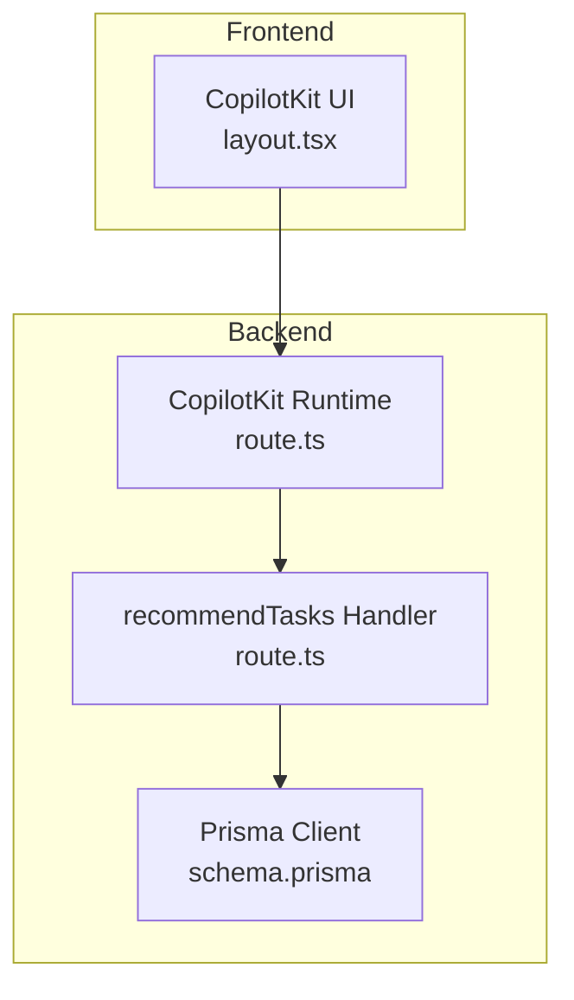
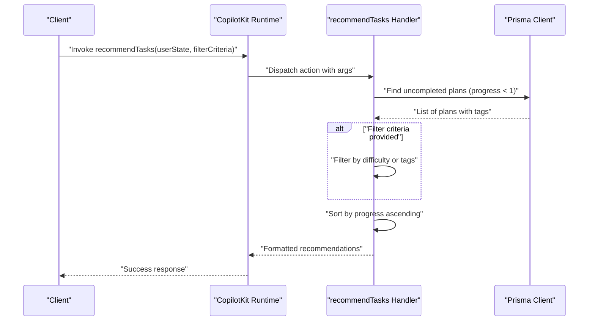
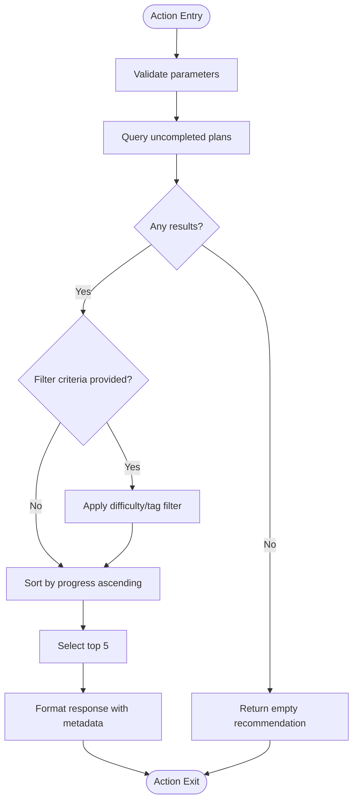
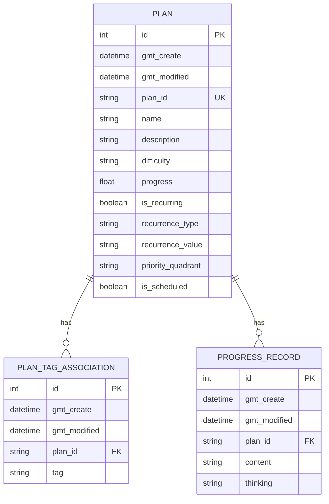
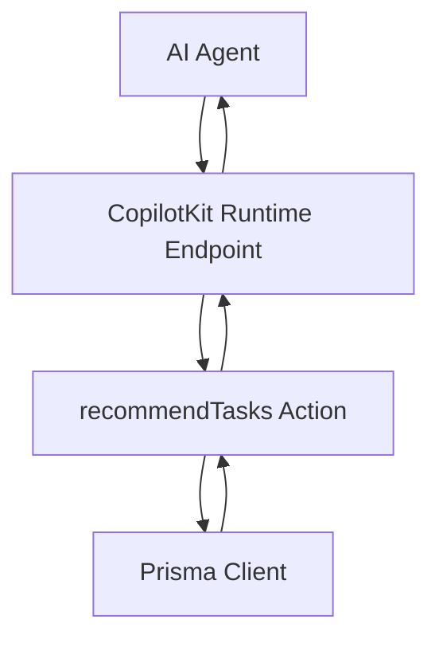

# Task Recommendation Action

<cite>
**Referenced Files in This Document**
- [route.ts](file://src/app/api/copilotkit/route.ts)
- [schema.prisma](file://prisma/schema.prisma)
- [layout.tsx](file://src/app/copilotkit/layout.tsx)
- [page.tsx](file://src/app/plans/page.tsx)
- [route.ts](file://src/app/api/test-action/route.ts)
</cite>

## Table of Contents
1. [Introduction](#introduction)
2. [Project Structure](#project-structure)
3. [Core Components](#core-components)
4. [Architecture Overview](#architecture-overview)
5. [Detailed Component Analysis](#detailed-component-analysis)
6. [Dependency Analysis](#dependency-analysis)
7. [Performance Considerations](#performance-considerations)
8. [Troubleshooting Guide](#troubleshooting-guide)
9. [Conclusion](#conclusion)

## Introduction
This document provides a comprehensive guide to the task recommendation action system, focusing on the recommendTasks action implementation. It covers parameter validation, filtering logic, recommendation algorithm, database query patterns, handler implementation, error handling, response formatting, AI integration, and practical usage scenarios. The system integrates with an AI runtime to provide intelligent task recommendations based on user state and optional filter criteria.

## Project Structure
The task recommendation system is implemented as part of the CopilotKit runtime actions within the Next.js application. The relevant components include:
- The CopilotKit runtime definition and action handlers
- Prisma schema defining the Plan entity and associated relations
- Frontend integration via CopilotKit React components
- Supporting test action routes for database connectivity checks

**Diagram sources**
- [route.ts:287-367](file://src/app/api/copilotkit/route.ts#L287-L367)
- [schema.prisma:26-42](file://prisma/schema.prisma#L26-L42)
- [layout.tsx:10-18](file://src/app/copilotkit/layout.tsx#L10-L18)

**Section sources**
- [route.ts:1-1636](file://src/app/api/copilotkit/route.ts#L1-L1636)
- [schema.prisma:1-72](file://prisma/schema.prisma#L1-L72)
- [layout.tsx:1-19](file://src/app/copilotkit/layout.tsx#L1-L19)

## Core Components
- recommendTasks action: Defines parameters (userState, filterCriteria) and implements the recommendation logic.
- Prisma client usage: Queries uncompleted plans, applies filters, and sorts results.
- Handler implementation: Manages database operations, error handling, and response formatting.
- AI integration: The action is exposed through the CopilotKit runtime and can be invoked by AI agents.

Key implementation highlights:
- Parameter validation ensures required arguments are present.
- Filtering logic supports difficulty and tag-based criteria.
- Sorting prioritizes tasks with lower progress for immediate attention.
- Response formatting includes metadata such as total available tasks.

**Section sources**
- [route.ts:289-367](file://src/app/api/copilotkit/route.ts#L289-L367)

## Architecture Overview
The recommendTasks action follows a straightforward flow:
1. Receive action invocation with parameters.
2. Query uncompleted plans from the database.
3. Apply optional filter criteria.
4. Sort remaining plans by progress ascending.
5. Return top recommendations with formatted metadata.

**Diagram sources**
- [route.ts:307-367](file://src/app/api/copilotkit/route.ts#L307-L367)

## Detailed Component Analysis

### recommendTasks Action Implementation
- Parameters:
  - userState (required): Describes the user’s current state to inform recommendations.
  - filterCriteria (optional): Allows narrowing recommendations by difficulty or tags.
- Validation:
  - Ensures userState is provided; filterCriteria is optional.
- Filtering logic:
  - If filterCriteria is provided, the handler filters plans by difficulty inclusion or tag inclusion.
- Sorting and selection:
  - Plans are sorted by progress ascending and sliced to top 5 recommendations.
- Response formatting:
  - Returns success flag, message, userState, recommended tasks, and total available count.
  - Handles empty results gracefully with a suggestion to create new plans.

**Diagram sources**
- [route.ts:307-367](file://src/app/api/copilotkit/route.ts#L307-L367)

**Section sources**
- [route.ts:289-367](file://src/app/api/copilotkit/route.ts#L289-L367)

### Handler Implementation Details
- Prisma client usage:
  - Queries Plan records where progress is less than 1.
  - Includes associated tags for downstream filtering.
  - Orders by creation time descending initially to support later sorting.
- Error handling:
  - Catches exceptions during execution and returns structured error responses.
- Response formatting:
  - Wraps recommendations with metadata for client consumption.
  - Provides fallback messages when no tasks are available.

**Section sources**
- [route.ts:312-361](file://src/app/api/copilotkit/route.ts#L312-L361)

### Data Model and Relationships
The Plan entity and its associations influence how recommendations are computed:
- Plan: Contains identifiers, timestamps, name, description, difficulty, progress, and relations to tags and progress records.
- PlanTagAssociation: Links plans to tags.
- ProgressRecord: Stores progress entries for plans.

**Diagram sources**
- [schema.prisma:26-61](file://prisma/schema.prisma#L26-L61)

**Section sources**
- [schema.prisma:26-61](file://prisma/schema.prisma#L26-L61)

### Practical Recommendation Scenarios
- Scenario 1: Basic recommendation
  - Input: userState describes current state; no filterCriteria.
  - Output: Top 5 tasks sorted by progress ascending.
- Scenario 2: Difficulty-filtered recommendation
  - Input: filterCriteria includes a difficulty value.
  - Output: Tasks matching the difficulty, then sorted by progress ascending.
- Scenario 3: Tag-filtered recommendation
  - Input: filterCriteria includes a tag substring.
  - Output: Tasks containing the tag, then sorted by progress ascending.
- Scenario 4: No uncompleted plans
  - Input: Any userState.
  - Output: Empty tasks list with guidance to create new plans.

Note: The handler does not enforce strict validation of filterCriteria against predefined values; it performs substring matching against difficulty and tag content.

**Section sources**
- [route.ts:332-361](file://src/app/api/copilotkit/route.ts#L332-L361)

### AI System Integration
- The recommendTasks action is registered with the CopilotKit runtime and exposed to AI agents.
- The frontend integrates CopilotKit via a layout wrapper that provides runtimeUrl and publicApiKey.
- The runtime endpoint handles request filtering and delegates to the action handler.

**Diagram sources**
- [route.ts:287-367](file://src/app/api/copilotkit/route.ts#L287-L367)
- [layout.tsx:10-18](file://src/app/copilotkit/layout.tsx#L10-L18)

**Section sources**
- [route.ts:1456-1636](file://src/app/api/copilotkit/route.ts#L1456-L1636)
- [layout.tsx:1-19](file://src/app/copilotkit/layout.tsx#L1-L19)

## Dependency Analysis
- Internal dependencies:
  - recommendTasks depends on Prisma client for database queries.
  - The handler relies on Plan and PlanTagAssociation models defined in the schema.
- External dependencies:
  - CopilotKit runtime and adapter for AI integration.
  - OpenAI-compatible client for model interactions.

Potential circular dependencies:
- None observed between the action handler and runtime initialization.

Integration points:
- The action integrates with the AI runtime through the runtime actions array.
- Frontend integration occurs via the CopilotKit layout wrapper.

**Section sources**
- [route.ts:1-1636](file://src/app/api/copilotkit/route.ts#L1-L1636)
- [schema.prisma:1-72](file://prisma/schema.prisma#L1-L72)

## Performance Considerations
Current implementation characteristics:
- Query scope: Retrieves all uncompleted plans (progress < 1) with tags included.
- Sorting: Sorts in-memory after fetching, which can be inefficient for large datasets.
- Limitation: No explicit pagination or limit on fetched records.

Optimization strategies:
- Add database-side filtering for difficulty and tag criteria to reduce payload size.
- Introduce pagination or take/limit clauses to cap the number of returned plans.
- Consider indexing on frequently queried fields (e.g., progress, difficulty, tag).
- Move sorting to the database level to leverage ORDER BY with LIMIT.

These changes would improve performance for large datasets while maintaining the same recommendation semantics.

**Section sources**
- [route.ts:312-361](file://src/app/api/copilotkit/route.ts#L312-L361)
- [schema.prisma:26-42](file://prisma/schema.prisma#L26-L42)

## Troubleshooting Guide
Common issues and resolutions:
- Missing required parameter:
  - Symptom: Action fails due to missing userState.
  - Resolution: Ensure userState is provided when invoking the action.
- Unknown action:
  - Symptom: Non-recommended action name triggers a 400 error.
  - Resolution: Verify the action name matches the registered recommendTasks action.
- Database errors:
  - Symptom: Exceptions during Prisma queries.
  - Resolution: Check database connectivity and schema consistency; review logs for detailed error messages.
- Empty recommendations:
  - Symptom: No uncompleted plans found.
  - Resolution: Create new plans or adjust filter criteria; the handler returns a helpful message suggesting next steps.

Related test action for database connectivity:
- The test-action route provides a simple checkDatabase action to validate Prisma connectivity and counts of goals and plans.

**Section sources**
- [route.ts:140-152](file://src/app/api/copilotkit/route.ts#L140-L152)
- [route.ts:125-138](file://src/app/api/test-action/route.ts#L125-L138)

## Conclusion
The recommendTasks action delivers a pragmatic recommendation mechanism by querying uncompleted plans, applying optional filters, and sorting by progress. Its integration with the CopilotKit runtime enables AI-driven task suggestions aligned with user state. While functional, the current implementation benefits from database-side filtering, pagination, and indexing to scale effectively with larger datasets. The provided troubleshooting guidance and performance recommendations help maintain reliability and responsiveness as usage grows.