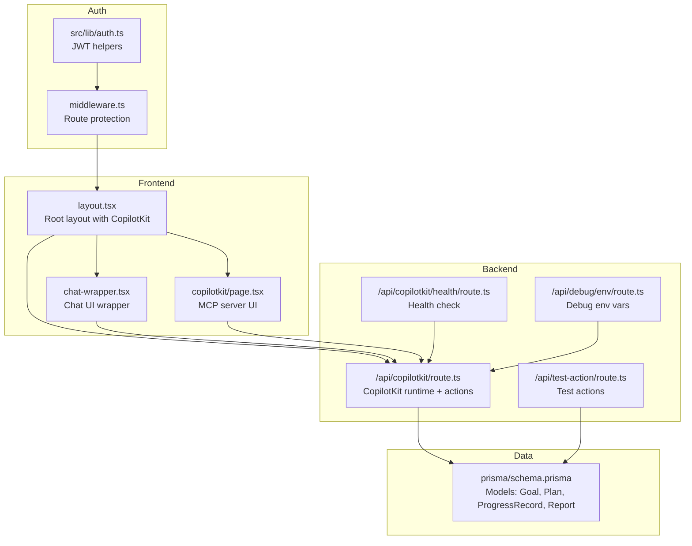
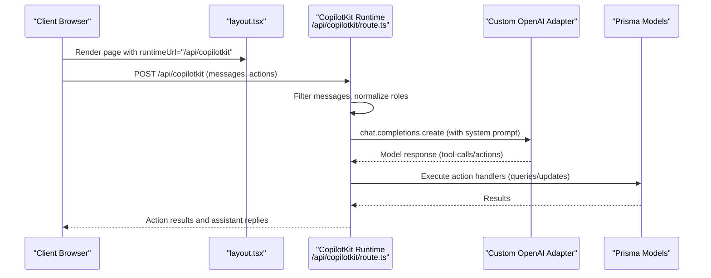
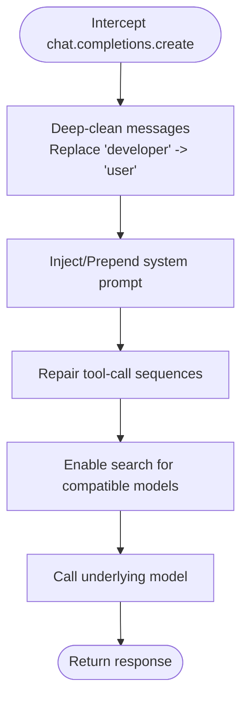
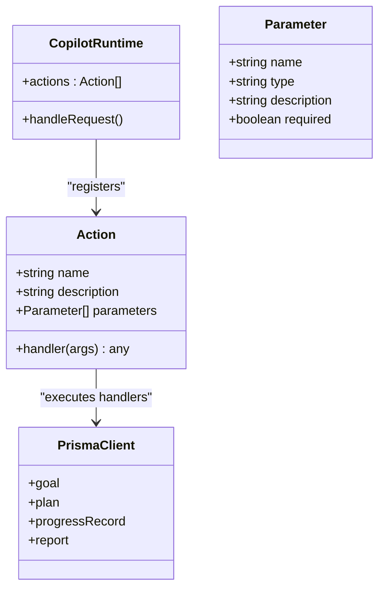
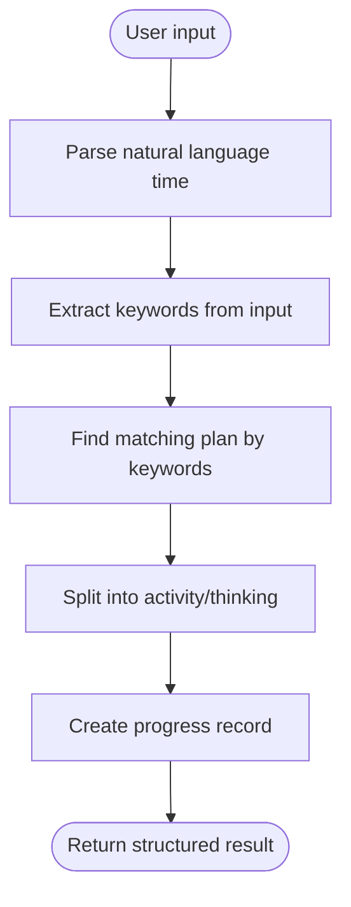
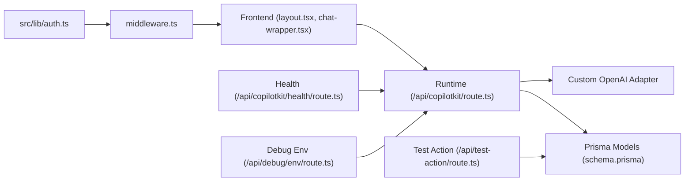
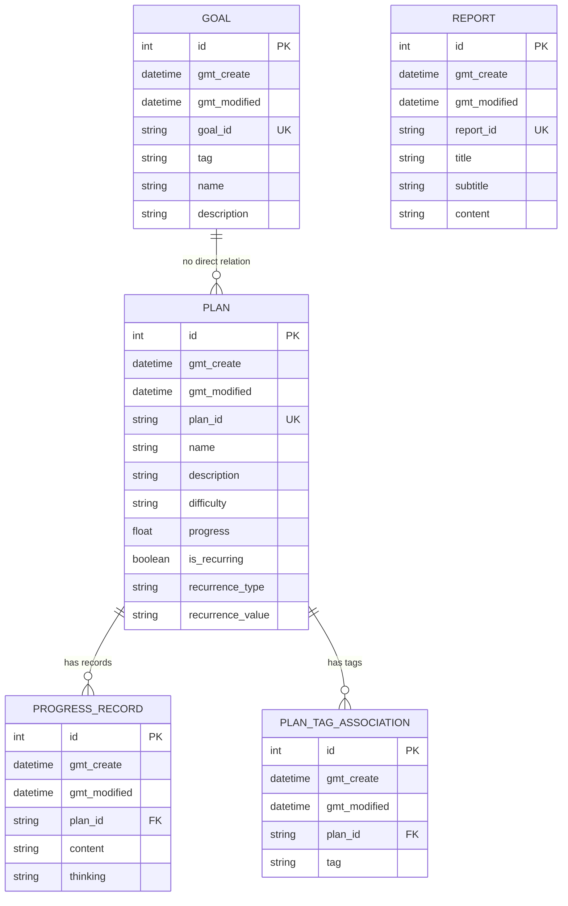

# AI Assistant Integration

<cite>
**Referenced Files in This Document**
- [route.ts](file://src/app/api/copilotkit/route.ts)
- [health/route.ts](file://src/app/api/copilotkit/health/route.ts)
- [page.tsx](file://src/app/copilotkit/page.tsx)
- [chat-wrapper.tsx](file://src/components/chat-wrapper.tsx)
- [layout.tsx](file://src/app/layout.tsx)
- [page.tsx](file://src/app/page.tsx)
- [route.ts](file://src/app/api/test-action/route.ts)
- [route.ts](file://src/app/api/debug/env/route.ts)
- [middleware.ts](file://middleware.ts)
- [auth.ts](file://src/lib/auth.ts)
- [schema.prisma](file://prisma/schema.prisma)
</cite>

## Table of Contents
1. [Introduction](#introduction)
2. [Project Structure](#project-structure)
3. [Core Components](#core-components)
4. [Architecture Overview](#architecture-overview)
5. [Detailed Component Analysis](#detailed-component-analysis)
6. [Dependency Analysis](#dependency-analysis)
7. [Performance Considerations](#performance-considerations)
8. [Troubleshooting Guide](#troubleshooting-guide)
9. [Conclusion](#conclusion)
10. [Appendices](#appendices)

## Introduction
This document explains the AI assistant integration built with CopilotKit and a custom OpenAI adapter. It covers the runtime configuration, message cleaning pipeline, action system architecture, and AI behavior injection via system prompts. It also documents the health check endpoint, AI service integration, model configuration for OpenAI-compatible providers (including Aliyun Bailian), and practical examples of AI interactions and action invocation patterns. Guidance is included for extending the AI functionality with custom actions and debugging AI responses, designed for both beginners and advanced developers.

## Project Structure
The AI assistant integration spans backend API routes, frontend integration, and shared data models:
- Backend runtime and actions: src/app/api/copilotkit/route.ts
- Health check: src/app/api/copilotkit/health/route.ts
- Frontend integration: src/app/layout.tsx, src/components/chat-wrapper.tsx, src/app/copilotkit/page.tsx
- Data models: prisma/schema.prisma
- Authentication and middleware: middleware.ts, src/lib/auth.ts
- Debugging endpoints: src/app/api/debug/env/route.ts
- Test action endpoint: src/app/api/test-action/route.ts

**Diagram sources**
- [layout.tsx:16-30](file://src/app/layout.tsx#L16-L30)
- [chat-wrapper.tsx:7-708](file://src/components/chat-wrapper.tsx#L7-L708)
- [page.tsx:12-108](file://src/app/copilotkit/page.tsx#L12-L108)
- [route.ts:1456-1635](file://src/app/api/copilotkit/route.ts#L1456-L1635)
- [health/route.ts:3-31](file://src/app/api/copilotkit/health/route.ts#L3-L31)
- [route.ts:1-153](file://src/app/api/test-action/route.ts#L1-L153)
- [route.ts:3-9](file://src/app/api/debug/env/route.ts#L3-L9)
- [middleware.ts:3-34](file://middleware.ts#L3-L34)
- [auth.ts:48-69](file://src/lib/auth.ts#L48-L69)
- [schema.prisma:16-69](file://prisma/schema.prisma#L16-L69)

**Section sources**
- [layout.tsx:16-30](file://src/app/layout.tsx#L16-L30)
- [route.ts:1456-1635](file://src/app/api/copilotkit/route.ts#L1456-L1635)
- [health/route.ts:3-31](file://src/app/api/copilotkit/health/route.ts#L3-L31)
- [route.ts:1-153](file://src/app/api/test-action/route.ts#L1-L153)
- [route.ts:3-9](file://src/app/api/debug/env/route.ts#L3-L9)
- [middleware.ts:3-34](file://middleware.ts#L3-L34)
- [auth.ts:48-69](file://src/lib/auth.ts#L48-L69)
- [schema.prisma:16-69](file://prisma/schema.prisma#L16-L69)

## Core Components
- CopilotKit runtime endpoint: Initializes the runtime, registers actions, and exposes the endpoint for chat interactions.
- Custom OpenAI adapter: Wraps the OpenAI client to inject system prompts, clean message roles, repair tool-call sequences, and enable search for compatible models.
- Action system: Provides AI actions for intelligent task recommendation, plan querying, goal creation, plan creation, plan finding, progress updates, adding progress records, and intelligent progress analysis.
- Health check endpoint: Reports configuration status and available actions.
- Frontend integration: Embeds the CopilotKit runtime URL and renders the chat UI and optional MCP server management.
- Authentication and middleware: Protects routes and ensures session validity.

**Section sources**
- [route.ts:287-1452](file://src/app/api/copilotkit/route.ts#L287-L1452)
- [route.ts:88-271](file://src/app/api/copilotkit/route.ts#L88-L271)
- [health/route.ts:3-31](file://src/app/api/copilotkit/health/route.ts#L3-L31)
- [layout.tsx:24-26](file://src/app/layout.tsx#L24-L26)
- [chat-wrapper.tsx:7-708](file://src/components/chat-wrapper.tsx#L7-L708)
- [middleware.ts:3-34](file://middleware.ts#L3-L34)

## Architecture Overview
The AI assistant integrates a CopilotKit runtime that:
- Receives chat requests and filters/normalizes messages
- Injects a system prompt tailored for goal and plan management
- Cleans developer roles and repairs tool-call sequences for compatibility
- Executes registered AI actions against the Prisma data layer
- Returns structured results to the frontend chat UI

**Diagram sources**
- [layout.tsx:24-26](file://src/app/layout.tsx#L24-L26)
- [route.ts:1456-1635](file://src/app/api/copilotkit/route.ts#L1456-L1635)
- [route.ts:88-271](file://src/app/api/copilotkit/route.ts#L88-L271)
- [schema.prisma:16-69](file://prisma/schema.prisma#L16-L69)

## Detailed Component Analysis

### CopilotKit Runtime Configuration
- Initializes CopilotRuntime with a list of actions.
- Exposes a NextJS App Router endpoint for chat interactions.
- Uses a custom OpenAIAdapter configured for a specific model (Aliyun Bailian qwen3.5-plus) with a wrapped OpenAI client.

Key behaviors:
- Message filtering and normalization to supported roles.
- System prompt injection at the beginning of the message array or appended to existing system content.
- Tool-call sequence repair for models requiring explicit tool results after assistant tool calls.

**Section sources**
- [route.ts:287-1452](file://src/app/api/copilotkit/route.ts#L287-L1452)
- [route.ts:1456-1635](file://src/app/api/copilotkit/route.ts#L1456-L1635)

### Custom OpenAI Adapter and Message Cleaning
- Extends the OpenAI client to intercept chat.completions.create.
- Deep-cleans messages by replacing unsupported developer roles with user.
- Injects a comprehensive system prompt tailored for goal/plan management and reading-related tasks.
- Repairs tool-call sequences to satisfy provider requirements.
- Enables search for compatible models via extra_body.

**Diagram sources**
- [route.ts:88-271](file://src/app/api/copilotkit/route.ts#L88-L271)

**Section sources**
- [route.ts:88-271](file://src/app/api/copilotkit/route.ts#L88-L271)

### Action System Architecture
The runtime registers multiple AI actions. Each action defines:
- Name and description
- Parameter schema
- Handler function performing database operations via Prisma

Representative actions:
- Intelligent task recommendation
- Plan querying with filters
- Goal creation
- System options retrieval (existing tags and difficulty)
- Plan creation with validation
- Plan finding with keyword matching
- Progress updates with natural language time parsing
- Adding progress records
- Intelligent progress analysis and record creation

**Diagram sources**
- [route.ts:287-1452](file://src/app/api/copilotkit/route.ts#L287-L1452)
- [schema.prisma:16-69](file://prisma/schema.prisma#L16-L69)

**Section sources**
- [route.ts:287-1452](file://src/app/api/copilotkit/route.ts#L287-L1452)
- [schema.prisma:16-69](file://prisma/schema.prisma#L16-L69)

### AI Behavior Injection and Natural Language Processing
- System prompt injection ensures the AI understands the domain-specific workflow for goals, plans, and progress tracking.
- Natural language time parsing supports flexible time expressions (e.g., “yesterday at 9pm”, “today 8:30”, “2 hours ago”).
- Intelligent progress analysis splits user reports into “activity” and “thinking” components and attempts to resolve the target plan from keywords.

**Diagram sources**
- [route.ts:744-833](file://src/app/api/copilotkit/route.ts#L744-L833)
- [route.ts:1214-1279](file://src/app/api/copilotkit/route.ts#L1214-L1279)
- [route.ts:1374-1415](file://src/app/api/copilotkit/route.ts#L1374-L1415)

**Section sources**
- [route.ts:744-833](file://src/app/api/copilotkit/route.ts#L744-L833)
- [route.ts:1214-1279](file://src/app/api/copilotkit/route.ts#L1214-L1279)
- [route.ts:1374-1415](file://src/app/api/copilotkit/route.ts#L1374-L1415)

### Health Check Endpoint
- Validates environment variables for OpenAI API key and base URL.
- Lists configured actions.
- Returns timestamped health status.

**Section sources**
- [health/route.ts:3-31](file://src/app/api/copilotkit/health/route.ts#L3-L31)

### AI Service Integration and Model Configuration
- The runtime uses an OpenAIAdapter configured with a specific model suitable for Aliyun Bailian.
- The adapter wraps a CustomOpenAI client that injects system prompts, cleans messages, repairs tool calls, and enables search.

Provider configuration highlights:
- Model selection for Bailian (qwen3.5-plus) via adapter configuration.
- Base URL and API key sourced from environment variables.
- Search enabled for compatible models via extra_body.

**Section sources**
- [route.ts:279-282](file://src/app/api/copilotkit/route.ts#L279-L282)
- [route.ts:72-81](file://src/app/api/copilotkit/route.ts#L72-L81)
- [route.ts:261-264](file://src/app/api/copilotkit/route.ts#L261-L264)

### Frontend Integration
- Root layout embeds the CopilotKit runtime URL.
- Chat wrapper renders the CopilotChat UI with custom styles and hydration fixes.
- MCP server management UI allows adding/removing external MCP servers.

**Section sources**
- [layout.tsx:24-26](file://src/app/layout.tsx#L24-L26)
- [chat-wrapper.tsx:7-708](file://src/components/chat-wrapper.tsx#L7-L708)
- [page.tsx:12-108](file://src/app/copilotkit/page.tsx#L12-L108)

### Practical Examples and Invocation Patterns
Common user interactions and expected outcomes:
- Intelligent task recommendation: Ask for recommended tasks based on current state and filters.
- Plan querying: Search plans by difficulty, tag, or keyword.
- Goal and plan creation: Create goals (abstract) and plans (specific) with validated difficulty and tags.
- Plan finding: Provide keywords to locate relevant plans.
- Progress updates: Update progress percentage or add records with optional thinking and natural language timestamps.
- Intelligent progress analysis: Summarize a free-form report into activity/thinking and attach to the best-matching plan.

These behaviors are implemented by the registered actions and enforced by the system prompt and message cleaning pipeline.

**Section sources**
- [route.ts:287-1452](file://src/app/api/copilotkit/route.ts#L287-L1452)

### Extending AI Functionality with Custom Actions
To add a new AI action:
- Define a new action object with name, description, parameters, and handler.
- Implement handler logic using Prisma to query/update data.
- Register the action in the runtime actions array.
- Optionally add frontend rendering hooks for MCP tool calls.

Reference patterns:
- Action registration and handler structure.
- Parameter validation and Prisma usage.
- Frontend rendering hook for catch-all actions.

**Section sources**
- [route.ts:287-1452](file://src/app/api/copilotkit/route.ts#L287-L1452)
- [page.tsx:53-58](file://src/app/copilotkit/page.tsx#L53-L58)

### Debugging AI Responses
Available debugging utilities:
- Environment inspection endpoint: Shows selected environment variables for AI and database configuration.
- Test action endpoint: Exercises plan querying, progress updates, and database connectivity.
- Health endpoint: Confirms runtime configuration and action availability.

Recommended steps:
- Verify environment variables via the debug env endpoint.
- Use the test action endpoint to validate action logic and Prisma connectivity.
- Review runtime logs for message filtering, system prompt injection, and tool-call repairs.

**Section sources**
- [route.ts:3-9](file://src/app/api/debug/env/route.ts#L3-L9)
- [route.ts:1-153](file://src/app/api/test-action/route.ts#L1-L153)
- [health/route.ts:3-31](file://src/app/api/copilotkit/health/route.ts#L3-L31)
- [route.ts:1456-1635](file://src/app/api/copilotkit/route.ts#L1456-L1635)

## Dependency Analysis
- Frontend depends on CopilotKit runtime URL and UI components.
- Backend runtime depends on the custom OpenAI adapter and Prisma models.
- Authentication middleware protects API routes and redirects unauthenticated users.

**Diagram sources**
- [layout.tsx:24-26](file://src/app/layout.tsx#L24-L26)
- [chat-wrapper.tsx:7-708](file://src/components/chat-wrapper.tsx#L7-L708)
- [route.ts:1456-1635](file://src/app/api/copilotkit/route.ts#L1456-L1635)
- [schema.prisma:16-69](file://prisma/schema.prisma#L16-L69)
- [middleware.ts:3-34](file://middleware.ts#L3-L34)
- [auth.ts:48-69](file://src/lib/auth.ts#L48-L69)
- [health/route.ts:3-31](file://src/app/api/copilotkit/health/route.ts#L3-L31)
- [route.ts:1-153](file://src/app/api/test-action/route.ts#L1-L153)
- [route.ts:3-9](file://src/app/api/debug/env/route.ts#L3-L9)

**Section sources**
- [layout.tsx:24-26](file://src/app/layout.tsx#L24-L26)
- [route.ts:1456-1635](file://src/app/api/copilotkit/route.ts#L1456-L1635)
- [schema.prisma:16-69](file://prisma/schema.prisma#L16-L69)
- [middleware.ts:3-34](file://middleware.ts#L3-L34)
- [auth.ts:48-69](file://src/lib/auth.ts#L48-L69)
- [health/route.ts:3-31](file://src/app/api/copilotkit/health/route.ts#L3-L31)
- [route.ts:1-153](file://src/app/api/test-action/route.ts#L1-L153)
- [route.ts:3-9](file://src/app/api/debug/env/route.ts#L3-L9)

## Performance Considerations
- Message filtering and system prompt injection occur per request; keep message arrays concise to minimize overhead.
- Tool-call sequence repair adds splice operations; avoid excessively long histories.
- Natural language time parsing and keyword extraction are O(n) over message length and keyword sets.
- Database queries are executed synchronously in handlers; consider pagination and indexing for large datasets.

## Troubleshooting Guide
Common issues and resolutions:
- Missing environment variables: Confirm OPENAI_API_KEY and OPENAI_BASE_URL via the debug env endpoint.
- Authentication errors: Ensure a valid auth token is present; middleware redirects unauthenticated API requests.
- Provider compatibility: Tool-call sequences may require explicit tool results; the repair function inserts placeholders when needed.
- Action failures: Use the health endpoint to verify action registration and the test action endpoint to validate logic.

**Section sources**
- [route.ts:3-9](file://src/app/api/debug/env/route.ts#L3-L9)
- [middleware.ts:22-30](file://middleware.ts#L22-L30)
- [health/route.ts:3-31](file://src/app/api/copilotkit/health/route.ts#L3-L31)
- [route.ts:1617-1634](file://src/app/api/copilotkit/route.ts#L1617-L1634)

## Conclusion
The AI assistant integration leverages CopilotKit with a custom OpenAI adapter to deliver a robust, extensible system for goal and plan management. The runtime enforces domain-specific behavior via system prompts, cleans messages, repairs tool-call sequences, and exposes a comprehensive action set backed by Prisma. With health checks, debugging endpoints, and clear extension points, teams can confidently build upon this foundation to add new actions and refine AI behavior.

## Appendices

### Data Model Overview

**Diagram sources**
- [schema.prisma:16-69](file://prisma/schema.prisma#L16-L69)