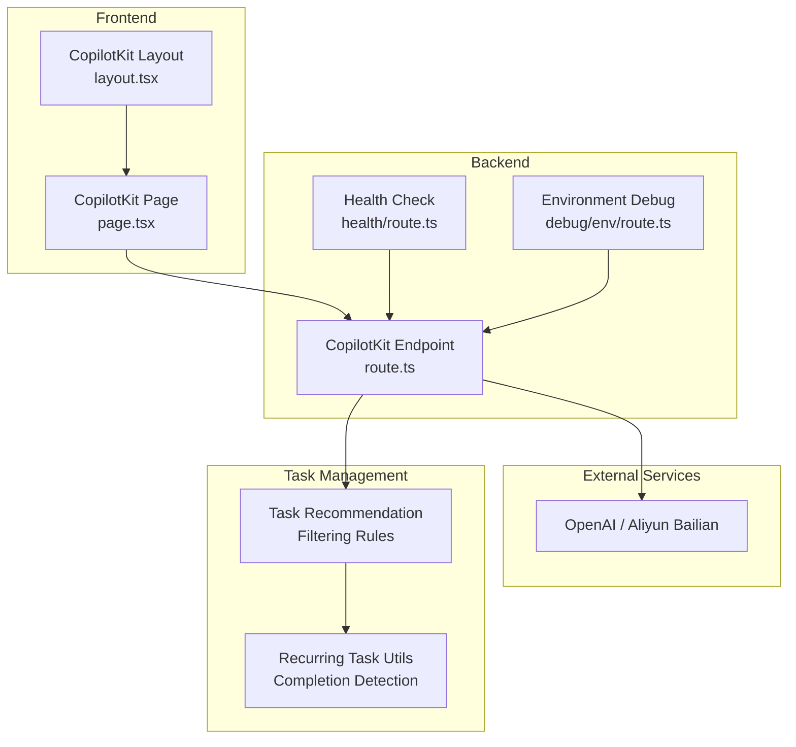
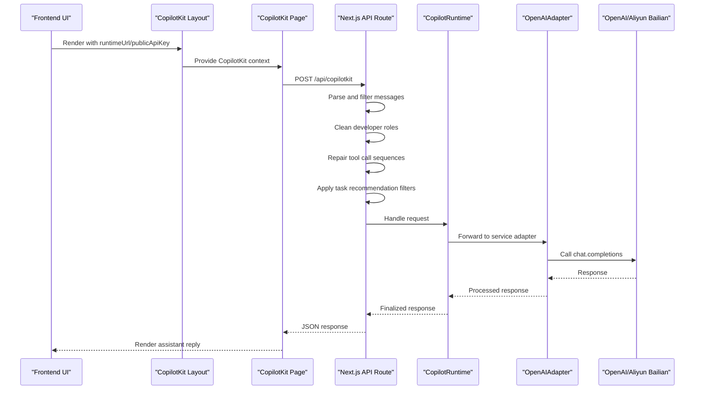
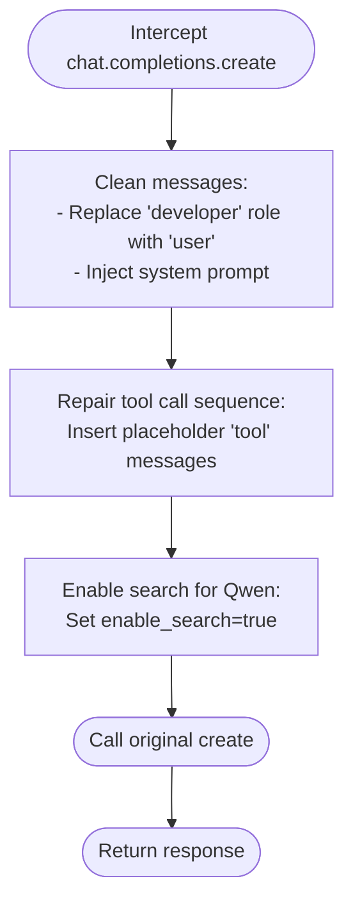
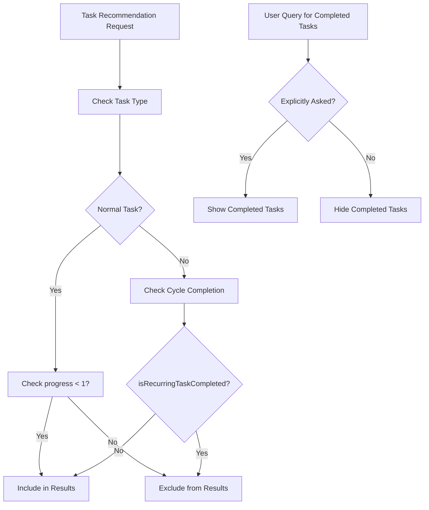
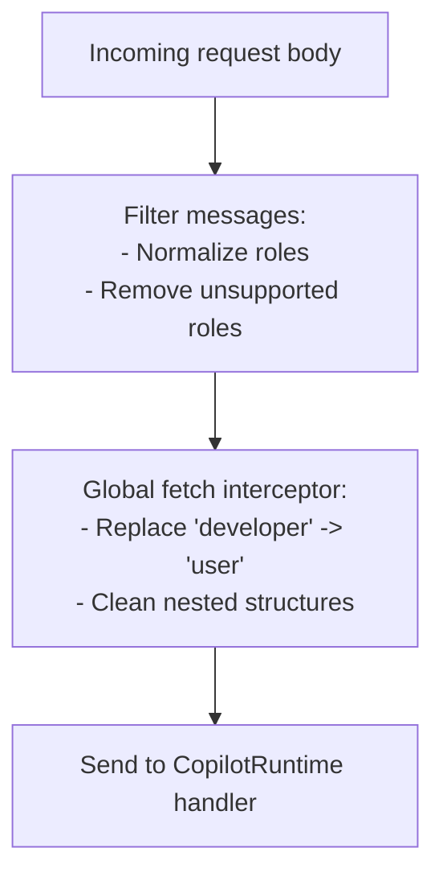
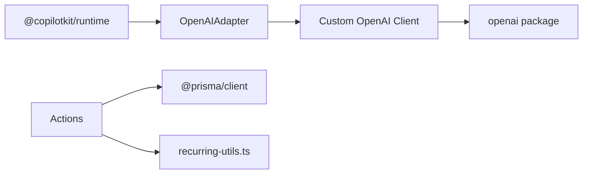

# CopilotKit Runtime Configuration

<cite>
**Referenced Files in This Document**
- [route.ts](file://src/app/api/copilotkit/route.ts)
- [health/route.ts](file://src/app/api/copilotkit/health/route.ts)
- [env/route.ts](file://src/app/api/debug/env/route.ts)
- [layout.tsx](file://src/app/copilotkit/layout.tsx)
- [page.tsx](file://src/app/copilotkit/page.tsx)
- [package.json](file://package.json)
- [ENV_TEMPLATE.md](file://ENV_TEMPLATE.md)
- [README.md](file://README.md)
- [recurring-utils.ts](file://src/lib/recurring-utils.ts)
</cite>

## Update Summary
**Changes Made**
- Enhanced task recommendation filtering with comprehensive guidelines for AI assistant behavior
- Added strict rules for recommending incomplete tasks only
- Implemented special handling for user queries about completed tasks
- Updated system prompt with detailed filtering instructions
- Improved cycle task completion detection logic

## Table of Contents
1. [Introduction](#introduction)
2. [Project Structure](#project-structure)
3. [Core Components](#core-components)
4. [Architecture Overview](#architecture-overview)
5. [Detailed Component Analysis](#detailed-component-analysis)
6. [Dependency Analysis](#dependency-analysis)
7. [Performance Considerations](#performance-considerations)
8. [Troubleshooting Guide](#troubleshooting-guide)
9. [Conclusion](#conclusion)

## Introduction
This document explains how the CopilotKit runtime is configured and operated in the project. It covers initialization of the runtime, adapter setup, and a custom OpenAI client implementation. It documents runtime configuration options, service adapter selection (OpenAI vs Aliyun Bailian), model parameter settings, and the message cleaning mechanisms for developer role replacement and tool call sequence repair. Practical examples show how to initialize the runtime, configure adapters, and set up a custom client. Environment variable requirements are listed, along with error handling strategies, model switching between OpenAI and Qwen models, debugging tips, and performance optimization guidance.

**Updated** Enhanced with comprehensive task recommendation filtering rules that enforce AI assistant behavior guidelines for intelligent task management.

## Project Structure
The CopilotKit integration is centered around a Next.js API route that initializes the runtime, defines actions, and exposes an endpoint for CopilotKit clients. Supporting routes provide health checks and environment diagnostics. The frontend wraps the application with the CopilotKit provider and renders a sidebar for interactions.

**Diagram sources**
- [layout.tsx:10-19](file://src/app/copilotkit/layout.tsx#L10-L19)
- [page.tsx:12-26](file://src/app/copilotkit/page.tsx#L12-L26)
- [route.ts:1608-1612](file://src/app/api/copilotkit/route.ts#L1608-L1612)
- [health/route.ts:3-25](file://src/app/api/copilotkit/health/route.ts#L3-L25)
- [env/route.ts:3-9](file://src/app/api/debug/env/route.ts#L3-L9)
- [recurring-utils.ts:138-147](file://src/lib/recurring-utils.ts#L138-L147)

**Section sources**
- [layout.tsx:10-19](file://src/app/copilotkit/layout.tsx#L10-L19)
- [page.tsx:12-26](file://src/app/copilotkit/page.tsx#L12-L26)
- [route.ts:1608-1612](file://src/app/api/copilotkit/route.ts#L1608-L1612)

## Core Components
- CopilotRuntime initialization with a set of system actions for plan and progress management.
- OpenAIAdapter configured to use a specific model and a custom OpenAI client.
- Custom OpenAI client that intercepts chat completions to clean messages, inject system prompts, repair tool call sequences, and enable search for Qwen models.
- Message filtering pipeline that normalizes unsupported roles and cleans developer roles.
- **Enhanced task recommendation filtering** with strict rules for incomplete task recommendations and special handling for completed task queries.
- Health and environment diagnostic endpoints.

**Updated** Added comprehensive task recommendation filtering with AI assistant behavior guidelines.

**Section sources**
- [route.ts:287-284](file://src/app/api/copilotkit/route.ts#L287-L284)
- [route.ts:88-271](file://src/app/api/copilotkit/route.ts#L88-L271)
- [route.ts:1456-1635](file://src/app/api/copilotkit/route.ts#L1456-L1635)
- [health/route.ts:3-25](file://src/app/api/copilotkit/health/route.ts#L3-L25)
- [env/route.ts:3-9](file://src/app/api/debug/env/route.ts#L3-L9)

## Architecture Overview
The runtime integrates with CopilotKit via a Next.js App Router endpoint. The frontend wraps the app with the CopilotKit provider and sets runtimeUrl/publicApiKey. The backend constructs a CopilotRuntime with actions, configures an OpenAIAdapter backed by a custom OpenAI client, and exposes a handler that filters messages, cleans roles, repairs tool call sequences, and forwards requests to the service adapter.

**Diagram sources**
- [layout.tsx:10-19](file://src/app/copilotkit/layout.tsx#L10-L19)
- [page.tsx:12-26](file://src/app/copilotkit/page.tsx#L12-L26)
- [route.ts:1608-1612](file://src/app/api/copilotkit/route.ts#L1608-L1612)
- [route.ts:1456-1635](file://src/app/api/copilotkit/route.ts#L1456-L1635)

## Detailed Component Analysis

### CopilotRuntime Initialization
- Creates a CopilotRuntime with a collection of actions for intelligent task recommendation, plan querying, goal creation, plan creation, plan finding, progress updates, adding progress records, and analyzing progress reports.
- Initializes the runtime with a list of actions and logs the number of actions configured.

Practical example references:
- [runtime initialization:287-284](file://src/app/api/copilotkit/route.ts#L287-L284)

**Section sources**
- [route.ts:287-284](file://src/app/api/copilotkit/route.ts#L287-L284)

### Adapter Setup and Model Configuration
- Uses OpenAIAdapter with a specific model identifier suitable for Aliyun Bailian compatibility.
- Backs the adapter with a custom OpenAI client instance configured with OPENAI_API_KEY and OPENAI_BASE_URL.

Practical example references:
- [adapter configuration:279-282](file://src/app/api/copilotkit/route.ts#L279-L282)
- [custom client construction:273-276](file://src/app/api/copilotkit/route.ts#L273-L276)

**Section sources**
- [route.ts:279-282](file://src/app/api/copilotkit/route.ts#L279-L282)
- [route.ts:273-276](file://src/app/api/copilotkit/route.ts#L273-L276)

### Custom OpenAI Client Implementation
The custom client extends the OpenAI SDK to intercept chat.completions.create and applies:
- Developer role replacement: Recursively replaces role "developer" with "user" in messages and nested content.
- System prompt injection: Prepends or augments a domain-specific system prompt for the AI assistant.
- Tool call sequence repair: Inserts placeholder "tool" messages to satisfy model requirements for tool_call_id continuity.
- Search enablement: Adds enable_search to extra_body for Qwen models.

Practical example references:
- [intercept and wrap create:88-271](file://src/app/api/copilotkit/route.ts#L88-L271)
- [tool call sequence repair:19-67](file://src/app/api/copilotkit/route.ts#L19-L67)
- [search enablement:260-266](file://src/app/api/copilotkit/route.ts#L260-L266)

**Diagram sources**
- [route.ts:88-271](file://src/app/api/copilotkit/route.ts#L88-L271)
- [route.ts:19-67](file://src/app/api/copilotkit/route.ts#L19-L67)
- [route.ts:260-266](file://src/app/api/copilotkit/route.ts#L260-L266)

**Section sources**
- [route.ts:88-271](file://src/app/api/copilotkit/route.ts#L88-L271)
- [route.ts:19-67](file://src/app/api/copilotkit/route.ts#L19-L67)
- [route.ts:260-266](file://src/app/api/copilotkit/route.ts#L260-L266)

### Enhanced Task Recommendation Filtering
**Updated** The system now enforces strict AI assistant behavior guidelines for task recommendations:

#### Core Filtering Rules
1. **Only Recommend Incomplete Tasks**: When using 'recommendTasks', 'queryPlans', or 'findPlan', the system automatically filters out completed tasks
2. **Completed Task Special Handling**: Only show completed tasks when users explicitly ask about them
3. **Automatic Filtering Logic**: System automatically applies filters based on task completion status

#### Implementation Details
- **Incomplete Task Definition**: 
  - Normal tasks: progress < 100% (progress < 1)
  - Recurring tasks: current cycle completion count < target count
- **Cycle Task Completion Detection**: Uses `isRecurringTaskCompleted()` from recurring-utils.ts
- **Filter Application**: Applied in recommendTasks, queryPlans, and findPlan handlers

Practical example references:
- [task recommendation filtering:238-254](file://src/app/api/copilotkit/route.ts#L238-L254)
- [incomplete task filtering:340-348](file://src/app/api/copilotkit/route.ts#L340-L348)
- [cycle task completion:463-472](file://src/app/api/copilotkit/route.ts#L463-L472)

**Diagram sources**
- [route.ts:238-254](file://src/app/api/copilotkit/route.ts#L238-L254)
- [route.ts:340-348](file://src/app/api/copilotkit/route.ts#L340-L348)
- [recurring-utils.ts:138-147](file://src/lib/recurring-utils.ts#L138-L147)

**Section sources**
- [route.ts:238-254](file://src/app/api/copilotkit/route.ts#L238-L254)
- [route.ts:340-348](file://src/app/api/copilotkit/route.ts#L340-L348)
- [route.ts:463-472](file://src/app/api/copilotkit/route.ts#L463-L472)
- [recurring-utils.ts:138-147](file://src/lib/recurring-utils.ts#L138-L147)

### Message Cleaning Mechanisms
Two complementary cleaning mechanisms ensure message compatibility:
- Developer role replacement: Applied globally via a fetch interceptor to normalize any "developer" roles found in outbound requests.
- Role normalization: Filters messages to only support ["system","assistant","user","tool","function"], converting unsupported roles to "user".

Practical example references:
- [global fetch interceptor:1547-1605](file://src/app/api/copilotkit/route.ts#L1547-L1605)
- [role normalization:1484-1518](file://src/app/api/copilotkit/route.ts#L1484-L1518)

**Diagram sources**
- [route.ts:1484-1518](file://src/app/api/copilotkit/route.ts#L1484-L1518)
- [route.ts:1547-1605](file://src/app/api/copilotkit/route.ts#L1547-L1605)

**Section sources**
- [route.ts:1484-1518](file://src/app/api/copilotkit/route.ts#L1484-L1518)
- [route.ts:1547-1605](file://src/app/api/copilotkit/route.ts#L1547-L1605)

### Runtime Endpoint Handler
- Wraps the CopilotRuntime handler using copilotRuntimeNextJSAppRouterEndpoint with the runtime and serviceAdapter.
- Applies message filtering and cleaning before delegating to the runtime.
- Returns standardized responses and handles errors with detailed logging.

Practical example references:
- [endpoint handler setup:1608-1612](file://src/app/api/copilotkit/route.ts#L1608-L1612)
- [handleRequest invocation:1614-1616](file://src/app/api/copilotkit/route.ts#L1614-L1616)
- [error handling:1621-1634](file://src/app/api/copilotkit/route.ts#L1621-L1634)

**Section sources**
- [route.ts:1608-1612](file://src/app/api/copilotkit/route.ts#L1608-L1612)
- [route.ts:1614-1616](file://src/app/api/copilotkit/route.ts#L1614-L1616)
- [route.ts:1621-1634](file://src/app/api/copilotkit/route.ts#L1621-L1634)

### Frontend Integration
- The CopilotKit layout sets runtimeUrl and publicApiKey from environment variables.
- The CopilotKit page renders a sidebar and registers action renders for MCP tools.

Practical example references:
- [frontend provider setup:10-19](file://src/app/copilotkit/layout.tsx#L10-L19)
- [sidebar and tools:12-26](file://src/app/copilotkit/page.tsx#L12-L26)

**Section sources**
- [layout.tsx:10-19](file://src/app/copilotkit/layout.tsx#L10-L19)
- [page.tsx:12-26](file://src/app/copilotkit/page.tsx#L12-L26)

## Dependency Analysis
- The runtime depends on @copilotkit/runtime for runtime orchestration and adapter integration.
- The custom OpenAI client depends on the official openai package.
- Actions rely on Prisma for database operations.
- **Task filtering** depends on recurring-utils.ts for cycle task completion detection.

**Diagram sources**
- [package.json:16-39](file://package.json#L16-L39)
- [route.ts:1-9](file://src/app/api/copilotkit/route.ts#L1-L9)
- [recurring-utils.ts:138-147](file://src/lib/recurring-utils.ts#L138-L147)

**Section sources**
- [package.json:16-39](file://package.json#L16-L39)
- [route.ts:1-9](file://src/app/api/copilotkit/route.ts#L1-L9)
- [recurring-utils.ts:138-147](file://src/lib/recurring-utils.ts#L138-L147)

## Performance Considerations
- Message filtering and cleaning occur per request; keep message arrays minimal and avoid unnecessary nesting to reduce traversal overhead.
- Tool call sequence repair inserts placeholder messages; ensure tool_call_id continuity is preserved to prevent repeated repairs.
- Enabling search for Qwen adds extra_body parameters; monitor latency and adjust model parameters accordingly.
- Consider caching frequently accessed system options (e.g., tags) to reduce database queries during action execution.
- **Task filtering performance**: The system performs additional database queries for cycle task completion detection; consider caching results for frequently accessed tasks.

## Troubleshooting Guide
Common issues and resolutions:
- Missing environment variables:
  - Symptoms: Logs indicate missing OPENAI_API_KEY or OPENAI_BASE_URL; health endpoint reports missing configuration.
  - Resolution: Set OPENAI_API_KEY and OPENAI_BASE_URL in your environment. For Aliyun Bailian, use the compatible base URL.
  - References:
    - [environment checks:72-81](file://src/app/api/copilotkit/route.ts#L72-L81)
    - [health endpoint:5-16](file://src/app/api/copilotkit/health/route.ts#L5-L16)
    - [debug env route:5-9](file://src/app/api/debug/env/route.ts#L5-L9)
    - [template configuration:9-14](file://ENV_TEMPLATE.md#L9-L14)
    - [README configuration:43-45](file://README.md#L43-L45)

- Developer role errors:
  - Symptoms: Unexpected role "developer" causing downstream validation failures.
  - Resolution: Verify that the global fetch interceptor and message filters are applied; confirm custom client replaces "developer" roles.
  - References:
    - [fetch interceptor:1547-1605](file://src/app/api/copilotkit/route.ts#L1547-L1605)
    - [message filters:1484-1518](file://src/app/api/copilotkit/route.ts#L1484-L1518)

- Tool call sequence errors:
  - Symptoms: 400 errors after assistant tool calls due to missing tool results.
  - Resolution: Ensure tool call sequence repair runs before sending requests; verify assistant messages include tool_calls with valid ids.
  - References:
    - [tool call repair:19-67](file://src/app/api/copilotkit/route.ts#L19-L67)

- **Task recommendation filtering issues**:
  - Symptoms: Tasks not appearing in recommendations or completed tasks showing unexpectedly.
  - Resolution: Verify that the task recommendation filtering rules are properly applied; check cycle task completion detection logic.
  - References:
    - [task filtering rules:238-254](file://src/app/api/copilotkit/route.ts#L238-L254)
    - [incomplete task filtering:340-348](file://src/app/api/copilotkit/route.ts#L340-L348)
    - [cycle task completion:463-472](file://src/app/api/copilotkit/route.ts#L463-L472)

- Model switching (OpenAI vs Aliyun Bailian):
  - Steps:
    - Set OPENAI_API_KEY to your provider's API key.
    - For Aliyun Bailian, set OPENAI_BASE_URL to the compatible mode endpoint.
  - References:
    - [adapter model setting](file://src/app/api/copilotkit/route.ts#L280)
    - [template:13-14](file://ENV_TEMPLATE.md#L13-L14)
    - [README:144-145](file://README.md#L144-L145)

- Error handling:
  - The endpoint catches exceptions, logs stack traces, and returns a structured 500 response with error details.
  - References:
    - [error handling block:1621-1634](file://src/app/api/copilotkit/route.ts#L1621-L1634)

**Section sources**
- [route.ts:72-81](file://src/app/api/copilotkit/route.ts#L72-L81)
- [health/route.ts:5-16](file://src/app/api/copilotkit/health/route.ts#L5-L16)
- [env/route.ts:5-9](file://src/app/api/debug/env/route.ts#L5-L9)
- [ENV_TEMPLATE.md:13-14](file://ENV_TEMPLATE.md#L13-L14)
- [README.md:144-145](file://README.md#L144-L145)
- [route.ts:1547-1605](file://src/app/api/copilotkit/route.ts#L1547-L1605)
- [route.ts:1484-1518](file://src/app/api/copilotkit/route.ts#L1484-L1518)
- [route.ts:19-67](file://src/app/api/copilotkit/route.ts#L19-L67)
- [route.ts:280](file://src/app/api/copilotkit/route.ts#L280)
- [route.ts:1621-1634](file://src/app/api/copilotkit/route.ts#L1621-L1634)
- [route.ts:238-254](file://src/app/api/copilotkit/route.ts#L238-L254)
- [route.ts:340-348](file://src/app/api/copilotkit/route.ts#L340-L348)
- [route.ts:463-472](file://src/app/api/copilotkit/route.ts#L463-L472)

## Conclusion
The CopilotKit runtime is configured to work seamlessly with both OpenAI and Aliyun Bailian-compatible APIs. The setup includes robust message cleaning, tool call sequence repair, and a custom OpenAI client tailored for the application's domain. Environment variables are validated early, and diagnostic endpoints help troubleshoot configuration issues. **The enhanced task recommendation filtering system ensures AI assistant behavior compliance by strictly recommending only incomplete tasks and providing special handling for completed task queries.** By following the provided examples and guidelines, you can reliably initialize the runtime, switch models, and optimize performance.