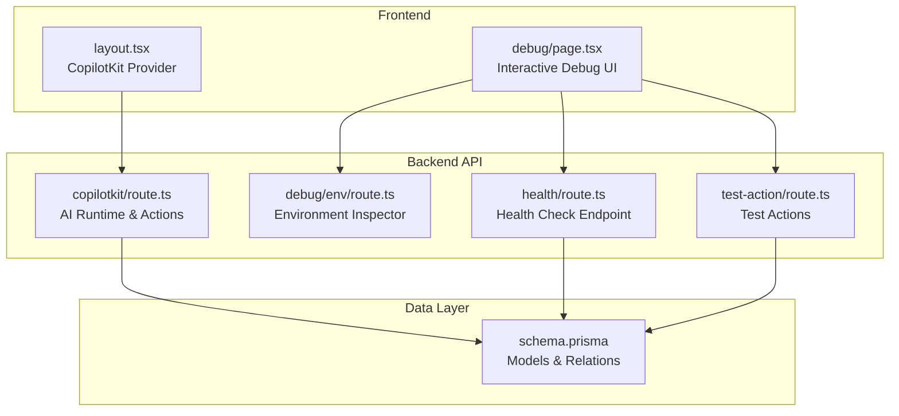
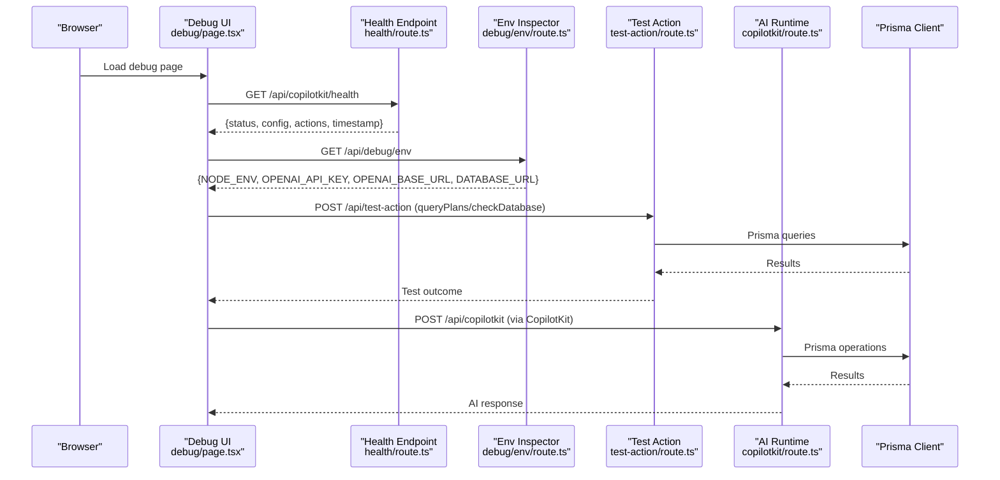
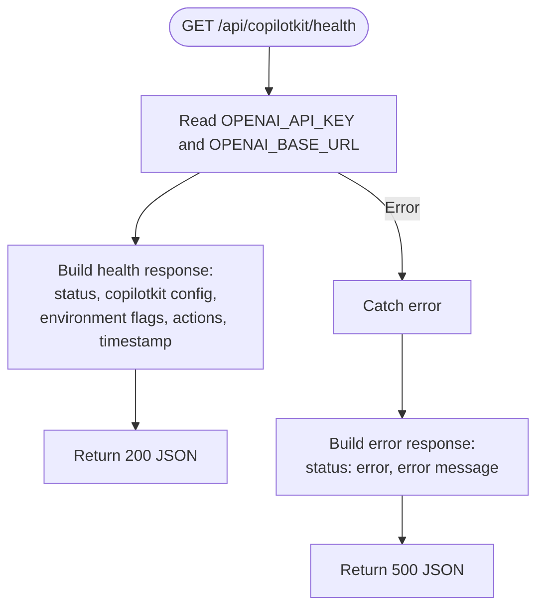
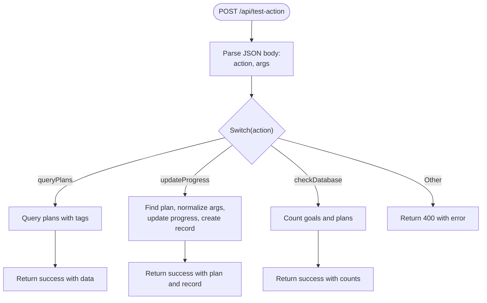
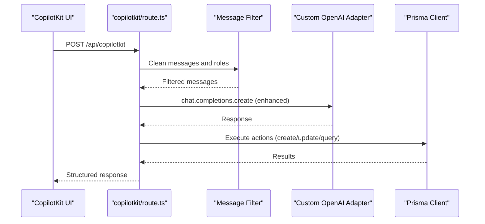
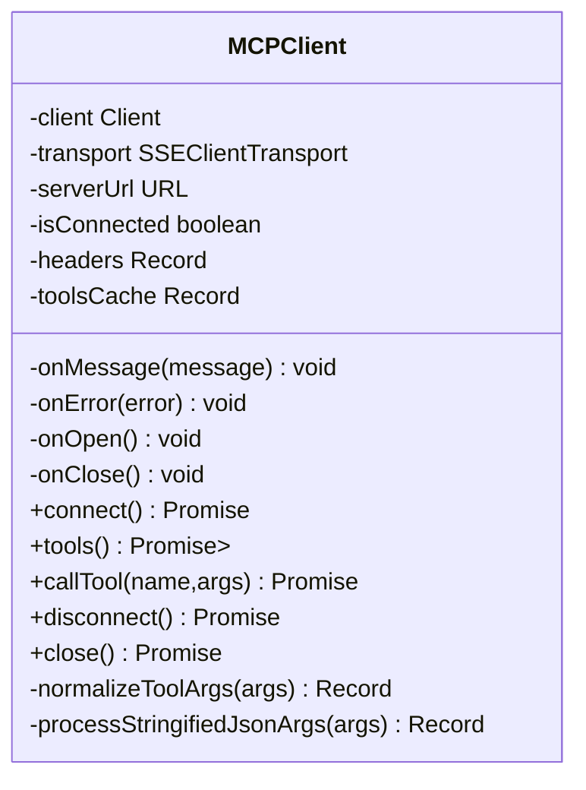
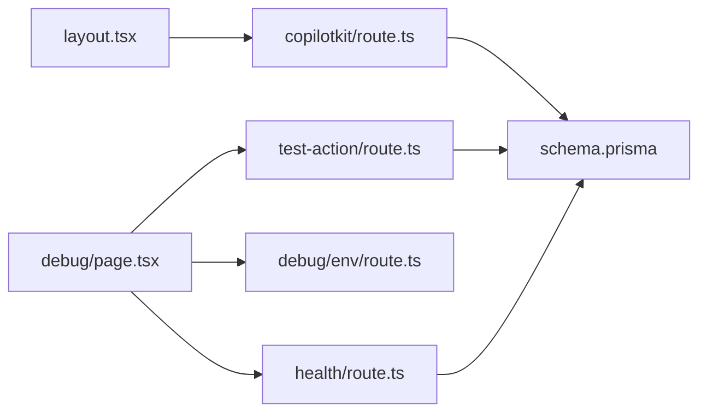

# Health Monitoring and Debugging

<cite>
**Referenced Files in This Document**
- [health/route.ts](file://src/app/api/copilotkit/health/route.ts)
- [debug/env/route.ts](file://src/app/api/debug/env/route.ts)
- [debug/page.tsx](file://src/app/debug/page.tsx)
- [test-action/route.ts](file://src/app/api/test-action/route.ts)
- [copilotkit/route.ts](file://src/app/api/copilotkit/route.ts)
- [layout.tsx](file://src/app/layout.tsx)
- [mcp-client.ts](file://src/app/utils/mcp-client.ts)
- [schema.prisma](file://prisma/schema.prisma)
- [package.json](file://package.json)
- [README.md](file://README.md)
</cite>

## Table of Contents
1. [Introduction](#introduction)
2. [Project Structure](#project-structure)
3. [Core Components](#core-components)
4. [Architecture Overview](#architecture-overview)
5. [Detailed Component Analysis](#detailed-component-analysis)
6. [Dependency Analysis](#dependency-analysis)
7. [Performance Considerations](#performance-considerations)
8. [Troubleshooting Guide](#troubleshooting-guide)
9. [Conclusion](#conclusion)
10. [Appendices](#appendices)

## Introduction
This document provides comprehensive guidance for health monitoring and debugging of the AI assistant integration in the project. It covers:
- Health check endpoint implementation and status monitoring
- Diagnostic functionality and environment verification
- Logging strategies, error tracking, and performance monitoring approaches
- Debugging tools, development utilities, and troubleshooting procedures
- Practical examples of health checks, error scenarios, and resolution strategies
- Development environment setup, local testing procedures, and production monitoring best practices
- Common AI integration problems, their symptoms, and systematic debugging approaches
- Guidance on setting up monitoring alerts, performance optimization, and maintaining AI service reliability

## Project Structure
The health and debugging capabilities are implemented across several modules:
- Health and diagnostics endpoints under the API routes
- A dedicated debug page for interactive testing
- AI runtime integration with extensive logging and error handling
- Database schema and Prisma client for persistence
- Frontend integration via CopilotKit provider

**Diagram sources**
- [layout.tsx:16-30](file://src/app/layout.tsx#L16-L30)
- [debug/page.tsx:104-212](file://src/app/debug/page.tsx#L104-L212)
- [health/route.ts:1-32](file://src/app/api/copilotkit/health/route.ts#L1-L32)
- [debug/env/route.ts:1-10](file://src/app/api/debug/env/route.ts#L1-L10)
- [test-action/route.ts:1-153](file://src/app/api/test-action/route.ts#L1-L153)
- [copilotkit/route.ts:1456-1636](file://src/app/api/copilotkit/route.ts#L1456-L1636)
- [schema.prisma:16-61](file://prisma/schema.prisma#L16-L61)

**Section sources**
- [layout.tsx:16-30](file://src/app/layout.tsx#L16-L30)
- [debug/page.tsx:104-212](file://src/app/debug/page.tsx#L104-L212)
- [health/route.ts:1-32](file://src/app/api/copilotkit/health/route.ts#L1-L32)
- [debug/env/route.ts:1-10](file://src/app/api/debug/env/route.ts#L1-L10)
- [test-action/route.ts:1-153](file://src/app/api/test-action/route.ts#L1-L153)
- [copilotkit/route.ts:1456-1636](file://src/app/api/copilotkit/route.ts#L1456-L1636)
- [schema.prisma:16-61](file://prisma/schema.prisma#L16-L61)

## Core Components
- Health Check Endpoint: Provides system health, AI adapter configuration, and action availability.
- Environment Inspector: Exposes selected environment variables for quick verification.
- Test Action Router: Validates database connectivity and tests AI action invocation.
- AI Runtime: Integrates CopilotKit with custom OpenAI adapter, logging, and robust error handling.
- Debug Page: Interactive UI to trigger health checks, test actions, and inspect environment variables.
- MCP Client: Optional Model Context Protocol client with logging and argument normalization.

Key responsibilities:
- Health endpoint validates environment variables and returns configuration status.
- Debug page orchestrates frontend-to-backend testing and displays structured results.
- AI runtime centralizes logging, message filtering, and error reporting.
- Test action router provides deterministic checks for database and action execution.

**Section sources**
- [health/route.ts:3-32](file://src/app/api/copilotkit/health/route.ts#L3-L32)
- [debug/env/route.ts:3-10](file://src/app/api/debug/env/route.ts#L3-L10)
- [test-action/route.ts:6-153](file://src/app/api/test-action/route.ts#L6-L153)
- [copilotkit/route.ts:69-86](file://src/app/api/copilotkit/route.ts#L69-L86)
- [copilotkit/route.ts:1456-1636](file://src/app/api/copilotkit/route.ts#L1456-L1636)
- [debug/page.tsx:11-102](file://src/app/debug/page.tsx#L11-L102)
- [mcp-client.ts:26-64](file://src/app/utils/mcp-client.ts#L26-L64)

## Architecture Overview
The AI assistant health and debugging architecture integrates frontend and backend components with persistent storage and AI adapters.

**Diagram sources**
- [debug/page.tsx:11-102](file://src/app/debug/page.tsx#L11-L102)
- [health/route.ts:3-32](file://src/app/api/copilotkit/health/route.ts#L3-L32)
- [debug/env/route.ts:3-10](file://src/app/api/debug/env/route.ts#L3-L10)
- [test-action/route.ts:6-153](file://src/app/api/test-action/route.ts#L6-L153)
- [copilotkit/route.ts:1456-1636](file://src/app/api/copilotkit/route.ts#L1456-L1636)
- [schema.prisma:16-61](file://prisma/schema.prisma#L16-L61)

## Detailed Component Analysis

### Health Check Endpoint
Purpose:
- Verify AI adapter configuration (API key and base URL presence)
- Confirm action availability
- Provide timestamped health status

Implementation highlights:
- Reads environment variables and constructs masked identifiers for safety
- Returns structured JSON with environment flags and action list
- Catches errors and responds with 500 and error message

**Diagram sources**
- [health/route.ts:3-32](file://src/app/api/copilotkit/health/route.ts#L3-L32)

**Section sources**
- [health/route.ts:3-32](file://src/app/api/copilotkit/health/route.ts#L3-L32)

### Environment Inspector
Purpose:
- Quickly verify environment variable configuration from the backend perspective
- Mask sensitive values for safety

Behavior:
- Returns NODE_ENV, masked OPENAI_API_KEY, OPENAI_BASE_URL, and DATABASE_URL presence

**Section sources**
- [debug/env/route.ts:3-10](file://src/app/api/debug/env/route.ts#L3-L10)

### Test Action Router
Purpose:
- Provide deterministic checks for database connectivity and action execution
- Support development and CI-style validation

Capabilities:
- queryPlans: Retrieve paginated plans with associated tags
- updateProgress: Update plan progress and create progress records
- checkDatabase: Basic counts of goals and plans to validate connectivity

**Diagram sources**
- [test-action/route.ts:6-153](file://src/app/api/test-action/route.ts#L6-L153)

**Section sources**
- [test-action/route.ts:6-153](file://src/app/api/test-action/route.ts#L6-L153)

### AI Runtime Integration
Purpose:
- Centralized AI orchestration with logging, message filtering, and error handling
- Custom OpenAI adapter with model-specific enhancements and search enablement

Key features:
- Environment checks and masked logging for API key/base URL
- Interception and cleaning of developer role messages
- Repair of assistant tool call sequences for compatibility
- Global fetch interceptor to sanitize outbound requests
- Comprehensive action registry (recommendTasks, queryPlans, createGoal, findPlan, updateProgress, etc.)

**Diagram sources**
- [copilotkit/route.ts:69-86](file://src/app/api/copilotkit/route.ts#L69-L86)
- [copilotkit/route.ts:95-271](file://src/app/api/copilotkit/route.ts#L95-L271)
- [copilotkit/route.ts:287-1451](file://src/app/api/copilotkit/route.ts#L287-L1451)
- [copilotkit/route.ts:1456-1636](file://src/app/api/copilotkit/route.ts#L1456-L1636)

**Section sources**
- [copilotkit/route.ts:69-86](file://src/app/api/copilotkit/route.ts#L69-L86)
- [copilotkit/route.ts:95-271](file://src/app/api/copilotkit/route.ts#L95-L271)
- [copilotkit/route.ts:287-1451](file://src/app/api/copilotkit/route.ts#L287-L1451)
- [copilotkit/route.ts:1456-1636](file://src/app/api/copilotkit/route.ts#L1456-L1636)

### Debug Page
Purpose:
- Provide an interactive dashboard for health checks, environment inspection, and action testing
- Display structured results and guidance

Features:
- Environment variable inspection
- Health endpoint testing
- Action testing (queryPlans, updateProgress, checkDatabase)
- Configuration guidance and common troubleshooting tips

**Section sources**
- [debug/page.tsx:7-212](file://src/app/debug/page.tsx#L7-L212)

### MCP Client (Optional)
Purpose:
- Implement Model Context Protocol client for standardized MCP server communication
- Provide tool discovery, caching, and argument normalization

Highlights:
- SSE transport with optional headers
- Tools caching to avoid repeated fetches
- Argument normalization and JSON string processing
- Event hooks for message, error, open, and close

**Diagram sources**
- [mcp-client.ts:26-64](file://src/app/utils/mcp-client.ts#L26-L64)
- [mcp-client.ts:115-234](file://src/app/utils/mcp-client.ts#L115-L234)
- [mcp-client.ts:269-300](file://src/app/utils/mcp-client.ts#L269-L300)
- [mcp-client.ts:306-363](file://src/app/utils/mcp-client.ts#L306-L363)

**Section sources**
- [mcp-client.ts:26-64](file://src/app/utils/mcp-client.ts#L26-L64)
- [mcp-client.ts:115-234](file://src/app/utils/mcp-client.ts#L115-L234)
- [mcp-client.ts:269-300](file://src/app/utils/mcp-client.ts#L269-L300)
- [mcp-client.ts:306-363](file://src/app/utils/mcp-client.ts#L306-L363)

## Dependency Analysis
The system exhibits clear separation of concerns:
- Frontend integrates AI runtime via CopilotKit provider
- Backend exposes health, environment, and test endpoints
- AI runtime depends on Prisma for persistence and OpenAI-compatible adapter for inference
- Debug page consumes all endpoints for diagnostics

**Diagram sources**
- [layout.tsx:24](file://src/app/layout.tsx#L24)
- [debug/page.tsx:17-94](file://src/app/debug/page.tsx#L17-L94)
- [health/route.ts:5-6](file://src/app/api/copilotkit/health/route.ts#L5-L6)
- [test-action/route.ts:2](file://src/app/api/test-action/route.ts#L2)
- [copilotkit/route.ts:11](file://src/app/api/copilotkit/route.ts#L11)
- [schema.prisma:11-14](file://prisma/schema.prisma#L11-L14)

**Section sources**
- [layout.tsx:24](file://src/app/layout.tsx#L24)
- [debug/page.tsx:17-94](file://src/app/debug/page.tsx#L17-L94)
- [health/route.ts:5-6](file://src/app/api/copilotkit/health/route.ts#L5-L6)
- [test-action/route.ts:2](file://src/app/api/test-action/route.ts#L2)
- [copilotkit/route.ts:11](file://src/app/api/copilotkit/route.ts#L11)
- [schema.prisma:11-14](file://prisma/schema.prisma#L11-L14)

## Performance Considerations
- Logging overhead: Extensive console logging aids debugging but can impact performance in production. Consider structured logging and sampling in high-throughput environments.
- Database queries: Batch operations and appropriate indexing improve performance. Monitor slow queries and optimize frequently accessed relations.
- AI adapter calls: Network latency and retries should be considered. Implement timeouts and circuit breaker patterns for external API calls.
- Caching: Tools caching in MCP client reduces repeated tool discovery calls. Leverage caching for static configurations.
- Message filtering: Minimal overhead but ensure filters are efficient and avoid deep cloning unnecessary structures.

[No sources needed since this section provides general guidance]

## Troubleshooting Guide

Common AI integration problems and resolutions:
- Missing environment variables:
  - Symptoms: Health endpoint reports missing keys; AI runtime logs indicate missing configuration.
  - Resolution: Set OPENAI_API_KEY and OPENAI_BASE_URL; restart the server; verify with environment inspector.
- Developer role conflicts:
  - Symptoms: Assistant tool call sequence errors or malformed messages.
  - Resolution: AI runtime automatically cleans developer roles; ensure messages are properly filtered before reaching the adapter.
- Tool call sequence mismatches:
  - Symptoms: Validation errors indicating missing tool results.
  - Resolution: AI runtime repairs sequences by inserting placeholder tool messages; verify action handlers return expected results.
- Database connectivity issues:
  - Symptoms: Test action returns errors; counts are unavailable.
  - Resolution: Validate DATABASE_URL; run Prisma client generation and migrations; confirm service availability.
- Action execution failures:
  - Symptoms: Specific action handlers fail with errors.
  - Resolution: Inspect action logs; validate input parameters; ensure Prisma models align with expected schemas.

Development utilities and procedures:
- Use the debug page to run health checks, environment inspection, and action tests.
- For AI runtime issues, review logs around message filtering and adapter interception.
- For database issues, leverage the test-action endpoints to validate connectivity and basic operations.

Production monitoring best practices:
- Implement structured logging with severity levels and correlation IDs.
- Set up alerting for health endpoint failures and elevated error rates.
- Monitor AI adapter latency and error ratios; configure retries and circuit breakers.
- Track database query performance and failure rates; maintain proper indexing.

**Section sources**
- [health/route.ts:26-31](file://src/app/api/copilotkit/health/route.ts#L26-L31)
- [copilotkit/route.ts:69-86](file://src/app/api/copilotkit/route.ts#L69-L86)
- [copilotkit/route.ts:19-67](file://src/app/api/copilotkit/route.ts#L19-L67)
- [copilotkit/route.ts:1545-1605](file://src/app/api/copilotkit/route.ts#L1545-L1605)
- [test-action/route.ts:146-152](file://src/app/api/test-action/route.ts#L146-L152)
- [debug/page.tsx:11-102](file://src/app/debug/page.tsx#L11-L102)

## Conclusion
The project provides a robust foundation for AI assistant health monitoring and debugging through:
- A dedicated health endpoint with environment verification
- An interactive debug page for diagnostics
- Comprehensive logging and error handling in the AI runtime
- Deterministic test actions for database and action validation
- Optional MCP client for standardized protocol support

Adopting the recommended monitoring and troubleshooting practices ensures reliable operation and rapid issue resolution in both development and production environments.

[No sources needed since this section summarizes without analyzing specific files]

## Appendices

### Development Environment Setup
- Install dependencies and initialize Prisma:
  - Run scripts defined in package.json for installation, Prisma client generation, and database push.
- Configure environment variables:
  - Refer to README for required variables including AI API key and base URL, database URL, and authentication secrets.
- Start the development server and access the debug page for health checks and tests.

**Section sources**
- [package.json:5-14](file://package.json#L5-L14)
- [README.md:38-83](file://README.md#L38-L83)

### Local Testing Procedures
- Navigate to the debug page and use the provided buttons to:
  - Check environment variables
  - Test the health endpoint
  - Execute test actions (queryPlans, updateProgress, checkDatabase)
- Review the structured results displayed on the page for immediate feedback.

**Section sources**
- [debug/page.tsx:11-102](file://src/app/debug/page.tsx#L11-L102)

### Production Monitoring Best Practices
- Health endpoint monitoring: Ensure the health endpoint is reachable and returns healthy status regularly.
- Logging: Use structured logs with timestamps, severity, and contextual information; avoid logging sensitive data.
- Error tracking: Capture and categorize errors from AI runtime and test actions; monitor error rates and stack traces.
- Performance: Track AI adapter latency, database query durations, and memory usage; set up alerts for anomalies.
- Alerts: Configure notifications for health failures, high error rates, and performance degradation thresholds.

**Section sources**
- [health/route.ts:8-25](file://src/app/api/copilotkit/health/route.ts#L8-L25)
- [copilotkit/route.ts:1621-1634](file://src/app/api/copilotkit/route.ts#L1621-L1634)
- [test-action/route.ts:146-152](file://src/app/api/test-action/route.ts#L146-L152)