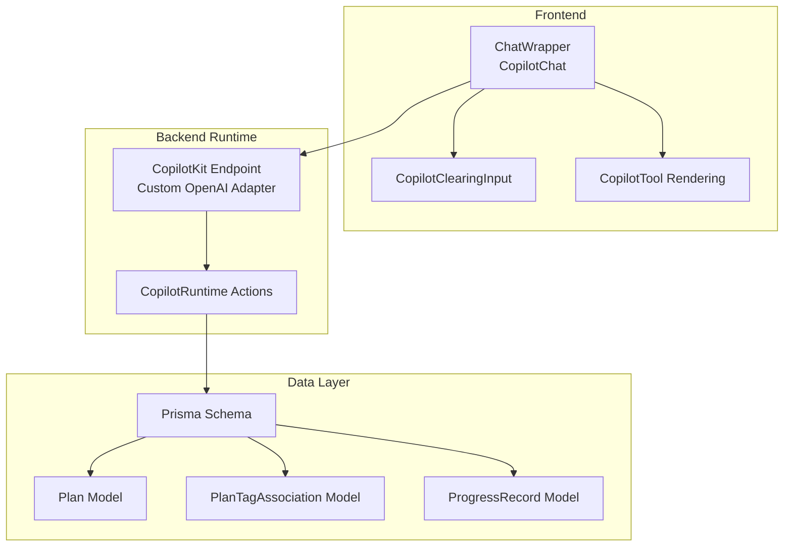
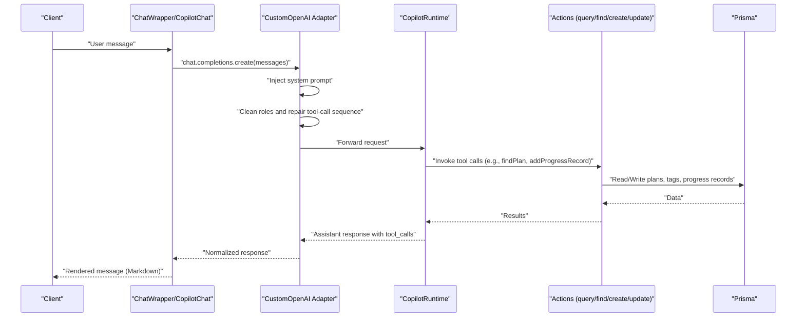
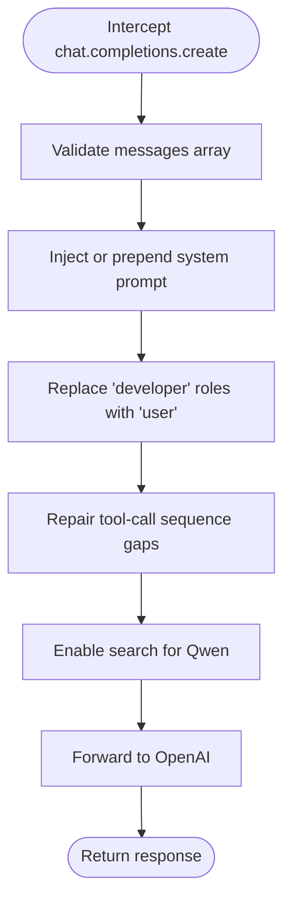
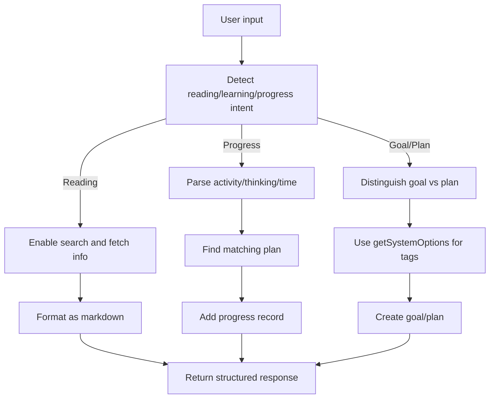
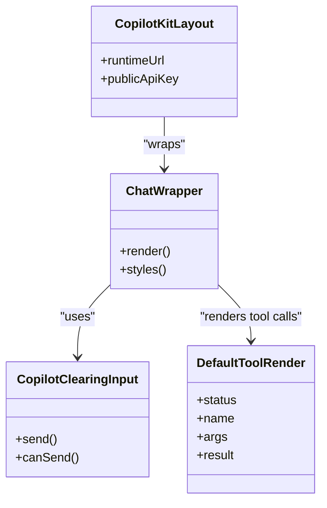
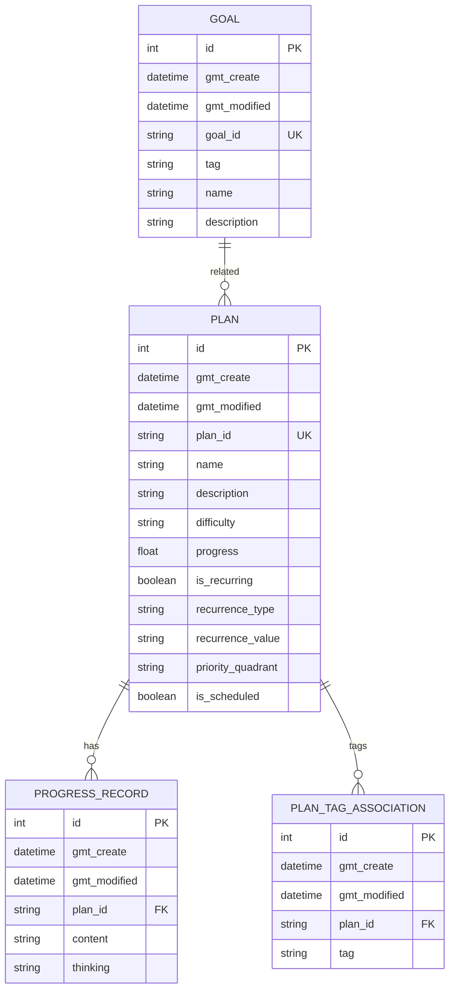
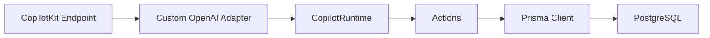

# System Prompts and Injection

<cite>
**Referenced Files in This Document**
- [route.ts](file://src/app/api/copilotkit/route.ts)
- [layout.tsx](file://src/app/copilotkit/layout.tsx)
- [page.tsx](file://src/app/copilotkit/page.tsx)
- [chat-wrapper.tsx](file://src/components/chat-wrapper.tsx)
- [copilot-clearing-input.tsx](file://src/components/copilot-clearing-input.tsx)
- [default-tool-render.tsx](file://src/components/default-tool-render.tsx)
- [schema.prisma](file://prisma/schema.prisma)
- [route.ts](file://src/app/api/progress_record/route.ts)
- [route.ts](file://src/app/api/report/route.ts)
- [page.tsx](file://src/app/page.tsx)
- [health/route.ts](file://src/app/api/copilotkit/health/route.ts)
</cite>

## Table of Contents
1. [Introduction](#introduction)
2. [Project Structure](#project-structure)
3. [Core Components](#core-components)
4. [Architecture Overview](#architecture-overview)
5. [Detailed Component Analysis](#detailed-component-analysis)
6. [Dependency Analysis](#dependency-analysis)
7. [Performance Considerations](#performance-considerations)
8. [Troubleshooting Guide](#troubleshooting-guide)
9. [Conclusion](#conclusion)

## Introduction
This document explains the system prompts and injection mechanism for the Goal Mate AI assistant. It covers the custom system prompt implementation, prompt injection strategy, message cleaning and role normalization, markdown formatting requirements, intelligent processing flows for reading-related queries, and practical examples of prompt usage and transformations. It also provides guidance on customization, content enhancement, debugging, and extending the system prompt for new capabilities while maintaining consistency across different AI models.

## Project Structure
The system integrates a CopilotKit runtime endpoint with a custom OpenAI adapter that injects a comprehensive system prompt and enforces message normalization. The frontend provides a chat interface with markdown rendering enhancements and a specialized input component. Supporting backend routes manage progress records and reports, and the Prisma schema defines the data model for goals, plans, tags, and progress records.

**Diagram sources**
- [route.ts:1456-1458](file://src/app/api/copilotkit/route.ts#L1456-L1458)
- [chat-wrapper.tsx:698-706](file://src/components/chat-wrapper.tsx#L698-L706)
- [copilot-clearing-input.tsx:84-175](file://src/components/copilot-clearing-input.tsx#L84-L175)
- [default-tool-render.tsx:12-95](file://src/components/default-tool-render.tsx#L12-L95)
- [schema.prisma:16-61](file://prisma/schema.prisma#L16-L61)

**Section sources**
- [route.ts:1456-1458](file://src/app/api/copilotkit/route.ts#L1456-L1458)
- [chat-wrapper.tsx:698-706](file://src/components/chat-wrapper.tsx#L698-L706)
- [copilot-clearing-input.tsx:84-175](file://src/components/copilot-clearing-input.tsx#L84-L175)
- [default-tool-render.tsx:12-95](file://src/components/default-tool-render.tsx#L12-L95)
- [schema.prisma:16-61](file://prisma/schema.prisma#L16-L61)

## Core Components
- Custom OpenAI Adapter with prompt injection and message cleaning
- CopilotKit runtime actions for goals, plans, progress, and recommendations
- Frontend chat wrapper with markdown rendering and input clearing
- Prisma-backed data model for plans, tags, and progress records

Key responsibilities:
- Inject and update a comprehensive system prompt at runtime
- Normalize message roles and repair tool-call sequences for compatibility
- Enable search for reading-related queries and enforce markdown formatting
- Provide intelligent processing flows for progress recording and plan creation

**Section sources**
- [route.ts:88-271](file://src/app/api/copilotkit/route.ts#L88-L271)
- [route.ts:287-1452](file://src/app/api/copilotkit/route.ts#L287-L1452)
- [chat-wrapper.tsx:698-706](file://src/components/chat-wrapper.tsx#L698-L706)
- [schema.prisma:16-61](file://prisma/schema.prisma#L16-L61)

## Architecture Overview
The system prompt is injected into every OpenAI chat completion request via a custom adapter. The adapter also cleans messages by replacing invalid or developer roles, repairs tool-call sequences, and enables search for reading queries. The CopilotKit runtime exposes actions that the AI can call to query and update plans and progress, ensuring consistent behavior across models.

**Diagram sources**
- [route.ts:88-271](file://src/app/api/copilotkit/route.ts#L88-L271)
- [route.ts:287-1452](file://src/app/api/copilotkit/route.ts#L287-L1452)
- [chat-wrapper.tsx:698-706](file://src/components/chat-wrapper.tsx#L698-L706)

## Detailed Component Analysis

### System Prompt Injection and Message Cleaning
- Prompt injection: The adapter intercepts chat completions and ensures a system message exists or updates it with the comprehensive prompt. The prompt defines core workflows, reading-related handling, progress analysis, and task distinction logic.
- Role replacement: Any occurrence of a developer role is replaced with user to normalize messages.
- Tool-call sequence repair: Ensures tool messages follow assistant tool_calls by inserting placeholder tool messages where needed for compatibility with OpenAI-compatible APIs.

**Diagram sources**
- [route.ts:88-271](file://src/app/api/copilotkit/route.ts#L88-L271)
- [route.ts:13-67](file://src/app/api/copilotkit/route.ts#L13-L67)

**Section sources**
- [route.ts:88-271](file://src/app/api/copilotkit/route.ts#L88-L271)
- [route.ts:13-67](file://src/app/api/copilotkit/route.ts#L13-L67)

### Intelligent Processing Flows
- Reading-related queries: When books or reading plans are mentioned, the system automatically enables search and returns structured markdown with metadata, summary, chapter outline, and reading advice.
- Progress analysis: The system parses user reports to separate activities, thinking, and time, then finds the most relevant plan and records progress accordingly.
- Task distinction: The system distinguishes between goals (abstract) and plans (specific) and enforces tag rules and difficulty standards.

**Diagram sources**
- [route.ts:131-248](file://src/app/api/copilotkit/route.ts#L131-L248)
- [route.ts:1195-1450](file://src/app/api/copilotkit/route.ts#L1195-L1450)
- [route.ts:287-701](file://src/app/api/copilotkit/route.ts#L287-L701)

**Section sources**
- [route.ts:131-248](file://src/app/api/copilotkit/route.ts#L131-L248)
- [route.ts:1195-1450](file://src/app/api/copilotkit/route.ts#L1195-L1450)
- [route.ts:287-701](file://src/app/api/copilotkit/route.ts#L287-L701)

### Frontend Chat and Markdown Rendering
- ChatWrapper integrates CopilotChat with a custom input component and extensive markdown rendering styles to ensure proper hydration and presentation.
- The input component clears after send using flushSync semantics to maintain a responsive UX.
- The layout wraps the app with CopilotKit configuration for runtime and public API key.

**Diagram sources**
- [chat-wrapper.tsx:698-706](file://src/components/chat-wrapper.tsx#L698-L706)
- [copilot-clearing-input.tsx:84-175](file://src/components/copilot-clearing-input.tsx#L84-L175)
- [layout.tsx:10-19](file://src/app/copilotkit/layout.tsx#L10-L19)
- [default-tool-render.tsx:12-95](file://src/components/default-tool-render.tsx#L12-L95)

**Section sources**
- [chat-wrapper.tsx:698-706](file://src/components/chat-wrapper.tsx#L698-L706)
- [copilot-clearing-input.tsx:84-175](file://src/components/copilot-clearing-input.tsx#L84-L175)
- [layout.tsx:10-19](file://src/app/copilotkit/layout.tsx#L10-L19)
- [default-tool-render.tsx:12-95](file://src/components/default-tool-render.tsx#L12-L95)

### Backend Actions and Data Model
- Actions include recommendTasks, queryPlans, createGoal, getSystemOptions, createPlan, findPlan, updateProgress, addProgressRecord, and analyzeAndRecordProgress.
- The Prisma schema defines models for Goal, Plan, PlanTagAssociation, and ProgressRecord, enabling robust querying and tagging for plans.

**Diagram sources**
- [schema.prisma:16-61](file://prisma/schema.prisma#L16-L61)

**Section sources**
- [route.ts:287-1452](file://src/app/api/copilotkit/route.ts#L287-L1452)
- [schema.prisma:16-61](file://prisma/schema.prisma#L16-L61)

### Practical Examples and Usage Patterns
- Reading recommendation: Ask about a book to trigger search and markdown formatting with metadata and chapter outline.
- Progress recording: Describe an activity with optional thinking and time; the system parses and records against the best-matching plan.
- Goal vs plan creation: Distinguish abstract goals from specific plans; use getSystemOptions to select appropriate tags and difficulty.

Examples of prompt usage and transformations are embedded in the system prompt injection and action handlers.

**Section sources**
- [route.ts:131-248](file://src/app/api/copilotkit/route.ts#L131-L248)
- [route.ts:1195-1450](file://src/app/api/copilotkit/route.ts#L1195-L1450)
- [page.tsx:94-111](file://src/app/page.tsx#L94-L111)

## Dependency Analysis
- The CopilotKit endpoint depends on the custom OpenAI adapter to inject the system prompt and normalize messages.
- The adapter relies on CopilotRuntime actions to operate on plans and progress.
- The data layer is managed by Prisma, with explicit relations between plans, tags, and progress records.

**Diagram sources**
- [route.ts:1456-1458](file://src/app/api/copilotkit/route.ts#L1456-L1458)
- [route.ts:287-1452](file://src/app/api/copilotkit/route.ts#L287-L1452)
- [schema.prisma:11-14](file://prisma/schema.prisma#L11-L14)

**Section sources**
- [route.ts:1456-1458](file://src/app/api/copilotkit/route.ts#L1456-L1458)
- [route.ts:287-1452](file://src/app/api/copilotkit/route.ts#L287-L1452)
- [schema.prisma:11-14](file://prisma/schema.prisma#L11-L14)

## Performance Considerations
- Message normalization and tool-call sequence repair occur synchronously during request interception; keep message sizes reasonable to minimize overhead.
- Enabling search improves accuracy for reading queries but may increase latency; consider caching frequently accessed book metadata.
- Frontend markdown rendering uses CSS transforms and observers; avoid excessive DOM mutations to prevent reflows.

## Troubleshooting Guide
Common issues and resolutions:
- Missing environment variables: Ensure OPENAI_API_KEY and OPENAI_BASE_URL are configured; the health endpoint validates configuration.
- Role conflicts: Developer roles are automatically replaced with user; verify logs for replacements.
- Tool-call sequence errors: The repair function inserts placeholder tool messages; check logs for insertion events.
- Search not enabled: Verify extra_body settings for Qwen models; the adapter sets enable_search automatically.
- Markdown rendering hydration: The chat wrapper includes fixes for paragraph and block elements; ensure styles are loaded.

**Section sources**
- [health/route.ts:1-32](file://src/app/api/copilotkit/health/route.ts#L1-L32)
- [route.ts:72-86](file://src/app/api/copilotkit/route.ts#L72-L86)
- [route.ts:13-67](file://src/app/api/copilotkit/route.ts#L13-L67)
- [route.ts:260-266](file://src/app/api/copilotkit/route.ts#L260-L266)
- [chat-wrapper.tsx:17-59](file://src/components/chat-wrapper.tsx#L17-L59)

## Conclusion
The Goal Mate AI assistant employs a robust system prompt injection mechanism integrated with a custom OpenAI adapter and CopilotKit runtime actions. The prompt governs core workflows, reading-related handling, progress analysis, and task distinction. Message cleaning and tool-call sequence repair ensure compatibility across models. The frontend enhances markdown rendering and provides a responsive input experience. With clear extension points and consistent data modeling, the system supports iterative improvements and cross-model portability.