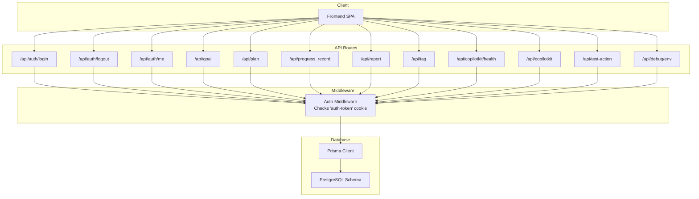
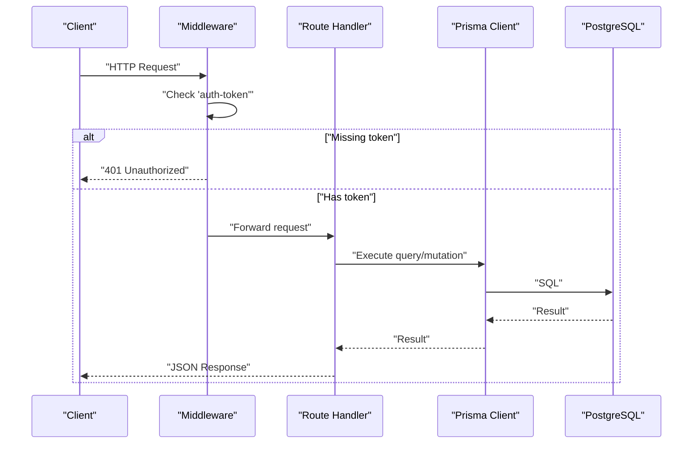
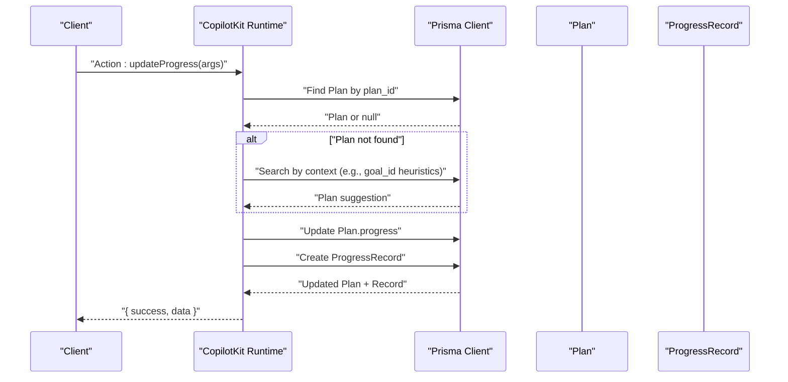
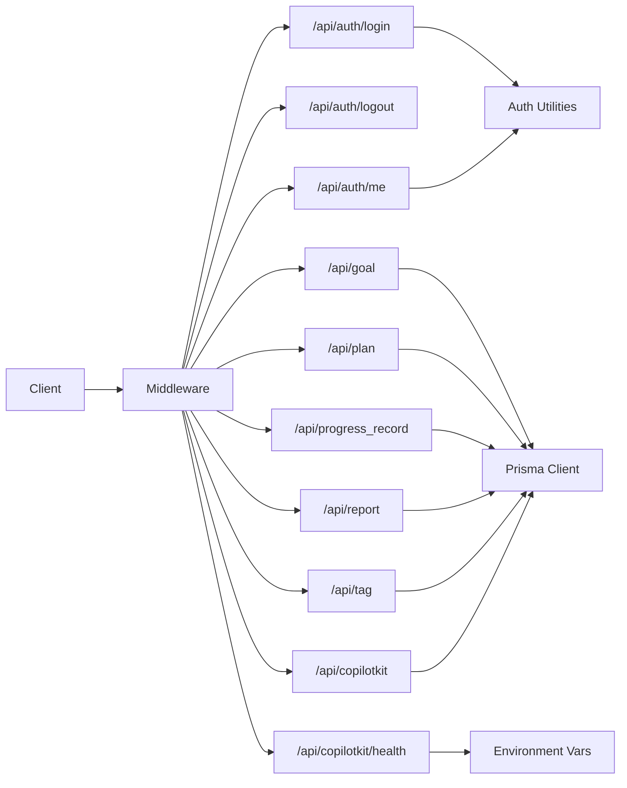
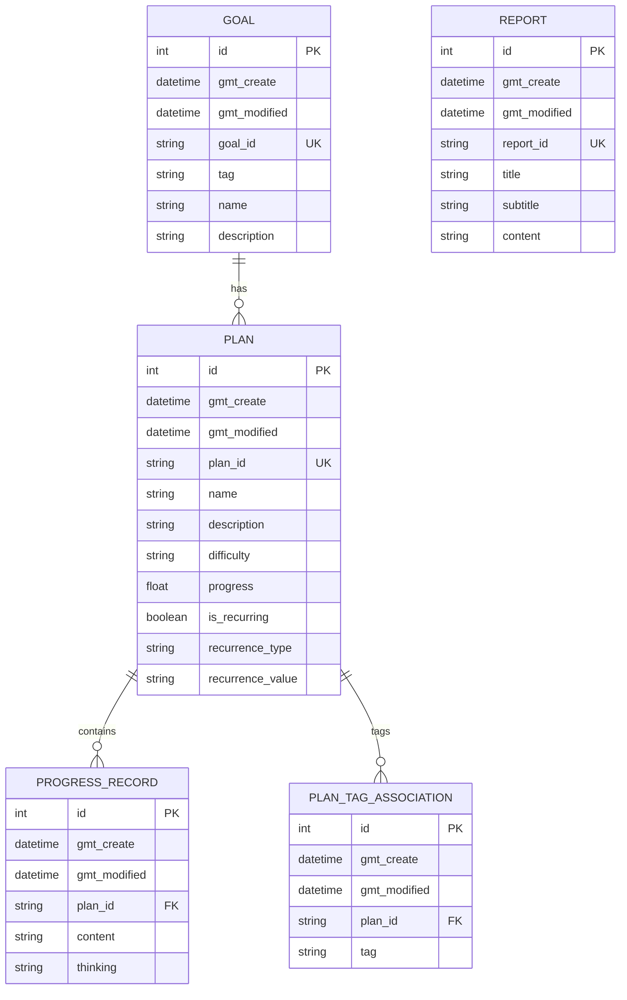

# API Reference

<cite>
**Referenced Files in This Document**
- [src/app/api/auth/login/route.ts](file://src/app/api/auth/login/route.ts)
- [src/app/api/auth/logout/route.ts](file://src/app/api/auth/logout/route.ts)
- [src/app/api/auth/me/route.ts](file://src/app/api/auth/me/route.ts)
- [src/lib/auth.ts](file://src/lib/auth.ts)
- [middleware.ts](file://middleware.ts)
- [src/app/api/goal/route.ts](file://src/app/api/goal/route.ts)
- [src/app/api/plan/route.ts](file://src/app/api/plan/route.ts)
- [src/app/api/progress_record/route.ts](file://src/app/api/progress_record/route.ts)
- [src/app/api/report/route.ts](file://src/app/api/report/route.ts)
- [src/app/api/tag/route.ts](file://src/app/api/tag/route.ts)
- [src/app/api/copilotkit/route.ts](file://src/app/api/copilotkit/route.ts)
- [src/app/api/copilotkit/health/route.ts](file://src/app/api/copilotkit/health/route.ts)
- [src/app/api/test-action/route.ts](file://src/app/api/test-action/route.ts)
- [src/app/api/debug/env/route.ts](file://src/app/api/debug/env/route.ts)
- [prisma/schema.prisma](file://prisma/schema.prisma)
- [test-api.js](file://test-api.js)
</cite>

## Table of Contents
1. [Introduction](#introduction)
2. [Project Structure](#project-structure)
3. [Core Components](#core-components)
4. [Architecture Overview](#architecture-overview)
5. [Detailed Component Analysis](#detailed-component-analysis)
6. [Dependency Analysis](#dependency-analysis)
7. [Performance Considerations](#performance-considerations)
8. [Troubleshooting Guide](#troubleshooting-guide)
9. [Conclusion](#conclusion)
10. [Appendices](#appendices)

## Introduction
This document provides a comprehensive API reference for the Goal Mate application. It covers all RESTful endpoints for goal management, plan management, progress records, reports, tags, and the CopilotKit integration. For each endpoint, you will find HTTP methods, URL patterns, request/response schemas, authentication requirements, parameter specifications, error handling strategies, and practical examples. Additional topics include rate limiting considerations, versioning, security measures, debugging tools, monitoring approaches, and migration notes.

## Project Structure
The API is implemented as Next.js App Router pages under src/app/api. Authentication middleware enforces session-based protection for protected routes. Data persistence is handled via Prisma ORM with a PostgreSQL database.

**Diagram sources**
- [middleware.ts:1-40](file://middleware.ts#L1-L40)
- [src/app/api/auth/login/route.ts:1-50](file://src/app/api/auth/login/route.ts#L1-L50)
- [src/app/api/auth/logout/route.ts:1-23](file://src/app/api/auth/logout/route.ts#L1-L23)
- [src/app/api/auth/me/route.ts:1-27](file://src/app/api/auth/me/route.ts#L1-L27)
- [src/app/api/goal/route.ts:1-51](file://src/app/api/goal/route.ts#L1-L51)
- [src/app/api/plan/route.ts:1-103](file://src/app/api/plan/route.ts#L1-L103)
- [src/app/api/progress_record/route.ts:1-154](file://src/app/api/progress_record/route.ts#L1-L154)
- [src/app/api/report/route.ts:1-48](file://src/app/api/report/route.ts#L1-L48)
- [src/app/api/tag/route.ts:1-11](file://src/app/api/tag/route.ts#L1-L11)
- [src/app/api/copilotkit/route.ts:1-800](file://src/app/api/copilotkit/route.ts#L1-L800)
- [src/app/api/copilotkit/health/route.ts:1-32](file://src/app/api/copilotkit/health/route.ts#L1-L32)
- [src/app/api/test-action/route.ts:1-153](file://src/app/api/test-action/route.ts#L1-L153)
- [src/app/api/debug/env/route.ts:1-10](file://src/app/api/debug/env/route.ts#L1-L10)
- [prisma/schema.prisma:16-70](file://prisma/schema.prisma#L16-L70)

**Section sources**
- [middleware.ts:1-40](file://middleware.ts#L1-L40)
- [prisma/schema.prisma:16-70](file://prisma/schema.prisma#L16-L70)

## Core Components
- Authentication
  - Session-based via JWT stored in an httpOnly cookie named auth-token.
  - Middleware enforces protection for all /api routes except login and static paths.
  - Utility functions handle token creation, verification, credential validation, and current user retrieval.
- Data Access
  - Prisma ORM models define entities and relations for Goals, Plans, Progress Records, Reports, and PlanTagAssociation.
  - API routes implement CRUD operations with pagination and filtering where applicable.
- CopilotKit Integration
  - Runtime endpoint exposes a set of actions for intelligent task recommendation, plan querying, goal/plan creation, plan finding, and progress updates.
  - Health endpoint validates environment configuration and lists available actions.

**Section sources**
- [src/lib/auth.ts:1-69](file://src/lib/auth.ts#L1-L69)
- [middleware.ts:1-40](file://middleware.ts#L1-L40)
- [prisma/schema.prisma:16-70](file://prisma/schema.prisma#L16-L70)
- [src/app/api/copilotkit/route.ts:286-702](file://src/app/api/copilotkit/route.ts#L286-L702)

## Architecture Overview
The API follows a layered architecture:
- Presentation Layer: Next.js App Router pages under src/app/api.
- Application Layer: Route handlers implement business logic and orchestrate Prisma operations.
- Persistence Layer: Prisma client connects to PostgreSQL.
- Security Layer: Middleware checks for presence of auth-token cookie; authentication utilities manage JWT lifecycle.

**Diagram sources**
- [middleware.ts:19-34](file://middleware.ts#L19-L34)
- [src/app/api/goal/route.ts:27-31](file://src/app/api/goal/route.ts#L27-L31)
- [prisma/schema.prisma:16-70](file://prisma/schema.prisma#L16-L70)

## Detailed Component Analysis

### Authentication API
- Purpose: Login, logout, and fetch current user profile.
- Security: Uses JWT stored in an httpOnly cookie. Middleware enforces protection for protected routes.

Endpoints
- POST /api/auth/login
  - Description: Authenticate user credentials and issue auth-token cookie.
  - Authentication: None.
  - Request body: { username: string, password: string }.
  - Success response: { success: boolean, message: string, user: { username: string } }.
  - Error responses: 400 invalid input, 401 invalid credentials, 500 server error.
  - Notes: Cookie is httpOnly, secure in production, sameSite lax, maxAge 7 days.

- POST /api/auth/logout
  - Description: Clear auth-token cookie.
  - Authentication: None.
  - Success response: { success: boolean, message: string }.
  - Error responses: 500 server error.

- GET /api/auth/me
  - Description: Get current user based on auth-token.
  - Authentication: Requires auth-token cookie.
  - Success response: { success: boolean, user: { username: string } }.
  - Error responses: 401 unauthorized, 500 server error.

Common use cases
- Login flow: Call POST /api/auth/login, then use the issued cookie for subsequent requests.
- Logout flow: Call POST /api/auth/logout to invalidate session.
- Protected resource access: Ensure auth-token cookie is present; middleware will enforce.

Client implementation guidelines
- Store the auth-token cookie securely (httpOnly prevents XSS exposure).
- On all protected API requests, include the cookie automatically.
- Handle 401 responses by redirecting to login.

**Section sources**
- [src/app/api/auth/login/route.ts:1-50](file://src/app/api/auth/login/route.ts#L1-L50)
- [src/app/api/auth/logout/route.ts:1-23](file://src/app/api/auth/logout/route.ts#L1-L23)
- [src/app/api/auth/me/route.ts:1-27](file://src/app/api/auth/me/route.ts#L1-L27)
- [src/lib/auth.ts:13-69](file://src/lib/auth.ts#L13-L69)
- [middleware.ts:19-34](file://middleware.ts#L19-L34)

### Goal Management API
- Purpose: CRUD operations for goals with pagination and tag filtering.

Endpoints
- GET /api/goal
  - Description: List goals with pagination and optional tag filter.
  - Query parameters:
    - pageNum: number (default 1)
    - pageSize: number (default 10)
    - tag: string (optional)
  - Success response: { list: Goal[], total: number }.
  - Error responses: 500 server error.

- POST /api/goal
  - Description: Create a new goal.
  - Request body: Omit goal_id; server generates unique plan_id.
  - Success response: Goal object.
  - Error responses: 500 server error.

- PUT /api/goal
  - Description: Update an existing goal.
  - Request body: { goal_id: string, ...fields to update }.
  - Success response: Updated Goal object.
  - Error responses: 500 server error.

- DELETE /api/goal
  - Description: Delete a goal by goal_id.
  - Query parameters:
    - goal_id: string (required)
  - Success response: { success: boolean }.
  - Error responses: 400 missing goal_id, 500 server error.

Data model (Goal)
- Fields: id, gmt_create, gmt_modified, goal_id (unique), tag, name, description?

Practical examples
- Create a goal:
  - POST /api/goal with { name: "...", tag: "...", description: "..." }.
- List goals:
  - GET /api/goal?pageNum=1&pageSize=10&tag=study.
- Update a goal:
  - PUT /api/goal with { goal_id: "goal_xxx", name: "Updated Name" }.
- Delete a goal:
  - DELETE /api/goal?goal_id=goal_xxx.

**Section sources**
- [src/app/api/goal/route.ts:1-51](file://src/app/api/goal/route.ts#L1-L51)
- [prisma/schema.prisma:16-24](file://prisma/schema.prisma#L16-L24)

### Plan Management API
- Purpose: CRUD operations for plans with pagination, tag/difficulty filters, and associated tags and latest progress records.

Endpoints
- GET /api/plan
  - Description: List plans with pagination and filters.
  - Query parameters:
    - pageNum: number (default 1)
    - pageSize: number (default 10)
    - tag: string (optional)
    - difficulty: string (optional)
    - goal_id: string (optional)
  - Behavior:
    - If goal_id provided, resolves goal’s tag and filters plans that include that tag.
    - Otherwise, applies tag filter directly.
  - Success response: { list: Plan[], total: number } where Plan.tags is string[].
  - Error responses: 500 server error.

- POST /api/plan
  - Description: Create a new plan with optional tags.
  - Request body: { name: string, description?: string, difficulty?: string, is_recurring?: boolean, recurrence_type?: string, recurrence_value?: string, tags?: string[] }.
  - Success response: Plan object with tags array.
  - Error responses: 500 server error.

- PUT /api/plan
  - Description: Update an existing plan and replace associated tags.
  - Request body: { plan_id: string, ...fields to update }.
  - Success response: Updated Plan object with tags array.
  - Error responses: 500 server error.

- DELETE /api/plan
  - Description: Delete a plan by plan_id.
  - Query parameters:
    - plan_id: string (required)
  - Success response: { success: boolean }.
  - Error responses: 400 missing plan_id, 500 server error.

Data model (Plan)
- Fields: id, gmt_create, gmt_modified, plan_id (unique), name, description?, difficulty?, progress (0..1), is_recurring, recurrence_type?, recurrence_value?, tags (PlanTagAssociation[]), progressRecords (ProgressRecord[]).

Data model (PlanTagAssociation)
- Fields: id, gmt_create, gmt_modified, plan_id, tag, plan (Plan).

Practical examples
- Create a plan:
  - POST /api/plan with { name: "...", difficulty: "medium", tags: ["study","programming"] }.
- List plans:
  - GET /api/plan?pageNum=1&pageSize=10&difficulty=medium&tag=study.
- Update a plan:
  - PUT /api/plan with { plan_id: "plan_xxx", description: "Updated" }.
- Delete a plan:
  - DELETE /api/plan?plan_id=plan_xxx.

**Section sources**
- [src/app/api/plan/route.ts:1-103](file://src/app/api/plan/route.ts#L1-L103)
- [prisma/schema.prisma:26-49](file://prisma/schema.prisma#L26-L49)

### Progress Record API
- Purpose: Manage progress records tied to plans, including content and reflective thinking, with support for custom timestamps.

Endpoints
- GET /api/progress_record
  - Description: List progress records with pagination and optional plan_id filter.
  - Query parameters:
    - pageNum: number (default 1)
    - pageSize: number (default 10)
    - plan_id: string (optional)
  - Success response: { list: ProgressRecord[], total: number }.
  - Error responses: 500 server error.

- POST /api/progress_record
  - Description: Create a new progress record.
  - Request body: { plan_id: string, content?: string, thinking?: string, custom_time?: string|Date }.
  - Behavior:
    - If custom_time is provided:
      - Supports ISO-like format or specific local time pattern (e.g., "YYYY-MM-DDTHH:mm").
      - Interpreted as local time for consistency.
  - Success response: ProgressRecord object.
  - Error responses: 500 server error.

- PUT /api/progress_record
  - Description: Update an existing progress record.
  - Request body: { id: number, content?: string, thinking?: string, custom_time?: string|Date, plan_id?: string }.
  - Behavior:
    - If custom_time provided, updates timestamp accordingly.
    - Optional plan_id to reassign record to another plan.
  - Success response: Updated ProgressRecord object.
  - Error responses: 400 missing id, 500 server error.

- DELETE /api/progress_record
  - Description: Delete a progress record by id.
  - Query parameters:
    - id: string (required)
  - Success response: { success: boolean }.
  - Error responses: 400 missing id, 500 server error.

Data model (ProgressRecord)
- Fields: id, gmt_create, gmt_modified, plan_id, content?, thinking?, plan (Plan).

Practical examples
- Create a record:
  - POST /api/progress_record with { plan_id: "plan_xxx", content: "Read chapter 3", thinking: "Found it insightful" }.
- Update a record:
  - PUT /api/progress_record with { id: 123, thinking: "Need to review" }.
- Delete a record:
  - DELETE /api/progress_record?id=123.

**Section sources**
- [src/app/api/progress_record/route.ts:1-154](file://src/app/api/progress_record/route.ts#L1-L154)
- [prisma/schema.prisma:51-59](file://prisma/schema.prisma#L51-L59)

### Report Generation API
- Purpose: CRUD operations for report entries.

Endpoints
- GET /api/report
  - Description: List reports with pagination.
  - Query parameters:
    - pageNum: number (default 1)
    - pageSize: number (default 10)
  - Success response: { list: Report[], total: number }.
  - Error responses: 500 server error.

- POST /api/report
  - Description: Create a new report.
  - Request body: Omit report_id; server generates unique report_id.
  - Success response: Report object.
  - Error responses: 500 server error.

- PUT /api/report
  - Description: Update an existing report.
  - Request body: { report_id: string, ...fields to update }.
  - Success response: Updated Report object.
  - Error responses: 500 server error.

- DELETE /api/report
  - Description: Delete a report by report_id.
  - Query parameters:
    - report_id: string (required)
  - Success response: { success: boolean }.
  - Error responses: 400 missing report_id, 500 server error.

Data model (Report)
- Fields: id, gmt_create, gmt_modified, report_id (unique), title, subtitle?, content?

Practical examples
- Create a report:
  - POST /api/report with { title: "...", content: "..." }.
- List reports:
  - GET /api/report?pageNum=1&pageSize=10.
- Update a report:
  - PUT /api/report with { report_id: "report_xxx", subtitle: "..." }.
- Delete a report:
  - DELETE /api/report?report_id=report_xxx.

**Section sources**
- [src/app/api/report/route.ts:1-48](file://src/app/api/report/route.ts#L1-L48)
- [prisma/schema.prisma:61-69](file://prisma/schema.prisma#L61-L69)

### Tag Management API
- Purpose: Retrieve all unique tags used by goals.

Endpoints
- GET /api/tag
  - Description: Get unique tag list derived from goals.
  - Success response: string[] of tags.
  - Error responses: 500 server error.

Practical examples
- Get tags:
  - GET /api/tag returns ["study","health","fitness",...].

**Section sources**
- [src/app/api/tag/route.ts:1-11](file://src/app/api/tag/route.ts#L1-L11)
- [prisma/schema.prisma:16-24](file://prisma/schema.prisma#L16-L24)

### CopilotKit Integration API
- Purpose: Expose AI-driven actions for intelligent task recommendation, plan/query/create/find/progress update, and health checks.

Endpoints
- GET /api/copilotkit/health
  - Description: Verify environment configuration and list available actions.
  - Success response: { status: "healthy", copilotkit: "configured", environment: {...}, actions: string[], timestamp: string }.
  - Error responses: 500 server error.

- POST /api/copilotkit
  - Description: Runtime endpoint for CopilotKit actions.
  - Authentication: Protected by middleware; requires auth-token cookie.
  - Request body: Standard CopilotKit runtime payload.
  - Response: Action-specific result or error.

Available Actions
- recommendTasks
  - Parameters: { userState: string, filterCriteria?: string }.
  - Behavior: Returns recommended tasks (uncompleted plans) sorted by progress.
  - Response: { success: boolean, data: { message: string, userState: string, tasks: Plan[], totalAvailable: number } }.

- queryPlans
  - Parameters: { difficulty?: string, tag?: string, keyword?: string }.
  - Behavior: Filters plans by difficulty, keyword, and optionally tag.
  - Response: { success: boolean, data: Plan[] }.

- createGoal
  - Parameters: { name: string, tag: string, description?: string }.
  - Response: { success: boolean, data: Goal }.

- getSystemOptions
  - Parameters: none.
  - Response: { success: boolean, data: { existingTags: string[], difficultyOptions: string[], message: string } }.

- createPlan
  - Parameters: { name: string, description?: string, difficulty: "easy"|"medium"|"hard", tags: string (comma-separated) }.
  - Response: { success: boolean, data: Plan, message?: string }.

- findPlan
  - Parameters: { searchTerm: string }.
  - Behavior: Fuzzy search across name, description, and tags; returns scored matches.
  - Response: { success: boolean, data: Plan[] }.

- updateProgress
  - Parameters: { plan_id: string, progress?: number, content?: string, thinking?: string, custom_time?: string }.
  - Behavior: Updates plan progress and creates/updates progress record; supports natural language time parsing.
  - Response: { success: boolean, data: { plan: Plan, record: ProgressRecord, message: string } }.

Practical examples
- Health check:
  - GET /api/copilotkit/health returns configuration status and action list.
- Invoke recommendTasks:
  - POST /api/copilotkit with action name "recommendTasks" and parameters.
- Create a plan:
  - POST /api/copilotkit with action "createPlan" and parameters including difficulty and comma-separated tags.

Sequence: updateProgress action

**Diagram sources**
- [src/app/api/copilotkit/route.ts:704-800](file://src/app/api/copilotkit/route.ts#L704-L800)
- [prisma/schema.prisma:26-59](file://prisma/schema.prisma#L26-L59)

**Section sources**
- [src/app/api/copilotkit/health/route.ts:1-32](file://src/app/api/copilotkit/health/route.ts#L1-L32)
- [src/app/api/copilotkit/route.ts:286-800](file://src/app/api/copilotkit/route.ts#L286-L800)
- [prisma/schema.prisma:26-59](file://prisma/schema.prisma#L26-L59)

### Debugging and Monitoring APIs
- GET /api/debug/env
  - Description: Inspect environment variables relevant to CopilotKit and database.
  - Success response: { NODE_ENV, OPENAI_API_KEY (masked), OPENAI_BASE_URL, DATABASE_URL (present?) }.

- GET /api/test-action
  - Description: Internal testing endpoint for action validation and database connectivity.
  - Request body: { action: string, args: any }.
  - Supported actions:
    - "queryPlans": returns top plans with tags.
    - "updateProgress": attempts to resolve plan and update progress + record.
    - "checkDatabase": returns counts of goals/plans and connection status.
  - Success response: { success: boolean, action: string, data|count|status|suggestions|error }.
  - Error responses: 400 unknown action, 500 server error.

- Example test script
  - See [test-api.js:1-26](file://test-api.js#L1-L26) for a minimal client-side test harness invoking health and database checks.

**Section sources**
- [src/app/api/debug/env/route.ts:1-10](file://src/app/api/debug/env/route.ts#L1-L10)
- [src/app/api/test-action/route.ts:1-153](file://src/app/api/test-action/route.ts#L1-L153)
- [test-api.js:1-26](file://test-api.js#L1-L26)

## Dependency Analysis
- Authentication dependency chain
  - Client -> middleware -> auth route handlers -> auth utilities -> cookie storage.
- API route dependencies
  - All protected routes depend on middleware for auth-token validation.
  - Route handlers depend on Prisma client for data access.
- CopilotKit integration
  - Runtime actions depend on Prisma to query and mutate domain entities.
  - Environment validation depends on OPENAI_API_KEY and OPENAI_BASE_URL.

**Diagram sources**
- [middleware.ts:19-34](file://middleware.ts#L19-L34)
- [src/lib/auth.ts:13-69](file://src/lib/auth.ts#L13-L69)
- [src/app/api/copilotkit/health/route.ts:5-16](file://src/app/api/copilotkit/health/route.ts#L5-L16)
- [prisma/schema.prisma:16-70](file://prisma/schema.prisma#L16-L70)

**Section sources**
- [middleware.ts:19-34](file://middleware.ts#L19-L34)
- [src/lib/auth.ts:13-69](file://src/lib/auth.ts#L13-L69)
- [prisma/schema.prisma:16-70](file://prisma/schema.prisma#L16-L70)

## Performance Considerations
- Pagination
  - All list endpoints support pageNum and pageSize to limit result sets.
- Filtering
  - Use tag, difficulty, and goal_id filters to reduce dataset size.
- Asynchronous operations
  - Parallel count and fetch operations are used in list endpoints to minimize latency.
- Indexing
  - Consider adding database indexes on frequently filtered columns (e.g., tag, difficulty, plan_id) to improve query performance.
- Rate limiting
  - Not implemented in the current codebase. Consider adding rate limiting at the edge or gateway level for public endpoints.

## Troubleshooting Guide
Common issues and resolutions
- 401 Unauthorized on protected endpoints
  - Cause: Missing or invalid auth-token cookie.
  - Resolution: Authenticate via POST /api/auth/login and ensure cookie is sent with subsequent requests.
- 400 Bad Request
  - Causes: Missing required query/body parameters (e.g., plan_id, goal_id, id).
  - Resolution: Provide all required identifiers and validate input formats.
- 500 Internal Server Error
  - Causes: Database errors, unhandled exceptions, or environment misconfiguration.
  - Resolution: Check server logs, verify environment variables, and confirm database connectivity.
- CopilotKit health check failures
  - Causes: Missing OPENAI_API_KEY or OPENAI_BASE_URL.
  - Resolution: Set environment variables and re-check via GET /api/copilotkit/health.

Monitoring and diagnostics
- Use GET /api/copilotkit/health to verify environment configuration and action availability.
- Use GET /api/debug/env to inspect masked secrets and database configuration.
- Use GET /api/test-action with action "checkDatabase" to validate Prisma connectivity.

**Section sources**
- [middleware.ts:22-29](file://middleware.ts#L22-L29)
- [src/app/api/progress_record/route.ts:78-83](file://src/app/api/progress_record/route.ts#L78-L83)
- [src/app/api/copilotkit/health/route.ts:5-16](file://src/app/api/copilotkit/health/route.ts#L5-L16)
- [src/app/api/debug/env/route.ts:4-9](file://src/app/api/debug/env/route.ts#L4-L9)
- [src/app/api/test-action/route.ts:125-138](file://src/app/api/test-action/route.ts#L125-L138)

## Conclusion
The Goal Mate API provides a cohesive set of endpoints for managing goals, plans, progress records, reports, and tags, with integrated CopilotKit actions for intelligent assistance. Authentication is enforced via a dedicated middleware and JWT cookie. The schema and route handlers are designed for scalability with pagination and filtering. For production deployments, consider implementing rate limiting, robust logging, and input validation to further enhance reliability and security.

## Appendices

### Authentication and Authorization
- Cookies
  - Name: auth-token
  - Attributes: httpOnly, secure (in production), sameSite lax, maxAge 7 days, path /
- Middleware behavior
  - Blocks /api routes without valid token; redirects non-API routes to /login.
- Token verification
  - Uses AUTH_SECRET environment variable for signing/verification.

**Section sources**
- [src/app/api/auth/login/route.ts:28-35](file://src/app/api/auth/login/route.ts#L28-L35)
- [middleware.ts:19-34](file://middleware.ts#L19-L34)
- [src/lib/auth.ts:5-11](file://src/lib/auth.ts#L5-L11)

### Data Models Overview

**Diagram sources**
- [prisma/schema.prisma:16-70](file://prisma/schema.prisma#L16-L70)

### Versioning and Backward Compatibility
- Current state
  - No explicit API versioning is implemented in URLs or headers.
- Recommendations
  - Adopt URL versioning (/api/v1/...) or Accept-Version header for future-proofing.
  - Maintain backward compatibility by deprecating fields rather than removing them immediately.

### Migration Guide
- Authentication
  - Ensure AUTH_SECRET is configured; otherwise token verification will fail.
- Environment variables
  - For CopilotKit: set OPENAI_API_KEY and OPENAI_BASE_URL; verify via GET /api/copilotkit/health.
- Database
  - Confirm DATABASE_URL is set; use GET /api/test-action?action=checkDatabase to validate connectivity.

**Section sources**
- [src/lib/auth.ts:5-11](file://src/lib/auth.ts#L5-L11)
- [src/app/api/copilotkit/health/route.ts:5-16](file://src/app/api/copilotkit/health/route.ts#L5-L16)
- [src/app/api/test-action/route.ts:125-138](file://src/app/api/test-action/route.ts#L125-L138)