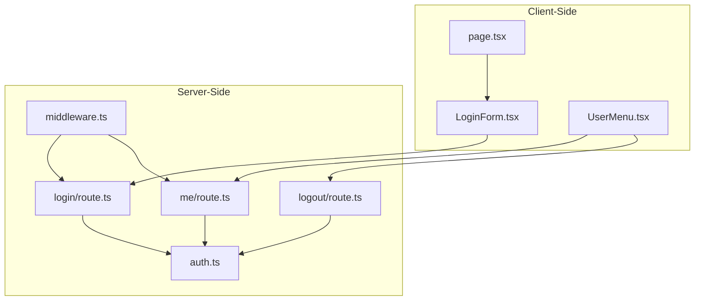
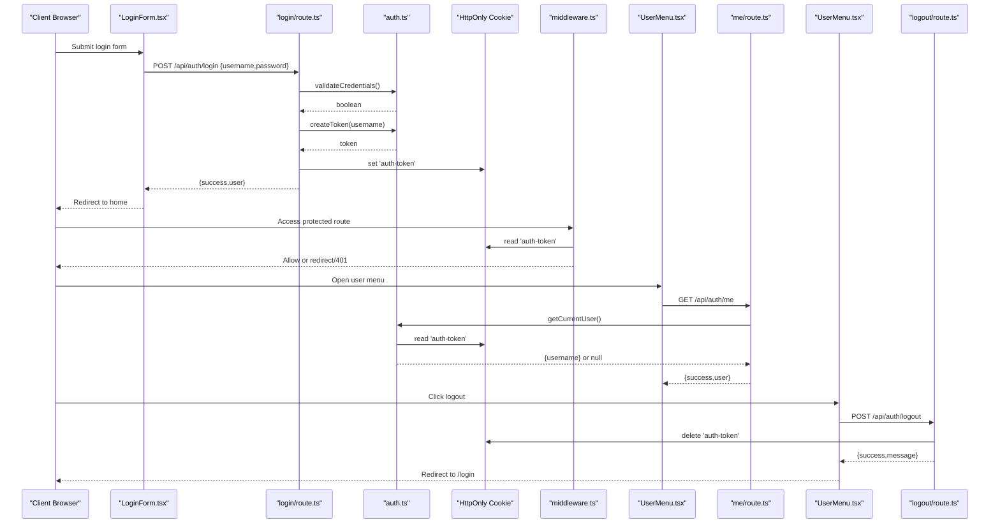
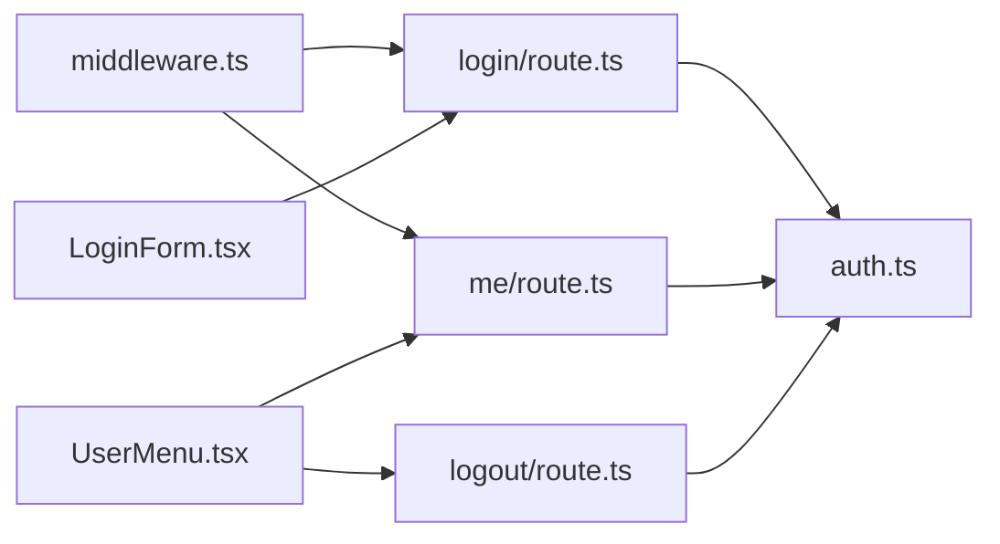

# Authentication Endpoints

<cite>
**Referenced Files in This Document**
- [login/route.ts](file://src/app/api/auth/login/route.ts)
- [logout/route.ts](file://src/app/api/auth/logout/route.ts)
- [me/route.ts](file://src/app/api/auth/me/route.ts)
- [auth.ts](file://src/lib/auth.ts)
- [middleware.ts](file://middleware.ts)
- [LoginForm.tsx](file://src/components/LoginForm.tsx)
- [UserMenu.tsx](file://src/components/UserMenu.tsx)
- [page.tsx](file://src/app/login/page.tsx)
- [AUTHENTICATION.md](file://AUTHENTICATION.md)
- [package.json](file://package.json)
</cite>

## Table of Contents
1. [Introduction](#introduction)
2. [Project Structure](#project-structure)
3. [Core Components](#core-components)
4. [Architecture Overview](#architecture-overview)
5. [Detailed Component Analysis](#detailed-component-analysis)
6. [Dependency Analysis](#dependency-analysis)
7. [Performance Considerations](#performance-considerations)
8. [Troubleshooting Guide](#troubleshooting-guide)
9. [Conclusion](#conclusion)

## Introduction
This document provides comprehensive API documentation for the authentication endpoints in the application. It covers the login, logout, and user info endpoints, including request/response schemas, authentication headers, error codes, security considerations, and practical examples with curl commands and client implementation code. It also addresses token expiration, refresh mechanisms, and logout scenarios.

## Project Structure
The authentication system is implemented using Next.js App Router API routes and shared authentication utilities. The key files are organized as follows:
- API routes for authentication endpoints under src/app/api/auth/
- Shared authentication utilities under src/lib/auth.ts
- Middleware for protecting routes under middleware.ts
- Client-side components for login and user menu under src/components/

**Diagram sources**
- [login/route.ts:1-50](file://src/app/api/auth/login/route.ts#L1-L50)
- [logout/route.ts:1-23](file://src/app/api/auth/logout/route.ts#L1-L23)
- [me/route.ts:1-27](file://src/app/api/auth/me/route.ts#L1-L27)
- [auth.ts:1-69](file://src/lib/auth.ts#L1-L69)
- [middleware.ts:1-40](file://middleware.ts#L1-L40)
- [LoginForm.tsx:1-98](file://src/components/LoginForm.tsx#L1-L98)
- [UserMenu.tsx:1-104](file://src/components/UserMenu.tsx#L1-L104)
- [page.tsx:1-12](file://src/app/login/page.tsx#L1-L12)

**Section sources**
- [AUTHENTICATION.md:68-85](file://AUTHENTICATION.md#L68-L85)

## Core Components
- Authentication utilities (src/lib/auth.ts):
  - Token creation and verification using JWT
  - Credential validation against environment variables
  - Current user extraction from cookies
- API routes:
  - POST /api/auth/login: Validates credentials, generates JWT, sets HttpOnly cookie
  - POST /api/auth/logout: Deletes auth cookie
  - GET /api/auth/me: Returns current user based on cookie
- Middleware (middleware.ts):
  - Protects non-public routes by checking presence of auth cookie
  - Redirects unauthenticated users to login or returns 401 for API routes
- Client components:
  - LoginForm.tsx: Submits login form to /api/auth/login
  - UserMenu.tsx: Fetches user info from /api/auth/me and logs out via /api/auth/logout

**Section sources**
- [auth.ts:1-69](file://src/lib/auth.ts#L1-L69)
- [login/route.ts:1-50](file://src/app/api/auth/login/route.ts#L1-L50)
- [logout/route.ts:1-23](file://src/app/api/auth/logout/route.ts#L1-L23)
- [me/route.ts:1-27](file://src/app/api/auth/me/route.ts#L1-L27)
- [middleware.ts:1-40](file://middleware.ts#L1-L40)
- [LoginForm.tsx:1-98](file://src/components/LoginForm.tsx#L1-L98)
- [UserMenu.tsx:1-104](file://src/components/UserMenu.tsx#L1-L104)

## Architecture Overview
The authentication flow integrates client-side components with server-side API routes and middleware protection. The system uses a signed JWT stored in an HttpOnly cookie to maintain session state.

**Diagram sources**
- [login/route.ts:1-50](file://src/app/api/auth/login/route.ts#L1-L50)
- [logout/route.ts:1-23](file://src/app/api/auth/logout/route.ts#L1-L23)
- [me/route.ts:1-27](file://src/app/api/auth/me/route.ts#L1-L27)
- [auth.ts:1-69](file://src/lib/auth.ts#L1-L69)
- [middleware.ts:1-40](file://middleware.ts#L1-L40)
- [LoginForm.tsx:1-98](file://src/components/LoginForm.tsx#L1-L98)
- [UserMenu.tsx:1-104](file://src/components/UserMenu.tsx#L1-L104)

## Detailed Component Analysis

### POST /api/auth/login
Purpose: Authenticate user credentials and establish a session via JWT cookie.

- Request body:
  - username: string (required)
  - password: string (required)
- Response body:
  - success: boolean
  - message: string
  - user: { username: string }
- Status codes:
  - 200 OK on successful login
  - 400 Bad Request if missing fields
  - 401 Unauthorized if invalid credentials
  - 500 Internal Server Error on unexpected errors
- Security:
  - Credentials validated against environment variables
  - JWT created with 7-day expiry
  - HttpOnly cookie configured with secure flag in production, sameSite lax, maxAge 7 days, path /
- Practical example (curl):
  - curl -X POST https://your-domain.com/api/auth/login -H "Content-Type: application/json" -d '{"username":"admin","password":"your-secure-password"}'

Implementation highlights:
- Validates presence of username and password
- Calls validateCredentials to compare against environment variables
- Generates token via createToken and stores it in a cookie
- Returns success payload with user info

**Section sources**
- [login/route.ts:5-50](file://src/app/api/auth/login/route.ts#L5-L50)
- [auth.ts:35-46](file://src/lib/auth.ts#L35-L46)
- [auth.ts:13-16](file://src/lib/auth.ts#L13-L16)

### POST /api/auth/logout
Purpose: Terminate the current session by removing the authentication cookie.

- Request body: None
- Response body:
  - success: boolean
  - message: string
- Status codes:
  - 200 OK on successful logout
  - 500 Internal Server Error on unexpected errors
- Security:
  - Removes the 'auth-token' cookie
  - No token revocation server-side; relies on cookie deletion
- Practical example (curl):
  - curl -X POST https://your-domain.com/api/auth/logout

Implementation highlights:
- Reads cookies and deletes 'auth-token'
- Returns success message

**Section sources**
- [logout/route.ts:4-23](file://src/app/api/auth/logout/route.ts#L4-L23)

### GET /api/auth/me
Purpose: Retrieve the currently authenticated user based on the cookie.

- Request headers: None required (cookie is sent automatically)
- Response body:
  - success: boolean
  - user: { username: string }
- Status codes:
  - 200 OK on success
  - 401 Unauthorized if not authenticated
  - 500 Internal Server Error on unexpected errors
- Security:
  - Uses verifyToken to validate the JWT
  - Returns only username from token payload
- Practical example (curl):
  - curl -H "Cookie: auth-token=YOUR_JWT_HERE" https://your-domain.com/api/auth/me

Implementation highlights:
- Extracts token from cookie
- Verifies token and returns user payload

**Section sources**
- [me/route.ts:4-27](file://src/app/api/auth/me/route.ts#L4-L27)
- [auth.ts:48-63](file://src/lib/auth.ts#L48-L63)

### Client Implementation Notes
- LoginForm.tsx:
  - Submits credentials to POST /api/auth/login
  - On success, navigates to home and refreshes
- UserMenu.tsx:
  - Fetches user info from GET /api/auth/me on mount
  - Calls POST /api/auth/logout and redirects to /login on success

**Section sources**
- [LoginForm.tsx:13-40](file://src/components/LoginForm.tsx#L13-L40)
- [UserMenu.tsx:36-61](file://src/components/UserMenu.tsx#L36-L61)

## Dependency Analysis
The authentication endpoints depend on shared utilities and middleware for consistent behavior across the application.

**Diagram sources**
- [login/route.ts:1-50](file://src/app/api/auth/login/route.ts#L1-L50)
- [logout/route.ts:1-23](file://src/app/api/auth/logout/route.ts#L1-L23)
- [me/route.ts:1-27](file://src/app/api/auth/me/route.ts#L1-L27)
- [auth.ts:1-69](file://src/lib/auth.ts#L1-L69)
- [middleware.ts:1-40](file://middleware.ts#L1-L40)
- [LoginForm.tsx:1-98](file://src/components/LoginForm.tsx#L1-L98)
- [UserMenu.tsx:1-104](file://src/components/UserMenu.tsx#L1-L104)

**Section sources**
- [auth.ts:1-69](file://src/lib/auth.ts#L1-L69)
- [middleware.ts:1-40](file://middleware.ts#L1-L40)

## Performance Considerations
- Token verification occurs on each request to /api/auth/me; consider caching user data in memory for short-lived sessions if needed.
- Cookie size is minimal (single JWT); overhead is negligible.
- Environment variable checks occur during token creation/verification; ensure AUTH_SECRET is set to avoid repeated failures.

## Troubleshooting Guide
Common issues and resolutions:
- Environment variables not set:
  - AUTH_USERNAME, AUTH_PASSWORD, AUTH_SECRET must be configured
  - AUTH_SECRET must be at least 32 characters long
- Login fails:
  - Verify username/password match environment variables
  - Check browser console for network errors
- Session expires:
  - Re-login; token lifetime is 7 days
- API returns 401:
  - Ensure cookie 'auth-token' is present and not expired
  - Confirm middleware is not blocking the route

**Section sources**
- [auth.ts:5-11](file://src/lib/auth.ts#L5-L11)
- [auth.ts:20-33](file://src/lib/auth.ts#L20-L33)
- [AUTHENTICATION.md:172-192](file://AUTHENTICATION.md#L172-L192)

## Conclusion
The authentication system provides a straightforward, cookie-based session mechanism using JWT. It offers secure defaults (HttpOnly cookie, optional secure flag in production) and clear endpoints for login, logout, and user info retrieval. For production deployments, ensure environment variables are properly configured and consider HTTPS to protect credentials and tokens.