# Enhanced Plan Management Endpoints

<cite>
**Referenced Files in This Document**
- [src/app/api/plan/route.ts](file://src/app/api/plan/route.ts)
- [src/app/api/plan/priority/route.ts](file://src/app/api/plan/priority/route.ts)
- [src/app/api/goal/route.ts](file://src/app/api/goal/route.ts)
- [src/app/api/tag/route.ts](file://src/app/api/tag/route.ts)
- [src/app/api/progress_record/route.ts](file://src/app/api/progress_record/route.ts)
- [src/app/api/report/route.ts](file://src/app/api/report/route.ts)
- [src/app/plans/page.tsx](file://src/app/plans/page.tsx)
- [src/components/quadrant-left-sidebar.tsx](file://src/components/quadrant-left-sidebar.tsx)
- [src/lib/recurring-utils.ts](file://src/lib/recurring-utils.ts)
- [src/lib/auth.ts](file://src/lib/auth.ts)
- [src/lib/utils.ts](file://src/lib/utils.ts)
- [prisma/schema.prisma](file://prisma/schema.prisma)
</cite>

## Update Summary
**Changes Made**
- Enhanced PlansPage component with new priority quadrant and scheduling fields support
- Improved form handling with proper undefined value management during API updates
- Updated backend API endpoints to handle undefined values properly for data integrity
- Added real-time quadrant sidebar refresh integration
- Enhanced progress tracking with comprehensive quadrant data synchronization

## Table of Contents
1. [Introduction](#introduction)
2. [System Architecture](#system-architecture)
3. [Core API Endpoints](#core-api-endpoints)
4. [Data Model](#data-model)
5. [Frontend Implementation](#frontend-implementation)
6. [Advanced Features](#advanced-features)
7. [Integration Patterns](#integration-patterns)
8. [Performance Considerations](#performance-considerations)
9. [Security Implementation](#security-implementation)
10. [Troubleshooting Guide](#troubleshooting-guide)
11. [Conclusion](#conclusion)

## Introduction

The Enhanced Plan Management System is a comprehensive task and goal management solution built with Next.js and Prisma ORM. This system provides sophisticated plan management capabilities with advanced filtering, scheduling, tagging, and progress tracking features. The system supports both individual tasks and recurring activities, integrates with Eisenhower Matrix (four-quadrant) prioritization, and offers real-time collaboration features.

The platform enables users to manage their daily activities, long-term goals, and progress tracking through an intuitive interface while maintaining robust backend functionality for data persistence and retrieval. Recent enhancements have expanded the priority API endpoint to provide complete task information across all four quadrants with integrated progress tracking, and improved form handling with proper undefined value management for enhanced data integrity.

## System Architecture

The Enhanced Plan Management System follows a modern Next.js architecture with separate API routes for different functional domains:

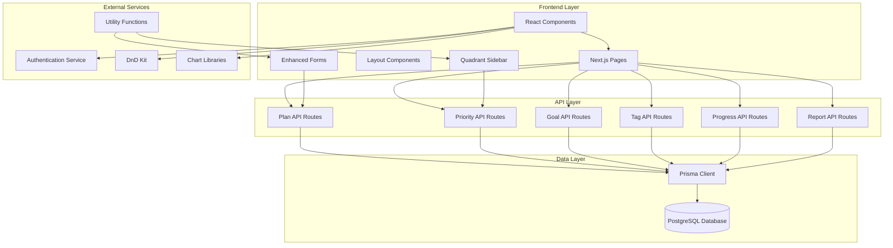

**Diagram sources**
- [src/app/api/plan/route.ts:1-120](file://src/app/api/plan/route.ts#L1-L120)
- [src/app/api/plan/priority/route.ts:1-110](file://src/app/api/plan/priority/route.ts#L1-L110)
- [src/app/api/goal/route.ts:1-51](file://src/app/api/goal/route.ts#L1-L51)
- [src/app/api/tag/route.ts:1-20](file://src/app/api/tag/route.ts#L1-L20)
- [src/lib/utils.ts:8-16](file://src/lib/utils.ts#L8-L16)

## Core API Endpoints

### Plan Management Endpoints

The system provides comprehensive CRUD operations for plan management with advanced filtering capabilities:

#### GET /api/plan - List Plans with Advanced Filtering

The plan listing endpoint supports extensive filtering options:

| Parameter | Type | Description | Example |
|-----------|------|-------------|---------|
| `tag` | String | Filter by specific tag | `?tag=work` |
| `difficulty` | String | Filter by difficulty level | `?difficulty=high` |
| `goal_id` | String | Filter by associated goal | `?goal_id=goal_abc123` |
| `is_scheduled` | Boolean | Filter scheduled/unscheduled tasks | `?is_scheduled=true` |
| `unscheduled` | Boolean | Get only unscheduled tasks | `?unscheduled=true` |
| `priority_quadrant` | String | Filter by quadrant (q1-q4) | `?priority_quadrant=q1` |
| `pageNum` | Number | Page number for pagination | `?pageNum=2` |
| `pageSize` | Number | Results per page | `?pageSize=20` |

**Section sources**
- [src/app/api/plan/route.ts:7-67](file://src/app/api/plan/route.ts#L7-L67)

#### POST /api/plan - Create New Plan

Creates a new plan with automatic ID generation and tag association:

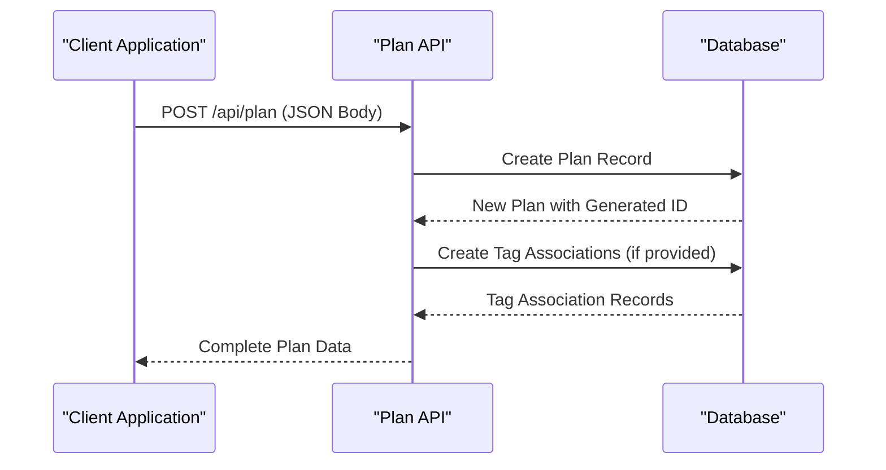

**Diagram sources**
- [src/app/api/plan/route.ts:69-83](file://src/app/api/plan/route.ts#L69-L83)

#### PUT /api/plan - Update Existing Plan

**Updated** Enhanced to properly handle undefined values during updates for improved data integrity:

The PUT endpoint now filters out undefined values to prevent accidental data overwrites:

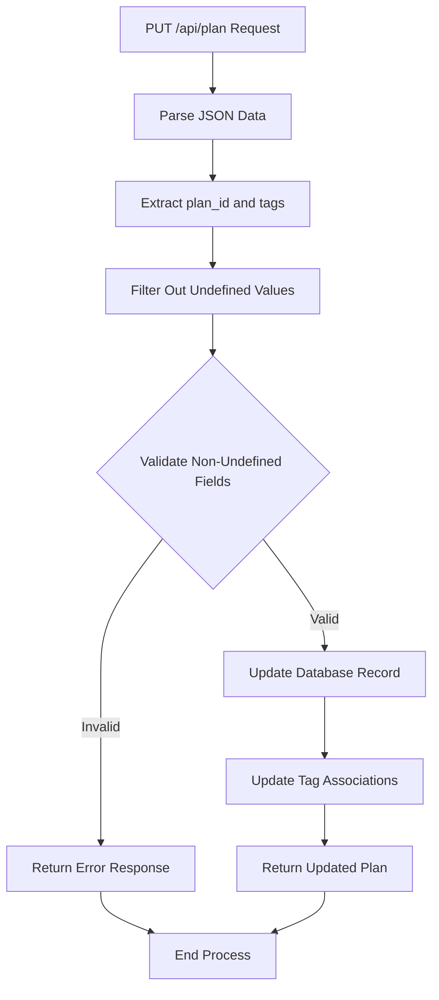

**Diagram sources**
- [src/app/api/plan/route.ts:85-111](file://src/app/api/plan/route.ts#L85-L111)

#### DELETE /api/plan - Remove Plan

Deletes a plan by ID with proper validation:

**Section sources**
- [src/app/api/plan/route.ts:113-120](file://src/app/api/plan/route.ts#L113-L120)

### Priority Management Endpoints

#### GET /api/plan/priority - Get Prioritized Plans with Progress Tracking

**Updated** Enhanced to include progressRecords for all four quadrants (q1, q2, q3, q4) for complete task information regardless of quadrant assignment.

Retrieves all scheduled plans organized by Eisenhower Matrix quadrants with comprehensive progress tracking:

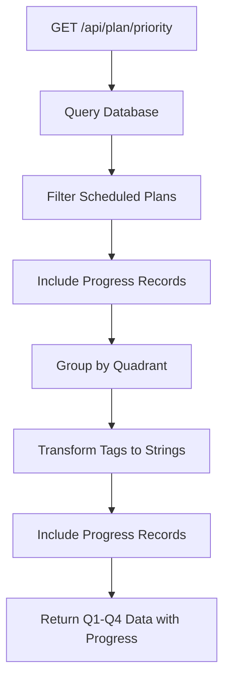

**Diagram sources**
- [src/app/api/plan/priority/route.ts:6-64](file://src/app/api/plan/priority/route.ts#L6-L64)

The endpoint now returns complete task information including progress records for each quadrant:

```json
{
  "q1": [
    {
      "plan_id": "plan_abc123",
      "name": "Important Urgent Task",
      "tags": ["work", "urgent"],
      "progress": 75,
      "progressRecords": [
        {
          "gmt_create": "2024-01-15T10:30:00Z"
        },
        {
          "gmt_create": "2024-01-14T14:20:00Z"
        }
      ]
    }
  ],
  "q2": [...],
  "q3": [...],
  "q4": [...]
}
```

**Section sources**
- [src/app/api/plan/priority/route.ts:6-64](file://src/app/api/plan/priority/route.ts#L6-L64)

#### PUT /api/plan/priority - Update Plan Priority

**Updated** Enhanced to handle undefined values properly during quadrant updates:

The PUT endpoint now accepts partial updates with proper undefined value filtering:

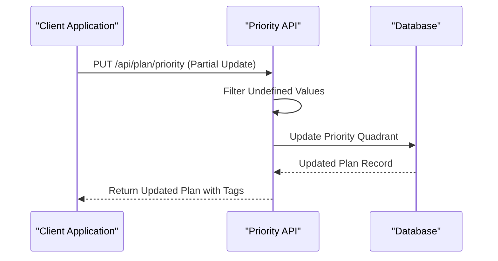

**Diagram sources**
- [src/app/api/plan/priority/route.ts:66-110](file://src/app/api/plan/priority/route.ts#L66-L110)

**Section sources**
- [src/app/api/plan/priority/route.ts:66-110](file://src/app/api/plan/priority/route.ts#L66-L110)

### Supporting Endpoints

#### GET /api/tag - List All Tags

Aggregates tags from both goals and plans:

**Section sources**
- [src/app/api/tag/route.ts:6-19](file://src/app/api/tag/route.ts#L6-L19)

#### GET /api/goal - Goal Management

Provides goal CRUD operations with pagination support:

**Section sources**
- [src/app/api/goal/route.ts:7-24](file://src/app/api/goal/route.ts#L7-L24)

#### GET /api/progress_record - Progress Tracking

Manages progress records with custom timestamps:

**Section sources**
- [src/app/api/progress_record/route.ts:6-23](file://src/app/api/progress_record/route.ts#L6-L23)

## Data Model

The system uses a normalized database schema designed for efficient querying and relationship management:

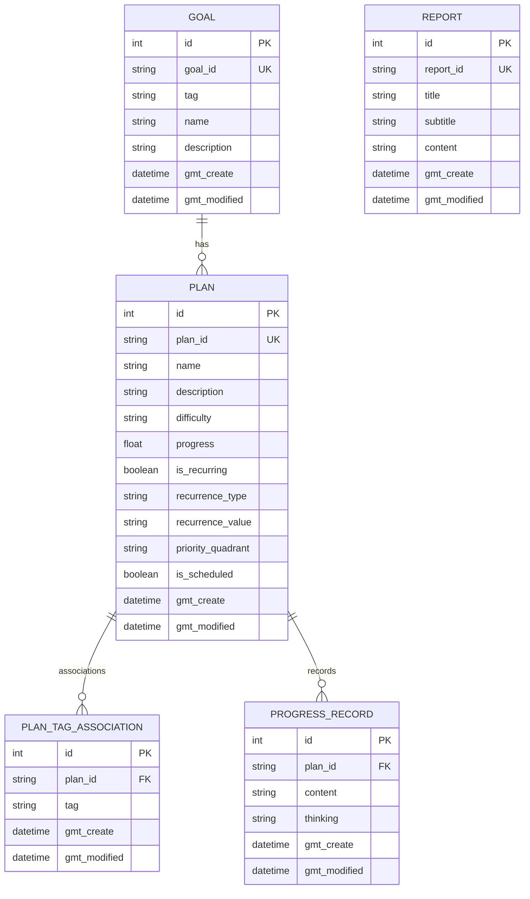

**Diagram sources**
- [prisma/schema.prisma:16-72](file://prisma/schema.prisma#L16-L72)

**Section sources**
- [prisma/schema.prisma:16-72](file://prisma/schema.prisma#L16-L72)

## Frontend Implementation

### Enhanced Plan Management Page

**Updated** The main plan management interface now includes comprehensive priority quadrant and scheduling field support:

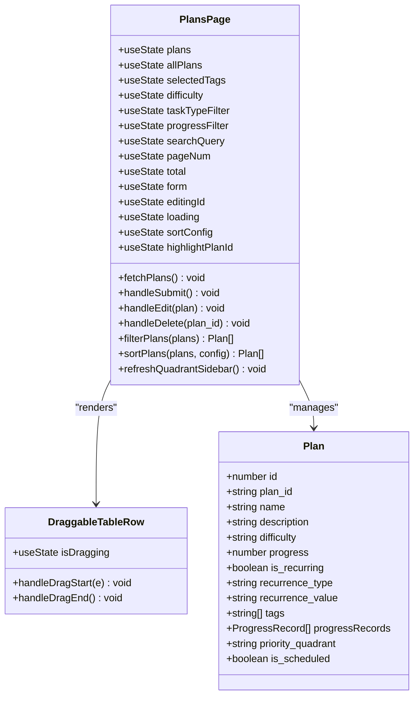

**Diagram sources**
- [src/app/plans/page.tsx:99-883](file://src/app/plans/page.tsx#L99-L883)

### Real-time Quadrant Integration

**Updated** The quadrant sidebar now provides seamless integration with the plan management system:

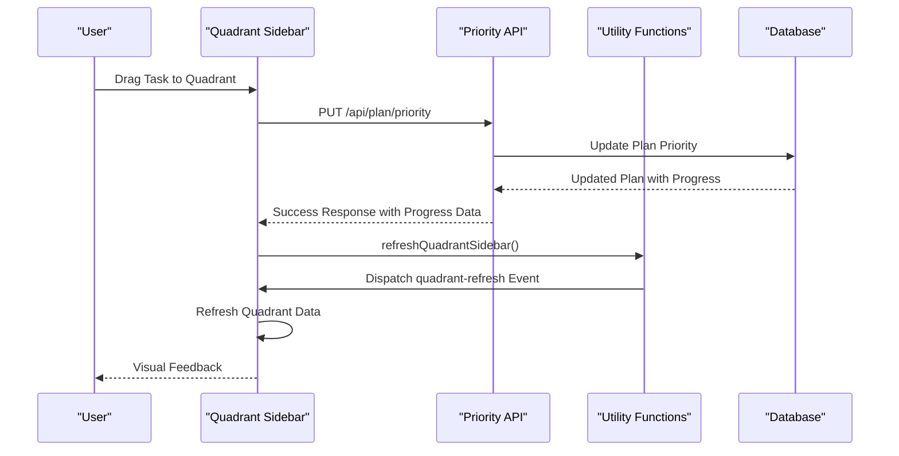

**Diagram sources**
- [src/components/quadrant-left-sidebar.tsx:440-507](file://src/components/quadrant-left-sidebar.tsx#L440-L507)
- [src/lib/utils.ts:8-16](file://src/lib/utils.ts#L8-L16)
- [src/app/api/plan/priority/route.ts:66-110](file://src/app/api/plan/priority/route.ts#L66-L110)

**Section sources**
- [src/app/plans/page.tsx:99-883](file://src/app/plans/page.tsx#L99-L883)
- [src/components/quadrant-left-sidebar.tsx:376-585](file://src/components/quadrant-left-sidebar.tsx#L376-L585)
- [src/lib/utils.ts:8-16](file://src/lib/utils.ts#L8-L16)

## Advanced Features

### Enhanced Form Handling

**Updated** The system now includes sophisticated form handling with proper undefined value management:

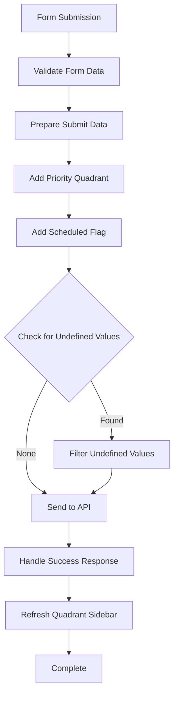

**Diagram sources**
- [src/app/plans/page.tsx:317-350](file://src/app/plans/page.tsx#L317-L350)

**Section sources**
- [src/app/plans/page.tsx:317-350](file://src/app/plans/page.tsx#L317-L350)

### Recurring Task Management

The system includes sophisticated recurring task handling with intelligent cycle detection:

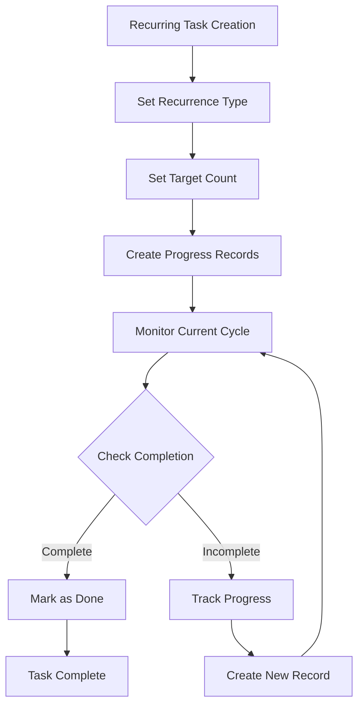

**Diagram sources**
- [src/lib/recurring-utils.ts:152-186](file://src/lib/recurring-utils.ts#L152-L186)

**Section sources**
- [src/lib/recurring-utils.ts:1-218](file://src/lib/recurring-utils.ts#L1-L218)

### Tag Management System

Dynamic tag association system supporting both existing and new tags:

**Section sources**
- [src/app/api/tag/route.ts:6-19](file://src/app/api/tag/route.ts#L6-L19)
- [src/app/plans/page.tsx:520-584](file://src/app/plans/page.tsx#L520-L584)

### Progress Tracking

Comprehensive progress recording with custom timestamp support and real-time quadrant updates:

**Section sources**
- [src/app/api/progress_record/route.ts:25-154](file://src/app/api/progress_record/route.ts#L25-L154)

## Integration Patterns

### Authentication Flow

The system implements JWT-based authentication with secure token management:

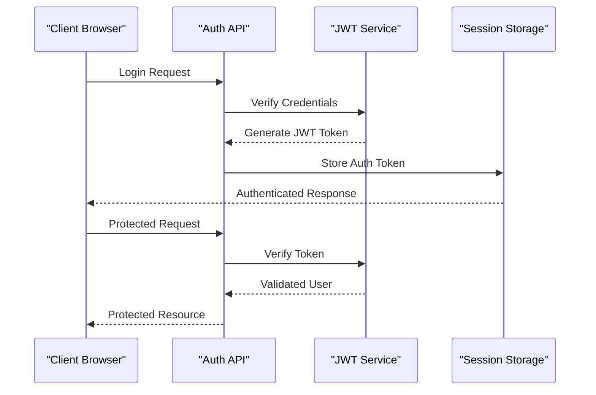

**Diagram sources**
- [src/lib/auth.ts:14-33](file://src/lib/auth.ts#L14-L33)

**Section sources**
- [src/lib/auth.ts:1-69](file://src/lib/auth.ts#L1-L69)

### Real-time Updates

**Updated** The system now supports comprehensive real-time updates through multiple integration points:

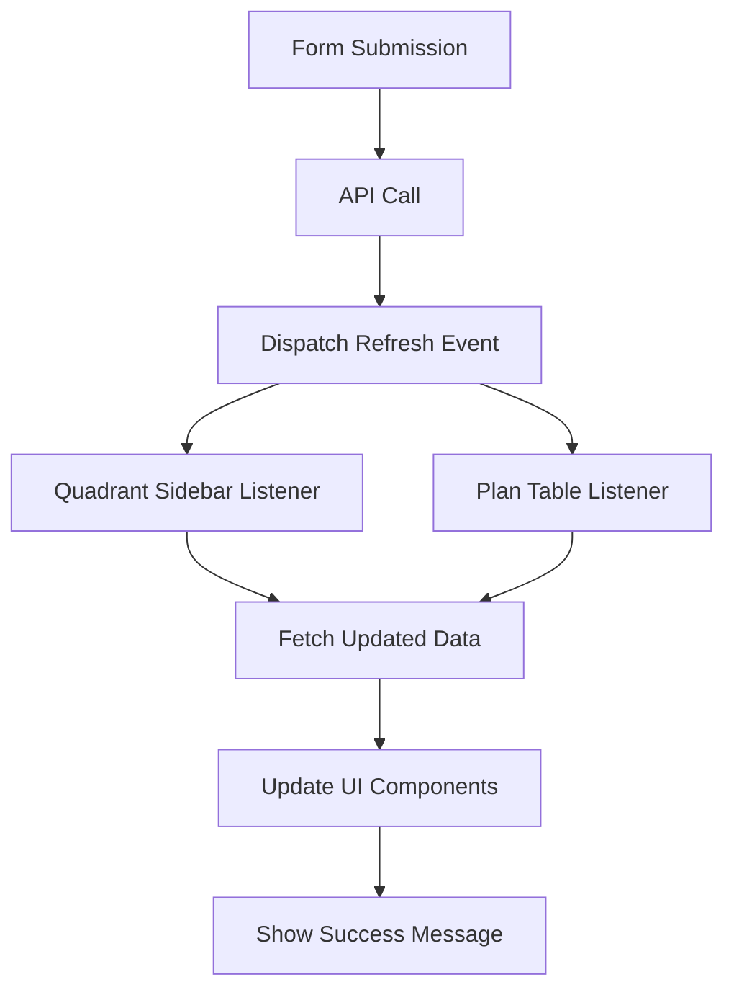

**Diagram sources**
- [src/lib/utils.ts:8-16](file://src/lib/utils.ts#L8-L16)
- [src/components/quadrant-left-sidebar.tsx:428-438](file://src/components/quadrant-left-sidebar.tsx#L428-L438)

**Section sources**
- [src/lib/utils.ts:8-16](file://src/lib/utils.ts#L8-L16)
- [src/components/quadrant-left-sidebar.tsx:420-438](file://src/components/quadrant-left-sidebar.tsx#L420-L438)

## Performance Considerations

### Database Optimization

The system implements several performance optimization strategies:

1. **Pagination**: All list endpoints support configurable pagination
2. **Selective Field Loading**: API responses include only necessary fields
3. **Indexing Strategy**: Proper indexing on frequently queried fields
4. **Connection Pooling**: Efficient database connection management
5. **Progress Record Optimization**: Selective loading of progress records for quadrant display
6. **Undefined Value Filtering**: Backend filtering prevents unnecessary database updates

### Frontend Performance

1. **Client-side Caching**: Local caching of frequently accessed data
2. **Virtual Scrolling**: Large datasets are handled efficiently
3. **Debounced Search**: Input debouncing for search operations
4. **Lazy Loading**: Components load only when needed
5. **Real-time Updates**: Optimized refresh intervals for quadrant data
6. **Event-driven Architecture**: Efficient component communication through custom events

## Security Implementation

### Authentication and Authorization

The system implements comprehensive security measures:

- **JWT Token Validation**: Secure token verification with expiration handling
- **Environment-based Configuration**: Secret keys stored in environment variables
- **Input Sanitization**: All API endpoints validate and sanitize input data
- **Access Control**: Protected routes with proper authentication checks

### Data Protection

- **SQL Injection Prevention**: Prisma ORM provides protection against SQL injection
- **Cross-Site Scripting (XSS) Prevention**: Input validation and sanitization
- **Cross-Site Request Forgery (CSRF) Protection**: Token-based authentication
- **Data Encryption**: Sensitive data encryption at rest and in transit
- **Undefined Value Safety**: Backend filtering prevents accidental data corruption

**Section sources**
- [src/lib/auth.ts:4-33](file://src/lib/auth.ts#L4-L33)

## Troubleshooting Guide

### Common Issues and Solutions

#### API Endpoint Problems

**Issue**: 400 Bad Request errors from plan endpoints
**Solution**: Verify required parameters and data format
- Ensure `plan_id` is provided for updates
- Validate JSON structure for POST requests
- Check tag array format for plan creation
- Verify undefined values are properly filtered in PUT requests

**Issue**: 500 Internal Server Errors
**Solution**: Check database connectivity and Prisma configuration
- Verify PostgreSQL connection string
- Ensure database migrations are applied
- Check Prisma client initialization
- Verify undefined value filtering logic

#### Frontend Issues

**Issue**: Plans not loading in quadrant sidebar
**Solution**: Verify API connectivity and response format
- Check network tab for failed requests
- Verify `/api/plan/priority` endpoint response includes progress records
- Ensure proper error handling in sidebar component
- Check for refresh event listener issues

**Issue**: Drag and drop not working
**Solution**: Check browser compatibility and permissions
- Verify browser supports HTML5 drag and drop
- Ensure proper event handlers are attached
- Check for JavaScript errors in console
- Verify refreshQuadrantSidebar utility function

**Issue**: Form submission failures
**Solution**: Check form data handling and API integration
- Verify priority_quadrant and is_scheduled fields are properly included
- Ensure undefined values are filtered before API calls
- Check for proper error handling in form submission
- Verify refreshQuadrantSidebar is called after successful updates

#### Database Issues

**Issue**: Duplicate plan_id errors
**Solution**: Verify UUID generation and collision handling
- Check randomUUID() implementation
- Ensure proper error handling for duplicates
- Verify database unique constraint enforcement

**Issue**: Data integrity problems
**Solution**: Check undefined value filtering
- Verify PUT endpoints properly filter undefined values
- Ensure database updates only occur for non-undefined fields
- Check for proper error handling in update operations

**Section sources**
- [src/app/api/plan/route.ts:85-111](file://src/app/api/plan/route.ts#L85-L111)
- [src/app/api/plan/priority/route.ts:72-110](file://src/app/api/plan/priority/route.ts#L72-L110)
- [src/lib/utils.ts:8-16](file://src/lib/utils.ts#L8-L16)

## Conclusion

The Enhanced Plan Management System provides a comprehensive solution for task and goal management with advanced features including:

- **Enhanced Form Handling**: Sophisticated form processing with proper undefined value management for improved data integrity
- **Priority Management**: Four-quadrant prioritization with drag-and-drop interface and complete progress tracking
- **Real-time Integration**: Seamless real-time updates through custom event system and quadrant sidebar refresh
- **Recurring Tasks**: Intelligent cycle detection and progress tracking
- **Advanced Filtering**: Multi-dimensional filtering with tags, difficulty, scheduling status, and quadrant assignment
- **Robust API Integration**: Proper form handling and API integration with comprehensive error handling
- **Secure Architecture**: Robust authentication and authorization system with data protection measures

The recent enhancements significantly improve the system's capability to provide complete task information across all quadrants. The enhanced PUT endpoints now properly handle undefined values during updates, preventing accidental data overwrites and ensuring data integrity. The addition of real-time quadrant sidebar refresh integration provides seamless user experience with immediate visual feedback for all plan management operations.

The system's modular design allows for easy extension and customization while maintaining high performance and reliability. The combination of modern frontend technologies with a robust backend ensures a smooth user experience across all devices and use cases.

Future enhancements could include additional reporting features, team collaboration capabilities, and integration with external calendar systems. The current architecture provides a solid foundation for these potential extensions while maintaining system stability and performance.