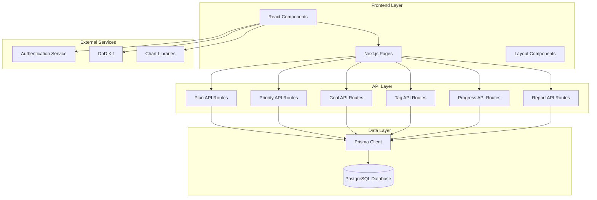
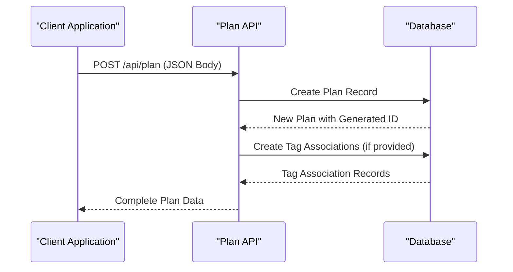
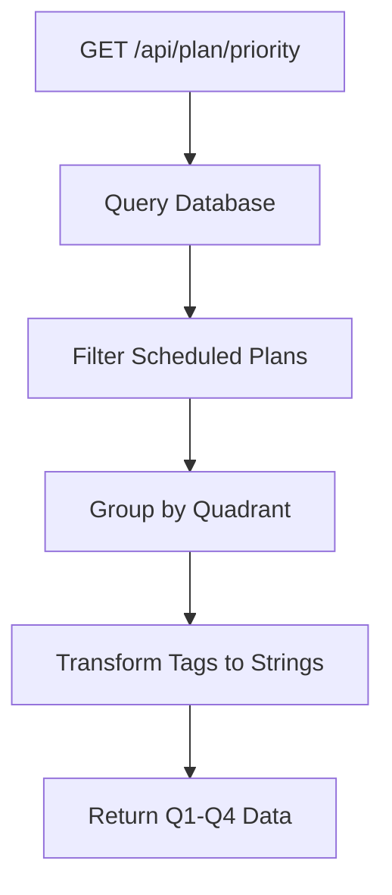
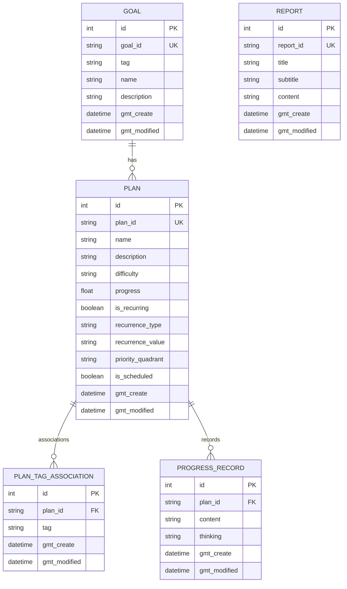
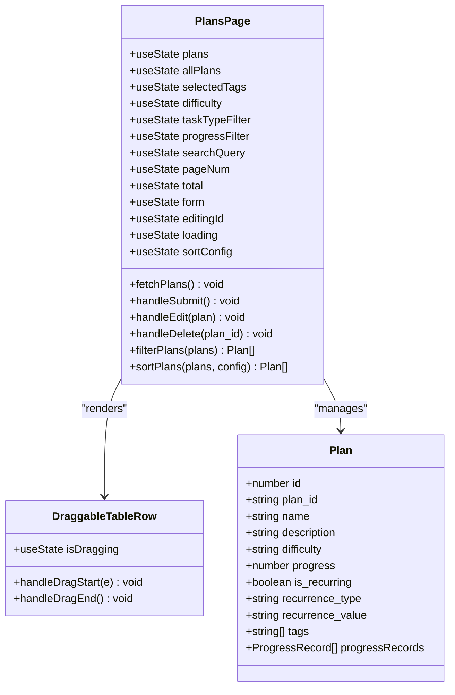
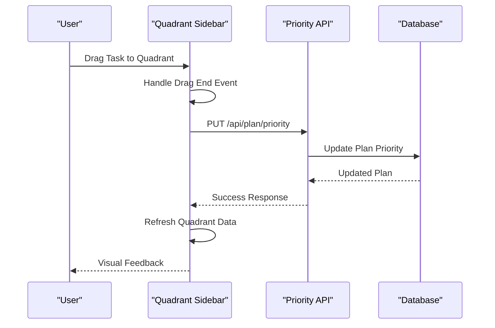
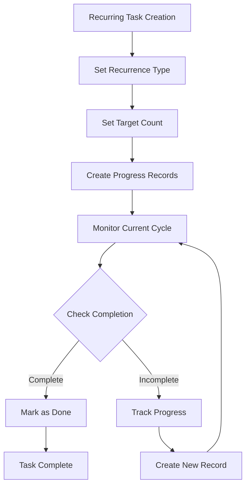
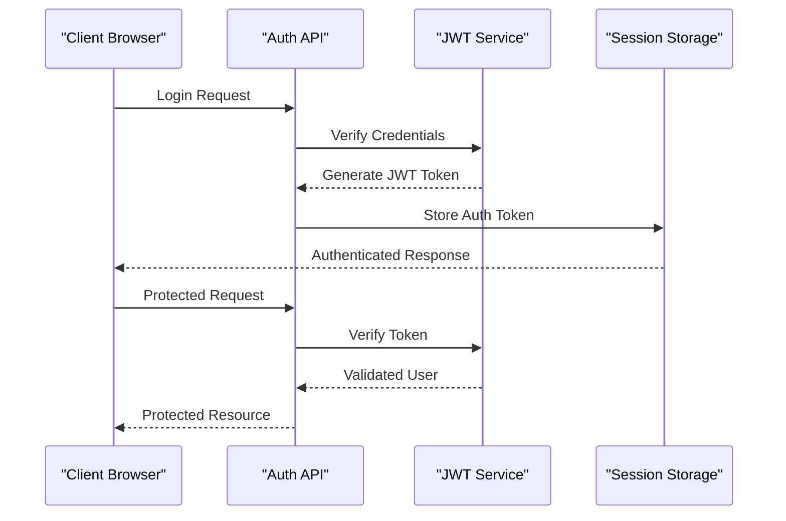

# Enhanced Plan Management Endpoints

<cite>
**Referenced Files in This Document**
- [src/app/api/plan/route.ts](file://src/app/api/plan/route.ts)
- [src/app/api/plan/priority/route.ts](file://src/app/api/plan/priority/route.ts)
- [src/app/api/goal/route.ts](file://src/app/api/goal/route.ts)
- [src/app/api/tag/route.ts](file://src/app/api/tag/route.ts)
- [src/app/api/progress_record/route.ts](file://src/app/api/progress_record/route.ts)
- [src/app/api/report/route.ts](file://src/app/api/report/route.ts)
- [src/app/plans/page.tsx](file://src/app/plans/page.tsx)
- [src/components/quadrant-left-sidebar.tsx](file://src/components/quadrant-left-sidebar.tsx)
- [src/lib/recurring-utils.ts](file://src/lib/recurring-utils.ts)
- [src/lib/auth.ts](file://src/lib/auth.ts)
- [prisma/schema.prisma](file://prisma/schema.prisma)
</cite>

## Table of Contents
1. [Introduction](#introduction)
2. [System Architecture](#system-architecture)
3. [Core API Endpoints](#core-api-endpoints)
4. [Data Model](#data-model)
5. [Frontend Implementation](#frontend-implementation)
6. [Advanced Features](#advanced-features)
7. [Integration Patterns](#integration-patterns)
8. [Performance Considerations](#performance-considerations)
9. [Security Implementation](#security-implementation)
10. [Troubleshooting Guide](#troubleshooting-guide)
11. [Conclusion](#conclusion)

## Introduction

The Enhanced Plan Management System is a comprehensive task and goal management solution built with Next.js and Prisma ORM. This system provides sophisticated plan management capabilities with advanced filtering, scheduling, tagging, and progress tracking features. The system supports both individual tasks and recurring activities, integrates with Eisenhower Matrix (four-quadrant) prioritization, and offers real-time collaboration features.

The platform enables users to manage their daily activities, long-term goals, and progress tracking through an intuitive interface while maintaining robust backend functionality for data persistence and retrieval.

## System Architecture

The Enhanced Plan Management System follows a modern Next.js architecture with separate API routes for different functional domains:

**Diagram sources**
- [src/app/api/plan/route.ts:1-114](file://src/app/api/plan/route.ts#L1-L114)
- [src/app/api/plan/priority/route.ts:1-94](file://src/app/api/plan/priority/route.ts#L1-L94)
- [src/app/api/goal/route.ts:1-51](file://src/app/api/goal/route.ts#L1-L51)
- [src/app/api/tag/route.ts:1-20](file://src/app/api/tag/route.ts#L1-L20)

## Core API Endpoints

### Plan Management Endpoints

The system provides comprehensive CRUD operations for plan management with advanced filtering capabilities:

#### GET /api/plan - List Plans with Advanced Filtering

The plan listing endpoint supports extensive filtering options:

| Parameter | Type | Description | Example |
|-----------|------|-------------|---------|
| `tag` | String | Filter by specific tag | `?tag=work` |
| `difficulty` | String | Filter by difficulty level | `?difficulty=high` |
| `goal_id` | String | Filter by associated goal | `?goal_id=goal_abc123` |
| `is_scheduled` | Boolean | Filter scheduled/unscheduled tasks | `?is_scheduled=true` |
| `unscheduled` | Boolean | Get only unscheduled tasks | `?unscheduled=true` |
| `pageNum` | Number | Page number for pagination | `?pageNum=2` |
| `pageSize` | Number | Results per page | `?pageSize=20` |

**Section sources**
- [src/app/api/plan/route.ts:7-67](file://src/app/api/plan/route.ts#L7-L67)

#### POST /api/plan - Create New Plan

Creates a new plan with automatic ID generation and tag association:

**Diagram sources**
- [src/app/api/plan/route.ts:69-83](file://src/app/api/plan/route.ts#L69-L83)

#### PUT /api/plan - Update Existing Plan

Updates plan information and manages tag associations:

**Section sources**
- [src/app/api/plan/route.ts:85-105](file://src/app/api/plan/route.ts#L85-L105)

#### DELETE /api/plan - Remove Plan

Deletes a plan by ID with proper validation:

**Section sources**
- [src/app/api/plan/route.ts:107-114](file://src/app/api/plan/route.ts#L107-L114)

### Priority Management Endpoints

#### GET /api/plan/priority - Get Prioritized Plans

Retrieves all scheduled plans organized by Eisenhower Matrix quadrants:

**Diagram sources**
- [src/app/api/plan/priority/route.ts:6-48](file://src/app/api/plan/priority/route.ts#L6-L48)

#### PUT /api/plan/priority - Update Plan Priority

Updates plan position in the priority matrix:

**Section sources**
- [src/app/api/plan/priority/route.ts:50-93](file://src/app/api/plan/priority/route.ts#L50-L93)

### Supporting Endpoints

#### GET /api/tag - List All Tags

Aggregates tags from both goals and plans:

**Section sources**
- [src/app/api/tag/route.ts:6-19](file://src/app/api/tag/route.ts#L6-L19)

#### GET /api/goal - Goal Management

Provides goal CRUD operations with pagination support:

**Section sources**
- [src/app/api/goal/route.ts:7-24](file://src/app/api/goal/route.ts#L7-L24)

#### GET /api/progress_record - Progress Tracking

Manages progress records with custom timestamps:

**Section sources**
- [src/app/api/progress_record/route.ts:6-23](file://src/app/api/progress_record/route.ts#L6-L23)

## Data Model

The system uses a normalized database schema designed for efficient querying and relationship management:

**Diagram sources**
- [prisma/schema.prisma:16-61](file://prisma/schema.prisma#L16-L61)

**Section sources**
- [prisma/schema.prisma:16-61](file://prisma/schema.prisma#L16-L61)

## Frontend Implementation

### Plan Management Page

The main plan management interface provides comprehensive functionality:

**Diagram sources**
- [src/app/plans/page.tsx:99-869](file://src/app/plans/page.tsx#L99-L869)

### Four-Quadrant Sidebar

The quadrant sidebar provides drag-and-drop functionality for task prioritization:

**Diagram sources**
- [src/components/quadrant-left-sidebar.tsx:295-314](file://src/components/quadrant-left-sidebar.tsx#L295-L314)
- [src/app/api/plan/priority/route.ts:50-93](file://src/app/api/plan/priority/route.ts#L50-L93)

**Section sources**
- [src/app/plans/page.tsx:99-869](file://src/app/plans/page.tsx#L99-L869)
- [src/components/quadrant-left-sidebar.tsx:229-395](file://src/components/quadrant-left-sidebar.tsx#L229-L395)

## Advanced Features

### Recurring Task Management

The system includes sophisticated recurring task handling with intelligent cycle detection:

**Diagram sources**
- [src/lib/recurring-utils.ts:152-186](file://src/lib/recurring-utils.ts#L152-L186)

**Section sources**
- [src/lib/recurring-utils.ts:1-218](file://src/lib/recurring-utils.ts#L1-L218)

### Tag Management System

Dynamic tag association system supporting both existing and new tags:

**Section sources**
- [src/app/api/tag/route.ts:6-19](file://src/app/api/tag/route.ts#L6-L19)
- [src/app/plans/page.tsx:520-568](file://src/app/plans/page.tsx#L520-L568)

### Progress Tracking

Comprehensive progress recording with custom timestamp support:

**Section sources**
- [src/app/api/progress_record/route.ts:25-70](file://src/app/api/progress_record/route.ts#L25-L70)

## Integration Patterns

### Authentication Flow

The system implements JWT-based authentication with secure token management:

**Diagram sources**
- [src/lib/auth.ts:14-33](file://src/lib/auth.ts#L14-L33)

**Section sources**
- [src/lib/auth.ts:1-69](file://src/lib/auth.ts#L1-L69)

### Real-time Updates

The system supports real-time updates through periodic polling and event-driven refreshes:

**Section sources**
- [src/components/quadrant-left-sidebar.tsx:266-271](file://src/components/quadrant-left-sidebar.tsx#L266-L271)

## Performance Considerations

### Database Optimization

The system implements several performance optimization strategies:

1. **Pagination**: All list endpoints support configurable pagination
2. **Selective Field Loading**: API responses include only necessary fields
3. **Indexing Strategy**: Proper indexing on frequently queried fields
4. **Connection Pooling**: Efficient database connection management

### Frontend Performance

1. **Client-side Caching**: Local caching of frequently accessed data
2. **Virtual Scrolling**: Large datasets are handled efficiently
3. **Debounced Search**: Input debouncing for search operations
4. **Lazy Loading**: Components load only when needed

## Security Implementation

### Authentication and Authorization

The system implements comprehensive security measures:

- **JWT Token Validation**: Secure token verification with expiration handling
- **Environment-based Configuration**: Secret keys stored in environment variables
- **Input Sanitization**: All API endpoints validate and sanitize input data
- **Access Control**: Protected routes with proper authentication checks

### Data Protection

- **SQL Injection Prevention**: Prisma ORM provides protection against SQL injection
- **Cross-Site Scripting (XSS) Prevention**: Input validation and sanitization
- **Cross-Site Request Forgery (CSRF) Protection**: Token-based authentication
- **Data Encryption**: Sensitive data encryption at rest and in transit

**Section sources**
- [src/lib/auth.ts:4-33](file://src/lib/auth.ts#L4-L33)

## Troubleshooting Guide

### Common Issues and Solutions

#### API Endpoint Problems

**Issue**: 400 Bad Request errors from plan endpoints
**Solution**: Verify required parameters and data format
- Ensure `plan_id` is provided for updates
- Validate JSON structure for POST requests
- Check tag array format for plan creation

**Issue**: 500 Internal Server Errors
**Solution**: Check database connectivity and Prisma configuration
- Verify PostgreSQL connection string
- Ensure database migrations are applied
- Check Prisma client initialization

#### Frontend Issues

**Issue**: Plans not loading in quadrant sidebar
**Solution**: Verify API connectivity and response format
- Check network tab for failed requests
- Verify `/api/plan/priority` endpoint response
- Ensure proper error handling in sidebar component

**Issue**: Drag and drop not working
**Solution**: Check browser compatibility and permissions
- Verify browser supports HTML5 drag and drop
- Ensure proper event handlers are attached
- Check for JavaScript errors in console

#### Database Issues

**Issue**: Duplicate plan_id errors
**Solution**: Verify UUID generation and collision handling
- Check randomUUID() implementation
- Ensure proper error handling for duplicates
- Verify database unique constraint enforcement

**Section sources**
- [src/app/api/plan/route.ts:107-114](file://src/app/api/plan/route.ts#L107-L114)
- [src/app/api/plan/priority/route.ts:41-47](file://src/app/api/plan/priority/route.ts#L41-L47)

## Conclusion

The Enhanced Plan Management System provides a comprehensive solution for task and goal management with advanced features including:

- **Flexible Filtering**: Multi-dimensional filtering with tags, difficulty, and scheduling status
- **Priority Management**: Four-quadrant prioritization with drag-and-drop interface
- **Recurring Tasks**: Intelligent cycle detection and progress tracking
- **Real-time Collaboration**: Live updates and synchronized data
- **Advanced Reporting**: Comprehensive progress tracking and analytics
- **Secure Architecture**: Robust authentication and authorization system

The system's modular design allows for easy extension and customization while maintaining high performance and reliability. The combination of modern frontend technologies with a robust backend ensures a smooth user experience across all devices and use cases.

Future enhancements could include additional reporting features, team collaboration capabilities, and integration with external calendar systems. The current architecture provides a solid foundation for these potential extensions while maintaining system stability and performance.