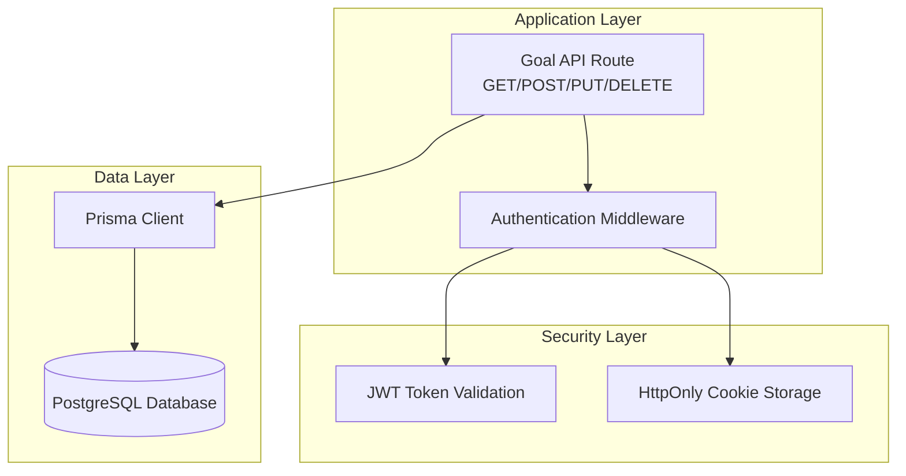
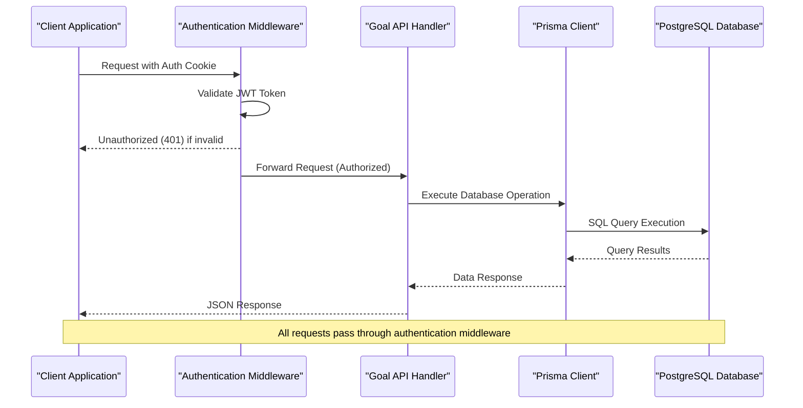
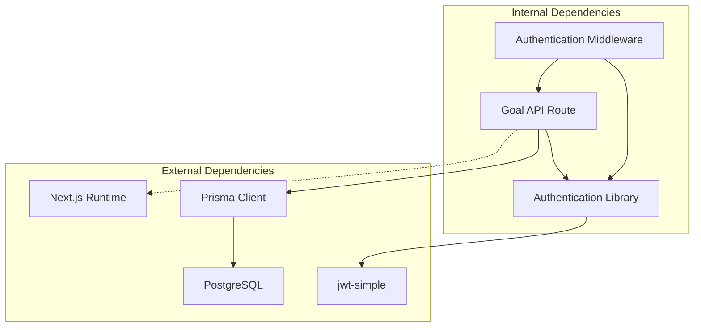

# Goal Management Endpoints

<cite>
**Referenced Files in This Document**
- [route.ts](file://src/app/api/goal/route.ts)
- [schema.prisma](file://prisma/schema.prisma)
- [middleware.ts](file://middleware.ts)
- [auth.ts](file://src/lib/auth.ts)
- [login/route.ts](file://src/app/api/auth/login/route.ts)
- [logout/route.ts](file://src/app/api/auth/logout/route.ts)
- [me/route.ts](file://src/app/api/auth/me/route.ts)
- [README.md](file://README.md)
- [AUTHENTICATION.md](file://AUTHENTICATION.md)
</cite>

## Table of Contents
1. [Introduction](#introduction)
2. [Project Structure](#project-structure)
3. [Core Components](#core-components)
4. [Architecture Overview](#architecture-overview)
5. [Detailed Component Analysis](#detailed-component-analysis)
6. [Dependency Analysis](#dependency-analysis)
7. [Performance Considerations](#performance-considerations)
8. [Troubleshooting Guide](#troubleshooting-guide)
9. [Conclusion](#conclusion)

## Introduction
This document provides comprehensive API documentation for the goal management endpoints in the Goal Mate application. It covers the GET, POST, PUT, and DELETE operations for managing goals, including request/response schemas, query parameters, error handling, validation rules, and practical usage examples. The goal management system integrates with the application's authentication middleware and database schema to provide a robust backend for goal lifecycle management.

## Project Structure
The goal management API is implemented as a Next.js API route located under the application's API namespace. The endpoint handlers interact with a Prisma-managed PostgreSQL database through the generated Prisma client. Authentication is enforced via a middleware that validates JWT tokens stored in HttpOnly cookies.



**Diagram sources**
- [route.ts:1-51](file://src/app/api/goal/route.ts#L1-L51)
- [middleware.ts:1-40](file://middleware.ts#L1-L40)
- [auth.ts:1-69](file://src/lib/auth.ts#L1-L69)

**Section sources**
- [route.ts:1-51](file://src/app/api/goal/route.ts#L1-L51)
- [schema.prisma:16-24](file://prisma/schema.prisma#L16-L24)
- [middleware.ts:1-40](file://middleware.ts#L1-L40)

## Core Components
The goal management API consists of four primary HTTP endpoints that handle the complete CRUD operations for goals. Each endpoint follows RESTful conventions and integrates with the application's authentication and database layers.

### Endpoint Overview
- **GET /api/goal**: Retrieve paginated goals with optional tag filtering
- **POST /api/goal**: Create a new goal with automatic ID generation
- **PUT /api/goal**: Update an existing goal with partial updates support
- **DELETE /api/goal**: Remove a goal by ID with validation

### Data Model Integration
The goal entity is defined in the Prisma schema with the following key attributes:
- Unique identifier: goal_id (String, @unique)
- Creation timestamp: gmt_create (DateTime, @default(now()))
- Last modification timestamp: gmt_modified (DateTime, @updatedAt)
- Tag field: tag (String)
- Name field: name (String)
- Description field: description (String?, nullable)

**Section sources**
- [schema.prisma:16-24](file://prisma/schema.prisma#L16-L24)
- [route.ts:1-51](file://src/app/api/goal/route.ts#L1-L51)

## Architecture Overview
The goal management system operates within a layered architecture that separates concerns between presentation, business logic, data access, and security.



**Diagram sources**
- [middleware.ts:19-34](file://middleware.ts#L19-L34)
- [route.ts:8-23](file://src/app/api/goal/route.ts#L8-L23)
- [auth.ts:49-63](file://src/lib/auth.ts#L49-L63)

## Detailed Component Analysis

### GET /api/goal - List Goals with Pagination and Tag Filtering
The GET endpoint retrieves goals with comprehensive filtering and pagination capabilities.

#### Request Parameters
- **Query Parameters**:
  - `tag` (optional): Filter goals by specific tag value
  - `pageNum` (optional): Page number (default: 1)
  - `pageSize` (optional): Number of items per page (default: 10)

#### Response Schema
```json
{
  "list": [
    {
      "id": 1,
      "gmt_create": "2024-01-01T00:00:00Z",
      "gmt_modified": "2024-01-01T00:00:00Z",
      "goal_id": "goal_a1b2c3d4e5",
      "tag": "work",
      "name": "Complete project",
      "description": "Finish development tasks"
    }
  ],
  "total": 150
}
```

#### Implementation Details
- Uses Prisma's `findMany` with `skip` and `take` for pagination
- Supports optional tag filtering through dynamic where clause
- Orders results by creation date (newest first)
- Returns total count alongside paginated results

#### Practical Usage Examples
```bash
# Get first page of goals
curl "http://localhost:3000/api/goal?pageNum=1&pageSize=10"

# Filter by tag
curl "http://localhost:3000/api/goal?tag=work&pageNum=1&pageSize=20"

# Get second page with custom page size
curl "http://localhost:3000/api/goal?pageNum=2&pageSize=5&tag=personal"
```

**Section sources**
- [route.ts:8-24](file://src/app/api/goal/route.ts#L8-L24)
- [schema.prisma:16-24](file://prisma/schema.prisma#L16-L24)

### POST /api/goal - Create New Goals
The POST endpoint creates new goals with automatic ID generation and basic validation.

#### Request Body Schema
```json
{
  "tag": "string",
  "name": "string",
  "description": "string?"
}
```

#### Response Schema
```json
{
  "id": 1,
  "gmt_create": "2024-01-01T00:00:00Z",
  "gmt_modified": "2024-01-01T00:00:00Z",
  "goal_id": "goal_a1b2c3d4e5f67890",
  "tag": "string",
  "name": "string",
  "description": "string?"
}
```

#### Auto-Generated ID Format
The system generates unique goal identifiers using the format: `goal_[32-character UUID without hyphens, truncated to 10 characters]`. This ensures globally unique identifiers while maintaining readability.

#### Validation Rules
- Required fields: `tag`, `name`
- Automatic fields: `goal_id` (generated), `gmt_create` (current timestamp), `gmt_modified` (current timestamp)
- Database constraint: `goal_id` must be unique

#### Practical Usage Examples
```bash
# Create a new goal
curl -X POST "http://localhost:3000/api/goal" \
  -H "Content-Type: application/json" \
  -d '{
    "tag": "work",
    "name": "Complete project proposal",
    "description": "Finish the Q1 proposal document"
  }'

# Create goal with minimal data
curl -X POST "http://localhost:3000/api/goal" \
  -H "Content-Type: application/json" \
  -d '{"tag": "personal", "name": "Learn TypeScript"}'
```

**Section sources**
- [route.ts:27-31](file://src/app/api/goal/route.ts#L27-L31)
- [schema.prisma:16-24](file://prisma/schema.prisma#L16-L24)

### PUT /api/goal - Update Existing Goals
The PUT endpoint supports partial updates to existing goals.

#### Request Body Schema
```json
{
  "goal_id": "string",
  "tag": "string?",
  "name": "string?",
  "description": "string?"
}
```

#### Implementation Details
- Requires `goal_id` in request body for identification
- Supports partial updates (only provided fields are modified)
- Updates `gmt_modified` timestamp automatically
- Maintains uniqueness constraints for `goal_id`

#### Practical Usage Examples
```bash
# Update goal name and description
curl -X PUT "http://localhost:3000/api/goal" \
  -H "Content-Type: application/json" \
  -d '{
    "goal_id": "goal_a1b2c3d4e5",
    "name": "Updated project completion",
    "description": "Completed with additional features"
  }'

# Update only the tag
curl -X PUT "http://localhost:3000/api/goal" \
  -H "Content-Type: application/json" \
  -d '{
    "goal_id": "goal_a1b2c3d4e5",
    "tag": "important-work"
  }'
```

**Section sources**
- [route.ts:34-42](file://src/app/api/goal/route.ts#L34-L42)
- [schema.prisma:16-24](file://prisma/schema.prisma#L16-L24)

### DELETE /api/goal - Remove Goals
The DELETE endpoint removes goals by ID with proper validation.

#### Request Parameters
- **Query Parameter**:
  - `goal_id` (required): Identifier of goal to delete

#### Response Schema
```json
{
  "success": true
}
```

#### Error Handling
- Returns 400 Bad Request if `goal_id` is missing
- Returns 404 Not Found if goal doesn't exist
- Returns 500 Internal Server Error for database errors

#### Practical Usage Examples
```bash
# Delete a specific goal
curl -X DELETE "http://localhost:3000/api/goal?goal_id=goal_a1b2c3d4e5"

# Attempt to delete non-existent goal
curl -X DELETE "http://localhost:3000/api/goal?goal_id=nonexistent"
```

**Section sources**
- [route.ts:44-51](file://src/app/api/goal/route.ts#L44-L51)

## Dependency Analysis
The goal management API has clear dependencies and relationships with other system components.



**Diagram sources**
- [route.ts:1-5](file://src/app/api/goal/route.ts#L1-L5)
- [auth.ts:1-11](file://src/lib/auth.ts#L1-L11)
- [middleware.ts:1-40](file://middleware.ts#L1-L40)

### Security Dependencies
- Authentication middleware validates JWT tokens
- HttpOnly cookies prevent XSS attacks
- Environment variables store sensitive configuration
- Database constraints enforce data integrity

### Database Dependencies
- Prisma model defines goal entity structure
- PostgreSQL enforces unique constraints
- Migration scripts manage schema evolution

**Section sources**
- [route.ts:1-5](file://src/app/api/goal/route.ts#L1-L5)
- [auth.ts:1-11](file://src/lib/auth.ts#L1-L11)
- [middleware.ts:1-40](file://middleware.ts#L1-L40)

## Performance Considerations
The goal management API is designed for efficient operation with several built-in optimizations:

### Database Optimization
- Pagination using `skip` and `take` prevents loading entire datasets
- Indexes on frequently queried fields (goal_id, tag)
- Batch operations for concurrent requests

### Caching Strategies
- Consider implementing Redis caching for frequently accessed goal lists
- Cache invalidation on create/update/delete operations
- ETag support for conditional requests

### Scalability Recommendations
- Add database connection pooling
- Implement rate limiting for API endpoints
- Consider read replicas for heavy read workloads
- Add database query monitoring and alerting

## Troubleshooting Guide

### Common Issues and Solutions

#### Authentication Errors
**Problem**: 401 Unauthorized responses
**Causes**:
- Missing or expired JWT token
- Invalid AUTH_SECRET configuration
- Cookie not being sent with requests

**Solutions**:
- Verify authentication middleware is properly configured
- Check browser cookie storage for auth-token
- Ensure AUTH_SECRET environment variable is set correctly

#### Database Connection Issues
**Problem**: 500 Internal Server Error on database operations
**Causes**:
- Database unreachable
- Invalid DATABASE_URL configuration
- Prisma client initialization failures

**Solutions**:
- Verify database connectivity and credentials
- Run Prisma migrations: `npx prisma db push`
- Check Prisma client generation: `npx prisma generate`

#### Validation Errors
**Problem**: 400 Bad Request for malformed requests
**Causes**:
- Missing required fields in POST/PUT requests
- Invalid goal_id format in DELETE requests
- Incorrect data types in request bodies

**Solutions**:
- Validate request schemas before sending requests
- Ensure goal_id follows the required format
- Check field types match database schema expectations

#### Performance Issues
**Problem**: Slow response times for large datasets
**Causes**:
- Missing pagination parameters
- Unfiltered queries on large tables
- Insufficient database indexing

**Solutions**:
- Always use pagination parameters (pageNum, pageSize)
- Add appropriate WHERE clauses for filtering
- Consider adding database indexes on frequently queried columns

**Section sources**
- [middleware.ts:22-30](file://middleware.ts#L22-L30)
- [auth.ts:5-11](file://src/lib/auth.ts#L5-L11)
- [route.ts:44-48](file://src/app/api/goal/route.ts#L44-L48)

## Conclusion
The Goal Management API provides a comprehensive and secure solution for goal lifecycle operations. Built with Next.js API routes and Prisma ORM, it offers robust CRUD functionality with proper authentication, validation, and error handling. The API's design emphasizes security through JWT authentication, data integrity through database constraints, and scalability through pagination and caching considerations.

Key strengths of the implementation include:
- Complete CRUD support with proper HTTP semantics
- Comprehensive authentication middleware integration
- Automatic ID generation with unique constraints
- Flexible filtering and pagination capabilities
- Clear error handling and validation
- Secure cookie-based session management

Future enhancements could include input validation libraries, comprehensive logging, rate limiting, and advanced search capabilities to further improve the developer experience and system reliability.