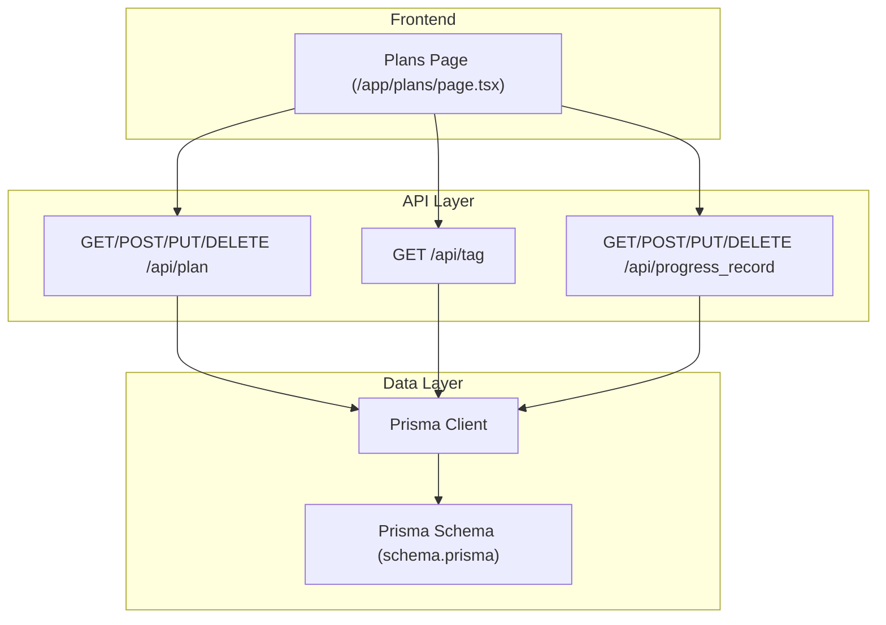
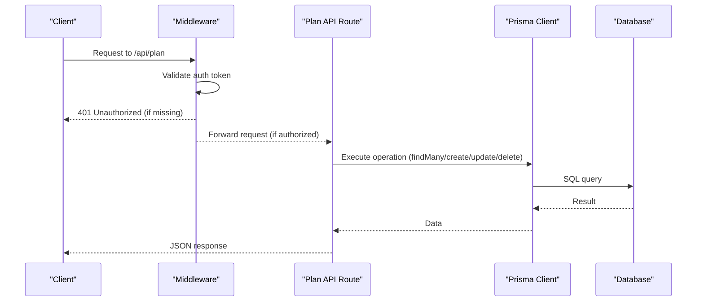
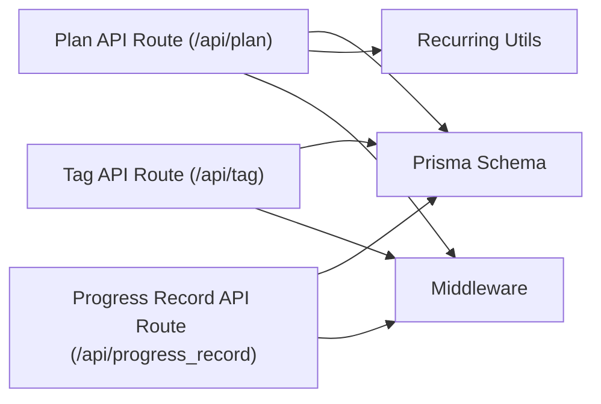

# Plan Management Endpoints

<cite>
**Referenced Files in This Document**
- [route.ts](file://src/app/api/plan/route.ts)
- [schema.prisma](file://prisma/schema.prisma)
- [recurring-utils.ts](file://src/lib/recurring-utils.ts)
- [page.tsx](file://src/app/plans/page.tsx)
- [progress_record/route.ts](file://src/app/api/progress_record/route.ts)
- [tag/route.ts](file://src/app/api/tag/route.ts)
- [middleware.ts](file://middleware.ts)
</cite>

## Table of Contents
1. [Introduction](#introduction)
2. [Project Structure](#project-structure)
3. [Core Components](#core-components)
4. [Architecture Overview](#architecture-overview)
5. [Detailed Component Analysis](#detailed-component-analysis)
6. [Dependency Analysis](#dependency-analysis)
7. [Performance Considerations](#performance-considerations)
8. [Troubleshooting Guide](#troubleshooting-guide)
9. [Conclusion](#conclusion)

## Introduction
This document provides comprehensive API documentation for plan management endpoints. It covers the GET, POST, PUT, and DELETE operations for plans, including filtering and sorting capabilities, difficulty ratings, recurrence settings, tag associations, progress tracking integration, and practical examples. The documentation also explains plan data models, recurrence patterns, validation rules, and tag management integration.

## Project Structure
The plan management functionality is implemented as a Next.js API route module with Prisma ORM integration. The system includes:
- Plan CRUD endpoints under `/api/plan`
- Tag management under `/api/tag`
- Progress record management under `/api/progress_record`
- Frontend integration in the plans page (`/app/plans/page.tsx`)
- Recurrence utilities for progress synchronization (`/lib/recurring-utils.ts`)

**Diagram sources**
- [route.ts:1-114](file://src/app/api/plan/route.ts#L1-L114)
- [page.tsx:1-807](file://src/app/plans/page.tsx#L1-L807)
- [schema.prisma:1-72](file://prisma/schema.prisma#L1-L72)

**Section sources**
- [route.ts:1-114](file://src/app/api/plan/route.ts#L1-L114)
- [schema.prisma:1-72](file://prisma/schema.prisma#L1-L72)

## Core Components
This section outlines the plan data model and key components used across the API endpoints.

- Plan entity fields:
  - Unique identifiers: `plan_id`, `id`
  - Metadata: `gmt_create`, `gmt_modified`
  - Core attributes: `name`, `description`, `difficulty`
  - Progress tracking: `progress` (Float), `is_recurring` (Boolean)
  - Recurrence settings: `recurrence_type` (String), `recurrence_value` (String)
  - Priority quadrant: `priority_quadrant` (String)
  - Scheduling flag: `is_scheduled` (Boolean)
  - Associations: `tags` (PlanTagAssociation[]), `progressRecords` (ProgressRecord[])

- Tag association model:
  - Links plans to tags via `plan_id` and `tag`
  - Cascading delete behavior on plan deletion

- Progress record model:
  - Tracks entries with `content`, `thinking`, and timestamps
  - Supports moving records between plans and custom timestamps

- Recurrence utilities:
  - Enumerates recurrence types: daily, weekly, monthly
  - Computes current period boundaries and counts progress records
  - Calculates completion rates and displays status text

**Section sources**
- [schema.prisma:26-61](file://prisma/schema.prisma#L26-L61)
- [recurring-utils.ts:1-218](file://src/lib/recurring-utils.ts#L1-L218)

## Architecture Overview
The plan management API follows a layered architecture:
- Middleware enforces authentication for API routes
- API routes handle HTTP requests and delegate to Prisma for persistence
- Frontend pages consume the API for CRUD operations and display filtered/sorted lists
- Recurrence utilities compute progress for recurring tasks

**Diagram sources**
- [middleware.ts:1-40](file://middleware.ts#L1-L40)
- [route.ts:1-114](file://src/app/api/plan/route.ts#L1-L114)

## Detailed Component Analysis

### GET /api/plan
Retrieves paginated plans with optional filtering and sorting. The endpoint supports:
- Filtering parameters:
  - `tag`: Filter by tag associated with the plan
  - `difficulty`: Filter by difficulty level
  - `goal_id`: Filter by goal’s tag (derived filter)
  - `is_scheduled`: Boolean filter for scheduled plans
  - `priority_quadrant`: Filter by priority quadrant
  - `unscheduled`: Special flag to return un-scheduled plans
- Pagination parameters:
  - `pageNum`: Page number (default: 1)
  - `pageSize`: Items per page (default: 10)
- Sorting:
  - Results are ordered by creation time descending

Response format:
- `list`: Array of plan objects with additional computed fields
- `total`: Total count matching filters

Plan object structure (fields):
- Core: `plan_id`, `name`, `description`, `difficulty`, `progress`, `is_recurring`, `recurrence_type`, `recurrence_value`, `priority_quadrant`, `is_scheduled`
- Computed: `tags` (string array derived from associations)
- Metadata: `progressRecords` (limited to latest entry with timestamp)

Notes:
- When filtering by `goal_id`, the system derives the tag from the goal and filters plans accordingly.
- The response includes a flattened `tags` array for convenience.

**Section sources**
- [route.ts:7-67](file://src/app/api/plan/route.ts#L7-L67)
- [schema.prisma:26-42](file://prisma/schema.prisma#L26-L42)

### POST /api/plan
Creates a new plan with optional tag associations. Request body:
- Required: `name` (string)
- Optional: `description` (string), `difficulty` (string), `progress` (number), `is_recurring` (boolean), `recurrence_type` (string), `recurrence_value` (string), `priority_quadrant` (string), `is_scheduled` (boolean)
- Optional tags: `tags` (array of strings)

Behavior:
- Generates a unique `plan_id` using UUID-based logic
- Creates the plan record
- Inserts tag associations if provided

Response:
- Returns the created plan object with `plan_id` and metadata

Validation rules:
- Difficulty must be one of: `"easy"`, `"medium"`, `"hard"`
- Recurrence type must be one of: `"daily"`, `"weekly"`, `"monthly"` (when recurring)
- Recurrence value must be a positive integer when provided

Progress synchronization:
- For recurring plans, progress is determined by counting progress records within the current period (daily/weekly/monthly) and comparing against the target count.

**Section sources**
- [route.ts:69-83](file://src/app/api/plan/route.ts#L69-L83)
- [recurring-utils.ts:1-218](file://src/lib/recurring-utils.ts#L1-L218)

### PUT /api/plan
Updates an existing plan by `plan_id`. Request body:
- Required: `plan_id` (string)
- Optional fields: Same as POST plus `tags` (array of strings)
- Fields excluded from updates: `id`, `gmt_create`, `gmt_modified`

Behavior:
- Updates plan fields except protected ones
- Replaces tag associations by deleting old associations and inserting new ones

Response:
- Returns the updated plan object

Progress tracking integration:
- Updating a plan does not automatically alter progress records; however, changing recurrence settings affects future progress calculations.

**Section sources**
- [route.ts:85-105](file://src/app/api/plan/route.ts#L85-L105)

### DELETE /api/plan
Deletes a plan by `plan_id`.

Request parameters:
- `plan_id` (string): Required

Behavior:
- Validates presence of `plan_id`
- Deletes the plan record
- Cascading delete removes associated tag associations and progress records

Response:
- Returns `{ success: true }` on successful deletion
- Returns `{ success: false, message: 'plan_id required' }` with 400 if missing

**Section sources**
- [route.ts:107-114](file://src/app/api/plan/route.ts#L107-L114)
- [schema.prisma:44-61](file://prisma/schema.prisma#L44-L61)

### Tag Management Integration
- Retrieve available tags: GET `/api/tag`
  - Returns a deduplicated list of tags from goals
- Associate tags with plans:
  - POST/PUT `/api/plan` accepts a `tags` array
  - On update, existing associations are replaced

**Section sources**
- [tag/route.ts:1-11](file://src/app/api/tag/route.ts#L1-L11)
- [route.ts:76-82](file://src/app/api/plan/route.ts#L76-L82)
- [route.ts:98-103](file://src/app/api/plan/route.ts#L98-L103)

### Progress Tracking Integration
- Retrieve progress records: GET `/api/progress_record`
  - Supports pagination and filtering by `plan_id`
- Create progress records: POST `/api/progress_record`
  - Optional custom timestamp support
- Update progress records: PUT `/api/progress_record`
  - Supports updating content/thinking and optionally moving records to another plan or setting a custom timestamp
- Delete progress records: DELETE `/api/progress_record`

Progress calculation for recurring plans:
- Current period boundaries are computed based on recurrence type
- Count of progress records within the current period determines completion rate
- Completion status is derived from comparing current count to target count

**Section sources**
- [progress_record/route.ts:1-154](file://src/app/api/progress_record/route.ts#L1-L154)
- [recurring-utils.ts:1-218](file://src/lib/recurring-utils.ts#L1-L218)

## Dependency Analysis
Plan management depends on:
- Prisma models for persistence
- Recurrence utilities for progress computation
- Middleware for authentication enforcement
- Frontend page for UI-driven filtering and sorting

**Diagram sources**
- [route.ts:1-114](file://src/app/api/plan/route.ts#L1-L114)
- [tag/route.ts:1-11](file://src/app/api/tag/route.ts#L1-L11)
- [progress_record/route.ts:1-154](file://src/app/api/progress_record/route.ts#L1-L154)
- [recurring-utils.ts:1-218](file://src/lib/recurring-utils.ts#L1-L218)
- [schema.prisma:1-72](file://prisma/schema.prisma#L1-L72)
- [middleware.ts:1-40](file://middleware.ts#L1-L40)

**Section sources**
- [route.ts:1-114](file://src/app/api/plan/route.ts#L1-L114)
- [schema.prisma:1-72](file://prisma/schema.prisma#L1-L72)
- [recurring-utils.ts:1-218](file://src/lib/recurring-utils.ts#L1-L218)
- [middleware.ts:1-40](file://middleware.ts#L1-L40)

## Performance Considerations
- Pagination: Use `pageNum` and `pageSize` to limit result sets for GET /api/plan
- Indexing: Ensure database indexes exist on frequently filtered fields (e.g., `plan_id`, `difficulty`, `priority_quadrant`, `is_scheduled`)
- Association loading: The plan endpoint includes `tags` and limited `progressRecords`; avoid unnecessary deep nesting in queries
- Recurrence computations: Recurrence utilities iterate progress records; keep progress record counts reasonable for large datasets

## Troubleshooting Guide
Common issues and resolutions:
- Authentication errors:
  - Symptom: 401 Unauthorized on API requests
  - Cause: Missing or invalid auth token
  - Resolution: Ensure the `auth-token` cookie is present and valid
- Missing plan_id:
  - Symptom: 400 Bad Request on DELETE /api/plan
  - Cause: Missing `plan_id` parameter
  - Resolution: Include `plan_id` in query parameters
- Validation failures:
  - Symptom: Unexpected behavior when creating/updating plans
  - Causes:
    - Invalid difficulty value (must be `"easy"`, `"medium"`, `"hard"`)
    - Invalid recurrence type (must be `"daily"`, `"weekly"`, `"monthly"`)
    - Non-positive recurrence value
  - Resolution: Use allowed values and ensure numeric inputs are valid
- Tag mismatch:
  - Symptom: Tags not appearing on plans
  - Cause: Incorrect tag values or casing
  - Resolution: Use tags returned by GET /api/tag and ensure consistent casing

**Section sources**
- [middleware.ts:1-40](file://middleware.ts#L1-L40)
- [route.ts:107-114](file://src/app/api/plan/route.ts#L107-L114)
- [recurring-utils.ts:1-218](file://src/lib/recurring-utils.ts#L1-L218)

## Conclusion
The plan management endpoints provide a robust foundation for creating, retrieving, updating, and deleting plans with integrated tag and progress tracking. The system supports flexible filtering and sorting, recurrence-aware progress computation, and cascading deletions. By adhering to the documented validation rules and leveraging the provided utilities, developers can build reliable applications around plan management.