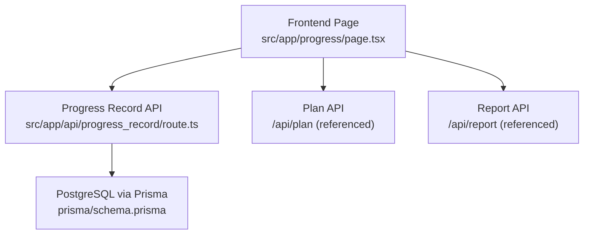
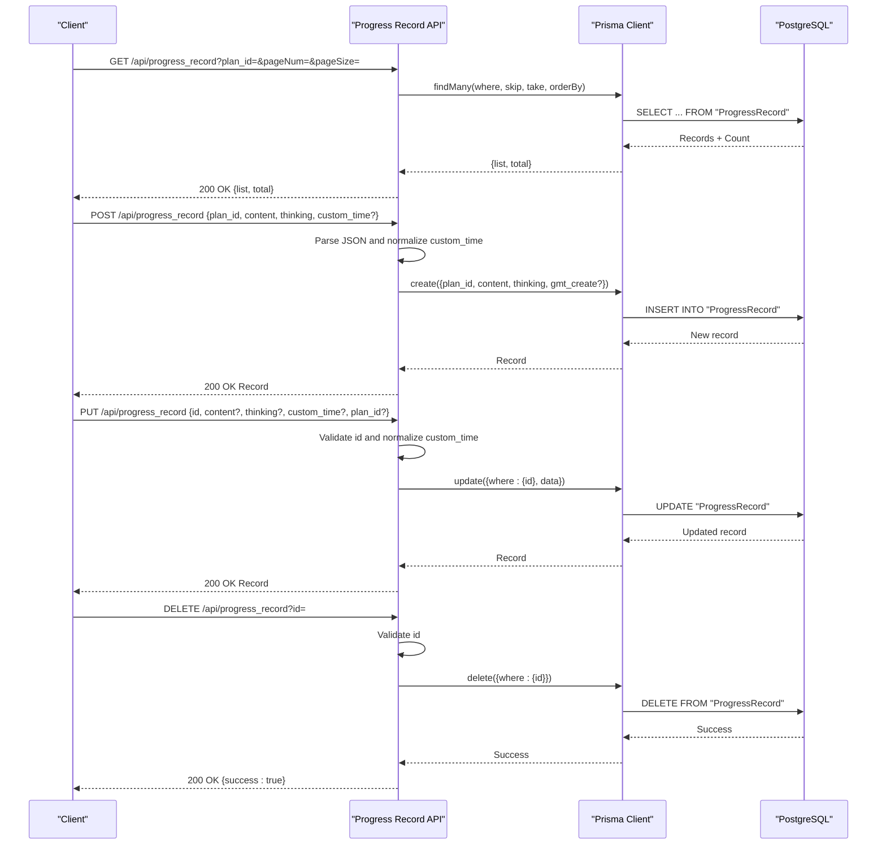
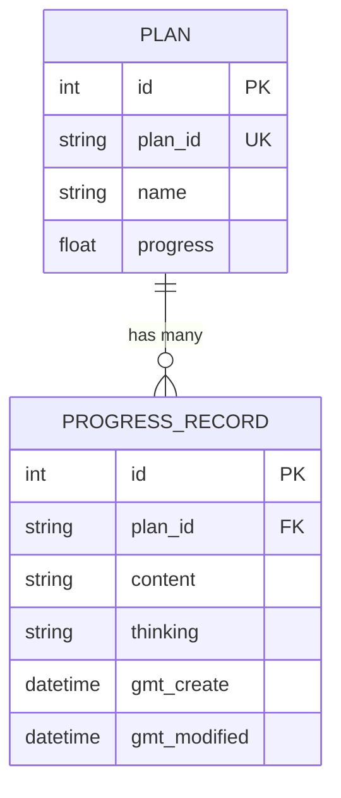
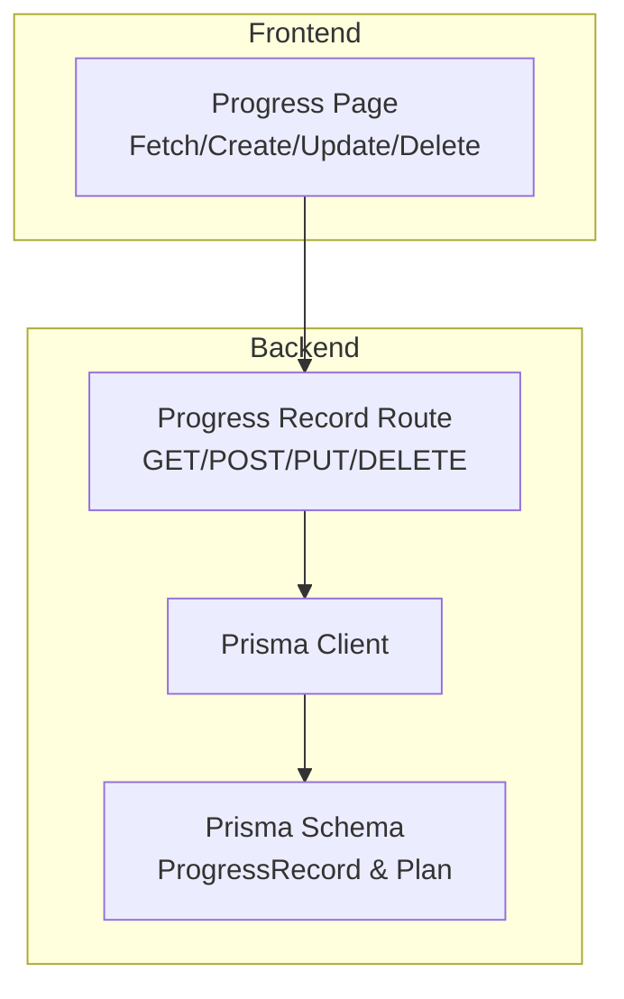

# Progress Tracking Endpoints

<cite>
**Referenced Files in This Document**
- [route.ts](file://src/app/api/progress_record/route.ts)
- [schema.prisma](file://prisma/schema.prisma)
- [page.tsx](file://src/app/progress/page.tsx)
- [recurring-utils.ts](file://src/lib/recurring-utils.ts)
- [README.md](file://README.md)
</cite>

## Table of Contents
1. [Introduction](#introduction)
2. [Project Structure](#project-structure)
3. [Core Components](#core-components)
4. [Architecture Overview](#architecture-overview)
5. [Detailed Component Analysis](#detailed-component-analysis)
6. [Dependency Analysis](#dependency-analysis)
7. [Performance Considerations](#performance-considerations)
8. [Troubleshooting Guide](#troubleshooting-guide)
9. [Conclusion](#conclusion)
10. [Appendices](#appendices)

## Introduction
This document provides comprehensive API documentation for progress tracking endpoints focused on managing progress records associated with plans. It covers:
- Retrieving progress records with pagination and plan association
- Creating progress entries with content and reflection fields
- Updating progress records with optional evidence modification and custom timestamps
- Deleting progress records
- Request/response schemas, data models, validation rules, and practical usage examples
- Progress analytics, reporting integration, and data retention considerations

The system integrates a Next.js API route for backend operations and a frontend page that consumes these endpoints to present and manage progress records.

## Project Structure
The progress tracking functionality is implemented as a Next.js API Route under the `/api/progress_record` path. The Prisma schema defines the underlying data model. The frontend page consumes these endpoints to render and edit progress records.

**Diagram sources**
- [route.ts:1-154](file://src/app/api/progress_record/route.ts#L1-L154)
- [schema.prisma:53-61](file://prisma/schema.prisma#L53-L61)
- [page.tsx:46-95](file://src/app/progress/page.tsx#L46-L95)

**Section sources**
- [route.ts:1-154](file://src/app/api/progress_record/route.ts#L1-L154)
- [schema.prisma:53-61](file://prisma/schema.prisma#L53-L61)
- [page.tsx:46-95](file://src/app/progress/page.tsx#L46-L95)

## Core Components
- ProgressRecord API Route: Implements GET, POST, PUT, and DELETE handlers for progress records.
- Prisma Model: Defines the ProgressRecord entity and its relationship to Plan.
- Frontend Integration: Fetches, displays, creates, updates, and deletes progress records.

Key capabilities:
- Filtering by plan_id
- Pagination via pageNum and pageSize
- Optional custom timestamps for historical record creation
- Content and reflection fields
- Cascading deletion tied to plan relationships

**Section sources**
- [route.ts:6-23](file://src/app/api/progress_record/route.ts#L6-L23)
- [schema.prisma:53-61](file://prisma/schema.prisma#L53-L61)
- [page.tsx:81-95](file://src/app/progress/page.tsx#L81-L95)

## Architecture Overview
The progress record endpoints follow a straightforward request-response flow with Prisma ORM handling persistence against PostgreSQL.

**Diagram sources**
- [route.ts:7-23](file://src/app/api/progress_record/route.ts#L7-L23)
- [route.ts:25-70](file://src/app/api/progress_record/route.ts#L25-L70)
- [route.ts:72-127](file://src/app/api/progress_record/route.ts#L72-L127)
- [route.ts:129-154](file://src/app/api/progress_record/route.ts#L129-L154)

## Detailed Component Analysis

### Data Model: ProgressRecord
The ProgressRecord entity stores progress entries linked to a plan. It includes metadata for creation/update timestamps and optional content and reflection fields.

**Diagram sources**
- [schema.prisma:26-42](file://prisma/schema.prisma#L26-L42)
- [schema.prisma:53-61](file://prisma/schema.prisma#L53-L61)

**Section sources**
- [schema.prisma:53-61](file://prisma/schema.prisma#L53-L61)

### Endpoint: GET /api/progress_record
Purpose: Retrieve paginated progress records, optionally filtered by plan_id. Results are ordered by creation time descending.

- Query parameters:
  - plan_id: string (optional) — filter by plan identifier
  - pageNum: number (optional, default 1) — page number
  - pageSize: number (optional, default 10) — number of records per page

- Response:
  - list: array of ProgressRecord objects
  - total: number of matching records

- Behavior:
  - Uses Prisma findMany with skip/take for pagination
  - Orders by gmt_create desc
  - Supports plan-specific filtering

**Section sources**
- [route.ts:7-23](file://src/app/api/progress_record/route.ts#L7-L23)
- [page.tsx:81-95](file://src/app/progress/page.tsx#L81-L95)

### Endpoint: POST /api/progress_record
Purpose: Create a new progress record with content and reflection, optionally setting a custom timestamp.

- Request body fields:
  - plan_id: string — required
  - content: string — optional, defaults to empty
  - thinking: string — optional, defaults to empty
  - custom_time: string — optional ISO-like or "YYYY-MM-DDTHH:mm" local time

- Processing:
  - Normalizes custom_time:
    - If length is 16 and includes "T" (e.g., "YYYY-MM-DDTHH:mm"), parses as local time
    - Otherwise treats as a standard Date-parseable string
  - If custom_time is omitted, Prisma uses @default(now())

- Response:
  - Returns the created ProgressRecord object

- Validation:
  - On error, responds with 500 and an error message

**Section sources**
- [route.ts:25-70](file://src/app/api/progress_record/route.ts#L25-L70)

### Endpoint: PUT /api/progress_record
Purpose: Update an existing progress record, supporting content/reflection updates, plan reassignment, and timestamp modification.

- Request body fields:
  - id: number — required
  - content: string — optional
  - thinking: string — optional
  - plan_id: string — optional (to move record to another plan)
  - custom_time: string — optional (same normalization rules as POST)

- Processing:
  - Validates presence of id
  - Normalizes custom_time similarly to POST
  - Updates only provided fields

- Response:
  - Returns the updated ProgressRecord object

- Validation:
  - Missing id yields 400 with an error message
  - Other errors yield 500 with an error message

**Section sources**
- [route.ts:72-127](file://src/app/api/progress_record/route.ts#L72-L127)

### Endpoint: DELETE /api/progress_record
Purpose: Remove a progress record by id.

- Query parameters:
  - id: number — required

- Behavior:
  - Validates presence of id
  - Deletes the record
  - Returns { success: true }

- Validation:
  - Missing id yields 400 with an error message
  - Other errors yield 500 with an error message

**Section sources**
- [route.ts:129-154](file://src/app/api/progress_record/route.ts#L129-L154)

### Frontend Integration Examples
The frontend page demonstrates typical usage patterns for progress records:
- Fetching records for a selected plan or all plans
- Submitting new records or updating existing ones
- Handling custom timestamps for historical entries
- Deleting records with confirmation

Representative flows:
- Fetch all records with pagination and optional search
- Fetch records for a specific plan
- Submit new record or update existing record
- Delete a record

These flows correspond to the GET/POST/PUT/DELETE endpoints documented above.

**Section sources**
- [page.tsx:52-95](file://src/app/progress/page.tsx#L52-L95)
- [page.tsx:113-174](file://src/app/progress/page.tsx#L113-L174)
- [page.tsx:204-221](file://src/app/progress/page.tsx#L204-L221)

## Dependency Analysis
The ProgressRecord API depends on Prisma for database operations and Next.js for request/response handling. The frontend depends on the API for data operations.

**Diagram sources**
- [route.ts:1-154](file://src/app/api/progress_record/route.ts#L1-L154)
- [schema.prisma:53-61](file://prisma/schema.prisma#L53-L61)
- [page.tsx:46-95](file://src/app/progress/page.tsx#L46-L95)

**Section sources**
- [route.ts:1-154](file://src/app/api/progress_record/route.ts#L1-L154)
- [schema.prisma:53-61](file://prisma/schema.prisma#L53-L61)
- [page.tsx:46-95](file://src/app/progress/page.tsx#L46-L95)

## Performance Considerations
- Pagination: The GET endpoint supports pageNum and pageSize to limit result sets and reduce payload sizes.
- Ordering: Results are ordered by creation time descending, which aligns with common UI expectations.
- Filtering: plan_id filtering reduces query scope and improves performance for plan-centric views.
- Time normalization: Parsing custom_time avoids unnecessary timezone conversions by explicitly handling local time formats.

[No sources needed since this section provides general guidance]

## Troubleshooting Guide
Common issues and resolutions:
- Missing id in PUT/DELETE: Ensure the id field is provided; otherwise, the API returns a 400 error.
- Invalid custom_time format: Provide either a standard Date-parseable string or "YYYY-MM-DDTHH:mm" for local time parsing.
- Database errors: The API catches exceptions and returns 500 with an error message; check server logs for details.
- Frontend validation: The frontend prevents submission without a plan selection in single-plan mode and shows loading states during operations.

**Section sources**
- [route.ts:78-83](file://src/app/api/progress_record/route.ts#L78-L83)
- [route.ts:135-140](file://src/app/api/progress_record/route.ts#L135-L140)
- [page.tsx:121-124](file://src/app/progress/page.tsx#L121-L124)
- [page.tsx:169-173](file://src/app/progress/page.tsx#L169-L173)

## Conclusion
The progress tracking endpoints provide a robust foundation for managing progress records with plan associations. They support essential CRUD operations, flexible filtering and pagination, and optional custom timestamps for historical entries. The frontend integrates seamlessly with these endpoints to deliver a smooth user experience for recording, reviewing, and managing progress.

[No sources needed since this section summarizes without analyzing specific files]

## Appendices

### Request/Response Schemas

- GET /api/progress_record
  - Query parameters:
    - plan_id: string (optional)
    - pageNum: number (default 1)
    - pageSize: number (default 10)
  - Response:
    - list: ProgressRecord[]
    - total: number

- POST /api/progress_record
  - Body:
    - plan_id: string
    - content: string (optional)
    - thinking: string (optional)
    - custom_time: string (optional)
  - Response:
    - ProgressRecord

- PUT /api/progress_record
  - Body:
    - id: number
    - content: string (optional)
    - thinking: string (optional)
    - plan_id: string (optional)
    - custom_time: string (optional)
  - Response:
    - ProgressRecord

- DELETE /api/progress_record
  - Query parameters:
    - id: number
  - Response:
    - { success: true }

**Section sources**
- [route.ts:7-23](file://src/app/api/progress_record/route.ts#L7-L23)
- [route.ts:25-70](file://src/app/api/progress_record/route.ts#L25-L70)
- [route.ts:72-127](file://src/app/api/progress_record/route.ts#L72-L127)
- [route.ts:129-154](file://src/app/api/progress_record/route.ts#L129-L154)

### Practical Usage Examples

- Retrieve recent progress for a specific plan:
  - GET /api/progress_record?plan_id=PLAN_ID&pageNum=1&pageSize=20

- Create a progress entry with a custom timestamp:
  - POST /api/progress_record with body containing plan_id, content, thinking, and custom_time

- Update an existing entry and move it to another plan:
  - PUT /api/progress_record with body containing id, plan_id, and optional content/thinking/custom_time

- Delete a progress entry:
  - DELETE /api/progress_record?id=ENTRY_ID

**Section sources**
- [page.tsx:81-95](file://src/app/progress/page.tsx#L81-L95)
- [page.tsx:113-174](file://src/app/progress/page.tsx#L113-L174)
- [page.tsx:204-221](file://src/app/progress/page.tsx#L204-L221)

### Progress Analytics and Reporting Integration
- Analytics: The frontend aggregates counts and displays summaries for records, enabling basic analytics at the UI level.
- Reporting: The system includes a report module that can be leveraged for generating structured reports based on progress data.
- Periodic metrics: Utilities exist to compute counts within recurring periods, which can inform periodic analytics.

**Section sources**
- [page.tsx:555-562](file://src/app/progress/page.tsx#L555-L562)
- [README.md:1-209](file://README.md#L1-L209)
- [recurring-utils.ts:73-86](file://src/lib/recurring-utils.ts#L73-L86)

### Data Retention Policies
- No explicit data retention policy is defined in the analyzed files. Implementations should define retention windows and automated cleanup procedures as part of deployment configurations.

[No sources needed since this section provides general guidance]