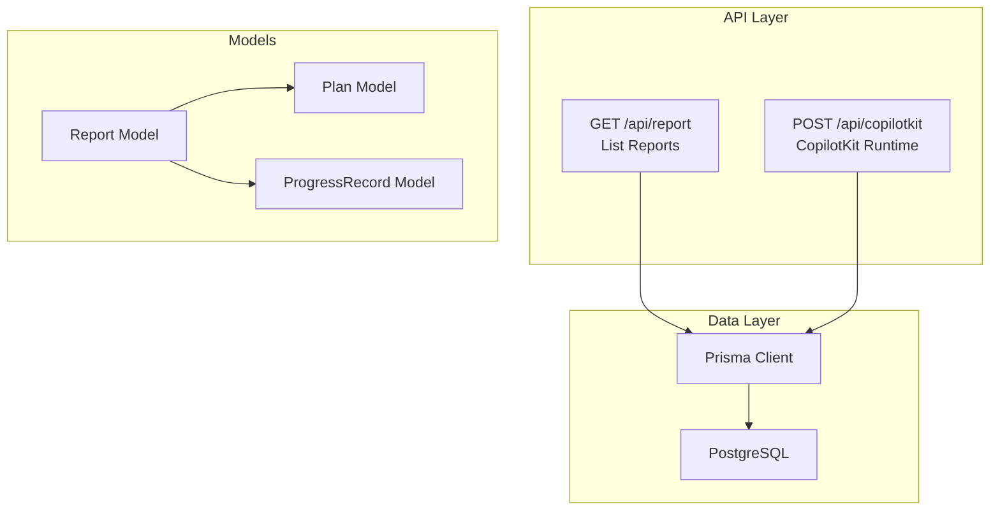
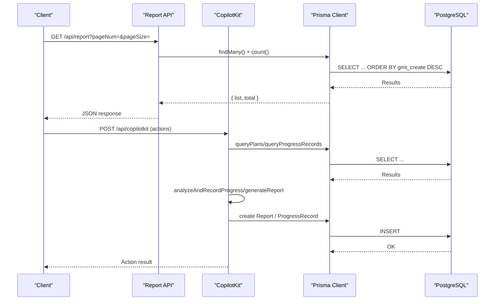
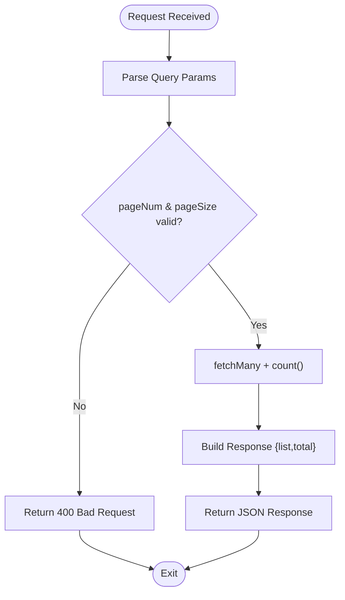
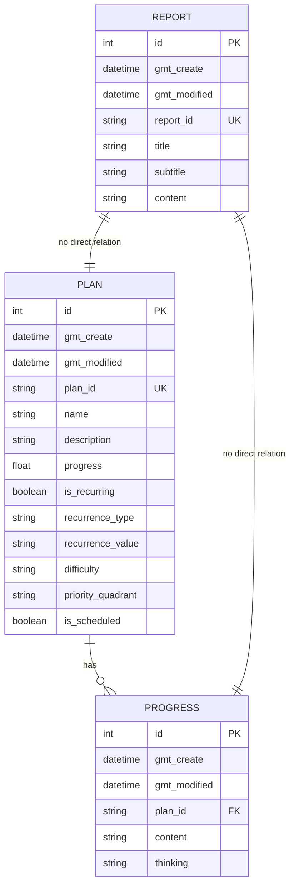
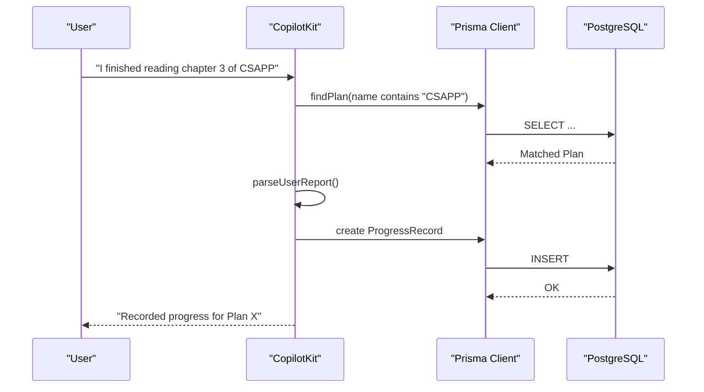
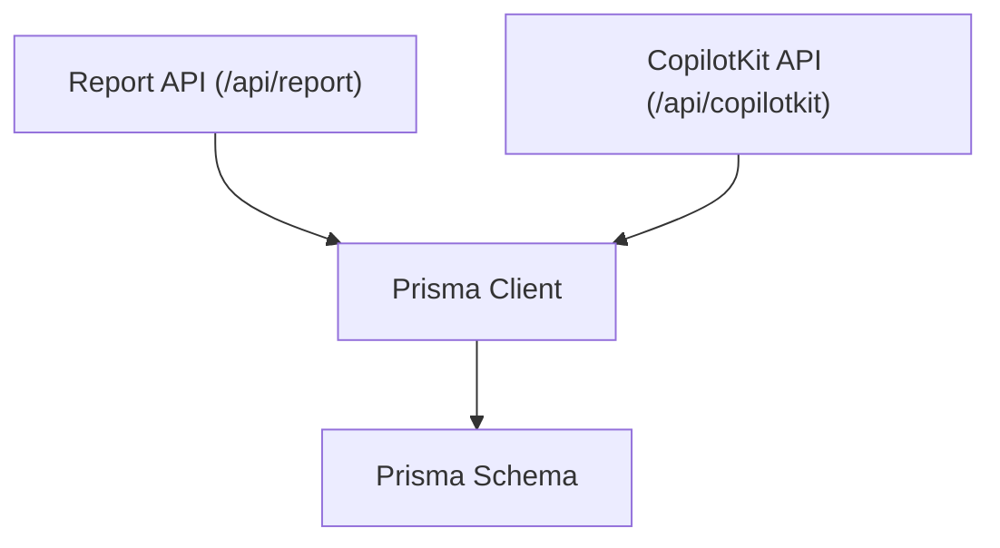

# Report Generation Endpoints

<cite>
**Referenced Files in This Document**
- [route.ts](file://src/app/api/report/route.ts)
- [schema.prisma](file://prisma/schema.prisma)
- [route.ts](file://src/app/api/copilotkit/route.ts)
- [page.tsx](file://src/app/progress/page.tsx)
- [README.md](file://README.md)
</cite>

## Table of Contents
1. [Introduction](#introduction)
2. [Project Structure](#project-structure)
3. [Core Components](#core-components)
4. [Architecture Overview](#architecture-overview)
5. [Detailed Component Analysis](#detailed-component-analysis)
6. [Dependency Analysis](#dependency-analysis)
7. [Performance Considerations](#performance-considerations)
8. [Troubleshooting Guide](#troubleshooting-guide)
9. [Conclusion](#conclusion)

## Introduction
This document provides comprehensive API documentation for report generation endpoints in the Goal Mate application. It focuses on:
- The GET /api/report endpoint for listing reports with pagination support
- Report data models and their relationships
- Report generation parameters, caching strategies, and export formats
- Request/response schemas, report templates, and practical examples
- Report scheduling, custom report creation, and integration with external systems
- Performance considerations for large datasets and report optimization techniques

Note: The current implementation exposes a basic CRUD interface for the Report entity. Advanced report generation features (e.g., automated report creation with date ranges, goal filters, and format options) are integrated via the CopilotKit action system and are not directly exposed as a dedicated endpoint.

## Project Structure
The report-related functionality is organized as follows:
- API routes under src/app/api/report/route.ts manage Report entity operations
- Data modeling is defined in prisma/schema.prisma
- Report generation capabilities are implemented as CopilotKit actions in src/app/api/copilotkit/route.ts
- Frontend pages demonstrate usage patterns for related entities (e.g., progress records)

**Diagram sources**
- [route.ts:1-48](file://src/app/api/report/route.ts#L1-L48)
- [schema.prisma:63-71](file://prisma/schema.prisma#L63-L71)
- [route.ts:1-200](file://src/app/api/copilotkit/route.ts#L1-L200)

**Section sources**
- [route.ts:1-48](file://src/app/api/report/route.ts#L1-L48)
- [schema.prisma:16-71](file://prisma/schema.prisma#L16-L71)
- [README.md:157-174](file://README.md#L157-L174)

## Core Components
This section documents the Report entity and the available API endpoints for report management.

- Report Entity Fields
  - id: Auto-incremented integer identifier
  - gmt_create: Creation timestamp
  - gmt_modified: Last modification timestamp
  - report_id: Unique string identifier
  - title: Report title
  - subtitle: Optional report subtitle
  - content: Optional report content

- Endpoints
  - GET /api/report
    - Purpose: List reports with pagination
    - Query Parameters:
      - pageNum: Page number (default: 1)
      - pageSize: Number of items per page (default: 10)
    - Response: { list: Report[], total: number }
  - POST /api/report
    - Purpose: Create a new report
    - Request Body: Partial Report fields excluding report_id
    - Response: Created Report object
  - PUT /api/report
    - Purpose: Update an existing report
    - Request Body: { report_id: string, ...rest: Partial Report }
    - Response: Updated Report object
  - DELETE /api/report?report_id={id}
    - Purpose: Delete a report by ID
    - Query Parameter: report_id (required)
    - Response: { success: boolean, message?: string }

- Data Model Relationships
  - Report is independent of Plan and ProgressRecord in the schema
  - No foreign key relationship exists between Report and other entities

**Section sources**
- [schema.prisma:63-71](file://prisma/schema.prisma#L63-L71)
- [route.ts:8-21](file://src/app/api/report/route.ts#L8-L21)
- [route.ts:24-27](file://src/app/api/report/route.ts#L24-L27)
- [route.ts:31-38](file://src/app/api/report/route.ts#L31-L38)
- [route.ts:42-47](file://src/app/api/report/route.ts#L42-L47)

## Architecture Overview
The report generation architecture integrates three primary components:
- Report Management API: CRUD operations for Report entities
- CopilotKit Actions: Automated report generation and intelligent analysis
- Data Access Layer: Prisma ORM connecting to PostgreSQL

**Diagram sources**
- [route.ts:8-21](file://src/app/api/report/route.ts#L8-L21)
- [route.ts:1200-1450](file://src/app/api/copilotkit/route.ts#L1200-L1450)
- [schema.prisma:16-71](file://prisma/schema.prisma#L16-L71)

## Detailed Component Analysis

### Report Management API
The Report API provides standard CRUD operations with pagination for listing reports.

**Diagram sources**
- [route.ts:8-21](file://src/app/api/report/route.ts#L8-L21)

Key behaviors:
- Pagination uses skip/take with descending creation timestamp ordering
- Parallel execution retrieves both list and total count
- Creation of report_id uses a deterministic UUID-based scheme

**Section sources**
- [route.ts:8-21](file://src/app/api/report/route.ts#L8-L21)
- [route.ts:24-27](file://src/app/api/report/route.ts#L24-L27)

### Report Data Models
The Report model is defined independently of Plan and ProgressRecord. Relationships:
- Report has no foreign keys to Plan or ProgressRecord
- Plan has relations to PlanTagAssociation and ProgressRecord
- ProgressRecord belongs to Plan

**Diagram sources**
- [schema.prisma:16-71](file://prisma/schema.prisma#L16-L71)

**Section sources**
- [schema.prisma:63-71](file://prisma/schema.prisma#L63-L71)

### Automated Report Generation via CopilotKit
Advanced report generation is implemented as CopilotKit actions, not as a dedicated endpoint. Key capabilities:
- analyzeAndRecordProgress: Intelligent parsing of user reports, extraction of activities, thinking, and time, and automatic creation of progress records
- Integration with plan discovery and tagging
- Natural language time parsing and record creation

**Diagram sources**
- [route.ts:1200-1450](file://src/app/api/copilotkit/route.ts#L1200-L1450)
- [schema.prisma:16-71](file://prisma/schema.prisma#L16-L71)

**Section sources**
- [route.ts:1200-1450](file://src/app/api/copilotkit/route.ts#L1200-L1450)
- [README.md:176-187](file://README.md#L176-L187)

### Practical Examples
- Listing Reports
  - Endpoint: GET /api/report?pageNum=1&pageSize=10
  - Response: { list: [Report], total: number }
- Creating a Report
  - Endpoint: POST /api/report
  - Request Body: { title, subtitle?, content? }
  - Response: Created Report object
- Updating a Report
  - Endpoint: PUT /api/report
  - Request Body: { report_id, title?, subtitle?, content? }
  - Response: Updated Report object
- Deleting a Report
  - Endpoint: DELETE /api/report?report_id={id}
  - Response: { success: boolean }

**Section sources**
- [route.ts:8-21](file://src/app/api/report/route.ts#L8-L21)
- [route.ts:24-27](file://src/app/api/report/route.ts#L24-L27)
- [route.ts:31-38](file://src/app/api/report/route.ts#L31-L38)
- [route.ts:42-47](file://src/app/api/report/route.ts#L42-L47)

## Dependency Analysis
The report system exhibits the following dependencies:
- Report API depends on Prisma Client for data access
- CopilotKit actions depend on Prisma Client for querying plans and progress records
- Report model is independent of Plan and ProgressRecord in the schema
- Frontend pages demonstrate usage patterns for related entities (e.g., progress records)

**Diagram sources**
- [route.ts:1-5](file://src/app/api/report/route.ts#L1-L5)
- [route.ts:1-11](file://src/app/api/copilotkit/route.ts#L1-L11)
- [schema.prisma:1-14](file://prisma/schema.prisma#L1-L14)

**Section sources**
- [route.ts:1-5](file://src/app/api/report/route.ts#L1-L5)
- [route.ts:1-11](file://src/app/api/copilotkit/route.ts#L1-L11)
- [schema.prisma:1-14](file://prisma/schema.prisma#L1-L14)

## Performance Considerations
- Pagination Strategy
  - Use pageNum and pageSize parameters to limit result sets
  - Apply orderBy on gmt_create for consistent ordering
- Parallel Queries
  - Combine findMany and count in parallel to reduce round trips
- Indexing Recommendations
  - Add indexes on frequently queried fields (e.g., report_id, gmt_create)
  - Consider composite indexes for complex filters
- Caching Strategies
  - Implement server-side caching for frequently accessed report lists
  - Use cache invalidation on write operations (POST/PUT/DELETE)
- Export Formats
  - Support multiple formats (JSON, CSV, PDF) based on Accept headers
  - Stream large exports to avoid memory pressure
- Large Dataset Optimization
  - Prefer cursor-based pagination for deep pagination scenarios
  - Use projections to limit returned fields for list views
  - Batch operations for bulk updates/deletes

## Troubleshooting Guide
Common issues and resolutions:
- Missing report_id in DELETE requests
  - Symptom: 400 Bad Request with message
  - Resolution: Include report_id query parameter
- Empty or invalid pagination parameters
  - Symptom: Unexpected empty results
  - Resolution: Ensure pageNum and pageSize are positive integers
- CopilotKit action failures
  - Symptom: analyzeAndRecordProgress errors
  - Resolution: Verify plan existence and natural language parsing patterns
- Database connectivity issues
  - Symptom: Prisma client errors
  - Resolution: Check DATABASE_URL environment variable and connection pool settings

**Section sources**
- [route.ts:42-47](file://src/app/api/report/route.ts#L42-L47)
- [route.ts:1200-1450](file://src/app/api/copilotkit/route.ts#L1200-L1450)

## Conclusion
The Goal Mate report system provides a solid foundation for report management with:
- A straightforward CRUD API for Report entities
- Independent data models that can evolve separately from plans and progress records
- Advanced automated report generation capabilities through CopilotKit actions
- Clear extension points for adding scheduling, filtering, and export features

Future enhancements could include:
- Dedicated report generation endpoint with date range and filter parameters
- Built-in caching and export format support
- Scheduled report generation and delivery mechanisms
- Enhanced analytics and trend analysis within report content