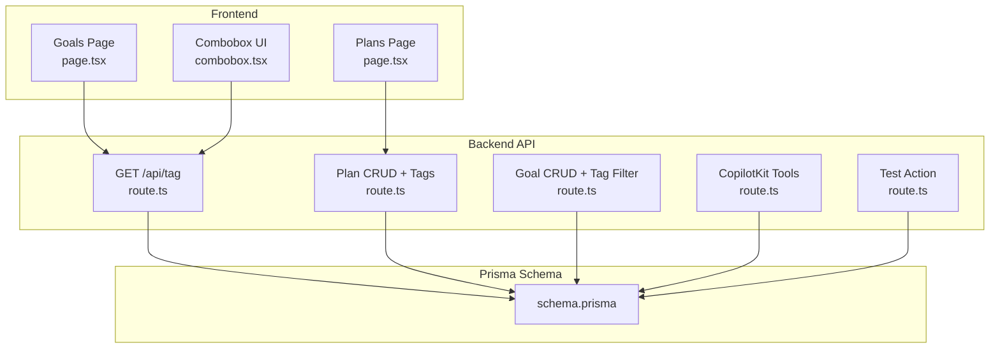
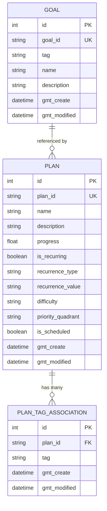
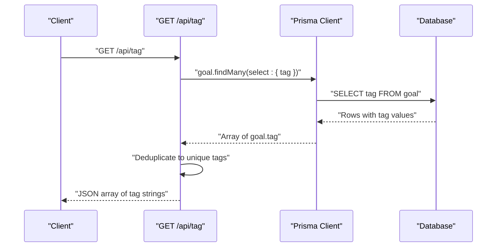
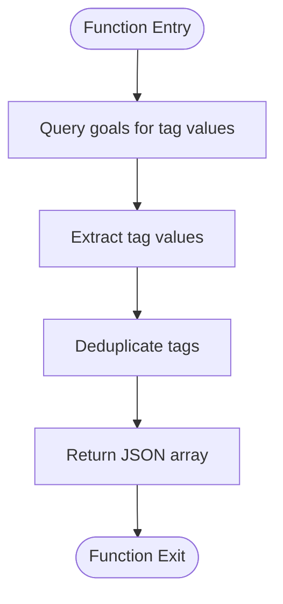
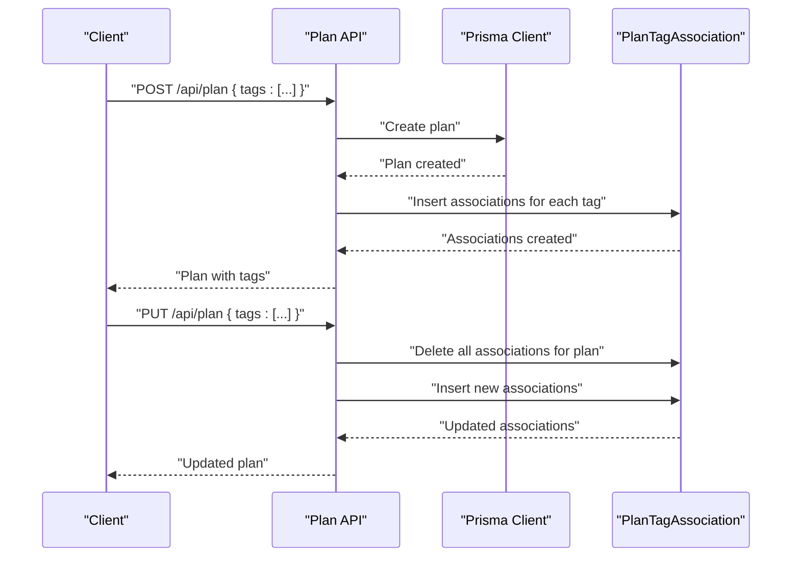
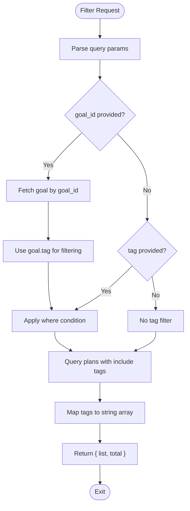
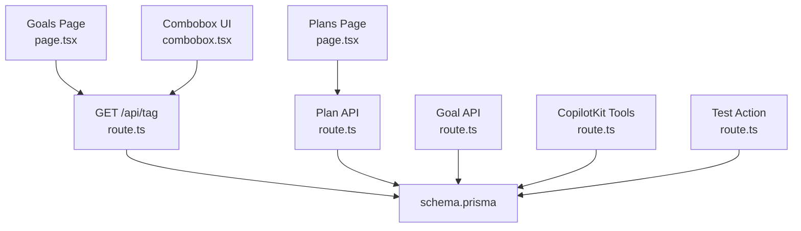

# Tag Management Endpoints

<cite>
**Referenced Files in This Document**
- [route.ts](file://src/app/api/tag/route.ts)
- [schema.prisma](file://prisma/schema.prisma)
- [route.ts](file://src/app/api/plan/route.ts)
- [route.ts](file://src/app/api/goal/route.ts)
- [route.ts](file://src/app/api/copilotkit/route.ts)
- [page.tsx](file://src/app/goals/page.tsx)
- [page.tsx](file://src/app/plans/page.tsx)
- [combobox.tsx](file://src/components/ui/combobox.tsx)
- [route.ts](file://src/app/api/test-action/route.ts)
</cite>

## Table of Contents
1. [Introduction](#introduction)
2. [Project Structure](#project-structure)
3. [Core Components](#core-components)
4. [Architecture Overview](#architecture-overview)
5. [Detailed Component Analysis](#detailed-component-analysis)
6. [Dependency Analysis](#dependency-analysis)
7. [Performance Considerations](#performance-considerations)
8. [Troubleshooting Guide](#troubleshooting-guide)
9. [Conclusion](#conclusion)

## Introduction
This document provides comprehensive API documentation for tag management in the Goal Mate application. It covers:
- Retrieving available tags and tag statistics via the GET /api/tag endpoint
- Tag creation, update, and deletion workflows (including validation and constraints)
- Tag associations with goals and plans, including many-to-many relationships
- Request/response schemas, tag data models, and practical examples
- Tag naming conventions, hierarchical tagging considerations, and tag-based filtering
- Tag analytics, usage patterns, and integration with search functionality

## Project Structure
The tag management functionality spans backend API routes, Prisma schema definitions, and frontend components:
- Backend API routes expose endpoints for retrieving tags and managing plans/goals that use tags
- Prisma schema defines the tag model and many-to-many relationship between plans and tags
- Frontend pages and components integrate tag selection and filtering

**Diagram sources**
- [route.ts:1-11](file://src/app/api/tag/route.ts#L1-L11)
- [route.ts:1-114](file://src/app/api/plan/route.ts#L1-L114)
- [route.ts:1-51](file://src/app/api/goal/route.ts#L1-L51)
- [route.ts:483-518](file://src/app/api/copilotkit/route.ts#L483-L518)
- [route.ts:1-29](file://src/app/api/test-action/route.ts#L1-L29)
- [schema.prisma:16-51](file://prisma/schema.prisma#L16-L51)
- [page.tsx:38-91](file://src/app/goals/page.tsx#L38-L91)
- [page.tsx:575-617](file://src/app/plans/page.tsx#L575-L617)
- [combobox.tsx:1-75](file://src/components/ui/combobox.tsx#L1-L75)

**Section sources**
- [route.ts:1-11](file://src/app/api/tag/route.ts#L1-L11)
- [schema.prisma:16-51](file://prisma/schema.prisma#L16-L51)
- [page.tsx:38-91](file://src/app/goals/page.tsx#L38-L91)

## Core Components
- Tag retrieval endpoint: GET /api/tag returns a flat array of tag strings currently used in the system
- Plan endpoint: Supports tag-based filtering and manages many-to-many associations via a dedicated association table
- Goal endpoint: Supports tag-based filtering and maintains a single tag per goal
- CopilotKit integration: Provides system options including existing tags for plan creation
- Frontend integration: Combobox and multi-select components enable tag selection and filtering

Key capabilities:
- Retrieve available tags for UI population
- Filter goals and plans by tag
- Associate multiple tags with plans
- Create/update plans with tag arrays
- Use tags for analytics and search

**Section sources**
- [route.ts:6-11](file://src/app/api/tag/route.ts#L6-L11)
- [route.ts:7-67](file://src/app/api/plan/route.ts#L7-L67)
- [route.ts:7-24](file://src/app/api/goal/route.ts#L7-L24)
- [route.ts:483-518](file://src/app/api/copilotkit/route.ts#L483-L518)
- [combobox.tsx:14-75](file://src/components/ui/combobox.tsx#L14-L75)

## Architecture Overview
The tag architecture consists of:
- A simple tag field on goals
- A many-to-many relationship between plans and tags via an association table
- Frontend components that populate tag options and apply filters

**Diagram sources**
- [schema.prisma:16-51](file://prisma/schema.prisma#L16-L51)

## Detailed Component Analysis

### GET /api/tag
Purpose:
- Retrieve all unique tag values currently used in the system

Behavior:
- Queries goals for tag values and deduplicates them into a flat array
- Returns an array of strings representing available tags

Request:
- Method: GET
- Path: /api/tag
- Query parameters: none

Response:
- Status: 200 OK
- Body: Array of strings (tag names)

Example:
- Request: GET /api/tag
- Response: ["study", "workout", "reading"]

Notes:
- This endpoint does not compute tag statistics; it simply lists tags in use
- For analytics, use plan-level queries that include tag counts

**Section sources**
- [route.ts:6-11](file://src/app/api/tag/route.ts#L6-L11)

### Tag Association Model
Relationships:
- Goals: Single tag field
- Plans: Many tags via association table
- Association table: Links plan_id to tag

Constraints:
- PlanTagAssociation.plan_id references Plan.plan_id with cascade delete
- No unique constraint prevents duplicate plan-tag entries; duplicates are allowed

Frontend integration:
- Combobox supports creating new tags by pressing Enter when input is not yet an option
- Multi-select filter allows selecting multiple tags for plan filtering

**Section sources**
- [schema.prisma:16-51](file://prisma/schema.prisma#L16-L51)
- [combobox.tsx:44-59](file://src/components/ui/combobox.tsx#L44-L59)
- [page.tsx:575-617](file://src/app/plans/page.tsx#L575-L617)

### Plan Tag Filtering and Management
Filtering:
- GET /api/plan supports tag parameter to filter plans by tag
- When goal_id is provided, the associated goal’s tag is used to filter plans
- Results include a tags property as an array of strings

Creation:
- POST /api/plan accepts a tags array; creates plan and then inserts associations

Update:
- PUT /api/plan accepts a tags array; deletes existing associations and recreates them

Deletion:
- DELETE /api/plan removes a plan and cascades to associations

Validation:
- No explicit server-side validation for tag uniqueness or format
- Frontend can prevent duplicates via UI controls

**Section sources**
- [route.ts:7-67](file://src/app/api/plan/route.ts#L7-L67)
- [route.ts:69-105](file://src/app/api/plan/route.ts#L69-L105)

### Goal Tag Filtering
Filtering:
- GET /api/goal supports tag parameter to filter goals by tag
- Pagination supported via pageNum and pageSize

Response:
- Returns list and total count

**Section sources**
- [route.ts:7-24](file://src/app/api/goal/route.ts#L7-L24)

### Tag-Based Filtering Across the Application
- Goals page: Single-tag filter via Select dropdown populated from GET /api/tag
- Plans page: Multi-tag filter via chips and Select dropdown; also integrates with other filters (difficulty, priority quadrant, scheduled status)

Search integration:
- CopilotKit tools include tag-based filtering and search across plans
- System options endpoint returns existing tags for plan creation guidance

**Section sources**
- [page.tsx:164-192](file://src/app/goals/page.tsx#L164-L192)
- [page.tsx:575-617](file://src/app/plans/page.tsx#L575-L617)
- [route.ts:483-518](file://src/app/api/copilotkit/route.ts#L483-L518)

### Tag Analytics and Usage Patterns
Current capabilities:
- GET /api/tag returns available tags
- Plan queries include tags in response for downstream analytics
- Test action demonstrates querying plans with tags for inspection

Analytics ideas (not implemented):
- Count occurrences of each tag across plans/goals
- Aggregate tag usage by time periods
- Compute tag popularity metrics

**Section sources**
- [route.ts:6-11](file://src/app/api/tag/route.ts#L6-L11)
- [route.ts:41-66](file://src/app/api/plan/route.ts#L41-L66)
- [route.ts:13-29](file://src/app/api/test-action/route.ts#L13-L29)

### Tag Naming Conventions and Hierarchical Tagging
Naming conventions:
- No enforced naming convention in the schema or API
- Frontend combobox allows creating new tags by typing and pressing Enter
- Suggested convention: lowercase, hyphenated words (e.g., "self-improvement")

Hierarchical tagging:
- Not modeled in the schema; no parent-child relationship exists
- To implement hierarchy, introduce a hierarchical tag model with self-referencing relationships

**Section sources**
- [combobox.tsx:44-59](file://src/components/ui/combobox.tsx#L44-L59)
- [schema.prisma:16-51](file://prisma/schema.prisma#L16-L51)

### Practical Examples

#### Example 1: Retrieve Available Tags
- Endpoint: GET /api/tag
- Expected response: Array of strings (e.g., ["study", "workout"])

#### Example 2: Filter Goals by Tag
- Endpoint: GET /api/goal?tag=study&pageNum=1&pageSize=10
- Response: { list: [...], total: number }

#### Example 3: Filter Plans by Tag
- Endpoint: GET /api/plan?tag=workout&pageNum=1&pageSize=10
- Response: { list: [{ ..., tags: ["workout"] }], total: number }

#### Example 4: Create a Plan with Tags
- Endpoint: POST /api/plan
- Request body:
  - name: string
  - description: string
  - tags: string[]
- Response: Plan object with tags included

#### Example 5: Update a Plan's Tags
- Endpoint: PUT /api/plan
- Request body:
  - plan_id: string
  - tags: string[] (replaces previous associations)
- Response: Updated Plan object

#### Example 6: Get System Options (Existing Tags)
- Tool: getSystemOptions (via CopilotKit)
- Returns existing tags and standard difficulty options for plan creation guidance

**Section sources**
- [route.ts:6-11](file://src/app/api/tag/route.ts#L6-L11)
- [route.ts:7-24](file://src/app/api/goal/route.ts#L7-L24)
- [route.ts:7-67](file://src/app/api/plan/route.ts#L7-L67)
- [route.ts:69-105](file://src/app/api/plan/route.ts#L69-L105)
- [route.ts:483-518](file://src/app/api/copilotkit/route.ts#L483-L518)

## Architecture Overview

**Diagram sources**
- [route.ts:6-11](file://src/app/api/tag/route.ts#L6-L11)

## Detailed Component Analysis

### Tag Retrieval Flow

**Diagram sources**
- [route.ts:6-11](file://src/app/api/tag/route.ts#L6-L11)

### Plan Tag Association Flow

**Diagram sources**
- [route.ts:69-105](file://src/app/api/plan/route.ts#L69-L105)

### Tag Filtering Flow

**Diagram sources**
- [route.ts:7-67](file://src/app/api/plan/route.ts#L7-L67)

## Dependency Analysis

**Diagram sources**
- [route.ts:1-11](file://src/app/api/tag/route.ts#L1-L11)
- [route.ts:1-114](file://src/app/api/plan/route.ts#L1-L114)
- [route.ts:1-51](file://src/app/api/goal/route.ts#L1-L51)
- [route.ts:483-518](file://src/app/api/copilotkit/route.ts#L483-L518)
- [route.ts:1-29](file://src/app/api/test-action/route.ts#L1-L29)
- [schema.prisma:16-51](file://prisma/schema.prisma#L16-L51)
- [page.tsx:38-91](file://src/app/goals/page.tsx#L38-L91)
- [page.tsx:575-617](file://src/app/plans/page.tsx#L575-L617)
- [combobox.tsx:1-75](file://src/components/ui/combobox.tsx#L1-L75)

**Section sources**
- [schema.prisma:16-51](file://prisma/schema.prisma#L16-L51)
- [route.ts:7-67](file://src/app/api/plan/route.ts#L7-L67)
- [route.ts:7-24](file://src/app/api/goal/route.ts#L7-L24)
- [route.ts:6-11](file://src/app/api/tag/route.ts#L6-L11)

## Performance Considerations
- GET /api/tag performs a simple select on the goal table and deduplication in memory; suitable for small to medium datasets
- Plan filtering by tag uses a relation query; ensure appropriate indexing on tag fields for large datasets
- Creating/updating plan tags involves deleting and re-inserting associations; batching operations can reduce overhead
- Frontend filtering is client-side; for very large tag sets, consider server-side pagination and search

## Troubleshooting Guide
Common issues and resolutions:
- Empty tag list: Verify goals exist and have non-empty tag values
- Duplicate tags in UI: The association table allows duplicates; consider deduplicating at insertion time
- Filtering not working: Ensure tag parameter is passed correctly and matches existing tag values
- Creating new tags: Use the combobox to type and press Enter to create a new tag option

**Section sources**
- [route.ts:6-11](file://src/app/api/tag/route.ts#L6-L11)
- [combobox.tsx:44-59](file://src/components/ui/combobox.tsx#L44-L59)
- [route.ts:98-103](file://src/app/api/plan/route.ts#L98-L103)

## Conclusion
The tag management system provides a straightforward mechanism for associating tags with goals and plans. While the current implementation focuses on simple tag retrieval and filtering, it lays the foundation for richer analytics and hierarchical tagging. By leveraging the existing many-to-many relationship and integrating with frontend components, applications can build robust tag-based workflows for discovery, filtering, and reporting.