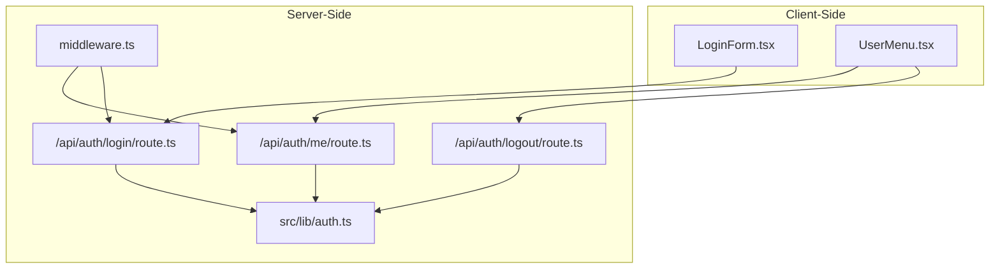
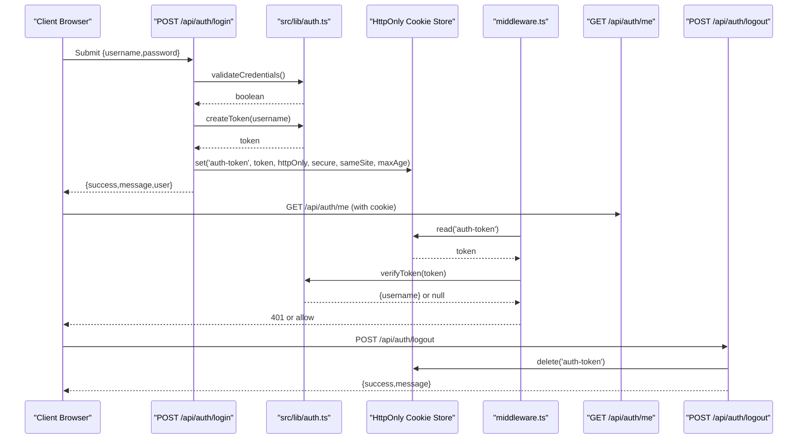
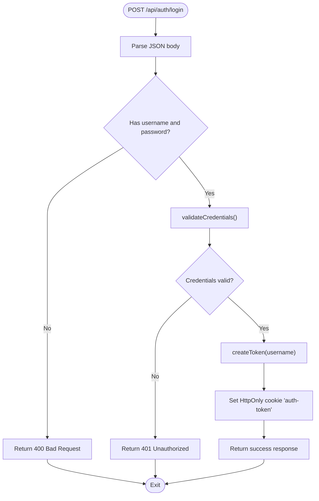
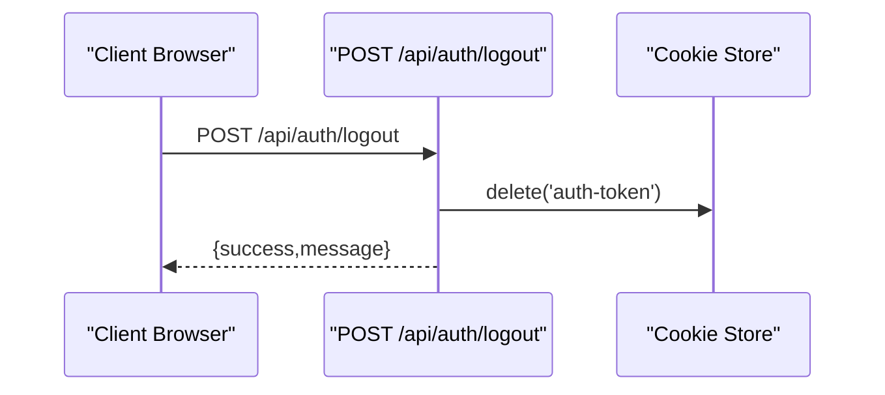
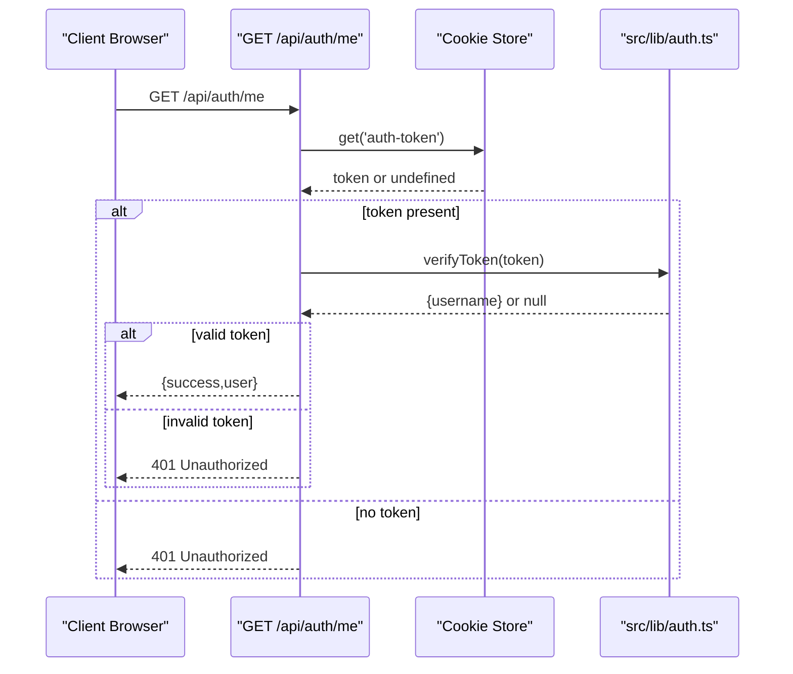
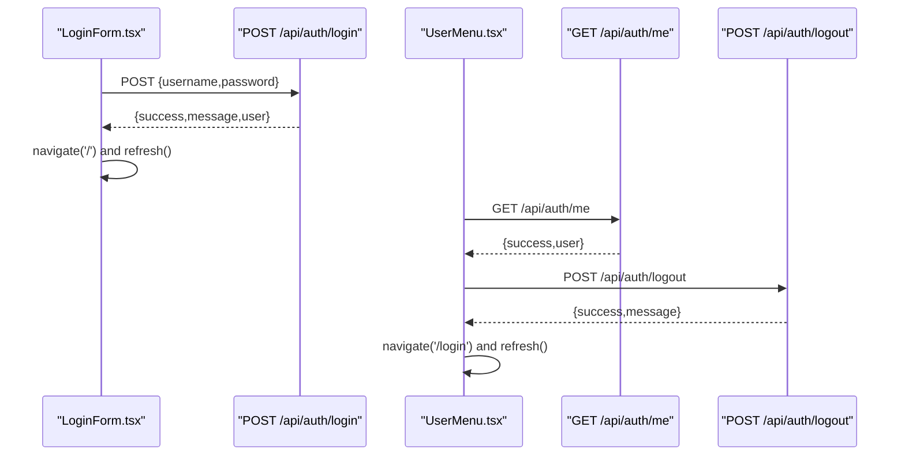
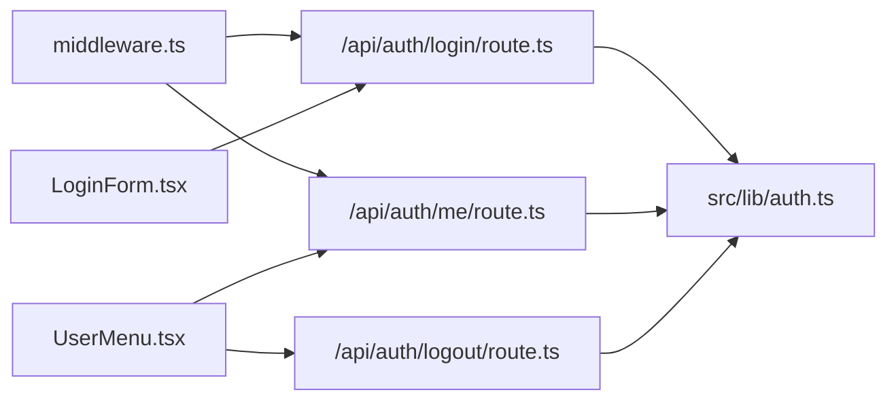

# API Authentication Endpoints

<cite>
**Referenced Files in This Document**
- [src/app/api/auth/login/route.ts](file://src/app/api/auth/login/route.ts)
- [src/app/api/auth/logout/route.ts](file://src/app/api/auth/logout/route.ts)
- [src/app/api/auth/me/route.ts](file://src/app/api/auth/me/route.ts)
- [src/lib/auth.ts](file://src/lib/auth.ts)
- [middleware.ts](file://middleware.ts)
- [src/components/LoginForm.tsx](file://src/components/LoginForm.tsx)
- [src/components/UserMenu.tsx](file://src/components/UserMenu.tsx)
- [AUTHENTICATION.md](file://AUTHENTICATION.md)
- [package.json](file://package.json)
</cite>

## Table of Contents
1. [Introduction](#introduction)
2. [Project Structure](#project-structure)
3. [Core Components](#core-components)
4. [Architecture Overview](#architecture-overview)
5. [Detailed Component Analysis](#detailed-component-analysis)
6. [Dependency Analysis](#dependency-analysis)
7. [Performance Considerations](#performance-considerations)
8. [Troubleshooting Guide](#troubleshooting-guide)
9. [Conclusion](#conclusion)

## Introduction
This document provides comprehensive API documentation for the authentication endpoints in the Goal-Mate application. It covers the login, logout, and user information retrieval endpoints, detailing request/response schemas, authentication requirements, error handling, and security considerations. Practical client-side implementation examples, token storage, and session management guidance are included, along with common integration patterns and troubleshooting tips.

## Project Structure
The authentication system is implemented using Next.js App Router API routes and shared authentication utilities. The key components are:
- Login endpoint: Validates credentials, generates a JWT, and sets an HttpOnly cookie
- Logout endpoint: Removes the authentication cookie
- Me endpoint: Retrieves the current user based on the cookie token
- Shared authentication utilities: JWT creation, verification, credential validation, and user extraction
- Middleware: Protects routes and API endpoints by checking the presence of the authentication cookie

**Diagram sources**
- [src/components/LoginForm.tsx](file://src/components/LoginForm.tsx)
- [src/components/UserMenu.tsx](file://src/components/UserMenu.tsx)
- [src/app/api/auth/login/route.ts](file://src/app/api/auth/login/route.ts)
- [src/app/api/auth/logout/route.ts](file://src/app/api/auth/logout/route.ts)
- [src/app/api/auth/me/route.ts](file://src/app/api/auth/me/route.ts)
- [src/lib/auth.ts](file://src/lib/auth.ts)
- [middleware.ts](file://middleware.ts)

**Section sources**
- [AUTHENTICATION.md](file://AUTHENTICATION.md)
- [src/app/api/auth/login/route.ts](file://src/app/api/auth/login/route.ts)
- [src/app/api/auth/logout/route.ts](file://src/app/api/auth/logout/route.ts)
- [src/app/api/auth/me/route.ts](file://src/app/api/auth/me/route.ts)
- [src/lib/auth.ts](file://src/lib/auth.ts)
- [middleware.ts](file://middleware.ts)

## Core Components
- Authentication utilities (JWT creation, verification, credential validation, current user extraction)
- Login API route (credential validation, token generation, cookie setting)
- Logout API route (cookie deletion)
- Me API route (current user retrieval)
- Middleware protection for pages and API routes
- Client-side components for login and user menu

Key responsibilities:
- Validate credentials against environment variables
- Generate signed JWT tokens with expiration
- Store tokens in HttpOnly cookies for XSS protection
- Verify tokens server-side and extract user identity
- Protect routes and API endpoints via middleware

**Section sources**
- [src/lib/auth.ts](file://src/lib/auth.ts)
- [src/app/api/auth/login/route.ts](file://src/app/api/auth/login/route.ts)
- [src/app/api/auth/logout/route.ts](file://src/app/api/auth/logout/route.ts)
- [src/app/api/auth/me/route.ts](file://src/app/api/auth/me/route.ts)
- [middleware.ts](file://middleware.ts)

## Architecture Overview
The authentication flow integrates client-side components with server-side API routes and middleware protection. The client submits credentials to the login endpoint, receives a signed JWT stored in an HttpOnly cookie, and uses subsequent requests to protected endpoints. The middleware enforces authentication for pages and API routes by checking the presence of the cookie.

**Diagram sources**
- [src/app/api/auth/login/route.ts](file://src/app/api/auth/login/route.ts)
- [src/app/api/auth/logout/route.ts](file://src/app/api/auth/logout/route.ts)
- [src/app/api/auth/me/route.ts](file://src/app/api/auth/me/route.ts)
- [src/lib/auth.ts](file://src/lib/auth.ts)
- [middleware.ts](file://middleware.ts)

## Detailed Component Analysis

### Login Endpoint
- Path: POST /api/auth/login
- Purpose: Authenticate user credentials, generate a JWT, and set an HttpOnly cookie
- Request body:
  - username: string (required)
  - password: string (required)
- Response body:
  - success: boolean
  - message: string
  - user: object containing username
- Authentication requirements:
  - Requires username and password in request body
  - Credentials validated against environment variables
- Security considerations:
  - HttpOnly cookie prevents client-side script access
  - Secure flag enabled in production
  - SameSite configured for CSRF protection
  - Token expiration set to 7 days
- Error handling:
  - 400 Bad Request: Missing username or password
  - 401 Unauthorized: Invalid credentials
  - 500 Internal Server Error: Unexpected errors during login

**Diagram sources**
- [src/app/api/auth/login/route.ts](file://src/app/api/auth/login/route.ts)
- [src/lib/auth.ts](file://src/lib/auth.ts)

**Section sources**
- [src/app/api/auth/login/route.ts](file://src/app/api/auth/login/route.ts)
- [src/lib/auth.ts](file://src/lib/auth.ts)

### Logout Endpoint
- Path: POST /api/auth/logout
- Purpose: Remove the authentication cookie to invalidate the session
- Request body: None
- Response body:
  - success: boolean
  - message: string
- Authentication requirements:
  - No authentication required to log out
- Security considerations:
  - Deleting the cookie removes the token from the browser
- Error handling:
  - 500 Internal Server Error: Unexpected errors during logout

**Diagram sources**
- [src/app/api/auth/logout/route.ts](file://src/app/api/auth/logout/route.ts)

**Section sources**
- [src/app/api/auth/logout/route.ts](file://src/app/api/auth/logout/route.ts)

### Me Endpoint
- Path: GET /api/auth/me
- Purpose: Retrieve the current authenticated user
- Request headers: Authorization cookie (HttpOnly)
- Response body:
  - success: boolean
  - user: object containing username
- Authentication requirements:
  - Requires a valid token present in the cookie
- Security considerations:
  - Token verification performed server-side
- Error handling:
  - 401 Unauthorized: No token or invalid token
  - 500 Internal Server Error: Unexpected errors while fetching user

**Diagram sources**
- [src/app/api/auth/me/route.ts](file://src/app/api/auth/me/route.ts)
- [src/lib/auth.ts](file://src/lib/auth.ts)

**Section sources**
- [src/app/api/auth/me/route.ts](file://src/app/api/auth/me/route.ts)
- [src/lib/auth.ts](file://src/lib/auth.ts)

### Client-Side Implementation Examples
- Login form submission:
  - Fetches POST /api/auth/login with JSON body
  - On success, navigates to home and refreshes
  - On failure, displays error message
- User menu:
  - Fetches GET /api/auth/me on mount to show current user
  - Calls POST /api/auth/logout to sign out
  - Redirects to login and refreshes on successful logout

**Diagram sources**
- [src/components/LoginForm.tsx](file://src/components/LoginForm.tsx)
- [src/components/UserMenu.tsx](file://src/components/UserMenu.tsx)
- [src/app/api/auth/login/route.ts](file://src/app/api/auth/login/route.ts)
- [src/app/api/auth/me/route.ts](file://src/app/api/auth/me/route.ts)
- [src/app/api/auth/logout/route.ts](file://src/app/api/auth/logout/route.ts)

**Section sources**
- [src/components/LoginForm.tsx](file://src/components/LoginForm.tsx)
- [src/components/UserMenu.tsx](file://src/components/UserMenu.tsx)

## Dependency Analysis
The authentication endpoints depend on shared utilities for JWT operations and environment-based configuration. The middleware enforces authentication across pages and API routes by checking the presence of the cookie.

**Diagram sources**
- [src/app/api/auth/login/route.ts](file://src/app/api/auth/login/route.ts)
- [src/app/api/auth/logout/route.ts](file://src/app/api/auth/logout/route.ts)
- [src/app/api/auth/me/route.ts](file://src/app/api/auth/me/route.ts)
- [src/lib/auth.ts](file://src/lib/auth.ts)
- [middleware.ts](file://middleware.ts)
- [src/components/LoginForm.tsx](file://src/components/LoginForm.tsx)
- [src/components/UserMenu.tsx](file://src/components/UserMenu.tsx)

**Section sources**
- [src/lib/auth.ts](file://src/lib/auth.ts)
- [middleware.ts](file://middleware.ts)
- [package.json](file://package.json)

## Performance Considerations
- Token expiration: 7-day expiration reduces long-term risk but requires periodic re-authentication
- Cookie attributes: HttpOnly, secure, and sameSite help prevent XSS and CSRF attacks
- Environment-based configuration: Avoids hardcoding secrets and enables deployment flexibility
- Middleware checks: Minimal overhead by verifying only token presence for page protection

## Troubleshooting Guide
Common issues and resolutions:
- Login fails with 400 or 401:
  - Verify username and password are provided and correct
  - Confirm environment variables AUTH_USERNAME, AUTH_PASSWORD, and AUTH_SECRET are set
- Session expires unexpectedly:
  - Check AUTH_SECRET configuration and ensure it meets length requirements
  - Re-login to obtain a new token
- API returns 401 Unauthorized:
  - Ensure the HttpOnly cookie 'auth-token' is present and not expired
  - Verify middleware is functioning and not blocking legitimate requests
- Logout does not work:
  - Confirm POST /api/auth/logout is called and cookie deletion succeeds
  - Clear browser cache and cookies if necessary

Environment variable requirements:
- AUTH_USERNAME: Login username
- AUTH_PASSWORD: Login password
- AUTH_SECRET: JWT signing secret (minimum 32 characters)

Security recommendations:
- Use HTTPS in production to protect cookie transmission
- Regularly rotate AUTH_SECRET to mitigate token compromise risks
- Monitor logs for authentication errors and suspicious activity

**Section sources**
- [AUTHENTICATION.md](file://AUTHENTICATION.md)
- [src/lib/auth.ts](file://src/lib/auth.ts)
- [middleware.ts](file://middleware.ts)

## Conclusion
The Goal-Mate authentication system provides a straightforward, secure mechanism for user login, session management via HttpOnly cookies, and user information retrieval. By leveraging JWT tokens and environment-based configuration, the system balances simplicity with security. Following the documented endpoints, schemas, and troubleshooting steps ensures reliable integration and operation across development and production environments.