# Authentication System

<cite>
**Referenced Files in This Document**
- [src/lib/auth.ts](file://src/lib/auth.ts)
- [src/app/api/auth/login/route.ts](file://src/app/api/auth/login/route.ts)
- [src/app/api/auth/logout/route.ts](file://src/app/api/auth/logout/route.ts)
- [src/app/api/auth/me/route.ts](file://src/app/api/auth/me/route.ts)
- [middleware.ts](file://middleware.ts)
- [src/components/AuthGuard.tsx](file://src/components/AuthGuard.tsx)
- [src/components/LoginForm.tsx](file://src/components/LoginForm.tsx)
- [src/components/UserMenu.tsx](file://src/components/UserMenu.tsx)
- [src/app/login/page.tsx](file://src/app/login/page.tsx)
- [AUTHENTICATION.md](file://AUTHENTICATION.md)
- [ENV_TEMPLATE.md](file://ENV_TEMPLATE.md)
- [package.json](file://package.json)
</cite>

## Table of Contents
1. [Introduction](#introduction)
2. [Project Structure](#project-structure)
3. [Core Components](#core-components)
4. [Architecture Overview](#architecture-overview)
5. [Detailed Component Analysis](#detailed-component-analysis)
6. [Dependency Analysis](#dependency-analysis)
7. [Performance Considerations](#performance-considerations)
8. [Security Considerations](#security-considerations)
9. [Practical Authentication Flows](#practical-authentication-flows)
10. [Troubleshooting Guide](#troubleshooting-guide)
11. [Conclusion](#conclusion)

## Introduction
This document explains the JWT-based authentication system used in the application. It covers how credentials are verified, how tokens are generated and stored in HttpOnly cookies, how middleware enforces protection, and how routes are secured. It also documents the login and logout workflows, token validation, session management, and practical examples for developers and administrators. Security considerations such as secret key management, token expiration, and CSRF protection are addressed, along with common issues and debugging techniques.

## Project Structure
The authentication system is organized around a small set of backend API endpoints, a shared authentication library, and frontend components that integrate with the middleware and Next.js routing.

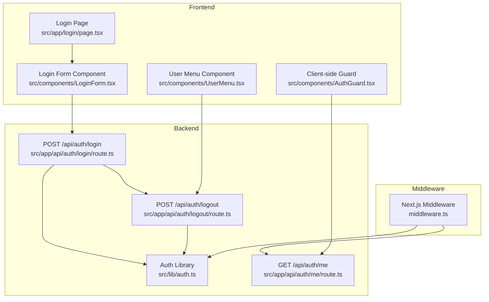

**Diagram sources**
- [src/app/login/page.tsx:1-12](file://src/app/login/page.tsx#L1-L12)
- [src/components/LoginForm.tsx:1-98](file://src/components/LoginForm.tsx#L1-L98)
- [src/components/UserMenu.tsx:1-104](file://src/components/UserMenu.tsx#L1-L104)
- [src/components/AuthGuard.tsx:1-53](file://src/components/AuthGuard.tsx#L1-L53)
- [middleware.ts:1-40](file://middleware.ts#L1-L40)
- [src/lib/auth.ts:1-69](file://src/lib/auth.ts#L1-L69)
- [src/app/api/auth/login/route.ts:1-50](file://src/app/api/auth/login/route.ts#L1-L50)
- [src/app/api/auth/logout/route.ts:1-23](file://src/app/api/auth/logout/route.ts#L1-L23)
- [src/app/api/auth/me/route.ts:1-27](file://src/app/api/auth/me/route.ts#L1-L27)

**Section sources**
- [AUTHENTICATION.md:68-85](file://AUTHENTICATION.md#L68-L85)
- [package.json:16-40](file://package.json#L16-L40)

## Core Components
- Authentication library (JWT utilities and credential validation):
  - Token creation with expiration
  - Token verification
  - Credential validation against environment variables
  - Current user retrieval via cookie
- API endpoints:
  - POST /api/auth/login: validates credentials, creates token, sets HttpOnly cookie
  - POST /api/auth/logout: deletes the auth cookie
  - GET /api/auth/me: returns current user if authenticated
- Middleware:
  - Enforces authentication for non-static and non-public routes
  - Redirects unauthenticated users or returns 401 for API routes
- Frontend components:
  - Login page and form
  - User menu with logout
  - Client-side guard for page-level protection

**Section sources**
- [src/lib/auth.ts:14-69](file://src/lib/auth.ts#L14-L69)
- [src/app/api/auth/login/route.ts:5-50](file://src/app/api/auth/login/route.ts#L5-L50)
- [src/app/api/auth/logout/route.ts:4-23](file://src/app/api/auth/logout/route.ts#L4-L23)
- [src/app/api/auth/me/route.ts:4-27](file://src/app/api/auth/me/route.ts#L4-L27)
- [middleware.ts:3-35](file://middleware.ts#L3-L35)
- [src/components/LoginForm.tsx:13-40](file://src/components/LoginForm.tsx#L13-L40)
- [src/components/UserMenu.tsx:48-61](file://src/components/UserMenu.tsx#L48-L61)
- [src/components/AuthGuard.tsx:14-32](file://src/components/AuthGuard.tsx#L14-L32)

## Architecture Overview
The system uses a simple but effective JWT-based session model:
- Credentials are validated against environment variables.
- On successful login, a signed JWT is created and stored in an HttpOnly cookie.
- Middleware checks for the presence of the cookie for protected routes.
- API endpoints delegate authentication to the middleware and rely on cookie presence.
- Client-side components call /api/auth/me to determine whether to render protected content.

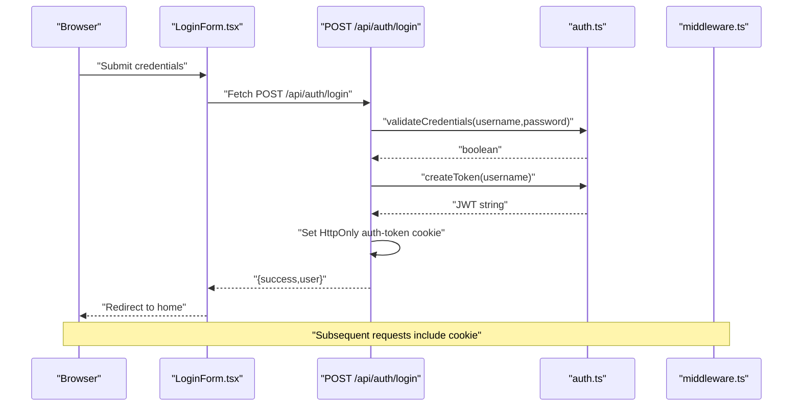

**Diagram sources**
- [src/components/LoginForm.tsx:13-40](file://src/components/LoginForm.tsx#L13-L40)
- [src/app/api/auth/login/route.ts:5-50](file://src/app/api/auth/login/route.ts#L5-L50)
- [src/lib/auth.ts:14-46](file://src/lib/auth.ts#L14-L46)
- [middleware.ts:19-34](file://middleware.ts#L19-L34)

## Detailed Component Analysis

### Authentication Library (JWT Utilities)
Responsibilities:
- Load secret from environment
- Create JWT with expiration
- Verify JWT and return payload
- Validate credentials against environment variables
- Retrieve current user from cookie

Key behaviors:
- Secret loading throws if missing; verification logs errors and returns null
- Token creation sets 7-day expiration
- Credential validation compares against environment variables
- Current user retrieval reads cookie and verifies token

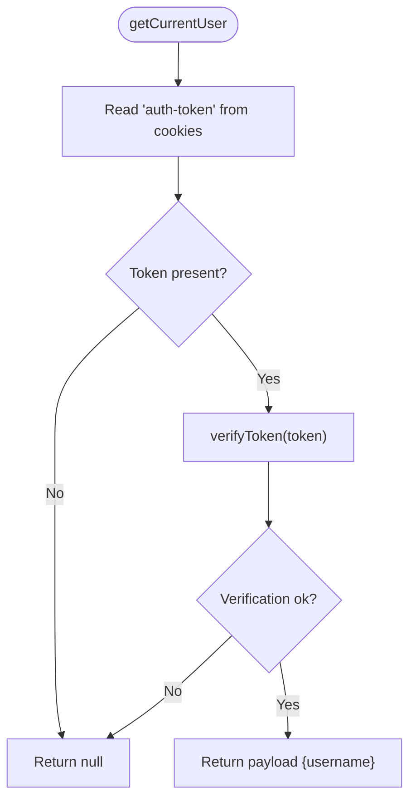

**Diagram sources**
- [src/lib/auth.ts:49-63](file://src/lib/auth.ts#L49-L63)
- [src/lib/auth.ts:19-33](file://src/lib/auth.ts#L19-L33)

**Section sources**
- [src/lib/auth.ts:5-11](file://src/lib/auth.ts#L5-L11)
- [src/lib/auth.ts:14-16](file://src/lib/auth.ts#L14-L16)
- [src/lib/auth.ts:19-33](file://src/lib/auth.ts#L19-L33)
- [src/lib/auth.ts:36-46](file://src/lib/auth.ts#L36-L46)
- [src/lib/auth.ts:49-63](file://src/lib/auth.ts#L49-L63)

### Login Endpoint
Responsibilities:
- Parse JSON body
- Validate presence of username/password
- Validate credentials
- Create token
- Set HttpOnly cookie with secure flags and 7-day expiry

Behavioral notes:
- Returns structured errors for bad input or invalid credentials
- Uses environment-provided secret for signing
- Sets cookie attributes: httpOnly, secure (production), lax sameSite, 7-day maxAge, path "/"

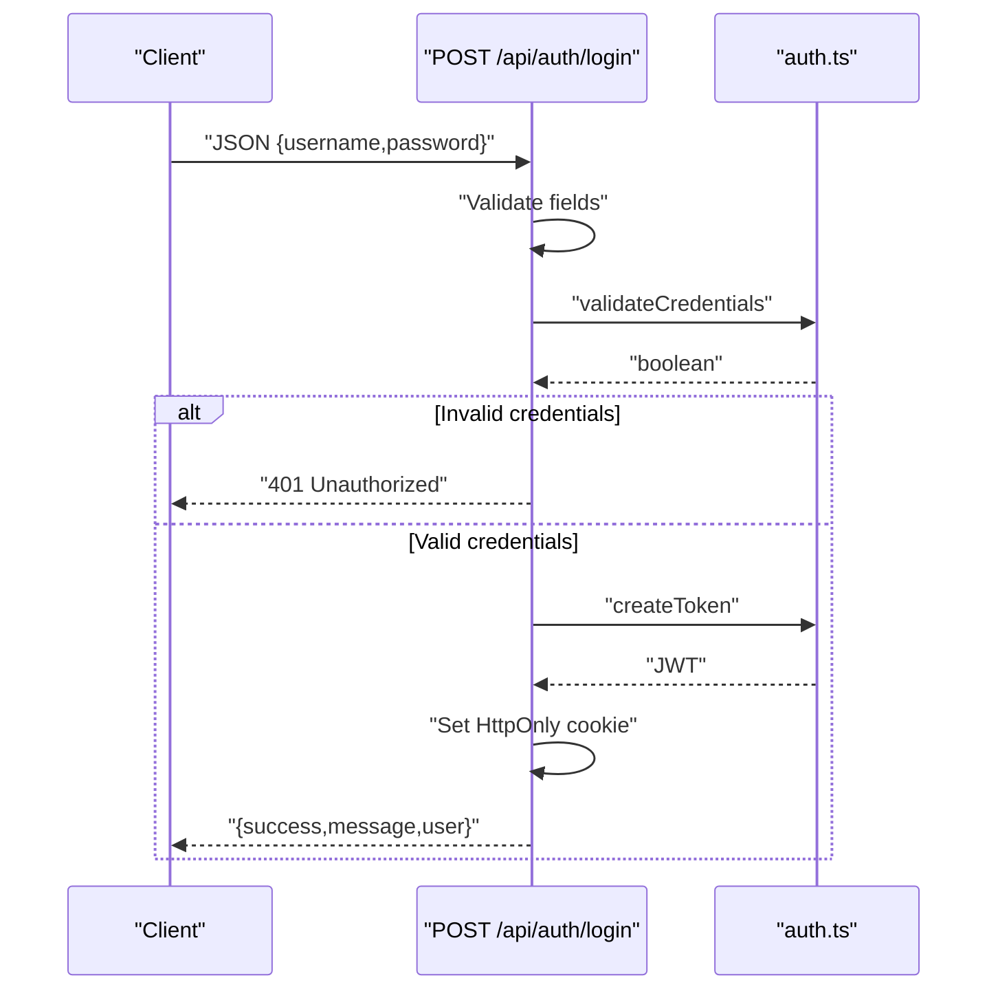

**Diagram sources**
- [src/app/api/auth/login/route.ts:5-50](file://src/app/api/auth/login/route.ts#L5-L50)
- [src/lib/auth.ts:14-16](file://src/lib/auth.ts#L14-L16)
- [src/lib/auth.ts:36-46](file://src/lib/auth.ts#L36-L46)

**Section sources**
- [src/app/api/auth/login/route.ts:5-50](file://src/app/api/auth/login/route.ts#L5-L50)
- [src/lib/auth.ts:14-16](file://src/lib/auth.ts#L14-L16)
- [src/lib/auth.ts:36-46](file://src/lib/auth.ts#L36-L46)

### Logout Endpoint
Responsibilities:
- Delete the auth cookie to invalidate session

Behavioral notes:
- Returns success message on completion
- Deletion occurs regardless of prior token validity

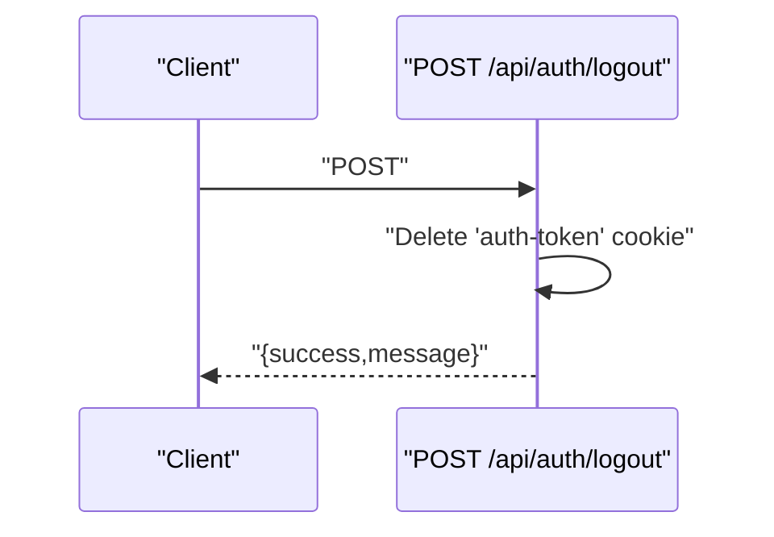

**Diagram sources**
- [src/app/api/auth/logout/route.ts:4-23](file://src/app/api/auth/logout/route.ts#L4-L23)

**Section sources**
- [src/app/api/auth/logout/route.ts:4-23](file://src/app/api/auth/logout/route.ts#L4-L23)

### User Info Endpoint
Responsibilities:
- Return current user if authenticated
- Return 401 otherwise

Behavioral notes:
- Relies on middleware to enforce authentication for protected routes
- Calls server-side getCurrentUser to verify cookie and token

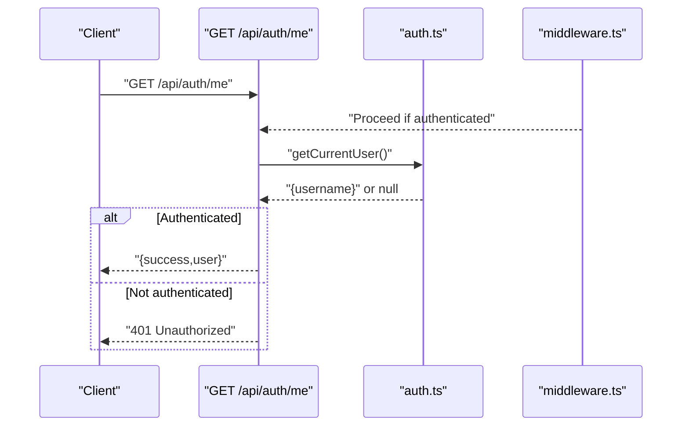

**Diagram sources**
- [src/app/api/auth/me/route.ts:4-27](file://src/app/api/auth/me/route.ts#L4-L27)
- [src/lib/auth.ts:49-63](file://src/lib/auth.ts#L49-L63)
- [middleware.ts:19-34](file://middleware.ts#L19-L34)

**Section sources**
- [src/app/api/auth/me/route.ts:4-27](file://src/app/api/auth/me/route.ts#L4-L27)
- [src/lib/auth.ts:49-63](file://src/lib/auth.ts#L49-L63)

### Middleware Protection
Responsibilities:
- Skip static assets, internal Next.js paths, login route, and favicon
- For other routes:
  - If no auth cookie, redirect to login for pages or return 401 for API
  - Otherwise allow request to proceed

Behavioral notes:
- Simplified: only checks for presence of cookie; does not verify token signature here
- Matcher applies to non-_next and non-favicon resources

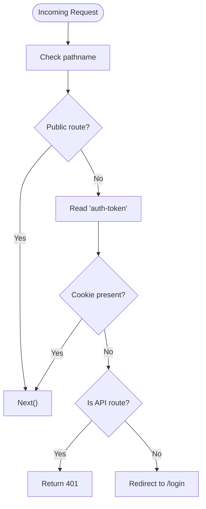

**Diagram sources**
- [middleware.ts:3-35](file://middleware.ts#L3-L35)

**Section sources**
- [middleware.ts:3-35](file://middleware.ts#L3-L35)

### Client-Side Guard and Login Page
Responsibilities:
- AuthGuard performs a one-time fetch to /api/auth/me to determine if the user is authenticated; redirects to /login if not
- LoginPage checks server-side isAuthenticated and redirects to / if already logged in
- LoginForm submits credentials to /api/auth/login and navigates on success
- UserMenu fetches /api/auth/me on mount and handles logout by calling /api/auth/logout

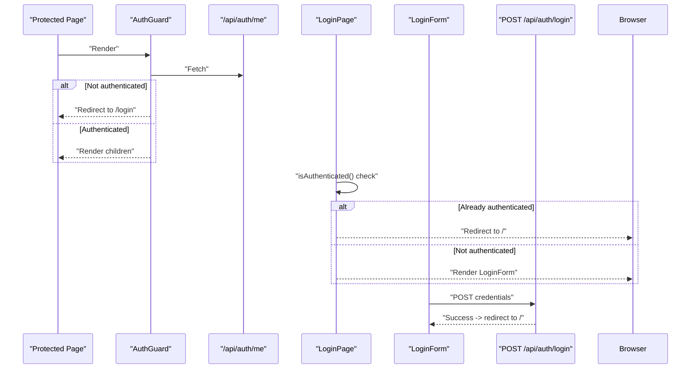

**Diagram sources**
- [src/components/AuthGuard.tsx:14-32](file://src/components/AuthGuard.tsx#L14-L32)
- [src/app/login/page.tsx:5-11](file://src/app/login/page.tsx#L5-L11)
- [src/components/LoginForm.tsx:13-40](file://src/components/LoginForm.tsx#L13-L40)
- [src/app/api/auth/login/route.ts:5-50](file://src/app/api/auth/login/route.ts#L5-L50)

**Section sources**
- [src/components/AuthGuard.tsx:10-53](file://src/components/AuthGuard.tsx#L10-L53)
- [src/app/login/page.tsx:5-11](file://src/app/login/page.tsx#L5-L11)
- [src/components/LoginForm.tsx:6-40](file://src/components/LoginForm.tsx#L6-L40)
- [src/components/UserMenu.tsx:16-61](file://src/components/UserMenu.tsx#L16-L61)

## Dependency Analysis
- Runtime dependencies include jsonwebtoken for JWT operations and Next.js server APIs for cookies and middleware.
- The login/logout/me endpoints depend on the auth library for token creation/verification and cookie manipulation.
- The middleware depends on the presence of the auth cookie to decide access.
- Client components depend on API endpoints for authentication state and actions.

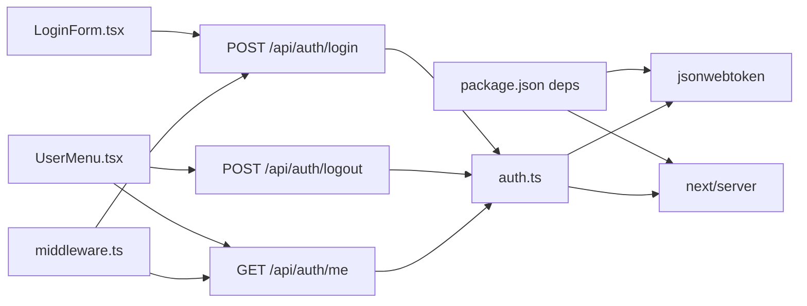

**Diagram sources**
- [package.json:31](file://package.json#L31)
- [package.json:33](file://package.json#L33)
- [src/components/LoginForm.tsx:19](file://src/components/LoginForm.tsx#L19)
- [src/components/UserMenu.tsx:38](file://src/components/UserMenu.tsx#L38)
- [src/components/UserMenu.tsx:50](file://src/components/UserMenu.tsx#L50)
- [middleware.ts:19-34](file://middleware.ts#L19-L34)
- [src/app/api/auth/login/route.ts:2](file://src/app/api/auth/login/route.ts#L2)
- [src/app/api/auth/logout/route.ts:2](file://src/app/api/auth/logout/route.ts#L2)
- [src/app/api/auth/me/route.ts:2](file://src/app/api/auth/me/route.ts#L2)
- [src/lib/auth.ts:1](file://src/lib/auth.ts#L1)

**Section sources**
- [package.json:16-40](file://package.json#L16-L40)
- [src/lib/auth.ts:1-2](file://src/lib/auth.ts#L1-L2)
- [src/app/api/auth/login/route.ts:2](file://src/app/api/auth/login/route.ts#L2)
- [src/app/api/auth/logout/route.ts:2](file://src/app/api/auth/logout/route.ts#L2)
- [src/app/api/auth/me/route.ts:2](file://src/app/api/auth/me/route.ts#L2)
- [middleware.ts:1](file://middleware.ts#L1)

## Performance Considerations
- Token verification is lightweight; performed server-side during middleware and API calls.
- HttpOnly cookies avoid unnecessary client-side storage overhead and reduce XSS risks.
- Expiration is set server-side; clients do not need to manage refresh logic.
- Consider rate-limiting login attempts at the network/proxy level if scaling.

## Security Considerations
Secret key management:
- The JWT secret is loaded from an environment variable and is required for signing and verification.
- The environment template specifies minimum length and generation guidance.

Token expiration:
- Tokens are issued with a 7-day expiration.

CSRF protection:
- The current implementation relies on HttpOnly cookies, which mitigate most XSS-based CSRF attacks.
- CSRF tokens are not implemented in the current design.

Additional recommendations:
- Use HTTPS in production to protect cookies and credentials.
- Rotate secrets periodically.
- Consider adding CSRF tokens for state-changing operations if extending the system.
- Add audit logging for authentication events.

**Section sources**
- [src/lib/auth.ts:5-11](file://src/lib/auth.ts#L5-L11)
- [src/lib/auth.ts:14-16](file://src/lib/auth.ts#L14-L16)
- [ENV_TEMPLATE.md:31-44](file://ENV_TEMPLATE.md#L31-L44)
- [AUTHENTICATION.md:58-66](file://AUTHENTICATION.md#L58-L66)

## Practical Authentication Flows

### Login Workflow
- User submits credentials on the login page.
- Client sends a POST request to the login endpoint with JSON body containing username and password.
- Backend validates credentials and, on success, creates a JWT and sets an HttpOnly cookie.
- Client receives success response and navigates to the home page.

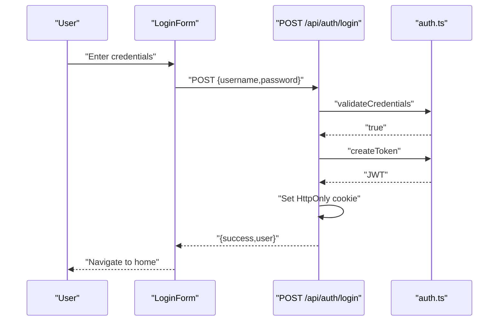

**Diagram sources**
- [src/components/LoginForm.tsx:13-40](file://src/components/LoginForm.tsx#L13-L40)
- [src/app/api/auth/login/route.ts:5-50](file://src/app/api/auth/login/route.ts#L5-L50)
- [src/lib/auth.ts:14-16](file://src/lib/auth.ts#L14-L16)
- [src/lib/auth.ts:36-46](file://src/lib/auth.ts#L36-L46)

### Logout Workflow
- User clicks the logout action in the user menu.
- Client sends a POST request to the logout endpoint.
- Backend deletes the auth cookie.
- Client navigates back to the login page.

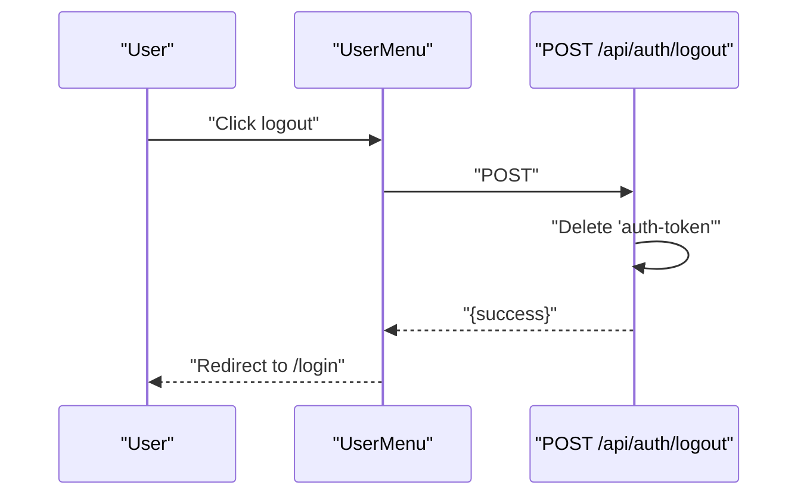

**Diagram sources**
- [src/components/UserMenu.tsx:48-61](file://src/components/UserMenu.tsx#L48-L61)
- [src/app/api/auth/logout/route.ts:4-23](file://src/app/api/auth/logout/route.ts#L4-L23)

### Protected Routes Enforcement
- Middleware intercepts requests to non-public routes.
- If the auth cookie is absent, it either redirects to the login page (for pages) or returns 401 (for API).
- If present, the request proceeds to the route handler.

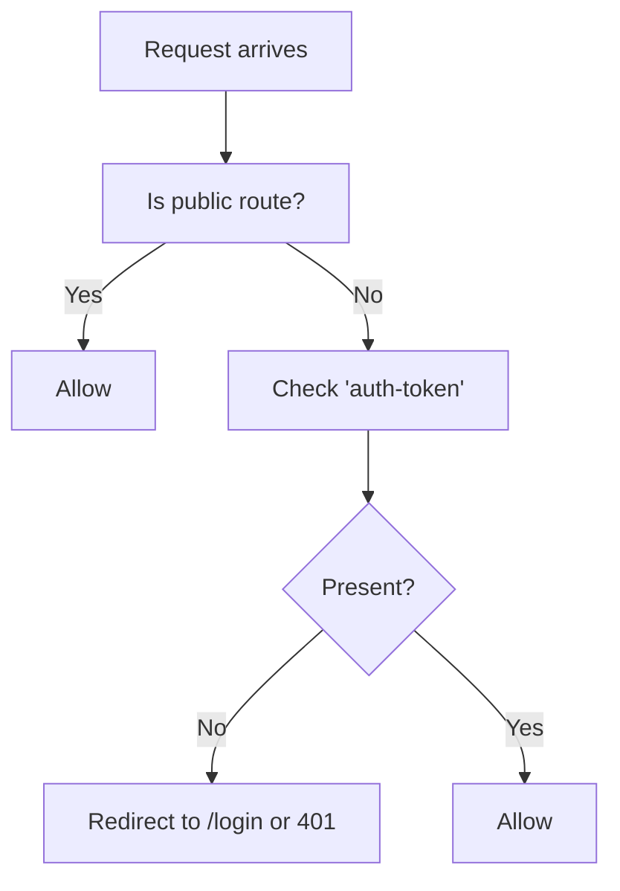

**Diagram sources**
- [middleware.ts:8-34](file://middleware.ts#L8-L34)

## Troubleshooting Guide
Common issues and resolutions:
- Environment variables not configured:
  - Symptoms: errors indicating missing secret or credentials during login/token verification.
  - Resolution: set AUTH_USERNAME, AUTH_PASSWORD, and AUTH_SECRET in the environment; ensure minimum length for AUTH_SECRET.
- Login fails:
  - Verify username and password match environment variables.
  - Confirm cookie is being set (HttpOnly) and not blocked by browser policies.
- Session appears expired:
  - The token has a 7-day expiration; re-login to obtain a new token.
- Middleware redirect loop:
  - Ensure the login route and static assets are excluded from middleware protection.
- API returns 401:
  - Confirm the auth cookie is included with the request and not being stripped by proxies or browser policies.

Debugging tips:
- Enable logging in the middleware and endpoints to inspect request paths and cookie presence.
- Inspect browser network tab to confirm cookie presence and status codes.
- Check server logs for explicit error messages from token verification or credential validation.

**Section sources**
- [AUTHENTICATION.md:179-192](file://AUTHENTICATION.md#L179-L192)
- [src/lib/auth.ts:20-33](file://src/lib/auth.ts#L20-L33)
- [src/lib/auth.ts:36-46](file://src/lib/auth.ts#L36-L46)
- [middleware.ts:6-34](file://middleware.ts#L6-L34)

## Conclusion
The authentication system provides a straightforward, secure JWT-based session model using HttpOnly cookies, enforced by middleware and protected API endpoints. It supports login, logout, and user info retrieval with clear error handling and environment-driven configuration. While CSRF protection is partially mitigated by HttpOnly cookies, further enhancements such as CSRF tokens can be considered for advanced scenarios. The provided troubleshooting guidance and practical flows should help both beginners and experienced developers implement and maintain the system effectively.