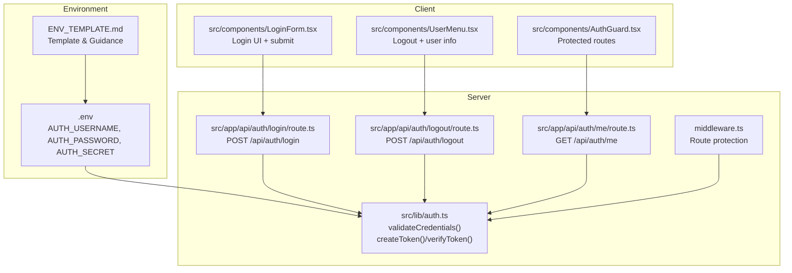
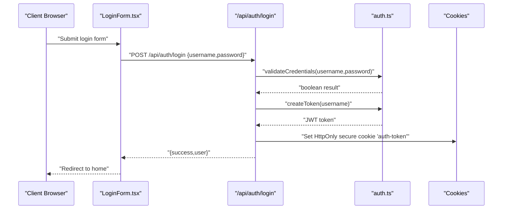
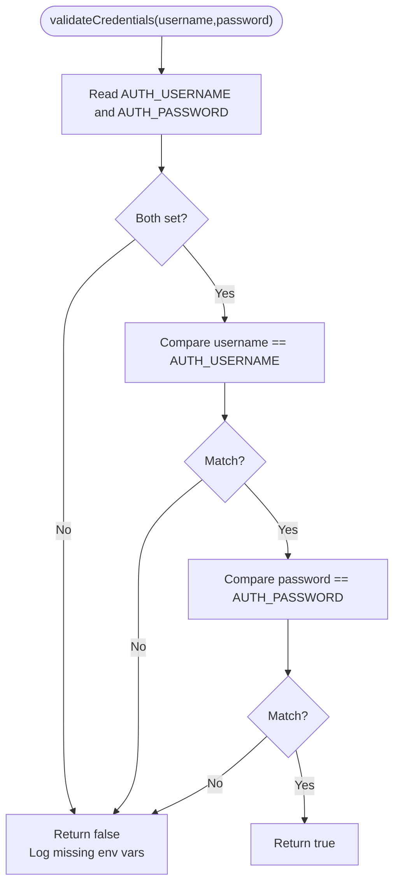
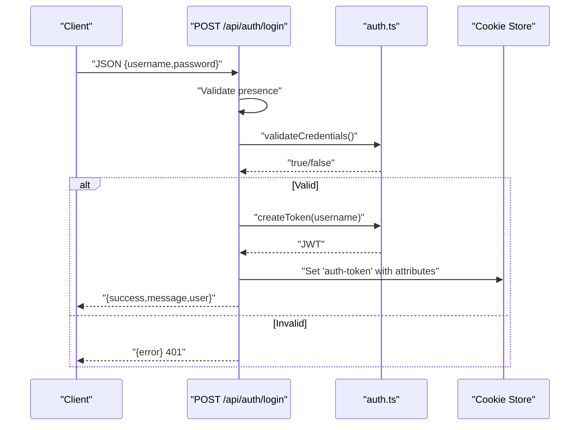
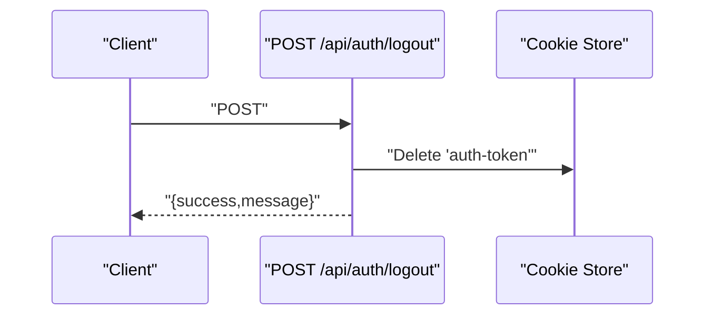
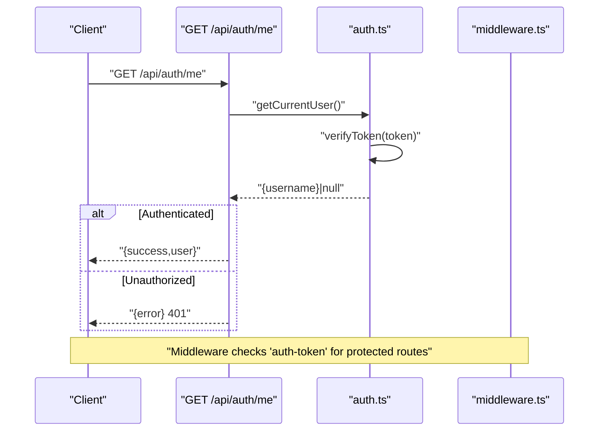
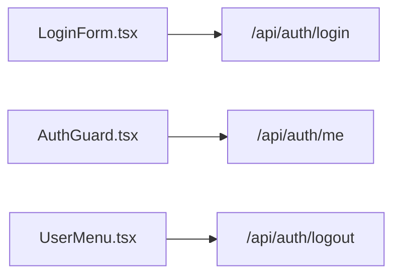
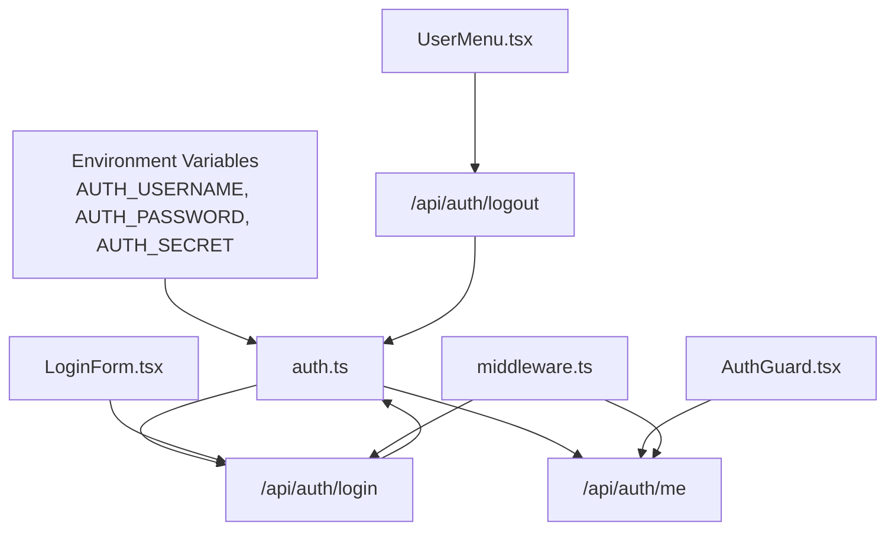

# Credential Validation

<cite>
**Referenced Files in This Document**
- [src/lib/auth.ts](file://src/lib/auth.ts)
- [src/app/api/auth/login/route.ts](file://src/app/api/auth/login/route.ts)
- [AUTHENTICATION.md](file://AUTHENTICATION.md)
- [ENV_TEMPLATE.md](file://ENV_TEMPLATE.md)
- [src/components/LoginForm.tsx](file://src/components/LoginForm.tsx)
- [src/app/api/auth/logout/route.ts](file://src/app/api/auth/logout/route.ts)
- [src/app/api/auth/me/route.ts](file://src/app/api/auth/me/route.ts)
- [src/components/AuthGuard.tsx](file://src/components/AuthGuard.tsx)
- [middleware.ts](file://middleware.ts)
- [src/components/UserMenu.tsx](file://src/components/UserMenu.tsx)
</cite>

## Table of Contents
1. [Introduction](#introduction)
2. [Project Structure](#project-structure)
3. [Core Components](#core-components)
4. [Architecture Overview](#architecture-overview)
5. [Detailed Component Analysis](#detailed-component-analysis)
6. [Dependency Analysis](#dependency-analysis)
7. [Performance Considerations](#performance-considerations)
8. [Troubleshooting Guide](#troubleshooting-guide)
9. [Conclusion](#conclusion)
10. [Appendices](#appendices)

## Introduction
This document explains the credential validation mechanism used by the authentication system. It focuses on environment-based credential checking using AUTH_USERNAME and AUTH_PASSWORD variables, the validation algorithm, comparison logic, and security implications. It also covers proper setup, common configuration errors, best practices for secret rotation and access control, debugging techniques for validation failures, and integration with external authentication providers.

## Project Structure
The authentication system is implemented across several modules:
- Environment configuration and templates
- Authentication utilities and middleware protection
- Login, logout, and user info endpoints
- Client-side login form and guard components

**Diagram sources**
- [src/lib/auth.ts:35-46](file://src/lib/auth.ts#L35-L46)
- [src/app/api/auth/login/route.ts:5-22](file://src/app/api/auth/login/route.ts#L5-L22)
- [src/app/api/auth/logout/route.ts:4-14](file://src/app/api/auth/logout/route.ts#L4-L14)
- [src/app/api/auth/me/route.ts:4-18](file://src/app/api/auth/me/route.ts#L4-L18)
- [src/components/LoginForm.tsx:13-40](file://src/components/LoginForm.tsx#L13-L40)
- [src/components/AuthGuard.tsx:14-32](file://src/components/AuthGuard.tsx#L14-L32)
- [src/components/UserMenu.tsx:36-61](file://src/components/UserMenu.tsx#L36-L61)
- [middleware.ts:3-35](file://middleware.ts#L3-L35)
- [ENV_TEMPLATE.md:16-19](file://ENV_TEMPLATE.md#L16-L19)

**Section sources**
- [AUTHENTICATION.md:68-85](file://AUTHENTICATION.md#L68-L85)
- [ENV_TEMPLATE.md:16-19](file://ENV_TEMPLATE.md#L16-L19)

## Core Components
- Environment-based credential validator: compares incoming username/password against AUTH_USERNAME and AUTH_PASSWORD.
- JWT utilities: token creation and verification using AUTH_SECRET.
- Login endpoint: validates credentials, creates a token, and sets a secure cookie.
- Logout endpoint: clears the auth cookie.
- User info endpoint: verifies the token and returns the current user.
- Middleware: protects routes by checking for a valid auth cookie.
- Client components: login form submission, protected routing, and logout action.

Key implementation references:
- Credential validation function: [src/lib/auth.ts:35-46](file://src/lib/auth.ts#L35-L46)
- Token creation and verification: [src/lib/auth.ts:14-33](file://src/lib/auth.ts#L14-L33)
- Login flow: [src/app/api/auth/login/route.ts:5-50](file://src/app/api/auth/login/route.ts#L5-L50)
- Logout flow: [src/app/api/auth/logout/route.ts:4-23](file://src/app/api/auth/logout/route.ts#L4-L23)
- User info flow: [src/app/api/auth/me/route.ts:4-27](file://src/app/api/auth/me/route.ts#L4-L27)
- Middleware protection: [middleware.ts:3-35](file://middleware.ts#L3-L35)
- Client login form: [src/components/LoginForm.tsx:13-40](file://src/components/LoginForm.tsx#L13-L40)
- Client guard: [src/components/AuthGuard.tsx:14-32](file://src/components/AuthGuard.tsx#L14-L32)
- Client logout: [src/components/UserMenu.tsx:48-61](file://src/components/UserMenu.tsx#L48-L61)

**Section sources**
- [src/lib/auth.ts:35-46](file://src/lib/auth.ts#L35-L46)
- [src/app/api/auth/login/route.ts:5-50](file://src/app/api/auth/login/route.ts#L5-L50)
- [src/app/api/auth/logout/route.ts:4-23](file://src/app/api/auth/logout/route.ts#L4-L23)
- [src/app/api/auth/me/route.ts:4-27](file://src/app/api/auth/me/route.ts#L4-L27)
- [middleware.ts:3-35](file://middleware.ts#L3-L35)
- [src/components/LoginForm.tsx:13-40](file://src/components/LoginForm.tsx#L13-L40)
- [src/components/AuthGuard.tsx:14-32](file://src/components/AuthGuard.tsx#L14-L32)
- [src/components/UserMenu.tsx:48-61](file://src/components/UserMenu.tsx#L48-L61)

## Architecture Overview
The credential validation flow integrates environment variables, server-side validation, and JWT-based session management.

**Diagram sources**
- [src/components/LoginForm.tsx:13-40](file://src/components/LoginForm.tsx#L13-L40)
- [src/app/api/auth/login/route.ts:5-50](file://src/app/api/auth/login/route.ts#L5-L50)
- [src/lib/auth.ts:35-46](file://src/lib/auth.ts#L35-L46)
- [src/lib/auth.ts:14-16](file://src/lib/auth.ts#L14-L16)

## Detailed Component Analysis

### Environment-Based Credential Checking
- Purpose: Compare submitted credentials against environment variables AUTH_USERNAME and AUTH_PASSWORD.
- Behavior:
  - If either environment variable is missing, validation fails and logs an error.
  - If both are present, performs a direct equality comparison for both username and password.
- Security implications:
  - Credentials are stored in environment variables, not in code or persistent storage.
  - The comparison is a simple string equality check; it does not hash or salt credentials.
  - The system does not implement rate limiting or account lockout; repeated failures can reveal the presence of valid credentials.

**Diagram sources**
- [src/lib/auth.ts:35-46](file://src/lib/auth.ts#L35-L46)

**Section sources**
- [src/lib/auth.ts:35-46](file://src/lib/auth.ts#L35-L46)
- [ENV_TEMPLATE.md:16-19](file://ENV_TEMPLATE.md#L16-L19)

### Login Endpoint and Token Management
- Request validation: Ensures both username and password are provided; otherwise returns 400.
- Credential validation: Calls validateCredentials; on failure returns 401 with an error message.
- Token creation: On success, creates a JWT using AUTH_SECRET and sets an HttpOnly, secure cookie named auth-token.
- Cookie attributes: httpOnly, secure (when production), sameSite lax, 7-day maxAge, path '/'.

**Diagram sources**
- [src/app/api/auth/login/route.ts:5-50](file://src/app/api/auth/login/route.ts#L5-L50)
- [src/lib/auth.ts:14-16](file://src/lib/auth.ts#L14-L16)
- [src/lib/auth.ts:35-46](file://src/lib/auth.ts#L35-L46)

**Section sources**
- [src/app/api/auth/login/route.ts:5-50](file://src/app/api/auth/login/route.ts#L5-L50)
- [src/lib/auth.ts:14-16](file://src/lib/auth.ts#L14-L16)
- [src/lib/auth.ts:35-46](file://src/lib/auth.ts#L35-L46)

### Logout and Session Termination
- Deletes the auth-token cookie to invalidate the session.
- Returns a success message upon completion.

**Diagram sources**
- [src/app/api/auth/logout/route.ts:4-23](file://src/app/api/auth/logout/route.ts#L4-L23)

**Section sources**
- [src/app/api/auth/logout/route.ts:4-23](file://src/app/api/auth/logout/route.ts#L4-L23)

### User Info Retrieval and Middleware Protection
- GET /api/auth/me: Verifies the token and returns the current user if authenticated; otherwise returns 401.
- Middleware: Protects non-public routes by checking for the auth-token cookie. For API routes without a token, returns 401; for pages, redirects to /login.

**Diagram sources**
- [src/app/api/auth/me/route.ts:4-27](file://src/app/api/auth/me/route.ts#L4-L27)
- [src/lib/auth.ts:49-63](file://src/lib/auth.ts#L49-L63)
- [middleware.ts:3-35](file://middleware.ts#L3-L35)

**Section sources**
- [src/app/api/auth/me/route.ts:4-27](file://src/app/api/auth/me/route.ts#L4-L27)
- [src/lib/auth.ts:49-63](file://src/lib/auth.ts#L49-L63)
- [middleware.ts:3-35](file://middleware.ts#L3-L35)

### Client-Side Components
- LoginForm: Submits credentials to the login endpoint and handles success/error states.
- AuthGuard: Checks authentication state by calling /api/auth/me and redirects unauthenticated users to /login.
- UserMenu: Displays the current user and triggers logout.

**Diagram sources**
- [src/components/LoginForm.tsx:13-40](file://src/components/LoginForm.tsx#L13-L40)
- [src/components/AuthGuard.tsx:14-32](file://src/components/AuthGuard.tsx#L14-L32)
- [src/components/UserMenu.tsx:36-61](file://src/components/UserMenu.tsx#L36-L61)

**Section sources**
- [src/components/LoginForm.tsx:13-40](file://src/components/LoginForm.tsx#L13-L40)
- [src/components/AuthGuard.tsx:14-32](file://src/components/AuthGuard.tsx#L14-L32)
- [src/components/UserMenu.tsx:36-61](file://src/components/UserMenu.tsx#L36-L61)

## Dependency Analysis
- Environment variables drive validation:
  - AUTH_USERNAME and AUTH_PASSWORD are read by validateCredentials.
  - AUTH_SECRET is required for token signing/verification.
- Server-side dependencies:
  - auth.ts provides validateCredentials, createToken, verifyToken, getCurrentUser.
  - Login/logout/me routes depend on auth.ts and manage cookies.
  - middleware.ts depends on the presence of the auth-token cookie.
- Client-side dependencies:
  - LoginForm submits to the login endpoint.
  - AuthGuard calls /api/auth/me to determine access.
  - UserMenu calls /api/auth/logout.

**Diagram sources**
- [src/lib/auth.ts:35-46](file://src/lib/auth.ts#L35-L46)
- [src/app/api/auth/login/route.ts:5-50](file://src/app/api/auth/login/route.ts#L5-L50)
- [src/app/api/auth/logout/route.ts:4-23](file://src/app/api/auth/logout/route.ts#L4-L23)
- [src/app/api/auth/me/route.ts:4-27](file://src/app/api/auth/me/route.ts#L4-L27)
- [middleware.ts:3-35](file://middleware.ts#L3-L35)
- [src/components/LoginForm.tsx:13-40](file://src/components/LoginForm.tsx#L13-L40)
- [src/components/AuthGuard.tsx:14-32](file://src/components/AuthGuard.tsx#L14-L32)
- [src/components/UserMenu.tsx:48-61](file://src/components/UserMenu.tsx#L48-L61)

**Section sources**
- [src/lib/auth.ts:35-46](file://src/lib/auth.ts#L35-L46)
- [src/app/api/auth/login/route.ts:5-50](file://src/app/api/auth/login/route.ts#L5-L50)
- [src/app/api/auth/logout/route.ts:4-23](file://src/app/api/auth/logout/route.ts#L4-L23)
- [src/app/api/auth/me/route.ts:4-27](file://src/app/api/auth/me/route.ts#L4-L27)
- [middleware.ts:3-35](file://middleware.ts#L3-L35)
- [src/components/LoginForm.tsx:13-40](file://src/components/LoginForm.tsx#L13-L40)
- [src/components/AuthGuard.tsx:14-32](file://src/components/AuthGuard.tsx#L14-L32)
- [src/components/UserMenu.tsx:48-61](file://src/components/UserMenu.tsx#L48-L61)

## Performance Considerations
- Validation cost: validateCredentials performs constant-time string comparisons against environment variables; negligible overhead.
- Token verification: verifyToken uses symmetric signature verification; cost scales with token size and crypto library implementation but remains fast for typical JWT payloads.
- Cookie handling: Setting HttpOnly cookies avoids client-side tampering and reduces XSS risks.
- Recommendations:
  - Avoid frequent re-authentication by leveraging the 7-day token lifetime.
  - Consider adding rate limiting at the login endpoint to mitigate brute-force attempts.
  - Monitor middleware logs for unauthorized access patterns.

[No sources needed since this section provides general guidance]

## Troubleshooting Guide
Common issues and resolutions:
- Missing environment variables:
  - Symptom: Login fails with an error indicating missing AUTH_USERNAME or AUTH_PASSWORD.
  - Resolution: Ensure AUTH_USERNAME and AUTH_PASSWORD are set in the environment and restart the server.
- Incorrect credentials:
  - Symptom: 401 Unauthorized on login.
  - Resolution: Verify username and password match the configured environment variables exactly.
- JWT secret misconfiguration:
  - Symptom: Token verification fails or login succeeds but subsequent requests fail.
  - Resolution: Confirm AUTH_SECRET is set and matches across deployments; rotate secrets carefully and update all instances.
- Cookie not set or cleared:
  - Symptom: Redirect loops or inability to access protected routes.
  - Resolution: Check browser cookies for 'auth-token'; ensure secure flag aligns with deployment (HTTPS in production).
- Middleware blocking:
  - Symptom: Protected pages redirect to /login or API returns 401.
  - Resolution: Ensure a valid auth-token cookie is present; confirm middleware matcher excludes login and static assets.
- Client-side errors:
  - Symptom: LoginForm shows network errors or UserMenu logout fails.
  - Resolution: Inspect browser console/network tab; verify API endpoints are reachable and CORS settings are correct.

**Section sources**
- [src/lib/auth.ts:35-46](file://src/lib/auth.ts#L35-L46)
- [src/app/api/auth/login/route.ts:5-50](file://src/app/api/auth/login/route.ts#L5-L50)
- [src/app/api/auth/me/route.ts:4-27](file://src/app/api/auth/me/route.ts#L4-L27)
- [middleware.ts:3-35](file://middleware.ts#L3-L35)
- [src/components/LoginForm.tsx:13-40](file://src/components/LoginForm.tsx#L13-L40)
- [src/components/UserMenu.tsx:48-61](file://src/components/UserMenu.tsx#L48-L61)

## Conclusion
The authentication system uses environment-based credentials for simplicity and ease of deployment. validateCredentials performs straightforward equality checks against AUTH_USERNAME and AUTH_PASSWORD, while JWT tokens manage sessions with secure cookie attributes. The middleware and client components enforce access control and provide a seamless user experience. For production, ensure robust secret management, consider rate limiting, and adopt secure deployment practices.

[No sources needed since this section summarizes without analyzing specific files]

## Appendices

### Proper Credential Setup
- Configure environment variables:
  - AUTH_USERNAME: desired username for login.
  - AUTH_PASSWORD: strong password meeting security guidelines.
  - AUTH_SECRET: at least 32 characters, randomly generated.
- Reference configurations:
  - Template and guidance: [ENV_TEMPLATE.md:16-19](file://ENV_TEMPLATE.md#L16-L19)
  - Security recommendations: [ENV_TEMPLATE.md:36-44](file://ENV_TEMPLATE.md#L36-L44)

**Section sources**
- [ENV_TEMPLATE.md:16-19](file://ENV_TEMPLATE.md#L16-L19)
- [ENV_TEMPLATE.md:36-44](file://ENV_TEMPLATE.md#L36-L44)

### Security Best Practices
- Secret rotation:
  - Rotate AUTH_SECRET periodically; update all environments and redeploy.
  - After rotation, existing tokens remain valid until expiration; plan for a maintenance window.
- Access control:
  - Restrict access to environment files and deployment targets.
  - Use separate secrets per environment (dev/staging/prod).
- Transport security:
  - Use HTTPS in production to protect credentials during transmission.
- Additional hardening:
  - Implement rate limiting on /api/auth/login.
  - Add account lockout or CAPTCHA for high-risk scenarios.
  - Audit logs for authentication events.

**Section sources**
- [AUTHENTICATION.md:172-177](file://AUTHENTICATION.md#L172-L177)
- [ENV_TEMPLATE.md:36-44](file://ENV_TEMPLATE.md#L36-L44)

### Integration with External Authentication Providers
- Current state: The system validates against environment variables and issues JWT tokens.
- Integration steps:
  - Replace validateCredentials with provider integration (OAuth, SAML, LDAP).
  - Issue JWT tokens upon successful provider authentication.
  - Maintain the existing JWT verification and cookie handling for session management.
  - Update middleware to accept provider-derived identities.
- Notes:
  - Provider libraries and endpoints are not part of this repository; integrate them at the application boundary while preserving token-based session semantics.

[No sources needed since this section provides general guidance]