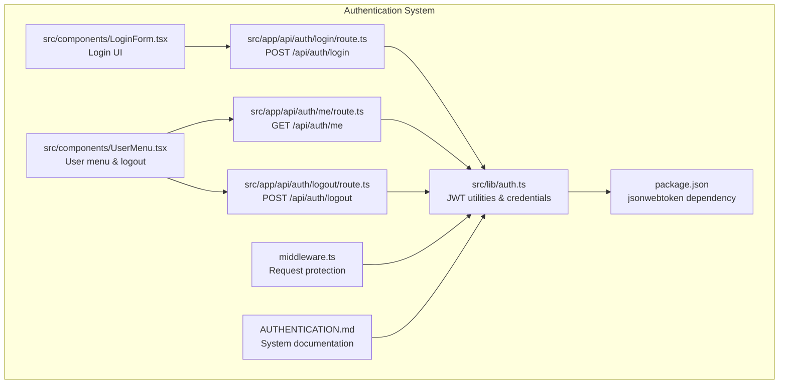
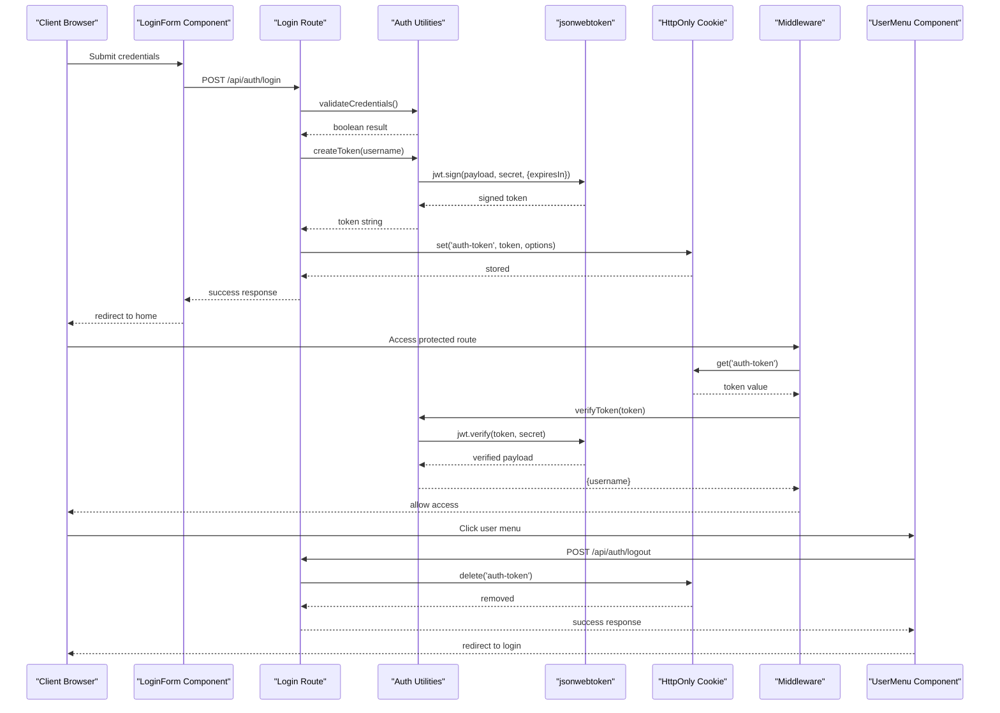
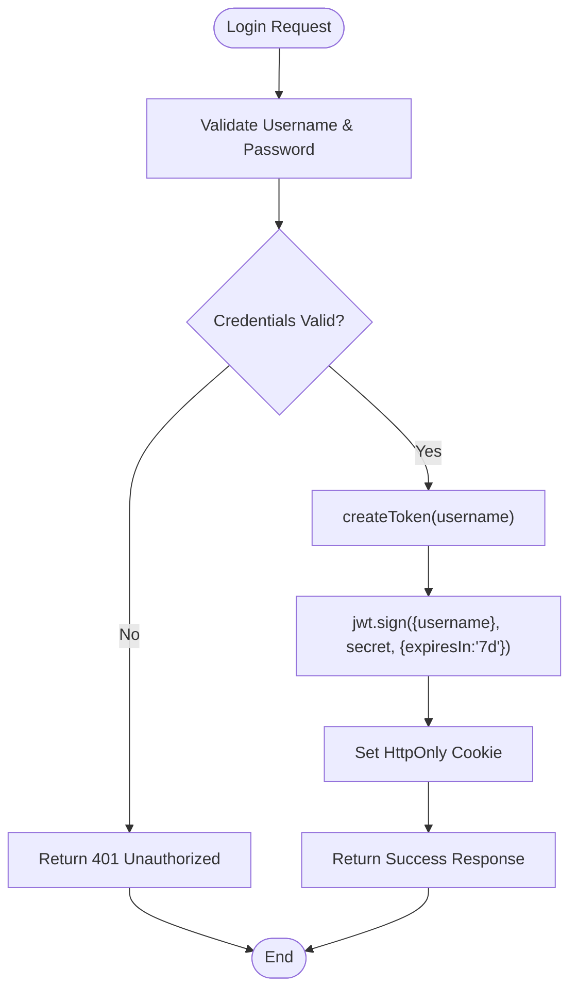
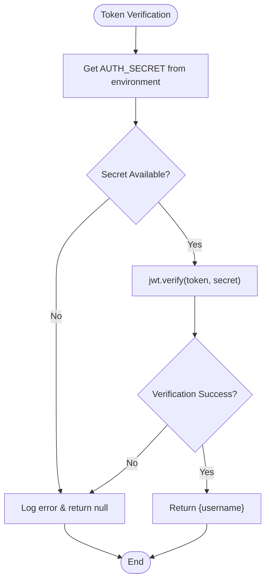
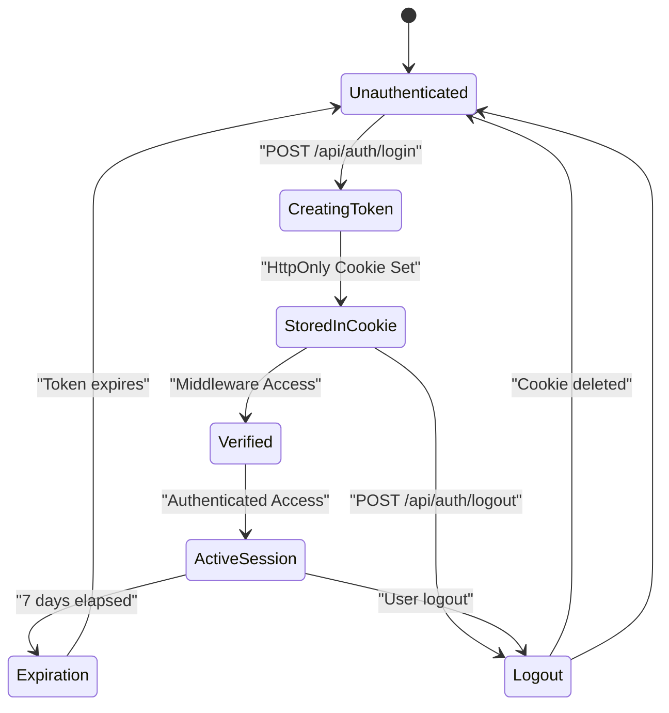
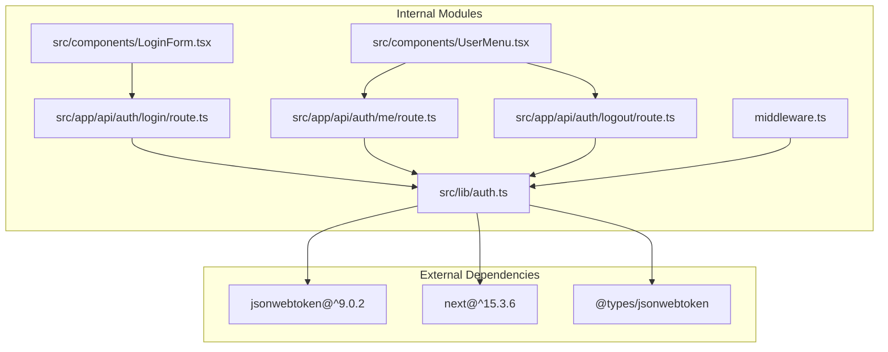

# JWT Token Management

<cite>
**Referenced Files in This Document**
- [src/lib/auth.ts](file://src/lib/auth.ts)
- [src/app/api/auth/login/route.ts](file://src/app/api/auth/login/route.ts)
- [src/app/api/auth/logout/route.ts](file://src/app/api/auth/logout/route.ts)
- [src/app/api/auth/me/route.ts](file://src/app/api/auth/me/route.ts)
- [middleware.ts](file://middleware.ts)
- [src/components/LoginForm.tsx](file://src/components/LoginForm.tsx)
- [src/components/UserMenu.tsx](file://src/components/UserMenu.tsx)
- [AUTHENTICATION.md](file://AUTHENTICATION.md)
- [package.json](file://package.json)
</cite>

## Table of Contents
1. [Introduction](#introduction)
2. [Project Structure](#project-structure)
3. [Core Components](#core-components)
4. [Architecture Overview](#architecture-overview)
5. [Detailed Component Analysis](#detailed-component-analysis)
6. [Dependency Analysis](#dependency-analysis)
7. [Performance Considerations](#performance-considerations)
8. [Security Considerations](#security-considerations)
9. [Troubleshooting Guide](#troubleshooting-guide)
10. [Conclusion](#conclusion)

## Introduction
This document provides comprehensive guidance for JWT token management in the authentication system. It explains the token creation process using the jsonwebtoken library, including payload structure with username claims and expiration configuration. It documents the token verification mechanism with secret key validation and error handling, details the token lifecycle from creation to expiration and renewal strategies, and addresses security considerations such as secret key management, token storage, and potential vulnerabilities. Practical examples of token signing, verification, and payload extraction are included, along with troubleshooting guidance for common token-related issues.

## Project Structure
The authentication system is organized around several key modules:
- Authentication utilities: centralized JWT operations and credential validation
- API routes: login, logout, and user information endpoints
- Middleware: request protection and redirection logic
- Client components: login form and user menu for user interaction
- Documentation: authentication guide and configuration instructions

**Diagram sources**
- [src/lib/auth.ts:1-69](file://src/lib/auth.ts#L1-L69)
- [src/app/api/auth/login/route.ts:1-50](file://src/app/api/auth/login/route.ts#L1-L50)
- [src/app/api/auth/logout/route.ts:1-23](file://src/app/api/auth/logout/route.ts#L1-L23)
- [src/app/api/auth/me/route.ts:1-27](file://src/app/api/auth/me/route.ts#L1-L27)
- [middleware.ts:1-40](file://middleware.ts#L1-L40)
- [src/components/LoginForm.tsx:1-98](file://src/components/LoginForm.tsx#L1-L98)
- [src/components/UserMenu.tsx:1-104](file://src/components/UserMenu.tsx#L1-L104)
- [AUTHENTICATION.md:1-192](file://AUTHENTICATION.md#L1-L192)
- [package.json:31](file://package.json#L31)

**Section sources**
- [AUTHENTICATION.md:68-85](file://AUTHENTICATION.md#L68-L85)
- [package.json:16-56](file://package.json#L16-L56)

## Core Components
The authentication system centers on four primary components:

### JWT Utilities Library
The authentication utilities module provides:
- Secret key retrieval with environment variable validation
- Token creation with username payload and 7-day expiration
- Token verification with error handling and null return on failure
- Credential validation against environment variables
- Current user retrieval from cookies
- Authentication state checking

Key implementation patterns:
- Centralized secret key management through environment variables
- Consistent error handling with logging and graceful failure
- Payload structure containing only username claim
- HttpOnly cookie storage for secure token transmission

**Section sources**
- [src/lib/auth.ts:1-69](file://src/lib/auth.ts#L1-L69)

### API Routes
The system exposes three primary API endpoints:
- POST /api/auth/login: Validates credentials, creates JWT, sets HttpOnly cookie
- POST /api/auth/logout: Deletes authentication cookie
- GET /api/auth/me: Returns current user information

Each endpoint implements proper error handling and status code responses.

**Section sources**
- [src/app/api/auth/login/route.ts:1-50](file://src/app/api/auth/login/route.ts#L1-L50)
- [src/app/api/auth/logout/route.ts:1-23](file://src/app/api/auth/logout/route.ts#L1-L23)
- [src/app/api/auth/me/route.ts:1-27](file://src/app/api/auth/me/route.ts#L1-L27)

### Middleware Protection
The middleware enforces authentication across the application:
- Skips protected routes for static assets and login pages
- Extracts token from auth-token cookie
- Redirects unauthenticated users to login page
- Returns 401 for API requests without tokens
- Allows access when token is present

**Section sources**
- [middleware.ts:1-40](file://middleware.ts#L1-L40)

### Client Components
The frontend components provide user interaction:
- LoginForm: Handles credential submission and navigation
- UserMenu: Displays user information and logout functionality

**Section sources**
- [src/components/LoginForm.tsx:1-98](file://src/components/LoginForm.tsx#L1-L98)
- [src/components/UserMenu.tsx:1-104](file://src/components/UserMenu.tsx#L1-L104)

## Architecture Overview
The JWT authentication architecture follows a client-server model with middleware enforcement:

**Diagram sources**
- [src/components/LoginForm.tsx:13-40](file://src/components/LoginForm.tsx#L13-L40)
- [src/app/api/auth/login/route.ts:5-50](file://src/app/api/auth/login/route.ts#L5-L50)
- [src/lib/auth.ts:14-33](file://src/lib/auth.ts#L14-L33)
- [middleware.ts:3-35](file://middleware.ts#L3-L35)
- [src/app/api/auth/logout/route.ts:4-23](file://src/app/api/auth/logout/route.ts#L4-L23)

## Detailed Component Analysis

### JWT Token Creation Process
The token creation process follows these steps:
1. Validate username presence in request body
2. Verify credentials against environment variables
3. Generate JWT with username payload and 7-day expiration
4. Store token in HttpOnly cookie with security options

**Diagram sources**
- [src/app/api/auth/login/route.ts:7-25](file://src/app/api/auth/login/route.ts#L7-L25)
- [src/lib/auth.ts:14-16](file://src/lib/auth.ts#L14-L16)

**Section sources**
- [src/app/api/auth/login/route.ts:1-50](file://src/app/api/auth/login/route.ts#L1-L50)
- [src/lib/auth.ts:14-16](file://src/lib/auth.ts#L14-L16)

### Token Verification Mechanism
Token verification implements robust error handling:
- Secret key validation from environment variables
- Try-catch block for verification errors
- Null return on verification failure
- Logging of verification failures

**Diagram sources**
- [src/lib/auth.ts:19-33](file://src/lib/auth.ts#L19-L33)

**Section sources**
- [src/lib/auth.ts:19-33](file://src/lib/auth.ts#L19-L33)

### Token Lifecycle Management
The token lifecycle spans creation, storage, verification, and expiration:

**Diagram sources**
- [src/app/api/auth/login/route.ts:28-35](file://src/app/api/auth/login/route.ts#L28-L35)
- [middleware.ts:19-34](file://middleware.ts#L19-L34)
- [src/app/api/auth/logout/route.ts:9](file://src/app/api/auth/logout/route.ts#L9)

**Section sources**
- [src/app/api/auth/login/route.ts:28-35](file://src/app/api/auth/login/route.ts#L28-L35)
- [src/app/api/auth/logout/route.ts:1-23](file://src/app/api/auth/logout/route.ts#L1-L23)
- [middleware.ts:1-40](file://middleware.ts#L1-L40)

### Credential Validation Process
Credential validation follows these steps:
1. Retrieve username and password from environment variables
2. Validate both credentials exist
3. Compare provided credentials with environment values
4. Return boolean result for authentication decision

**Section sources**
- [src/lib/auth.ts:36-46](file://src/lib/auth.ts#L36-L46)

## Dependency Analysis
The authentication system relies on several key dependencies and relationships:

**Diagram sources**
- [package.json:31](file://package.json#L31)
- [src/lib/auth.ts:1](file://src/lib/auth.ts#L1)
- [src/app/api/auth/login/route.ts:2](file://src/app/api/auth/login/route.ts#L2)

**Section sources**
- [package.json:16-56](file://package.json#L16-L56)
- [src/lib/auth.ts:1](file://src/lib/auth.ts#L1)

## Performance Considerations
The JWT authentication system implements several performance optimizations:
- Minimal payload size (username only) reduces token overhead
- Environment-based secret retrieval avoids runtime computation
- HttpOnly cookies prevent unnecessary client-side processing
- Middleware performs lightweight token existence checks
- Error handling prevents cascading failures

## Security Considerations
The system implements multiple security measures:

### Secret Key Management
- Environment variable storage prevents hardcoding
- Minimum 32-character requirement for strong encryption
- Separate environment variables for username/password/secret
- Deployment script validates secret strength

### Token Storage and Transmission
- HttpOnly cookies prevent XSS attacks
- Secure flag enabled in production environments
- SameSite protection against CSRF
- Path-scoped cookie access
- 7-day maximum age configuration

### Authentication Flow Security
- Credential validation occurs server-side only
- Tokens contain minimal sensitive information
- Middleware provides comprehensive route protection
- Error messages avoid leaking system internals

**Section sources**
- [AUTHENTICATION.md:26-28](file://AUTHENTICATION.md#L26-L28)
- [AUTHENTICATION.md:58-61](file://AUTHENTICATION.md#L58-L61)
- [src/app/api/auth/login/route.ts:29-35](file://src/app/api/auth/login/route.ts#L29-L35)

## Troubleshooting Guide

### Common Token-Related Issues

#### Invalid Signature Errors
Symptoms: Token verification fails with signature errors
Causes:
- Incorrect AUTH_SECRET environment variable
- Modified token content
- Wrong secret key used for verification

Resolution:
- Verify AUTH_SECRET matches the signing secret
- Check for environment variable injection issues
- Ensure consistent secret across deployment environments

#### Expired Token Issues
Symptoms: Users redirected to login despite recent activity
Causes:
- 7-day expiration period elapsed
- System clock synchronization issues
- Cookie deletion or browser clearing

Resolution:
- Implement automatic re-authentication
- Check system time synchronization
- Advise users to avoid clearing browser cookies

#### Malformed Payload Errors
Symptoms: Verification returns null or throws errors
Causes:
- Corrupted token data
- Unexpected payload structure
- Token tampering attempts

Resolution:
- Validate token format before verification
- Implement token refresh mechanisms
- Monitor for suspicious access patterns

#### Environment Variable Configuration
Symptoms: Application throws configuration errors
Causes:
- Missing AUTH_SECRET environment variable
- Incorrect AUTH_USERNAME or AUTH_PASSWORD values
- Incomplete environment configuration

Resolution:
- Verify all required environment variables are set
- Use deployment scripts to validate configuration
- Test environment setup in development mode

**Section sources**
- [src/lib/auth.ts:5-11](file://src/lib/auth.ts#L5-L11)
- [src/lib/auth.ts:19-33](file://src/lib/auth.ts#L19-L33)
- [AUTHENTICATION.md:179-192](file://AUTHENTICATION.md#L179-L192)

## Conclusion
The JWT authentication system provides a robust, secure, and maintainable solution for protecting application resources. The implementation demonstrates best practices including environment-based secret management, secure cookie storage, comprehensive error handling, and middleware-based access control. The modular architecture enables easy maintenance and extension while maintaining security standards. Regular monitoring and adherence to security guidelines will ensure continued reliability and protection against emerging threats.