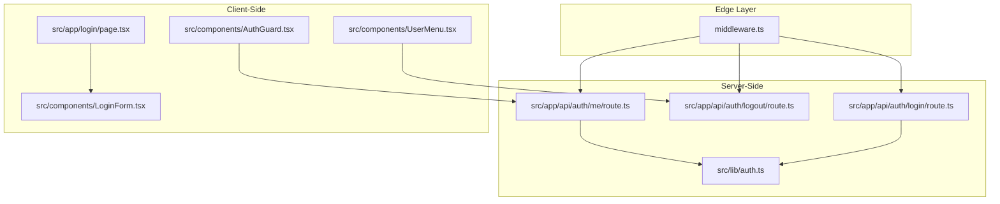
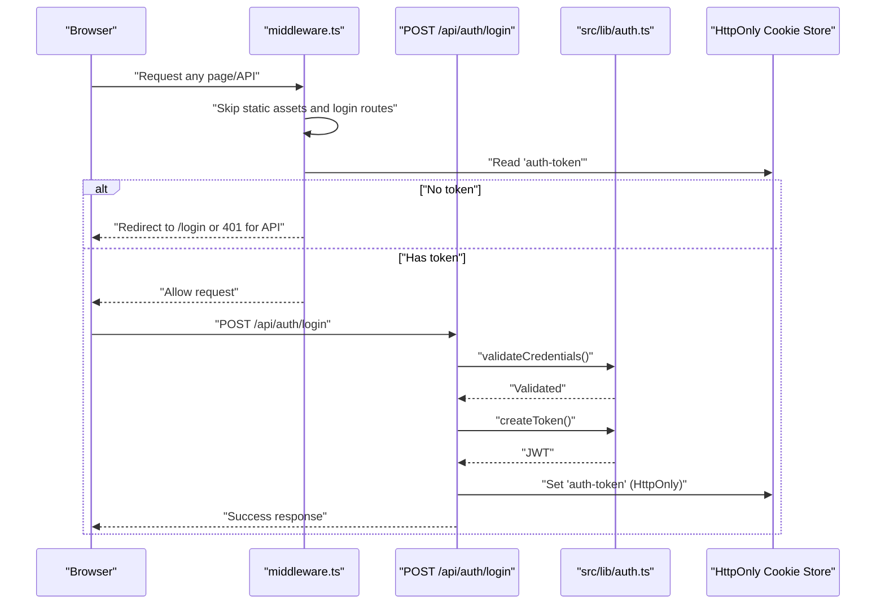
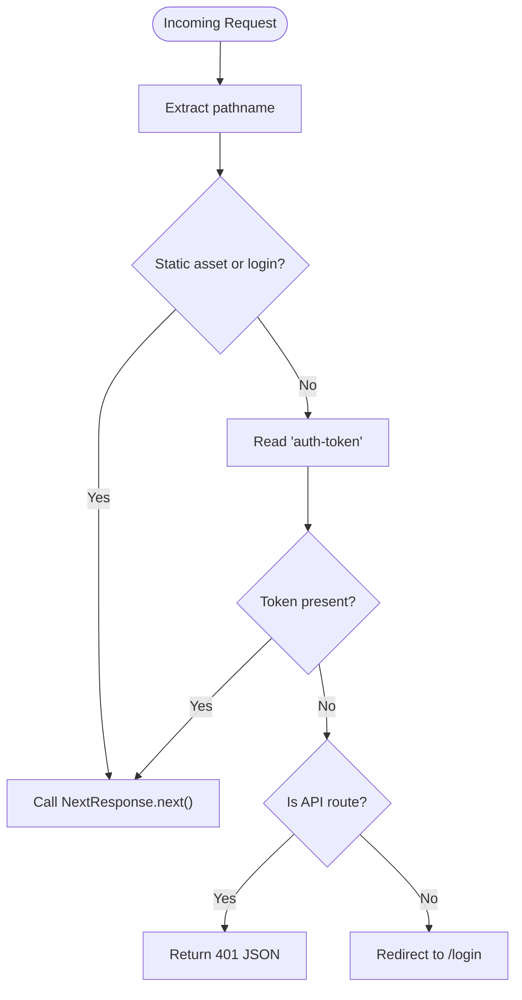
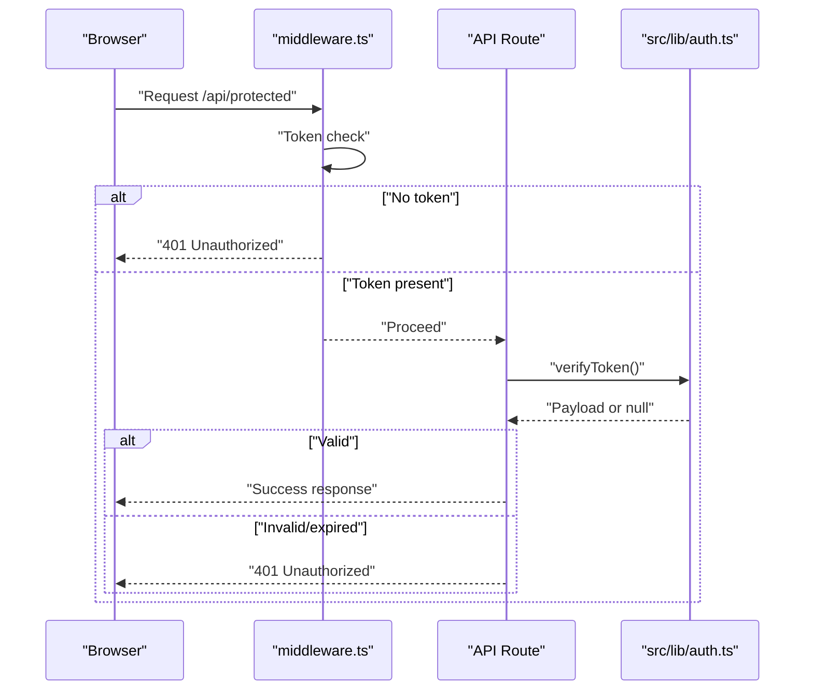
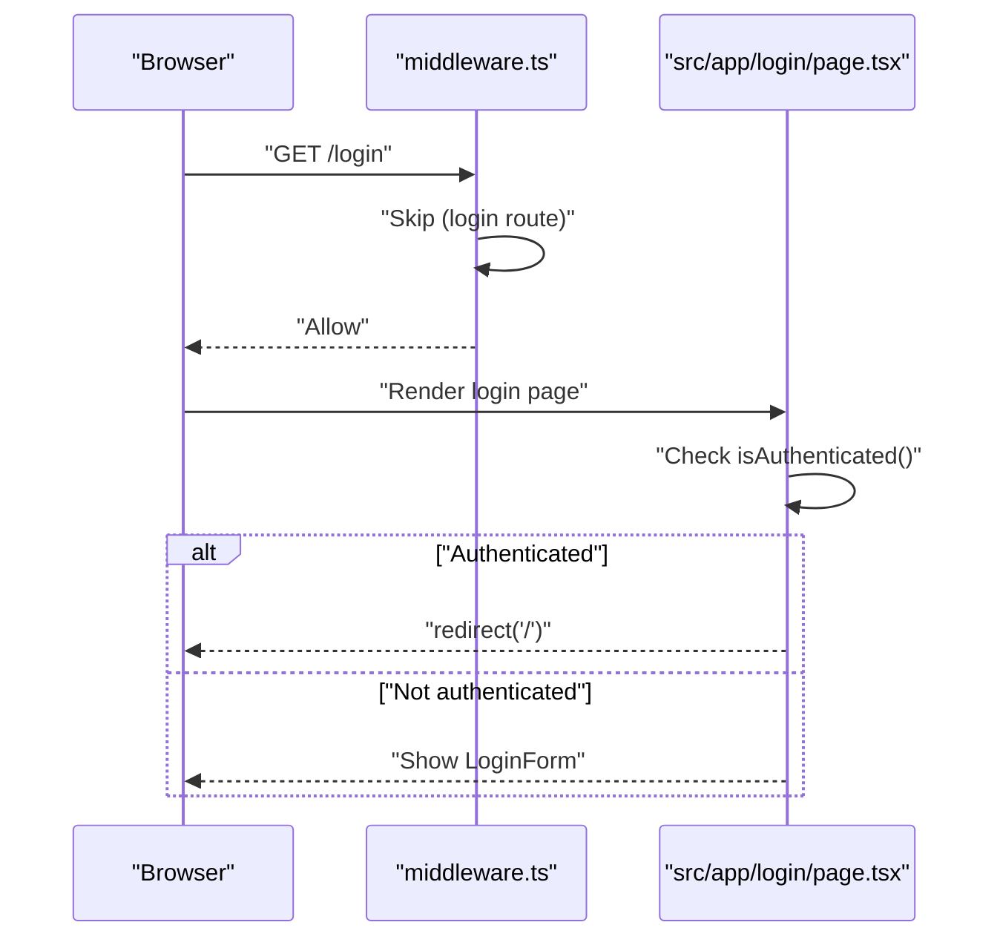
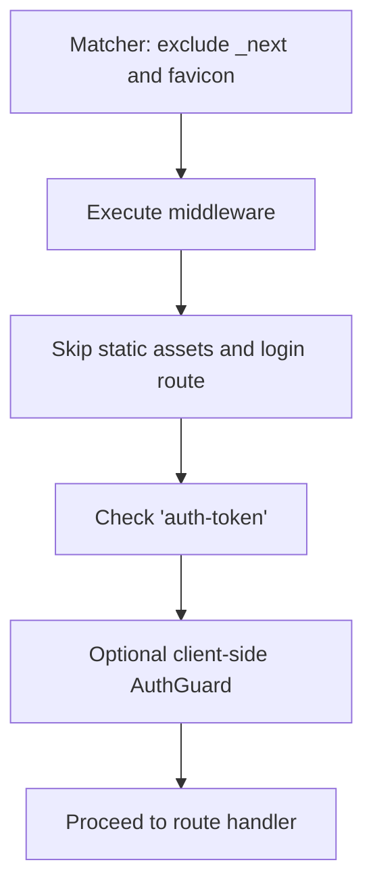
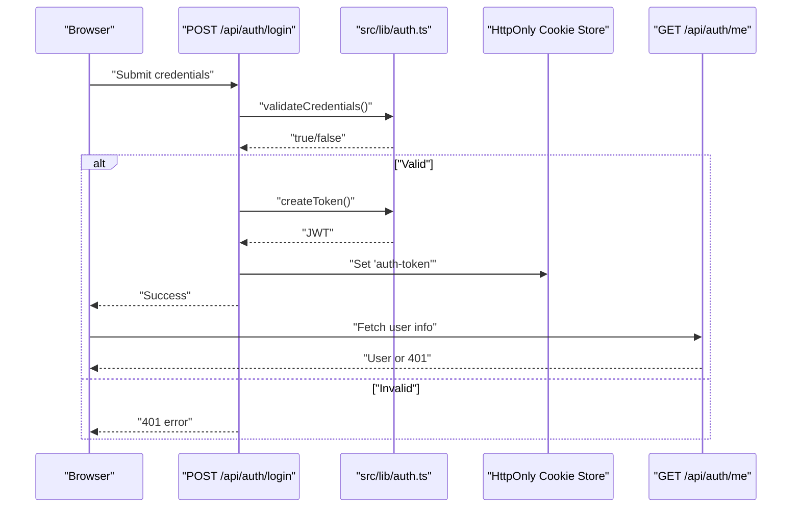
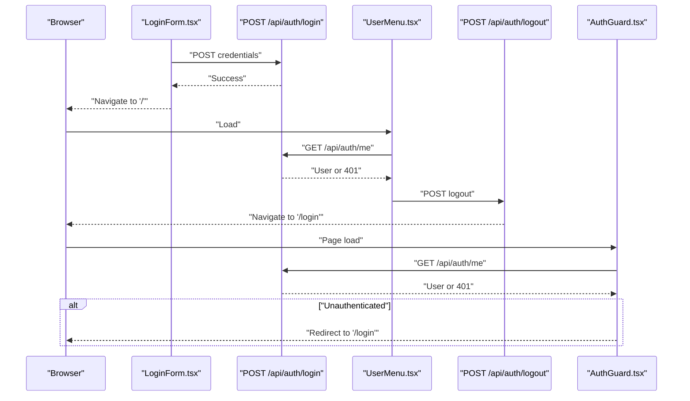
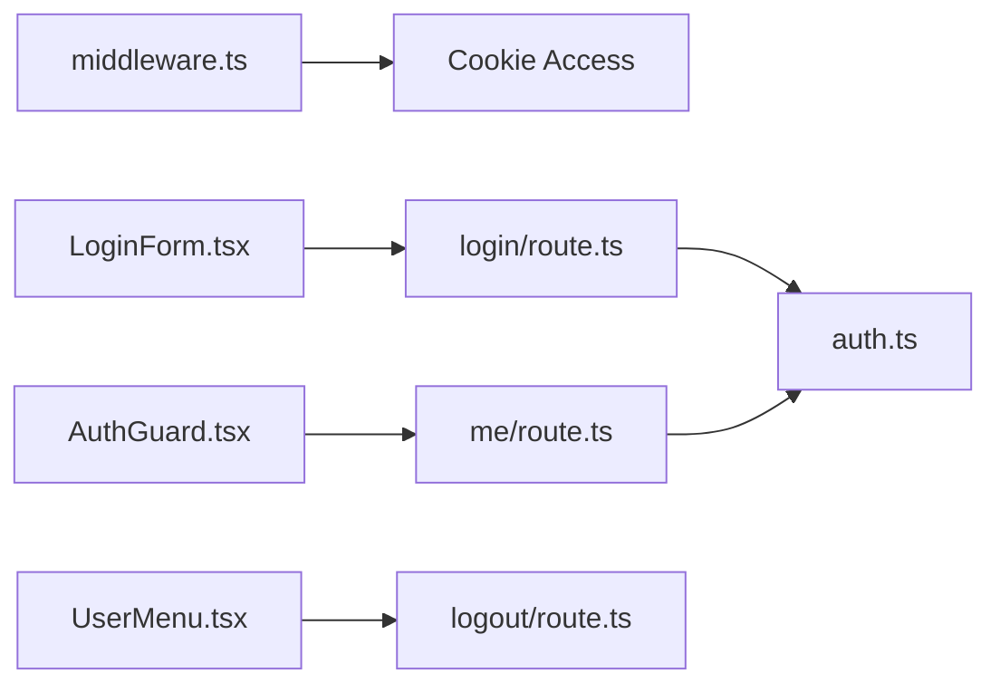

# Middleware Protection

<cite>
**Referenced Files in This Document**
- [middleware.ts](file://middleware.ts)
- [auth.ts](file://src/lib/auth.ts)
- [login/route.ts](file://src/app/api/auth/login/route.ts)
- [logout/route.ts](file://src/app/api/auth/logout/route.ts)
- [me/route.ts](file://src/app/api/auth/me/route.ts)
- [login/page.tsx](file://src/app/login/page.tsx)
- [LoginForm.tsx](file://src/components/LoginForm.tsx)
- [UserMenu.tsx](file://src/components/UserMenu.tsx)
- [AuthGuard.tsx](file://src/components/AuthGuard.tsx)
- [AUTHENTICATION.md](file://AUTHENTICATION.md)
- [package.json](file://package.json)
</cite>

## Table of Contents
1. [Introduction](#introduction)
2. [Project Structure](#project-structure)
3. [Core Components](#core-components)
4. [Architecture Overview](#architecture-overview)
5. [Detailed Component Analysis](#detailed-component-analysis)
6. [Dependency Analysis](#dependency-analysis)
7. [Performance Considerations](#performance-considerations)
8. [Troubleshooting Guide](#troubleshooting-guide)
9. [Conclusion](#conclusion)
10. [Appendices](#appendices)

## Introduction
This document explains the authentication middleware implementation and how it enforces protection across the application. It covers middleware routing logic, protected route detection, authentication enforcement, request interception, and redirect handling for unauthenticated users. It also provides guidance on middleware configuration, custom route protection rules, integration with Next.js App Router, performance considerations, middleware ordering, debugging techniques, and extension points for role-based access control and custom authentication schemes.

## Project Structure
The authentication system spans middleware, server-side authentication utilities, API routes, client components, and UI elements. The middleware sits at the edge of the request pipeline and applies global protection rules. Authentication utilities encapsulate JWT creation and verification, while API routes implement login, logout, and user info retrieval. Client components provide the login form, user menu, and a client-side guard for page-level protection.

**Diagram sources**
- [middleware.ts:1-40](file://middleware.ts#L1-L40)
- [auth.ts:1-69](file://src/lib/auth.ts#L1-L69)
- [login/route.ts:1-50](file://src/app/api/auth/login/route.ts#L1-L50)
- [logout/route.ts:1-23](file://src/app/api/auth/logout/route.ts#L1-L23)
- [me/route.ts:1-27](file://src/app/api/auth/me/route.ts#L1-L27)
- [login/page.tsx:1-12](file://src/app/login/page.tsx#L1-L12)
- [LoginForm.tsx:1-98](file://src/components/LoginForm.tsx#L1-L98)
- [UserMenu.tsx:1-104](file://src/components/UserMenu.tsx#L1-L104)
- [AuthGuard.tsx:1-53](file://src/components/AuthGuard.tsx#L1-L53)

**Section sources**
- [AUTHENTICATION.md:68-85](file://AUTHENTICATION.md#L68-L85)
- [package.json:16-43](file://package.json#L16-L43)

## Core Components
- Middleware: Applies global authentication checks, skips static assets and login routes, validates presence of a session token, and redirects or returns unauthorized responses depending on the route type.
- Authentication Utilities: Provide token creation, verification, credential validation, and helpers to fetch the current user and check authentication status.
- API Routes: Implement login (sets HttpOnly cookie), logout (clears cookie), and user info retrieval (verifies token via server).
- Client Components: Provide the login UI, user menu with logout, and a client-side guard that performs a runtime check against the user info endpoint.

Key responsibilities:
- Global protection: Enforced by middleware for pages and API routes.
- Session persistence: Managed via an HttpOnly cookie set during login.
- Runtime checks: Optional client-side guard and user info endpoint for UI state and navigation decisions.

**Section sources**
- [middleware.ts:3-35](file://middleware.ts#L3-L35)
- [auth.ts:14-69](file://src/lib/auth.ts#L14-L69)
- [login/route.ts:24-35](file://src/app/api/auth/login/route.ts#L24-L35)
- [me/route.ts:4-18](file://src/app/api/auth/me/route.ts#L4-L18)
- [login/page.tsx:5-9](file://src/app/login/page.tsx#L5-L9)
- [LoginForm.tsx:13-40](file://src/components/LoginForm.tsx#L13-L40)
- [UserMenu.tsx:36-61](file://src/components/UserMenu.tsx#L36-L61)
- [AuthGuard.tsx:14-32](file://src/components/AuthGuard.tsx#L14-L32)

## Architecture Overview
The authentication flow integrates middleware, API routes, and client components:

**Diagram sources**
- [middleware.ts:3-35](file://middleware.ts#L3-L35)
- [login/route.ts:5-41](file://src/app/api/auth/login/route.ts#L5-L41)
- [auth.ts:14-46](file://src/lib/auth.ts#L14-L46)

## Detailed Component Analysis

### Middleware Routing Logic and Protected Route Detection
- Path filtering: The middleware explicitly skips Next.js internal paths, static asset requests, the login route, and any path containing a dot (commonly static assets).
- Protected detection: After skipping, any remaining request is considered protected and requires a valid session token.
- Enforcement: If no token is present, the middleware either redirects browser requests to the login page or returns a 401 JSON response for API requests.

**Diagram sources**
- [middleware.ts:8-35](file://middleware.ts#L8-L35)

**Section sources**
- [middleware.ts:8-35](file://middleware.ts#L8-L35)

### Authentication Enforcement Mechanisms
- Token presence check: The middleware reads the cookie and enforces access based on presence.
- API vs browser behavior: API routes receive a 401 response; browser requests are redirected to the login page.
- Simplified verification: The middleware currently checks only token presence. Token signature and expiration are validated server-side via the authentication utilities and API routes.

**Diagram sources**
- [middleware.ts:19-34](file://middleware.ts#L19-L34)
- [auth.ts:19-33](file://src/lib/auth.ts#L19-L33)
- [me/route.ts:4-18](file://src/app/api/auth/me/route.ts#L4-L18)

**Section sources**
- [middleware.ts:19-34](file://middleware.ts#L19-L34)
- [auth.ts:19-33](file://src/lib/auth.ts#L19-L33)
- [me/route.ts:4-18](file://src/app/api/auth/me/route.ts#L4-L18)

### Request Interception and Redirect Handling
- Interception: The middleware intercepts all incoming requests matching its matcher and applies protection logic before passing control to the requested route.
- Redirect handling: For browser requests without a token, the middleware issues a redirect to the login page. For API requests, it returns a JSON error with a 401 status.
- Login page protection: The login page itself checks authentication and redirects authenticated users away from the login route.

**Diagram sources**
- [middleware.ts:9-17](file://middleware.ts#L9-L17)
- [login/page.tsx:5-9](file://src/app/login/page.tsx#L5-L9)

**Section sources**
- [middleware.ts:9-17](file://middleware.ts#L9-L17)
- [login/page.tsx:5-9](file://src/app/login/page.tsx#L5-L9)

### Middleware Execution Flow and Ordering
- Matcher scope: The middleware matcher targets all paths except Next.js internals and favicon, ensuring broad coverage.
- Ordering: Middleware runs before route handlers. Because the login route is explicitly skipped, login/logout/me endpoints bypass the general token check.
- Client-side guard: The AuthGuard component performs a runtime check against the user info endpoint and redirects if unauthenticated.

**Diagram sources**
- [middleware.ts:38-40](file://middleware.ts#L38-L40)
- [AuthGuard.tsx:14-32](file://src/components/AuthGuard.tsx#L14-L32)

**Section sources**
- [middleware.ts:38-40](file://middleware.ts#L38-L40)
- [AuthGuard.tsx:14-32](file://src/components/AuthGuard.tsx#L14-L32)

### Login, Logout, and User Info Endpoints
- Login: Validates credentials, creates a JWT, sets an HttpOnly cookie, and returns success data.
- Logout: Clears the auth cookie and returns success.
- User info: Verifies the token server-side and returns the current user or 401.

**Diagram sources**
- [login/route.ts:5-41](file://src/app/api/auth/login/route.ts#L5-L41)
- [auth.ts:14-46](file://src/lib/auth.ts#L14-L46)
- [me/route.ts:4-18](file://src/app/api/auth/me/route.ts#L4-L18)

**Section sources**
- [login/route.ts:5-41](file://src/app/api/auth/login/route.ts#L5-L41)
- [logout/route.ts:4-14](file://src/app/api/auth/logout/route.ts#L4-L14)
- [me/route.ts:4-18](file://src/app/api/auth/me/route.ts#L4-L18)
- [auth.ts:14-69](file://src/lib/auth.ts#L14-L69)

### Client-Side Integration and UI Components
- LoginForm: Submits credentials to the login API and navigates on success.
- UserMenu: Fetches user info and handles logout by invoking the logout API.
- AuthGuard: Performs a runtime check against the user info endpoint and redirects unauthenticated clients to the login page.

**Diagram sources**
- [LoginForm.tsx:13-40](file://src/components/LoginForm.tsx#L13-L40)
- [UserMenu.tsx:36-61](file://src/components/UserMenu.tsx#L36-L61)
- [AuthGuard.tsx:14-32](file://src/components/AuthGuard.tsx#L14-L32)
- [login/route.ts:5-41](file://src/app/api/auth/login/route.ts#L5-L41)
- [me/route.ts:4-18](file://src/app/api/auth/me/route.ts#L4-L18)
- [logout/route.ts:4-14](file://src/app/api/auth/logout/route.ts#L4-L14)

**Section sources**
- [LoginForm.tsx:13-40](file://src/components/LoginForm.tsx#L13-L40)
- [UserMenu.tsx:36-61](file://src/components/UserMenu.tsx#L36-L61)
- [AuthGuard.tsx:14-32](file://src/components/AuthGuard.tsx#L14-L32)

## Dependency Analysis
The middleware depends on the cookie store to enforce protection. The login and user info endpoints depend on the authentication utilities for token creation and verification. The client components depend on the API routes for authentication operations.

**Diagram sources**
- [middleware.ts:19-20](file://middleware.ts#L19-L20)
- [login/route.ts:2-3](file://src/app/api/auth/login/route.ts#L2-L3)
- [me/route.ts:1-2](file://src/app/api/auth/me/route.ts#L1-L2)
- [auth.ts:1-2](file://src/lib/auth.ts#L1-L2)
- [LoginForm.tsx:19-25](file://src/components/LoginForm.tsx#L19-L25)
- [UserMenu.tsx:50-52](file://src/components/UserMenu.tsx#L50-L52)
- [AuthGuard.tsx](file://src/components/AuthGuard.tsx#L17)

**Section sources**
- [middleware.ts:19-20](file://middleware.ts#L19-L20)
- [login/route.ts:2-3](file://src/app/api/auth/login/route.ts#L2-L3)
- [me/route.ts:1-2](file://src/app/api/auth/me/route.ts#L1-L2)
- [auth.ts:1-2](file://src/lib/auth.ts#L1-L2)
- [LoginForm.tsx:19-25](file://src/components/LoginForm.tsx#L19-L25)
- [UserMenu.tsx:50-52](file://src/components/UserMenu.tsx#L50-L52)
- [AuthGuard.tsx](file://src/components/AuthGuard.tsx#L17)

## Performance Considerations
- Middleware overhead: The middleware performs minimal work—reading a cookie and applying simple path checks—resulting in negligible overhead for most traffic.
- Static asset bypass: Skipping static assets avoids unnecessary processing.
- Client-side guard: The AuthGuard performs a single fetch per page load; caching or memoization can reduce redundant calls if needed.
- Cookie attributes: Using HttpOnly prevents client-side tampering and reduces risk of XSS-related token theft.
- Token verification: Server-side verification occurs only on protected endpoints, minimizing unnecessary cryptographic operations.

[No sources needed since this section provides general guidance]

## Troubleshooting Guide
Common issues and resolutions:
- Environment variables missing: Ensure authentication secrets and credentials are configured. The authentication utilities and login route rely on environment variables for secure operation.
- Middleware not applied: Verify the middleware file location and matcher configuration.
- Redirect loops: Confirm that login and static asset paths are excluded by the middleware.
- API 401 responses: Validate that the client sends the cookie and that the token is still valid.
- Client-side guard failures: Check network connectivity and CORS settings if the user info endpoint is unreachable.

**Section sources**
- [AUTHENTICATION.md:172-192](file://AUTHENTICATION.md#L172-L192)
- [auth.ts:5-11](file://src/lib/auth.ts#L5-L11)
- [login/route.ts:43-49](file://src/app/api/auth/login/route.ts#L43-L49)
- [me/route.ts:20-26](file://src/app/api/auth/me/route.ts#L20-L26)

## Conclusion
The middleware provides robust, transparent protection for pages and API routes by checking for a session token and enforcing appropriate responses. The login, logout, and user info endpoints implement secure token handling and server-side verification. Client components integrate seamlessly with these APIs to deliver a cohesive authentication experience. The system is designed for simplicity and security, with clear extension points for advanced features like role-based access control and custom authentication schemes.

[No sources needed since this section summarizes without analyzing specific files]

## Appendices

### Middleware Configuration Examples
- Matcher customization: Adjust the matcher to include or exclude specific paths. The current matcher excludes Next.js internals and favicon.
- Route exceptions: Add additional exceptions for public assets or special routes by expanding the skip conditions in the middleware.

**Section sources**
- [middleware.ts:38-40](file://middleware.ts#L38-L40)
- [middleware.ts:9-17](file://middleware.ts#L9-L17)

### Extending for Role-Based Access Control
- Token payload enhancement: Extend token creation to include roles and permissions.
- Server-side enforcement: Modify protected endpoints to validate roles from the verified token payload.
- Client-side gating: Use the user info endpoint to determine UI visibility and feature access.

**Section sources**
- [auth.ts:14-16](file://src/lib/auth.ts#L14-L16)
- [auth.ts:19-33](file://src/lib/auth.ts#L19-L33)
- [me/route.ts:4-18](file://src/app/api/auth/me/route.ts#L4-L18)

### Integrating with Next.js App Router
- Middleware placement: Keep the middleware file at the project root as configured.
- Route grouping: Use route groups or middleware matchers to apply protection selectively to specific route segments.
- Edge compatibility: Ensure cookie handling and environment variables are compatible with edge runtime constraints.

**Section sources**
- [AUTHENTICATION.md](file://AUTHENTICATION.md#L84)
- [middleware.ts:38-40](file://middleware.ts#L38-L40)