# Session Management

<cite>
**Referenced Files in This Document**
- [src/lib/auth.ts](file://src/lib/auth.ts)
- [src/app/api/auth/login/route.ts](file://src/app/api/auth/login/route.ts)
- [src/app/api/auth/logout/route.ts](file://src/app/api/auth/logout/route.ts)
- [src/app/api/auth/me/route.ts](file://src/app/api/auth/me/route.ts)
- [middleware.ts](file://middleware.ts)
- [src/components/AuthGuard.tsx](file://src/components/AuthGuard.tsx)
- [src/components/UserMenu.tsx](file://src/components/UserMenu.tsx)
- [src/components/LoginForm.tsx](file://src/components/LoginForm.tsx)
- [src/app/login/page.tsx](file://src/app/login/page.tsx)
- [AUTHENTICATION.md](file://AUTHENTICATION.md)
</cite>

## Table of Contents
1. [Introduction](#introduction)
2. [Project Structure](#project-structure)
3. [Core Components](#core-components)
4. [Architecture Overview](#architecture-overview)
5. [Detailed Component Analysis](#detailed-component-analysis)
6. [Dependency Analysis](#dependency-analysis)
7. [Performance Considerations](#performance-considerations)
8. [Security Considerations](#security-considerations)
9. [Session Lifecycle Management](#session-lifecycle-management)
10. [Troubleshooting Guide](#troubleshooting-guide)
11. [Conclusion](#conclusion)

## Introduction
This document provides comprehensive guidance for session management in the authentication system. It explains HTTP-only cookie-based session storage, token persistence, and user state management across requests. It documents the getCurrentUser and isAuthenticated functions, their role in session validation and user context establishment, and includes practical examples of session lifecycle management, automatic logout scenarios, and session refresh strategies. Security considerations such as cookie flags, SameSite policies, and CSRF protection are addressed, along with guidance on implementing custom session behaviors, session timeout handling, and integration with frontend state management libraries.

## Project Structure
The authentication system is organized around a small set of focused modules:
- Backend authentication utilities and API routes
- Middleware for request-level protection
- Frontend guard and UI components for user interaction
- Environment-driven configuration for credentials and secrets

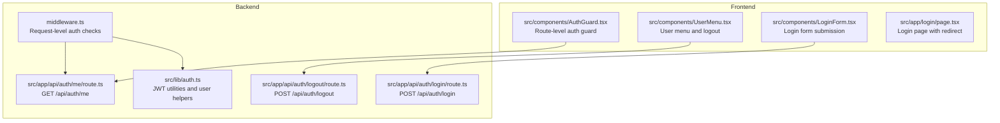

**Diagram sources**
- [src/lib/auth.ts:1-69](file://src/lib/auth.ts#L1-L69)
- [src/app/api/auth/login/route.ts:1-50](file://src/app/api/auth/login/route.ts#L1-L50)
- [src/app/api/auth/logout/route.ts:1-23](file://src/app/api/auth/logout/route.ts#L1-L23)
- [src/app/api/auth/me/route.ts:1-27](file://src/app/api/auth/me/route.ts#L1-L27)
- [middleware.ts:1-40](file://middleware.ts#L1-L40)
- [src/components/AuthGuard.tsx:1-53](file://src/components/AuthGuard.tsx#L1-L53)
- [src/components/UserMenu.tsx:1-104](file://src/components/UserMenu.tsx#L1-L104)
- [src/components/LoginForm.tsx:1-98](file://src/components/LoginForm.tsx#L1-L98)
- [src/app/login/page.tsx:1-12](file://src/app/login/page.tsx#L1-L12)

**Section sources**
- [AUTHENTICATION.md:68-85](file://AUTHENTICATION.md#L68-L85)

## Core Components
- Authentication utilities: JWT creation, verification, credential validation, and user retrieval helpers.
- Login API: Validates credentials, creates a JWT, and sets an HTTP-only cookie.
- Logout API: Removes the authentication cookie.
- User info API: Returns the current user based on the cookie token.
- Middleware: Enforces authentication for protected routes and API endpoints.
- Frontend guard: Checks authentication state on route transitions and redirects unauthenticated users.
- User menu: Fetches current user and handles logout.
- Login form: Submits credentials to the backend and navigates on success.

Key functions:
- getCurrentUser: Reads the auth cookie, verifies the JWT, and returns user context.
- isAuthenticated: Determines whether a user is logged in based on token validity.

**Section sources**
- [src/lib/auth.ts:48-69](file://src/lib/auth.ts#L48-L69)
- [src/app/api/auth/me/route.ts:4-27](file://src/app/api/auth/me/route.ts#L4-L27)
- [src/app/api/auth/login/route.ts:5-50](file://src/app/api/auth/login/route.ts#L5-L50)
- [src/app/api/auth/logout/route.ts:4-23](file://src/app/api/auth/logout/route.ts#L4-L23)
- [middleware.ts:3-40](file://middleware.ts#L3-L40)
- [src/components/AuthGuard.tsx:10-32](file://src/components/AuthGuard.tsx#L10-L32)
- [src/components/UserMenu.tsx:16-61](file://src/components/UserMenu.tsx#L16-L61)
- [src/components/LoginForm.tsx:13-40](file://src/components/LoginForm.tsx#L13-L40)

## Architecture Overview
The system uses HTTP-only cookies to store JWT tokens server-side. The frontend interacts with API endpoints to authenticate, retrieve user info, and log out. Middleware enforces authentication for protected routes and API endpoints.

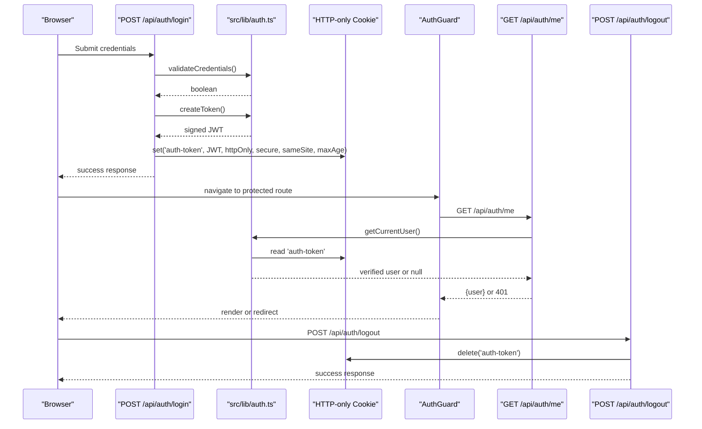

**Diagram sources**
- [src/app/api/auth/login/route.ts:5-50](file://src/app/api/auth/login/route.ts#L5-L50)
- [src/lib/auth.ts:14-33](file://src/lib/auth.ts#L14-L33)
- [src/app/api/auth/me/route.ts:4-27](file://src/app/api/auth/me/route.ts#L4-L27)
- [src/components/AuthGuard.tsx:14-32](file://src/components/AuthGuard.tsx#L14-L32)
- [src/app/api/auth/logout/route.ts:4-23](file://src/app/api/auth/logout/route.ts#L4-L23)

## Detailed Component Analysis

### Authentication Utilities (src/lib/auth.ts)
Responsibilities:
- JWT signing and verification using a server-side secret.
- Credential validation against environment variables.
- User retrieval from the auth cookie.

Important behaviors:
- Token creation sets expiration to seven days.
- Token verification returns null on failure, enabling safe fallbacks.
- getCurrentUser reads the cookie and verifies the token synchronously.
- isAuthenticated delegates to getCurrentUser and checks for null.

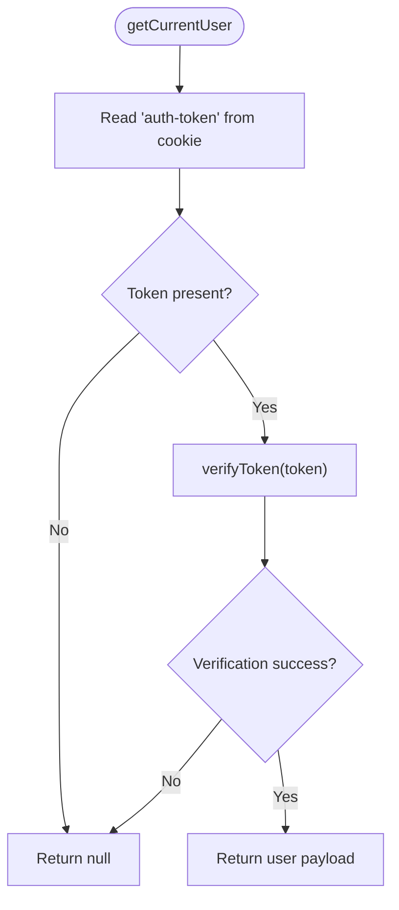

**Diagram sources**
- [src/lib/auth.ts:48-63](file://src/lib/auth.ts#L48-L63)
- [src/lib/auth.ts:19-33](file://src/lib/auth.ts#L19-L33)

**Section sources**
- [src/lib/auth.ts:14-33](file://src/lib/auth.ts#L14-L33)
- [src/lib/auth.ts:48-69](file://src/lib/auth.ts#L48-L69)

### Login API (src/app/api/auth/login/route.ts)
Responsibilities:
- Validate request payload.
- Authenticate credentials via environment variables.
- Create a JWT and set an HTTP-only cookie with secure flags and SameSite policy.

Cookie configuration:
- httpOnly: Prevents client-side script access.
- secure: Enabled in production environments.
- sameSite: Lax policy for CSRF protection balance.
- maxAge: Seven days.
- path: Root path.

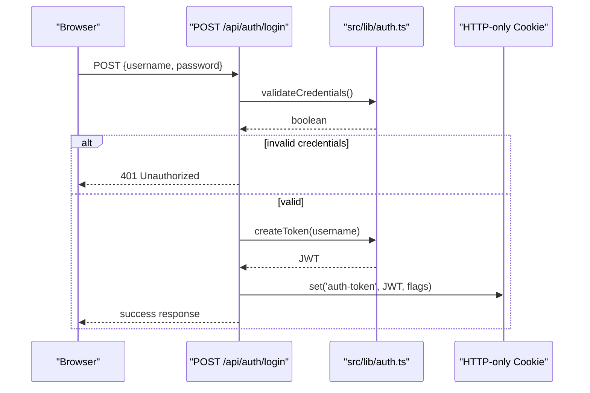

**Diagram sources**
- [src/app/api/auth/login/route.ts:5-50](file://src/app/api/auth/login/route.ts#L5-L50)
- [src/lib/auth.ts:36-46](file://src/lib/auth.ts#L36-L46)
- [src/lib/auth.ts:14-16](file://src/lib/auth.ts#L14-L16)

**Section sources**
- [src/app/api/auth/login/route.ts:5-50](file://src/app/api/auth/login/route.ts#L5-L50)

### Logout API (src/app/api/auth/logout/route.ts)
Responsibilities:
- Remove the auth cookie to terminate the session.

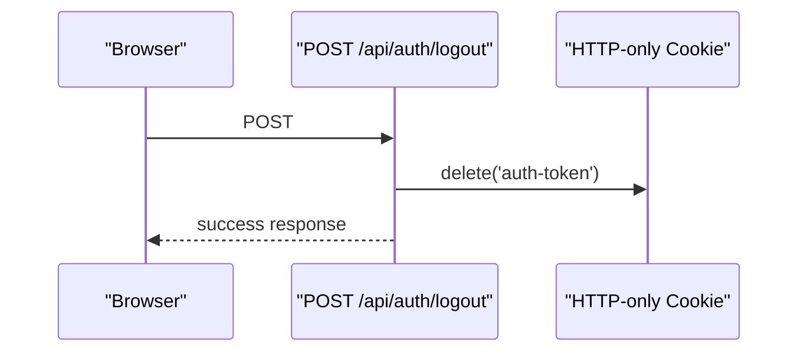

**Diagram sources**
- [src/app/api/auth/logout/route.ts:4-23](file://src/app/api/auth/logout/route.ts#L4-L23)

**Section sources**
- [src/app/api/auth/logout/route.ts:4-23](file://src/app/api/auth/logout/route.ts#L4-L23)

### User Info API (src/app/api/auth/me/route.ts)
Responsibilities:
- Return the current user based on the auth cookie.
- Respond with 401 when no user is authenticated.

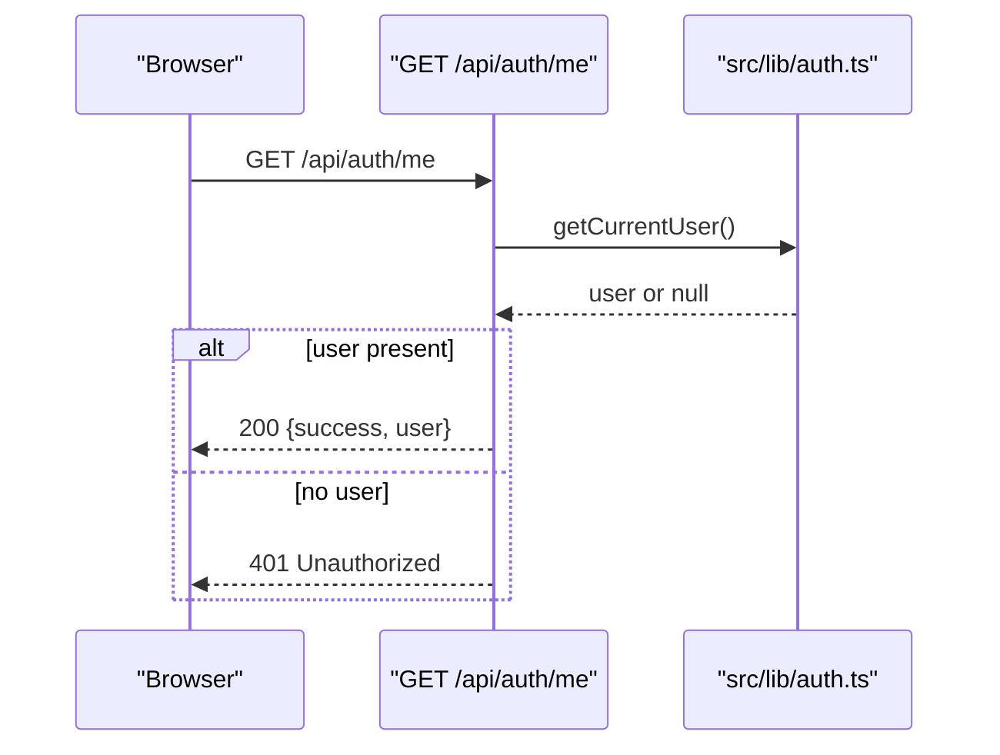

**Diagram sources**
- [src/app/api/auth/me/route.ts:4-27](file://src/app/api/auth/me/route.ts#L4-L27)
- [src/lib/auth.ts:48-63](file://src/lib/auth.ts#L48-L63)

**Section sources**
- [src/app/api/auth/me/route.ts:4-27](file://src/app/api/auth/me/route.ts#L4-L27)

### Middleware Protection (middleware.ts)
Responsibilities:
- Skip authentication for static assets, Next.js internal paths, login route, and login page.
- Extract the auth cookie and enforce authentication for protected routes and API endpoints.
- Redirect unauthenticated users to the login page or return 401 for API routes.

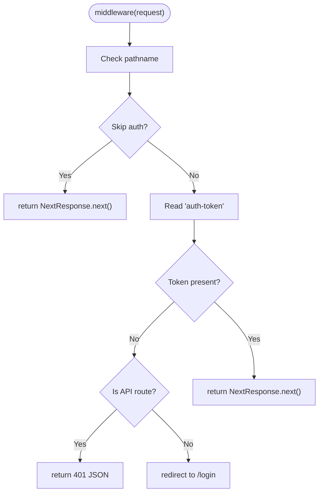

**Diagram sources**
- [middleware.ts:3-40](file://middleware.ts#L3-L40)

**Section sources**
- [middleware.ts:3-40](file://middleware.ts#L3-L40)

### Frontend Guard (src/components/AuthGuard.tsx)
Responsibilities:
- On mount, fetch /api/auth/me to determine authentication state.
- If authenticated, render children; otherwise redirect to /login and show loading state.

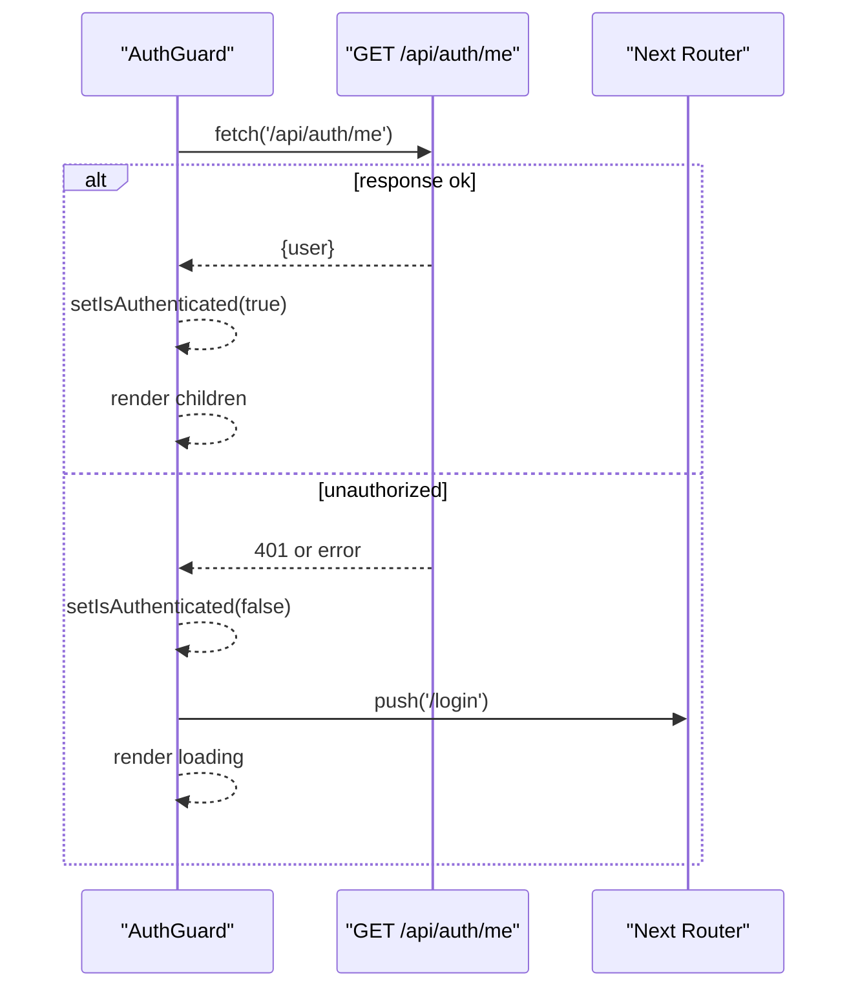

**Diagram sources**
- [src/components/AuthGuard.tsx:14-32](file://src/components/AuthGuard.tsx#L14-L32)
- [src/app/api/auth/me/route.ts:4-27](file://src/app/api/auth/me/route.ts#L4-L27)

**Section sources**
- [src/components/AuthGuard.tsx:10-53](file://src/components/AuthGuard.tsx#L10-L53)

### User Menu (src/components/UserMenu.tsx)
Responsibilities:
- Fetch current user on mount.
- Provide logout action that clears the cookie and refreshes navigation.

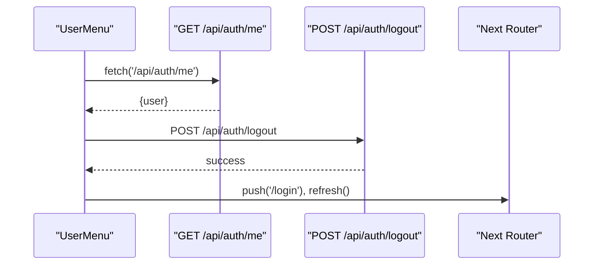

**Diagram sources**
- [src/components/UserMenu.tsx:16-61](file://src/components/UserMenu.tsx#L16-L61)
- [src/app/api/auth/me/route.ts:4-27](file://src/app/api/auth/me/route.ts#L4-L27)
- [src/app/api/auth/logout/route.ts:4-23](file://src/app/api/auth/logout/route.ts#L4-L23)

**Section sources**
- [src/components/UserMenu.tsx:10-104](file://src/components/UserMenu.tsx#L10-L104)

### Login Form (src/components/LoginForm.tsx)
Responsibilities:
- Submit credentials to the backend.
- Navigate on success and display errors on failure.

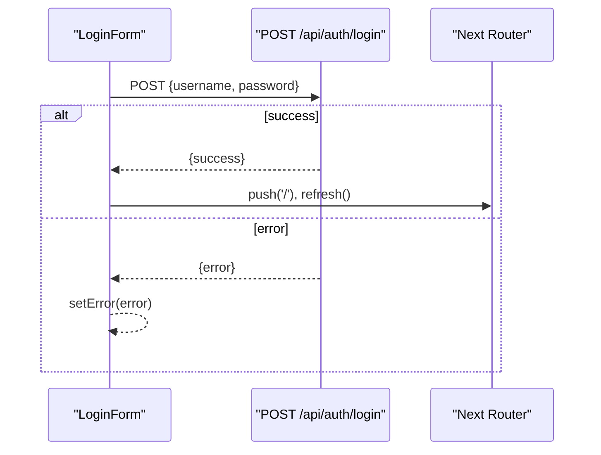

**Diagram sources**
- [src/components/LoginForm.tsx:13-40](file://src/components/LoginForm.tsx#L13-L40)
- [src/app/api/auth/login/route.ts:5-50](file://src/app/api/auth/login/route.ts#L5-L50)

**Section sources**
- [src/components/LoginForm.tsx:6-98](file://src/components/LoginForm.tsx#L6-L98)

## Dependency Analysis
The system exhibits clear separation of concerns:
- Backend utilities depend on environment variables and JWT library.
- API routes depend on authentication utilities for token creation/verification.
- Middleware depends on the presence of the auth cookie.
- Frontend guard and menu depend on API endpoints for user state.
- Login page depends on isAuthenticated to prevent re-login.

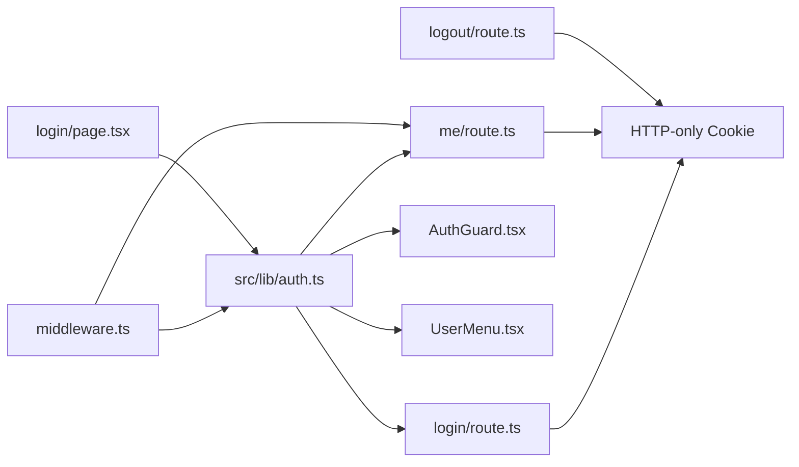

**Diagram sources**
- [src/lib/auth.ts:1-69](file://src/lib/auth.ts#L1-L69)
- [src/app/api/auth/login/route.ts:1-50](file://src/app/api/auth/login/route.ts#L1-L50)
- [src/app/api/auth/logout/route.ts:1-23](file://src/app/api/auth/logout/route.ts#L1-L23)
- [src/app/api/auth/me/route.ts:1-27](file://src/app/api/auth/me/route.ts#L1-L27)
- [middleware.ts:1-40](file://middleware.ts#L1-L40)
- [src/components/AuthGuard.tsx:1-53](file://src/components/AuthGuard.tsx#L1-L53)
- [src/components/UserMenu.tsx:1-104](file://src/components/UserMenu.tsx#L1-L104)
- [src/app/login/page.tsx:1-12](file://src/app/login/page.tsx#L1-L12)

**Section sources**
- [src/lib/auth.ts:1-69](file://src/lib/auth.ts#L1-L69)
- [middleware.ts:1-40](file://middleware.ts#L1-L40)

## Performance Considerations
- Token verification occurs on every request to protected routes and API endpoints. Consider caching verified user contexts at the edge or in a server-side cache for high-traffic scenarios.
- The middleware performs a lightweight check by reading the cookie. Keep the cookie small and avoid unnecessary parsing overhead.
- Minimize network round-trips by combining user info fetching with initial page loads where possible.
- Use efficient cookie flags to reduce browser overhead and improve security.

## Security Considerations
Cookie flags and policies:
- httpOnly: Prevents XSS attacks by blocking client-side access to the cookie.
- secure: Ensures cookies are transmitted only over HTTPS in production.
- sameSite: Lax policy balances CSRF protection while maintaining usability for cross-site navigation.
- maxAge: Seven-day session duration; adjust based on risk tolerance.
- path: Root path ensures the cookie is sent with all routes.

CSRF protection:
- The current implementation relies on SameSite=Lax and server-side JWT verification. For stricter CSRF protection, consider adding anti-CSRF tokens in forms and validating them server-side.

Additional recommendations:
- Implement rate limiting on login attempts.
- Rotate JWT secrets periodically.
- Use HTTPS in production environments.
- Consider short-lived access tokens with refresh tokens for enhanced security.

**Section sources**
- [src/app/api/auth/login/route.ts:28-35](file://src/app/api/auth/login/route.ts#L28-L35)
- [AUTHENTICATION.md:51-67](file://AUTHENTICATION.md#L51-L67)

## Session Lifecycle Management
Typical lifecycle:
- Login: Submit credentials to /api/auth/login; server validates and sets an HTTP-only cookie with JWT.
- Access: Middleware checks the cookie for protected routes; API endpoints call getCurrentUser to validate.
- Refresh: The frontend guard and user menu fetch /api/auth/me to establish or refresh user context.
- Logout: POST /api/auth/logout removes the cookie and terminates the session.

Automatic logout scenarios:
- Session expiration: When the JWT expires, getCurrentUser returns null, causing the guard to redirect to /login.
- Manual logout: Deleting the cookie triggers immediate invalidation.
- Middleware enforcement: Requests without a valid token receive 401 for API routes or redirect for pages.

Session refresh strategies:
- Frontend guard: On route transitions, fetch /api/auth/me to confirm authentication.
- User menu: On mount, fetch /api/auth/me to populate user context.
- Periodic polling: Optionally poll /api/auth/me to keep user state fresh (use judiciously to avoid unnecessary load).

**Section sources**
- [src/app/api/auth/login/route.ts:28-35](file://src/app/api/auth/login/route.ts#L28-L35)
- [src/app/api/auth/me/route.ts:4-27](file://src/app/api/auth/me/route.ts#L4-L27)
- [src/components/AuthGuard.tsx:14-32](file://src/components/AuthGuard.tsx#L14-L32)
- [src/components/UserMenu.tsx:36-46](file://src/components/UserMenu.tsx#L36-L46)
- [middleware.ts:22-30](file://middleware.ts#L22-L30)

## Troubleshooting Guide
Common issues and resolutions:
- Login fails with invalid credentials:
  - Verify environment variables for usernames/passwords and JWT secret.
  - Check browser console for error messages.
- Session appears expired unexpectedly:
  - Confirm JWT secret configuration and server time synchronization.
  - Review cookie flags and SameSite policy.
- Middleware redirect loops:
  - Ensure static assets and login routes are excluded from middleware checks.
  - Verify cookie presence and correct path configuration.
- Frontend guard stuck on loading:
  - Inspect /api/auth/me endpoint responses and network tab for errors.
  - Confirm that the auth cookie is being sent with requests.

**Section sources**
- [AUTHENTICATION.md:179-192](file://AUTHENTICATION.md#L179-L192)
- [src/app/api/auth/me/route.ts:20-26](file://src/app/api/auth/me/route.ts#L20-L26)
- [middleware.ts:8-17](file://middleware.ts#L8-L17)

## Conclusion
The authentication system employs HTTP-only cookie-based sessions with JWT tokens for secure, stateless user validation. The getCurrentUser and isAuthenticated functions centralize session validation and user context establishment. The middleware, frontend guard, and API endpoints work together to enforce authentication, manage session lifecycles, and support logout and refresh strategies. By following the security recommendations and leveraging the provided components, developers can implement robust session management tailored to their application’s needs.