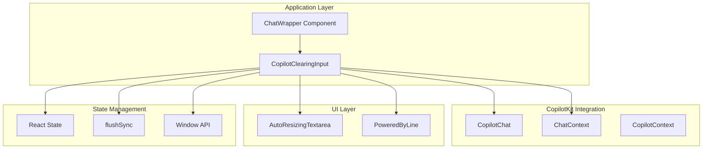
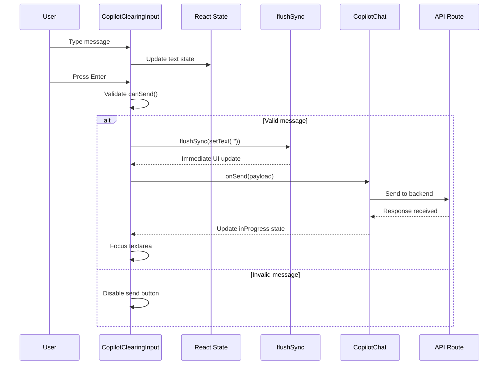
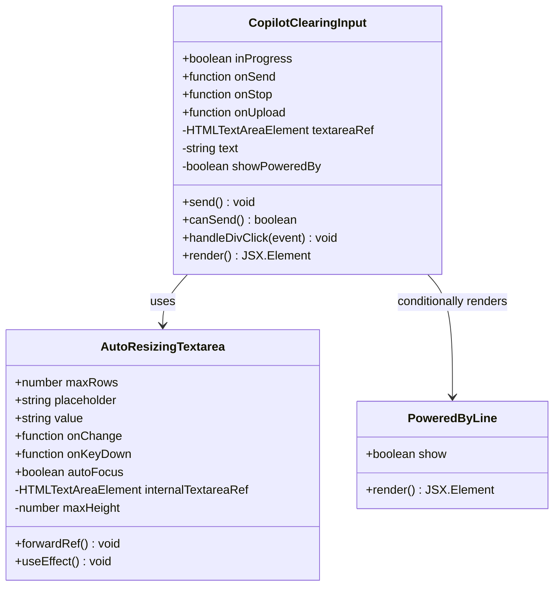
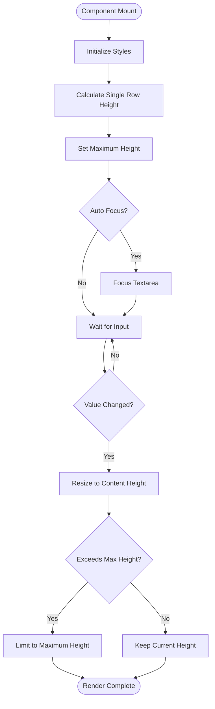
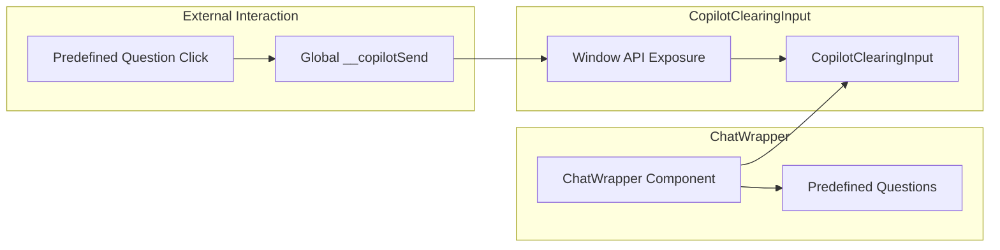
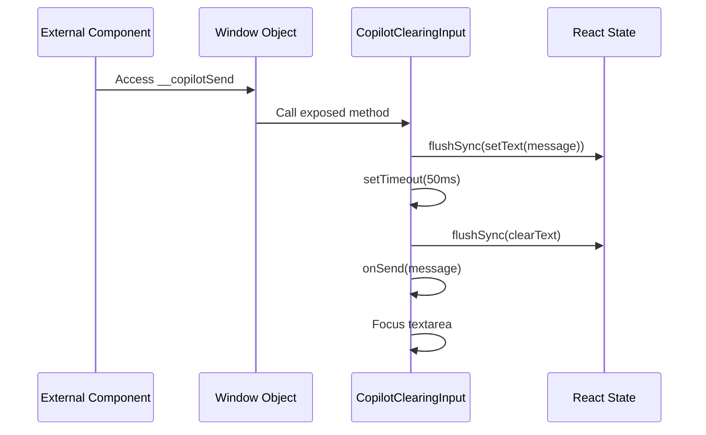

# Copilot Clearing Input

<cite>
**Referenced Files in This Document**
- [copilot-clearing-input.tsx](file://src/components/copilot-clearing-input.tsx)
- [chat-wrapper.tsx](file://src/components/chat-wrapper.tsx)
- [layout.tsx](file://src/app/copilotkit/layout.tsx)
- [page.tsx](file://src/app/copilotkit/page.tsx)
- [route.ts](file://src/app/api/copilotkit/route.ts)
- [health/route.ts](file://src/app/api/copilotkit/health/route.ts)
- [package.json](file://package.json)
</cite>

## Table of Contents
1. [Introduction](#introduction)
2. [Project Structure](#project-structure)
3. [Core Components](#core-components)
4. [Architecture Overview](#architecture-overview)
5. [Detailed Component Analysis](#detailed-component-analysis)
6. [Integration Patterns](#integration-patterns)
7. [Performance Considerations](#performance-considerations)
8. [Troubleshooting Guide](#troubleshooting-guide)
9. [Conclusion](#conclusion)

## Introduction

The Copilot Clearing Input is a specialized input component designed for the Goal Mate AI assistant system. It provides a reliable chat interface with automatic message clearing functionality after sending, ensuring a clean user experience during AI-assisted conversations. This component extends the standard CopilotKit input with enhanced state management and user interaction capabilities.

The component addresses a critical UX challenge in AI chat interfaces: maintaining a clean input field after message submission while preserving the responsive feel of real-time communication. It achieves this through sophisticated React state management and flushSync synchronization techniques.

## Project Structure

The Copilot Clearing Input is integrated into the Goal Mate application's chat system through a layered architecture:

**Diagram sources**
- [chat-wrapper.tsx:15-819](file://src/components/chat-wrapper.tsx#L15-L819)
- [copilot-clearing-input.tsx:84-197](file://src/components/copilot-clearing-input.tsx#L84-L197)

**Section sources**
- [chat-wrapper.tsx:1-200](file://src/components/chat-wrapper.tsx#L1-L200)
- [copilot-clearing-input.tsx:1-197](file://src/components/copilot-clearing-input.tsx#L1-L197)

## Core Components

The Copilot Clearing Input system consists of several interconnected components working together to provide a seamless chat experience:

### Primary Components

1. **CopilotClearingInput**: Main component that manages input state and clearing behavior
2. **AutoResizingTextarea**: Custom textarea with dynamic height adjustment
3. **PoweredByLine**: Optional branding component for CopilotKit integration
4. **ChatWrapper**: Integration layer that connects the input to the broader application

### Key Features

- **Automatic Message Clearing**: Ensures input field is cleared immediately after sending
- **Reliable State Synchronization**: Uses flushSync for immediate UI updates
- **Intelligent Send Controls**: Prevents duplicate submissions and handles interruptions
- **Responsive Design**: Adapts to content length with auto-resizing capabilities
- **Accessibility Support**: Proper keyboard navigation and screen reader compatibility

**Section sources**
- [copilot-clearing-input.tsx:84-197](file://src/components/copilot-clearing-input.tsx#L84-L197)
- [chat-wrapper.tsx:15-819](file://src/components/chat-wrapper.tsx#L15-L819)

## Architecture Overview

The Copilot Clearing Input follows a sophisticated architecture that integrates with the broader CopilotKit ecosystem:

**Diagram sources**
- [copilot-clearing-input.tsx:127-141](file://src/components/copilot-clearing-input.tsx#L127-L141)
- [copilot-clearing-input.tsx:143-151](file://src/components/copilot-clearing-input.tsx#L143-L151)

The architecture ensures that:
- State updates are synchronized immediately with UI changes
- User feedback is provided through visual indicators
- The system handles concurrent operations gracefully
- Error conditions are managed without breaking the user experience

**Section sources**
- [copilot-clearing-input.tsx:105-125](file://src/components/copilot-clearing-input.tsx#L105-L125)
- [copilot-clearing-input.tsx:127-141](file://src/components/copilot-clearing-input.tsx#L127-L141)

## Detailed Component Analysis

### CopilotClearingInput Component

The main component implements sophisticated state management and user interaction handling:

**Diagram sources**
- [copilot-clearing-input.tsx:84-197](file://src/components/copilot-clearing-input.tsx#L84-L197)
- [copilot-clearing-input.tsx:16-71](file://src/components/copilot-clearing-input.tsx#L16-L71)

#### State Management Architecture

The component uses React hooks for state management with careful consideration for timing and synchronization:

| Hook | Purpose | Implementation Details |
|------|---------|----------------------|
| `useState` | Manages input text content | Tracks current message being typed |
| `useRef` | References DOM elements | Maintains textarea element access |
| `useEffect` | Side effects and lifecycle | Handles window API exposure and cleanup |
| `useImperativeHandle` | Exposes imperative methods | Enables external component interaction |

#### Key Methods and Their Responsibilities

1. **`send()` Method**: Processes message submission with immediate clearing
2. **`canSend()` Method**: Validates send conditions and prevents duplicates
3. **`handleDivClick()` Method**: Improves accessibility and user experience
4. **`AutoResizingTextarea` Component**: Provides dynamic height adjustment

**Section sources**
- [copilot-clearing-input.tsx:84-197](file://src/components/copilot-clearing-input.tsx#L84-L197)

### AutoResizingTextarea Component

The custom textarea component provides intelligent height management:

**Diagram sources**
- [copilot-clearing-input.tsx:16-71](file://src/components/copilot-clearing-input.tsx#L16-L71)

**Section sources**
- [copilot-clearing-input.tsx:16-71](file://src/components/copilot-clearing-input.tsx#L16-L71)

### Integration with Chat System

The component integrates seamlessly with the broader chat system through the ChatWrapper:

**Diagram sources**
- [chat-wrapper.tsx:116-125](file://src/components/chat-wrapper.tsx#L116-L125)
- [copilot-clearing-input.tsx:105-125](file://src/components/copilot-clearing-input.tsx#L105-L125)

**Section sources**
- [chat-wrapper.tsx:116-125](file://src/components/chat-wrapper.tsx#L116-L125)
- [copilot-clearing-input.tsx:105-125](file://src/components/copilot-clearing-input.tsx#L105-L125)

## Integration Patterns

### Window API Exposure Pattern

The component exposes a global method for external interaction:

**Diagram sources**
- [copilot-clearing-input.tsx:105-125](file://src/components/copilot-clearing-input.tsx#L105-L125)

### State Synchronization Pattern

The component uses flushSync for immediate state updates:

| Operation | Method Used | Purpose |
|-----------|-------------|---------|
| Clear Input | `flushSync(setText(""))` | Immediate UI update |
| Set Message | `flushSync(setText(message))` | Reliable state propagation |
| Focus Element | `requestAnimationFrame()` | Optimal timing for DOM manipulation |

**Section sources**
- [copilot-clearing-input.tsx:105-125](file://src/components/copilot-clearing-input.tsx#L105-L125)
- [copilot-clearing-input.tsx:127-141](file://src/components/copilot-clearing-input.tsx#L127-L141)

## Performance Considerations

### Rendering Optimization

The component implements several performance optimizations:

1. **Conditional Rendering**: PoweredByLine only renders when needed
2. **Efficient State Updates**: Minimal re-renders through targeted state changes
3. **Memory Management**: Proper cleanup of window API exposure
4. **DOM Manipulation**: Optimized timing for height calculations

### Memory Management

Proper cleanup is essential for preventing memory leaks:

- Window API method removal on component unmount
- Event listener cleanup in useEffect return functions
- Ref cleanup for DOM elements

### Accessibility Considerations

The component includes built-in accessibility features:

- Keyboard navigation support
- Screen reader compatibility
- Focus management
- Proper ARIA attributes

**Section sources**
- [copilot-clearing-input.tsx:122-125](file://src/components/copilot-clearing-input.tsx#L122-L125)
- [copilot-clearing-input.tsx:96-101](file://src/components/copilot-clearing-input.tsx#L96-L101)

## Troubleshooting Guide

### Common Issues and Solutions

#### Issue: Input Not Clearing After Send
**Symptoms**: Message remains in input field after submission
**Causes**: 
- flushSync not working properly
- State update conflicts
- Component unmounting

**Solutions**:
1. Verify flushSync implementation is working
2. Check for component state conflicts
3. Ensure proper cleanup in useEffect

#### Issue: Send Button Disabled Unexpectedly
**Symptoms**: Send button appears disabled when it should be enabled
**Causes**:
- Interrupt event detection
- inProgress state conflicts
- Validation logic errors

**Solutions**:
1. Review canSend() method logic
2. Check langGraphInterruptAction state
3. Verify inProgress prop updates

#### Issue: Auto-resize Not Working
**Symptoms**: Textarea doesn't adjust height to content
**Causes**:
- Height calculation errors
- CSS conflicts
- Ref access issues

**Solutions**:
1. Verify maxHeight calculation
2. Check CSS overflow properties
3. Ensure ref is properly attached

**Section sources**
- [copilot-clearing-input.tsx:143-151](file://src/components/copilot-clearing-input.tsx#L143-L151)
- [copilot-clearing-input.tsx:32-50](file://src/components/copilot-clearing-input.tsx#L32-L50)

### Debugging Techniques

1. **Console Logging**: Use browser developer tools to monitor state changes
2. **React DevTools**: Inspect component props and state
3. **Network Monitoring**: Track API calls and responses
4. **Performance Profiling**: Identify rendering bottlenecks

### Environment Configuration

Ensure proper environment setup for optimal functionality:

- Verify CopilotKit runtime URL configuration
- Check API key availability
- Confirm database connectivity
- Validate model configuration

**Section sources**
- [layout.tsx:5-19](file://src/app/copilotkit/layout.tsx#L5-L19)
- [health/route.ts:1-32](file://src/app/api/copilotkit/health/route.ts#L1-L32)

## Conclusion

The Copilot Clearing Input represents a sophisticated solution to a common UX challenge in AI chat interfaces. Through careful implementation of React state management, synchronization techniques, and integration patterns, it provides a reliable and responsive chat experience.

Key achievements include:
- **Reliable Message Clearing**: Ensures immediate UI feedback after message submission
- **Robust State Management**: Handles complex state transitions without conflicts
- **Seamless Integration**: Works harmoniously with the broader CopilotKit ecosystem
- **Performance Optimization**: Minimizes rendering overhead while maintaining responsiveness
- **Accessibility Compliance**: Supports diverse user needs and abilities

The component serves as an excellent example of how thoughtful engineering can enhance user experience in AI-powered applications. Its modular design and clear separation of concerns make it maintainable and extensible for future enhancements.