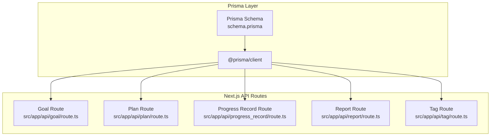
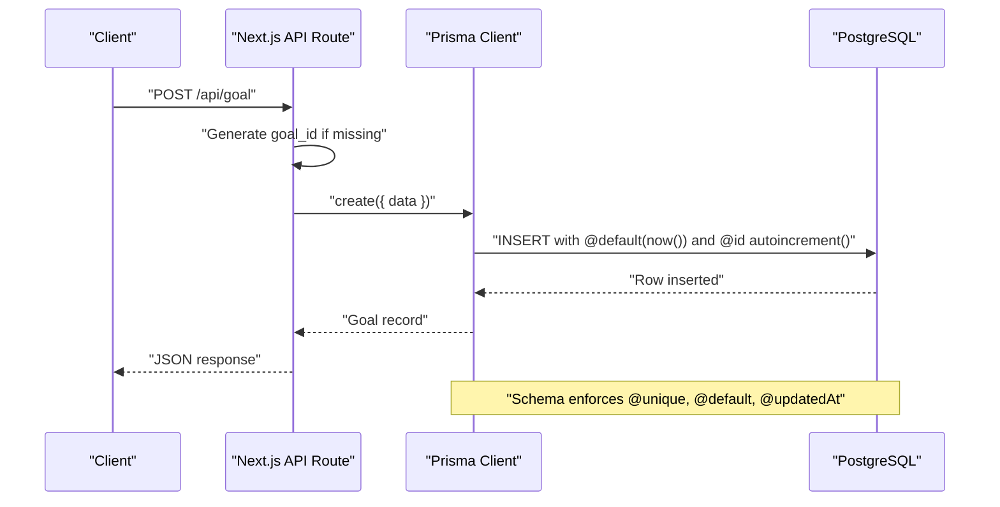
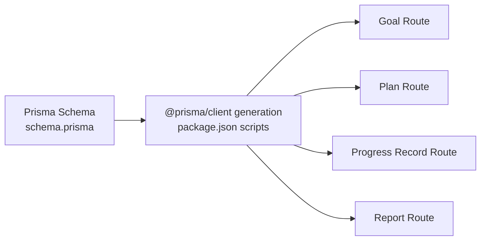

# Data Types and Validation

<cite>
**Referenced Files in This Document**
- [schema.prisma](file://prisma/schema.prisma)
- [package.json](file://package.json)
- [route.ts (Goal)](file://src/app/api/goal/route.ts)
- [route.ts (Plan)](file://src/app/api/plan/route.ts)
- [route.ts (Progress Record)](file://src/app/api/progress_record/route.ts)
- [route.ts (Report)](file://src/app/api/report/route.ts)
- [route.ts (Tag)](file://src/app/api/tag/route.ts)
</cite>

## Table of Contents
1. [Introduction](#introduction)
2. [Project Structure](#project-structure)
3. [Core Components](#core-components)
4. [Architecture Overview](#architecture-overview)
5. [Detailed Component Analysis](#detailed-component-analysis)
6. [Dependency Analysis](#dependency-analysis)
7. [Performance Considerations](#performance-considerations)
8. [Troubleshooting Guide](#troubleshooting-guide)
9. [Conclusion](#conclusion)

## Introduction
This document explains the data types and validation rules defined in the Prisma schema for the Goal-Mate application. It focuses on how fields are typed (String, Int, DateTime, Float, Boolean), how constraints are enforced (@id, @unique, @default, @updatedAt), how optional fields are modeled with the ? suffix, and how timestamps and defaults behave. It also outlines field-level implications for data integrity and application behavior, and provides practical examples of data type choices and their rationale.

## Project Structure
The data model is defined centrally in the Prisma schema and consumed by Next.js API routes that handle CRUD operations. The Prisma client is generated and used by the backend to enforce schema-level constraints and defaults.

**Diagram sources**
- [schema.prisma](file://prisma/schema.prisma)
- [route.ts (Goal)](file://src/app/api/goal/route.ts)
- [route.ts (Plan)](file://src/app/api/plan/route.ts)
- [route.ts (Progress Record)](file://src/app/api/progress_record/route.ts)
- [route.ts (Report)](file://src/app/api/report/route.ts)
- [route.ts (Tag)](file://src/app/api/tag/route.ts)

**Section sources**
- [schema.prisma](file://prisma/schema.prisma)
- [package.json](file://package.json)

## Core Components
This section summarizes the data types and validation rules per model, with emphasis on:
- Field types: String, Int, DateTime, Float, Boolean
- Constraints: @id, @unique, @default, @updatedAt
- Optional fields: represented by the ? suffix
- Timestamp management and defaults
- Practical implications for application logic

Key observations:
- Auto-increment primary keys via @id @default(autoincrement()) on integer ids
- String identifiers with @unique for stable external references (e.g., goal_id, plan_id, report_id)
- DateTime fields with @default(now()) for creation timestamps and @updatedAt for updates
- Numeric defaults for Float and Boolean fields to ensure sensible initial states
- Optional fields using String? to allow nulls where appropriate

**Section sources**
- [schema.prisma](file://prisma/schema.prisma)

## Architecture Overview
The Prisma schema defines the canonical data model. API routes accept JSON payloads, apply minimal application-level transformations (such as generating stable string identifiers), and delegate persistence and constraint enforcement to the Prisma client. The client enforces schema-level defaults and validations.

**Diagram sources**
- [route.ts (Goal)](file://src/app/api/goal/route.ts)
- [schema.prisma](file://prisma/schema.prisma)

## Detailed Component Analysis

### Goal Model
- Fields and types:
  - id: Int @id @default(autoincrement())
  - gmt_create: DateTime @default(now())
  - gmt_modified: DateTime @updatedAt
  - goal_id: String @unique
  - tag: String
  - name: String
  - description: String? (optional)
- Validation and defaults:
  - Primary key auto-increment enforced by @id and @default(autoincrement())
  - Creation timestamp populated automatically by @default(now())
  - Last-modified timestamp updated automatically by @updatedAt
  - goal_id is unique; attempts to insert duplicates will fail at the database level
  - description is nullable; absence implies null
- Optional field handling:
  - description uses String? to permit nulls; application logic should treat null as “no description”
- Timestamp management:
  - gmt_create and gmt_modified are managed by Prisma; application code does not override unless explicitly required
- Example usage:
  - Stable external references: goal_id enables linking from other models or UIs without exposing internal integer ids
  - Filtering by tag: tag is a String and used for filtering in API routes

**Section sources**
- [schema.prisma](file://prisma/schema.prisma)
- [route.ts (Goal)](file://src/app/api/goal/route.ts)

### Plan Model
- Fields and types:
  - id: Int @id @default(autoincrement())
  - gmt_create: DateTime @default(now())
  - gmt_modified: DateTime @updatedAt
  - plan_id: String @unique
  - name: String
  - description: String? (optional)
  - difficulty: String? (optional)
  - progress: Float @default(0)
  - is_recurring: Boolean @default(false)
  - recurrence_type: String? (optional)
  - recurrence_value: String? (optional)
  - priority_quadrant: String? (optional)
  - is_scheduled: Boolean @default(false)
- Validation and defaults:
  - Unique plan_id ensures stable external references
  - progress initialized to 0; is_recurring and is_scheduled default to false
  - Optional fields allow partial updates and flexible scheduling metadata
- Optional field handling:
  - All optional fields use String? or Boolean? to allow nulls
- Timestamp management:
  - Automatic creation and modification timestamps via @default(now()) and @updatedAt
- Example usage:
  - Recurring tasks: is_recurring, recurrence_type, recurrence_value enable scheduling logic
  - Priority quadrant: priority_quadrant supports Eisenhower matrix categorization
  - Scheduled visibility: is_scheduled toggles display in the planner

**Section sources**
- [schema.prisma](file://prisma/schema.prisma)
- [route.ts (Plan)](file://src/app/api/plan/route.ts)

### PlanTagAssociation Model
- Fields and types:
  - id: Int @id @default(autoincrement())
  - gmt_create: DateTime @default(now())
  - gmt_modified: DateTime @updatedAt
  - plan_id: String
  - tag: String
- Validation and defaults:
  - Composite relationship: plan_id references Plan.plan_id with a relation and cascade delete
  - Tag association stored as a normalized String pair
- Optional field handling:
  - No optional fields here; both plan_id and tag are required for associations
- Timestamp management:
  - Automatic timestamps via @default(now()) and @updatedAt

**Section sources**
- [schema.prisma](file://prisma/schema.prisma)
- [route.ts (Plan)](file://src/app/api/plan/route.ts)

### ProgressRecord Model
- Fields and types:
  - id: Int @id @default(autoincrement())
  - gmt_create: DateTime @default(now())
  - gmt_modified: DateTime @updatedAt
  - plan_id: String
  - content: String? (optional)
  - thinking: String? (optional)
- Validation and defaults:
  - References Plan via plan_id with a relation and cascade delete
  - Optional content and thinking fields allow lightweight or empty entries
- Optional field handling:
  - Both content and thinking are String? to allow nulls
- Timestamp management:
  - Automatic timestamps via @default(now()) and @updatedAt
- Application-level behavior:
  - API supports custom gmt_create via custom_time; otherwise Prisma applies @default(now())

**Section sources**
- [schema.prisma](file://prisma/schema.prisma)
- [route.ts (Progress Record)](file://src/app/api/progress_record/route.ts)

### Report Model
- Fields and types:
  - id: Int @id @default(autoincrement())
  - gmt_create: DateTime @default(now())
  - gmt_modified: DateTime @updatedAt
  - report_id: String @unique
  - title: String
  - subtitle: String? (optional)
  - content: String? (optional)
- Validation and defaults:
  - Unique report_id for stable external references
  - Optional subtitle and content allow partial reports
- Optional field handling:
  - subtitle and content are String? to allow nulls
- Timestamp management:
  - Automatic timestamps via @default(now()) and @updatedAt
- Example usage:
  - Stable identifiers: report_id enables deep links and external integrations

**Section sources**
- [schema.prisma](file://prisma/schema.prisma)
- [route.ts (Report)](file://src/app/api/report/route.ts)

### Tag Discovery
- The Tag endpoint aggregates distinct tags from the Goal model to power UI selection.
- This demonstrates how optional fields (tag) are used to categorize Goals and how downstream UIs rely on these values.

**Section sources**
- [route.ts (Tag)](file://src/app/api/tag/route.ts)
- [schema.prisma](file://prisma/schema.prisma)

## Dependency Analysis
The Prisma schema defines the authoritative constraints. API routes depend on the Prisma client to enforce these constraints and defaults. There are no custom runtime validations in the routes; instead, they pass JSON payloads directly to Prisma, which applies schema-level rules.

**Diagram sources**
- [schema.prisma](file://prisma/schema.prisma)
- [package.json](file://package.json)
- [route.ts (Goal)](file://src/app/api/goal/route.ts)
- [route.ts (Plan)](file://src/app/api/plan/route.ts)
- [route.ts (Progress Record)](file://src/app/api/progress_record/route.ts)
- [route.ts (Report)](file://src/app/api/report/route.ts)

**Section sources**
- [schema.prisma](file://prisma/schema.prisma)
- [package.json](file://package.json)

## Performance Considerations
- Indexing and uniqueness:
  - @unique on goal_id, plan_id, report_id creates unique indexes, enabling fast lookups and preventing duplicates
- Default values reduce application logic:
  - @default(now()) eliminates the need to set timestamps in routes
  - @default(autoincrement()) removes the need to manage primary keys manually
- Optional fields minimize storage overhead:
  - Using String? for nullable fields avoids storing empty strings when null suffices
- Relation cascades:
  - onDelete: Cascade on relations ensures referential integrity without manual cleanup in routes

[No sources needed since this section provides general guidance]

## Troubleshooting Guide
Common issues and resolutions grounded in schema and route behavior:

- Duplicate unique identifiers
  - Symptom: Insert/update fails due to duplicate goal_id, plan_id, or report_id
  - Cause: Attempting to insert a record with an existing @unique value
  - Resolution: Ensure stable identifiers are generated before insert (routes already generate identifiers when missing)
  - Related sources:
    - [schema.prisma](file://prisma/schema.prisma)
    - [route.ts (Goal)](file://src/app/api/goal/route.ts)
    - [route.ts (Plan)](file://src/app/api/plan/route.ts)
    - [route.ts (Report)](file://src/app/api/report/route.ts)

- Unexpected nulls in optional fields
  - Symptom: Queries return null for description, content, thinking, or similar fields
  - Cause: Optional fields are declared String? and may be null
  - Resolution: Treat null as “no value” in application logic; consider defaulting to empty string at presentation layer if desired
  - Related sources:
    - [schema.prisma](file://prisma/schema.prisma)

- Timestamp drift
  - Symptom: gmt_create or gmt_modified appear inconsistent across clients
  - Cause: Mixed local vs. UTC timestamps
  - Resolution: Allow Prisma to apply @default(now()) and @updatedAt; avoid overriding unless necessary. For ProgressRecord, custom_time parsing is supported but should align with application expectations
  - Related sources:
    - [schema.prisma](file://prisma/schema.prisma)
    - [route.ts (Progress Record)](file://src/app/api/progress_record/route.ts)

- Relation integrity errors
  - Symptom: Deleting a Plan fails due to dependent ProgressRecord or PlanTagAssociation
  - Cause: Missing or incorrect onDelete behavior
  - Resolution: Relations specify onDelete: Cascade; ensure no manual orphaning occurs outside Prisma
  - Related sources:
    - [schema.prisma](file://prisma/schema.prisma)

**Section sources**
- [schema.prisma](file://prisma/schema.prisma)
- [route.ts (Goal)](file://src/app/api/goal/route.ts)
- [route.ts (Plan)](file://src/app/api/plan/route.ts)
- [route.ts (Progress Record)](file://src/app/api/progress_record/route.ts)
- [route.ts (Report)](file://src/app/api/report/route.ts)

## Conclusion
The Prisma schema establishes strong data integrity through explicit types, constraints, and defaults. Auto-increment primary keys, unique string identifiers, automatic timestamps, and sensible numeric defaults simplify application logic while ensuring predictable behavior. Optional fields provide flexibility without compromising data clarity. Together, these choices support Goal-Mate’s functional needs for goals, plans, progress tracking, and reporting.

[No sources needed since this section summarizes without analyzing specific files]