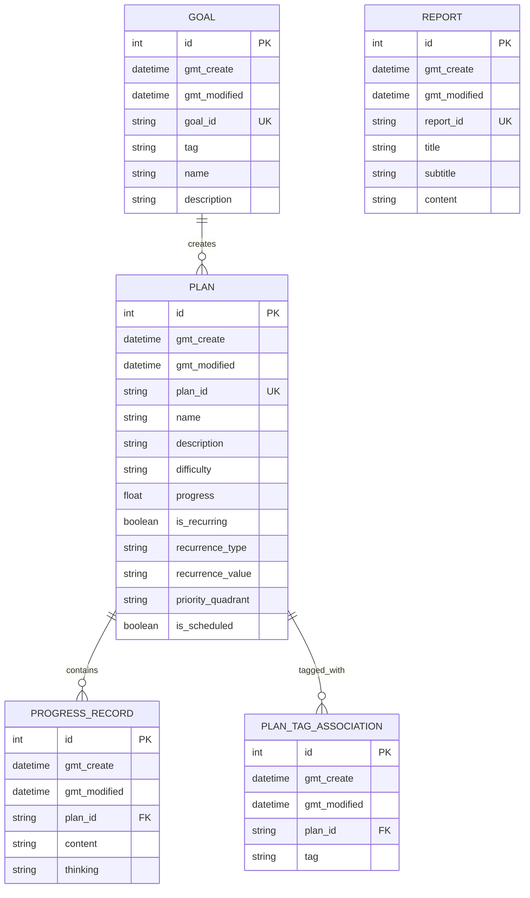
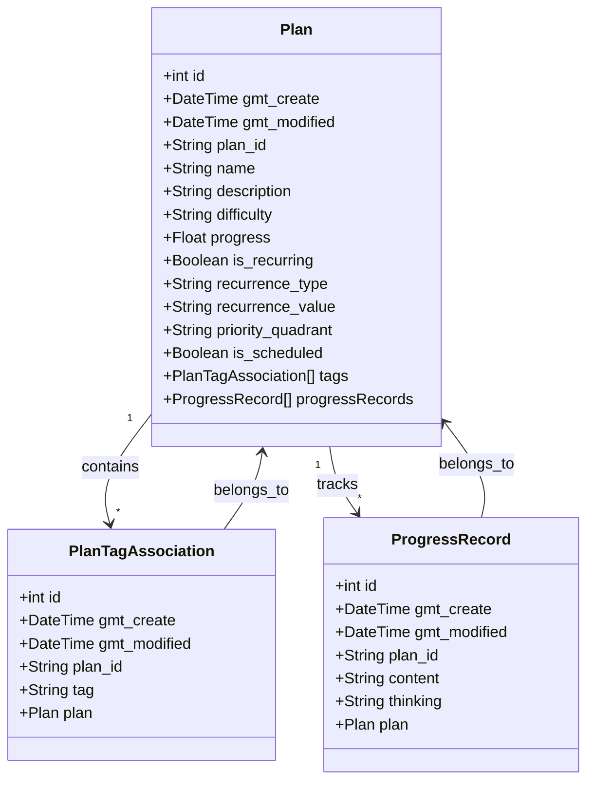
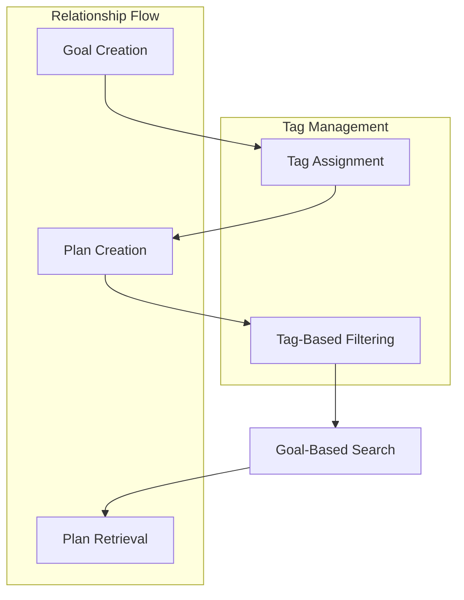
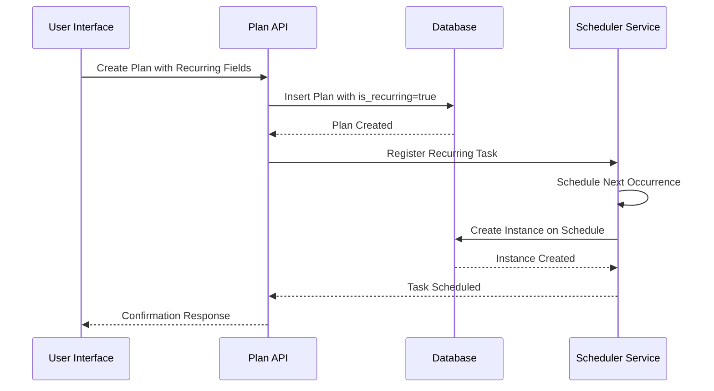
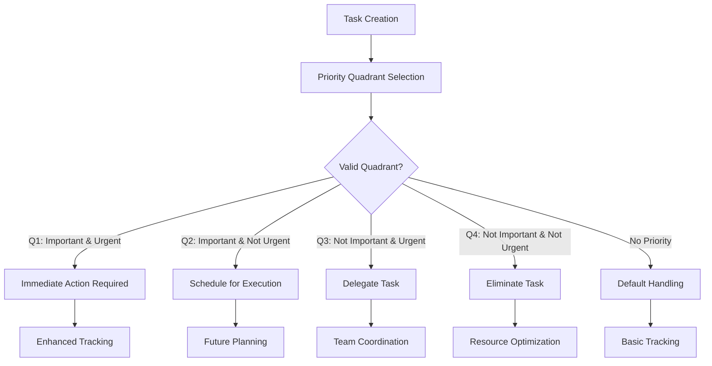
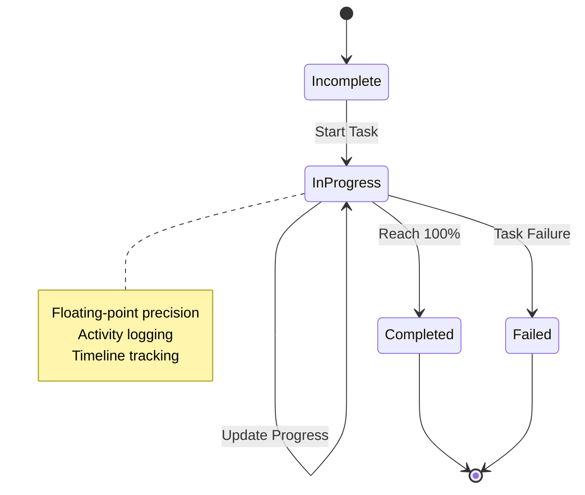
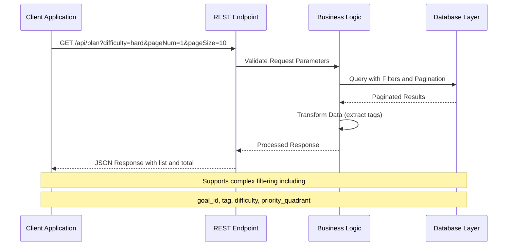
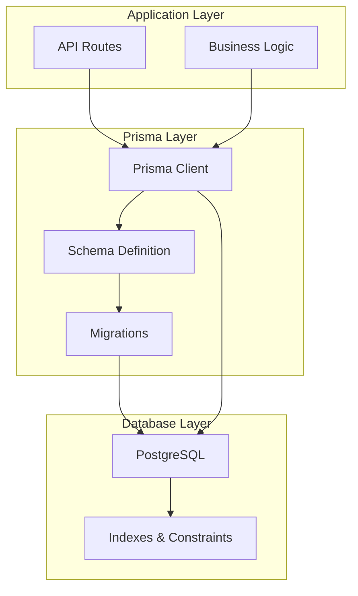

# Database Schema Enhancements

<cite>
**Referenced Files in This Document**
- [schema.prisma](file://prisma/schema.prisma)
- [20250530174537_init/migration.sql](file://prisma/migrations/20250530174537_init/migration.sql)
- [20250531155713_change_progress_to_float/migration.sql](file://prisma/migrations/20250531155713_change_progress_to_float/migration.sql)
- [20250602162342_add_recurring_fields/migration.sql](file://prisma/migrations/20250602162342_add_recurring_fields/migration.sql)
- [20260328175217_add_quadrant_priority/migration.sql](file://prisma/migrations/20260328175217_add_quadrant_priority/migration.sql)
- [goal/route.ts](file://src/app/api/goal/route.ts)
- [plan/route.ts](file://src/app/api/plan/route.ts)
- [progress_record/route.ts](file://src/app/api/progress_record/route.ts)
- [report/route.ts](file://src/app/api/report/route.ts)
- [tag/route.ts](file://src/app/api/tag/route.ts)
</cite>

## Table of Contents
1. [Introduction](#introduction)
2. [Database Schema Evolution](#database-schema-evolution)
3. [Core Model Analysis](#core-model-analysis)
4. [Enhanced Features Implementation](#enhanced-features-implementation)
5. [API Integration Patterns](#api-integration-patterns)
6. [Performance Optimizations](#performance-optimizations)
7. [Data Integrity Measures](#data-integrity-measures)
8. [Future Enhancement Opportunities](#future-enhancement-opportunities)
9. [Conclusion](#conclusion)

## Introduction

The Goal Mate application is an AI-powered goal and task management system built with Next.js and Prisma ORM. This document focuses specifically on the database schema enhancements that have been implemented to support advanced features like recurring tasks, priority quadrants, and enhanced progress tracking capabilities.

The system manages three primary entities: Goals, Plans, and Progress Records, with supporting infrastructure for tagging and reporting. Recent enhancements have significantly expanded the schema's capabilities to handle complex scheduling patterns and priority management systems.

## Database Schema Evolution

The database schema has undergone several strategic enhancements to support the application's growing feature set. The evolution follows a structured migration approach that maintains backward compatibility while adding sophisticated functionality.

**Diagram sources**
- [schema.prisma:16-71](file://prisma/schema.prisma#L16-L71)

The schema evolution demonstrates a methodical approach to database enhancement:

**Initial Foundation (2025-05-30)**: Established core entities with basic CRUD operations and foreign key relationships.

**Progress Precision (2025-05-31)**: Enhanced progress tracking from integer to floating-point precision for more granular measurements.

**Recurring Task Support (2025-06-02)**: Introduced scheduling capabilities for repetitive tasks with configurable recurrence patterns.

**Priority Management (2026-03-28)**: Added quadrant-based priority system for Eisenhower Matrix implementation.

**Section sources**
- [20250530174537_init/migration.sql:1-78](file://prisma/migrations/20250530174537_init/migration.sql#L1-L78)
- [20250531155713_change_progress_to_float/migration.sql:1-4](file://prisma/migrations/20250531155713_change_progress_to_float/migration.sql#L1-L4)
- [20250602162342_add_recurring_fields/migration.sql:1-5](file://prisma/migrations/20250602162342_add_recurring_fields/migration.sql#L1-L5)
- [20260328175217_add_quadrant_priority/migration.sql:1-4](file://prisma/migrations/20260328175217_add_quadrant_priority/migration.sql#L1-L4)

## Core Model Analysis

### Enhanced Plan Model Architecture

The Plan model serves as the central hub for task management, incorporating multiple advanced features that distinguish it from typical task management systems.

**Diagram sources**
- [schema.prisma:26-61](file://prisma/schema.prisma#L26-L61)

The enhanced Plan model introduces several sophisticated capabilities:

**Recurring Task Management**: The `is_recurring`, `recurrence_type`, and `recurrence_value` fields enable complex scheduling patterns for habits, routines, and periodic tasks.

**Priority Quadrant Integration**: The `priority_quadrant` field supports the Eisenhower Matrix methodology with four quadrants representing different combinations of importance and urgency.

**Progress Tracking Evolution**: Progress moved from integer to floating-point representation, allowing for more precise measurement and fractional completion tracking.

**Section sources**
- [schema.prisma:26-42](file://prisma/schema.prisma#L26-L42)

### Advanced Tagging System

The tagging system extends beyond simple categorization to support complex filtering and relationship management between goals and plans.

**Diagram sources**
- [tag/route.ts:6-20](file://src/app/api/tag/route.ts#L6-L20)
- [plan/route.ts:30-39](file://src/app/api/plan/route.ts#L30-L39)

The tagging system provides:
- Bidirectional tag retrieval from both goals and plans
- Dynamic tag-based filtering for plan queries
- Automatic tag propagation through goal-plan relationships

**Section sources**
- [tag/route.ts:6-20](file://src/app/api/tag/route.ts#L6-L20)

## Enhanced Features Implementation

### Recurring Task Scheduling

The recurring task system enables users to create automated task patterns that repeat according to specified intervals and frequencies.

**Diagram sources**
- [plan/route.ts:69-83](file://src/app/api/plan/route.ts#L69-L83)
- [20250602162342_add_recurring_fields/migration.sql:1-5](file://prisma/migrations/20250602162342_add_recurring_fields/migration.sql#L1-L5)

Key implementation aspects:
- Flexible recurrence patterns with configurable types and values
- Automatic task instance creation based on schedules
- Cascade deletion handling for recurring task relationships

### Priority Quadrant Management

The priority quadrant system implements the Eisenhower Matrix for effective time management and task prioritization.

**Diagram sources**
- [schema.prisma:38-39](file://prisma/schema.prisma#L38-L39)
- [plan/route.ts:25-28](file://src/app/api/plan/route.ts#L25-L28)

The quadrant system supports:
- Four-quadrant priority classification
- Unscheduled task filtering
- Priority-based task organization
- Integration with scheduling workflows

**Section sources**
- [schema.prisma:38-39](file://prisma/schema.prisma#L38-L39)
- [plan/route.ts:25-28](file://src/app/api/plan/route.ts#L25-L28)

### Enhanced Progress Tracking

The progress tracking system evolved from simple integer-based completion to sophisticated floating-point precision with detailed activity logging.

**Diagram sources**
- [20250531155713_change_progress_to_float/migration.sql:2-3](file://prisma/migrations/20250531155713_change_progress_to_float/migration.sql#L2-L3)
- [progress_record/route.ts:25-70](file://src/app/api/progress_record/route.ts#L25-L70)

Advanced progress features include:
- Floating-point precision for granular progress measurement
- Detailed activity logging with content and thinking fields
- Custom timestamp support for historical record keeping
- Comprehensive CRUD operations with proper error handling

**Section sources**
- [20250531155713_change_progress_to_float/migration.sql:2-3](file://prisma/migrations/20250531155713_change_progress_to_float/migration.sql#L2-L3)
- [progress_record/route.ts:25-70](file://src/app/api/progress_record/route.ts#L25-L70)

## API Integration Patterns

### RESTful API Design

The API layer demonstrates excellent adherence to REST principles while implementing sophisticated filtering and pagination capabilities.

**Diagram sources**
- [plan/route.ts:7-67](file://src/app/api/plan/route.ts#L7-L67)

Key API design patterns:
- Comprehensive filtering with multiple query parameters
- Efficient pagination with count queries
- Data transformation for improved client consumption
- Proper error handling and validation

**Section sources**
- [plan/route.ts:7-67](file://src/app/api/plan/route.ts#L7-L67)

### Database Client Integration

The Prisma client integration provides type-safe database operations with automatic code generation and migration support.

**Diagram sources**
- [schema.prisma:7-14](file://prisma/schema.prisma#L7-L14)
- [package.json:10-14](file://package.json#L10-L14)

Integration benefits include:
- Type-safe database operations
- Automatic client generation
- Migration management
- Relationship modeling

**Section sources**
- [schema.prisma:7-14](file://prisma/schema.prisma#L7-L14)
- [package.json:10-14](file://package.json#L10-L14)

## Performance Optimizations

### Query Optimization Strategies

The schema and API implementation incorporate several performance optimization techniques:

**Indexing Strategy**: Unique indexes on identifier fields (`goal_id`, `plan_id`, `report_id`) ensure fast lookups and maintain data integrity.

**Pagination Implementation**: Efficient pagination using `skip` and `take` with concurrent count queries prevents memory issues with large datasets.

**Relationship Optimization**: Proper foreign key relationships with cascade delete ensure referential integrity while maintaining query performance.

**Data Type Optimization**: Floating-point precision for progress tracking provides better granularity without significant performance impact.

### Memory Management

The API routes implement efficient memory usage patterns:

- Concurrent query execution using `Promise.all` for reduced response times
- Selective field retrieval to minimize data transfer
- Proper resource cleanup and connection management

**Section sources**
- [20250530174537_init/migration.sql:64-77](file://prisma/migrations/20250530174537_init/migration.sql#L64-L77)
- [plan/route.ts:14-22](file://src/app/api/plan/route.ts#L14-L22)

## Data Integrity Measures

### Constraint Implementation

The database schema enforces data integrity through comprehensive constraint definitions:

**Primary Keys**: Auto-incrementing integer IDs for all tables ensure unique identification.

**Unique Constraints**: Identifier fields use unique constraints to prevent duplicates.

**Foreign Key Relationships**: Proper cascading relationships maintain referential integrity.

**Default Values**: Strategic default values reduce data entry errors and ensure consistency.

### Validation Patterns

The API layer implements robust validation patterns:

- Parameter validation and sanitization
- Existence checks for related entities
- Type checking for all input parameters
- Proper error handling with meaningful messages

**Section sources**
- [20250530174537_init/migration.sql:64-77](file://prisma/migrations/20250530174537_init/migration.sql#L64-L77)
- [goal/route.ts:44-51](file://src/app/api/goal/route.ts#L44-L51)

## Future Enhancement Opportunities

### Scalability Considerations

The current schema provides a solid foundation for future growth:

**Horizontal Scaling**: The current design supports read scaling through database replication.

**Caching Strategy**: Consider implementing application-level caching for frequently accessed data like tags and reports.

**Search Optimization**: Implement full-text search capabilities for improved query performance on large datasets.

**Analytics Integration**: Add specialized tables for analytics and reporting to offload complex calculations from main transactional queries.

### Feature Expansion Areas

Potential enhancements include:

- **Audit Trail**: Implement comprehensive change tracking for all entities
- **Workflow Management**: Add state machines for task lifecycle management
- **Resource Allocation**: Extend the system to track time and resource allocation
- **Integration Hooks**: Add webhooks and event-driven architecture for external system integration

## Conclusion

The database schema enhancements in Goal Mate represent a sophisticated evolution from basic task management to enterprise-grade goal and project management capabilities. The strategic implementation of recurring task support, priority quadrant management, and enhanced progress tracking demonstrates careful consideration of user needs and technical requirements.

Key achievements include:

- **Comprehensive Feature Set**: Full support for recurring tasks, priority management, and detailed progress tracking
- **Robust Architecture**: Well-designed schema with proper relationships and constraints
- **Performance Optimization**: Efficient query patterns and indexing strategies
- **Extensibility**: Foundation for future enhancements and feature additions

The implementation successfully balances functionality with maintainability, providing a solid platform for continued development while ensuring data integrity and performance. The modular approach to schema evolution through migrations ensures that enhancements can be deployed incrementally without disrupting existing functionality.