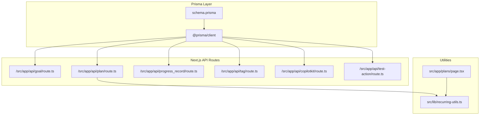
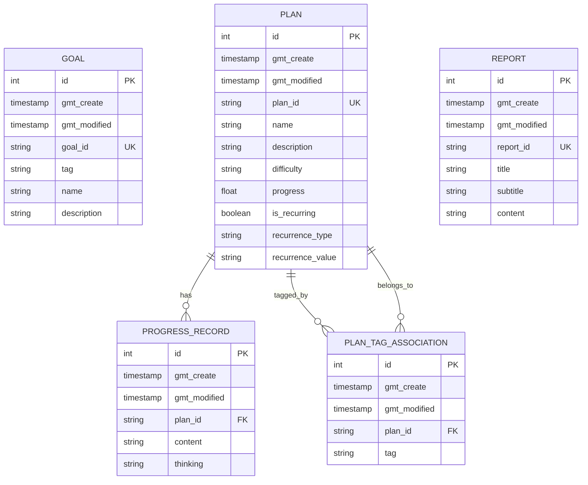
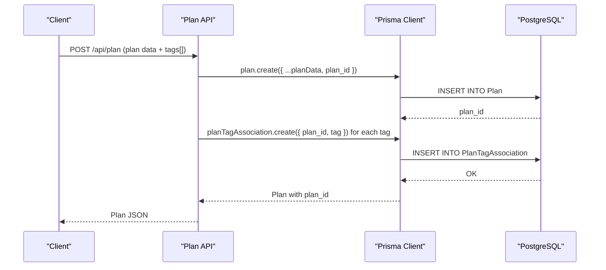
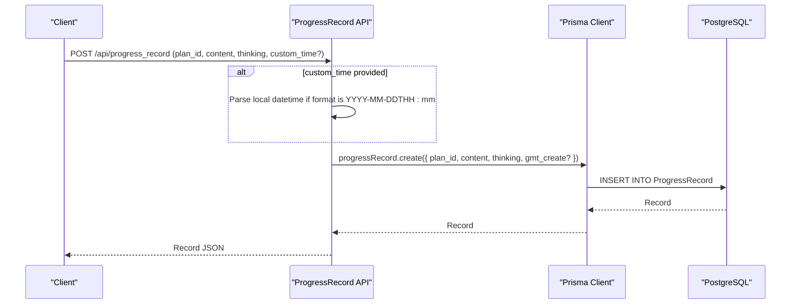
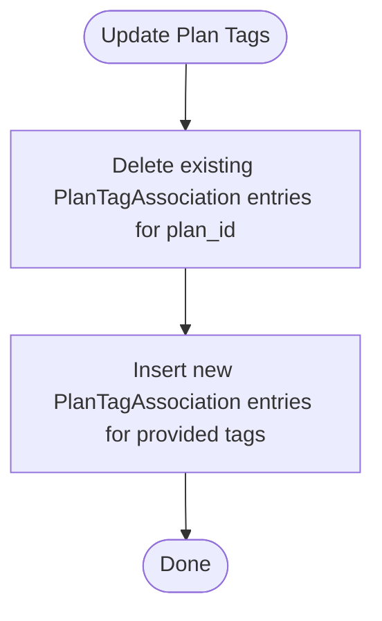
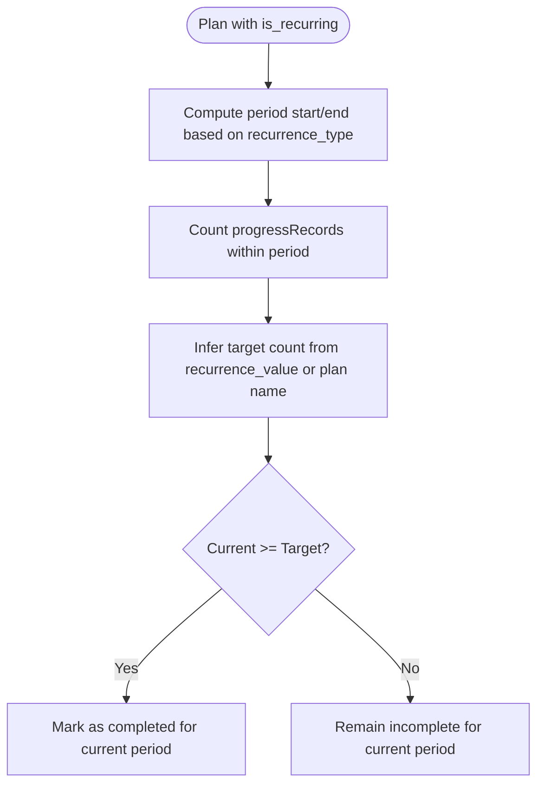
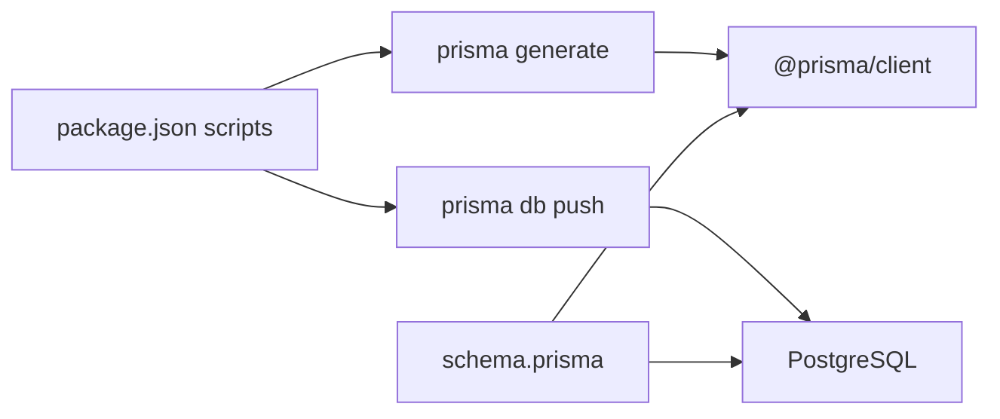

# Database Schema

<cite>
**Referenced Files in This Document**
- [schema.prisma](file://prisma/schema.prisma)
- [package.json](file://package.json)
- [recurring-utils.ts](file://src/lib/recurring-utils.ts)
- [route.ts (Goal API)](file://src/app/api/goal/route.ts)
- [route.ts (Plan API)](file://src/app/api/plan/route.ts)
- [route.ts (ProgressRecord API)](file://src/app/api/progress_record/route.ts)
- [route.ts (Tag API)](file://src/app/api/tag/route.ts)
- [route.ts (CopilotKit)](file://src/app/api/copilotkit/route.ts)
- [route.ts (Test Action)](file://src/app/api/test-action/route.ts)
- [page.tsx (Plans UI)](file://src/app/plans/page.tsx)
- [migration_lock.toml](file://prisma/migrations/migration_lock.toml)
</cite>

## Table of Contents
1. [Introduction](#introduction)
2. [Project Structure](#project-structure)
3. [Core Components](#core-components)
4. [Architecture Overview](#architecture-overview)
5. [Detailed Component Analysis](#detailed-component-analysis)
6. [Dependency Analysis](#dependency-analysis)
7. [Performance Considerations](#performance-considerations)
8. [Troubleshooting Guide](#troubleshooting-guide)
9. [Conclusion](#conclusion)
10. [Appendices](#appendices)

## Introduction
This document describes the database schema and data model for the application’s Prisma ORM implementation. It focuses on the Goal, Plan, ProgressRecord, and Tag-related models, detailing entity relationships, field definitions, constraints, indexes, and many-to-many association patterns. It also covers recurrence support in plan management, data validation rules, lifecycle management, migrations, seeding, and query optimization strategies. Practical examples of common operations are included to guide developers integrating with the schema.

## Project Structure
The schema is defined centrally in the Prisma schema file and consumed by API routes and utilities across the application. The Prisma client is generated and used by Next.js API handlers to perform CRUD operations against PostgreSQL.

**Diagram sources**
- [schema.prisma:1-70](file://prisma/schema.prisma#L1-L70)
- [route.ts (Goal API):1-51](file://src/app/api/goal/route.ts#L1-L51)
- [route.ts (Plan API):49-103](file://src/app/api/plan/route.ts#L49-L103)
- [route.ts (ProgressRecord API):1-154](file://src/app/api/progress_record/route.ts#L1-L154)
- [route.ts (Tag API):1-11](file://src/app/api/tag/route.ts#L1-L11)
- [route.ts (CopilotKit):483-518](file://src/app/api/copilotkit/route.ts#L483-L518)
- [route.ts (Test Action):1-153](file://src/app/api/test-action/route.ts#L1-L153)
- [recurring-utils.ts:1-218](file://src/lib/recurring-utils.ts#L1-L218)
- [page.tsx (Plans UI):82-113](file://src/app/plans/page.tsx#L82-L113)

**Section sources**
- [schema.prisma:1-70](file://prisma/schema.prisma#L1-L70)
- [package.json:10-14](file://package.json#L10-L14)

## Core Components
This section documents the core models and their relationships, focusing on field definitions, data types, and constraints.

- Goal
  - Purpose: Stores high-level goals with identifiers and metadata.
  - Fields: id (autoincrement), gmt_create (default now), gmt_modified (updatedAt), goal_id (unique), tag, name, description.
  - Constraints: goal_id is unique; timestamps default to current time.

- Plan
  - Purpose: Represents actionable plans with optional recurrence and progress tracking.
  - Fields: id (autoincrement), gmt_create (default now), gmt_modified (updatedAt), plan_id (unique), name, description, difficulty, progress (default 0), is_recurring (default false), recurrence_type, recurrence_value.
  - Relationships: One-to-many with ProgressRecord via plan_id; many-to-many with Tag via PlanTagAssociation.
  - Constraints: progress is a float; recurrence fields enable periodic tracking.

- PlanTagAssociation
  - Purpose: Many-to-many bridge between Plan and Tag.
  - Fields: id (autoincrement), gmt_create (default now), gmt_modified (updatedAt), plan_id, tag.
  - Relationship: Belongs to Plan via plan_id with cascade delete.

- ProgressRecord
  - Purpose: Captures progress entries for a plan with optional custom timestamps.
  - Fields: id (autoincrement), gmt_create (default now), gmt_modified (updatedAt), plan_id, content, thinking.
  - Relationship: Belongs to Plan via plan_id with cascade delete.

- Report
  - Purpose: Stores report artifacts (not part of the core focus but present in schema).
  - Fields: id (autoincrement), gmt_create (default now), gmt_modified (updatedAt), report_id (unique), title, subtitle, content.

Entity relationships and cardinalities:
- Goal to Plan: One-to-many (via plan’s foreign key to goal_id in application logic; schema defines plan_id as unique).
- Plan to ProgressRecord: One-to-many (via plan_id).
- Plan to Tag: Many-to-many (via PlanTagAssociation).
- PlanTagAssociation to Plan: Many-to-one (with cascade delete).

Primary and foreign keys:
- Primary keys: id for all models except Goal and Plan which use plan_id and goal_id as logical keys.
- Foreign keys: plan_id in ProgressRecord and PlanTagAssociation references Plan.plan_id.

Indexes and constraints:
- Unique constraints: plan_id and goal_id are unique.
- Default values: timestamps default to current time; progress defaults to 0; is_recurring defaults to false.
- Cascade delete: deleting a Plan cascades deletion of associated ProgressRecord and PlanTagAssociation entries.

**Section sources**
- [schema.prisma:16-70](file://prisma/schema.prisma#L16-L70)

## Architecture Overview
The data model is centered around Plans and their associated records and tags. Goals provide higher-level categorization, while ProgressRecord captures temporal progress updates. PlanTagAssociation enables flexible tagging for plans.

**Diagram sources**
- [schema.prisma:16-70](file://prisma/schema.prisma#L16-L70)

## Detailed Component Analysis

### Goal Model
- Field definitions and constraints:
  - goal_id is unique; used as the logical identifier for goals.
  - Timestamps track creation and last modification.
  - Optional description supports richer goal metadata.
- Typical operations:
  - List with pagination and tag filtering.
  - Create with auto-generated goal_id.
  - Update and delete by goal_id.

Common operations:
- Retrieve paginated goals filtered by tag.
- Create a new goal with provided attributes.
- Update goal metadata by goal_id.
- Delete a goal by goal_id.

**Section sources**
- [route.ts (Goal API):7-51](file://src/app/api/goal/route.ts#L7-L51)
- [schema.prisma:16-24](file://prisma/schema.prisma#L16-L24)

### Plan Model
- Field definitions and constraints:
  - plan_id is unique; serves as the logical primary key for plans.
  - progress defaults to 0; difficulty is optional.
  - Recurrence fields enable daily, weekly, or monthly tracking with optional target counts.
- Relationships:
  - One-to-many with ProgressRecord via plan_id.
  - Many-to-many with Tag via PlanTagAssociation.
- Typical operations:
  - List plans with pagination and tag filtering.
  - Create plan with optional tags; auto-generated plan_id.
  - Update plan metadata and replace associated tags atomically.
  - Delete plan (cascade deletes related records).

**Diagram sources**
- [route.ts (Plan API):58-72](file://src/app/api/plan/route.ts#L58-L72)
- [schema.prisma:26-40](file://prisma/schema.prisma#L26-L40)
- [schema.prisma:42-49](file://prisma/schema.prisma#L42-L49)

**Section sources**
- [route.ts (Plan API):49-103](file://src/app/api/plan/route.ts#L49-L103)
- [schema.prisma:26-40](file://prisma/schema.prisma#L26-L40)

### ProgressRecord Model
- Field definitions and constraints:
  - plan_id links to Plan; cascade delete ensures referential integrity.
  - Optional content and thinking fields capture reflective notes.
  - Custom timestamps supported during creation/update.
- Typical operations:
  - List records by plan_id with pagination.
  - Create progress record with optional custom_time.
  - Update record content/thinking and optionally move to another plan or adjust timestamp.
  - Delete by id.

**Diagram sources**
- [route.ts (ProgressRecord API):25-70](file://src/app/api/progress_record/route.ts#L25-L70)
- [schema.prisma:51-59](file://prisma/schema.prisma#L51-L59)

**Section sources**
- [route.ts (ProgressRecord API):6-23](file://src/app/api/progress_record/route.ts#L6-L23)
- [route.ts (ProgressRecord API):25-154](file://src/app/api/progress_record/route.ts#L25-L154)
- [schema.prisma:51-59](file://prisma/schema.prisma#L51-L59)

### Tag Association (Many-to-Many)
- Implementation pattern:
  - PlanTagAssociation bridges Plan and Tag using plan_id and tag.
  - On plan update, existing associations are deleted and recreated to reflect the new tag set.
- Typical operations:
  - List tags from goals for UI suggestions.
  - Get system options including existing tags and standard difficulty choices.

**Diagram sources**
- [route.ts (Plan API):86-93](file://src/app/api/plan/route.ts#L86-L93)
- [schema.prisma:42-49](file://prisma/schema.prisma#L42-L49)

**Section sources**
- [route.ts (Plan API):49-103](file://src/app/api/plan/route.ts#L49-L103)
- [route.ts (Tag API):6-11](file://src/app/api/tag/route.ts#L6-L11)
- [route.ts (CopilotKit):483-518](file://src/app/api/copilotkit/route.ts#L483-L518)

### Recurrence Support in Plan Management
- Data model support:
  - is_recurring flag, recurrence_type, and recurrence_value enable periodic tracking.
- Business logic:
  - Utilities compute current period boundaries, count records per period, infer target counts, and derive completion status.
  - UI sorts plans by status using either progress or completion rate depending on recurrence.

**Diagram sources**
- [recurring-utils.ts:16-147](file://src/lib/recurring-utils.ts#L16-L147)
- [page.tsx (Plans UI):82-113](file://src/app/plans/page.tsx#L82-L113)
- [schema.prisma:34-37](file://prisma/schema.prisma#L34-L37)

**Section sources**
- [recurring-utils.ts:1-218](file://src/lib/recurring-utils.ts#L1-L218)
- [page.tsx (Plans UI):82-113](file://src/app/plans/page.tsx#L82-L113)
- [schema.prisma:26-40](file://prisma/schema.prisma#L26-L40)

## Dependency Analysis
- Prisma client generation and database connectivity:
  - Scripts for generating Prisma client and pushing schema to the database are defined in package.json.
  - The datasource provider is PostgreSQL and the connection URL is sourced from environment variables.
- Migration lock:
  - A migration lock file indicates migration tooling is configured for PostgreSQL.

**Diagram sources**
- [package.json:10-14](file://package.json#L10-L14)
- [schema.prisma:7-14](file://prisma/schema.prisma#L7-L14)
- [migration_lock.toml:1-4](file://prisma/migrations/migration_lock.toml#L1-L4)

**Section sources**
- [package.json:10-14](file://package.json#L10-L14)
- [schema.prisma:7-14](file://prisma/schema.prisma#L7-L14)
- [migration_lock.toml:1-4](file://prisma/migrations/migration_lock.toml#L1-L4)

## Performance Considerations
- Indexing strategies:
  - Unique indexes on plan_id and goal_id ensure fast lookups by logical keys.
  - Consider adding composite indexes for frequent filter-and-sort patterns (e.g., plan_id + gmt_create for progress records).
- Query patterns:
  - Use pagination (skip/take) for large lists.
  - Prefer selective projections (select) when building tag lists or option sets.
- Recurrence computations:
  - Filtering progress records by period boundaries is O(n); consider caching computed completion rates for frequently accessed plans.
- Concurrency:
  - Cascade deletes reduce orphaned rows but can trigger cascading operations; batch updates where feasible.

[No sources needed since this section provides general guidance]

## Troubleshooting Guide
- Connection and generation:
  - Ensure Prisma client is generated and schema is pushed to the database using the provided scripts.
- Missing or invalid plan_id:
  - Many operations require plan_id; verify the payload and handle missing identifiers gracefully.
- Tag synchronization:
  - When updating plan tags, existing associations are cleared and recreated; ensure tag arrays are provided consistently.
- Recurrence anomalies:
  - Verify recurrence_type and recurrence_value; confirm custom timestamps are parsed correctly for local time semantics.

**Section sources**
- [package.json:10-14](file://package.json#L10-L14)
- [route.ts (Plan API):76-93](file://src/app/api/plan/route.ts#L76-L93)
- [route.ts (ProgressRecord API):42-56](file://src/app/api/progress_record/route.ts#L42-L56)

## Conclusion
The schema centers on Plans with robust support for progress tracking, recurrence, and flexible tagging. The Prisma models enforce referential integrity via foreign keys and cascade deletes, while application logic handles recurrence computation and UI sorting. The documented operations and constraints provide a clear blueprint for extending or maintaining the data model.

[No sources needed since this section summarizes without analyzing specific files]

## Appendices

### Sample Data Structures
- Goal
  - Example fields: goal_id, tag, name, description.
- Plan
  - Example fields: plan_id, name, description, difficulty, progress, is_recurring, recurrence_type, recurrence_value.
- PlanTagAssociation
  - Example fields: plan_id, tag.
- ProgressRecord
  - Example fields: plan_id, content, thinking, gmt_create.

[No sources needed since this section provides general guidance]

### Practical Operation Examples
- Create a plan with tags:
  - POST to /api/plan with plan data and tags array; server persists plan and associations.
- Update plan tags:
  - PUT to /api/plan with tags array; server replaces all associations for the plan.
- List progress records for a plan:
  - GET /api/progress_record?plan_id=... with pagination.
- Compute recurrence status:
  - Use recurrence utilities to determine completion rate and status text.

**Section sources**
- [route.ts (Plan API):58-72](file://src/app/api/plan/route.ts#L58-L72)
- [route.ts (Plan API):74-94](file://src/app/api/plan/route.ts#L74-L94)
- [route.ts (ProgressRecord API):6-23](file://src/app/api/progress_record/route.ts#L6-L23)
- [recurring-utils.ts:135-202](file://src/lib/recurring-utils.ts#L135-L202)