# Entity Models

<cite>
**Referenced Files in This Document**
- [schema.prisma](file://prisma/schema.prisma)
- [goal route](file://src/app/api/goal/route.ts)
- [plan route](file://src/app/api/plan/route.ts)
- [progress_record route](file://src/app/api/progress_record/route.ts)
- [report route](file://src/app/api/report/route.ts)
- [tag route](file://src/app/api/tag/route.ts)
- [copilotkit route](file://src/app/api/copilotkit/route.ts)
- [auth login route](file://src/app/api/auth/login/route.ts)
- [auth library](file://src/lib/auth.ts)
- [middleware](file://middleware.ts)
</cite>

## Table of Contents
1. [Introduction](#introduction)
2. [Project Structure](#project-structure)
3. [Core Components](#core-components)
4. [Architecture Overview](#architecture-overview)
5. [Detailed Component Analysis](#detailed-component-analysis)
6. [Dependency Analysis](#dependency-analysis)
7. [Performance Considerations](#performance-considerations)
8. [Troubleshooting Guide](#troubleshooting-guide)
9. [Conclusion](#conclusion)

## Introduction
This document defines the core data entity models used by the Goal-Mate application: Goal, Plan, PlanTagAssociation, ProgressRecord, and Report. It explains each model’s fields, data types, constraints, defaults, and validation rules. It also documents the unique identifier patterns (goal_id, plan_id, report_id), timestamp fields (gmt_create, gmt_modified), and optional fields. The purpose and business logic of each entity are described, along with how they support the application’s functionality around goal and plan management, progress tracking, and reporting.

## Project Structure
The data model is defined in the Prisma schema and consumed by Next.js API routes that implement CRUD operations and business logic. Authentication is enforced via middleware and cookie-based JWT tokens. The AI assistant integrates with the data model through system actions.

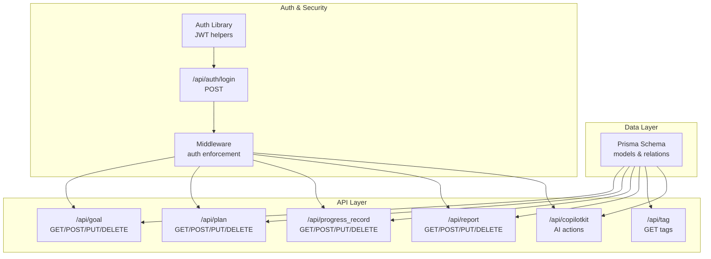

**Diagram sources**
- [schema.prisma:16-69](file://prisma/schema.prisma#L16-L69)
- [goal route:1-51](file://src/app/api/goal/route.ts#L1-L51)
- [plan route:1-103](file://src/app/api/plan/route.ts#L1-L103)
- [progress_record route:1-154](file://src/app/api/progress_record/route.ts#L1-L154)
- [report route:1-48](file://src/app/api/report/route.ts#L1-L48)
- [tag route:1-11](file://src/app/api/tag/route.ts#L1-L11)
- [copilotkit route:1-1636](file://src/app/api/copilotkit/route.ts#L1-L1636)
- [auth login route:1-50](file://src/app/api/auth/login/route.ts#L1-L50)
- [auth library:1-69](file://src/lib/auth.ts#L1-L69)
- [middleware:1-40](file://middleware.ts#L1-L40)

**Section sources**
- [schema.prisma:16-69](file://prisma/schema.prisma#L16-L69)
- [goal route:1-51](file://src/app/api/goal/route.ts#L1-L51)
- [plan route:1-103](file://src/app/api/plan/route.ts#L1-L103)
- [progress_record route:1-154](file://src/app/api/progress_record/route.ts#L1-L154)
- [report route:1-48](file://src/app/api/report/route.ts#L1-L48)
- [tag route:1-11](file://src/app/api/tag/route.ts#L1-L11)
- [copilotkit route:1-1636](file://src/app/api/copilotkit/route.ts#L1-L1636)
- [auth login route:1-50](file://src/app/api/auth/login/route.ts#L1-L50)
- [auth library:1-69](file://src/lib/auth.ts#L1-L69)
- [middleware:1-40](file://middleware.ts#L1-L40)

## Core Components
This section documents each entity model with field definitions, data types, constraints, defaults, and validation rules. It also explains the unique identifiers and timestamps.

- Goal
  - Purpose: Represents a long-term objective with categorization via tag.
  - Unique Identifier: goal_id (string, unique)
  - Timestamps: gmt_create (DateTime), gmt_modified (DateTime)
  - Fields:
    - id: Int (autoincrement primary key)
    - gmt_create: DateTime (@default(now()))
    - gmt_modified: DateTime (@updatedAt)
    - goal_id: String (@unique)
    - tag: String
    - name: String
    - description: String? (optional)
  - Validation Rules:
    - goal_id must be unique.
    - tag is required.
    - name is required.
    - description is optional.

- Plan
  - Purpose: Represents a specific task or activity with progress tracking and optional recurrence.
  - Unique Identifier: plan_id (string, unique)
  - Timestamps: gmt_create (DateTime), gmt_modified (DateTime)
  - Fields:
    - id: Int (autoincrement primary key)
    - gmt_create: DateTime (@default(now()))
    - gmt_modified: DateTime (@updatedAt)
    - plan_id: String (@unique)
    - name: String
    - description: String? (optional)
    - difficulty: String? (enum-like: easy, medium, hard)
    - progress: Float (@default(0)) in range [0..1]
    - is_recurring: Boolean (@default(false))
    - recurrence_type: String? (e.g., daily, weekly)
    - recurrence_value: String? (e.g., interval value)
    - tags: PlanTagAssociation[] (relation)
    - progressRecords: ProgressRecord[] (relation)
  - Validation Rules:
    - plan_id must be unique.
    - difficulty must be one of the standard values if provided.
    - progress must be between 0 and 1.
    - description is optional.
    - Tags are managed via PlanTagAssociation.

- PlanTagAssociation
  - Purpose: Many-to-many bridge between Plan and tags; ensures tag uniqueness per plan.
  - Timestamps: gmt_create (DateTime), gmt_modified (DateTime)
  - Fields:
    - id: Int (autoincrement primary key)
    - gmt_create: DateTime (@default(now()))
    - gmt_modified: DateTime (@updatedAt)
    - plan_id: String
    - tag: String
    - plan: Plan (relation with onDelete: Cascade)
  - Validation Rules:
    - plan_id must reference an existing plan.
    - On plan deletion, associations cascade.

- ProgressRecord
  - Purpose: Records a single progress event for a plan, capturing content and reflective thinking.
  - Timestamps: gmt_create (DateTime), gmt_modified (DateTime)
  - Fields:
    - id: Int (autoincrement primary key)
    - gmt_create: DateTime (@default(now()))
    - gmt_modified: DateTime (@updatedAt)
    - plan_id: String
    - content: String? (optional)
    - thinking: String? (optional)
    - plan: Plan (relation with onDelete: Cascade)
  - Validation Rules:
    - plan_id must reference an existing plan.
    - On plan deletion, records cascade.
    - content and thinking are optional.

- Report
  - Purpose: Stores generated progress reports with title and optional subtitle/content.
  - Unique Identifier: report_id (string, unique)
  - Timestamps: gmt_create (DateTime), gmt_modified (DateTime)
  - Fields:
    - id: Int (autoincrement primary key)
    - gmt_create: DateTime (@default(now()))
    - gmt_modified: DateTime (@updatedAt)
    - report_id: String (@unique)
    - title: String
    - subtitle: String? (optional)
    - content: String? (optional)
  - Validation Rules:
    - report_id must be unique.
    - title is required.
    - subtitle and content are optional.

**Section sources**
- [schema.prisma:16-69](file://prisma/schema.prisma#L16-L69)

## Architecture Overview
The data model underpins the application’s core workflows:
- Goals define categories via tag.
- Plans belong to Goals (via tag filtering) and track progress.
- Tags are associated with Plans via PlanTagAssociation.
- ProgressRecords capture daily/periodic updates linked to Plans.
- Reports aggregate insights and summaries.

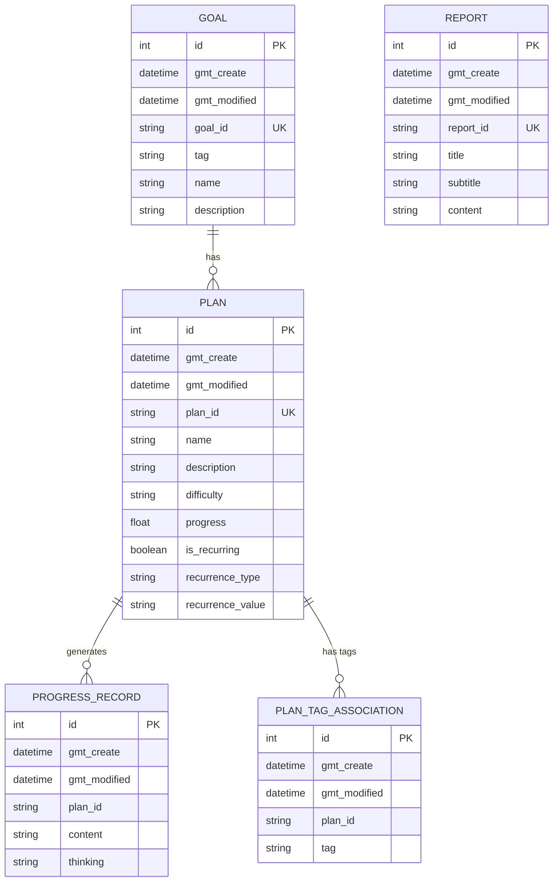

**Diagram sources**
- [schema.prisma:16-69](file://prisma/schema.prisma#L16-L69)

## Detailed Component Analysis

### Goal Model
- Business Role: Defines high-level objectives and categorizes them via tag for downstream filtering and association.
- Typical Fields and Constraints:
  - goal_id: unique string identifier; generated at creation.
  - tag: required category for filtering plans.
  - name: required human-readable title.
  - description: optional narrative.
  - gmt_create/gmt_modified: automatic timestamps.
- Typical Data Structure Example:
  - goal_id: "goal_<uuid-truncated>"
  - tag: "learning"
  - name: "Learn advanced algorithms"
  - description: "Study competitive programming topics"

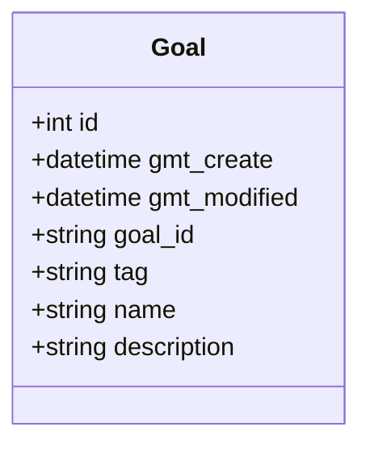

**Diagram sources**
- [schema.prisma:16-24](file://prisma/schema.prisma#L16-L24)

**Section sources**
- [schema.prisma:16-24](file://prisma/schema.prisma#L16-L24)
- [goal route:27-30](file://src/app/api/goal/route.ts#L27-L30)
- [tag route:8-10](file://src/app/api/tag/route.ts#L8-L10)

### Plan Model
- Business Role: Encapsulates actionable items with progress tracking, difficulty, and optional recurrence.
- Typical Fields and Constraints:
  - plan_id: unique string identifier; generated at creation.
  - name: required.
  - description: optional.
  - difficulty: standard values (easy, medium, hard) if provided.
  - progress: normalized 0..1; default 0.
  - is_recurring: boolean flag; default false.
  - recurrence_type/recurrence_value: optional recurrence configuration.
  - tags: relation to PlanTagAssociation.
  - progressRecords: relation to ProgressRecord.
  - gmt_create/gmt_modified: automatic timestamps.
- Typical Data Structure Example:
  - plan_id: "plan_<uuid-truncated>"
  - name: "Read Chapter 3 of CSAPP"
  - difficulty: "medium"
  - progress: 0.0
  - is_recurring: false
  - tags: ["reading", "study"]

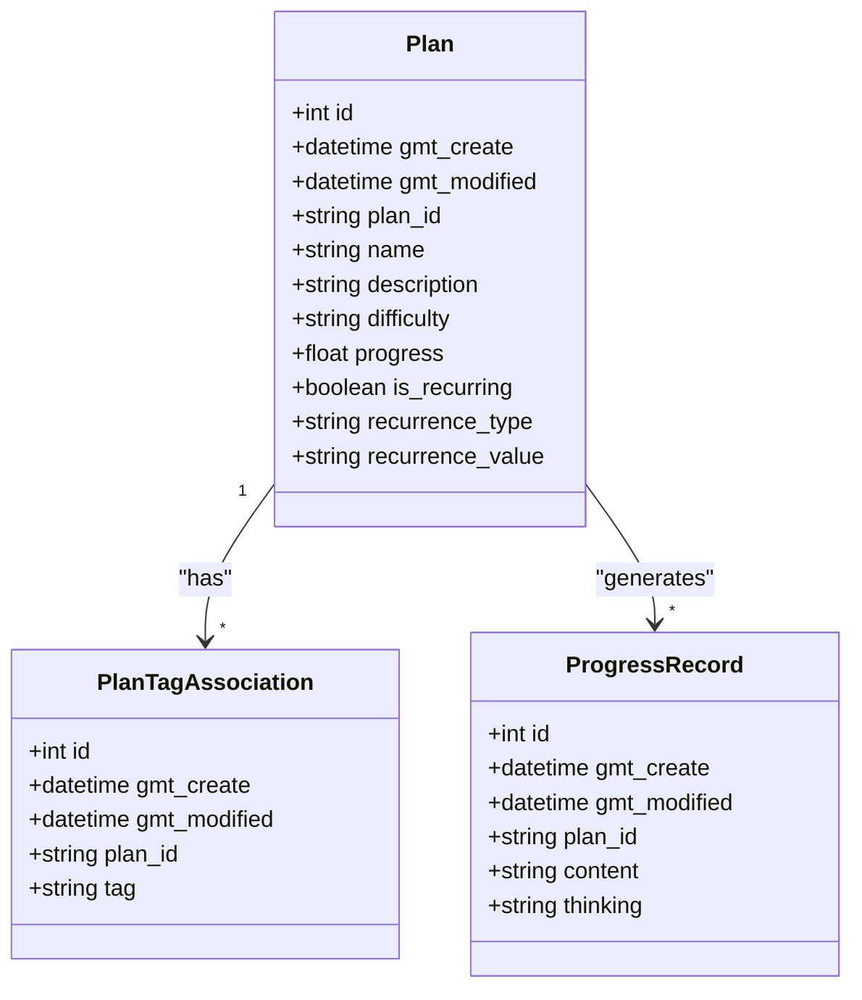

**Diagram sources**
- [schema.prisma:26-40](file://prisma/schema.prisma#L26-L40)
- [schema.prisma:42-49](file://prisma/schema.prisma#L42-L49)
- [schema.prisma:51-59](file://prisma/schema.prisma#L51-L59)

**Section sources**
- [schema.prisma:26-40](file://prisma/schema.prisma#L26-L40)
- [plan route:58-72](file://src/app/api/plan/route.ts#L58-L72)
- [plan route:74-94](file://src/app/api/plan/route.ts#L74-L94)

### PlanTagAssociation Model
- Business Role: Maintains tag-to-plan associations; supports tag-based filtering and discovery.
- Typical Fields and Constraints:
  - plan_id: links to Plan.
  - tag: string tag value.
  - Cascading delete: when a plan is deleted, its associations are removed.
- Typical Data Structure Example:
  - plan_id: "plan_<uuid-truncated>"
  - tag: "reading"

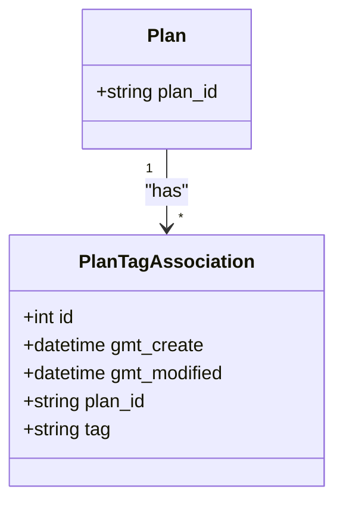

**Diagram sources**
- [schema.prisma:42-49](file://prisma/schema.prisma#L42-L49)
- [schema.prisma:26-40](file://prisma/schema.prisma#L26-L40)

**Section sources**
- [schema.prisma:42-49](file://prisma/schema.prisma#L42-L49)
- [plan route:66-71](file://src/app/api/plan/route.ts#L66-L71)
- [plan route:87-93](file://src/app/api/plan/route.ts#L87-L93)

### ProgressRecord Model
- Business Role: Captures individual progress events with content and reflective thinking for a given plan.
- Typical Fields and Constraints:
  - plan_id: required to associate with a plan.
  - content/thinking: optional textual fields for activity summary and reflection.
  - gmt_create/gmt_modified: automatic timestamps.
  - Cascading delete: when a plan is deleted, its records are removed.
- Typical Data Structure Example:
  - plan_id: "plan_<uuid-truncated>"
  - content: "Completed Chapter 3 exercises"
  - thinking: "Assembly language was challenging but insightful"

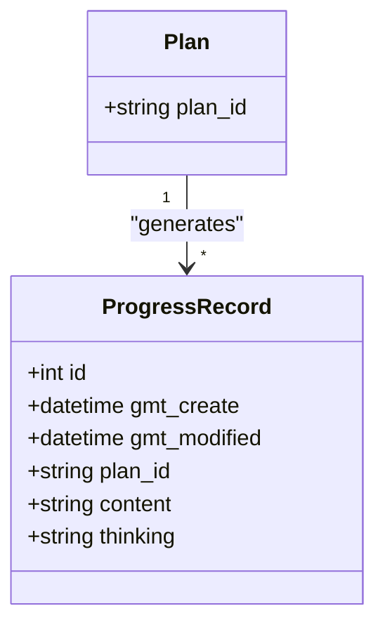

**Diagram sources**
- [schema.prisma:51-59](file://prisma/schema.prisma#L51-L59)
- [schema.prisma:26-40](file://prisma/schema.prisma#L26-L40)

**Section sources**
- [schema.prisma:51-59](file://prisma/schema.prisma#L51-L59)
- [progress_record route:25-70](file://src/app/api/progress_record/route.ts#L25-L70)
- [progress_record route:72-127](file://src/app/api/progress_record/route.ts#L72-L127)

### Report Model
- Business Role: Stores generated reports with title and optional subtitle/content for distribution.
- Typical Fields and Constraints:
  - report_id: unique string identifier; generated at creation.
  - title: required.
  - subtitle/content: optional.
  - gmt_create/gmt_modified: automatic timestamps.
- Typical Data Structure Example:
  - report_id: "report_<uuid-truncated>"
  - title: "Weekly Learning Report"
  - subtitle: "Week of 2024-01-01"
  - content: "<Markdown content>"

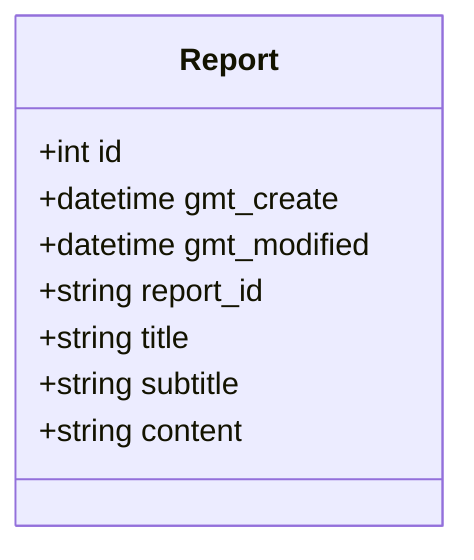

**Diagram sources**
- [schema.prisma:61-69](file://prisma/schema.prisma#L61-L69)

**Section sources**
- [schema.prisma:61-69](file://prisma/schema.prisma#L61-L69)
- [report route:23-28](file://src/app/api/report/route.ts#L23-L28)
- [report route:30-39](file://src/app/api/report/route.ts#L30-L39)

### API Workflows and Validation

#### Goal CRUD Workflow
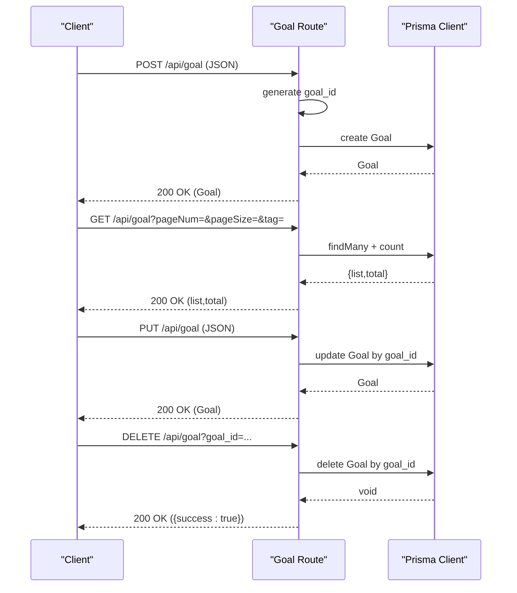

**Diagram sources**
- [goal route:7-51](file://src/app/api/goal/route.ts#L7-L51)
- [schema.prisma:16-24](file://prisma/schema.prisma#L16-L24)

**Section sources**
- [goal route:7-51](file://src/app/api/goal/route.ts#L7-L51)

#### Plan CRUD Workflow
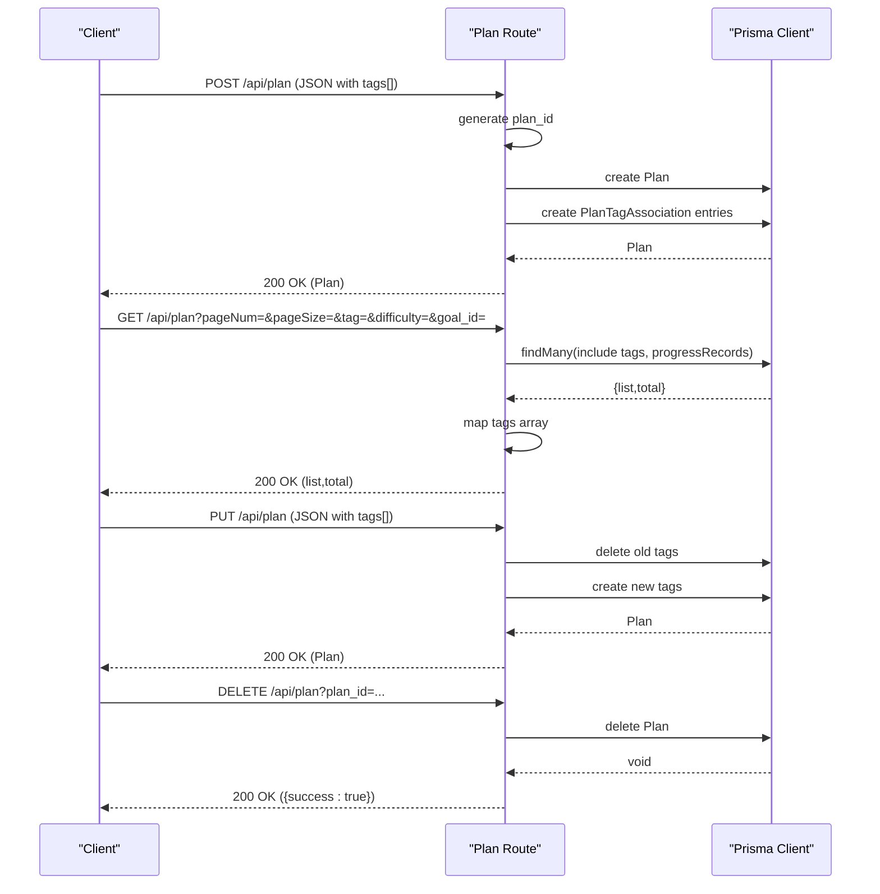

**Diagram sources**
- [plan route:7-103](file://src/app/api/plan/route.ts#L7-L103)
- [schema.prisma:26-40](file://prisma/schema.prisma#L26-L40)
- [schema.prisma:42-49](file://prisma/schema.prisma#L42-L49)

**Section sources**
- [plan route:7-103](file://src/app/api/plan/route.ts#L7-L103)

#### ProgressRecord Workflow
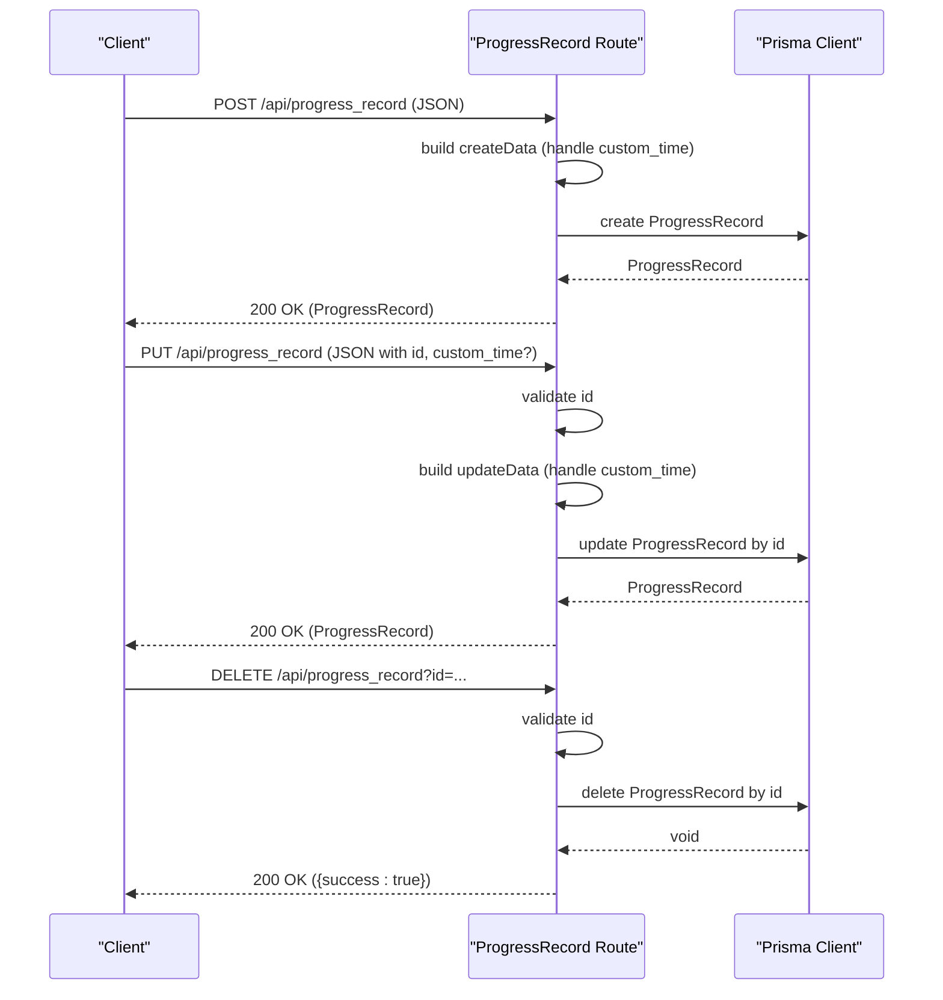

**Diagram sources**
- [progress_record route:6-154](file://src/app/api/progress_record/route.ts#L6-L154)
- [schema.prisma:51-59](file://prisma/schema.prisma#L51-L59)

**Section sources**
- [progress_record route:6-154](file://src/app/api/progress_record/route.ts#L6-L154)

#### Report CRUD Workflow
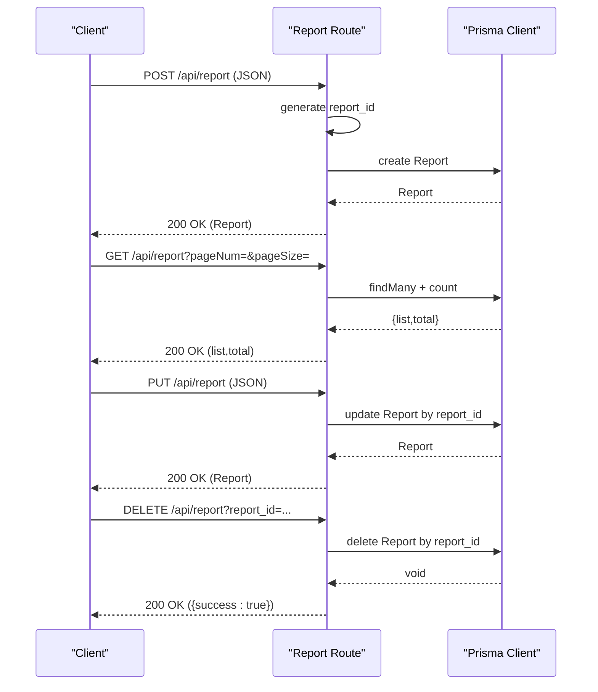

**Diagram sources**
- [report route:7-48](file://src/app/api/report/route.ts#L7-L48)
- [schema.prisma:61-69](file://prisma/schema.prisma#L61-L69)

**Section sources**
- [report route:7-48](file://src/app/api/report/route.ts#L7-L48)

### Tag Management and Filtering
- Tag Discovery:
  - The tag endpoint aggregates unique tags from Goals.
- Plan Filtering by Tag:
  - The plan endpoint filters plans by tag or by goal_id-derived tag.
- AI Assistant Integration:
  - The AI system can query system options (existing tags and difficulty standards) to guide plan creation.

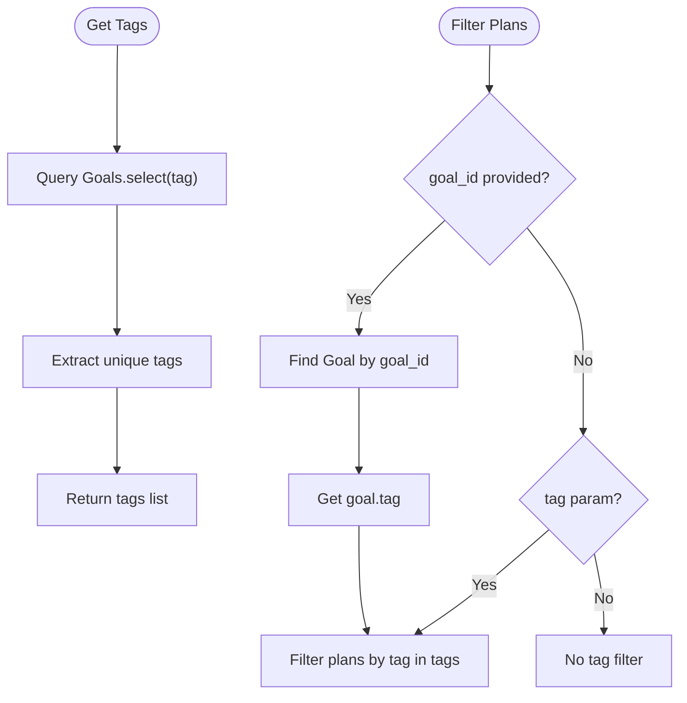

**Diagram sources**
- [tag route:6-11](file://src/app/api/tag/route.ts#L6-L11)
- [plan route:8-56](file://src/app/api/plan/route.ts#L8-L56)

**Section sources**
- [tag route:6-11](file://src/app/api/tag/route.ts#L6-L11)
- [plan route:8-56](file://src/app/api/plan/route.ts#L8-L56)
- [copilotkit route:483-518](file://src/app/api/copilotkit/route.ts#L483-L518)

## Dependency Analysis
- Internal Dependencies:
  - All API routes depend on Prisma Client to access models.
  - Plan depends on PlanTagAssociation and ProgressRecord.
  - ProgressRecord depends on Plan.
  - Report is independent.
- External Integrations:
  - AI assistant actions integrate with the data model to create plans, add progress records, and analyze user reports.
- Authentication:
  - Middleware enforces authentication for protected routes; login route issues JWT cookies.

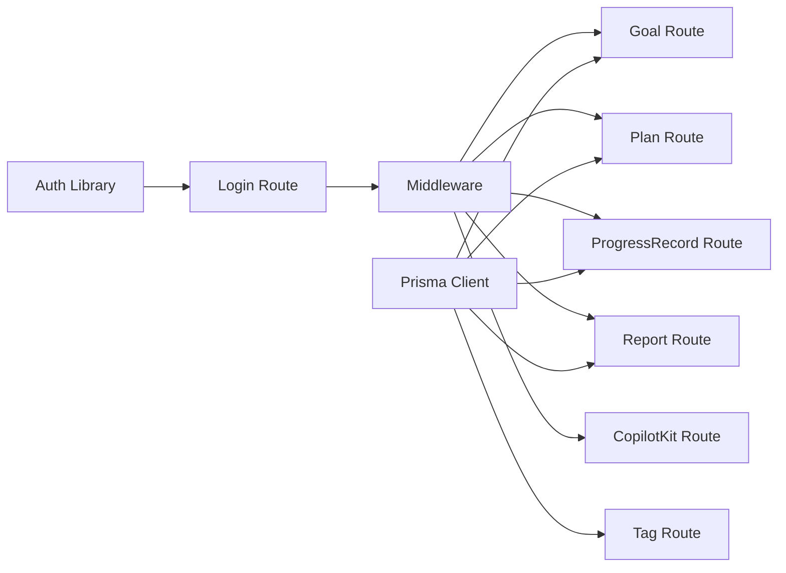

**Diagram sources**
- [auth library:1-69](file://src/lib/auth.ts#L1-L69)
- [auth login route:1-50](file://src/app/api/auth/login/route.ts#L1-L50)
- [middleware:1-40](file://middleware.ts#L1-L40)
- [goal route:1-51](file://src/app/api/goal/route.ts#L1-L51)
- [plan route:1-103](file://src/app/api/plan/route.ts#L1-L103)
- [progress_record route:1-154](file://src/app/api/progress_record/route.ts#L1-L154)
- [report route:1-48](file://src/app/api/report/route.ts#L1-L48)
- [tag route:1-11](file://src/app/api/tag/route.ts#L1-L11)
- [copilotkit route:1-1636](file://src/app/api/copilotkit/route.ts#L1-L1636)

**Section sources**
- [auth library:1-69](file://src/lib/auth.ts#L1-L69)
- [auth login route:1-50](file://src/app/api/auth/login/route.ts#L1-L50)
- [middleware:1-40](file://middleware.ts#L1-L40)
- [goal route:1-51](file://src/app/api/goal/route.ts#L1-L51)
- [plan route:1-103](file://src/app/api/plan/route.ts#L1-L103)
- [progress_record route:1-154](file://src/app/api/progress_record/route.ts#L1-L154)
- [report route:1-48](file://src/app/api/report/route.ts#L1-L48)
- [tag route:1-11](file://src/app/api/tag/route.ts#L1-L11)
- [copilotkit route:1-1636](file://src/app/api/copilotkit/route.ts#L1-L1636)

## Performance Considerations
- Indexing and Uniqueness:
  - Unique constraints on goal_id, plan_id, and report_id ensure fast lookups and prevent duplicates.
- Pagination:
  - API routes use skip/take for pagination to limit result sets.
- Relations:
  - Using include for tags and progressRecords in plan listings adds overhead; consider selective fetching when performance is critical.
- Recurrence:
  - Recurring plans require additional logic in AI actions; keep recurrence fields minimal and indexed where appropriate.
- Time Handling:
  - Custom time parsing in progress records adds CPU work; cache or pre-validate inputs when possible.

## Troubleshooting Guide
- Authentication Failures:
  - Missing or invalid auth-token cookie leads to 401 for API routes or redirect to login for pages.
- Missing Required Parameters:
  - Deleting Goal/Plan/Report requires the respective *_id parameter; otherwise, a 400 response is returned.
- ProgressRecord Validation:
  - Missing id during updates triggers a 400 error.
- AI Action Errors:
  - If plan lookup fails in AI actions, ensure plan_id exists or use findPlan first.
- Time Parsing Issues:
  - Custom time formats must be ISO or natural language patterns; otherwise, default to current time.

**Section sources**
- [middleware:22-30](file://middleware.ts#L22-L30)
- [goal route:44-50](file://src/app/api/goal/route.ts#L44-L50)
- [plan route:96-102](file://src/app/api/plan/route.ts#L96-L102)
- [report route:42-47](file://src/app/api/report/route.ts#L42-L47)
- [progress_record route:76-83](file://src/app/api/progress_record/route.ts#L76-L83)
- [copilotkit route:838-863](file://src/app/api/copilotkit/route.ts#L838-L863)

## Conclusion
The Goal-Mate data model centers on five entities that support goal setting, plan execution, progress logging, and reporting. Unique identifiers (goal_id, plan_id, report_id) and automatic timestamps provide robust identity and audit trails. API routes enforce validation and constraints, while the AI assistant integrates seamlessly with the model to automate common tasks. Understanding these models and their relationships is essential for extending functionality, optimizing queries, and maintaining data integrity.