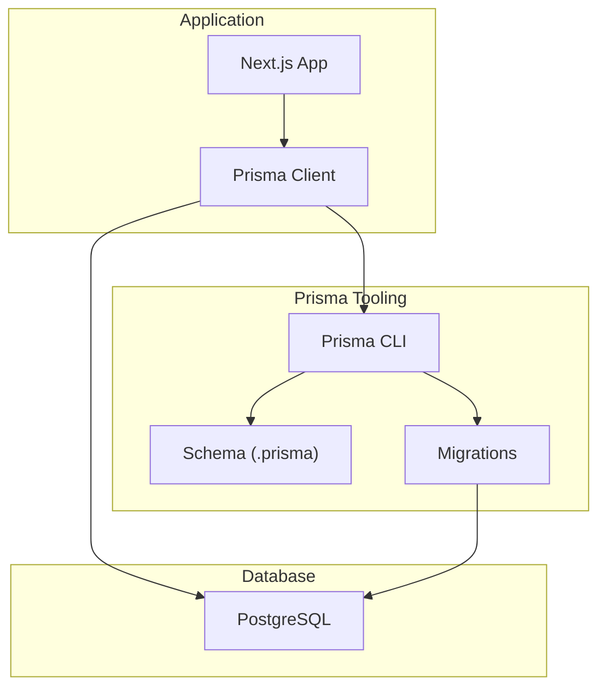
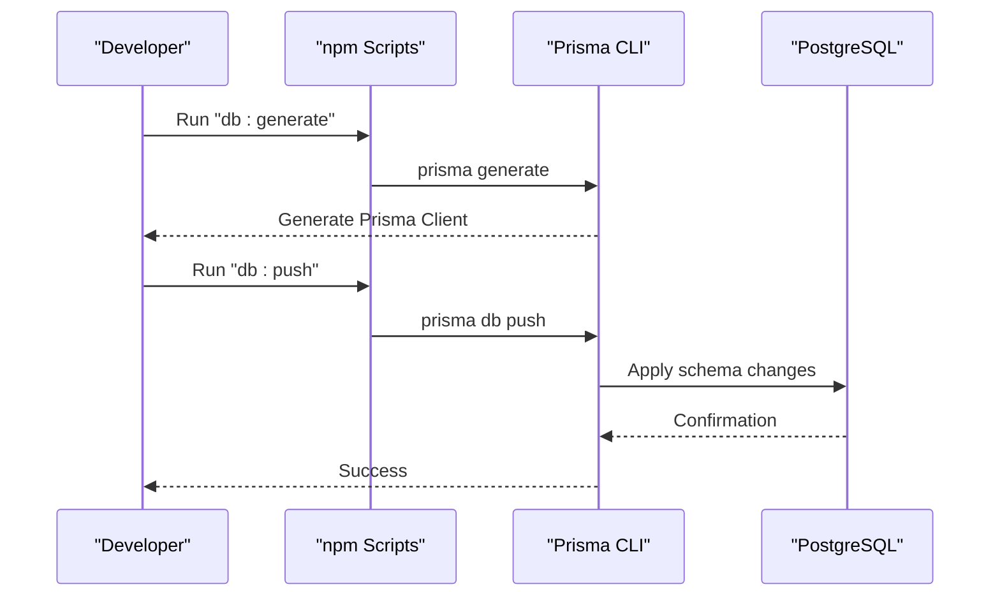
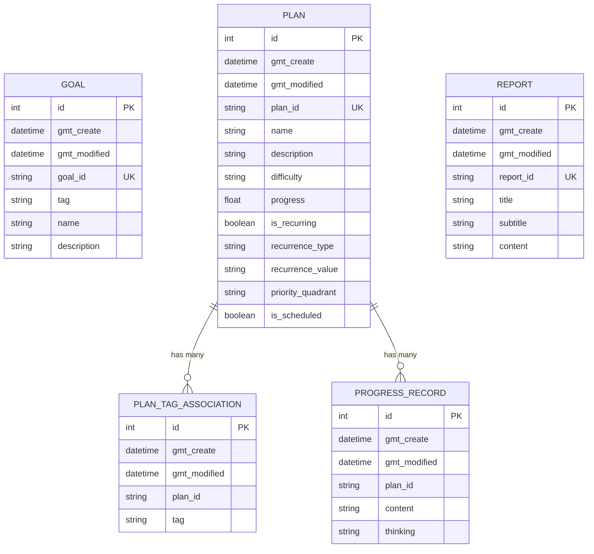
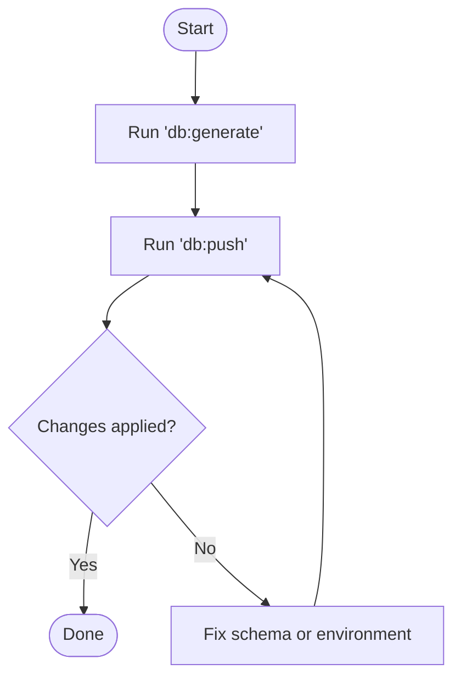
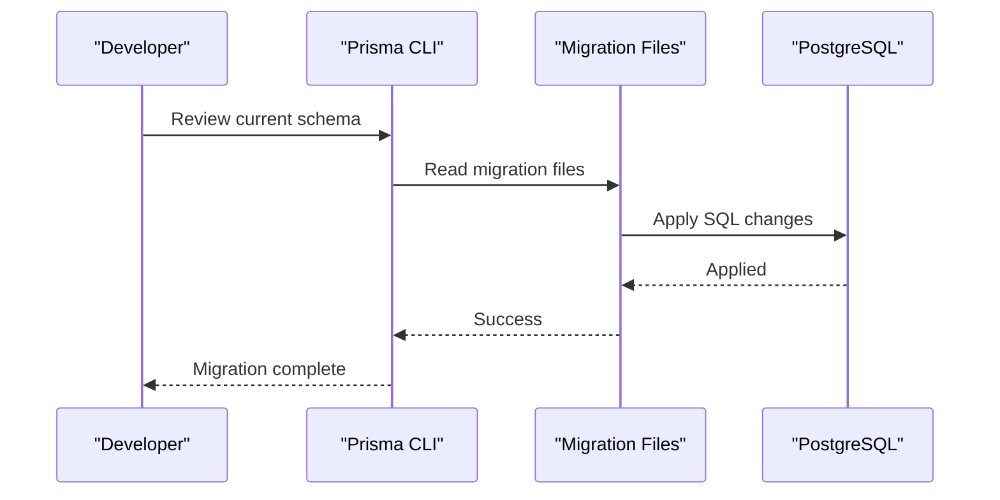
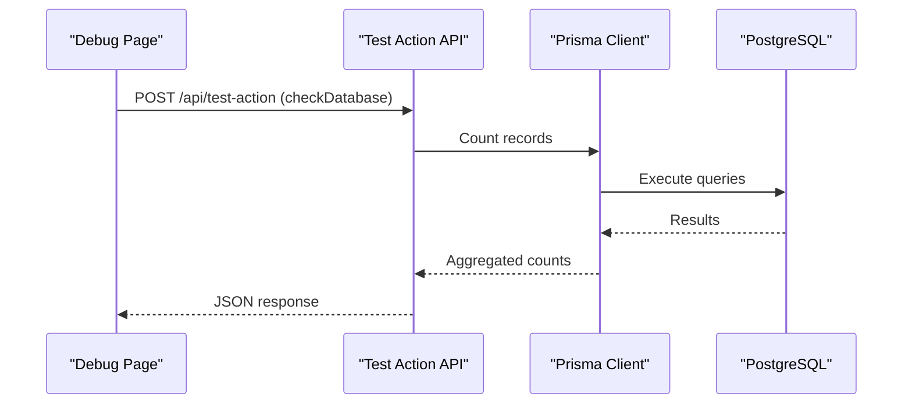
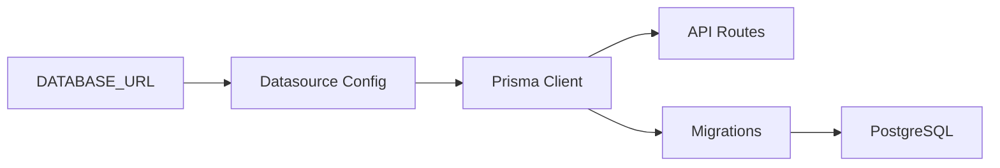

# Migration and Seeding

<cite>
**Referenced Files in This Document**
- [schema.prisma](file://prisma/schema.prisma)
- [package.json](file://package.json)
- [setup.md](file://setup.md)
- [ENV_TEMPLATE.md](file://ENV_TEMPLATE.md)
- [migration_lock.toml](file://prisma/migrations/migration_lock.toml)
- [20250530174537_init/migration.sql](file://prisma/migrations/20250530174537_init/migration.sql)
- [20250531155713_change_progress_to_float/migration.sql](file://prisma/migrations/20250531155713_change_progress_to_float/migration.sql)
- [20250602162342_add_recurring_fields/migration.sql](file://prisma/migrations/20250602162342_add_recurring_fields/migration.sql)
- [20260328175217_add_quadrant_priority/migration.sql](file://prisma/migrations/20260328175217_add_quadrant_priority/migration.sql)
- [route.ts](file://src/app/api/test-action/route.ts)
- [page.tsx](file://src/app/debug/page.tsx)
- [test-api.js](file://test-api.js)
</cite>

## Table of Contents
1. [Introduction](#introduction)
2. [Project Structure](#project-structure)
3. [Core Components](#core-components)
4. [Architecture Overview](#architecture-overview)
5. [Detailed Component Analysis](#detailed-component-analysis)
6. [Dependency Analysis](#dependency-analysis)
7. [Performance Considerations](#performance-considerations)
8. [Troubleshooting Guide](#troubleshooting-guide)
9. [Conclusion](#conclusion)

## Introduction
This document explains how database schema management and initial data setup work in the Goal-Mate application using Prisma. It covers:
- How Prisma migrations are structured and executed
- How to evolve the schema safely across environments
- How the application connects to PostgreSQL via environment variables
- Practical examples of common migration scenarios
- Best practices for versioning, rollbacks, and production deployments
- Development workflow integration and testing database connectivity

## Project Structure
The database-related assets and scripts live under the prisma directory and are orchestrated via npm scripts. The application reads the PostgreSQL connection string from an environment variable and uses Prisma Client to interact with the database.

**Diagram sources**
- [schema.prisma:11-14](file://prisma/schema.prisma#L11-L14)
- [package.json:10-14](file://package.json#L10-L14)

**Section sources**
- [schema.prisma:1-72](file://prisma/schema.prisma#L1-L72)
- [package.json:10-14](file://package.json#L10-L14)

## Core Components
- Prisma Schema: Defines models, relations, and the PostgreSQL datasource URL sourced from an environment variable.
- Migrations: SQL-based migration files generated by Prisma that evolve the database schema over time.
- Environment Variables: DATABASE_URL points to the PostgreSQL instance.
- Scripts: npm scripts to generate Prisma Client, push schema changes, open Studio, reset, and full setup.

Key behaviors:
- The datasource provider is PostgreSQL and the URL is loaded from the DATABASE_URL environment variable.
- Models define primary keys, timestamps, uniqueness constraints, optional fields, and relations.
- Migrations are stored under prisma/migrations with a lock file indicating the provider.

**Section sources**
- [schema.prisma:11-14](file://prisma/schema.prisma#L11-L14)
- [schema.prisma:16-71](file://prisma/schema.prisma#L16-L71)
- [migration_lock.toml:1-4](file://prisma/migrations/migration_lock.toml#L1-L4)
- [package.json:10-14](file://package.json#L10-L14)

## Architecture Overview
The migration and seeding workflow integrates Prisma Client, Prisma CLI, and PostgreSQL. The application uses Prisma Client to connect to the database, while Prisma CLI manages schema changes and migrations.

**Diagram sources**
- [package.json:10-14](file://package.json#L10-L14)
- [schema.prisma:11-14](file://prisma/schema.prisma#L11-L14)

## Detailed Component Analysis

### Prisma Schema and Datasource Configuration
- Provider: PostgreSQL
- URL: Loaded from DATABASE_URL environment variable
- Models: Goal, Plan, PlanTagAssociation, ProgressRecord, Report
- Relations: Plan has many PlanTagAssociation and ProgressRecord entries
- Constraints: Unique identifiers via plan_id and goal_id; timestamps managed automatically

**Diagram sources**
- [schema.prisma:16-71](file://prisma/schema.prisma#L16-L71)

**Section sources**
- [schema.prisma:11-14](file://prisma/schema.prisma#L11-L14)
- [schema.prisma:16-71](file://prisma/schema.prisma#L16-L71)

### Environment Variable Usage
- DATABASE_URL: Required to connect to PostgreSQL. The value is injected into the Prisma datasource.
- Template and setup guidance are provided in ENV_TEMPLATE.md and setup.md.

Practical usage:
- Set DATABASE_URL to a valid PostgreSQL connection string.
- Ensure the database exists and the user has appropriate privileges.

**Section sources**
- [schema.prisma:11-14](file://prisma/schema.prisma#L11-L14)
- [ENV_TEMPLATE.md:5-20](file://ENV_TEMPLATE.md#L5-L20)
- [setup.md:52-56](file://setup.md#L52-L56)

### Migration Execution and Workflow
- Generate Prisma Client: npm run db:generate
- Apply schema changes: npm run db:push
- Reset and re-apply: npm run db:reset
- Full setup: npm run setup

**Diagram sources**
- [package.json:10-14](file://package.json#L10-L14)

**Section sources**
- [package.json:10-14](file://package.json#L10-L14)

### Existing Migrations and Schema Evolution
The repository includes several migration files that demonstrate schema evolution over time. These migrations are SQL-based and applied by Prisma.

- Initial schema creation
- Change progress field to float
- Add recurring fields
- Add quadrant priority field

**Diagram sources**
- [20250530174537_init/migration.sql](file://prisma/migrations/20250530174537_init/migration.sql)
- [20250531155713_change_progress_to_float/migration.sql](file://prisma/migrations/20250531155713_change_progress_to_float/migration.sql)
- [20250602162342_add_recurring_fields/migration.sql](file://prisma/migrations/20250602162342_add_recurring_fields/migration.sql)
- [20260328175217_add_quadrant_priority/migration.sql](file://prisma/migrations/20260328175217_add_quadrant_priority/migration.sql)

**Section sources**
- [migration_lock.toml:1-4](file://prisma/migrations/migration_lock.toml#L1-L4)
- [20250530174537_init/migration.sql](file://prisma/migrations/20250530174537_init/migration.sql)
- [20250531155713_change_progress_to_float/migration.sql](file://prisma/migrations/20250531155713_change_progress_to_float/migration.sql)
- [20250602162342_add_recurring_fields/migration.sql](file://prisma/migrations/20250602162342_add_recurring_fields/migration.sql)
- [20260328175217_add_quadrant_priority/migration.sql](file://prisma/migrations/20260328175217_add_quadrant_priority/migration.sql)

### Practical Migration Scenarios
Below are common scenarios with recommended approaches. These describe what to change in the Prisma schema and how to apply the changes.

- Add a new field to an existing model
  - Modify the model definition in the schema to include the new field.
  - Run the generation and push commands to apply the change.
  - Reference: [schema.prisma:16-71](file://prisma/schema.prisma#L16-L71), [package.json:10-14](file://package.json#L10-L14)

- Modify a constraint (e.g., change a field to required or optional)
  - Update the field definition in the schema (e.g., remove a question mark for required).
  - Run the generation and push commands.
  - Reference: [schema.prisma:16-71](file://prisma/schema.prisma#L16-L71), [package.json:10-14](file://package.json#L10-L14)

- Add a relation between models
  - Define the relation fields and relation directive in the schema.
  - Run the generation and push commands.
  - Reference: [schema.prisma:16-71](file://prisma/schema.prisma#L16-L71), [package.json:10-14](file://package.json#L10-L14)

- Remove or rename a field
  - Update the schema accordingly.
  - Consider data preservation and backward compatibility.
  - Run the generation and push commands.
  - Reference: [schema.prisma:16-71](file://prisma/schema.prisma#L16-L71), [package.json:10-14](file://package.json#L10-L14)

- Seed data (initial dataset)
  - Seed data is not defined in the schema; it is typically inserted programmatically during setup or CI.
  - The application includes a test action endpoint that can be used to verify database connectivity and basic operations.
  - Reference: [route.ts:125-138](file://src/app/api/test-action/route.ts#L125-L138)

### Development Workflow Integration
- Local development: Install dependencies, generate Prisma Client, and push schema changes.
- Debugging: Use the debug page to trigger test actions against the API, which internally uses Prisma Client to query the database.
- Testing: A simple script tests health checks and database connectivity.

**Diagram sources**
- [page.tsx:64-86](file://src/app/debug/page.tsx#L64-L86)
- [route.ts:125-138](file://src/app/api/test-action/route.ts#L125-L138)

**Section sources**
- [setup.md:65-69](file://setup.md#L65-L69)
- [page.tsx:64-86](file://src/app/debug/page.tsx#L64-L86)
- [test-api.js:11-18](file://test-api.js#L11-L18)

## Dependency Analysis
- Prisma Client depends on the Prisma schema and the DATABASE_URL environment variable.
- Migrations depend on the Prisma CLI and the target PostgreSQL instance.
- The application’s API routes use Prisma Client to interact with the database.

**Diagram sources**
- [schema.prisma:11-14](file://prisma/schema.prisma#L11-L14)
- [route.ts:1-4](file://src/app/api/test-action/route.ts#L1-L4)

**Section sources**
- [schema.prisma:11-14](file://prisma/schema.prisma#L11-L14)
- [route.ts:1-4](file://src/app/api/test-action/route.ts#L1-L4)

## Performance Considerations
- Keep migrations minimal and incremental to reduce downtime during deployments.
- Use transactions where supported by the database to ensure atomicity.
- Monitor long-running migrations and consider breaking large changes into smaller steps.
- Use indexes judiciously; add them after bulk inserts if needed.

## Troubleshooting Guide
Common issues and resolutions:
- Database connection failures
  - Verify DATABASE_URL correctness and network accessibility.
  - Ensure the database exists and the user has proper permissions.
  - Reference: [ENV_TEMPLATE.md:24-26](file://ENV_TEMPLATE.md#L24-L26), [setup.md:52-56](file://setup.md#L52-L56)

- Migration errors
  - Review the migration SQL files for correctness.
  - Ensure the Prisma Client is regenerated after schema changes.
  - Reference: [package.json:10-14](file://package.json#L10-L14), [20250530174537_init/migration.sql](file://prisma/migrations/20250530174537_init/migration.sql)

- Testing database connectivity
  - Use the debug page or the test script to validate connectivity and basic operations.
  - Reference: [page.tsx:64-86](file://src/app/debug/page.tsx#L64-L86), [test-api.js:11-18](file://test-api.js#L11-L18)

**Section sources**
- [ENV_TEMPLATE.md:24-26](file://ENV_TEMPLATE.md#L24-L26)
- [setup.md:52-56](file://setup.md#L52-L56)
- [package.json:10-14](file://package.json#L10-L14)
- [page.tsx:64-86](file://src/app/debug/page.tsx#L64-L86)
- [test-api.js:11-18](file://test-api.js#L11-L18)

## Conclusion
Goal-Mate uses Prisma for schema management and PostgreSQL for persistence. The setup relies on environment variables for database connectivity, and migrations are stored as SQL files under prisma/migrations. By following the documented workflow—generating Prisma Client, applying schema changes, and validating connectivity—you can evolve the database safely across development, staging, and production environments.