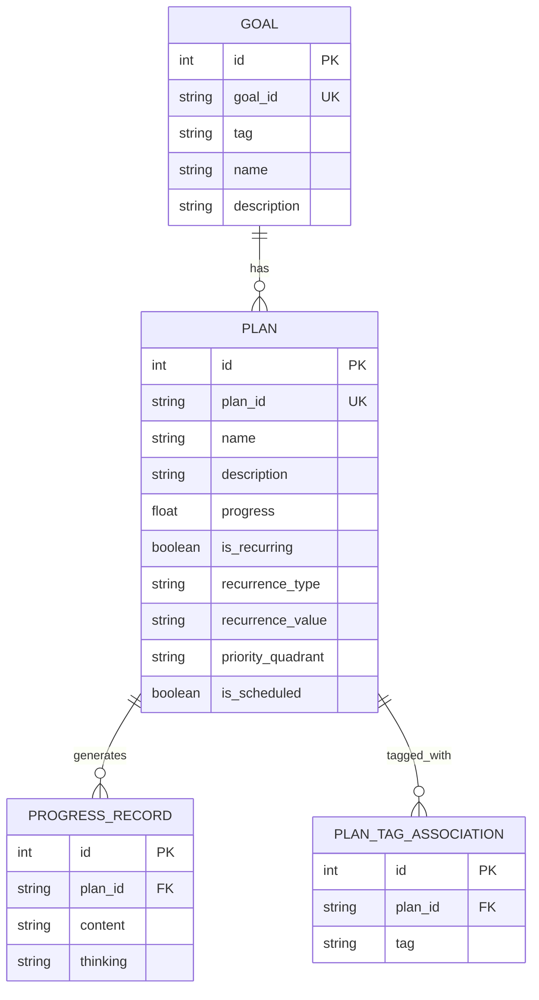
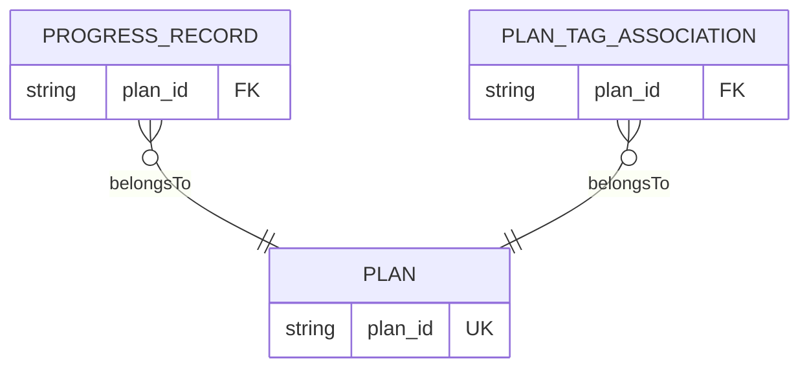
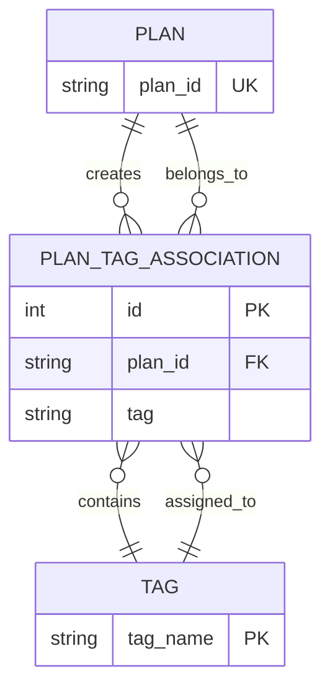
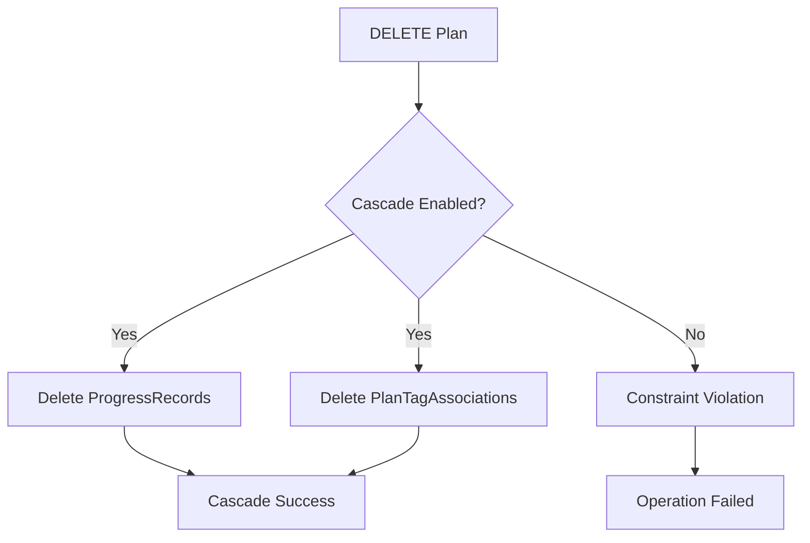
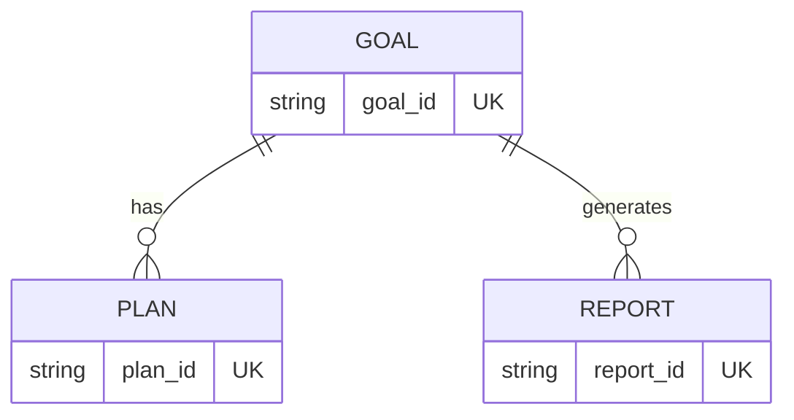
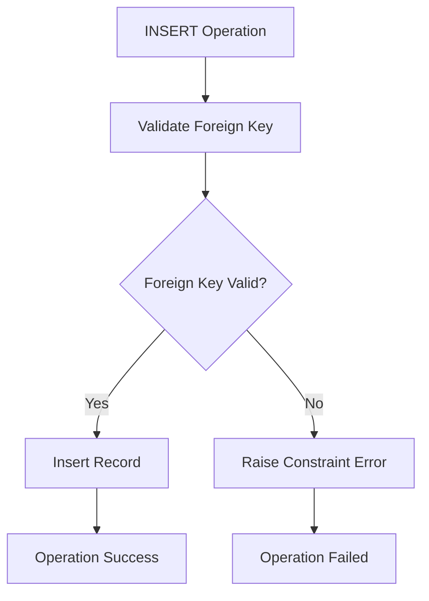
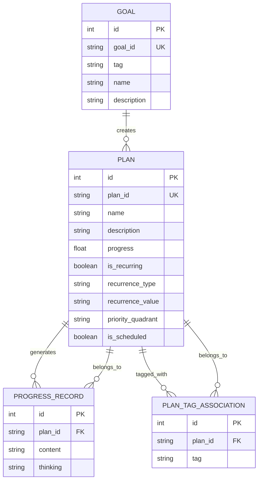

# Relationships and Constraints

<cite>
**Referenced Files in This Document**
- [schema.prisma](file://prisma/schema.prisma)
- [route.ts](file://src/app/api/plan/route.ts)
- [route.ts](file://src/app/api/progress_record/route.ts)
- [route.ts](file://src/app/api/tag/route.ts)
- [route.ts](file://src/app/api/goal/route.ts)
</cite>

## Table of Contents
1. [Introduction](#introduction)
2. [Database Model Overview](#database-model-overview)
3. [Core Relationship Analysis](#core-relationship-analysis)
4. [Foreign Key Relationships](#foreign-key-relationships)
5. [Many-to-Many Implementation](#many-to-many-implementation)
6. [Cascade Delete Behavior](#cascade-delete-behavior)
7. [Unique Constraints and Identifier Fields](#unique-constraints-and-identifier-fields)
8. [Indexing Strategies](#indexing-strategies)
9. [Constraint Enforcement](#constraint-enforcement)
10. [Querying Patterns and Data Integrity](#querying-patterns-and-data-integrity)
11. [Relationship Diagrams](#relationship-diagrams)
12. [Conclusion](#conclusion)

## Introduction

The Goal-Mate application implements a PostgreSQL database schema using Prisma ORM that manages goal-oriented planning and progress tracking. This document focuses specifically on the database relationships and referential integrity mechanisms that ensure data consistency and enable efficient querying patterns.

The schema defines three primary entities: Goal, Plan, and ProgressRecord, with Plan serving as the central hub that connects to both Goals and ProgressRecords. The relationships are designed to support flexible tagging through a join table pattern while maintaining referential integrity through carefully configured foreign keys and cascade behaviors.

## Database Model Overview

The application follows a hierarchical data model where Goals represent high-level objectives, Plans represent actionable items derived from goals, and ProgressRecords track completion activities for individual plans.

**Diagram sources**
- [schema.prisma:16-71](file://prisma/schema.prisma#L16-L71)

**Section sources**
- [schema.prisma:16-71](file://prisma/schema.prisma#L16-L71)

## Core Relationship Analysis

The database relationships are structured around three fundamental entities with specific cardinalities and constraints:

### Entity Cardinalities
- **Goal to Plan**: One-to-Many relationship where each goal can spawn multiple plans
- **Plan to ProgressRecord**: One-to-Many relationship where each plan generates multiple progress records
- **Plan to Tag**: Many-to-Many relationship implemented through a join table (PlanTagAssociation)

### Relationship Directionality
The relationships are unidirectional, flowing from higher-level concepts to more granular details:
- Goals → Plans (derivation relationship)
- Plans → ProgressRecords (activity tracking)
- Plans ↔ Tags (classification relationship)

**Section sources**
- [schema.prisma:26-61](file://prisma/schema.prisma#L26-L61)

## Foreign Key Relationships

The foreign key relationships are explicitly defined in the Prisma schema with careful consideration for referential integrity and cascade behavior.

### Primary Foreign Key Definitions

**Diagram sources**
- [schema.prisma:50](file://prisma/schema.prisma#L50)
- [schema.prisma:60](file://prisma/schema.prisma#L60)

### Foreign Key Specifications

Each foreign key relationship is defined with explicit field mapping and reference targets:

**ProgressRecord Foreign Key:**
- Field: `plan_id` (String)
- References: `plan.plan_id` (String)
- Cascade Behavior: Cascade deletion enabled

**PlanTagAssociation Foreign Key:**
- Field: `plan_id` (String)
- References: `plan.plan_id` (String)
- Cascade Behavior: Cascade deletion enabled

The foreign key definitions ensure that every ProgressRecord and PlanTagAssociation record maintains referential integrity with its parent Plan entity.

**Section sources**
- [schema.prisma:44-61](file://prisma/schema.prisma#L44-L61)

## Many-to-Many Implementation

The many-to-many relationship between Plans and Tags is implemented through a dedicated join table called PlanTagAssociation. This design choice enables flexible tagging while maintaining referential integrity.

### Join Table Design

**Diagram sources**
- [schema.prisma:44-51](file://prisma/schema.prisma#L44-L51)

### Implementation Details

The many-to-many relationship is implemented as follows:

1. **Join Table Structure**: PlanTagAssociation serves as the junction table containing foreign keys to both Plan and Tag entities
2. **Composite Relationship**: Each Plan can be associated with multiple Tags through multiple PlanTagAssociation records
3. **Flexible Tagging**: Tags are stored as simple string values, allowing for dynamic tag assignment without predefined tag categories
4. **Cascade Deletion**: When a Plan is deleted, all associated PlanTagAssociation records are automatically removed

### Application-Level Management

The application manages the many-to-many relationship through dedicated API endpoints:

**Tag Retrieval Endpoint**: The system retrieves available tags by extracting unique tag values from the Goal model, enabling tag-based filtering and search functionality.

**Plan Tag Management**: When updating plans, the application replaces existing tag associations by deleting all current associations and creating new ones based on the provided tag array.

**Section sources**
- [schema.prisma:44-51](file://prisma/schema.prisma#L44-L51)
- [route.ts:6](file://src/app/api/tag/route.ts#L6-L11)
- [route.ts:98-103](file://src/app/api/plan/route.ts#L98-L103)

## Cascade Delete Behavior

The database schema implements cascade delete behavior for both child relationships to maintain referential integrity and prevent orphaned records.

### Cascade Delete Configuration

**Diagram sources**
- [schema.prisma:50](file://prisma/schema.prisma#L50)
- [schema.prisma:60](file://prisma/schema.prisma#L60)

### Cascade Behavior Details

Both foreign key relationships are configured with `onDelete: Cascade`:

1. **ProgressRecord Cascade**: When a Plan is deleted, all associated ProgressRecord entries are automatically removed
2. **PlanTagAssociation Cascade**: When a Plan is deleted, all associated tag assignments are automatically removed

This cascade behavior ensures data consistency by preventing orphaned records that would violate referential integrity constraints.

**Section sources**
- [schema.prisma:50](file://prisma/schema.prisma#L50)
- [schema.prisma:60](file://prisma/schema.prisma#L60)

## Unique Constraints and Identifier Fields

The schema implements unique constraints on identifier fields to ensure data integrity and enable efficient lookups.

### Unique Identifier Fields

**Diagram sources**
- [schema.prisma:19](file://prisma/schema.prisma#L19)
- [schema.prisma:29](file://prisma/schema.prisma#L29)
- [schema.prisma:66](file://prisma/schema.prisma#L66)

### Identifier Field Specifications

**Goal Identifier (`goal_id`)**:
- Type: String
- Constraint: Unique
- Purpose: Primary external identifier for goals
- Generation: Auto-generated using UUID-based approach

**Plan Identifier (`plan_id`)**:
- Type: String
- Constraint: Unique
- Purpose: Primary external identifier for plans
- Generation: Auto-generated using UUID-based approach

**Report Identifier (`report_id`)**:
- Type: String
- Constraint: Unique
- Purpose: Primary external identifier for reports

### Auto-Increment Primary Keys

All entities maintain auto-increment integer primary keys (`id`) alongside their unique string identifiers, providing internal database references while maintaining external API-friendly identifiers.

**Section sources**
- [schema.prisma:17-20](file://prisma/schema.prisma#L17-L20)
- [schema.prisma:27-30](file://prisma/schema.prisma#L27-L30)
- [schema.prisma:63-67](file://prisma/schema.prisma#L63-L67)

## Indexing Strategies

The database schema employs strategic indexing to optimize query performance and maintain referential integrity.

### Primary Key Indexes

All entities utilize auto-increment integer primary keys with automatic index creation:

- **Goal.id**: Auto-increment primary key index
- **Plan.id**: Auto-increment primary key index  
- **ProgressRecord.id**: Auto-increment primary key index
- **PlanTagAssociation.id**: Auto-increment primary key index
- **Report.id**: Auto-increment primary key index

### Unique Constraint Indexes

Unique constraints automatically create unique indexes:

- **Goal.goal_id**: Unique index for external identifier lookup
- **Plan.plan_id**: Unique index for plan identification
- **Report.report_id**: Unique index for report identification

### Foreign Key Indexes

Foreign key relationships benefit from automatic index creation:

- **ProgressRecord.plan_id**: Index for efficient plan-to-progress record joins
- **PlanTagAssociation.plan_id**: Index for efficient plan-to-tag joins

### Additional Index Considerations

While the current schema doesn't explicitly define additional indexes, the following indexes would enhance query performance for common operations:

- **ProgressRecord.gmt_create**: For chronological sorting and filtering
- **PlanTagAssociation.tag**: For tag-based filtering and search
- **Plan.name**: For plan name-based searches
- **Plan.is_scheduled**: For scheduling-related queries

**Section sources**
- [schema.prisma:19](file://prisma/schema.prisma#L19)
- [schema.prisma:29](file://prisma/schema.prisma#L29)
- [schema.prisma:66](file://prisma/schema.prisma#L66)
- [schema.prisma:50](file://prisma/schema.prisma#L50)
- [schema.prisma:60](file://prisma/schema.prisma#L60)

## Constraint Enforcement

The database schema enforces various constraints to maintain data integrity and consistency across all relationships.

### Referential Integrity Constraints

### Constraint Types Implemented

1. **Primary Key Constraints**: Ensures unique identification of all entities
2. **Unique Constraints**: Prevents duplicate external identifiers
3. **Foreign Key Constraints**: Maintains referential integrity between related entities
4. **Not Null Constraints**: Applied to required fields (auto-generated timestamps)
5. **Default Value Constraints**: Provides sensible defaults for optional fields

### Cascade Constraint Enforcement

The cascade delete behavior is enforced at the database level, ensuring that when parent records are deleted, all dependent child records are automatically removed in the correct order to maintain referential integrity.

**Section sources**
- [schema.prisma:44-61](file://prisma/schema.prisma#L44-L61)

## Querying Patterns and Data Integrity

The relationship design supports several key querying patterns that are essential for the application's functionality.

### Common Query Patterns

1. **Plan Listing with Tags and Progress Records**:
   - Retrieve plans with associated tags and recent progress records
   - Support pagination and filtering by various criteria
   - Enable tag-based filtering and goal-derived filtering

2. **Progress Record Management**:
   - List progress records for specific plans
   - Support chronological ordering and pagination
   - Enable custom timestamp management

3. **Tag-Based Filtering**:
   - Filter plans by associated tags
   - Support tag discovery and autocomplete functionality
   - Enable cross-goal tag-based queries

### Data Integrity Support

The relationship design ensures data integrity through:

- **Automatic Cascade Deletion**: Prevents orphaned records when plans are removed
- **Unique Identifier Enforcement**: Ensures consistent external references
- **Foreign Key Validation**: Maintains referential integrity across all relationships
- **Timestamp Consistency**: Automatic creation and modification timestamps

**Section sources**
- [route.ts:41-66](file://src/app/api/plan/route.ts#L41-L66)
- [route.ts:7-23](file://src/app/api/progress_record/route.ts#L7-L23)
- [route.ts:6](file://src/app/api/tag/route.ts#L6-L11)

## Relationship Diagrams

### Complete Entity Relationship Diagram

**Diagram sources**
- [schema.prisma:16-61](file://prisma/schema.prisma#L16-L61)

### Relationship Cardinality Matrix

| Relationship | Parent Entity | Child Entity | Cardinality | Cascade Delete |
|--------------|---------------|--------------|-------------|----------------|
| Goal → Plan | Goal | Plan | One-to-Many | No |
| Plan → ProgressRecord | Plan | ProgressRecord | One-to-Many | Yes |
| Plan → PlanTagAssociation | Plan | PlanTagAssociation | One-to-Many | Yes |
| Plan ↔ Tag | Plan | Tag | Many-to-Many | Yes (through join table) |

### Self-Referencing Pattern Analysis

The current schema does not implement self-referencing relationships. All relationships are strictly parent-child or many-to-many through join tables, which simplifies the data model and reduces complexity.

**Section sources**
- [schema.prisma:26-61](file://prisma/schema.prisma#L26-L61)

## Conclusion

The Goal-Mate application's database schema demonstrates robust relationship design with strong referential integrity enforcement. The carefully configured foreign key relationships, cascade delete behaviors, and unique constraints ensure data consistency while supporting the application's core functionality.

Key strengths of the relationship design include:

- **Clear Hierarchical Structure**: Well-defined parent-child relationships that mirror real-world planning concepts
- **Flexible Tagging**: Many-to-many relationship implementation through a dedicated join table
- **Automatic Data Cleanup**: Cascade delete behavior prevents orphaned records
- **Efficient Query Support**: Strategic indexing and constraint enforcement enable optimal query performance
- **External Identifier Management**: Separate unique string identifiers alongside internal auto-increment keys

The schema successfully balances flexibility with data integrity, enabling complex querying patterns while maintaining referential consistency across all entity relationships.