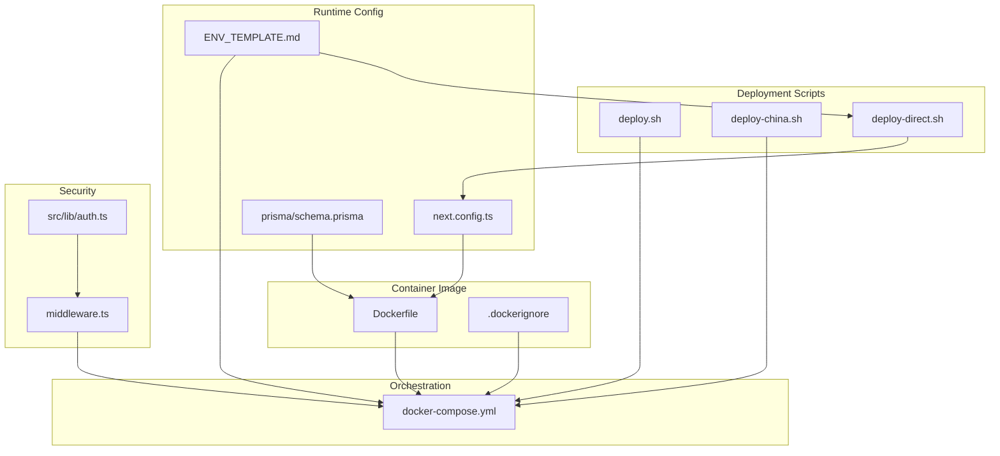
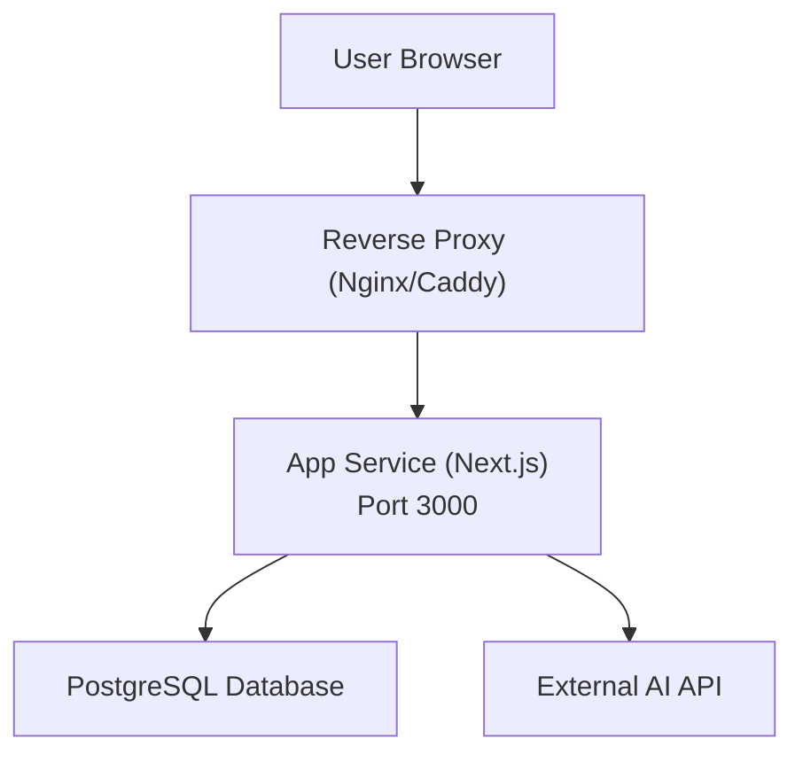
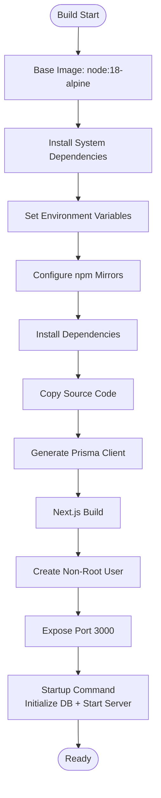
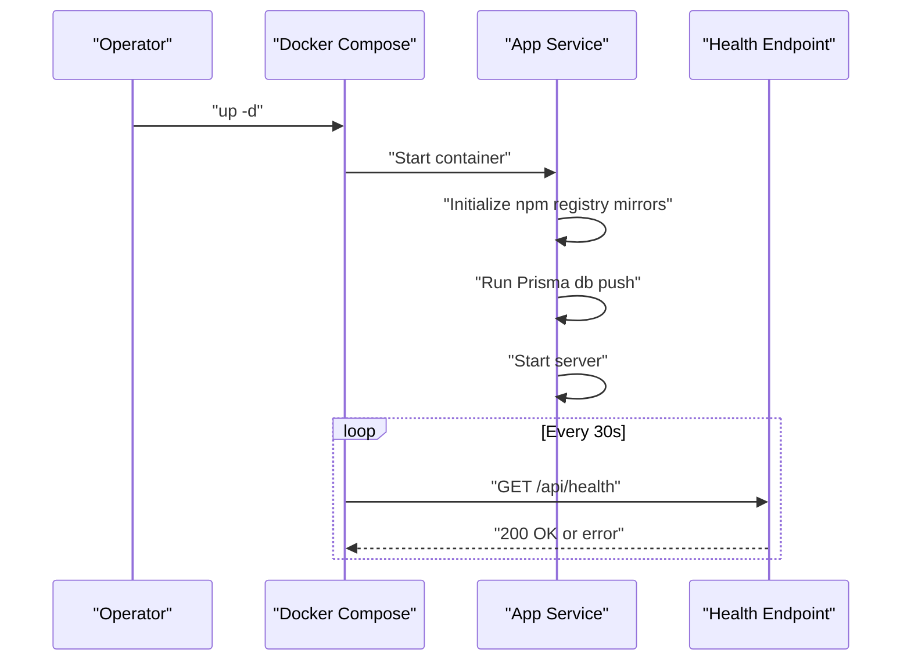
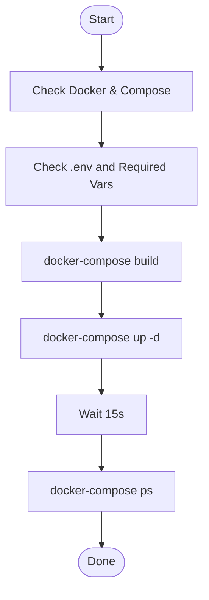
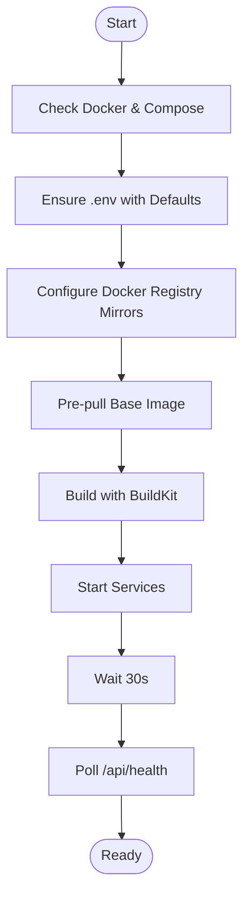
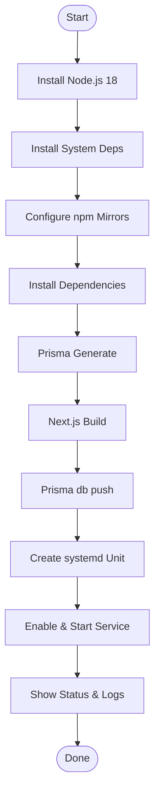
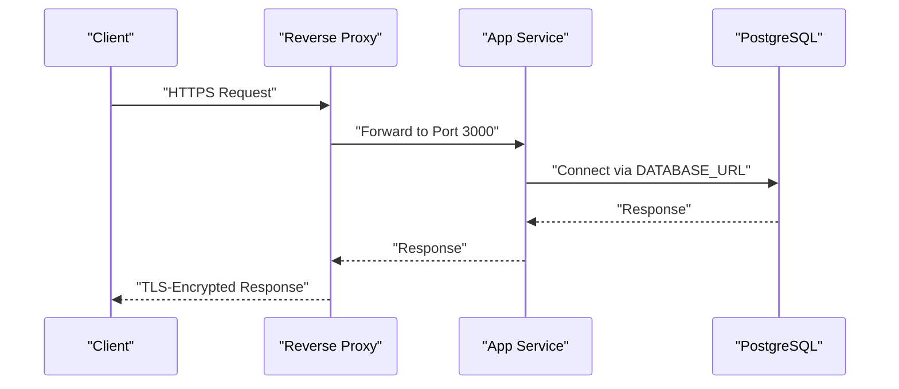
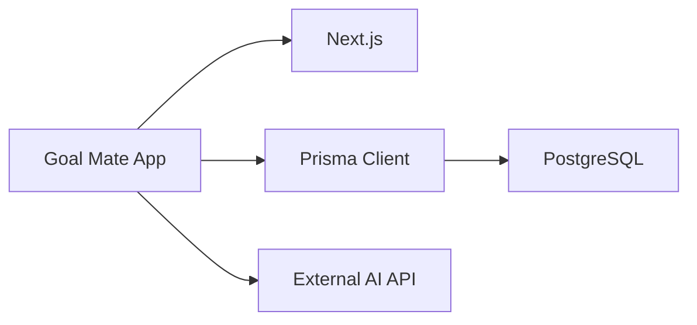

# Deployment & Operations

<cite>
**Referenced Files in This Document**
- [Dockerfile](file://Dockerfile)
- [docker-compose.yml](file://docker-compose.yml)
- [DEPLOYMENT.md](file://DEPLOYMENT.md)
- [DEPLOY-CHINA.md](file://DEPLOY-CHINA.md)
- [deploy.sh](file://deploy.sh)
- [deploy-china.sh](file://deploy-china.sh)
- [deploy-direct.sh](file://deploy-direct.sh)
- [ENV_TEMPLATE.md](file://ENV_TEMPLATE.md)
- [next.config.ts](file://next.config.ts)
- [package.json](file://package.json)
- [prisma/schema.prisma](file://prisma/schema.prisma)
- [.dockerignore](file://.dockerignore)
- [middleware.ts](file://middleware.ts)
- [src/lib/auth.ts](file://src/lib/auth.ts)
</cite>

## Table of Contents
1. [Introduction](#introduction)
2. [Project Structure](#project-structure)
3. [Core Components](#core-components)
4. [Architecture Overview](#architecture-overview)
5. [Detailed Component Analysis](#detailed-component-analysis)
6. [Dependency Analysis](#dependency-analysis)
7. [Performance Considerations](#performance-considerations)
8. [Troubleshooting Guide](#troubleshooting-guide)
9. [Conclusion](#conclusion)
10. [Appendices](#appendices)

## Introduction
This document provides a comprehensive guide to deploying and operating the Goal Mate application in production. It covers containerization with Docker, multi-stage build strategies, orchestration via Docker Compose, environment-specific deployment scripts (standard, China region, direct deployment), production configuration and environment management, scaling considerations, monitoring and logging, backup and maintenance, security hardening, SSL/TLS and network security, troubleshooting, disaster recovery, and CI/CD integration.

## Project Structure
The deployment assets and operational artifacts are organized as follows:
- Containerization: Dockerfile defines the production image; .dockerignore controls build context.
- Orchestration: docker-compose.yml orchestrates the application service with environment variables, health checks, and resource limits.
- Scripts: deploy.sh (standard), deploy-china.sh (China-optimized), and deploy-direct.sh (direct installation) automate deployments across environments.
- Configuration: ENV_TEMPLATE.md documents environment variables; next.config.ts enables standalone output for Docker; prisma/schema.prisma defines the Postgres-backed data model.
- Security: middleware.ts enforces authentication checks; src/lib/auth.ts manages JWT signing and verification.

**Diagram sources**
- [Dockerfile:1-68](file://Dockerfile#L1-L68)
- [.dockerignore:1-51](file://.dockerignore#L1-L51)
- [docker-compose.yml:1-56](file://docker-compose.yml#L1-L56)
- [deploy.sh:1-224](file://deploy.sh#L1-L224)
- [deploy-china.sh:1-113](file://deploy-china.sh#L1-L113)
- [deploy-direct.sh:1-135](file://deploy-direct.sh#L1-L135)
- [ENV_TEMPLATE.md:1-56](file://ENV_TEMPLATE.md#L1-L56)
- [next.config.ts:1-29](file://next.config.ts#L1-L29)
- [prisma/schema.prisma:1-70](file://prisma/schema.prisma#L1-L70)
- [middleware.ts:1-40](file://middleware.ts#L1-L40)
- [src/lib/auth.ts:1-69](file://src/lib/auth.ts#L1-L69)

**Section sources**
- [Dockerfile:1-68](file://Dockerfile#L1-L68)
- [docker-compose.yml:1-56](file://docker-compose.yml#L1-L56)
- [deploy.sh:1-224](file://deploy.sh#L1-L224)
- [deploy-china.sh:1-113](file://deploy-china.sh#L1-L113)
- [deploy-direct.sh:1-135](file://deploy-direct.sh#L1-L135)
- [ENV_TEMPLATE.md:1-56](file://ENV_TEMPLATE.md#L1-L56)
- [next.config.ts:1-29](file://next.config.ts#L1-L29)
- [prisma/schema.prisma:1-70](file://prisma/schema.prisma#L1-L70)
- [middleware.ts:1-40](file://middleware.ts#L1-L40)
- [src/lib/auth.ts:1-69](file://src/lib/auth.ts#L1-L69)

## Core Components
- Production Docker image: Built from a Node.js Alpine base, installs system dependencies, configures npm mirrors for performance, generates Prisma client, builds the Next.js app, creates a non-root user, exposes port 3000, and starts the server after initializing the database schema.
- Docker Compose service: Defines the application service with environment variables, health checks, resource limits, and a custom bridge network.
- Deployment scripts:
  - Standard: deploy.sh validates prerequisites, prepares environment variables, builds and starts services, and provides helpers for logs, cleanup, and status.
  - China: deploy-china.sh automates mirror configuration, pre-pulls base images, builds with BuildKit, and verifies health.
  - Direct: deploy-direct.sh installs Node.js and system dependencies, configures npm mirrors, builds and initializes the database, then runs via systemd.
- Environment management: ENV_TEMPLATE.md documents required variables; scripts enforce minimum security requirements (e.g., AUTH_SECRET length).
- Runtime configuration: next.config.ts sets standalone output for minimal container footprint; prisma/schema.prisma defines the Postgres data model.

**Section sources**
- [Dockerfile:1-68](file://Dockerfile#L1-L68)
- [docker-compose.yml:1-56](file://docker-compose.yml#L1-L56)
- [deploy.sh:1-224](file://deploy.sh#L1-L224)
- [deploy-china.sh:1-113](file://deploy-china.sh#L1-L113)
- [deploy-direct.sh:1-135](file://deploy-direct.sh#L1-L135)
- [ENV_TEMPLATE.md:1-56](file://ENV_TEMPLATE.md#L1-L56)
- [next.config.ts:1-29](file://next.config.ts#L1-L29)
- [prisma/schema.prisma:1-70](file://prisma/schema.prisma#L1-L70)

## Architecture Overview
The production runtime consists of a single primary service orchestrated by Docker Compose. The service relies on an external Postgres database and external AI APIs. Health checks and resource limits improve reliability and predictability.

**Diagram sources**
- [docker-compose.yml:1-56](file://docker-compose.yml#L1-L56)
- [DEPLOYMENT.md:145-166](file://DEPLOYMENT.md#L145-L166)

**Section sources**
- [docker-compose.yml:1-56](file://docker-compose.yml#L1-L56)
- [DEPLOYMENT.md:145-166](file://DEPLOYMENT.md#L145-L166)

## Detailed Component Analysis

### Docker Containerization and Multi-Stage Builds
- Base image and system dependencies: The image uses a Node.js Alpine base and installs necessary build tools and utilities.
- Environment configuration: Sets production mode, telemetry disable, hostname binding, and port exposure.
- npm mirror optimization: Configures multiple npm mirrors to accelerate downloads in varied network conditions.
- Dependency installation: Uses deterministic installs with retry logic and cache cleaning to improve reliability.
- Prisma client generation and build: Generates Prisma client and performs a production build of the Next.js app.
- Non-root user and permissions: Creates a dedicated system user and adjusts ownership for security.
- Startup: Runs Prisma database initialization and starts the server.

**Diagram sources**
- [Dockerfile:1-68](file://Dockerfile#L1-L68)

**Section sources**
- [Dockerfile:1-68](file://Dockerfile#L1-L68)

### Docker Compose Orchestration
- Service definition: Builds from the Dockerfile, sets restart policy, attaches to a custom bridge network, and binds port 3000.
- Environment variables: Requires DATABASE_URL, NODE_ENV, PORT, and AI API keys; supports optional overrides.
- Health checks: Periodic HTTP probe against the health endpoint to detect downtime.
- Resource limits: Memory limits and reservations to prevent noisy-neighbor issues.
- Network: Isolates the service on a dedicated bridge network.

**Diagram sources**
- [docker-compose.yml:29-44](file://docker-compose.yml#L29-L44)

**Section sources**
- [docker-compose.yml:1-56](file://docker-compose.yml#L1-L56)

### Deployment Scripts

#### Standard Deployment Script (deploy.sh)
- Validates Docker and Docker Compose presence.
- Ensures .env exists and contains required variables; enforces minimum AUTH_SECRET length.
- Builds and starts services, waits, and prints status and access URLs.
- Provides commands to stop, restart, view logs, cleanup Docker resources, and check status.

**Diagram sources**
- [deploy.sh:21-120](file://deploy.sh#L21-L120)

**Section sources**
- [deploy.sh:1-224](file://deploy.sh#L1-L224)

#### China-Optimized Deployment Script (deploy-china.sh)
- Verifies Docker and Compose, auto-generates .env with defaults, and configures Docker registry mirrors.
- Pre-pulls base images, enables BuildKit, builds with --no-cache, and starts services.
- Polls the health endpoint to confirm readiness and prints helpful commands.

**Diagram sources**
- [deploy-china.sh:10-113](file://deploy-china.sh#L10-L113)

**Section sources**
- [deploy-china.sh:1-113](file://deploy-china.sh#L1-L113)

#### Direct Deployment Script (deploy-direct.sh)
- Installs Node.js 18 and system dependencies, configures npm mirrors, installs dependencies, generates Prisma client, and builds the app.
- Initializes the database via Prisma, creates a systemd unit, enables and starts the service, and prints management commands.

**Diagram sources**
- [deploy-direct.sh:14-122](file://deploy-direct.sh#L14-L122)

**Section sources**
- [deploy-direct.sh:1-135](file://deploy-direct.sh#L1-L135)

### Production Configuration and Environment Management
- Environment variables: DATABASE_URL, OPENAI_API_KEY, OPENAI_BASE_URL, AUTH_USERNAME, AUTH_PASSWORD, AUTH_SECRET, NODE_ENV, PORT.
- Template and validation: ENV_TEMPLATE.md provides a template; scripts enforce required values and minimum lengths.
- Runtime configuration: next.config.ts sets standalone output for minimal container footprint; prisma/schema.prisma defines the Postgres data model.

**Section sources**
- [ENV_TEMPLATE.md:1-56](file://ENV_TEMPLATE.md#L1-L56)
- [deploy.sh:38-99](file://deploy.sh#L38-L99)
- [deploy-china.sh:22-46](file://deploy-china.sh#L22-L46)
- [next.config.ts:1-29](file://next.config.ts#L1-L29)
- [prisma/schema.prisma:1-70](file://prisma/schema.prisma#L1-L70)

### Scaling Considerations
- Horizontal scaling: Run multiple replicas behind a reverse proxy; ensure shared state is externalized (database and caches).
- Resource limits: Configure memory limits per service in compose to avoid contention.
- Health checks: Rely on the built-in health check to gate traffic during startup failures.
- Stateless design: Keep sessions and stateless routes; store session tokens securely if needed.

**Section sources**
- [docker-compose.yml:46-51](file://docker-compose.yml#L46-L51)
- [docker-compose.yml:39-44](file://docker-compose.yml#L39-L44)

### Monitoring and Logging Strategies
- Compose logs: Use docker-compose logs to tail or inspect recent logs.
- Health checks: Leverage the integrated health check to monitor uptime.
- Metrics: Add Prometheus metrics exporters and dashboards as needed.
- Centralized logging: Ship logs to a centralized system (e.g., ELK or similar) for long-term retention and analysis.

**Section sources**
- [docker-compose.yml:39-44](file://docker-compose.yml#L39-L44)
- [deploy.sh:136-140](file://deploy.sh#L136-L140)
- [deploy-china.sh:167-175](file://deploy-china.sh#L167-L175)

### Backup Procedures and Maintenance
- Database backups: Use Postgres native tools to export logical backups; schedule periodic snapshots.
- Prisma schema sync: Use Prisma commands to manage schema changes safely in production.
- Maintenance windows: Perform updates during scheduled maintenance windows; leverage rolling restarts where applicable.

**Section sources**
- [DEPLOY-CHINA.md:177-185](file://DEPLOY-CHINA.md#L177-L185)
- [prisma/schema.prisma:1-70](file://prisma/schema.prisma#L1-L70)

### Security Hardening, SSL/TLS, and Network Security
- Authentication: Enforce middleware-based checks and JWT verification; ensure AUTH_SECRET meets minimum length.
- Reverse proxy: Place a TLS-enabled reverse proxy (Nginx/Caddy) in front of the service to offload TLS termination and enforce HTTPS.
- Network isolation: Use the custom bridge network; restrict inbound ports to necessary ones only.
- Secrets management: Store sensitive variables in secure secret stores or environment injection mechanisms; avoid committing secrets to repositories.

**Diagram sources**
- [DEPLOYMENT.md:145-166](file://DEPLOYMENT.md#L145-L166)
- [middleware.ts:19-34](file://middleware.ts#L19-L34)
- [src/lib/auth.ts:14-33](file://src/lib/auth.ts#L14-L33)

**Section sources**
- [DEPLOYMENT.md:75-81](file://DEPLOYMENT.md#L75-L81)
- [DEPLOYMENT.md:145-166](file://DEPLOYMENT.md#L145-L166)
- [middleware.ts:1-40](file://middleware.ts#L1-L40)
- [src/lib/auth.ts:1-69](file://src/lib/auth.ts#L1-L69)

### CI/CD Pipeline Integration and Automated Deployment
- Build stage: Use the Dockerfile to build the production image in CI runners with caching enabled.
- Test stage: Run linters and tests prior to building.
- Release stage: Push the image to a container registry with semantic tags.
- Deploy stage: Use the deployment scripts or compose to deploy to target environments, injecting environment variables via CI secrets.
- Rollback: Maintain immutable tags and enable quick rollbacks by redeploying previous image versions.

[No sources needed since this section provides general guidance]

## Dependency Analysis
The application depends on:
- Node.js runtime and Next.js framework.
- Prisma for database client generation and schema management.
- External AI APIs for core functionality.
- PostgreSQL for persistence.

**Diagram sources**
- [package.json:16-40](file://package.json#L16-L40)
- [prisma/schema.prisma:7-14](file://prisma/schema.prisma#L7-L14)

**Section sources**
- [package.json:16-40](file://package.json#L16-L40)
- [prisma/schema.prisma:1-70](file://prisma/schema.prisma#L1-L70)

## Performance Considerations
- BuildKit and build caching: Enable BuildKit and rely on Docker layer caching to reduce build times.
- npm mirror configuration: Use optimized mirrors to accelerate dependency downloads.
- Resource limits: Set memory caps to prevent OOM events and ensure predictable performance.
- Database tuning: Adjust Postgres parameters (shared_preload_libraries, max_connections, shared_buffers) for workload characteristics.

**Section sources**
- [Dockerfile:26-41](file://Dockerfile#L26-L41)
- [DEPLOYMENT.md:111-132](file://DEPLOYMENT.md#L111-L132)
- [docker-compose.yml:46-51](file://docker-compose.yml#L46-L51)

## Troubleshooting Guide
- Containers fail to start:
  - Verify environment variables and database connectivity.
  - Check port conflicts and firewall rules.
  - Inspect logs via docker-compose logs.
- Database connection failures:
  - Confirm DATABASE_URL correctness and reachability.
  - Validate credentials and network policies.
- Build failures:
  - Ensure sufficient disk space and network connectivity.
  - Clear Docker caches and retry builds.
- Health check failures:
  - Confirm the health endpoint is reachable and Prisma initialization completes successfully.
- China network issues:
  - Configure Docker registry mirrors and npm mirrors.
  - Use the China-optimized script for streamlined deployment.

**Section sources**
- [DEPLOYMENT.md:92-110](file://DEPLOYMENT.md#L92-L110)
- [DEPLOY-CHINA.md:108-153](file://DEPLOY-CHINA.md#L108-L153)
- [deploy.sh:21-36](file://deploy.sh#L21-L36)
- [docker-compose.yml:39-44](file://docker-compose.yml#L39-L44)

## Conclusion
The Goal Mate application is designed for straightforward production deployment using Docker and Docker Compose. The provided scripts streamline standard, China-optimized, and direct deployment scenarios. Robust environment management, health checks, and resource limits support reliable operations. For production, complement these with a reverse proxy for TLS, centralized logging, and a secure secrets management strategy.

## Appendices

### Environment Variables Reference
- DATABASE_URL: PostgreSQL connection string.
- OPENAI_API_KEY: API key for external AI service.
- OPENAI_BASE_URL: Override base URL for regional providers.
- AUTH_USERNAME: Login username.
- AUTH_PASSWORD: Login password.
- AUTH_SECRET: JWT signing secret (minimum 32 characters).
- NODE_ENV: Runtime environment (e.g., production).
- PORT: Application port (default 3000).

**Section sources**
- [ENV_TEMPLATE.md:5-20](file://ENV_TEMPLATE.md#L5-L20)
- [deploy.sh:74-96](file://deploy.sh#L74-L96)
- [deploy-china.sh:26-36](file://deploy-china.sh#L26-L36)

### Reverse Proxy Example (Nginx)
Place a reverse proxy in front of the service to terminate TLS and forward requests to the application port.

**Section sources**
- [DEPLOYMENT.md:145-166](file://DEPLOYMENT.md#L145-L166)