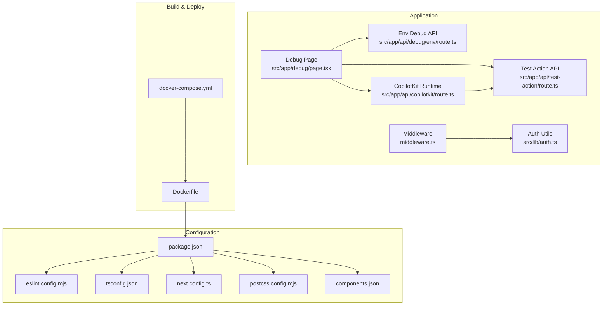
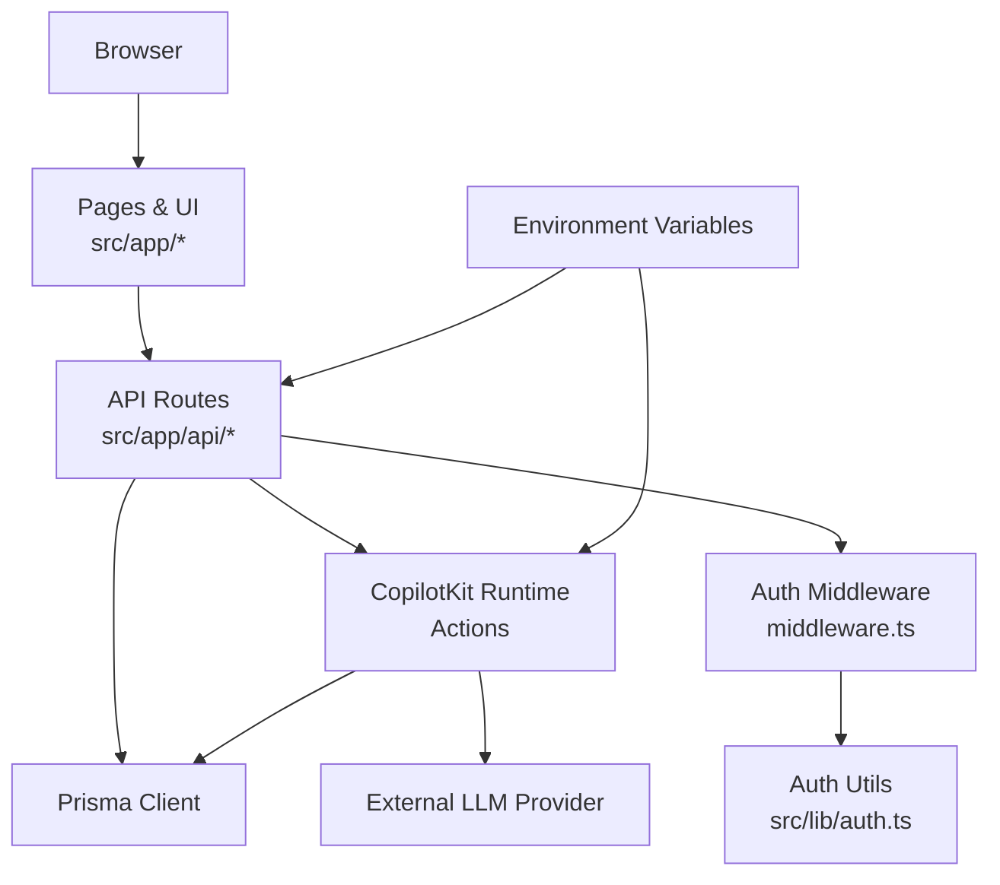
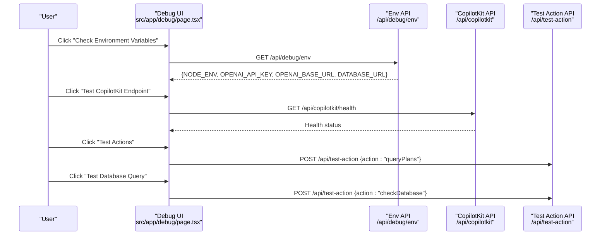
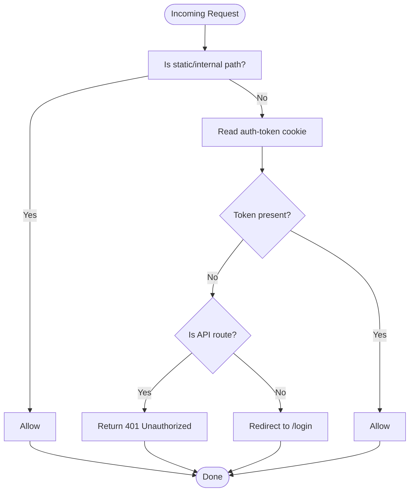
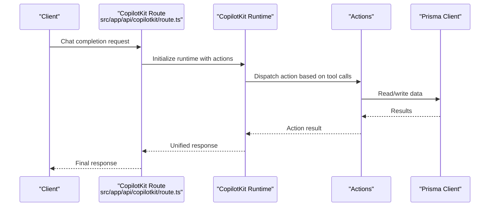
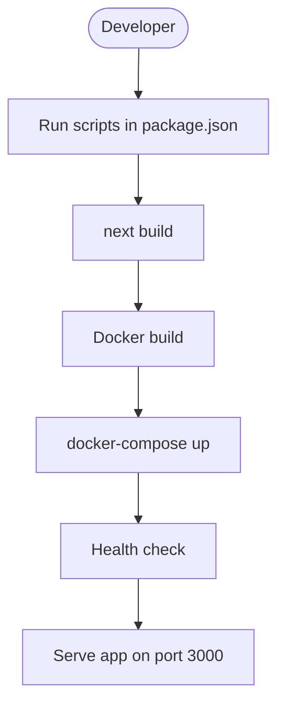
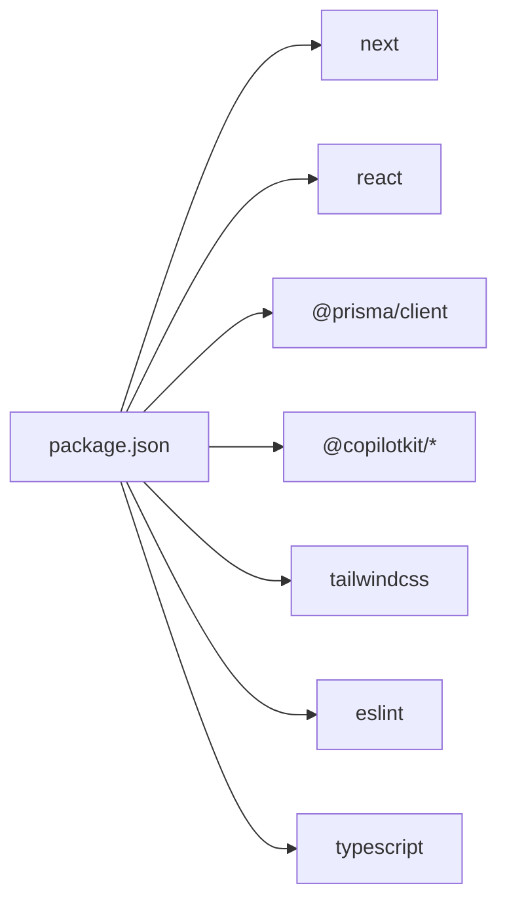

# Development Guidelines

<cite>
**Referenced Files in This Document**
- [package.json](file://package.json)
- [eslint.config.mjs](file://eslint.config.mjs)
- [tsconfig.json](file://tsconfig.json)
- [next.config.ts](file://next.config.ts)
- [postcss.config.mjs](file://postcss.config.mjs)
- [components.json](file://components.json)
- [Dockerfile](file://Dockerfile)
- [docker-compose.yml](file://docker-compose.yml)
- [setup.md](file://setup.md)
- [AUTHENTICATION.md](file://AUTHENTICATION.md)
- [src/app/debug/page.tsx](file://src/app/debug/page.tsx)
- [src/app/api/debug/env/route.ts](file://src/app/api/debug/env/route.ts)
- [src/app/api/test-action/route.ts](file://src/app/api/test-action/route.ts)
- [src/app/api/copilotkit/route.ts](file://src/app/api/copilotkit/route.ts)
- [src/lib/auth.ts](file://src/lib/auth.ts)
- [middleware.ts](file://middleware.ts)
</cite>

## Table of Contents
1. [Introduction](#introduction)
2. [Project Structure](#project-structure)
3. [Core Components](#core-components)
4. [Architecture Overview](#architecture-overview)
5. [Detailed Component Analysis](#detailed-component-analysis)
6. [Dependency Analysis](#dependency-analysis)
7. [Performance Considerations](#performance-considerations)
8. [Troubleshooting Guide](#troubleshooting-guide)
9. [Contribution and Code Review Guidelines](#contribution-and-code-review-guidelines)
10. [Conclusion](#conclusion)

## Introduction
This document provides comprehensive development guidelines for the project, focusing on coding standards, debugging techniques, development workflows, testing strategies, performance optimization, and best practices. It explains the TypeScript configuration, ESLint rules, and formatting standards, documents the debugging tools and techniques available in the debug interface, and outlines project setup, dependency management, and build processes. Guidance is also included for extending functionality, adding new features, and maintaining code quality, along with troubleshooting techniques and contribution processes.

## Project Structure
The project is a Next.js application using TypeScript, with integrated CopilotKit runtime actions, Prisma ORM, and authentication middleware. Key areas include:
- Application routes under src/app/api and pages
- UI components under src/components
- Utilities and shared logic under src/lib
- Configuration files for TypeScript, ESLint, PostCSS, Tailwind, and Next.js
- Containerization via Docker and docker-compose for deployment

**Diagram sources**
- [package.json:1-57](file://package.json#L1-L57)
- [eslint.config.mjs:1-17](file://eslint.config.mjs#L1-L17)
- [tsconfig.json:1-28](file://tsconfig.json#L1-L28)
- [next.config.ts:1-29](file://next.config.ts#L1-L29)
- [postcss.config.mjs:1-6](file://postcss.config.mjs#L1-L6)
- [components.json:1-21](file://components.json#L1-L21)
- [src/app/debug/page.tsx:1-212](file://src/app/debug/page.tsx#L1-L212)
- [src/app/api/debug/env/route.ts:1-10](file://src/app/api/debug/env/route.ts#L1-L10)
- [src/app/api/test-action/route.ts:1-153](file://src/app/api/test-action/route.ts#L1-L153)
- [src/app/api/copilotkit/route.ts:1-800](file://src/app/api/copilotkit/route.ts#L1-L800)
- [src/lib/auth.ts:1-69](file://src/lib/auth.ts#L1-L69)
- [middleware.ts:1-40](file://middleware.ts#L1-L40)
- [Dockerfile:1-68](file://Dockerfile#L1-L68)
- [docker-compose.yml:1-56](file://docker-compose.yml#L1-L56)

**Section sources**
- [package.json:1-57](file://package.json#L1-L57)
- [next.config.ts:1-29](file://next.config.ts#L1-L29)
- [tsconfig.json:1-28](file://tsconfig.json#L1-L28)
- [eslint.config.mjs:1-17](file://eslint.config.mjs#L1-L17)
- [postcss.config.mjs:1-6](file://postcss.config.mjs#L1-L6)
- [components.json:1-21](file://components.json#L1-L21)

## Core Components
- TypeScript configuration enforces strictness, preserves JSX, and enables incremental compilation with bundler module resolution.
- ESLint configuration extends Next.js core-web-vitals and TypeScript presets for web vitals and TS support.
- PostCSS/Tailwind integration configured via components.json and postcss.config.mjs.
- Next.js configuration sets standalone output and suppresses specific hydration warnings in development.
- Authentication middleware protects routes and APIs by checking for a session cookie.
- Debug interface provides environment checks, API connectivity tests, and database connectivity tests.

**Section sources**
- [tsconfig.json:1-28](file://tsconfig.json#L1-L28)
- [eslint.config.mjs:1-17](file://eslint.config.mjs#L1-L17)
- [postcss.config.mjs:1-6](file://postcss.config.mjs#L1-L6)
- [components.json:1-21](file://components.json#L1-L21)
- [next.config.ts:1-29](file://next.config.ts#L1-L29)
- [middleware.ts:1-40](file://middleware.ts#L1-L40)
- [src/app/debug/page.tsx:1-212](file://src/app/debug/page.tsx#L1-L212)

## Architecture Overview
The application follows a layered architecture:
- Frontend pages and UI components under src/app and src/components
- Backend API routes under src/app/api handling requests and delegating to runtime actions
- Authentication middleware enforcing access control
- CopilotKit runtime orchestrating AI actions and integrating with external LLM providers
- Prisma client for database operations
- Docker-based deployment with health checks and optimized npm registry for Chinese networks

**Diagram sources**
- [src/app/api/copilotkit/route.ts:1-800](file://src/app/api/copilotkit/route.ts#L1-L800)
- [src/app/api/test-action/route.ts:1-153](file://src/app/api/test-action/route.ts#L1-L153)
- [src/lib/auth.ts:1-69](file://src/lib/auth.ts#L1-L69)
- [middleware.ts:1-40](file://middleware.ts#L1-L40)
- [src/app/debug/page.tsx:1-212](file://src/app/debug/page.tsx#L1-L212)

## Detailed Component Analysis

### TypeScript Configuration and Coding Standards
- Strict type checking, no emit, ESNext modules, bundler resolution, isolated modules, and preserved JSX are enabled.
- Path aliases configured to resolve @/* to src/.
- Incremental builds improve performance during development.
- Recommended practices:
  - Keep strict mode enabled for safety.
  - Use path aliases consistently.
  - Prefer functional components and hooks for React.
  - Use explicit types for props and return values.
  - Leverage Next.js App Router conventions for file-based routing.

**Section sources**
- [tsconfig.json:1-28](file://tsconfig.json#L1-L28)

### ESLint and Formatting Standards
- ESLint extends Next.js core-web-vitals and TypeScript configurations.
- Run linting via the project script to enforce rules.
- Best practices:
  - Fix lint errors before committing.
  - Use consistent naming conventions for files and exports.
  - Group imports by type and keep them sorted.
  - Avoid disabling rules unless absolutely necessary.

**Section sources**
- [eslint.config.mjs:1-17](file://eslint.config.mjs#L1-L17)
- [package.json:5-14](file://package.json#L5-L14)

### Debugging Tools and Techniques
The debug interface provides:
- Environment variable inspection via a dedicated endpoint.
- Health checks for CopilotKit and custom test actions.
- Database connectivity tests through a test action.
- Clear instructions for setting up environment variables and resolving common issues.

**Diagram sources**
- [src/app/debug/page.tsx:1-212](file://src/app/debug/page.tsx#L1-L212)
- [src/app/api/debug/env/route.ts:1-10](file://src/app/api/debug/env/route.ts#L1-L10)
- [src/app/api/test-action/route.ts:1-153](file://src/app/api/test-action/route.ts#L1-L153)
- [src/app/api/copilotkit/route.ts:1-800](file://src/app/api/copilotkit/route.ts#L1-L800)

**Section sources**
- [src/app/debug/page.tsx:1-212](file://src/app/debug/page.tsx#L1-L212)
- [src/app/api/debug/env/route.ts:1-10](file://src/app/api/debug/env/route.ts#L1-L10)
- [src/app/api/test-action/route.ts:1-153](file://src/app/api/test-action/route.ts#L1-L153)

### Authentication and Middleware
- Middleware enforces authentication for non-static and non-login paths.
- Uses a cookie-based session token validated by the auth utilities.
- Provides redirects for unauthorized access to protected pages and returns 401 for protected APIs.

**Diagram sources**
- [middleware.ts:1-40](file://middleware.ts#L1-L40)
- [src/lib/auth.ts:1-69](file://src/lib/auth.ts#L1-L69)

**Section sources**
- [middleware.ts:1-40](file://middleware.ts#L1-L40)
- [src/lib/auth.ts:1-69](file://src/lib/auth.ts#L1-L69)
- [AUTHENTICATION.md:1-192](file://AUTHENTICATION.md#L1-L192)

### CopilotKit Runtime and Actions
- Initializes runtime with OpenAI-compatible adapter and custom OpenAI client wrapper.
- Injects system prompts and enforces tool-call sequence repair for provider compatibility.
- Defines multiple actions for recommendations, queries, goal/plan creation, plan finding, and progress updates.
- Integrates with Prisma for data persistence and supports natural language time parsing.

**Diagram sources**
- [src/app/api/copilotkit/route.ts:1-800](file://src/app/api/copilotkit/route.ts#L1-L800)

**Section sources**
- [src/app/api/copilotkit/route.ts:1-800](file://src/app/api/copilotkit/route.ts#L1-L800)

### Testing Strategies
- Use the debug UI to validate environment variables, API connectivity, and database access.
- Implement unit tests for utility functions (e.g., authentication helpers) and integration tests for API routes.
- Validate CopilotKit actions by invoking test endpoints and verifying returned data structures.
- Employ snapshot tests for UI components and end-to-end tests for critical user flows.

**Section sources**
- [src/app/debug/page.tsx:1-212](file://src/app/debug/page.tsx#L1-L212)
- [src/app/api/test-action/route.ts:1-153](file://src/app/api/test-action/route.ts#L1-L153)

### Build and Deployment Processes
- Standalone output mode for efficient Docker deployments.
- Dockerfile optimizes npm registry mirrors for Chinese networks, installs system dependencies, runs Prisma generation, builds the app, and starts the server after database initialization.
- docker-compose defines environment variables, health checks, resource limits, and network configuration.

**Diagram sources**
- [package.json:5-14](file://package.json#L5-L14)
- [next.config.ts:1-29](file://next.config.ts#L1-L29)
- [Dockerfile:1-68](file://Dockerfile#L1-L68)
- [docker-compose.yml:1-56](file://docker-compose.yml#L1-L56)

**Section sources**
- [package.json:5-14](file://package.json#L5-L14)
- [next.config.ts:1-29](file://next.config.ts#L1-L29)
- [Dockerfile:1-68](file://Dockerfile#L1-L68)
- [docker-compose.yml:1-56](file://docker-compose.yml#L1-L56)

### Extending Functionality and Adding Features
- Add new API routes under src/app/api following the existing pattern.
- Introduce CopilotKit actions in the runtime route to extend AI capabilities.
- Enhance UI components under src/components and pages under src/app.
- Maintain consistent naming, modular structure, and clear separation of concerns.

**Section sources**
- [src/app/api/copilotkit/route.ts:1-800](file://src/app/api/copilotkit/route.ts#L1-L800)
- [src/app/api/test-action/route.ts:1-153](file://src/app/api/test-action/route.ts#L1-L153)

## Dependency Analysis
- Core dependencies include Next.js, React, Prisma, CopilotKit, and UI libraries.
- Development dependencies include ESLint, TypeScript, Tailwind, and related tooling.
- Engine requirement specifies a minimum Node.js version.
- PostCSS and Tailwind are configured via components.json and postcss.config.mjs.

**Diagram sources**
- [package.json:16-51](file://package.json#L16-L51)

**Section sources**
- [package.json:16-51](file://package.json#L16-L51)

## Performance Considerations
- Enable incremental TypeScript compilation and bundler module resolution for faster builds.
- Use standalone output mode for efficient containerized deployments.
- Optimize Docker builds by leveraging buildkit caching and registry mirrors.
- Minimize unnecessary re-renders in UI components and avoid heavy synchronous operations in API routes.
- Monitor and log performance-sensitive operations, especially in AI integrations.

[No sources needed since this section provides general guidance]

## Troubleshooting Guide
Common issues and resolutions:
- Environment variables not loaded:
  - Verify .env.local configuration and ensure the server is restarted after changes.
  - Use the debug UI to inspect environment variables.
- Authentication failures:
  - Confirm AUTH_USERNAME, AUTH_PASSWORD, and AUTH_SECRET are set.
  - Check middleware logs and cookie presence.
- Database connection problems:
  - Validate DATABASE_URL and run Prisma commands to initialize schema.
  - Use the test action endpoint to verify connectivity.
- AI integration issues:
  - Ensure OPENAI_API_KEY and OPENAI_BASE_URL are configured.
  - Check CopilotKit runtime logs for tool-call sequence repairs and provider compatibility.

**Section sources**
- [src/app/debug/page.tsx:1-212](file://src/app/debug/page.tsx#L1-L212)
- [src/app/api/debug/env/route.ts:1-10](file://src/app/api/debug/env/route.ts#L1-L10)
- [src/app/api/test-action/route.ts:1-153](file://src/app/api/test-action/route.ts#L1-L153)
- [AUTHENTICATION.md:172-192](file://AUTHENTICATION.md#L172-L192)

## Contribution and Code Review Guidelines
- Setup and environment:
  - Follow the setup guide to configure environment variables, install dependencies, and initialize the database.
- Commit standards:
  - Run linting and tests locally before submitting changes.
  - Keep commits small and focused with clear messages.
- Code review process:
  - Submit pull requests with clear descriptions and links to related issues.
  - Ensure new features integrate cleanly with existing APIs and middleware.
  - Verify authentication and authorization logic remains intact.
- Continuous integration:
  - Maintain Docker-based deployment readiness and health checks.

**Section sources**
- [setup.md:1-157](file://setup.md#L1-L157)
- [package.json:5-14](file://package.json#L5-L14)
- [docker-compose.yml:1-56](file://docker-compose.yml#L1-L56)

## Conclusion
This document consolidates development practices, configuration, debugging, testing, and deployment workflows for the project. By adhering to the established TypeScript and ESLint standards, leveraging the debug interface, and following the authentication and middleware patterns, contributors can efficiently extend functionality while maintaining code quality and reliability. The provided Docker and docker-compose configurations streamline local and production deployments, ensuring consistent environments across teams.