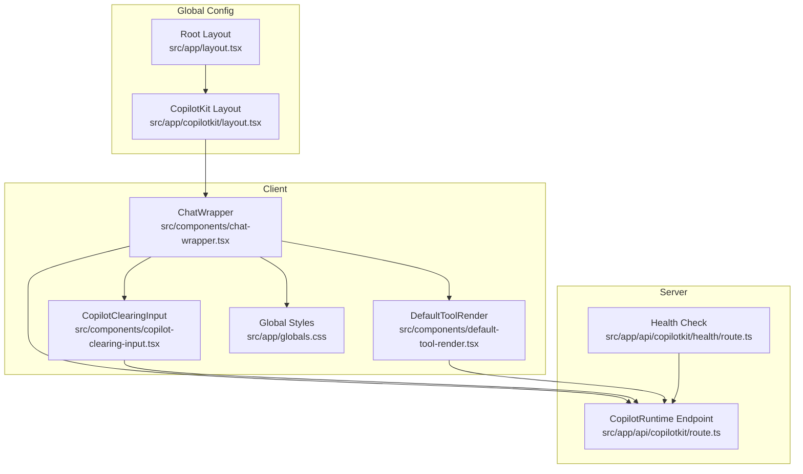
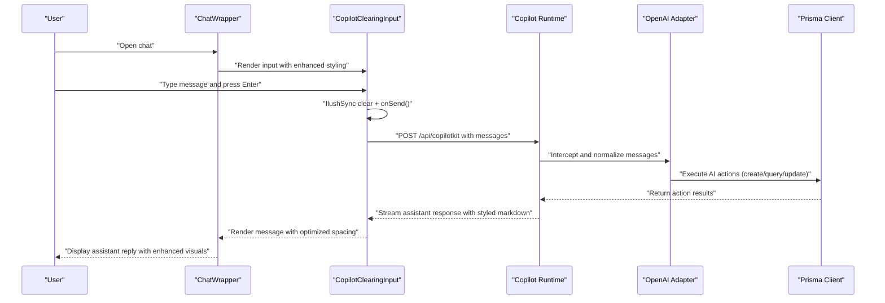
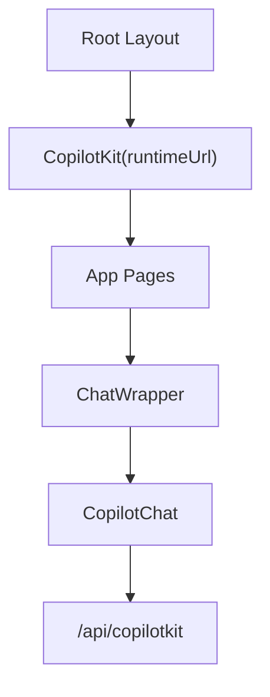
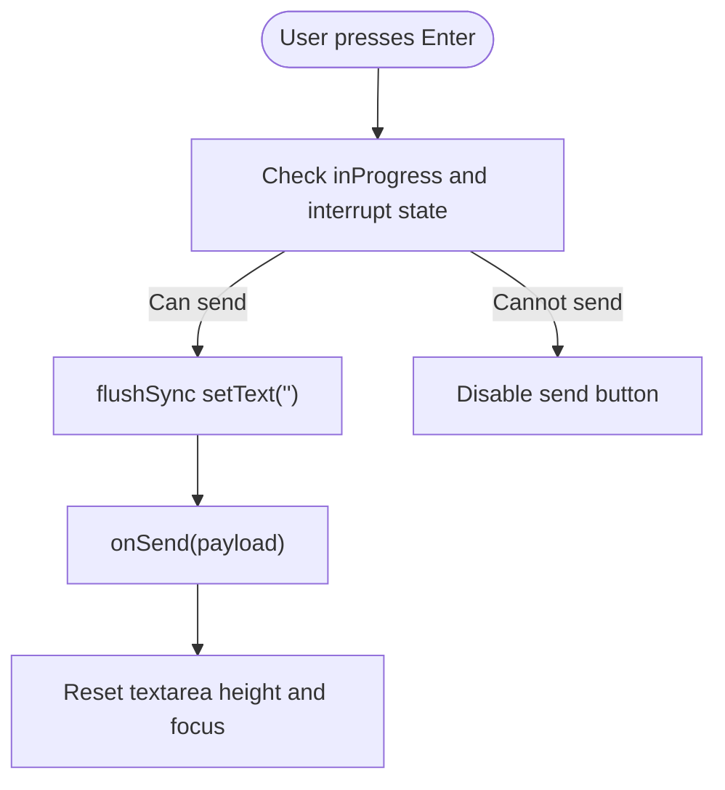
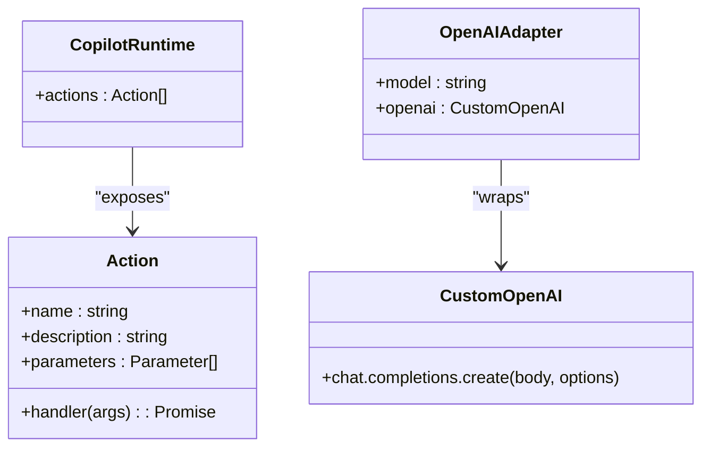
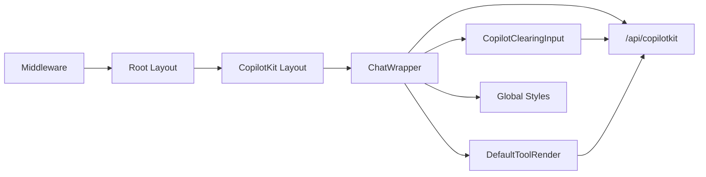

# AI Chat Interface

<cite>
**Referenced Files in This Document**
- [layout.tsx](file://src/app/layout.tsx)
- [copilotkit/layout.tsx](file://src/app/copilotkit/layout.tsx)
- [copilotkit/page.tsx](file://src/app/copilotkit/page.tsx)
- [chat-wrapper.tsx](file://src/components/chat-wrapper.tsx)
- [copilot-clearing-input.tsx](file://src/components/copilot-clearing-input.tsx)
- [default-tool-render.tsx](file://src/components/default-tool-render.tsx)
- [globals.css](file://src/app/globals.css)
- [route.ts](file://src/app/api/copilotkit/route.ts)
- [health/route.ts](file://src/app/api/copilotkit/health/route.ts)
- [page.tsx](file://src/app/test-chat/page.tsx)
- [middleware.ts](file://middleware.ts)
</cite>

## Update Summary
**Changes Made**
- Enhanced markdown rendering styling with comprehensive improvements to paragraph margins, line heights, and horizontal rule spacing
- Added chat separator styling with centered divider and optimized spacing
- Improved message container styling with better line height control and margin optimization
- Enhanced responsive design for mobile devices with optimized message widths

## Table of Contents
1. [Introduction](#introduction)
2. [Project Structure](#project-structure)
3. [Core Components](#core-components)
4. [Architecture Overview](#architecture-overview)
5. [Detailed Component Analysis](#detailed-component-analysis)
6. [Enhanced Styling Improvements](#enhanced-styling-improvements)
7. [Dependency Analysis](#dependency-analysis)
8. [Performance Considerations](#performance-considerations)
9. [Troubleshooting Guide](#troubleshooting-guide)
10. [Conclusion](#conclusion)

## Introduction
This document explains the AI chat interface feature built with CopilotKit. It covers the runtime configuration, custom action handlers, message processing workflows, the chat wrapper component, conversation state management, real-time interaction patterns, and the clearing input component. It also documents AI action integrations for goal planning, task recommendation, and progress analysis, along with comprehensive styling improvements for enhanced user experience and markdown rendering optimization.

## Project Structure
The chat interface spans client-side UI components and server-side CopilotKit runtime integration:
- Client-side: Chat wrapper, custom input, and tool rendering components with enhanced styling
- Server-side: CopilotKit runtime endpoint with AI actions and OpenAI adapter
- Global configuration: Root layout wraps the app with CopilotKit provider and comprehensive CSS styling

**Diagram sources**
- [layout.tsx:24-26](file://src/app/layout.tsx#L24-L26)
- [copilotkit/layout.tsx:10-18](file://src/app/copilotkit/layout.tsx#L10-L18)
- [chat-wrapper.tsx:7-709](file://src/components/chat-wrapper.tsx#L7-L709)
- [copilot-clearing-input.tsx:84-175](file://src/components/copilot-clearing-input.tsx#L84-L175)
- [default-tool-render.tsx:12-104](file://src/components/default-tool-render.tsx#L12-L104)
- [globals.css:129-311](file://src/app/globals.css#L129-L311)
- [route.ts:287-1452](file://src/app/api/copilotkit/route.ts#L287-L1452)
- [health/route.ts:1-32](file://src/app/api/copilotkit/health/route.ts#L1-L32)

**Section sources**
- [layout.tsx:1-31](file://src/app/layout.tsx#L1-L31)
- [copilotkit/layout.tsx:1-19](file://src/app/copilotkit/layout.tsx#L1-L19)
- [chat-wrapper.tsx:1-709](file://src/components/chat-wrapper.tsx#L1-L709)
- [copilot-clearing-input.tsx:1-175](file://src/components/copilot-clearing-input.tsx#L1-L175)
- [default-tool-render.tsx:1-104](file://src/components/default-tool-render.tsx#L1-L104)
- [globals.css:1-380](file://src/app/globals.css#L1-L380)
- [route.ts:1-1636](file://src/app/api/copilotkit/route.ts#L1-L1636)
- [health/route.ts:1-32](file://src/app/api/copilotkit/health/route.ts#L1-L32)

## Core Components
- CopilotKit runtime configuration: Provides the runtime URL and optional public API key for cloud deployments.
- Chat wrapper: Renders the CopilotChat UI with enhanced styling, applies comprehensive CSS for markdown rendering, and injects the custom clearing input.
- Clearing input: Ensures reliable message clearing after send via flushSync and handles multi-line auto-resize.
- Default tool render: Visualizes MCP/tool call status and parameters/results for transparency.
- Enhanced global styles: Comprehensive markdown rendering improvements including optimized paragraph margins, increased line heights, and improved horizontal rule spacing.
- Server-side runtime: Exposes AI actions (recommend tasks, query/find plans, create goals/plans, update/add progress, analyze and record progress) and integrates with OpenAI-compatible service.

**Section sources**
- [copilotkit/layout.tsx:10-18](file://src/app/copilotkit/layout.tsx#L10-L18)
- [chat-wrapper.tsx:698-706](file://src/components/chat-wrapper.tsx#L698-L706)
- [copilot-clearing-input.tsx:84-175](file://src/components/copilot-clearing-input.tsx#L84-L175)
- [default-tool-render.tsx:12-104](file://src/components/default-tool-render.tsx#L12-L104)
- [globals.css:187-294](file://src/app/globals.css#L187-L294)
- [route.ts:287-1452](file://src/app/api/copilotkit/route.ts#L287-L1452)

## Architecture Overview
The chat interface uses CopilotKit's React UI components and runtime to orchestrate conversations with an LLM and execute AI actions against the backend, enhanced with comprehensive styling improvements.

**Diagram sources**
- [chat-wrapper.tsx:698-706](file://src/components/chat-wrapper.tsx#L698-L706)
- [copilot-clearing-input.tsx:105-119](file://src/components/copilot-clearing-input.tsx#L105-L119)
- [route.ts:1456-1635](file://src/app/api/copilotkit/route.ts#L1456-L1635)

**Section sources**
- [chat-wrapper.tsx:698-706](file://src/components/chat-wrapper.tsx#L698-L706)
- [copilot-clearing-input.tsx:105-119](file://src/components/copilot-clearing-input.tsx#L105-L119)
- [route.ts:1456-1635](file://src/app/api/copilotkit/route.ts#L1456-L1635)

## Detailed Component Analysis

### CopilotKit Runtime Configuration
- Root layout initializes CopilotKit with runtimeUrl pointing to the server endpoint.
- CopilotKit layout sets runtimeUrl/publicApiKey for client-side routing to the backend or Copilot Cloud.

**Diagram sources**
- [layout.tsx:24-26](file://src/app/layout.tsx#L24-L26)
- [copilotkit/layout.tsx:10-18](file://src/app/copilotkit/layout.tsx#L10-L18)

**Section sources**
- [layout.tsx:24-26](file://src/app/layout.tsx#L24-L26)
- [copilotkit/layout.tsx:10-18](file://src/app/copilotkit/layout.tsx#L10-L18)

### Chat Wrapper Component
Responsibilities:
- Hydration-safe rendering and mutation observer to fix markdown rendering issues.
- Enhanced global CSS injection for chat container, messages, input, and animations with comprehensive styling improvements.
- Injects CopilotClearingInput as the input component.
- Provides initial assistant labels and placeholder text.

Real-time interaction patterns:
- Uses CopilotChat with Input override to ensure immediate feedback and smooth UX.
- Applies CSS variables for primary/contrast colors to maintain brand consistency.
- Implements optimized markdown rendering with reduced paragraph margins (0.25rem) and increased line heights (1.6) for better readability.

**Section sources**
- [chat-wrapper.tsx:1-709](file://src/components/chat-wrapper.tsx#L1-L709)

### Clearing Input Component
Key behaviors:
- Auto-resizing textarea with max rows limit.
- Reliable clear-after-send using flushSync to prevent UI flicker.
- Enter-to-send handling with canSend gating (respects in-progress and LangGraph interrupts).
- Powered-by line shown conditionally based on public API key presence.

**Diagram sources**
- [copilot-clearing-input.tsx:105-119](file://src/components/copilot-clearing-input.tsx#L105-L119)

**Section sources**
- [copilot-clearing-input.tsx:84-175](file://src/components/copilot-clearing-input.tsx#L84-L175)

### Default Tool Render Component
Purpose:
- Visualizes MCP/tool call lifecycle with expandable sections for name, parameters, and results.
- Shows status indicators (complete/inProgress/executing) with subtle animations.

**Section sources**
- [default-tool-render.tsx:12-104](file://src/components/default-tool-render.tsx#L12-L104)

### Enhanced Global Styles System
Comprehensive markdown rendering improvements:
- **Paragraph margins reduction**: Optimized from 0.75rem to 0.25rem with automatic removal of first/last child margins for cleaner spacing.
- **Line height increases**: Standardized to 1.6 for improved readability across all markdown elements.
- **Horizontal rule spacing optimization**: Reduced from 2rem to 0.45rem with consistent 1px border styling.
- **Chat separator styling**: Centered dividers with 60% width and optimized spacing for visual separation.
- **Message container enhancements**: Improved padding, gradient backgrounds, and responsive design for mobile devices.

**Section sources**
- [globals.css:187-294](file://src/app/globals.css#L187-L294)
- [chat-wrapper.tsx:497-511](file://src/components/chat-wrapper.tsx#L497-L511)
- [chat-wrapper.tsx:558-563](file://src/components/chat-wrapper.tsx#L558-L563)
- [chat-wrapper.tsx:706-713](file://src/components/chat-wrapper.tsx#L706-L713)

### Server-Side CopilotKit Runtime and Actions
Runtime configuration:
- Initializes CopilotRuntime with a set of AI actions exposed to the assistant.
- Uses OpenAIAdapter with a custom OpenAI client that:
  - Normalizes developer role messages to user
  - Injects a system prompt tailored for goal planning and progress tracking
  - Enables search for Qwen models
  - Repairs tool call sequences to satisfy API compliance

AI actions overview:
- recommendTasks: Recommend tasks based on current plan states and optional filters
- queryPlans/findPlan: Search plans by difficulty, tag, keyword, or fuzzy matching
- createGoal/createPlan: Create goals/plans with validation and tagging
- updateProgress/addProgressRecord: Record progress with optional thinking content and natural language time parsing
- analyzeAndRecordProgress: Intelligent parsing of user reports to extract activity, thinking, and time, then record to matched plan

**Diagram sources**
- [route.ts:287-1452](file://src/app/api/copilotkit/route.ts#L287-L1452)
- [route.ts:88-271](file://src/app/api/copilotkit/route.ts#L88-L271)

**Section sources**
- [route.ts:88-271](file://src/app/api/copilotkit/route.ts#L88-L271)
- [route.ts:287-1452](file://src/app/api/copilotkit/route.ts#L287-L1452)

### MCP Server Management Page
Demonstrates how to configure MCP servers dynamically and render tool calls with a catch-all action renderer.

**Section sources**
- [copilotkit/page.tsx:1-109](file://src/app/copilotkit/page.tsx#L1-L109)

### Test Chat Page
Minimal example of embedding CopilotChat for testing purposes with enhanced styling.

**Section sources**
- [page.tsx:1-25](file://src/app/test-chat/page.tsx#L1-L25)

## Enhanced Styling Improvements

### Comprehensive Markdown Rendering Enhancements
The chat interface now features significantly improved markdown rendering with optimized spacing and typography:

**Paragraph Spacing Optimization**
- Reduced paragraph margins from 0.75rem to 0.25rem for tighter content density
- Automatic removal of first paragraph top margin and last paragraph bottom margin
- Consistent line height of 1.6 for improved readability across all content types

**Horizontal Rule Enhancement**
- Optimized spacing from 2rem to 0.45rem for better visual hierarchy
- Consistent 1px solid border with standardized color (#e5e7eb)
- Properly spaced separators that don't disrupt content flow

**Chat Separator Styling**
- Centered dividers with 60% width for balanced visual presentation
- Optimized margin spacing (0.5rem auto) for consistent positioning
- Subtle border color matching the overall theme (#e5e7eb)

**Message Container Improvements**
- Enhanced padding (1.5rem 1.25rem) for comfortable reading
- Gradient background (135deg, #f8fafc to #e2e8f0) for modern appearance
- Responsive design with optimized mobile widths (min(300px, 90vw) for user messages, min(320px, 92vw) for assistant messages)

**Typography and Color Consistency**
- Standardized line heights (1.6) across all markdown elements
- Consistent color schemes with theme-aware styling
- Optimized font sizes and weights for different content types

**Section sources**
- [globals.css:187-294](file://src/app/globals.css#L187-L294)
- [chat-wrapper.tsx:497-511](file://src/components/chat-wrapper.tsx#L497-L511)
- [chat-wrapper.tsx:558-563](file://src/components/chat-wrapper.tsx#L558-L563)
- [chat-wrapper.tsx:706-713](file://src/components/chat-wrapper.tsx#L706-L713)
- [chat-wrapper.tsx:715-730](file://src/components/chat-wrapper.tsx#L715-L730)

## Dependency Analysis
- Client depends on CopilotKit React UI/Core packages for chat and runtime hooks.
- ChatWrapper depends on CopilotClearingInput, DefaultToolRender, and enhanced global styles for UI composition.
- Server runtime depends on Prisma for database operations and exposes AI actions.
- Middleware enforces authentication for non-static routes.

**Diagram sources**
- [chat-wrapper.tsx:3-5](file://src/components/chat-wrapper.tsx#L3-L5)
- [copilot-clearing-input.tsx:9-12](file://src/components/copilot-clearing-input.tsx#L9-L12)
- [route.ts:1-11](file://src/app/api/copilotkit/route.ts#L1-L11)
- [layout.tsx:3-4](file://src/app/layout.tsx#L3-L4)
- [copilotkit/layout.tsx](file://src/app/copilotkit/layout.tsx#L3)
- [globals.css:129-132](file://src/app/globals.css#L129-L132)
- [middleware.ts:1-40](file://middleware.ts#L1-L40)

**Section sources**
- [chat-wrapper.tsx:1-709](file://src/components/chat-wrapper.tsx#L1-L709)
- [copilot-clearing-input.tsx:1-175](file://src/components/copilot-clearing-input.tsx#L1-L175)
- [route.ts:1-11](file://src/app/api/copilotkit/route.ts#L1-L11)
- [layout.tsx:1-31](file://src/app/layout.tsx#L1-L31)
- [copilotkit/layout.tsx:1-19](file://src/app/copilotkit/layout.tsx#L1-L19)
- [globals.css:129-132](file://src/app/globals.css#L129-L132)
- [middleware.ts:1-40](file://middleware.ts#L1-L40)

## Performance Considerations
- Hydration fixes: MutationObserver and periodic re-fix ensure markdown renders correctly without hydration mismatches.
- Minimal reflows: flushSync clears input immediately to avoid layout thrashing.
- Enhanced scrolling: Optimized scrollbar styling with thin width (0.25rem) and hover effects for better perceived performance.
- Typography optimization: Standardized line heights (1.6) reduce layout recalculations during content rendering.
- CSS optimization: Scoped styling prevents cascade conflicts and reduces specificity wars.
- Animations: CSS-driven message slide-in and typing indicators reduce heavy JS animation overhead.
- Network: Fetch interceptor ensures normalized messages and minimal retries by avoiding unnecessary re-sends.

## Troubleshooting Guide

### Chat Connectivity Issues
- Verify runtime URL and environment variables:
  - Ensure NEXT_PUBLIC_COPILOTKIT_RUNTIME_URL/public API key are configured in CopilotKit layout.
  - Confirm OPENAI_API_KEY and OPENAI_BASE_URL are set for the server-side adapter.
- Health check:
  - Use the health endpoint to confirm configuration and available actions.

Common symptoms and checks:
- 401 Unauthorized on API routes: Review middleware cookie-based auth and redirects.
- 500 errors from runtime: Inspect server logs around message filtering and fetch interception.

**Section sources**
- [copilotkit/layout.tsx:6-8](file://src/app/copilotkit/layout.tsx#L6-L8)
- [health/route.ts:1-32](file://src/app/api/copilotkit/health/route.ts#L1-L32)
- [middleware.ts:22-30](file://middleware.ts#L22-L30)

### Conversation State Synchronization Problems
- Hydration mismatches:
  - ChatWrapper applies a MutationObserver and periodic fixes to markdown containers to prevent paragraph/block rendering issues.
- Input state:
  - CopilotClearingInput uses flushSync to clear text immediately upon send, preventing stale UI states.

Recommendations:
- Keep CopilotChat mounted and avoid toggling the wrapper unnecessarily.
- Avoid injecting custom DOM inside message containers that could interfere with observers.

**Section sources**
- [chat-wrapper.tsx:17-59](file://src/components/chat-wrapper.tsx#L17-L59)
- [copilot-clearing-input.tsx:108-111](file://src/components/copilot-clearing-input.tsx#L108-L111)

### Real-Time Messaging Performance
- Reduced layout shifts:
  - Enhanced CSS grid system with optimized margins and paddings.
  - Auto-resize textarea only when needed with max-height constraints.
- Optimized tool rendering:
  - Collapsed tool call details by default; expand only when needed.
- Minimized network noise:
  - Ensure messages are filtered and normalized before sending to the model.

**Section sources**
- [chat-wrapper.tsx:569-696](file://src/components/chat-wrapper.tsx#L569-L696)
- [copilot-clearing-input.tsx:136-173](file://src/components/copilot-clearing-input.tsx#L136-L173)

### Enhanced Styling Issues
- Markdown rendering problems:
  - Verify global CSS import order and specificity conflicts.
  - Check for conflicting Tailwind classes that might override custom styles.
- Mobile responsiveness:
  - Test responsive breakpoints (768px) for optimal message width scaling.
  - Verify scrollbar styling compatibility across different browsers.

**Section sources**
- [globals.css:129-132](file://src/app/globals.css#L129-L132)
- [chat-wrapper.tsx:715-730](file://src/components/chat-wrapper.tsx#L715-L730)

### AI Action Integration Examples
- Task recommendation:
  - Call recommendTasks with userState and optional filter criteria to receive ranked tasks.
- Plan management:
  - Use queryPlans/findPlan to locate relevant plans; createPlan to define new ones with validated difficulty and tags.
- Progress tracking:
  - addProgressRecord for straightforward entries; updateProgress for numeric progress updates; analyzeAndRecordProgress for intelligent parsing of user reports.

**Section sources**
- [route.ts:287-1452](file://src/app/api/copilotkit/route.ts#L287-L1452)

### Multi-Turn Dialogue Handling
- System prompt normalization:
  - Custom OpenAI client injects a system prompt and repairs tool call sequences to keep multi-turn tool interactions coherent.
- Role normalization:
  - Developer role messages are converted to user to avoid API errors.

**Section sources**
- [route.ts:88-271](file://src/app/api/copilotkit/route.ts#L88-L271)
- [route.ts:1545-1605](file://src/app/api/copilotkit/route.ts#L1545-L1605)

## Conclusion
The AI chat interface leverages CopilotKit for a robust, extensible chat experience with significantly enhanced styling and markdown rendering capabilities. The runtime configuration, custom input, and tool render components work together with comprehensive CSS improvements to deliver a responsive, real-time conversation with optimized visual presentation. The server-side actions integrate tightly with the database to support goal planning, task recommendation, and progress analysis. With proper environment configuration, hydration safeguards, enhanced styling optimizations, and performance-conscious UI patterns, the system delivers a smooth user experience for natural conversation flows with improved readability and visual appeal.