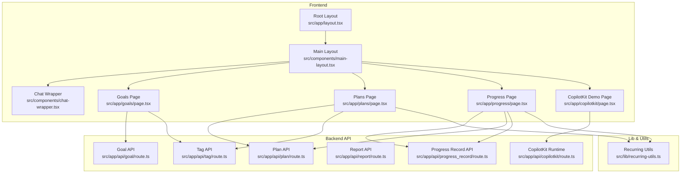
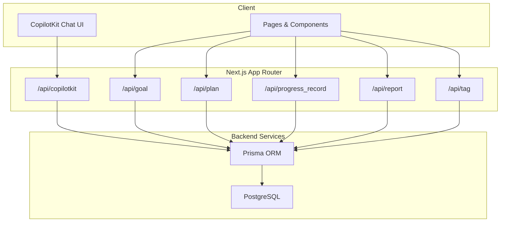
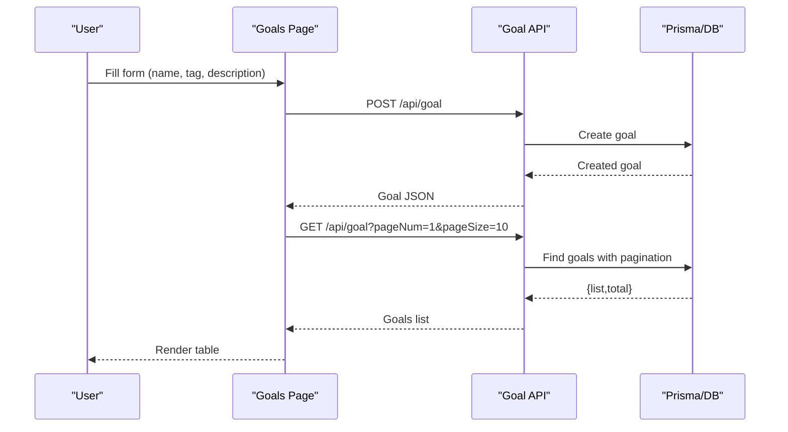
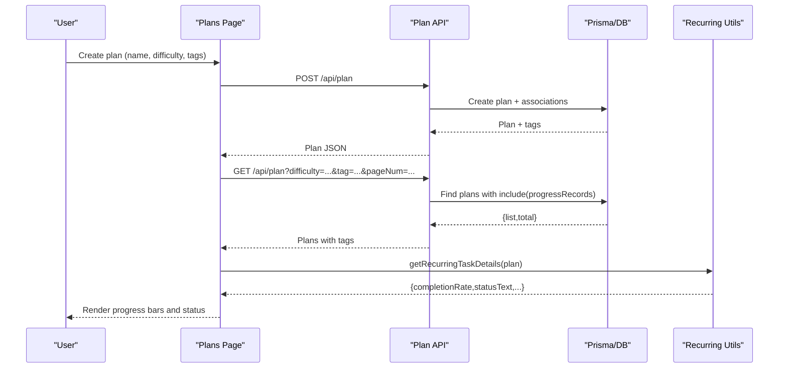
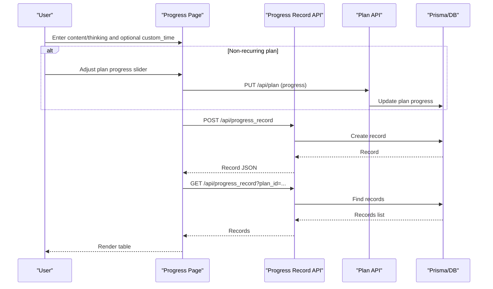
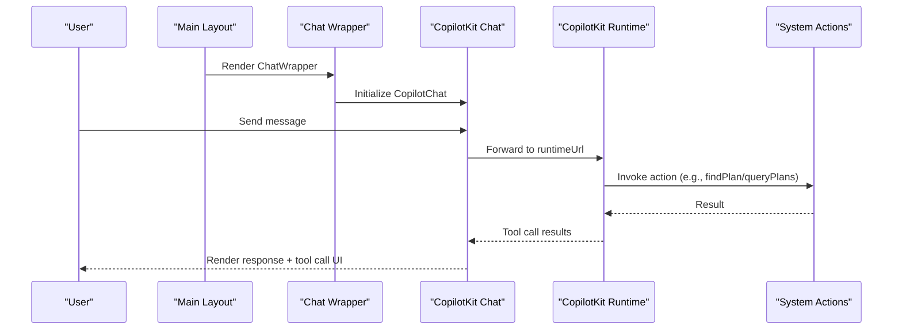
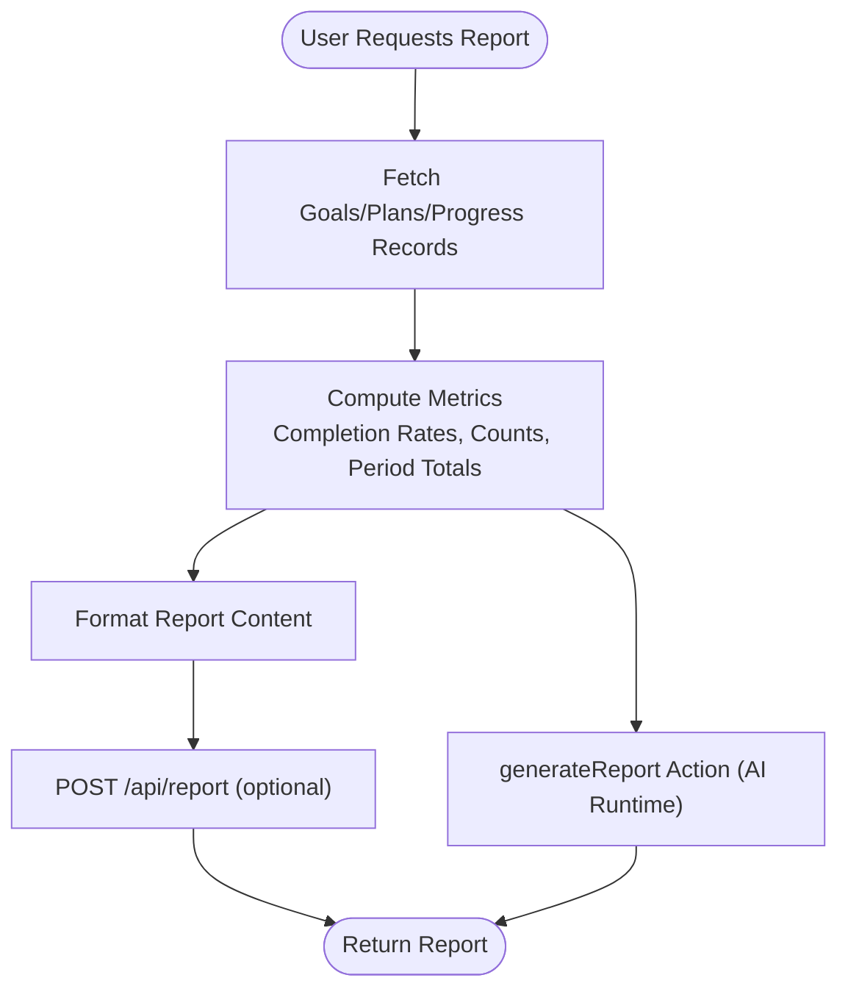
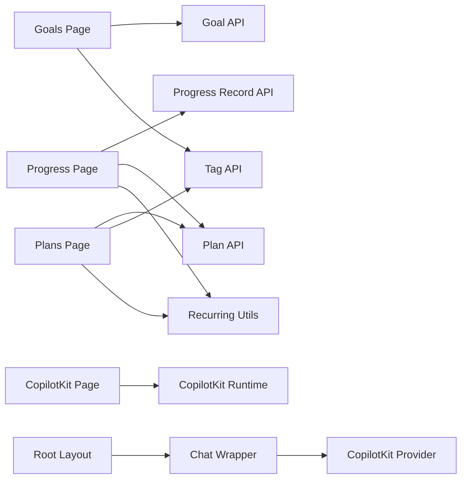

# Feature Modules

<cite>
**Referenced Files in This Document**
- [README.md](file://README.md)
- [layout.tsx](file://src/app/layout.tsx)
- [chat-wrapper.tsx](file://src/components/chat-wrapper.tsx)
- [copilot-clearing-input.tsx](file://src/components/copilot-clearing-input.tsx)
- [default-tool-render.tsx](file://src/components/default-tool-render.tsx)
- [main-layout.tsx](file://src/components/main-layout.tsx)
- [route.ts](file://src/app/api/goal/route.ts)
- [route.ts](file://src/app/api/plan/route.ts)
- [route.ts](file://src/app/api/progress_record/route.ts)
- [route.ts](file://src/app/api/report/route.ts)
- [route.ts](file://src/app/api/tag/route.ts)
- [route.ts](file://src/app/api/copilotkit/route.ts)
- [page.tsx](file://src/app/goals/page.tsx)
- [page.tsx](file://src/app/plans/page.tsx)
- [page.tsx](file://src/app/progress/page.tsx)
- [page.tsx](file://src/app/copilotkit/page.tsx)
- [layout.tsx](file://src/app/copilotkit/layout.tsx)
- [recurring-utils.ts](file://src/lib/recurring-utils.ts)
</cite>

## Table of Contents
1. [Introduction](#introduction)
2. [Project Structure](#project-structure)
3. [Core Components](#core-components)
4. [Architecture Overview](#architecture-overview)
5. [Detailed Component Analysis](#detailed-component-analysis)
6. [Dependency Analysis](#dependency-analysis)
7. [Performance Considerations](#performance-considerations)
8. [Troubleshooting Guide](#troubleshooting-guide)
9. [Conclusion](#conclusion)
10. [Appendices](#appendices)

## Introduction
This document explains the feature modules that power the core application: goal management, plan management, progress tracking, AI chat interface, and reporting/analytics. It covers workflows, APIs, UI components, configuration options, and integration patterns. Practical examples illustrate typical user journeys, and troubleshooting guidance helps resolve common issues.

## Project Structure
The application follows a Next.js app directory structure with:
- Frontend pages under src/app for goals, plans, progress, and AI chat
- Backend API routes under src/app/api for CRUD operations and AI orchestration
- Shared UI components and utilities under src/components and src/lib
- CopilotKit integration for AI chat and tool calling

**Diagram sources**
- [layout.tsx:16-30](file://src/app/layout.tsx#L16-L30)
- [main-layout.tsx:11-62](file://src/components/main-layout.tsx#L11-L62)
- [chat-wrapper.tsx:81-708](file://src/components/chat-wrapper.tsx#L81-L708)
- [page.tsx:25-313](file://src/app/goals/page.tsx#L25-L313)
- [page.tsx:52-806](file://src/app/plans/page.tsx#L52-L806)
- [page.tsx:35-569](file://src/app/progress/page.tsx#L35-L569)
- [page.tsx:12-26](file://src/app/copilotkit/page.tsx#L12-L26)
- [route.ts:8-24](file://src/app/api/goal/route.ts#L8-L24)
- [route.ts:8-56](file://src/app/api/plan/route.ts#L8-L56)
- [route.ts:7-23](file://src/app/api/progress_record/route.ts#L7-L23)
- [route.ts:8-21](file://src/app/api/report/route.ts#L8-L21)
- [route.ts:7-11](file://src/app/api/tag/route.ts#L7-L11)
- [route.ts:287-366](file://src/app/api/copilotkit/route.ts#L287-L366)
- [recurring-utils.ts:73-86](file://src/lib/recurring-utils.ts#L73-L86)

**Section sources**
- [README.md:157-174](file://README.md#L157-L174)
- [layout.tsx:16-30](file://src/app/layout.tsx#L16-L30)

## Core Components
- Goal Management: Create, edit, delete, and filter goals by tag; supports pagination and search.
- Plan Management: Create, edit, delete plans; track difficulty, progress, tags, and recurrence.
- Progress Tracking: Log daily progress entries with content/thinking; supports custom timestamps and plan progress updates.
- AI Chat Interface: Integrated CopilotKit chat with custom styles, suggestions, and tool-call rendering.
- Reporting/Analytics: Report storage endpoints; analytics derived from plan and progress data.

**Section sources**
- [route.ts:8-51](file://src/app/api/goal/route.ts#L8-L51)
- [route.ts:8-103](file://src/app/api/plan/route.ts#L8-L103)
- [route.ts:7-154](file://src/app/api/progress_record/route.ts#L7-L154)
- [route.ts:8-48](file://src/app/api/report/route.ts#L8-L48)
- [page.tsx:38-91](file://src/app/goals/page.tsx#L38-L91)
- [page.tsx:141-307](file://src/app/plans/page.tsx#L141-L307)
- [page.tsx:46-174](file://src/app/progress/page.tsx#L46-L174)
- [chat-wrapper.tsx:81-708](file://src/components/chat-wrapper.tsx#L81-L708)

## Architecture Overview
The system integrates a frontend built with Next.js and UI components with backend API routes and a CopilotKit runtime for AI orchestration. The AI runtime exposes system actions (query plans, create goals, update progress, etc.) and interacts with the database via Prisma.

**Diagram sources**
- [layout.tsx:24-26](file://src/app/layout.tsx#L24-L26)
- [route.ts:1-51](file://src/app/api/goal/route.ts#L1-L51)
- [route.ts:1-103](file://src/app/api/plan/route.ts#L1-L103)
- [route.ts:1-154](file://src/app/api/progress_record/route.ts#L1-L154)
- [route.ts:1-48](file://src/app/api/report/route.ts#L1-L48)
- [route.ts:1-11](file://src/app/api/tag/route.ts#L1-L11)
- [route.ts:1-800](file://src/app/api/copilotkit/route.ts#L1-L800)

## Detailed Component Analysis

### Goal Management System
- Creation: POST to /api/goal with name, tag, description; returns created goal.
- Editing: PUT to /api/goal with goal_id and updated fields.
- Deletion: DELETE to /api/goal with goal_id.
- Listing: GET to /api/goal with optional tag, pagination (pageNum, pageSize).
- Filtering: Tag-based filtering supported; search can be added via query param.
- UI: Goals page provides form, filters (tag, name), table, pagination.

**Diagram sources**
- [page.tsx:59-80](file://src/app/goals/page.tsx#L59-L80)
- [page.tsx:38-51](file://src/app/goals/page.tsx#L38-L51)
- [route.ts:27-31](file://src/app/api/goal/route.ts#L27-L31)
- [route.ts:8-24](file://src/app/api/goal/route.ts#L8-L24)

**Section sources**
- [route.ts:8-51](file://src/app/api/goal/route.ts#L8-L51)
- [page.tsx:38-91](file://src/app/goals/page.tsx#L38-L91)

### Plan Management System
- Creation: POST to /api/plan with name, description, difficulty, tags; returns plan with tags array.
- Editing: PUT to /api/plan with plan_id; updates tags by replacing associations.
- Deletion: DELETE to /api/plan with plan_id.
- Listing: GET to /api/plan with optional difficulty, tag, goal_id, pagination; includes tags and recent progressRecords.
- Tags: Tag retrieval via /api/tag; plans can be filtered by goal tag when goal_id is provided.
- Difficulty: Standardized difficulty values enforced in AI actions.
- Recurrence: Recurring plans tracked via is_recurring, recurrence_type, recurrence_value; computed progress via utils.

**Diagram sources**
- [page.tsx:264-288](file://src/app/plans/page.tsx#L264-L288)
- [page.tsx:141-163](file://src/app/plans/page.tsx#L141-L163)
- [page.tsx:115-139](file://src/app/plans/page.tsx#L115-L139)
- [route.ts:58-72](file://src/app/api/plan/route.ts#L58-L72)
- [route.ts:8-56](file://src/app/api/plan/route.ts#L8-L56)
- [recurring-utils.ts:152-186](file://src/lib/recurring-utils.ts#L152-L186)

**Section sources**
- [route.ts:8-103](file://src/app/api/plan/route.ts#L8-L103)
- [page.tsx:115-139](file://src/app/plans/page.tsx#L115-L139)
- [page.tsx:141-163](file://src/app/plans/page.tsx#L141-L163)
- [route.ts:7-11](file://src/app/api/tag/route.ts#L7-L11)
- [recurring-utils.ts:73-86](file://src/lib/recurring-utils.ts#L73-L86)

### Progress Tracking System
- Creation: POST to /api/progress_record with plan_id, content, thinking, optional custom_time.
- Editing: PUT to /api/progress_record with id; supports updating plan_id and custom_time.
- Deletion: DELETE to /api/progress_record with id.
- Listing: GET to /api/progress_record with optional plan_id, pagination; supports search.
- UI: Progress page supports two modes:
  - All-time view: filter by plan or search across all records.
  - Single-plan view: log/update entries for a specific plan; adjust plan progress for non-recurring tasks.
- Custom time: Supports ISO-like datetime-local input for retroactively recorded entries.

**Diagram sources**
- [page.tsx:113-174](file://src/app/progress/page.tsx#L113-L174)
- [page.tsx:81-95](file://src/app/progress/page.tsx#L81-L95)
- [route.ts:25-70](file://src/app/api/progress_record/route.ts#L25-L70)
- [route.ts:72-127](file://src/app/api/progress_record/route.ts#L72-L127)
- [route.ts:74-94](file://src/app/api/plan/route.ts#L74-L94)

**Section sources**
- [route.ts:7-154](file://src/app/api/progress_record/route.ts#L7-L154)
- [page.tsx:81-174](file://src/app/progress/page.tsx#L81-L174)

### AI Chat Interface Implementation
- Integration: Root layout wraps the app with CopilotKit provider pointing to runtime URL.
- Chat UI: Main layout embeds ChatWrapper which renders CopilotKit chat with custom styles and fixes hydration issues.
- Input: CopilotClearingInput provides auto-resizing textarea, send/stop controls, and reliable clearing after send.
- Tool rendering: DefaultToolRender displays MCP/tool call status with collapsible details.
- Actions: The CopilotKit runtime defines system actions (recommendTasks, queryPlans, createGoal, createPlan, findPlan, updateProgress, getSystemOptions, webSearch, generateReport) and injects a system prompt for intelligent handling of user intents.

**Diagram sources**
- [layout.tsx:24-26](file://src/app/layout.tsx#L24-L26)
- [main-layout.tsx:56-59](file://src/components/main-layout.tsx#L56-L59)
- [chat-wrapper.tsx:81-708](file://src/components/chat-wrapper.tsx#L81-L708)
- [copilot-clearing-input.tsx:84-174](file://src/components/copilot-clearing-input.tsx#L84-L174)
- [default-tool-render.tsx:12-95](file://src/components/default-tool-render.tsx#L12-L95)
- [route.ts:287-366](file://src/app/api/copilotkit/route.ts#L287-L366)

**Section sources**
- [layout.tsx:24-26](file://src/app/layout.tsx#L24-L26)
- [main-layout.tsx:56-59](file://src/components/main-layout.tsx#L56-L59)
- [chat-wrapper.tsx:81-708](file://src/components/chat-wrapper.tsx#L81-L708)
- [copilot-clearing-input.tsx:84-174](file://src/components/copilot-clearing-input.tsx#L84-L174)
- [default-tool-render.tsx:12-95](file://src/components/default-tool-render.tsx#L12-L95)
- [route.ts:287-366](file://src/app/api/copilotkit/route.ts#L287-L366)

### Report Generation System and Analytics
- Storage: Reports are stored via POST/GET/PUT/DELETE endpoints at /api/report.
- Analytics: Derived from plan and progress data (e.g., completion rates, counts per period for recurring tasks).
- AI integration: The runtime includes a generateReport action for generating structured reports based on goals and progress records.

**Diagram sources**
- [route.ts:24-28](file://src/app/api/report/route.ts#L24-L28)
- [route.ts:287-366](file://src/app/api/copilotkit/route.ts#L287-L366)
- [recurring-utils.ts:73-86](file://src/lib/recurring-utils.ts#L73-L86)

**Section sources**
- [route.ts:8-48](file://src/app/api/report/route.ts#L8-L48)
- [route.ts:287-366](file://src/app/api/copilotkit/route.ts#L287-L366)
- [recurring-utils.ts:73-86](file://src/lib/recurring-utils.ts#L73-L86)

## Dependency Analysis
- UI depends on shared components (buttons, inputs, tables, comboboxes) and layout wrappers.
- Pages depend on API routes for data operations and on recurring-utils for recurrence computations.
- CopilotKit runtime depends on environment variables for OpenAI-compatible endpoints and injects a system prompt and tool actions.
- API routes depend on Prisma for database operations and expose CRUD endpoints for goals, plans, progress records, reports, and tags.

**Diagram sources**
- [page.tsx:38-51](file://src/app/goals/page.tsx#L38-L51)
- [page.tsx:141-163](file://src/app/plans/page.tsx#L141-L163)
- [page.tsx:46-95](file://src/app/progress/page.tsx#L46-L95)
- [route.ts:8-24](file://src/app/api/goal/route.ts#L8-L24)
- [route.ts:8-56](file://src/app/api/plan/route.ts#L8-L56)
- [route.ts:7-23](file://src/app/api/progress_record/route.ts#L7-L23)
- [route.ts:7-11](file://src/app/api/tag/route.ts#L7-L11)
- [recurring-utils.ts:73-86](file://src/lib/recurring-utils.ts#L73-L86)
- [page.tsx:12-26](file://src/app/copilotkit/page.tsx#L12-L26)
- [layout.tsx:24-26](file://src/app/layout.tsx#L24-L26)
- [chat-wrapper.tsx:81-708](file://src/components/chat-wrapper.tsx#L81-L708)

**Section sources**
- [page.tsx:38-51](file://src/app/goals/page.tsx#L38-L51)
- [page.tsx:141-163](file://src/app/plans/page.tsx#L141-L163)
- [page.tsx:46-95](file://src/app/progress/page.tsx#L46-L95)
- [route.ts:8-24](file://src/app/api/goal/route.ts#L8-L24)
- [route.ts:8-56](file://src/app/api/plan/route.ts#L8-L56)
- [route.ts:7-23](file://src/app/api/progress_record/route.ts#L7-L23)
- [route.ts:7-11](file://src/app/api/tag/route.ts#L7-L11)
- [recurring-utils.ts:73-86](file://src/lib/recurring-utils.ts#L73-L86)
- [page.tsx:12-26](file://src/app/copilotkit/page.tsx#L12-L26)
- [layout.tsx:24-26](file://src/app/layout.tsx#L24-L26)
- [chat-wrapper.tsx:81-708](file://src/components/chat-wrapper.tsx#L81-L708)

## Performance Considerations
- Pagination: All list endpoints accept pageNum and pageSize to limit payload sizes.
- Lazy loading: ChatWrapper defers rendering until client-side mount to avoid SSR hydration issues.
- Efficient queries: Plan listing includes related tags and recent progress records in a single query; consider adding indexes for frequently filtered fields (difficulty, tags, goal_id).
- Recurrence computation: Recurring utils compute counts per period; cache or memoize results if used heavily in UI.
- AI runtime: Tool call sequences are repaired to maintain model compatibility; keep prompts concise and targeted.

[No sources needed since this section provides general guidance]

## Troubleshooting Guide
- AI chat not appearing:
  - Ensure runtimeUrl is configured and reachable; verify CopilotKit provider is wrapping the app.
  - Check browser console for network errors to /api/copilotkit.
- Tool call failures:
  - The runtime repairs missing tool results; if actions fail, verify parameters and handler logic in the runtime route.
- Progress record timestamps:
  - When using custom_time, ensure local datetime-local format is correctly parsed; confirm timezone expectations.
- Recurring task status:
  - Verify recurrence_type and recurrence_value; ensure plan has progressRecords within the current period.
- Authentication:
  - If login/logout routes are used, ensure cookies and JWT secret are configured properly.

**Section sources**
- [layout.tsx:24-26](file://src/app/layout.tsx#L24-L26)
- [route.ts:19-67](file://src/app/api/copilotkit/route.ts#L19-L67)
- [page.tsx:177-202](file://src/app/progress/page.tsx#L177-L202)
- [recurring-utils.ts:73-86](file://src/lib/recurring-utils.ts#L73-L86)

## Conclusion
The feature modules provide a cohesive system for managing goals, plans, and progress, integrated with an AI-powered chat interface and reporting capabilities. The modular design enables straightforward extension and customization, while the UI components offer responsive, accessible experiences across devices.

[No sources needed since this section summarizes without analyzing specific files]

## Appendices

### Practical Usage Examples and Workflows
- Create a learning goal and plan:
  - Navigate to Goals page, enter name/tag/description, submit.
  - Navigate to Plans page, choose difficulty and tags, submit.
  - Use AI chat to recommend tasks or search book info; it will guide you to create plans aligned with your goals.
- Track daily progress:
  - From Plans page, click “Progress” for a plan; add content/thinking; optionally set custom time.
  - For non-recurring tasks, adjust plan progress via slider; for recurring tasks, rely on counting records per period.
- Generate weekly/monthly report:
  - Use AI chat to request a report; the runtime can generate structured summaries based on your goals and progress records.

[No sources needed since this section provides general guidance]

### Feature-Specific Configurations and Customization
- AI system prompt and actions:
  - Modify the injected system prompt and action handlers in the CopilotKit runtime route to tailor behavior.
- UI themes and styles:
  - Customize chat wrapper CSS variables and component styles to match branding.
- Recurrence behavior:
  - Adjust recurrence defaults and period boundaries in recurring-utils if your domain requires different semantics.
- Pagination limits:
  - Tune pageSize for optimal UX and performance trade-offs.

**Section sources**
- [route.ts:131-237](file://src/app/api/copilotkit/route.ts#L131-L237)
- [chat-wrapper.tsx:83-696](file://src/components/chat-wrapper.tsx#L83-L696)
- [recurring-utils.ts:19-68](file://src/lib/recurring-utils.ts#L19-L68)