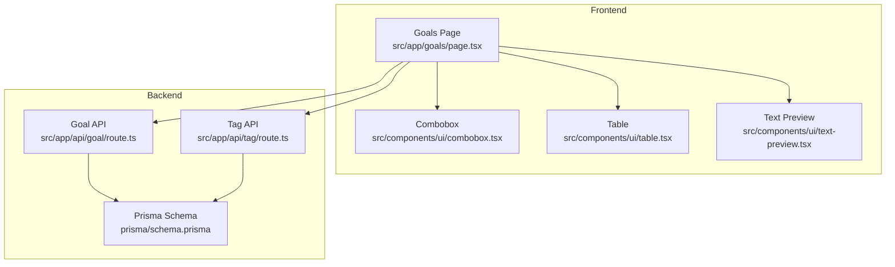
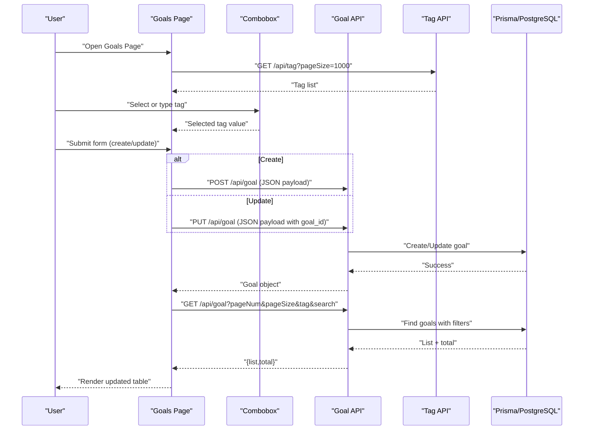
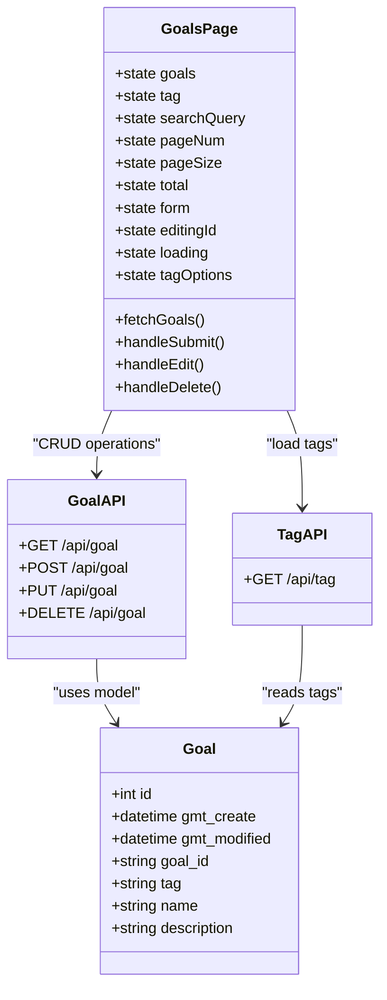
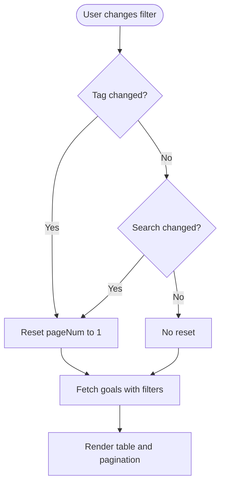
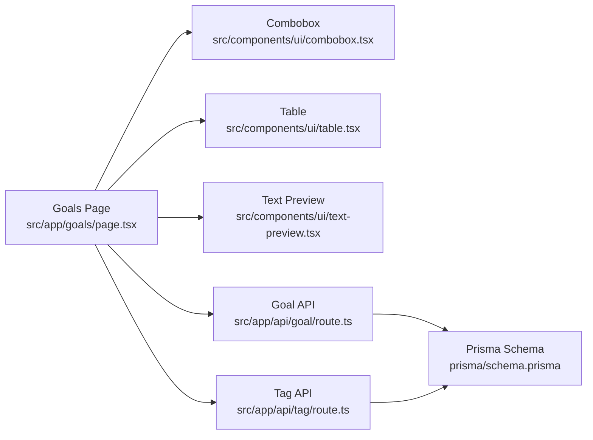

# Goal Management System

<cite>
**Referenced Files in This Document**
- [page.tsx](file://src/app/goals/page.tsx)
- [route.ts](file://src/app/api/goal/route.ts)
- [route.ts](file://src/app/api/tag/route.ts)
- [combobox.tsx](file://src/components/ui/combobox.tsx)
- [table.tsx](file://src/components/ui/table.tsx)
- [text-preview.tsx](file://src/components/ui/text-preview.tsx)
- [schema.prisma](file://prisma/schema.prisma)
- [README.md](file://README.md)
</cite>

## Table of Contents
1. [Introduction](#introduction)
2. [Project Structure](#project-structure)
3. [Core Components](#core-components)
4. [Architecture Overview](#architecture-overview)
5. [Detailed Component Analysis](#detailed-component-analysis)
6. [Dependency Analysis](#dependency-analysis)
7. [Performance Considerations](#performance-considerations)
8. [Troubleshooting Guide](#troubleshooting-guide)
9. [Conclusion](#conclusion)

## Introduction
This document describes the Goal Management System feature, focusing on the complete workflow for creating, editing, and deleting goals. It covers the form implementation with tag selection, name validation, and description handling; search and filtering functionality with tag-based filtering and pagination support; API integration patterns for goal CRUD operations including request/response schemas and error handling; practical examples of goal creation scenarios and tag management workflows; and the combobox component integration for dynamic tag selection and autocomplete functionality. It also provides troubleshooting guidance for common form validation issues and performance optimization tips for large goal lists.

## Project Structure
The Goal Management feature is implemented as a Next.js app page with associated API routes and UI components:
- Frontend page: src/app/goals/page.tsx
- Goal API: src/app/api/goal/route.ts
- Tag API: src/app/api/tag/route.ts
- UI components: src/components/ui/combobox.tsx, src/components/ui/table.tsx, src/components/ui/text-preview.tsx
- Data model: prisma/schema.prisma
- Project overview: README.md

**Diagram sources**
- [page.tsx:1-314](file://src/app/goals/page.tsx#L1-314)
- [route.ts:1-51](file://src/app/api/goal/route.ts#L1-51)
- [route.ts:1-11](file://src/app/api/tag/route.ts#L1-11)
- [combobox.tsx:1-75](file://src/components/ui/combobox.tsx#L1-75)
- [table.tsx:1-117](file://src/components/ui/table.tsx#L1-117)
- [text-preview.tsx:1-241](file://src/components/ui/text-preview.tsx#L1-241)
- [schema.prisma:16-24](file://prisma/schema.prisma#L16-L24)

**Section sources**
- [page.tsx:1-314](file://src/app/goals/page.tsx#L1-314)
- [route.ts:1-51](file://src/app/api/goal/route.ts#L1-51)
- [route.ts:1-11](file://src/app/api/tag/route.ts#L1-11)
- [combobox.tsx:1-75](file://src/components/ui/combobox.tsx#L1-75)
- [table.tsx:1-117](file://src/components/ui/table.tsx#L1-117)
- [text-preview.tsx:1-241](file://src/components/ui/text-preview.tsx#L1-241)
- [schema.prisma:16-24](file://prisma/schema.prisma#L16-L24)

## Core Components
- Goals Page: Implements the goal management UI, form handling, search/filtering, pagination, and CRUD operations.
- Goal API: Provides GET (list with pagination and tag filtering), POST (create), PUT (update), and DELETE (delete) endpoints.
- Tag API: Provides GET endpoint to list distinct tags from goals.
- Combobox: Dynamic tag selector with autocomplete and custom tag creation.
- Table and Text Preview: Rendering and preview utilities for goal lists.

Key responsibilities:
- Form validation and submission for goal creation/editing.
- Tag selection via combobox with dynamic option filtering and custom tag creation.
- Filtering by tag and search by name with pagination.
- API integration for CRUD operations with error handling.
- UI rendering and responsive layout for goal list and actions.

**Section sources**
- [page.tsx:17-36](file://src/app/goals/page.tsx#L17-L36)
- [route.ts:7-24](file://src/app/api/goal/route.ts#L7-L24)
- [route.ts:6-11](file://src/app/api/tag/route.ts#L6-L11)
- [combobox.tsx:6-12](file://src/components/ui/combobox.tsx#L6-L12)

## Architecture Overview
The system follows a client-server architecture:
- Client-side React component manages state, user interactions, and UI rendering.
- Next.js API routes handle backend logic and database operations via Prisma.
- Prisma schema defines the Goal model and relationships.

**Diagram sources**
- [page.tsx:38-91](file://src/app/goals/page.tsx#L38-L91)
- [route.ts:8-24](file://src/app/api/goal/route.ts#L8-L24)
- [route.ts:6-11](file://src/app/api/tag/route.ts#L6-L11)

## Detailed Component Analysis

### Goals Page (Client-Side)
Responsibilities:
- Manage local state for goals, filters, pagination, form, and loading indicators.
- Fetch tag options from Tag API on mount.
- Fetch goals list with pagination and tag/name filters.
- Handle form submission for create/update.
- Handle edit and delete actions.
- Render table with actions and pagination controls.

Key behaviors:
- Tag filtering: Uses Select component bound to tag state; resets to page 1 on change.
- Search filtering: Updates searchQuery and resets to page 1.
- Pagination: Fixed pageSize of 10; controls enable/disable based on current page and total.
- Edit mode: Populates form with selected goal and switches to update mode.
- Delete: Confirms deletion via API and refreshes list.

Validation and UX:
- Name field is required in form.
- Loading state prevents concurrent operations.
- TextPreview truncates long descriptions with tooltip on hover.

**Section sources**
- [page.tsx:25-314](file://src/app/goals/page.tsx#L25-L314)

### Goal API (Server-Side)
Endpoints:
- GET /api/goal: List goals with pagination and tag filtering.
- POST /api/goal: Create a new goal with auto-generated goal_id.
- PUT /api/goal: Update an existing goal by goal_id.
- DELETE /api/goal: Delete a goal by goal_id.

Request/Response schemas:
- GET: Query parameters include tag, pageNum, pageSize, and optional search.
- POST: Request body contains goal fields (excluding goal_id).
- PUT: Request body contains goal_id and updated fields.
- DELETE: Query parameter goal_id is required.

Error handling:
- DELETE returns 400 if goal_id is missing.

Pagination and filtering:
- Uses Prisma findMany with skip/take for pagination.
- Applies tag filter via where clause.
- Orders by creation time descending.

**Section sources**
- [route.ts:8-24](file://src/app/api/goal/route.ts#L8-L24)
- [route.ts:27-31](file://src/app/api/goal/route.ts#L27-L31)
- [route.ts:34-42](file://src/app/api/goal/route.ts#L34-L42)
- [route.ts:45-51](file://src/app/api/goal/route.ts#L45-L51)

### Tag API (Server-Side)
Endpoint:
- GET /api/tag: Returns distinct tag values from the Goal model.

Implementation:
- Queries all goals and extracts unique tags.

**Section sources**
- [route.ts:6-11](file://src/app/api/tag/route.ts#L6-L11)

### Combobox Component (Dynamic Tag Selection)
Features:
- Autocomplete filtering of tag options (case-insensitive).
- Custom tag creation when input does not match existing options.
- Keyboard support (Enter to confirm custom tag).
- Visual feedback for selected item and placeholder text.

Integration:
- Used in Goals Page for tag selection in the form.
- Options loaded from Tag API; value bound to form state.

**Section sources**
- [combobox.tsx:14-75](file://src/components/ui/combobox.tsx#L14-L75)
- [page.tsx:112-118](file://src/app/goals/page.tsx#L112-L118)

### Table and Text Preview Components
- Table: Responsive table with horizontal scrolling and sticky action column.
- TextPreview: Truncated text with tooltip on hover; detects URLs and renders links; copy-to-clipboard functionality.

Usage:
- Goals Page uses TextPreview for name and description columns.
- Table provides consistent styling and accessibility attributes.

**Section sources**
- [table.tsx:1-117](file://src/components/ui/table.tsx#L1-L117)
- [text-preview.tsx:14-241](file://src/components/ui/text-preview.tsx#L14-L241)
- [page.tsx:226-244](file://src/app/goals/page.tsx#L226-L244)

### Data Model (Prisma)
Goal model fields:
- id: Auto-increment integer primary key.
- gmt_create: Creation timestamp.
- gmt_modified: Last modified timestamp.
- goal_id: Unique string identifier.
- tag: String tag.
- name: String name.
- description: Optional string description.

Relationships:
- No explicit relations defined for Goal in the provided schema.

**Section sources**
- [schema.prisma:16-24](file://prisma/schema.prisma#L16-L24)

## Architecture Overview

**Diagram sources**
- [page.tsx:17-36](file://src/app/goals/page.tsx#L17-L36)
- [route.ts:8-24](file://src/app/api/goal/route.ts#L8-L24)
- [route.ts:6-11](file://src/app/api/tag/route.ts#L6-L11)
- [schema.prisma:16-24](file://prisma/schema.prisma#L16-L24)

## Detailed Component Analysis

### Form Implementation and Validation
- Fields:
  - Tag: Selected via Combobox; supports custom tags.
  - Name: Required input validated by browser constraint.
  - Description: Optional textarea.
- Actions:
  - Submit: Creates or updates goal depending on editingId.
  - Cancel: Resets form and editing state.
- Validation:
  - Name is required; enforced by HTML input attribute.
  - Loading state prevents concurrent submissions.

Practical examples:
- Creating a new goal: Fill name and tag; submit; observe success.
- Editing an existing goal: Click edit; modify fields; submit; observe update.
- Custom tag creation: Type a new tag in Combobox; press Enter; submit; new tag saved.

**Section sources**
- [page.tsx:59-84](file://src/app/goals/page.tsx#L59-L84)
- [combobox.tsx:43-50](file://src/components/ui/combobox.tsx#L43-L50)

### Search and Filtering Workflow
- Tag-based filtering:
  - Select dropdown filters goals by exact tag match.
  - Changing tag resets pagination to page 1.
- Name search:
  - Text input filters goals by substring match in name.
  - Changing search resets pagination to page 1.
- Pagination:
  - Fixed page size of 10.
  - Previous/Next buttons enabled/disabled based on current position.

**Diagram sources**
- [page.tsx:169-177](file://src/app/goals/page.tsx#L169-L177)
- [page.tsx:181-189](file://src/app/goals/page.tsx#L181-L189)
- [page.tsx:284-306](file://src/app/goals/page.tsx#L284-L306)

**Section sources**
- [page.tsx:165-192](file://src/app/goals/page.tsx#L165-L192)
- [page.tsx:284-306](file://src/app/goals/page.tsx#L284-L306)

### API Integration Patterns
- GET /api/goal:
  - Query parameters: tag, pageNum, pageSize, optional search.
  - Response: { list: Goal[], total: number }.
- POST /api/goal:
  - Body: Goal fields excluding goal_id.
  - Response: Created Goal object.
- PUT /api/goal:
  - Body: { goal_id, ...fieldsToUpdate }.
  - Response: Updated Goal object.
- DELETE /api/goal:
  - Query parameter: goal_id.
  - Response: { success: boolean } or error with 400.

Error handling:
- DELETE returns 400 if goal_id is missing.

Bulk operations:
- Not exposed as dedicated endpoints; bulk operations can be implemented by looping over individual requests or extending the API.

**Section sources**
- [route.ts:8-24](file://src/app/api/goal/route.ts#L8-L24)
- [route.ts:27-31](file://src/app/api/goal/route.ts#L27-L31)
- [route.ts:34-42](file://src/app/api/goal/route.ts#L34-L42)
- [route.ts:45-51](file://src/app/api/goal/route.ts#L45-L51)

### Tag Management Workflows
- Loading tags:
  - On mount, fetches tags with pageSize=1000 to populate Combobox options.
- Tag selection:
  - Users can pick from existing tags or enter a new tag.
  - New tags are accepted via Enter key or clicking "Create tag".
- Tag-based filtering:
  - Selecting a tag filters the goal list; changing tag resets pagination.

**Section sources**
- [page.tsx:53-55](file://src/app/goals/page.tsx#L53-L55)
- [page.tsx:181-189](file://src/app/goals/page.tsx#L181-L189)
- [combobox.tsx:43-69](file://src/components/ui/combobox.tsx#L43-L69)
- [route.ts:6-11](file://src/app/api/tag/route.ts#L6-L11)

### Practical Examples
- Goal creation scenario:
  - Navigate to Goals page.
  - Enter name and select/enter tag.
  - Submit form; observe success and updated list.
- Tag management workflow:
  - Add a new tag via Combobox; submit; verify tag appears in dropdown.
- Bulk operations:
  - Not currently supported; implement by adding batch endpoints or client-side batching.

[No sources needed since this section provides practical usage guidance]

## Dependency Analysis

**Diagram sources**
- [page.tsx:1-15](file://src/app/goals/page.tsx#L1-L15)
- [route.ts:1-5](file://src/app/api/goal/route.ts#L1-L5)
- [route.ts:1-5](file://src/app/api/tag/route.ts#L1-L5)
- [schema.prisma:16-24](file://prisma/schema.prisma#L16-L24)

**Section sources**
- [page.tsx:1-15](file://src/app/goals/page.tsx#L1-L15)
- [route.ts:1-5](file://src/app/api/goal/route.ts#L1-L5)
- [route.ts:1-5](file://src/app/api/tag/route.ts#L1-L5)
- [schema.prisma:16-24](file://prisma/schema.prisma#L16-L24)

## Performance Considerations
- Pagination: Fixed page size of 10 reduces payload sizes; consider increasing pageSize for fewer round trips if acceptable.
- Tag loading: Fetching all tags (pageSize=1000) ensures completeness but may increase initial load time; consider lazy-loading or debounced filtering for very large tag sets.
- Filtering: Client-side filtering is efficient for small to moderate datasets; for large lists, consider server-side filtering for name search.
- Rendering: TextPreview and Table components are lightweight; avoid unnecessary re-renders by using stable references and memoization where appropriate.
- Network: Batch operations are not implemented; if frequent updates are needed, consider adding batch endpoints or optimizing request frequency.

[No sources needed since this section provides general guidance]

## Troubleshooting Guide
Common form validation issues:
- Name required: Ensure name field is filled before submitting.
- Tag selection: If tag input is empty, select an existing tag or enter a new one; press Enter to confirm custom tag.
- Concurrent operations: Loading state prevents multiple submissions; wait for completion before retrying.

API errors:
- DELETE /api/goal returns 400 if goal_id is missing; ensure goal_id is passed as query parameter.
- Network failures: Verify backend connectivity and database availability.

Large goal lists:
- Pagination: Use previous/next buttons to navigate; adjust page size if needed.
- Filtering: Combine tag and name search to reduce list size.

UI responsiveness:
- Combobox: If dropdown does not appear, ensure options are loaded; check network tab for Tag API response.
- Table: Horizontal scroll is enabled; ensure viewport is wide enough or scroll horizontally.

**Section sources**
- [page.tsx:59-84](file://src/app/goals/page.tsx#L59-L84)
- [route.ts:45-51](file://src/app/api/goal/route.ts#L45-L51)
- [combobox.tsx:21-23](file://src/components/ui/combobox.tsx#L21-L23)

## Conclusion
The Goal Management System provides a complete solution for managing goals with intuitive forms, dynamic tag selection, robust filtering, and pagination. The frontend integrates seamlessly with Next.js API routes backed by Prisma and PostgreSQL, enabling reliable CRUD operations. The system’s modular design allows for straightforward extension, such as adding bulk operations or advanced search capabilities.