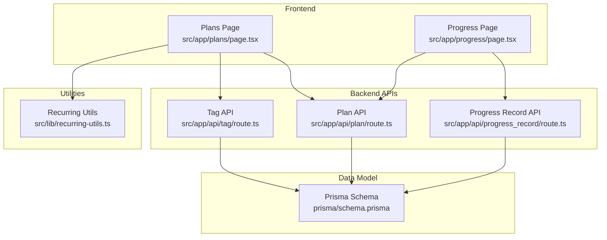
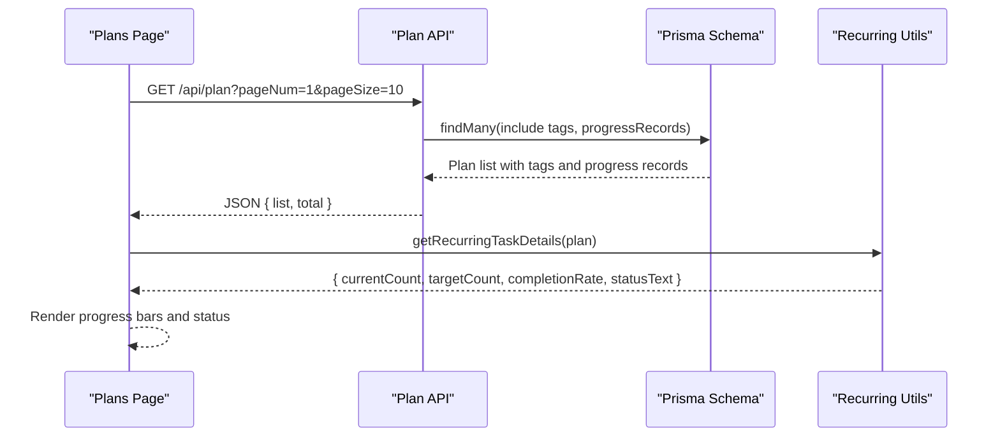
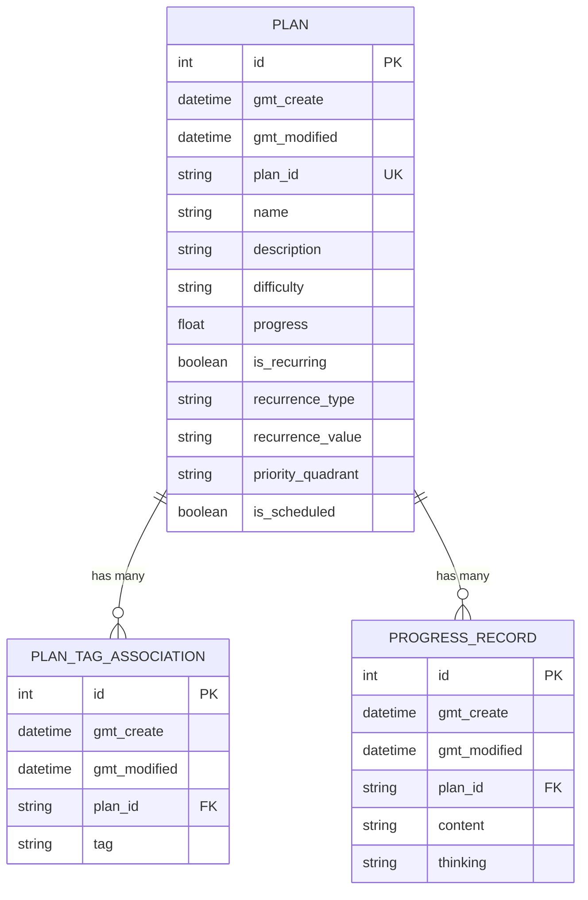
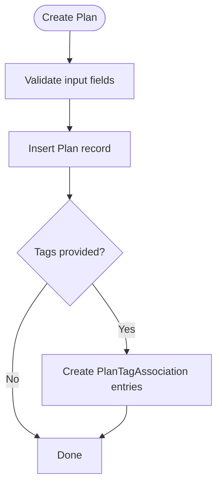
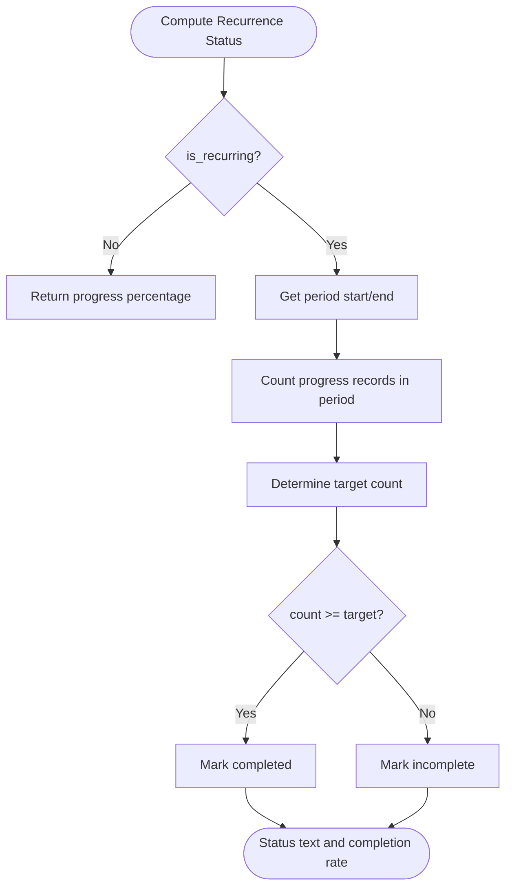
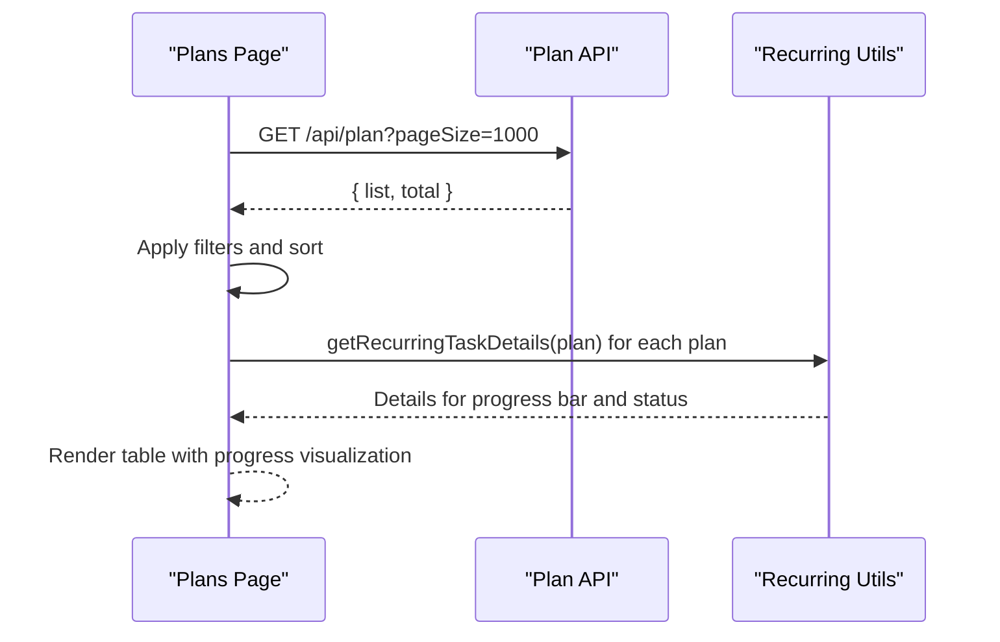
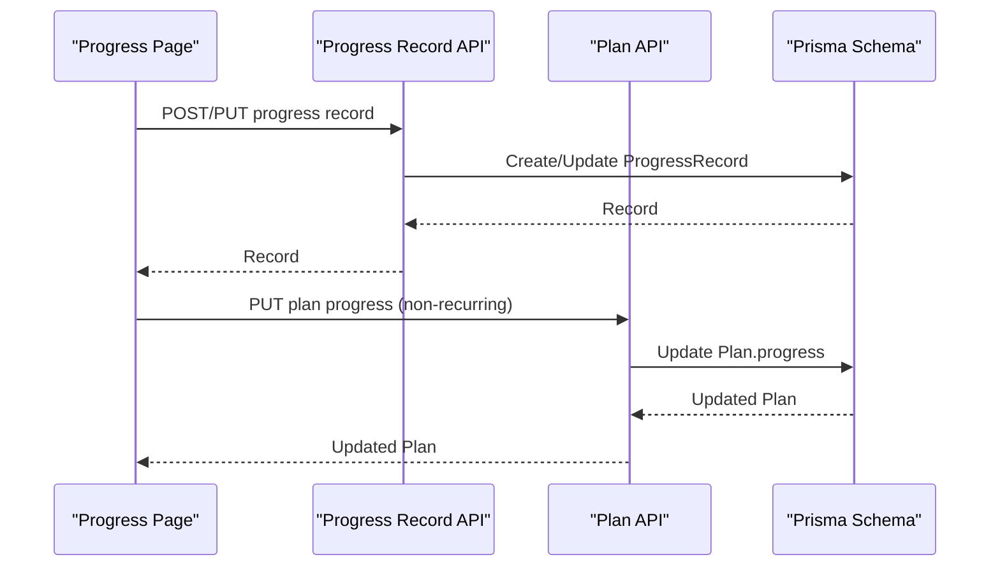
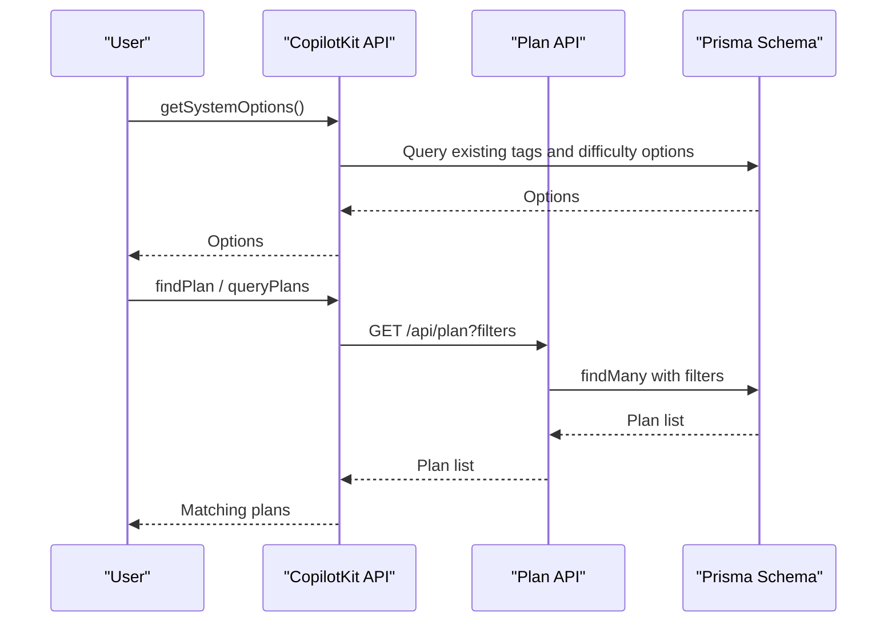
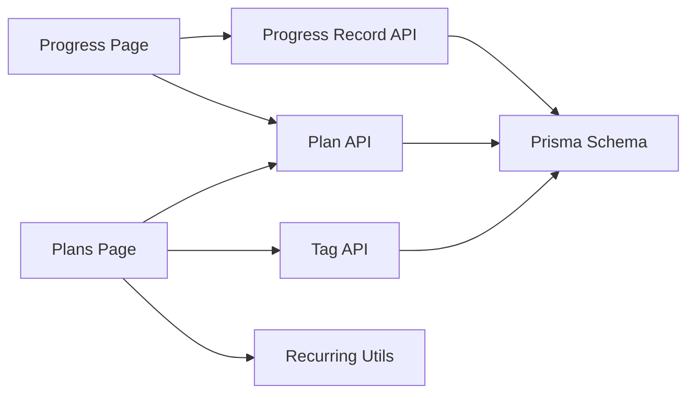

# Plan Management System

<cite>
**Referenced Files in This Document**
- [schema.prisma](file://prisma/schema.prisma)
- [plan.route.ts](file://src/app/api/plan/route.ts)
- [progress_record.route.ts](file://src/app/api/progress_record/route.ts)
- [tag.route.ts](file://src/app/api/tag/route.ts)
- [recurring-utils.ts](file://src/lib/recurring-utils.ts)
- [plans.page.tsx](file://src/app/plans/page.tsx)
- [progress.page.tsx](file://src/app/progress/page.tsx)
- [copilotkit.route.ts](file://src/app/api/copilotkit/route.ts)
- [test-action.route.ts](file://src/app/api/test-action/route.ts)
</cite>

## Table of Contents
1. [Introduction](#introduction)
2. [Project Structure](#project-structure)
3. [Core Components](#core-components)
4. [Architecture Overview](#architecture-overview)
5. [Detailed Component Analysis](#detailed-component-analysis)
6. [Dependency Analysis](#dependency-analysis)
7. [Performance Considerations](#performance-considerations)
8. [Troubleshooting Guide](#troubleshooting-guide)
9. [Conclusion](#conclusion)
10. [Appendices](#appendices)

## Introduction
This document describes the Plan Management System, covering plan creation, difficulty rating, tag associations, recurrence configuration, progress tracking, and integration with recurring utilities. It documents the plan listing interface with sorting, filtering, and progress visualization, and provides API endpoint specifications for plan CRUD operations, including parameter validation and response formatting. It also includes examples of plan creation scenarios, difficulty assessment methodologies, recurrence pattern implementations, and guidance for troubleshooting recurrence calculation issues and optimizing performance for plan-heavy workloads.

## Project Structure
The Plan Management System spans frontend pages, backend APIs, and shared utilities:
- Frontend: Plan listing and creation UI, progress recording UI
- Backend: Plan CRUD API, progress record API, tag listing API, recurring utilities
- Data model: Prisma schema defines Plan, ProgressRecord, PlanTagAssociation, and Goal entities

**Diagram sources**
- [plans.page.tsx:1-807](file://src/app/plans/page.tsx#L1-L807)
- [progress.page.tsx:1-570](file://src/app/progress/page.tsx#L1-L570)
- [plan.route.ts:1-114](file://src/app/api/plan/route.ts#L1-L114)
- [progress_record.route.ts:1-154](file://src/app/api/progress_record/route.ts#L1-L154)
- [tag.route.ts:1-11](file://src/app/api/tag/route.ts#L1-L11)
- [recurring-utils.ts:1-218](file://src/lib/recurring-utils.ts#L1-L218)
- [schema.prisma:1-72](file://prisma/schema.prisma#L1-L72)

**Section sources**
- [schema.prisma:1-72](file://prisma/schema.prisma#L1-L72)
- [plan.route.ts:1-114](file://src/app/api/plan/route.ts#L1-L114)
- [progress_record.route.ts:1-154](file://src/app/api/progress_record/route.ts#L1-L154)
- [tag.route.ts:1-11](file://src/app/api/tag/route.ts#L1-L11)
- [recurring-utils.ts:1-218](file://src/lib/recurring-utils.ts#L1-L218)
- [plans.page.tsx:1-807](file://src/app/plans/page.tsx#L1-L807)
- [progress.page.tsx:1-570](file://src/app/progress/page.tsx#L1-L570)

## Core Components
- Plan entity with fields for difficulty, progress, recurrence configuration, priority quadrant, scheduling flag, tags, and progress records
- Tag association model linking plans to tags
- Progress record model capturing plan updates with timestamps and optional custom time
- Recurring utilities for calculating current period boundaries, counting progress records per period, determining targets, and computing completion status
- Plan listing UI with local filtering/sorting and pagination
- Progress recording UI with single-plan and all-plan views, custom time support, and progress adjustment for non-recurring plans

**Section sources**
- [schema.prisma:26-61](file://prisma/schema.prisma#L26-L61)
- [recurring-utils.ts:1-218](file://src/lib/recurring-utils.ts#L1-L218)
- [plans.page.tsx:19-80](file://src/app/plans/page.tsx#L19-L80)
- [progress.page.tsx:18-33](file://src/app/progress/page.tsx#L18-L33)

## Architecture Overview
The system integrates frontend pages with backend APIs and a shared recurring utilities module. The plan listing page fetches plans with tags and recent progress records, applies client-side filters and sorting, and renders progress bars and status indicators using recurring utilities. The progress page manages progress records, supports custom timestamps, and can update plan progress for non-recurring tasks.

**Diagram sources**
- [plan.route.ts:7-67](file://src/app/api/plan/route.ts#L7-L67)
- [recurring-utils.ts:152-186](file://src/lib/recurring-utils.ts#L152-L186)
- [plans.page.tsx:692-723](file://src/app/plans/page.tsx#L692-L723)

## Detailed Component Analysis

### Plan Entity and Data Model
- Plan fields include identifiers, timestamps, name, description, difficulty, progress, recurrence flags and values, priority quadrant, scheduling flag, and relations to tags and progress records
- PlanTagAssociation links plans to tags
- ProgressRecord captures plan_id, content, thinking, and timestamps

**Diagram sources**
- [schema.prisma:26-61](file://prisma/schema.prisma#L26-L61)

**Section sources**
- [schema.prisma:26-61](file://prisma/schema.prisma#L26-L61)

### Plan Creation Workflow
- Difficulty rating system: difficulty accepts predefined values (e.g., easy, medium, hard)
- Tag associations: tags are stored via PlanTagAssociation entries; during creation, tags are inserted after plan creation
- Recurrence pattern configuration: is_recurring toggles periodic tracking; recurrence_type supports daily, weekly, monthly; recurrence_value sets target count per period
- Priority quadrant and scheduling: priority_quadrant and is_scheduled enable four-quadrant planning integration

**Diagram sources**
- [plan.route.ts:69-83](file://src/app/api/plan/route.ts#L69-L83)

**Section sources**
- [plan.route.ts:69-83](file://src/app/api/plan/route.ts#L69-L83)
- [plans.page.tsx:387-458](file://src/app/plans/page.tsx#L387-L458)

### Recurrence Pattern Configuration and Calculation
- Recurrence types: daily, weekly, monthly
- Period boundaries: start/end of current period computed per recurrence type
- Target determination: explicit recurrence_value or inferred defaults based on recurrence type and plan name heuristics
- Completion status: current count vs target determines completion within the current period

**Diagram sources**
- [recurring-utils.ts:138-186](file://src/lib/recurring-utils.ts#L138-L186)

**Section sources**
- [recurring-utils.ts:1-218](file://src/lib/recurring-utils.ts#L1-L218)
- [plans.page.tsx:692-723](file://src/app/plans/page.tsx#L692-L723)

### Plan Listing Interface: Sorting, Filtering, and Progress Visualization
- Sorting: difficulty ascending/descending and status ascending/descending (progress/completion rate)
- Filtering: difficulty, task type (recurring/normal), progress (completed/incomplete), tags (multi-select), and name search
- Progress visualization: progress bars and status text for both recurring and non-recurring plans
- Pagination: client-side pagination with page size and total counts

**Diagram sources**
- [plans.page.tsx:141-240](file://src/app/plans/page.tsx#L141-L240)
- [plan.route.ts:7-67](file://src/app/api/plan/route.ts#L7-L67)
- [recurring-utils.ts:152-186](file://src/lib/recurring-utils.ts#L152-L186)

**Section sources**
- [plans.page.tsx:82-139](file://src/app/plans/page.tsx#L82-L139)
- [plans.page.tsx:619-775](file://src/app/plans/page.tsx#L619-L775)

### Progress Tracking Integration and Completion Analytics
- Progress records capture content and thinking with timestamps; custom_time can be set for historical entries
- For non-recurring plans, progress can be adjusted via the progress page; for recurring plans, completion is derived from progress records within the current period
- Analytics: completion rate per period, status text indicating completion, and counts per period

**Diagram sources**
- [progress.page.tsx:113-174](file://src/app/progress/page.tsx#L113-L174)
- [progress_record.route.ts:25-70](file://src/app/api/progress_record/route.ts#L25-L70)
- [plan.route.ts:85-105](file://src/app/api/plan/route.ts#L85-L105)

**Section sources**
- [progress.page.tsx:113-174](file://src/app/progress/page.tsx#L113-L174)
- [progress_record.route.ts:1-154](file://src/app/api/progress_record/route.ts#L1-L154)
- [recurring-utils.ts:138-186](file://src/lib/recurring-utils.ts#L138-L186)

### Automated Plan Generation from Goals (CopilotKit Integration)
- The CopilotKit endpoint provides tools to query plans, find relevant plans, and create plans with validated difficulty and tags
- It enforces label selection from existing tags and standard difficulty options
- It can recommend tasks based on progress and filter criteria

**Diagram sources**
- [copilotkit.route.ts:483-517](file://src/app/api/copilotkit/route.ts#L483-L517)
- [copilotkit.route.ts:332-361](file://src/app/api/copilotkit/route.ts#L332-L361)
- [plan.route.ts:7-67](file://src/app/api/plan/route.ts#L7-L67)

**Section sources**
- [copilotkit.route.ts:1-200](file://src/app/api/copilotkit/route.ts#L1-L200)
- [copilotkit.route.ts:332-361](file://src/app/api/copilotkit/route.ts#L332-L361)
- [copilotkit.route.ts:483-517](file://src/app/api/copilotkit/route.ts#L483-L517)

### API Endpoints for Plan CRUD Operations
- GET /api/plan
  - Query parameters: tag, difficulty, goal_id, is_scheduled, priority_quadrant, unscheduled, pageNum, pageSize
  - Filtering logic: applies where conditions; goal_id filters by goal tag; unscheduled filters by is_scheduled=false
  - Response: { list: Plan[], total: number }
- POST /api/plan
  - Request body: plan fields plus tags array
  - Behavior: creates plan, then inserts PlanTagAssociation entries
  - Response: Plan
- PUT /api/plan
  - Request body: plan_id and fields to update; tags array replaces existing associations
  - Response: Plan
- DELETE /api/plan
  - Query parameter: plan_id
  - Response: { success: true } or error

Validation and response formatting:
- Parameter validation: checks presence of plan_id for deletion; filters are optional
- Response formatting: JSON payloads; pagination totals included

**Section sources**
- [plan.route.ts:7-114](file://src/app/api/plan/route.ts#L7-L114)

### API Endpoints for Progress Records
- GET /api/progress_record
  - Query parameters: plan_id, pageNum, pageSize
  - Response: { list: ProgressRecord[], total: number }
- POST /api/progress_record
  - Request body: plan_id, content, thinking, optional custom_time
  - Behavior: creates record; custom_time parsed to local time if provided
  - Response: ProgressRecord
- PUT /api/progress_record
  - Request body: id, content, thinking, optional plan_id, optional custom_time
  - Response: ProgressRecord
- DELETE /api/progress_record
  - Query parameter: id
  - Response: { success: true }

**Section sources**
- [progress_record.route.ts:1-154](file://src/app/api/progress_record/route.ts#L1-L154)

### API Endpoint for Tags
- GET /api/tag
  - Response: string[] of unique tags derived from goals

**Section sources**
- [tag.route.ts:1-11](file://src/app/api/tag/route.ts#L1-L11)

## Dependency Analysis
- Frontend pages depend on backend APIs for data and on recurring utilities for progress computation
- Backend APIs depend on Prisma schema for persistence
- Recurring utilities are pure functions used by both frontend and backend

**Diagram sources**
- [plans.page.tsx:1-807](file://src/app/plans/page.tsx#L1-L807)
- [progress.page.tsx:1-570](file://src/app/progress/page.tsx#L1-L570)
- [plan.route.ts:1-114](file://src/app/api/plan/route.ts#L1-L114)
- [progress_record.route.ts:1-154](file://src/app/api/progress_record/route.ts#L1-L154)
- [tag.route.ts:1-11](file://src/app/api/tag/route.ts#L1-L11)
- [recurring-utils.ts:1-218](file://src/lib/recurring-utils.ts#L1-L218)
- [schema.prisma:1-72](file://prisma/schema.prisma#L1-L72)

**Section sources**
- [plans.page.tsx:1-807](file://src/app/plans/page.tsx#L1-L807)
- [progress.page.tsx:1-570](file://src/app/progress/page.tsx#L1-L570)
- [plan.route.ts:1-114](file://src/app/api/plan/route.ts#L1-L114)
- [progress_record.route.ts:1-154](file://src/app/api/progress_record/route.ts#L1-L154)
- [tag.route.ts:1-11](file://src/app/api/tag/route.ts#L1-L11)
- [recurring-utils.ts:1-218](file://src/lib/recurring-utils.ts#L1-L218)
- [schema.prisma:1-72](file://prisma/schema.prisma#L1-L72)

## Performance Considerations
- Client-side filtering and sorting: the plan listing page fetches a large subset (pageSize=1000) and performs filtering/sorting locally. For plan-heavy workloads, consider:
  - Server-side pagination and filtering for plan listing
  - Indexes on frequently filtered fields (difficulty, is_scheduled, priority_quadrant, tags)
  - Limiting tag fetch size and caching tag options
- Recurring calculations: recurring utilities compute period boundaries and counts; keep progress records minimal per plan to reduce filtering cost
- Progress page: fetching all records for a single plan can be expensive; consider server-side pagination for progress records as well

[No sources needed since this section provides general guidance]

## Troubleshooting Guide
- Recurrence calculation issues:
  - Verify recurrence_type and recurrence_value are set correctly for recurring plans
  - Ensure progress records are created with timestamps within the expected period
  - Confirm custom_time is provided in the correct format for historical entries
- Progress not updating for recurring tasks:
  - Confirm progress records are created under the correct plan_id
  - Check that the current period boundaries align with the intended cycle (daily/weekly/monthly)
- Plan listing slow with many plans:
  - Use server-side filtering and pagination for plan listing
  - Reduce client-side sorting to only essential fields
- Deleting a plan fails:
  - Ensure plan_id query parameter is present and valid

**Section sources**
- [recurring-utils.ts:1-218](file://src/lib/recurring-utils.ts#L1-L218)
- [progress_record.route.ts:1-154](file://src/app/api/progress_record/route.ts#L1-L154)
- [plan.route.ts:107-114](file://src/app/api/plan/route.ts#L107-L114)

## Conclusion
The Plan Management System provides a robust foundation for creating, organizing, and tracking plans with difficulty ratings, tags, and recurrence patterns. The frontend offers powerful filtering and sorting, while the backend APIs and Prisma schema ensure reliable persistence. Recurring utilities enable accurate progress tracking and completion analytics. Integrations with CopilotKit facilitate automated plan generation from goals. For production-scale deployments, prioritize server-side pagination and filtering to optimize performance.

## Appendices

### Example Scenarios
- Creating a daily habit plan:
  - Set is_recurring=true, recurrence_type=daily, recurrence_value=1
  - Add tags relevant to the habit
  - Track completion by adding progress records each day
- Weekly learning plan:
  - Set is_recurring=true, recurrence_type=weekly, recurrence_value=3
  - Use tags like study, programming
  - Monitor completion via weekly progress bar
- Non-recurring project plan:
  - Set is_recurring=false, manage progress via progress page adjustments
  - Use tags like work, project
- Difficulty assessment:
  - Assign difficulty based on effort and time estimate; use predefined values (easy, medium, hard)
- Goal-to-plan automation:
  - Use CopilotKit to query existing plans, find relevant ones, and create new plans with validated tags and difficulty

[No sources needed since this section provides general guidance]