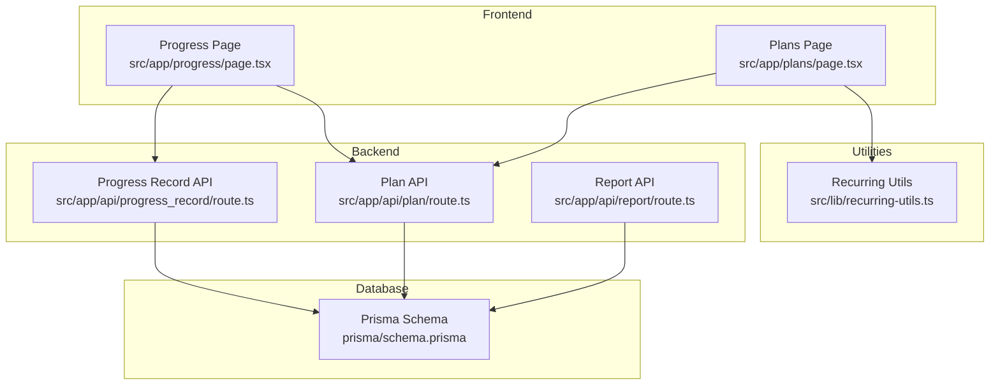
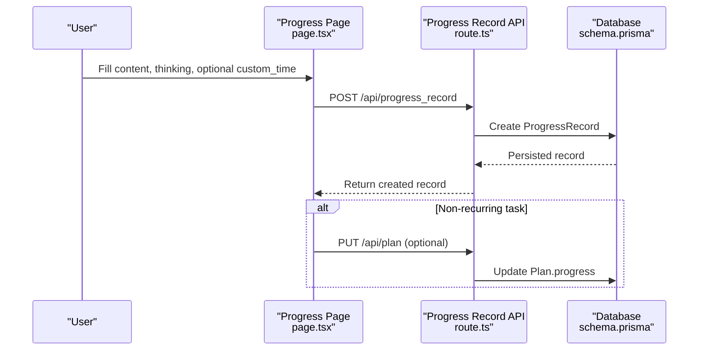
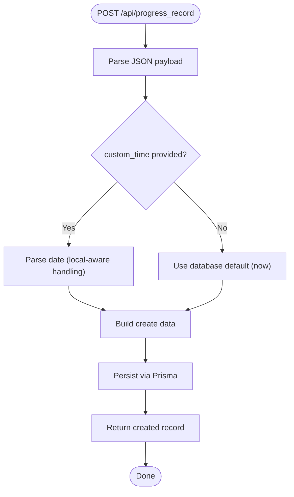
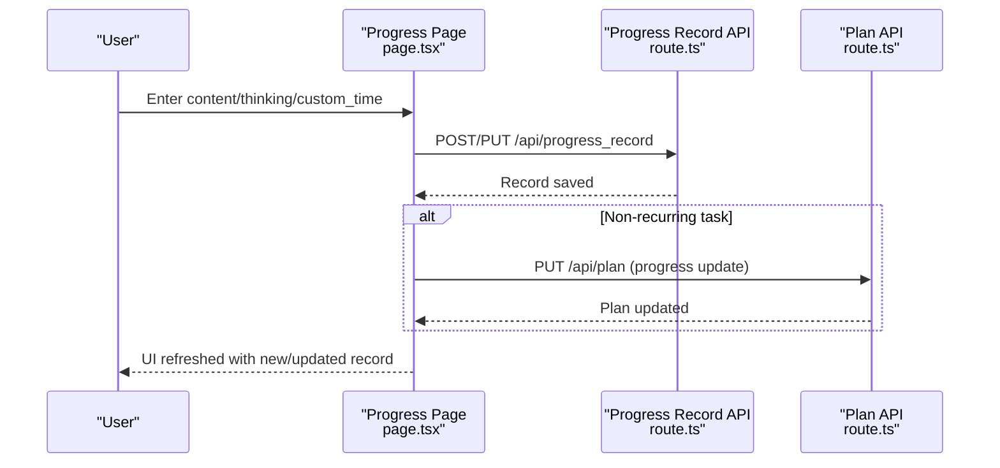
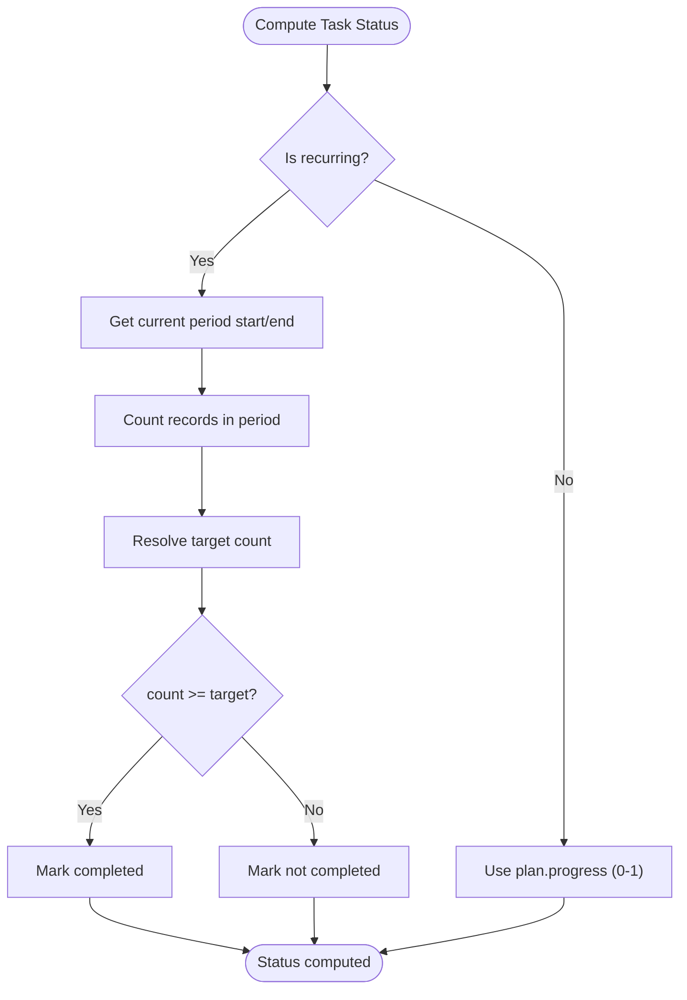
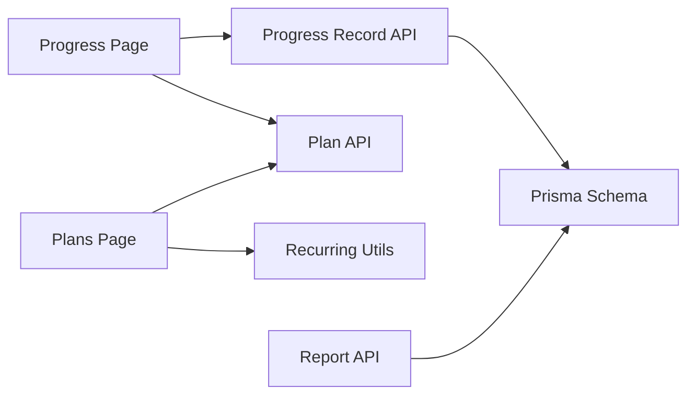

# Progress Tracking System

<cite>
**Referenced Files in This Document**
- [route.ts](file://src/app/api/progress_record/route.ts)
- [page.tsx](file://src/app/progress/page.tsx)
- [schema.prisma](file://prisma/schema.prisma)
- [recurring-utils.ts](file://src/lib/recurring-utils.ts)
- [route.ts](file://src/app/api/plan/route.ts)
- [page.tsx](file://src/app/plans/page.tsx)
- [route.ts](file://src/app/api/report/route.ts)
- [PROGRESS_CUSTOM_TIME.md](file://PROGRESS_CUSTOM_TIME.md)
- [RECURRING_TASKS.md](file://RECURRING_TASKS.md)
- [README.md](file://README.md)
</cite>

## Table of Contents
1. [Introduction](#introduction)
2. [Project Structure](#project-structure)
3. [Core Components](#core-components)
4. [Architecture Overview](#architecture-overview)
5. [Detailed Component Analysis](#detailed-component-analysis)
6. [Dependency Analysis](#dependency-analysis)
7. [Performance Considerations](#performance-considerations)
8. [Troubleshooting Guide](#troubleshooting-guide)
9. [Conclusion](#conclusion)
10. [Appendices](#appendices)

## Introduction
This document explains the Progress Tracking System feature, focusing on the daily progress logging workflow, reflection prompts, evidence submission, and analytics integration. It covers the backend API for progress records, frontend UI for capturing content and reflection, time handling and timestamp management, and the integration with utility functions for recurring tasks and analytics. It also provides examples of progress entry scenarios, reflection questionnaires, completion verification, visualization components, trend analysis, automated reporting, troubleshooting, and best practices.

## Project Structure
The progress tracking system spans frontend pages, backend API routes, database schema, and shared utility libraries. The key areas are:
- Frontend: Progress page for capturing entries and viewing records
- Backend: Progress record API for CRUD operations and timestamp management
- Database: Prisma schema defining the ProgressRecord model and relations
- Utilities: Recurring task helpers for completion verification and status display
- Analytics: Report API for generating automated reports

**Diagram sources**
- [page.tsx:1-570](file://src/app/progress/page.tsx#L1-L570)
- [route.ts:1-154](file://src/app/api/progress_record/route.ts#L1-L154)
- [schema.prisma:53-61](file://prisma/schema.prisma#L53-L61)
- [recurring-utils.ts:1-218](file://src/lib/recurring-utils.ts#L1-L218)
- [route.ts:1-114](file://src/app/api/plan/route.ts#L1-L114)
- [page.tsx:1-807](file://src/app/plans/page.tsx#L1-L807)
- [route.ts:1-48](file://src/app/api/report/route.ts#L1-L48)

**Section sources**
- [README.md:157-174](file://README.md#L157-L174)

## Core Components
- Progress Record API: Handles listing, creating, updating, and deleting progress records with optional custom timestamps.
- Progress Page UI: Captures content, reflection, optional custom time, and optionally updates plan progress for non-recurring tasks.
- Recurring Task Utilities: Computes current-period counts, targets, completion status, and displays status text.
- Plan API: Provides plan listing with progress records included for status computation.
- Report API: Generates and manages reports for automated progress reporting.

**Section sources**
- [route.ts:6-23](file://src/app/api/progress_record/route.ts#L6-L23)
- [page.tsx:113-174](file://src/app/progress/page.tsx#L113-L174)
- [recurring-utils.ts:73-147](file://src/lib/recurring-utils.ts#L73-L147)
- [route.ts:41-66](file://src/app/api/plan/route.ts#L41-L66)
- [route.ts:7-21](file://src/app/api/report/route.ts#L7-L21)

## Architecture Overview
The system follows a client-server pattern:
- The frontend collects user input (content, thinking, optional custom time) and submits it via the Progress Record API.
- The API persists the record and optionally updates plan progress for non-recurring tasks.
- The Plans page uses recurring utilities to compute and display completion status for recurring tasks.
- Reports can be generated via the Report API.

**Diagram sources**
- [page.tsx:113-174](file://src/app/progress/page.tsx#L113-L174)
- [route.ts:25-70](file://src/app/api/progress_record/route.ts#L25-L70)
- [schema.prisma:53-61](file://prisma/schema.prisma#L53-L61)
- [route.ts:85-105](file://src/app/api/plan/route.ts#L85-L105)

## Detailed Component Analysis

### Progress Record API
The API supports:
- Listing records with pagination and filtering by plan_id
- Creating records with optional custom timestamps
- Updating records with optional custom timestamps and plan_id changes
- Deleting records

Key behaviors:
- Timestamp management: If custom_time is provided, it is parsed and stored; otherwise, the database default (now) applies.
- Validation: Missing ID on update returns an error; missing ID on delete returns an error.
- Response: Returns created/updated record or success flag for deletion.

**Diagram sources**
- [route.ts:25-70](file://src/app/api/progress_record/route.ts#L25-L70)

**Section sources**
- [route.ts:6-23](file://src/app/api/progress_record/route.ts#L6-L23)
- [route.ts:25-70](file://src/app/api/progress_record/route.ts#L25-L70)
- [route.ts:72-127](file://src/app/api/progress_record/route.ts#L72-L127)
- [route.ts:129-154](file://src/app/api/progress_record/route.ts#L129-L154)

### Progress Entry Workflow (Frontend)
The Progress Page captures:
- Content: free-text description of today’s work
- Thinking: reflection and insights
- Optional custom_time: datetime-local input for historical entries
- Optional plan_id change during edit
- Optional plan progress update for non-recurring tasks

Submission flow:
- Validates plan selection for new entries
- Submits to Progress Record API (POST or PUT)
- Optionally updates plan progress via Plan API
- Refreshes lists and plan data

**Diagram sources**
- [page.tsx:113-174](file://src/app/progress/page.tsx#L113-L174)
- [route.ts:25-70](file://src/app/api/progress_record/route.ts#L25-L70)
- [route.ts:85-105](file://src/app/api/plan/route.ts#L85-L105)

**Section sources**
- [page.tsx:113-174](file://src/app/progress/page.tsx#L113-L174)
- [PROGRESS_CUSTOM_TIME.md:1-153](file://PROGRESS_CUSTOM_TIME.md#L1-L153)

### Reflection Prompts and Evidence Submission
- Reflection prompts: The UI includes a dedicated “Thinking” field to encourage reflective practice.
- Evidence submission: The system stores textual content and thinking; media attachments are not supported in the current API.
- Historical correction: Users can specify custom_time to retroactively adjust record timestamps.

**Section sources**
- [page.tsx:416-426](file://src/app/progress/page.tsx#L416-L426)
- [PROGRESS_CUSTOM_TIME.md:14-42](file://PROGRESS_CUSTOM_TIME.md#L14-L42)

### Completion Verification and Status Display
- Recurring tasks: Completion is determined by whether any progress record exists within the current period (daily/weekly/monthly).
- Non-recurring tasks: Progress is tracked as a numeric percentage.
- Status display: Plans page computes and renders completion rate and status text using recurring utilities.

**Diagram sources**
- [recurring-utils.ts:73-147](file://src/lib/recurring-utils.ts#L73-L147)
- [page.tsx:693-723](file://src/app/plans/page.tsx#L693-L723)

**Section sources**
- [recurring-utils.ts:138-147](file://src/lib/recurring-utils.ts#L138-L147)
- [page.tsx:693-723](file://src/app/plans/page.tsx#L693-L723)
- [RECURRING_TASKS.md:33-40](file://RECURRING_TASKS.md#L33-L40)

### Progress Visualization Components
- Progress Page: Lists records with truncated previews, sortable columns, and actions (edit/delete).
- Plans Page: Renders progress bars and status badges for both recurring and non-recurring tasks.
- Recurring details: Current/Target counts, completion rate, and status text.

**Section sources**
- [page.tsx:458-552](file://src/app/progress/page.tsx#L458-L552)
- [page.tsx:692-747](file://src/app/plans/page.tsx#L692-L747)
- [recurring-utils.ts:152-186](file://src/lib/recurring-utils.ts#L152-L186)

### Automated Progress Reporting
- Report API: Supports listing, creation, update, and deletion of reports.
- Integration: The system can generate reports based on goals, plans, and progress records.

**Section sources**
- [route.ts:7-21](file://src/app/api/report/route.ts#L7-L21)
- [route.ts:23-48](file://src/app/api/report/route.ts#L23-L48)
- [README.md:16-22](file://README.md#L16-L22)

## Dependency Analysis
- Progress Record depends on Prisma schema for model definition and relation to Plan.
- Progress Page depends on Plan API for plan metadata and on Progress Record API for CRUD.
- Plans Page depends on recurring utilities for status computation and on Plan API for plan data.
- Report API depends on Prisma schema for report persistence.

**Diagram sources**
- [route.ts:1-154](file://src/app/api/progress_record/route.ts#L1-L154)
- [schema.prisma:53-61](file://prisma/schema.prisma#L53-L61)
- [page.tsx:1-570](file://src/app/progress/page.tsx#L1-L570)
- [route.ts:1-114](file://src/app/api/plan/route.ts#L1-L114)
- [page.tsx:1-807](file://src/app/plans/page.tsx#L1-L807)
- [recurring-utils.ts:1-218](file://src/lib/recurring-utils.ts#L1-L218)
- [route.ts:1-48](file://src/app/api/report/route.ts#L1-L48)

**Section sources**
- [schema.prisma:53-61](file://prisma/schema.prisma#L53-L61)
- [route.ts:41-66](file://src/app/api/plan/route.ts#L41-L66)

## Performance Considerations
- Pagination: Progress Record API supports pagination to limit response sizes.
- Filtering: Filtering by plan_id reduces query scope.
- Sorting: Records are ordered by creation time; consider indexing on timestamps for large datasets.
- Frontend caching: Store fetched plans and records locally to reduce network requests.
- Batch operations: For bulk history imports, batch submissions can reduce overhead.
- Recurring computations: On large histories, consider precomputing per-period counts or adding database-level aggregations.

[No sources needed since this section provides general guidance]

## Troubleshooting Guide
Common issues and resolutions:
- Missing record ID on update/delete: Ensure the ID is provided; otherwise, the API returns an error.
- Incorrect custom_time format: Provide a valid datetime-local string; the API parses and stores it accordingly.
- No plan selected for new entries: The UI prevents saving without a plan selection.
- Progress not updating for non-recurring tasks: Verify that the plan progress update request is sent after saving the progress record.
- Recurring task status not reflecting: Confirm that progress records exist within the current period and that the plan is marked as recurring.

**Section sources**
- [route.ts:76-83](file://src/app/api/progress_record/route.ts#L76-L83)
- [route.ts:133-140](file://src/app/api/progress_record/route.ts#L133-L140)
- [page.tsx:121-124](file://src/app/progress/page.tsx#L121-L124)

## Conclusion
The Progress Tracking System provides a robust foundation for daily progress logging, reflection, and completion verification. It integrates seamlessly with plan management and recurring task utilities, supports historical timestamp adjustments, and enables automated reporting. By following the best practices outlined here, teams can maintain consistent participation and derive meaningful insights from progress data.

[No sources needed since this section summarizes without analyzing specific files]

## Appendices

### API Definitions: Progress Record
- GET /api/progress_record
  - Query parameters: plan_id (optional), pageNum (optional), pageSize (optional)
  - Response: { list: ProgressRecord[], total: number }
- POST /api/progress_record
  - Body: { plan_id, content?, thinking?, custom_time? }
  - Response: ProgressRecord
- PUT /api/progress_record
  - Body: { id, content?, thinking?, custom_time?, plan_id? }
  - Response: ProgressRecord
- DELETE /api/progress_record
  - Query parameters: id
  - Response: { success: true }

**Section sources**
- [route.ts:6-23](file://src/app/api/progress_record/route.ts#L6-L23)
- [route.ts:25-70](file://src/app/api/progress_record/route.ts#L25-L70)
- [route.ts:72-127](file://src/app/api/progress_record/route.ts#L72-L127)
- [route.ts:129-154](file://src/app/api/progress_record/route.ts#L129-L154)

### Example Scenarios
- Daily progress entry: User logs content and thinking for a non-recurring task and optionally adjusts plan progress.
- Weekly review: User adds a progress record for a weekly recurring task; the system marks the week as completed if any record exists in the current period.
- Historical correction: User edits a record to set a custom_time to yesterday’s date.

**Section sources**
- [page.tsx:113-174](file://src/app/progress/page.tsx#L113-L174)
- [PROGRESS_CUSTOM_TIME.md:96-115](file://PROGRESS_CUSTOM_TIME.md#L96-L115)
- [RECURRING_TASKS.md:42-58](file://RECURRING_TASKS.md#L42-L58)

### Best Practices
- Encourage daily logging by integrating reminders and highlighting streaks.
- Use reflection prompts to guide deeper thinking and learning.
- For recurring tasks, emphasize adding a single record per period rather than adjusting percentages.
- Keep custom_time usage for legitimate historical corrections to avoid skewing analytics.

[No sources needed since this section provides general guidance]