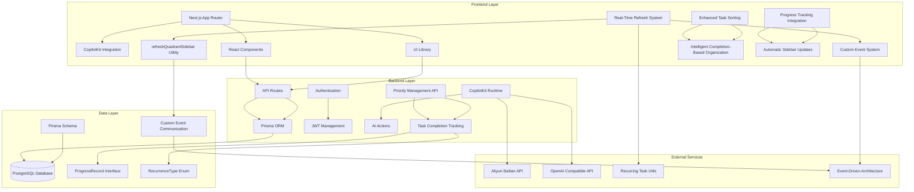
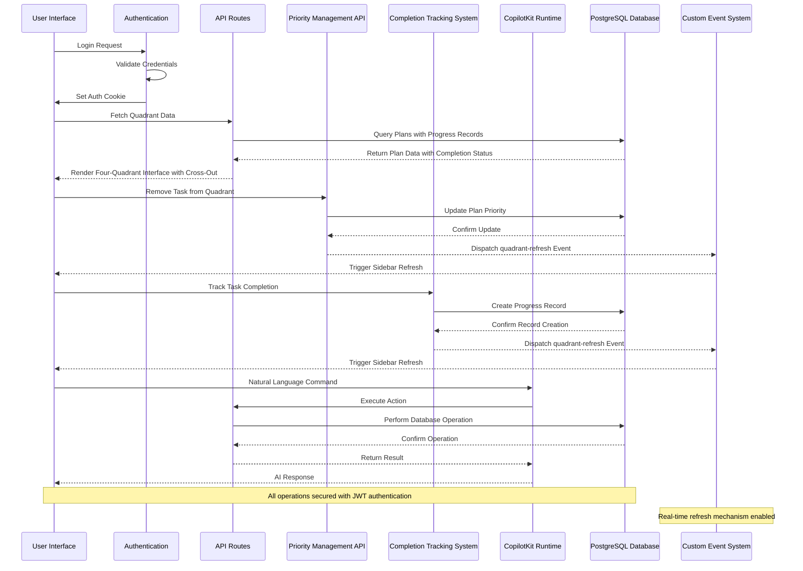
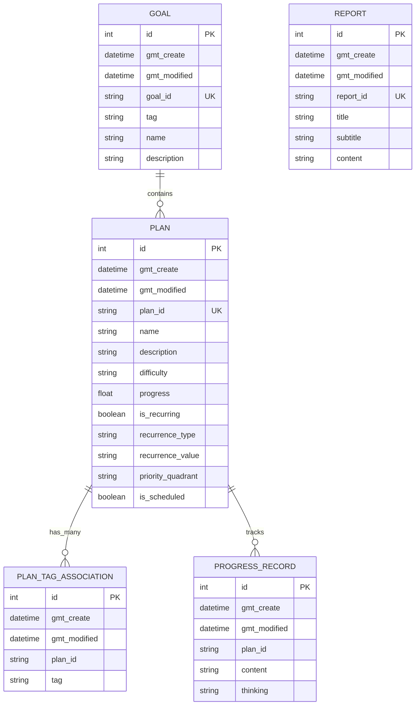
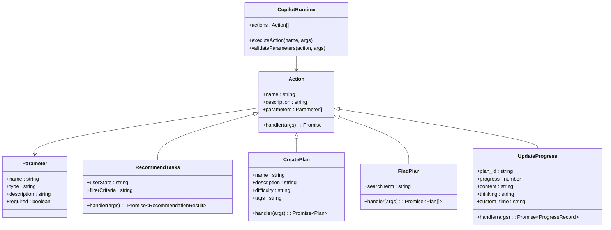
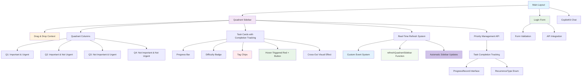
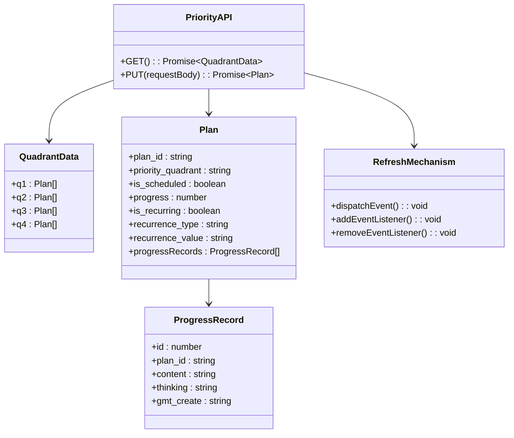

# Quadrant Task Management System

<cite>
**Referenced Files in This Document**
- [README.md](file://README.md)
- [package.json](file://package.json)
- [src/app/layout.tsx](file://src/app/layout.tsx)
- [src/lib/auth.ts](file://src/lib/auth.ts)
- [src/lib/recurring-utils.ts](file://src/lib/recurring-utils.ts)
- [src/lib/utils.ts](file://src/lib/utils.ts)
- [prisma/schema.prisma](file://prisma/schema.prisma)
- [src/app/api/copilotkit/route.ts](file://src/app/api/copilotkit/route.ts)
- [src/app/api/goal/route.ts](file://src/app/api/goal/route.ts)
- [src/app/api/plan/route.ts](file://src/app/api/plan/route.ts)
- [src/app/api/plan/priority/route.ts](file://src/app/api/plan/priority/route.ts)
- [src/app/api/progress_record/route.ts](file://src/app/api/progress_record/route.ts)
- [src/app/api/report/route.ts](file://src/app/api/report/route.ts)
- [src/app/api/auth/login/route.ts](file://src/app/api/auth/login/route.ts)
- [src/app/api/auth/logout/route.ts](file://src/app/api/auth/logout/route.ts)
- [src/app/api/auth/me/route.ts](file://src/app/api/auth/me/route.ts)
- [src/components/LoginForm.tsx](file://src/components/LoginForm.tsx)
- [src/components/quadrant-left-sidebar.tsx](file://src/components/quadrant-left-sidebar.tsx)
- [src/components/task-pool.tsx](file://src/components/task-pool.tsx)
- [src/app/progress/page.tsx](file://src/app/progress/page.tsx)
- [src/app/plans/page.tsx](file://src/app/plans/page.tsx)
</cite>

## Update Summary
**Changes Made**
- Added real-time refresh mechanism with custom event system for automatic sidebar updates
- Enhanced task sorting logic with intelligent completion-based organization
- Improved progress tracking integration with automatic quadrant sidebar refresh
- Implemented refreshQuadrantSidebar() utility function for cross-component communication
- Added intelligent task organization that prioritizes incomplete tasks first
- Enhanced completion detection system with unified logic for both regular and recurring tasks

## Table of Contents
1. [Introduction](#introduction)
2. [Project Structure](#project-structure)
3. [Core Components](#core-components)
4. [Architecture Overview](#architecture-overview)
5. [Detailed Component Analysis](#detailed-component-analysis)
6. [Dependency Analysis](#dependency-analysis)
7. [Performance Considerations](#performance-considerations)
8. [Troubleshooting Guide](#troubleshooting-guide)
9. [Conclusion](#conclusion)

## Introduction
Quadrant Task Management System is an AI-powered productivity application built with Next.js that helps users manage goals, plans, and progress through an interactive four-quadrant priority system. The system integrates CopilotKit for natural language AI assistance, enabling users to create goals, define actionable plans, track progress, and receive intelligent recommendations through conversational interactions.

The application provides a comprehensive solution for personal productivity management with features including:
- AI-powered goal and plan creation through natural language
- Interactive four-quadrant priority management system with real-time task completion tracking
- Progress tracking with reflection capabilities and cycle-based completion for recurring tasks
- Intelligent task recommendations based on user state
- Automated report generation for productivity insights
- Secure authentication with JWT-based session management
- **Enhanced** Real-time refresh mechanism with custom event system for automatic sidebar updates
- **Enhanced** Intelligent task sorting logic that prioritizes incomplete tasks first
- **Enhanced** Unified completion detection system for both regular and recurring tasks

**Updated** Enhanced with real-time refresh mechanism using custom event system, intelligent task organization with completion-based sorting, and improved progress tracking integration that automatically updates the quadrant sidebar across plan and progress pages.

## Project Structure
The project follows a modern Next.js 15 architecture with a clear separation of concerns across frontend, backend, and data layers, now featuring a real-time communication system.



**Diagram sources**
- [src/app/layout.tsx:16-30](file://src/app/layout.tsx#L16-L30)
- [src/app/api/copilotkit/route.ts:287-367](file://src/app/api/copilotkit/route.ts#L287-L367)
- [src/app/api/plan/priority/route.ts:50-93](file://src/app/api/plan/priority/route.ts#L50-L93)
- [prisma/schema.prisma:16-72](file://prisma/schema.prisma#L16-L72)
- [src/lib/recurring-utils.ts:1-218](file://src/lib/recurring-utils.ts#L1-L218)
- [src/lib/utils.ts:8-16](file://src/lib/utils.ts#L8-L16)

**Section sources**
- [README.md:157-175](file://README.md#L157-L175)
- [package.json:16-43](file://package.json#L16-L43)

## Core Components

### Authentication System
The authentication system provides secure user access through JWT-based sessions with httpOnly cookies for enhanced security.

Key features:
- Username/password validation against environment variables
- JWT token generation with 7-day expiration
- HttpOnly cookie storage for secure session management
- Protected routes with automatic user validation

**Section sources**
- [src/lib/auth.ts:14-69](file://src/lib/auth.ts#L14-L69)
- [src/app/api/auth/login/route.ts:5-50](file://src/app/api/auth/login/route.ts#L5-L50)
- [src/app/api/auth/logout/route.ts:4-23](file://src/app/api/auth/logout/route.ts#L4-L23)
- [src/app/api/auth/me/route.ts:4-27](file://src/app/api/auth/me/route.ts#L4-L27)

### AI-Powered CopilotKit Integration
The system integrates CopilotKit with Aliyun Bailian (DeepSeek-R1) to provide natural language interaction capabilities.

Core AI features:
- Intelligent task recommendation based on user state
- Plan creation and management through conversational interface
- Progress tracking with automated analysis
- Web search integration for book and learning resources
- System prompt injection for domain-specific behavior

**Section sources**
- [src/app/api/copilotkit/route.ts:13-237](file://src/app/api/copilotkit/route.ts#L13-L237)
- [src/app/api/copilotkit/route.ts:287-701](file://src/app/api/copilotkit/route.ts#L287-L701)

### Four-Quadrant Priority Management
Interactive drag-and-drop interface for managing tasks across four priority quadrants (Important & Urgent, Important & Not Urgent, etc.) with comprehensive task completion tracking, real-time refresh mechanism, and intelligent sorting logic.

**Updated** Enhanced with real-time refresh capability using custom event system, intelligent task organization that prioritizes incomplete tasks first, and automatic sidebar updates across plan and progress pages.

Key features:
- Real-time drag-and-drop task management with completion tracking and automatic sidebar refresh
- Intelligent task sorting that prioritizes incomplete tasks first, then sorts by name within completion status
- Custom event system for cross-component communication using refreshQuadrantSidebar() utility
- Visual cross-out effect for completed tasks using line-through styling
- Unified completion detection for regular tasks (progress ≥ 100%) and recurring tasks (cycle completion)
- Difficulty level and tag categorization with completion indicators
- Automatic quadrant assignment and removal with completion status
- Hover-triggered removal buttons with conditional rendering
- Responsive design for desktop and mobile with completion visualization
- API integration for seamless completion tracking and removal operations
- Real-time refresh mechanism that updates sidebar automatically after task modifications

**Section sources**
- [src/components/quadrant-left-sidebar.tsx:164-186](file://src/components/quadrant-left-sidebar.tsx#L164-L186)
- [src/components/quadrant-left-sidebar.tsx:179-193](file://src/components/quadrant-left-sidebar.tsx#L179-L193)
- [src/components/quadrant-left-sidebar.tsx:229-231](file://src/components/quadrant-left-sidebar.tsx#L229-L231)
- [src/components/quadrant-left-sidebar.tsx:371-385](file://src/components/quadrant-left-sidebar.tsx#L371-L385)
- [src/components/quadrant-left-sidebar.tsx:392-403](file://src/components/quadrant-left-sidebar.tsx#L392-L403)

### Real-Time Refresh Mechanism
New real-time refresh system that enables automatic sidebar updates across plan and progress pages using a custom event-driven architecture.

**New Section** Added comprehensive documentation for the real-time refresh mechanism that provides seamless cross-component communication.

Key features:
- Custom event system using window.dispatchEvent(new CustomEvent('quadrant-refresh'))
- refreshQuadrantSidebar() utility function for triggering automatic updates
- Event listener registration in quadrant sidebar for receiving refresh signals
- Automatic data refresh every 30 seconds plus manual refresh triggers
- Cross-page synchronization between plan management and progress tracking
- Efficient event-driven architecture that minimizes unnecessary API calls
- Integration with existing drag-and-drop operations without conflicts

**Section sources**
- [src/lib/utils.ts:8-16](file://src/lib/utils.ts#L8-L16)
- [src/components/quadrant-left-sidebar.tsx:392-403](file://src/components/quadrant-left-sidebar.tsx#L392-L403)
- [src/app/plans/page.tsx:336-337](file://src/app/plans/page.tsx#L336-L337)
- [src/app/progress/page.tsx:170-171](file://src/app/progress/page.tsx#L170-L171)

### Enhanced Task Sorting Logic
Intelligent task organization system that prioritizes incomplete tasks first, then sorts by name within completion status categories.

**New Section** Added comprehensive documentation for the enhanced task sorting logic that improves task organization efficiency.

Key features:
- Completion-based sorting that places incomplete tasks before completed tasks
- Name-based alphabetical sorting within completion status groups
- Locale-aware string comparison for Chinese character support
- Integration with isTaskCompleted() function for accurate completion detection
- Real-time sorting during drag-and-drop operations
- Consistent sorting behavior across all quadrant columns
- Performance optimization through efficient comparison algorithms

**Section sources**
- [src/components/quadrant-left-sidebar.tsx:179-193](file://src/components/quadrant-left-sidebar.tsx#L179-L193)
- [src/components/quadrant-left-sidebar.tsx:164-177](file://src/components/quadrant-left-sidebar.tsx#L164-L177)

### Data Management Layer
Comprehensive CRUD operations for goals, plans, progress records, and reports with advanced filtering and pagination, including dedicated priority management endpoints, enhanced completion tracking, and real-time refresh integration.

**Updated** Added priority management API with separate endpoints for quadrant operations, task completion tracking, integrated ProgressRecord interface for completion detection, and real-time refresh mechanism for automatic sidebar updates.

**Section sources**
- [src/app/api/goal/route.ts:7-51](file://src/app/api/goal/route.ts#L7-L51)
- [src/app/api/plan/route.ts:7-114](file://src/app/api/plan/route.ts#L7-L114)
- [src/app/api/plan/priority/route.ts:6-93](file://src/app/api/plan/priority/route.ts#L6-L93)
- [src/app/api/progress_record/route.ts:6-154](file://src/app/api/progress_record/route.ts#L6-L154)
- [src/app/api/report/route.ts:7-48](file://src/app/api/report/route.ts#L7-L48)

### Recurring Task Management System
Advanced recurring task handling with cycle-based completion tracking, ProgressRecord integration, unified completion detection logic, and intelligent status display.

**New Section** Added comprehensive documentation for recurring task management system with cycle-based completion tracking, ProgressRecord interface integration, and intelligent status display.

Key features:
- Cycle-based completion detection using RecurrenceType enum (daily, weekly, monthly)
- ProgressRecord interface for tracking completion instances within cycles
- Target count calculation based on recurrence value configuration
- Current period counting for accurate completion status determination
- Status text generation with completion percentage and cycle information
- Integration with task display components for visual completion indicators
- Intelligent status calculation for both regular and recurring task types

**Section sources**
- [src/lib/recurring-utils.ts:1-218](file://src/lib/recurring-utils.ts#L1-L218)
- [src/app/plans/page.tsx:755-785](file://src/app/plans/page.tsx#L755-L785)

## Architecture Overview



**Diagram sources**
- [src/app/layout.tsx:24-26](file://src/app/layout.tsx#L24-L26)
- [src/app/api/auth/login/route.ts:24-35](file://src/app/api/auth/login/route.ts#L24-L35)
- [src/components/quadrant-left-sidebar.tsx:204-216](file://src/components/quadrant-left-sidebar.tsx#L204-L216)
- [src/app/api/copilotkit/route.ts:287-367](file://src/app/api/copilotkit/route.ts#L287-L367)
- [src/app/api/plan/priority/route.ts:50-93](file://src/app/api/plan/priority/route.ts#L50-L93)
- [src/lib/utils.ts:12-16](file://src/lib/utils.ts#L12-L16)

The architecture follows a clean separation of concerns with clear boundaries between presentation, business logic, and data persistence layers, including dedicated priority management endpoints, integrated completion tracking system, and real-time refresh mechanism for seamless user experience.

## Detailed Component Analysis

### Database Schema Design
The system uses a normalized relational schema optimized for productivity tracking with clear relationships between entities, enhanced completion tracking capabilities, and real-time refresh support.



**Diagram sources**
- [prisma/schema.prisma:16-72](file://prisma/schema.prisma#L16-L72)

**Section sources**
- [prisma/schema.prisma:16-72](file://prisma/schema.prisma#L16-L72)

### AI Action System
The CopilotKit runtime defines comprehensive actions for intelligent task management through natural language commands.



**Diagram sources**
- [src/app/api/copilotkit/route.ts:287-701](file://src/app/api/copilotkit/route.ts#L287-L701)

**Section sources**
- [src/app/api/copilotkit/route.ts:287-701](file://src/app/api/copilotkit/route.ts#L287-L701)

### Frontend Component Architecture
The React component system provides a modular, reusable foundation for the user interface with enhanced task completion tracking, real-time refresh mechanism, and intelligent task organization.

**Updated** Enhanced with real-time refresh capability using custom event system, intelligent task sorting logic, and integrated ProgressRecord interface for completion tracking.



**Diagram sources**
- [src/app/layout.tsx:16-30](file://src/app/layout.tsx#L16-L30)
- [src/components/quadrant-left-sidebar.tsx:54-139](file://src/components/quadrant-left-sidebar.tsx#L54-L139)
- [src/components/quadrant-left-sidebar.tsx:164-186](file://src/components/quadrant-left-sidebar.tsx#L164-L186)
- [src/components/quadrant-left-sidebar.tsx:229-231](file://src/components/quadrant-left-sidebar.tsx#L229-L231)
- [src/components/LoginForm.tsx:6-98](file://src/components/LoginForm.tsx#L6-L98)
- [src/lib/utils.ts:8-16](file://src/lib/utils.ts#L8-L16)

**Section sources**
- [src/components/quadrant-left-sidebar.tsx:54-139](file://src/components/quadrant-left-sidebar.tsx#L54-L139)
- [src/components/quadrant-left-sidebar.tsx:164-186](file://src/components/quadrant-left-sidebar.tsx#L164-L186)
- [src/components/quadrant-left-sidebar.tsx:229-231](file://src/components/quadrant-left-sidebar.tsx#L229-L231)
- [src/components/LoginForm.tsx:6-98](file://src/components/LoginForm.tsx#L6-L98)

### Priority Management API
Dedicated API endpoints for managing task priorities and completion tracking within the four-quadrant system, now integrated with real-time refresh mechanism.

**New Section** Added comprehensive documentation for the priority management API that handles task completion tracking, removal operations, and real-time refresh integration.



**Diagram sources**
- [src/app/api/plan/priority/route.ts:6-93](file://src/app/api/plan/priority/route.ts#L6-L93)
- [src/lib/utils.ts:12-16](file://src/lib/utils.ts#L12-L16)

**Section sources**
- [src/app/api/plan/priority/route.ts:6-93](file://src/app/api/plan/priority/route.ts#L6-L93)

### Completion Tracking System
Unified completion tracking system that handles both regular and recurring tasks with visual cross-out functionality, intelligent sorting logic, and real-time refresh integration.

**New Section** Added comprehensive documentation for the completion tracking system that manages task completion across different task types with enhanced sorting and refresh capabilities.

Key features:
- Regular task completion detection (progress ≥ 100%)
- Recurring task completion detection using cycle-based logic
- ProgressRecord interface integration for completion tracking
- RecurrenceType enum for consistent task type handling
- Visual cross-out effect for completed tasks
- Intelligent task sorting that prioritizes incomplete tasks first
- Real-time refresh mechanism for automatic sidebar updates
- Completion status display in task lists and progress pages
- Event-driven architecture for seamless cross-component communication

**Section sources**
- [src/lib/recurring-utils.ts:138-147](file://src/lib/recurring-utils.ts#L138-L147)
- [src/lib/recurring-utils.ts:152-185](file://src/lib/recurring-utils.ts#L152-L185)
- [src/components/quadrant-left-sidebar.tsx:164-186](file://src/components/quadrant-left-sidebar.tsx#L164-L186)
- [src/components/quadrant-left-sidebar.tsx:179-193](file://src/components/quadrant-left-sidebar.tsx#L179-L193)
- [src/app/plans/page.tsx:755-785](file://src/app/plans/page.tsx#L755-L785)

## Dependency Analysis

```mermaid
graph LR
subgraph "Core Dependencies"
A[next] --> B[React 19]
C[prisma] --> D[@prisma/client]
E[jsonwebtoken] --> F[JWT]
G[bcryptjs] --> H[Password Hashing]
end
subgraph "AI Integration"
I[@copilotkit/react-core] --> J[AI Runtime]
K[openai] --> L[OpenAI SDK]
M[aliyun bailian] --> N[Compatible API]
end
subgraph "UI Components"
O[radix-ui] --> P[Accessible UI]
Q[shadcn/ui] --> R[Styling]
S[lucide-react] --> T[Ionic Icons]
end
subgraph "Drag & Drop"
U[@dnd-kit/core] --> V[Core Drag & Drop]
W[@dnd-kit/sortable] --> X[Sortable Context]
Y[@dnd-kit/utilities] --> Z[Utilities]
end
subgraph "Completion Tracking"
AA[/api/plan/priority] --> BB[Task Completion API]
CC[ProgressRecord Interface] --> DD[Completion Detection]
EE[RecurrenceType Enum] --> FF[Recurring Task Logic]
GG[Cross-Out Visual Effect] --> HH[Task Display]
II[Real-Time Refresh] --> JJ[Custom Event System]
JJ --> KK[refreshQuadrantSidebar Function]
KK --> LL[Automatic Sidebar Updates]
MM[Intelligent Sorting] --> NN[Completion-Based Organization]
end
A --> I
C --> E
K --> M
O --> Q
U --> W
AA --> CC
BB --> DD
CC --> EE
DD --> FF
FF --> GG
GG --> HH
II --> JJ
JJ --> KK
KK --> LL
MM --> NN
```

**Diagram sources**
- [package.json:16-43](file://package.json#L16-L43)
- [src/app/api/plan/priority/route.ts:50-93](file://src/app/api/plan/priority/route.ts#L50-L93)
- [src/lib/recurring-utils.ts:1-218](file://src/lib/recurring-utils.ts#L1-L218)
- [src/lib/utils.ts:8-16](file://src/lib/utils.ts#L8-L16)

**Section sources**
- [package.json:16-43](file://package.json#L16-L43)

## Performance Considerations
- **Database Optimization**: Prisma client generation and PostgreSQL indexing for frequently queried fields like `priority_quadrant`, `is_scheduled`, `gmt_create`, and `progress`
- **API Response Optimization**: Parallel database queries for count and data retrieval in list endpoints with completion status pre-calculation
- **Frontend Performance**: React component memoization and efficient state updates in drag-and-drop operations, including optimized completion detection, cross-out rendering, and intelligent task sorting
- **AI Response Optimization**: Tool call sequence repair and message cleaning to reduce API errors and retries
- **Caching Strategy**: Consider implementing Redis caching for frequently accessed quadrant data, user preferences, completion status calculations, and real-time refresh event handling
- **Task Completion Optimization**: Efficient API calls for completion tracking with immediate UI updates, ProgressRecord interface integration, cycle-based completion calculations, and automatic sidebar refresh
- **Visual Rendering Optimization**: Cross-out effect rendering optimization for completed tasks with conditional styling, minimal DOM manipulation, and efficient event listener management
- **Event System Optimization**: Custom event system with efficient listener registration and cleanup, preventing memory leaks and optimizing refresh performance
- **Sorting Algorithm Optimization**: Intelligent task sorting with locale-aware comparison and efficient comparison algorithms for large task datasets

**Updated** Enhanced performance considerations to include real-time refresh optimization, custom event system efficiency, intelligent sorting algorithm performance, and event listener management for optimal user experience.

## Troubleshooting Guide

### Authentication Issues
Common problems and solutions:
- **Login failures**: Verify environment variables AUTH_USERNAME and AUTH_PASSWORD are correctly configured
- **Token validation errors**: Check AUTH_SECRET length (minimum 32 characters) and server time synchronization
- **Cookie issues**: Ensure httpOnly and secure flags are properly configured for production environments

### AI Integration Problems
- **API key configuration**: Verify OPENAI_API_KEY and OPENAI_BASE_URL environment variables
- **Model compatibility**: Ensure compatible model selection for Aliyun Bailian integration
- **Rate limiting**: Monitor API usage limits and implement retry logic for transient failures

### Database Connection Issues
- **Connection pooling**: Configure appropriate connection limits and timeout settings
- **Schema synchronization**: Use Prisma migrations for schema updates and data integrity
- **Performance monitoring**: Implement query performance monitoring and optimize slow queries

### Task Completion Issues
**New Section** Added troubleshooting guidance for task completion functionality, cross-out effects, and real-time refresh mechanism.

- **Cross-out not appearing**: Verify completion detection logic is working correctly and task completion status is being calculated properly
- **Inconsistent completion status**: Check ProgressRecord interface implementation and ensure completion tracking is properly integrated
- **Recurring task completion not detected**: Verify RecurrenceType enum usage and cycle-based completion calculations
- **Progress tracking API failures**: Check `/api/progress_record` endpoint accessibility and database connectivity for completion record creation
- **UI not updating after completion**: Ensure proper state management and component re-rendering after successful completion tracking operations
- **Drag-and-drop conflicts with completion**: Verify that completion status checks properly handle drag events and don't interfere with task movement
- **Real-time refresh not working**: Check custom event system implementation and verify refreshQuadrantSidebar() function is properly imported and called
- **Sidebar not updating automatically**: Verify event listener registration in quadrant sidebar and ensure proper cleanup on component unmount
- **Event listener memory leaks**: Check that event listeners are properly removed when components unmount to prevent memory leaks

### Priority Management Issues
- **Removal button not appearing**: Verify hover state tracking is functioning correctly and mouse events are properly handled
- **Removal API failures**: Check `/api/plan/priority` endpoint accessibility and database connectivity
- **UI not updating after removal**: Ensure proper state management and component re-rendering after successful removal operations
- **Drag-and-drop conflicts**: Verify that removal button clicks properly stop propagation to prevent drag events from interfering
- **Real-time refresh conflicts**: Ensure refresh event handling doesn't interfere with priority management operations

### Real-Time Refresh Issues
**New Section** Added comprehensive troubleshooting guidance for the real-time refresh mechanism.

- **Refresh events not firing**: Verify refreshQuadrantSidebar() function is properly imported and called after task modifications
- **Sidebar not responding to refresh**: Check event listener registration in quadrant sidebar and ensure proper event handling
- **Multiple refresh triggers**: Verify that refresh events are not being triggered multiple times unnecessarily
- **Performance impact**: Monitor refresh frequency and adjust automatic refresh intervals if needed
- **Cross-page synchronization**: Ensure refresh mechanism works correctly across plan management and progress tracking pages

**Section sources**
- [src/lib/auth.ts:5-11](file://src/lib/auth.ts#L5-L11)
- [src/app/api/copilotkit/route.ts:72-86](file://src/app/api/copilotkit/route.ts#L72-L86)
- [prisma/schema.prisma:11-14](file://prisma/schema.prisma#L11-L14)
- [src/app/api/plan/priority/route.ts:50-93](file://src/app/api/plan/priority/route.ts#L50-L93)
- [src/lib/recurring-utils.ts:138-147](file://src/lib/recurring-utils.ts#L138-L147)
- [src/lib/utils.ts:12-16](file://src/lib/utils.ts#L12-L16)

## Conclusion
The Quadrant Task Management System provides a comprehensive solution for AI-powered productivity management. Its modular architecture, robust authentication system, intelligent AI integration, and real-time refresh mechanism create a powerful platform for personal goal achievement. The four-quadrant priority system combined with natural language processing enables users to efficiently organize and track their tasks while receiving intelligent recommendations and insights.

**Updated** Enhanced with real-time refresh mechanism using custom event system, intelligent task organization with completion-based sorting, and improved progress tracking integration that automatically updates the quadrant sidebar across plan and progress pages. The system now provides seamless cross-component communication and automatic UI updates, significantly improving user experience and task management efficiency.

Key strengths of the system include:
- Seamless AI integration through CopilotKit
- Intuitive drag-and-drop interface for task management with visual completion indicators and real-time refresh
- Comprehensive data modeling for productivity tracking with dedicated priority management endpoints, completion tracking, and real-time refresh integration
- Secure authentication with JWT-based session management
- Scalable architecture supporting future feature expansion with event-driven communication
- Real-time task completion tracking with immediate UI feedback, cross-out effects, and automatic sidebar updates
- Unified completion detection logic for both regular and recurring tasks with intelligent sorting
- Cycle-based completion tracking for recurring tasks with ProgressRecord integration
- Intelligent task organization that prioritizes incomplete tasks first for better workflow management
- Custom event system enabling seamless cross-component communication and automatic updates

The system is well-positioned for deployment and can be extended with additional AI capabilities, reporting features, and integrations as the user base grows. The addition of real-time refresh mechanism, intelligent task sorting, and enhanced progress tracking significantly enhances user experience by providing immediate feedback and seamless task management across all application pages.