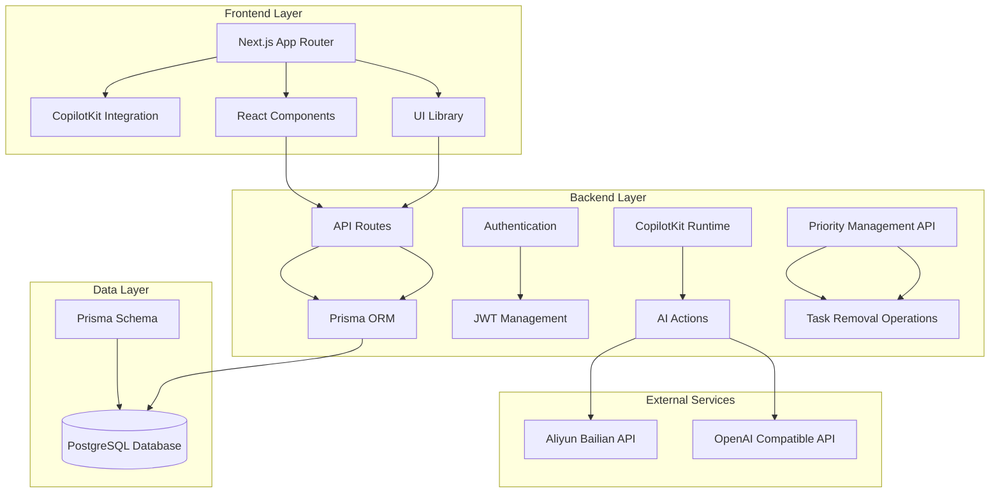
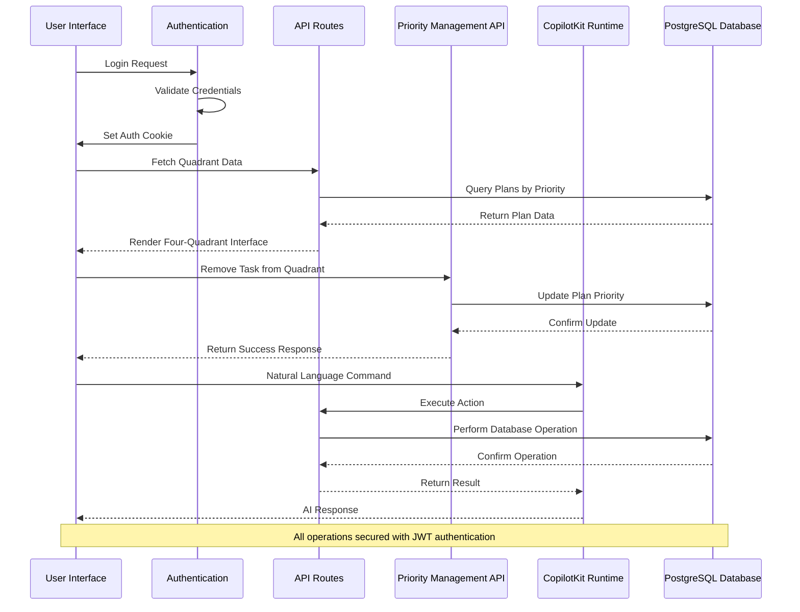
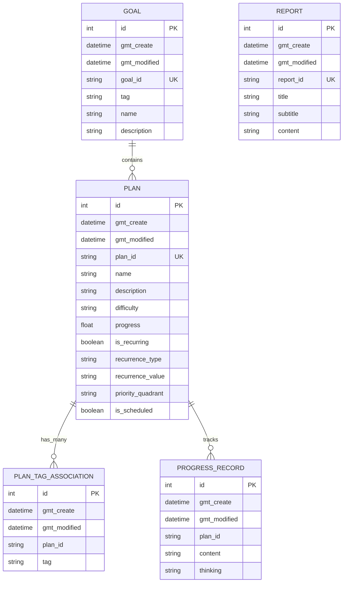
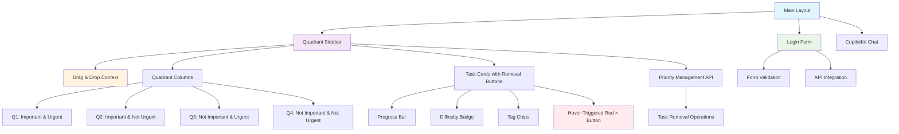
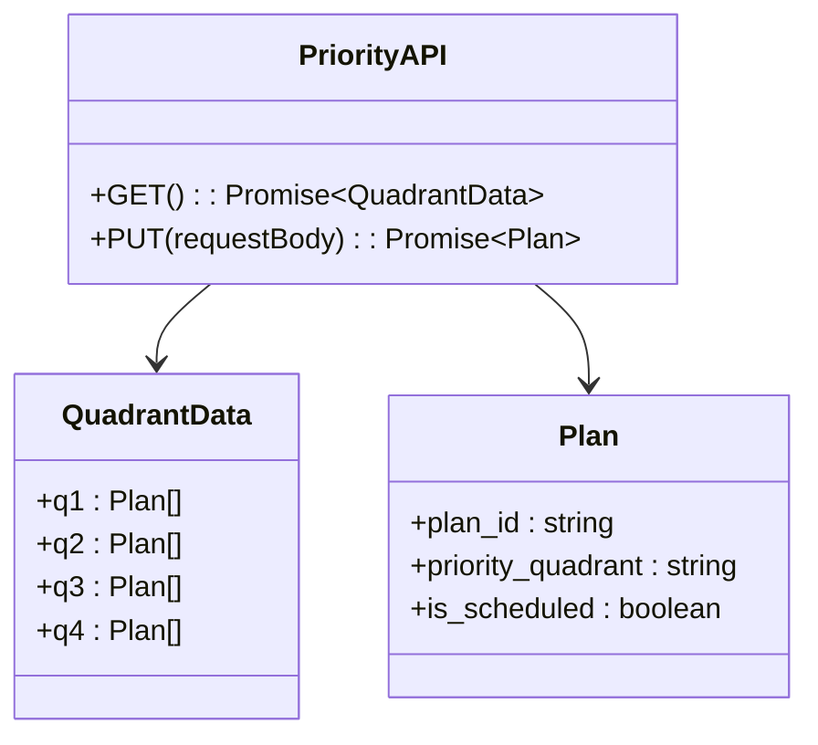

# Quadrant Task Management System

<cite>
**Referenced Files in This Document**
- [README.md](file://README.md)
- [package.json](file://package.json)
- [src/app/layout.tsx](file://src/app/layout.tsx)
- [src/lib/auth.ts](file://src/lib/auth.ts)
- [prisma/schema.prisma](file://prisma/schema.prisma)
- [src/app/api/copilotkit/route.ts](file://src/app/api/copilotkit/route.ts)
- [src/app/api/goal/route.ts](file://src/app/api/goal/route.ts)
- [src/app/api/plan/route.ts](file://src/app/api/plan/route.ts)
- [src/app/api/plan/priority/route.ts](file://src/app/api/plan/priority/route.ts)
- [src/app/api/progress_record/route.ts](file://src/app/api/progress_record/route.ts)
- [src/app/api/report/route.ts](file://src/app/api/report/route.ts)
- [src/app/api/auth/login/route.ts](file://src/app/api/auth/login/route.ts)
- [src/app/api/auth/logout/route.ts](file://src/app/api/auth/logout/route.ts)
- [src/app/api/auth/me/route.ts](file://src/app/api/auth/me/route.ts)
- [src/components/LoginForm.tsx](file://src/components/LoginForm.tsx)
- [src/components/quadrant-sidebar.tsx](file://src/components/quadrant-sidebar.tsx)
- [src/components/quadrant-left-sidebar.tsx](file://src/components/quadrant-left-sidebar.tsx)
- [src/components/task-pool.tsx](file://src/components/task-pool.tsx)
</cite>

## Update Summary
**Changes Made**
- Added comprehensive task removal functionality documentation
- Updated four-quadrant priority management section to include removal features
- Enhanced component architecture analysis with hover-triggered removal buttons
- Added API integration details for task removal operations
- Updated performance considerations to include removal operation optimization

## Table of Contents
1. [Introduction](#introduction)
2. [Project Structure](#project-structure)
3. [Core Components](#core-components)
4. [Architecture Overview](#architecture-overview)
5. [Detailed Component Analysis](#detailed-component-analysis)
6. [Dependency Analysis](#dependency-analysis)
7. [Performance Considerations](#performance-considerations)
8. [Troubleshooting Guide](#troubleshooting-guide)
9. [Conclusion](#conclusion)

## Introduction
Quadrant Task Management System is an AI-powered productivity application built with Next.js that helps users manage goals, plans, and progress through an interactive four-quadrant priority system. The system integrates CopilotKit for natural language AI assistance, enabling users to create goals, define actionable plans, track progress, and receive intelligent recommendations through conversational interactions.

The application provides a comprehensive solution for personal productivity management with features including:
- AI-powered goal and plan creation through natural language
- Interactive four-quadrant priority management system with task removal capabilities
- Progress tracking with reflection capabilities
- Intelligent task recommendations based on user state
- Automated report generation for productivity insights
- Secure authentication with JWT-based session management

**Updated** Enhanced with comprehensive task removal functionality allowing users to remove tasks from the four-quadrant priority matrix via hover-triggered red '×' buttons on task cards.

## Project Structure
The project follows a modern Next.js 15 architecture with a clear separation of concerns across frontend, backend, and data layers.



**Diagram sources**
- [src/app/layout.tsx:16-30](file://src/app/layout.tsx#L16-L30)
- [src/app/api/copilotkit/route.ts:287-367](file://src/app/api/copilotkit/route.ts#L287-L367)
- [src/app/api/plan/priority/route.ts:50-93](file://src/app/api/plan/priority/route.ts#L50-L93)
- [prisma/schema.prisma:16-72](file://prisma/schema.prisma#L16-L72)

**Section sources**
- [README.md:157-175](file://README.md#L157-L175)
- [package.json:16-43](file://package.json#L16-L43)

## Core Components

### Authentication System
The authentication system provides secure user access through JWT-based sessions with httpOnly cookies for enhanced security.

Key features:
- Username/password validation against environment variables
- JWT token generation with 7-day expiration
- HttpOnly cookie storage for secure session management
- Protected routes with automatic user validation

**Section sources**
- [src/lib/auth.ts:14-69](file://src/lib/auth.ts#L14-L69)
- [src/app/api/auth/login/route.ts:5-50](file://src/app/api/auth/login/route.ts#L5-L50)
- [src/app/api/auth/logout/route.ts:4-23](file://src/app/api/auth/logout/route.ts#L4-L23)
- [src/app/api/auth/me/route.ts:4-27](file://src/app/api/auth/me/route.ts#L4-L27)

### AI-Powered CopilotKit Integration
The system integrates CopilotKit with Aliyun Bailian (DeepSeek-R1) to provide natural language interaction capabilities.

Core AI features:
- Intelligent task recommendation based on user state
- Plan creation and management through conversational interface
- Progress tracking with automated analysis
- Web search integration for book and learning resources
- System prompt injection for domain-specific behavior

**Section sources**
- [src/app/api/copilotkit/route.ts:13-237](file://src/app/api/copilotkit/route.ts#L13-L237)
- [src/app/api/copilotkit/route.ts:287-701](file://src/app/api/copilotkit/route.ts#L287-L701)

### Four-Quadrant Priority Management
Interactive drag-and-drop interface for managing tasks across four priority quadrants (Important & Urgent, Important & Not Urgent, etc.) with comprehensive task removal capabilities.

**Updated** Enhanced with hover-triggered red '×' buttons that appear when users hover over task cards, enabling seamless removal operations.

Key features:
- Real-time drag-and-drop task management
- Visual progress indicators
- Difficulty level and tag categorization
- Automatic quadrant assignment and removal
- Hover-triggered removal buttons with conditional rendering
- Responsive design for desktop and mobile
- API integration for seamless removal operations

**Section sources**
- [src/components/quadrant-sidebar.tsx:54-139](file://src/components/quadrant-sidebar.tsx#L54-L139)
- [src/components/quadrant-left-sidebar.tsx:93-165](file://src/components/quadrant-left-sidebar.tsx#L93-L165)
- [src/components/quadrant-sidebar.tsx:270-288](file://src/components/quadrant-sidebar.tsx#L270-L288)
- [src/components/quadrant-left-sidebar.tsx:338-358](file://src/components/quadrant-left-sidebar.tsx#L338-L358)

### Data Management Layer
Comprehensive CRUD operations for goals, plans, progress records, and reports with advanced filtering and pagination, including dedicated priority management endpoints.

**Updated** Added priority management API with separate endpoints for quadrant operations and task removal.

**Section sources**
- [src/app/api/goal/route.ts:7-51](file://src/app/api/goal/route.ts#L7-L51)
- [src/app/api/plan/route.ts:7-114](file://src/app/api/plan/route.ts#L7-L114)
- [src/app/api/plan/priority/route.ts:6-93](file://src/app/api/plan/priority/route.ts#L6-L93)
- [src/app/api/progress_record/route.ts:6-154](file://src/app/api/progress_record/route.ts#L6-L154)
- [src/app/api/report/route.ts:7-48](file://src/app/api/report/route.ts#L7-L48)

## Architecture Overview



**Diagram sources**
- [src/app/layout.tsx:24-26](file://src/app/layout.tsx#L24-L26)
- [src/app/api/auth/login/route.ts:24-35](file://src/app/api/auth/login/route.ts#L24-L35)
- [src/components/quadrant-sidebar.tsx:204-216](file://src/components/quadrant-sidebar.tsx#L204-L216)
- [src/app/api/copilotkit/route.ts:287-367](file://src/app/api/copilotkit/route.ts#L287-L367)
- [src/app/api/plan/priority/route.ts:50-93](file://src/app/api/plan/priority/route.ts#L50-L93)

The architecture follows a clean separation of concerns with clear boundaries between presentation, business logic, and data persistence layers, including dedicated priority management endpoints.

## Detailed Component Analysis

### Database Schema Design
The system uses a normalized relational schema optimized for productivity tracking with clear relationships between entities.



**Diagram sources**
- [prisma/schema.prisma:16-72](file://prisma/schema.prisma#L16-L72)

**Section sources**
- [prisma/schema.prisma:16-72](file://prisma/schema.prisma#L16-L72)

### AI Action System
The CopilotKit runtime defines comprehensive actions for intelligent task management through natural language commands.


**Diagram sources**
- [src/app/api/copilotkit/route.ts:287-701](file://src/app/api/copilotkit/route.ts#L287-L701)

**Section sources**
- [src/app/api/copilotkit/route.ts:287-701](file://src/app/api/copilotkit/route.ts#L287-L701)

### Frontend Component Architecture
The React component system provides a modular, reusable foundation for the user interface with enhanced task removal capabilities.

**Updated** Enhanced with hover-triggered removal buttons and improved conditional rendering for task management operations.



**Diagram sources**
- [src/app/layout.tsx:16-30](file://src/app/layout.tsx#L16-L30)
- [src/components/quadrant-sidebar.tsx:54-139](file://src/components/quadrant-sidebar.tsx#L54-L139)
- [src/components/quadrant-left-sidebar.tsx:93-165](file://src/components/quadrant-left-sidebar.tsx#L93-L165)
- [src/components/LoginForm.tsx:6-98](file://src/components/LoginForm.tsx#L6-L98)

**Section sources**
- [src/components/quadrant-sidebar.tsx:54-139](file://src/components/quadrant-sidebar.tsx#L54-L139)
- [src/components/quadrant-left-sidebar.tsx:93-165](file://src/components/quadrant-left-sidebar.tsx#L93-L165)
- [src/components/LoginForm.tsx:6-98](file://src/components/LoginForm.tsx#L6-L98)

### Priority Management API
Dedicated API endpoints for managing task priorities and removal operations within the four-quadrant system.

**New Section** Added comprehensive documentation for the priority management API that handles task removal operations.



**Diagram sources**
- [src/app/api/plan/priority/route.ts:6-93](file://src/app/api/plan/priority/route.ts#L6-L93)

**Section sources**
- [src/app/api/plan/priority/route.ts:6-93](file://src/app/api/plan/priority/route.ts#L6-L93)

## Dependency Analysis

```mermaid
graph LR
subgraph "Core Dependencies"
A[next] --> B[React 19]
C[prisma] --> D[@prisma/client]
E[jsonwebtoken] --> F[JWT]
G[bcryptjs] --> H[Password Hashing]
end
subgraph "AI Integration"
I[@copilotkit/react-core] --> J[AI Runtime]
K[openai] --> L[OpenAI SDK]
M[aliyun bailian] --> N[Compatible API]
end
subgraph "UI Components"
O[radix-ui] --> P[Accessible UI]
Q[shadcn/ui] --> R[Styling]
S[lucide-react] --> T[Ionic Icons]
end
subgraph "Drag & Drop"
U[@dnd-kit/core] --> V[Core Drag & Drop]
W[@dnd-kit/sortable] --> X[Sortable Context]
Y[@dnd-kit/utilities] --> Z[Utilities]
end
subgraph "Priority Management"
AA[/api/plan/priority] --> BB[Task Removal API]
CC[Conditional Rendering] --> DD[Hover State Tracking]
end
A --> I
C --> E
K --> M
O --> Q
U --> W
AA --> CC
BB --> DD
```

**Diagram sources**
- [package.json:16-43](file://package.json#L16-L43)
- [src/app/api/plan/priority/route.ts:50-93](file://src/app/api/plan/priority/route.ts#L50-L93)

**Section sources**
- [package.json:16-43](file://package.json#L16-L43)

## Performance Considerations
- **Database Optimization**: Prisma client generation and PostgreSQL indexing for frequently queried fields like `priority_quadrant`, `is_scheduled`, and `gmt_create`
- **API Response Optimization**: Parallel database queries for count and data retrieval in list endpoints
- **Frontend Performance**: React component memoization and efficient state updates in drag-and-drop operations, including optimized hover state tracking for removal buttons
- **AI Response Optimization**: Tool call sequence repair and message cleaning to reduce API errors and retries
- **Caching Strategy**: Consider implementing Redis caching for frequently accessed quadrant data and user preferences
- **Task Removal Optimization**: Efficient API calls for removal operations with immediate UI updates and database synchronization

**Updated** Enhanced performance considerations to include hover state tracking optimization and efficient removal operation handling.

## Troubleshooting Guide

### Authentication Issues
Common problems and solutions:
- **Login failures**: Verify environment variables AUTH_USERNAME and AUTH_PASSWORD are correctly configured
- **Token validation errors**: Check AUTH_SECRET length (minimum 32 characters) and server time synchronization
- **Cookie issues**: Ensure httpOnly and secure flags are properly configured for production environments

### AI Integration Problems
- **API key configuration**: Verify OPENAI_API_KEY and OPENAI_BASE_URL environment variables
- **Model compatibility**: Ensure compatible model selection for Aliyun Bailian integration
- **Rate limiting**: Monitor API usage limits and implement retry logic for transient failures

### Database Connection Issues
- **Connection pooling**: Configure appropriate connection limits and timeout settings
- **Schema synchronization**: Use Prisma migrations for schema updates and data integrity
- **Performance monitoring**: Implement query performance monitoring and optimize slow queries

### Task Removal Issues
**New Section** Added troubleshooting guidance for task removal functionality.

- **Removal button not appearing**: Verify hover state tracking is functioning correctly and mouse events are properly handled
- **Removal API failures**: Check `/api/plan/priority` endpoint accessibility and database connectivity
- **UI not updating after removal**: Ensure proper state management and component re-rendering after successful removal operations
- **Drag-and-drop conflicts**: Verify that removal button clicks properly stop propagation to prevent drag events from interfering

**Section sources**
- [src/lib/auth.ts:5-11](file://src/lib/auth.ts#L5-L11)
- [src/app/api/copilotkit/route.ts:72-86](file://src/app/api/copilotkit/route.ts#L72-L86)
- [prisma/schema.prisma:11-14](file://prisma/schema.prisma#L11-L14)
- [src/app/api/plan/priority/route.ts:50-93](file://src/app/api/plan/priority/route.ts#L50-L93)

## Conclusion
The Quadrant Task Management System provides a comprehensive solution for AI-powered productivity management. Its modular architecture, robust authentication system, and intelligent AI integration create a powerful platform for personal goal achievement. The four-quadrant priority system combined with natural language processing enables users to efficiently organize and track their tasks while receiving intelligent recommendations and insights.

**Updated** Enhanced with comprehensive task removal functionality that provides users with seamless control over their task management experience through hover-triggered removal buttons and API integration.

Key strengths of the system include:
- Seamless AI integration through CopilotKit
- Intuitive drag-and-drop interface for task management with hover-triggered removal capabilities
- Comprehensive data modeling for productivity tracking with dedicated priority management endpoints
- Secure authentication with JWT-based session management
- Scalable architecture supporting future feature expansion
- Real-time task removal operations with immediate UI feedback

The system is well-positioned for deployment and can be extended with additional AI capabilities, reporting features, and integrations as the user base grows. The addition of task removal functionality significantly enhances user experience by providing granular control over task management within the four-quadrant priority system.