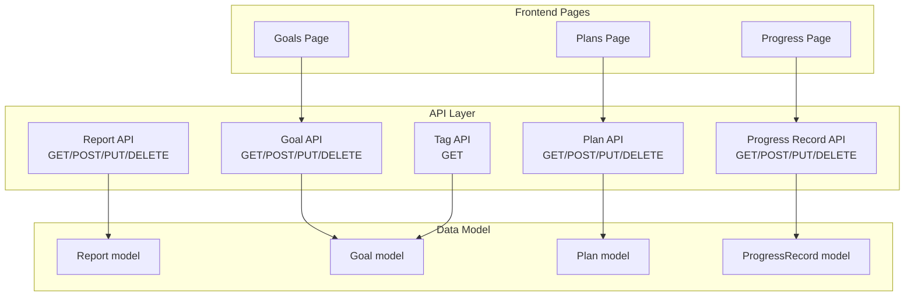
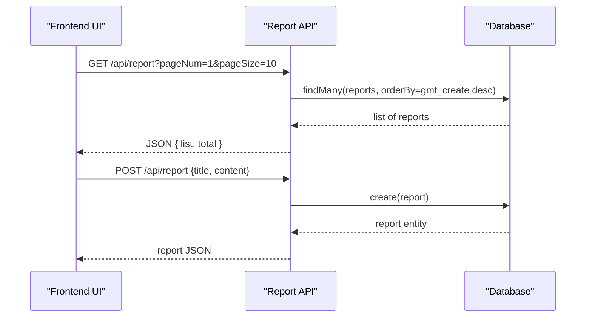
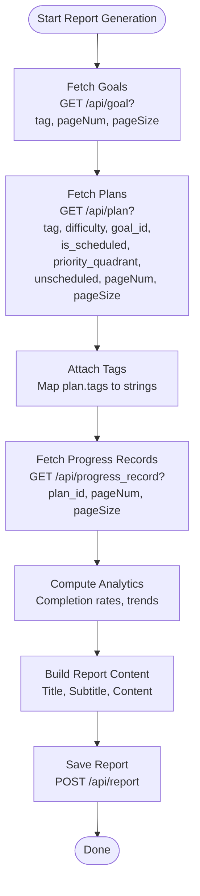
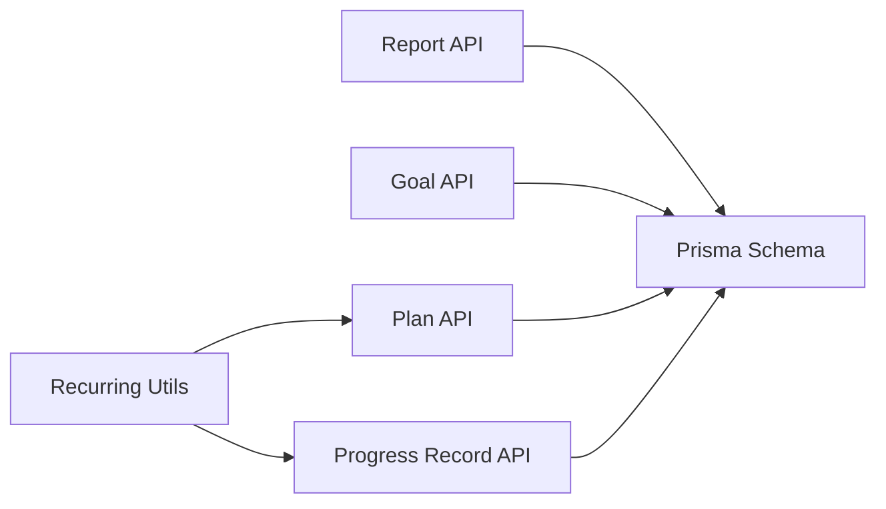

# Report Generation System

<cite>
**Referenced Files in This Document**
- [route.ts](file://src/app/api/report/route.ts)
- [schema.prisma](file://prisma/schema.prisma)
- [route.ts](file://src/app/api/goal/route.ts)
- [route.ts](file://src/app/api/plan/route.ts)
- [route.ts](file://src/app/api/progress_record/route.ts)
- [page.tsx](file://src/app/goals/page.tsx)
- [page.tsx](file://src/app/plans/page.tsx)
- [page.tsx](file://src/app/progress/page.tsx)
- [recurring-utils.ts](file://src/lib/recurring-utils.ts)
- [route.ts](file://src/app/api/tag/route.ts)
- [route.ts](file://src/app/api/copilotkit/route.ts)
</cite>

## Table of Contents
1. [Introduction](#introduction)
2. [Project Structure](#project-structure)
3. [Core Components](#core-components)
4. [Architecture Overview](#architecture-overview)
5. [Detailed Component Analysis](#detailed-component-analysis)
6. [Dependency Analysis](#dependency-analysis)
7. [Performance Considerations](#performance-considerations)
8. [Troubleshooting Guide](#troubleshooting-guide)
9. [Conclusion](#conclusion)

## Introduction
This document describes the Report Generation System feature, focusing on the automated workflow that aggregates data from goals, plans, and progress records to produce structured reports. It documents the report API endpoints, filtering and pagination capabilities, template and customization options, analytics derived from the stored data, and practical guidance for scheduling, integration, and troubleshooting.

## Project Structure
The report system is built around a small set of API endpoints and supporting data models:
- Report API: CRUD operations for report entities
- Data sources: Goals, Plans, and Progress Records
- Utilities: Recurring task helpers for analytics
- Frontend pages: Goals, Plans, and Progress pages that consume these APIs

**Diagram sources**
- [route.ts:1-48](file://src/app/api/report/route.ts#L1-L48)
- [route.ts:1-51](file://src/app/api/goal/route.ts#L1-L51)
- [route.ts:1-114](file://src/app/api/plan/route.ts#L1-L114)
- [route.ts:1-154](file://src/app/api/progress_record/route.ts#L1-L154)
- [schema.prisma:16-71](file://prisma/schema.prisma#L16-L71)
- [page.tsx:1-314](file://src/app/goals/page.tsx#L1-L314)
- [page.tsx:1-807](file://src/app/plans/page.tsx#L1-L807)
- [page.tsx:1-570](file://src/app/progress/page.tsx#L1-L570)

**Section sources**
- [route.ts:1-48](file://src/app/api/report/route.ts#L1-L48)
- [schema.prisma:16-71](file://prisma/schema.prisma#L16-L71)

## Core Components
- Report API: Provides list, create, update, and delete operations for report entities. Pagination is supported via pageNum and pageSize query parameters.
- Data aggregation sources:
  - Goals: Tag-based grouping and filtering
  - Plans: Rich filtering (difficulty, goal_id, scheduled state, priority quadrant, tags), plus progress records inclusion
  - Progress Records: Per-plan records with optional custom timestamps
- Analytics utilities: Recurring task helpers compute completion counts, targets, and completion rates for periodic tasks

Key capabilities:
- Aggregation pipeline: Retrieve goals, join with plans (by tag or goal_id), and attach progress records
- Filtering: By tag, difficulty, goal_id, scheduled state, priority quadrant, and plan_id
- Pagination: Consistent pageNum/pageSize across endpoints
- Analytics: Completion rates, trend-like counts per period for recurring tasks

**Section sources**
- [route.ts:7-21](file://src/app/api/report/route.ts#L7-L21)
- [route.ts:7-24](file://src/app/api/goal/route.ts#L7-L24)
- [route.ts:7-67](file://src/app/api/plan/route.ts#L7-L67)
- [route.ts:6-23](file://src/app/api/progress_record/route.ts#L6-L23)
- [recurring-utils.ts:73-86](file://src/lib/recurring-utils.ts#L73-L86)

## Architecture Overview
The report generation workflow integrates frontend pages with backend APIs and the database schema. The frontend pages fetch data from the APIs, and the report API stores report metadata. Analytics are computed from plan progress records and recurring task utilities.

**Diagram sources**
- [route.ts:8-27](file://src/app/api/report/route.ts#L8-L27)

## Detailed Component Analysis

### Report API Endpoints
- GET /api/report
  - Purpose: List reports with pagination
  - Query parameters: pageNum (default 1), pageSize (default 10)
  - Response: { list: Report[], total: number }
- POST /api/report
  - Purpose: Create a new report
  - Request body: Report fields excluding report_id
  - Response: Created Report
- PUT /api/report
  - Purpose: Update an existing report
  - Request body: { report_id, ...fields }
  - Response: Updated Report
- DELETE /api/report?report_id=...
  - Purpose: Delete a report
  - Query parameter: report_id (required)
  - Response: { success: boolean }

Filtering and date range selection:
- The report endpoint does not currently support filtering by date range or advanced filters. To implement date-range filtering, extend the GET handler to accept date parameters and add where conditions against gmt_create.

Export format support:
- The current report endpoint returns JSON. To add export formats (PDF, CSV), introduce a format parameter and implement serialization logic in the GET handler.

**Section sources**
- [route.ts:7-48](file://src/app/api/report/route.ts#L7-L48)

### Data Aggregation Workflow
The report system aggregates data from three sources: goals, plans, and progress records. The frontend pages demonstrate how these endpoints are consumed.

**Diagram sources**
- [route.ts:7-24](file://src/app/api/goal/route.ts#L7-L24)
- [route.ts:7-67](file://src/app/api/plan/route.ts#L7-L67)
- [route.ts:6-23](file://src/app/api/progress_record/route.ts#L6-L23)
- [recurring-utils.ts:73-86](file://src/lib/recurring-utils.ts#L73-L86)

**Section sources**
- [page.tsx:38-57](file://src/app/goals/page.tsx#L38-L57)
- [page.tsx:141-163](file://src/app/plans/page.tsx#L141-L163)
- [page.tsx:52-95](file://src/app/progress/page.tsx#L52-L95)

### Analytics and Metrics
- Completion rates:
  - For normal plans: progress percentage (0–1)
  - For recurring plans: current count vs target count within the current period (daily/weekly/monthly)
- Trend analysis:
  - Count of progress records per period for recurring tasks
  - Rolling counts over recent periods
- Performance metrics:
  - Average completion rate per goal or per tag
  - Total progress records count and recency

These analytics leverage:
- Plan progress fields and progress records
- Recurring task utilities for period boundaries and counts

**Section sources**
- [recurring-utils.ts:152-186](file://src/lib/recurring-utils.ts#L152-L186)
- [schema.prisma:26-42](file://prisma/schema.prisma#L26-L42)

### Report Templates and Customization
- Current report model supports title and subtitle with optional content. Extend the model and API to support:
  - Template identifiers
  - Stakeholder-specific fields (audience, executive summary)
  - Export formats (PDF, CSV) via a format parameter
- Frontend pages demonstrate consumption patterns that can be adapted to drive report generation UI.

**Section sources**
- [schema.prisma:63-71](file://prisma/schema.prisma#L63-L71)
- [route.ts:24-27](file://src/app/api/report/route.ts#L24-L27)

### Automated Scheduling and External Integrations
- Scheduling:
  - Use the report API to create scheduled reports by invoking the POST endpoint at desired intervals
  - Combine with cron jobs or task schedulers to automate generation
- External integrations:
  - CopilotKit integration demonstrates intelligent parsing and record creation, which can be extended to generate summaries for reports
  - The analyzeAndRecordProgress action can be adapted to produce structured insights suitable for report content

**Section sources**
- [route.ts:1195-1450](file://src/app/api/copilotkit/route.ts#L1195-L1450)

## Dependency Analysis
The report system depends on:
- API endpoints for data retrieval and persistence
- Database schema for storing goals, plans, progress records, and reports
- Utilities for recurring task analytics

**Diagram sources**
- [schema.prisma:16-71](file://prisma/schema.prisma#L16-L71)
- [route.ts:1-48](file://src/app/api/report/route.ts#L1-L48)
- [route.ts:1-51](file://src/app/api/goal/route.ts#L1-L51)
- [route.ts:1-114](file://src/app/api/plan/route.ts#L1-L114)
- [route.ts:1-154](file://src/app/api/progress_record/route.ts#L1-L154)
- [recurring-utils.ts:1-218](file://src/lib/recurring-utils.ts#L1-L218)

**Section sources**
- [schema.prisma:16-71](file://prisma/schema.prisma#L16-L71)

## Performance Considerations
- Pagination: Use pageNum and pageSize consistently across endpoints to avoid large payloads
- Filtering: Apply filters early (goal_id, plan_id) to reduce dataset sizes
- Indexes: Ensure database indexes exist on frequently queried fields (gmt_create, plan_id, goal_id, tag)
- Batch operations: When generating reports for many plans, batch requests and cache intermediate results
- Analytics scaling: For recurring tasks, compute counts per period server-side to avoid heavy client-side computations

## Troubleshooting Guide
Common issues and resolutions:
- Missing report_id on delete:
  - Symptom: 400 response when deleting a report
  - Resolution: Ensure report_id is provided as a query parameter
- Progress record creation/update failures:
  - Symptom: 500 response during creation or update
  - Resolution: Validate custom_time format and presence of required fields
- Inconsistent analytics for recurring tasks:
  - Symptom: Unexpected completion rates
  - Resolution: Verify period boundaries and target counts; confirm progress records fall within the current period
- Frontend pagination inconsistencies:
  - Symptom: Incorrect total or empty lists
  - Resolution: Ensure pageNum and pageSize are integers and total is recalculated after filtering

**Section sources**
- [route.ts:42-47](file://src/app/api/report/route.ts#L42-L47)
- [route.ts:25-70](file://src/app/api/progress_record/route.ts#L25-L70)
- [recurring-utils.ts:73-86](file://src/lib/recurring-utils.ts#L73-L86)
- [page.tsx:141-163](file://src/app/plans/page.tsx#L141-L163)

## Conclusion
The Report Generation System provides a foundation for automated report creation by aggregating goals, plans, and progress records. The current API supports basic CRUD operations for reports and robust data retrieval for analytics. Extending the report API with date-range filtering, export formats, and richer templates will enable comprehensive reporting for diverse stakeholder needs. Integrations with intelligent parsing and scheduling can further automate report generation and distribution.