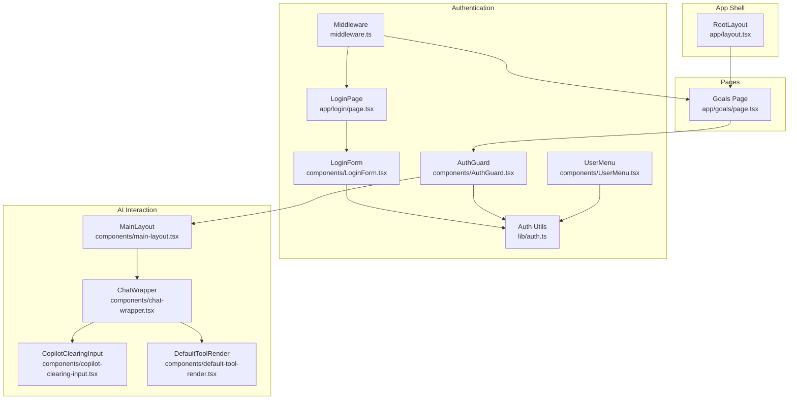
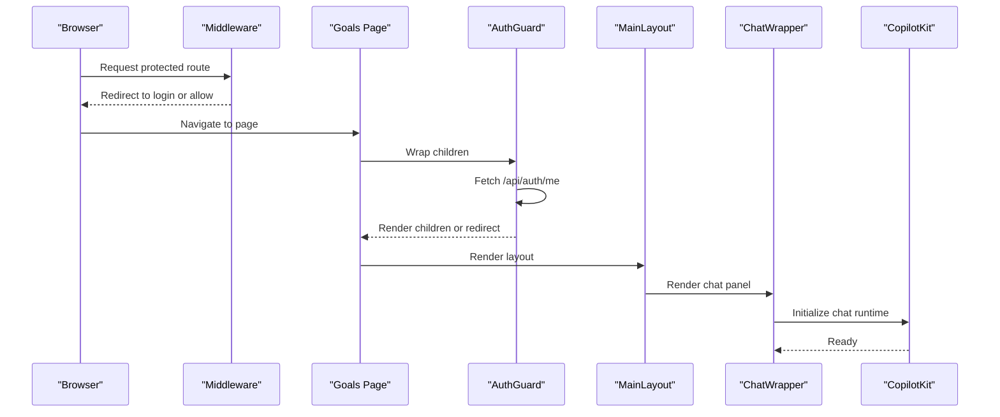
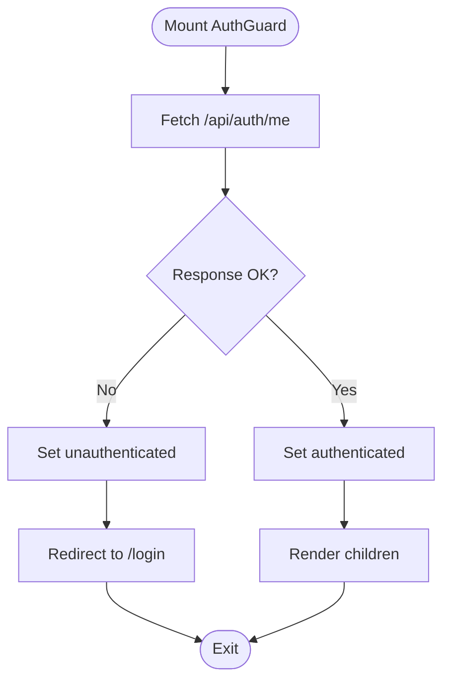
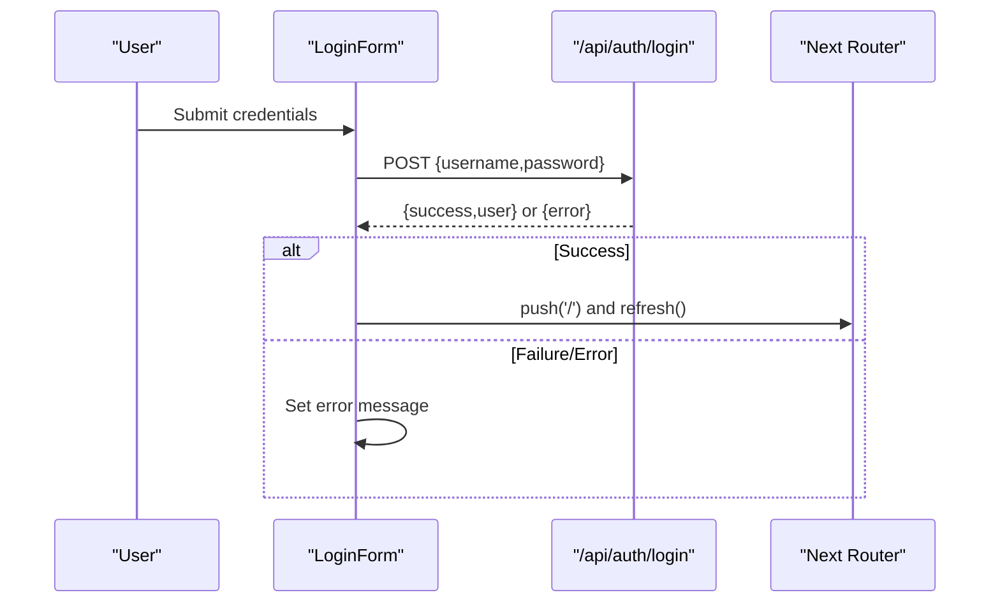
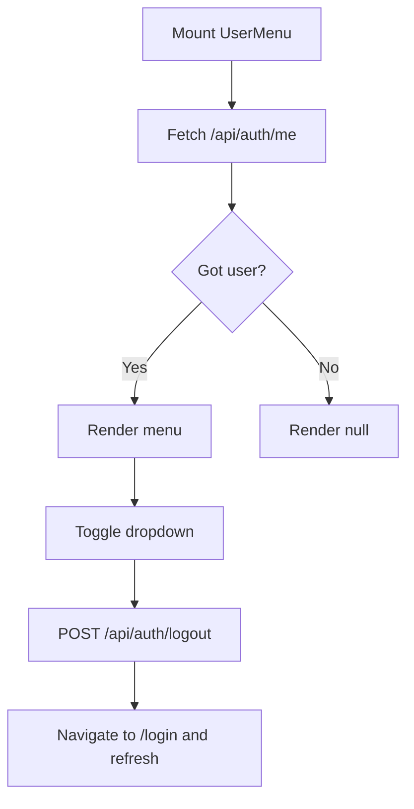
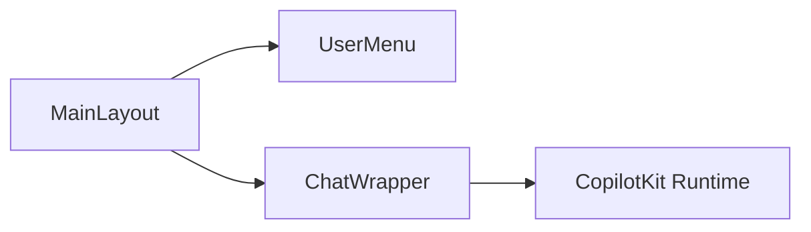
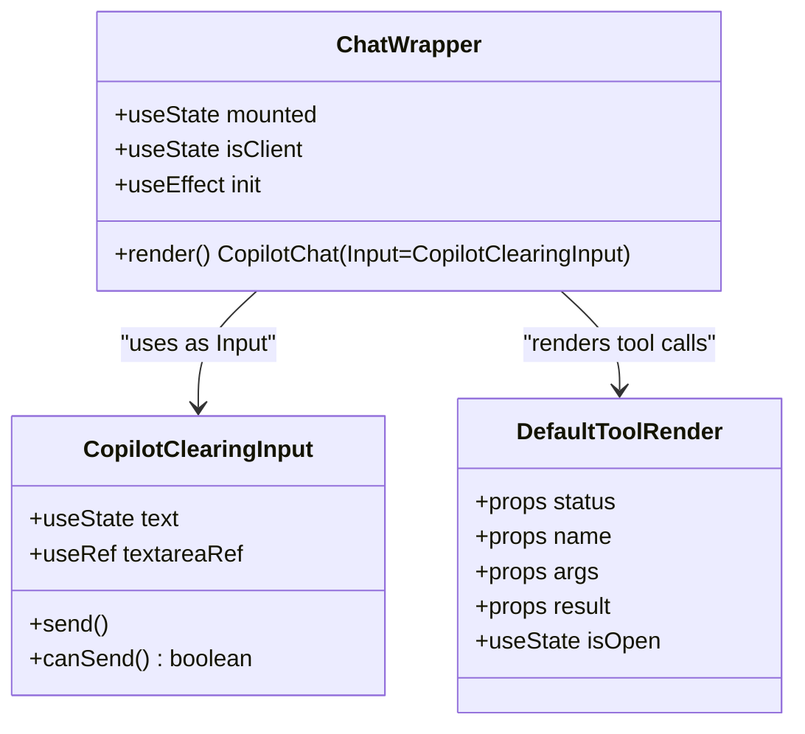
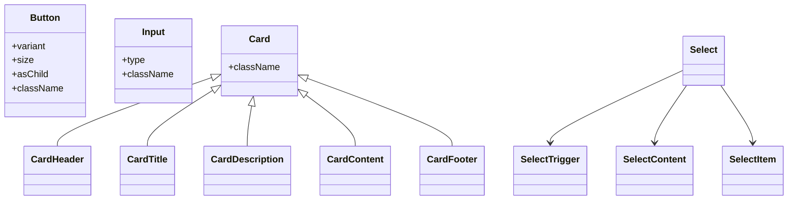
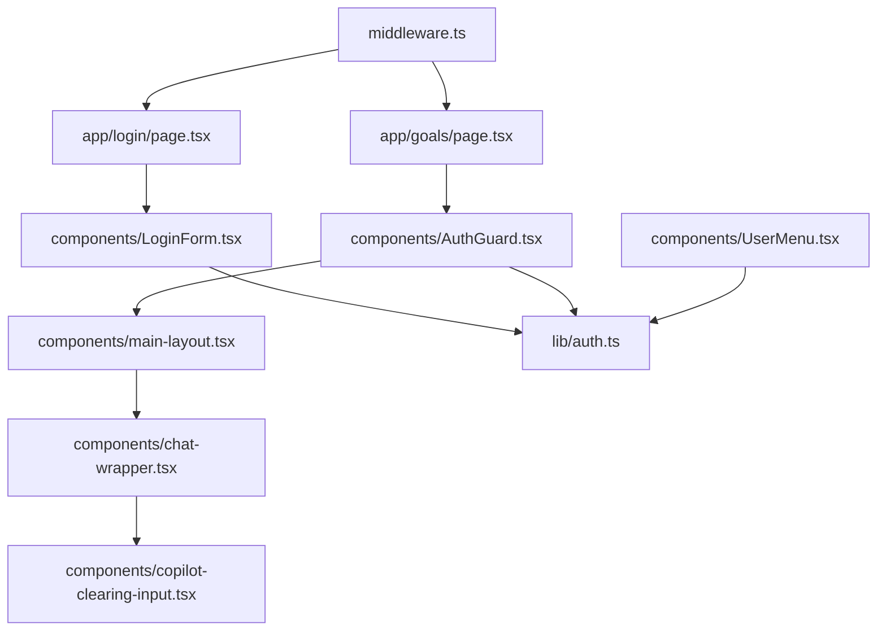

# Component Hierarchy

<cite>
**Referenced Files in This Document**
- [AuthGuard.tsx](file://src/components/AuthGuard.tsx)
- [LoginForm.tsx](file://src/components/LoginForm.tsx)
- [UserMenu.tsx](file://src/components/UserMenu.tsx)
- [main-layout.tsx](file://src/components/main-layout.tsx)
- [chat-wrapper.tsx](file://src/components/chat-wrapper.tsx)
- [copilot-clearing-input.tsx](file://src/components/copilot-clearing-input.tsx)
- [default-tool-render.tsx](file://src/components/default-tool-render.tsx)
- [button.tsx](file://src/components/ui/button.tsx)
- [input.tsx](file://src/components/ui/input.tsx)
- [card.tsx](file://src/components/ui/card.tsx)
- [select.tsx](file://src/components/ui/select.tsx)
- [layout.tsx](file://src/app/layout.tsx)
- [middleware.ts](file://middleware.ts)
- [login/page.tsx](file://src/app/login/page.tsx)
- [goals/page.tsx](file://src/app/goals/page.tsx)
- [auth.ts](file://src/lib/auth.ts)
- [login/route.ts](file://src/app/api/auth/login/route.ts)
- [me/route.ts](file://src/app/api/auth/me/route.ts)
</cite>

## Table of Contents
1. [Introduction](#introduction)
2. [Project Structure](#project-structure)
3. [Core Components](#core-components)
4. [Architecture Overview](#architecture-overview)
5. [Detailed Component Analysis](#detailed-component-analysis)
6. [Dependency Analysis](#dependency-analysis)
7. [Performance Considerations](#performance-considerations)
8. [Troubleshooting Guide](#troubleshooting-guide)
9. [Conclusion](#conclusion)
10. [Appendices](#appendices)

## Introduction
This document focuses on the component hierarchy and composition patterns in the application. It explains how authentication guards, form components, navigation-related UI, and AI interaction components are organized, composed, and integrated. It covers prop interfaces, state management patterns, lifecycle considerations, and the relationship between server components and client components. Practical examples, testing strategies, performance tips, debugging techniques, and development best practices are included to guide maintainable component architecture.

## Project Structure
The component system is organized around:
- UI primitives under src/components/ui (reusable base components)
- Feature-level components under src/components (composition roots and domain components)
- Pages under src/app (Next.js app directory pages that orchestrate server/client behavior)
- Authentication utilities under src/lib (shared auth logic)

**Diagram sources**
- [layout.tsx:16-30](file://src/app/layout.tsx#L16-L30)
- [middleware.ts:1-40](file://middleware.ts#L1-L40)
- [login/page.tsx:5-12](file://src/app/login/page.tsx#L5-L12)
- [LoginForm.tsx:6-98](file://src/components/LoginForm.tsx#L6-L98)
- [AuthGuard.tsx:10-53](file://src/components/AuthGuard.tsx#L10-L53)
- [UserMenu.tsx:10-104](file://src/components/UserMenu.tsx#L10-L104)
- [auth.ts:49-69](file://src/lib/auth.ts#L49-L69)
- [goals/page.tsx:25-314](file://src/app/goals/page.tsx#L25-L314)
- [main-layout.tsx:11-63](file://src/components/main-layout.tsx#L11-L63)
- [chat-wrapper.tsx:7-709](file://src/components/chat-wrapper.tsx#L7-L709)
- [copilot-clearing-input.tsx:84-175](file://src/components/copilot-clearing-input.tsx#L84-L175)
- [default-tool-render.tsx:12-104](file://src/components/default-tool-render.tsx#L12-L104)

**Section sources**
- [layout.tsx:16-30](file://src/app/layout.tsx#L16-L30)
- [middleware.ts:1-40](file://middleware.ts#L1-L40)
- [login/page.tsx:5-12](file://src/app/login/page.tsx#L5-L12)
- [goals/page.tsx:25-314](file://src/app/goals/page.tsx#L25-L314)

## Core Components
This section documents the primary building blocks and their roles in the hierarchy.

- Authentication Guard
  - Purpose: Protects routes by checking session state and redirecting unauthenticated users.
  - Props: children (ReactNode)
  - State: isAuthenticated (boolean|null), loading spinner while resolving
  - Lifecycle: On mount, performs a one-time auth check via /api/auth/me; redirects to login if unauthorized.
  - Composition: Wraps page-level components that require protection.

- Login Form
  - Purpose: Handles user credentials submission and redirects on success.
  - Props: None
  - State: username, password, isLoading, error
  - Lifecycle: Submits to /api/auth/login; on success, navigates to home and refreshes.

- User Menu
  - Purpose: Displays current user initials and logout action.
  - Props: None
  - State: user (object|null), isOpen (boolean), click-outside detection via ref
  - Lifecycle: Fetches user on mount; handles logout via POST /api/auth/logout.

- Main Layout
  - Purpose: Provides responsive shell with main content area and AI assistant panel.
  - Props: children (ReactNode)
  - Composition: Renders UserMenu and ChatWrapper inside a sticky/right-side panel on larger screens.

- Chat Wrapper
  - Purpose: Hosts CopilotKit chat with hydration-safe initialization and robust markdown rendering fixes.
  - Props: None
  - State: mounted, isClient, dynamic styles injected
  - Lifecycle: Defers rendering until client-side; applies MutationObserver and periodic fixes to prevent hydration mismatches.

- Copilot Clearing Input
  - Purpose: Enhanced input with auto-resize, reliable clearing after send, and controlled send conditions.
  - Props: inProgress, onSend, onStop, onUpload (from CopilotKit InputProps)
  - State: text, textareaRef, showPoweredBy
  - Lifecycle: Uses flushSync to immediately clear input after send; manages focus and height.

- Default Tool Render
  - Purpose: Visualizes tool call status, name, args, and result with expandable details.
  - Props: status ("complete" | "inProgress" | "executing"), name, args, result
  - State: isOpen (boolean)
  - Rendering: Conditional sections for name, args, and result; animated status indicator.

- UI Primitives
  - Button: Variants and sizes via class variance authority; supports slot semantics.
  - Input: Styled base input with focus/invalid states.
  - Card: Semantic card parts (header, title, description, content, footer).
  - Select: Radix-based select with trigger/content/items and scroll controls.

**Section sources**
- [AuthGuard.tsx:6-53](file://src/components/AuthGuard.tsx#L6-L53)
- [LoginForm.tsx:6-98](file://src/components/LoginForm.tsx#L6-L98)
- [UserMenu.tsx:6-104](file://src/components/UserMenu.tsx#L6-L104)
- [main-layout.tsx:7-63](file://src/components/main-layout.tsx#L7-L63)
- [chat-wrapper.tsx:7-709](file://src/components/chat-wrapper.tsx#L7-L709)
- [copilot-clearing-input.tsx:84-175](file://src/components/copilot-clearing-input.tsx#L84-L175)
- [default-tool-render.tsx:5-104](file://src/components/default-tool-render.tsx#L5-L104)
- [button.tsx:7-60](file://src/components/ui/button.tsx#L7-L60)
- [input.tsx:5-22](file://src/components/ui/input.tsx#L5-L22)
- [card.tsx:5-93](file://src/components/ui/card.tsx#L5-L93)
- [select.tsx:9-186](file://src/components/ui/select.tsx#L9-L186)

## Architecture Overview
The system follows a layered composition model:
- Server components (pages) manage routing, SSR checks, and initial data fetching.
- Client components handle interactivity, state, and UI composition.
- Shared utilities (auth) encapsulate cross-cutting concerns.
- AI chat is integrated at the app shell level and composed into layouts.

**Diagram sources**
- [middleware.ts:3-35](file://middleware.ts#L3-L35)
- [goals/page.tsx:94-311](file://src/app/goals/page.tsx#L94-L311)
- [AuthGuard.tsx:14-32](file://src/components/AuthGuard.tsx#L14-L32)
- [main-layout.tsx:11-63](file://src/components/main-layout.tsx#L11-L63)
- [chat-wrapper.tsx:698-706](file://src/components/chat-wrapper.tsx#L698-L706)
- [layout.tsx:24-26](file://src/app/layout.tsx#L24-L26)

## Detailed Component Analysis

### Authentication Guard
- Purpose: Enforce authentication at the route level.
- Props: children (ReactNode)
- State: isAuthenticated (boolean|null), loading state during auth check.
- Lifecycle: One-time effect on mount; redirects to /login if not authenticated.
- Integration: Used by page components to protect content.

**Diagram sources**
- [AuthGuard.tsx:14-32](file://src/components/AuthGuard.tsx#L14-L32)
- [me/route.ts:4-27](file://src/app/api/auth/me/route.ts#L4-L27)

**Section sources**
- [AuthGuard.tsx:6-53](file://src/components/AuthGuard.tsx#L6-L53)
- [me/route.ts:4-27](file://src/app/api/auth/me/route.ts#L4-L27)

### Login Form
- Purpose: Authenticate user and persist session cookie.
- Props: None
- State: username, password, isLoading, error.
- Lifecycle: Submits credentials to /api/auth/login; on success, navigates to home.

**Diagram sources**
- [LoginForm.tsx:13-40](file://src/components/LoginForm.tsx#L13-L40)
- [login/route.ts:5-50](file://src/app/api/auth/login/route.ts#L5-L50)

**Section sources**
- [LoginForm.tsx:6-98](file://src/components/LoginForm.tsx#L6-L98)
- [login/route.ts:5-50](file://src/app/api/auth/login/route.ts#L5-L50)

### User Menu
- Purpose: Show current user and provide logout.
- Props: None
- State: user, isOpen, click-outside detection.
- Lifecycle: Fetches user on mount; handles logout via POST /api/auth/logout.

**Diagram sources**
- [UserMenu.tsx:16-61](file://src/components/UserMenu.tsx#L16-L61)
- [me/route.ts:4-27](file://src/app/api/auth/me/route.ts#L4-L27)

**Section sources**
- [UserMenu.tsx:6-104](file://src/components/UserMenu.tsx#L6-L104)
- [me/route.ts:4-27](file://src/app/api/auth/me/route.ts#L4-L27)

### Main Layout and AI Assistant Panel
- Purpose: Provide a responsive shell with a fixed AI assistant panel on larger screens and a bottom sheet on small screens.
- Props: children (ReactNode)
- Composition: Renders UserMenu and ChatWrapper; ChatWrapper initializes CopilotKit chat.

**Diagram sources**
- [main-layout.tsx:11-63](file://src/components/main-layout.tsx#L11-L63)
- [UserMenu.tsx:10-104](file://src/components/UserMenu.tsx#L10-L104)
- [chat-wrapper.tsx:698-706](file://src/components/chat-wrapper.tsx#L698-L706)
- [layout.tsx:24-26](file://src/app/layout.tsx#L24-L26)

**Section sources**
- [main-layout.tsx:7-63](file://src/components/main-layout.tsx#L7-L63)
- [layout.tsx:16-30](file://src/app/layout.tsx#L16-L30)

### AI Chat Wrapper and Input
- Purpose: Provide a robust chat experience with hydration-safe initialization and enhanced input behavior.
- Props: None (uses CopilotKit-provided props via composition)
- State: mounted, isClient, dynamic styles and observers for markdown rendering.
- Composition: Uses CopilotClearingInput as Input; integrates DefaultToolRender for tool call visualization.

**Diagram sources**
- [chat-wrapper.tsx:7-709](file://src/components/chat-wrapper.tsx#L7-L709)
- [copilot-clearing-input.tsx:84-175](file://src/components/copilot-clearing-input.tsx#L84-L175)
- [default-tool-render.tsx:12-104](file://src/components/default-tool-render.tsx#L12-L104)

**Section sources**
- [chat-wrapper.tsx:7-709](file://src/components/chat-wrapper.tsx#L7-L709)
- [copilot-clearing-input.tsx:84-175](file://src/components/copilot-clearing-input.tsx#L84-L175)
- [default-tool-render.tsx:5-104](file://src/components/default-tool-render.tsx#L5-L104)

### UI Primitive Components
- Button: Variants and sizes via class variance authority; supports slot semantics.
- Input: Styled base input with focus/invalid states.
- Card: Semantic card parts (header, title, description, content, footer).
- Select: Radix-based select with trigger/content/items and scroll controls.

**Diagram sources**
- [button.tsx:38-60](file://src/components/ui/button.tsx#L38-L60)
- [input.tsx:5-22](file://src/components/ui/input.tsx#L5-L22)
- [card.tsx:5-93](file://src/components/ui/card.tsx#L5-L93)
- [select.tsx:9-186](file://src/components/ui/select.tsx#L9-L186)

**Section sources**
- [button.tsx:7-60](file://src/components/ui/button.tsx#L7-L60)
- [input.tsx:5-22](file://src/components/ui/input.tsx#L5-L22)
- [card.tsx:5-93](file://src/components/ui/card.tsx#L5-L93)
- [select.tsx:9-186](file://src/components/ui/select.tsx#L9-L186)

## Dependency Analysis
- Server vs Client components:
  - Server components (e.g., app/login/page.tsx, app/goals/page.tsx) run on the server and can perform SSR checks and redirects.
  - Client components (e.g., LoginForm, AuthGuard, UserMenu, ChatWrapper) require "use client" and run on the client.
- Authentication boundary:
  - Middleware protects routes by checking cookies and redirecting or returning 401 for API routes.
  - Client-side AuthGuard performs a final check against /api/auth/me and redirects if needed.
- AI integration:
  - RootLayout wraps children with CopilotKit runtime; ChatWrapper composes CopilotKit UI components.

**Diagram sources**
- [middleware.ts:3-35](file://middleware.ts#L3-L35)
- [login/page.tsx:5-12](file://src/app/login/page.tsx#L5-L12)
- [goals/page.tsx:94-311](file://src/app/goals/page.tsx#L94-L311)
- [LoginForm.tsx:6-98](file://src/components/LoginForm.tsx#L6-L98)
- [AuthGuard.tsx:10-53](file://src/components/AuthGuard.tsx#L10-L53)
- [main-layout.tsx:11-63](file://src/components/main-layout.tsx#L11-L63)
- [chat-wrapper.tsx:698-706](file://src/components/chat-wrapper.tsx#L698-L706)
- [copilot-clearing-input.tsx:84-175](file://src/components/copilot-clearing-input.tsx#L84-L175)
- [auth.ts:49-69](file://src/lib/auth.ts#L49-L69)

**Section sources**
- [middleware.ts:1-40](file://middleware.ts#L1-L40)
- [login/page.tsx:5-12](file://src/app/login/page.tsx#L5-L12)
- [goals/page.tsx:25-314](file://src/app/goals/page.tsx#L25-L314)
- [auth.ts:14-69](file://src/lib/auth.ts#L14-L69)

## Performance Considerations
- Hydration safety:
  - ChatWrapper defers rendering until client-side and applies MutationObserver and periodic fixes to avoid hydration mismatches.
- Minimal re-renders:
  - Prefer local state for transient UI (e.g., LoginForm state) and lift only necessary state to parent components.
- Lazy initialization:
  - ChatWrapper conditionally renders a loader until mounted and client-side checks pass.
- CSS-in-JS cleanup:
  - ChatWrapper injects global styles; ensure cleanup via useEffect return handlers to avoid leaks.
- Network efficiency:
  - AuthGuard performs a single auth check per route load; cache user info in memory if needed for frequent reads within a session.
- Rendering cost:
  - DefaultToolRender uses expand/collapse; keep expanded sections minimal to reduce DOM overhead.

[No sources needed since this section provides general guidance]

## Troubleshooting Guide
- Authentication redirection loops:
  - Verify middleware matcher excludes static assets and login/me endpoints.
  - Ensure cookies are present and valid; check server logs for 401 responses from /api/auth/me.
- Login failures:
  - Confirm environment variables for credentials and secret are set; inspect /api/auth/login error responses.
- Hydration errors in chat:
  - ChatWrapper already includes safeguards; confirm it is rendered inside a client component and that CopilotKit runtime is initialized at the root.
- UserMenu not showing:
  - Check /api/auth/me response and network tab; ensure cookies are sent with the request.
- Testing strategies:
  - Unit tests for pure functions (e.g., auth utilities) using mocked environments.
  - Component tests for client components using React Testing Library; mock Next.js router and fetch APIs.
  - E2E tests for flows involving middleware, login, and protected routes.

**Section sources**
- [middleware.ts:3-35](file://middleware.ts#L3-L35)
- [login/route.ts:5-50](file://src/app/api/auth/login/route.ts#L5-L50)
- [me/route.ts:4-27](file://src/app/api/auth/me/route.ts#L4-L27)
- [chat-wrapper.tsx:11-59](file://src/components/chat-wrapper.tsx#L11-L59)

## Conclusion
The component hierarchy emphasizes clear separation between server and client responsibilities, with robust authentication guards and a cohesive AI chat integration. By composing UI primitives, protecting routes at multiple layers, and applying hydration-safe patterns, the system achieves maintainability, performance, and a smooth user experience. Following the outlined patterns and best practices ensures scalable evolution of the component architecture.

[No sources needed since this section summarizes without analyzing specific files]

## Appendices
- Component composition examples:
  - Goals page composes AuthGuard, MainLayout, and various UI primitives to build a feature-rich CRUD interface.
  - MainLayout composes UserMenu and ChatWrapper to deliver a unified shell.
- Reusability patterns:
  - UI primitives (Button, Input, Card, Select) are reusable across pages and components.
  - AuthGuard and UserMenu are reusable across protected routes.
- Integration with external libraries:
  - CopilotKit is integrated at the root and composed into ChatWrapper with custom Input and tool render components.
- Development workflows:
  - Keep server components for SSR and redirects; move interactive logic to client components.
  - Use strict prop interfaces and explicit state lifting to improve predictability.
  - Add tests for critical flows (authentication, data mutations, AI interactions).

[No sources needed since this section provides general guidance]