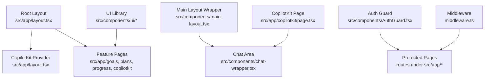
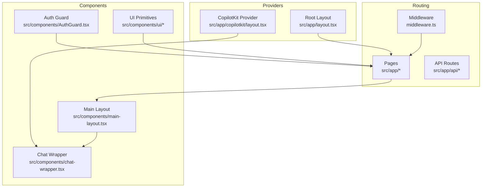
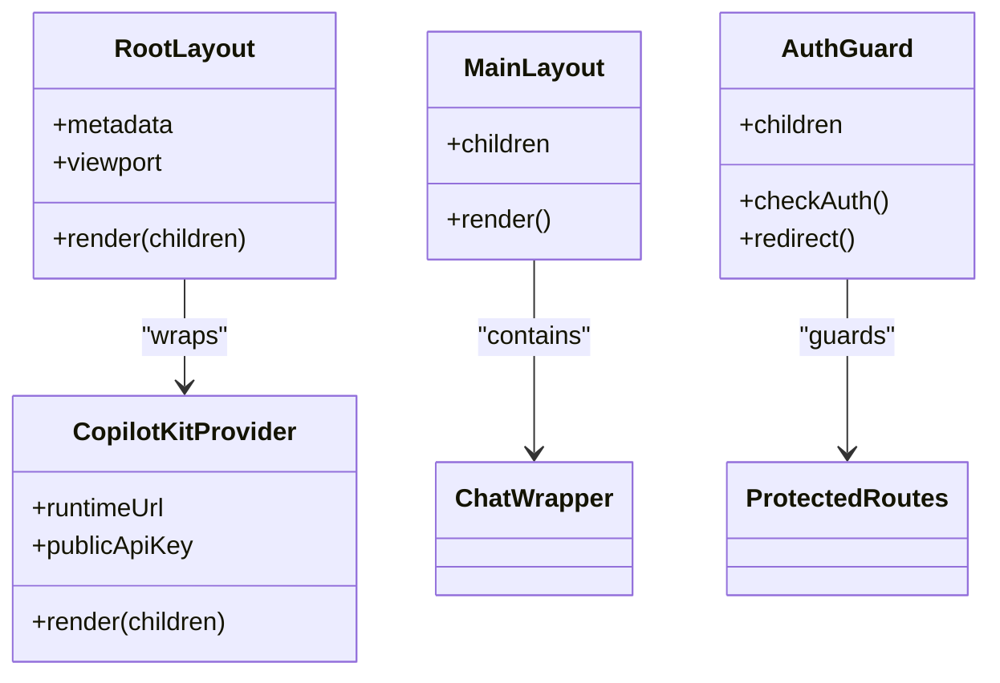
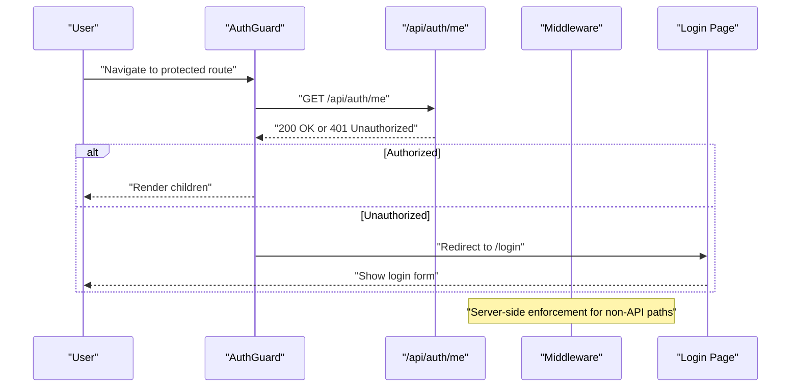
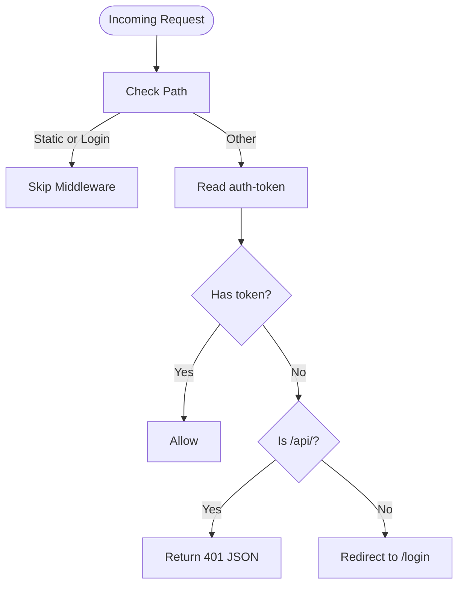
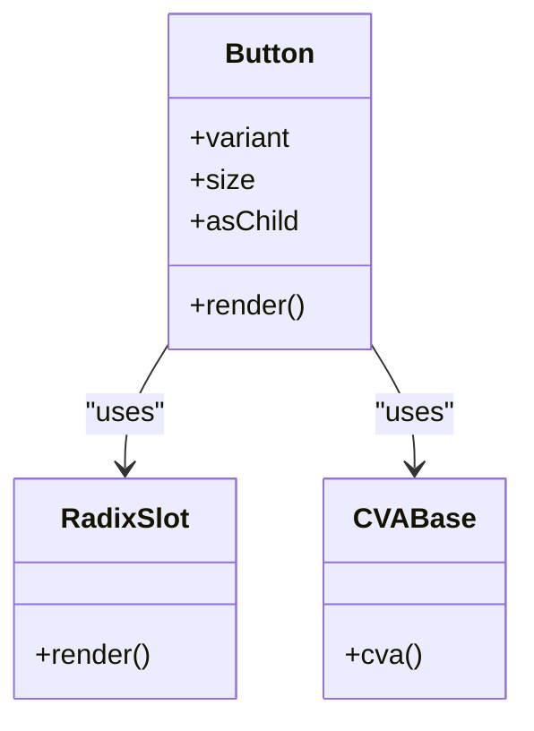
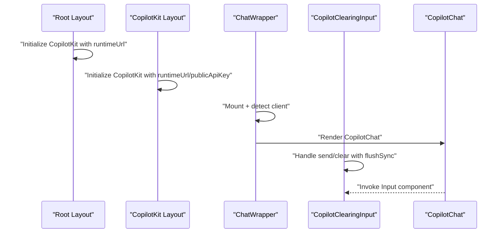
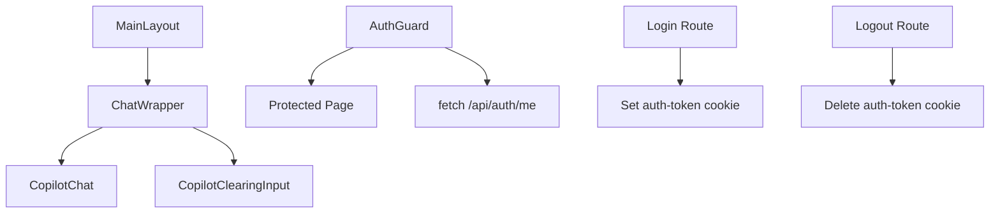
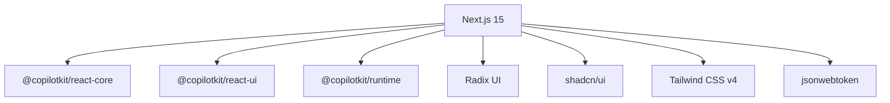

# Frontend Architecture

<cite>
**Referenced Files in This Document**
- [src/app/layout.tsx](file://src/app/layout.tsx)
- [src/components/main-layout.tsx](file://src/components/main-layout.tsx)
- [src/components/AuthGuard.tsx](file://src/components/AuthGuard.tsx)
- [src/lib/auth.ts](file://src/lib/auth.ts)
- [middleware.ts](file://middleware.ts)
- [next.config.ts](file://next.config.ts)
- [src/app/copilotkit/layout.tsx](file://src/app/copilotkit/layout.tsx)
- [src/app/copilotkit/page.tsx](file://src/app/copilotkit/page.tsx)
- [src/components/chat-wrapper.tsx](file://src/components/chat-wrapper.tsx)
- [src/components/copilot-clearing-input.tsx](file://src/components/copilot-clearing-input.tsx)
- [src/components/ui/button.tsx](file://src/components/ui/button.tsx)
- [src/app/api/auth/login/route.ts](file://src/app/api/auth/login/route.ts)
- [src/app/api/auth/logout/route.ts](file://src/app/api/auth/logout/route.ts)
- [src/app/api/auth/me/route.ts](file://src/app/api/auth/me/route.ts)
- [package.json](file://package.json)
</cite>

## Table of Contents
1. [Introduction](#introduction)
2. [Project Structure](#project-structure)
3. [Core Components](#core-components)
4. [Architecture Overview](#architecture-overview)
5. [Detailed Component Analysis](#detailed-component-analysis)
6. [Dependency Analysis](#dependency-analysis)
7. [Performance Considerations](#performance-considerations)
8. [Troubleshooting Guide](#troubleshooting-guide)
9. [Conclusion](#conclusion)
10. [Appendices](#appendices)

## Introduction
This document explains the frontend architecture of the application built with Next.js 15 using the app directory. It covers the layout system, server versus client component patterns, routing architecture, authentication guards, UI component library integration with Radix UI and shadcn/ui, CopilotKit provider setup and AI interaction patterns, responsive design and accessibility, performance optimization, and guidance for component development and debugging.

## Project Structure
The app directory follows Next.js 15 conventions with nested layouts, pages, and API routes. Key areas:
- Root layout and metadata: global styles, viewport, and CopilotKit provider setup
- Feature pages under src/app (e.g., goals, plans, progress, copilotkit)
- Shared UI components under src/components (layout, guards, CopilotKit wrappers, UI primitives)
- Authentication utilities and middleware for route protection
- Tailwind CSS and shadcn/ui/Radix UI integration via shared component library

**Diagram sources**
- [src/app/layout.tsx:16-30](file://src/app/layout.tsx#L16-L30)
- [src/components/main-layout.tsx:11-62](file://src/components/main-layout.tsx#L11-L62)
- [src/components/AuthGuard.tsx:10-52](file://src/components/AuthGuard.tsx#L10-L52)
- [middleware.ts:3-34](file://middleware.ts#L3-L34)
- [src/app/copilotkit/page.tsx:12-26](file://src/app/copilotkit/page.tsx#L12-L26)

**Section sources**
- [src/app/layout.tsx:1-31](file://src/app/layout.tsx#L1-L31)
- [src/components/main-layout.tsx:1-63](file://src/components/main-layout.tsx#L1-L63)
- [src/components/AuthGuard.tsx:1-53](file://src/components/AuthGuard.tsx#L1-L53)
- [middleware.ts:1-40](file://middleware.ts#L1-L40)

## Core Components
- Root layout: sets metadata, viewport, global CSS, and wraps children with CopilotKit provider
- Main layout: responsive two-pane layout with collapsible sidebar and sticky chat panel
- Auth guard: client-side authentication check against /api/auth/me with redirect to login
- Middleware: server-side route protection excluding static assets and login APIs
- UI library: shadcn/ui primitives built on Radix UI and Tailwind Variance Authority
- CopilotKit integration: provider setup, sidebar, chat wrapper, and custom input

**Section sources**
- [src/app/layout.tsx:6-30](file://src/app/layout.tsx#L6-L30)
- [src/components/main-layout.tsx:11-62](file://src/components/main-layout.tsx#L11-L62)
- [src/components/AuthGuard.tsx:10-52](file://src/components/AuthGuard.tsx#L10-L52)
- [middleware.ts:3-34](file://middleware.ts#L3-L34)
- [src/components/ui/button.tsx:7-57](file://src/components/ui/button.tsx#L7-L57)

## Architecture Overview
The frontend uses a layered approach:
- Root layout initializes providers and global styles
- Feature pages render under protected routes
- Middleware enforces authentication for non-API and non-static paths
- UI components are composed from shadcn/ui primitives
- CopilotKit provides AI assistant capabilities integrated into the main layout

**Diagram sources**
- [src/app/layout.tsx:16-30](file://src/app/layout.tsx#L16-L30)
- [src/app/copilotkit/layout.tsx:10-18](file://src/app/copilotkit/layout.tsx#L10-L18)
- [middleware.ts:3-34](file://middleware.ts#L3-L34)
- [src/components/main-layout.tsx:11-62](file://src/components/main-layout.tsx#L11-L62)
- [src/components/AuthGuard.tsx:10-52](file://src/components/AuthGuard.tsx#L10-L52)
- [src/components/ui/button.tsx:7-57](file://src/components/ui/button.tsx#L7-L57)
- [src/components/chat-wrapper.tsx:7-708](file://src/components/chat-wrapper.tsx#L7-L708)

## Detailed Component Analysis

### Layout System and Component Hierarchy
- Root layout defines metadata, viewport, global CSS, and wraps children with CopilotKit provider
- Main layout composes:
  - Main content area with responsive stacking and scrolling
  - AI assistant panel as a sticky sidebar on desktop and bottom sheet on mobile
  - User menu integration
- Protected pages are wrapped with AuthGuard to enforce authentication checks

**Diagram sources**
- [src/app/layout.tsx:6-30](file://src/app/layout.tsx#L6-L30)
- [src/components/main-layout.tsx:11-62](file://src/components/main-layout.tsx#L11-L62)
- [src/components/AuthGuard.tsx:10-52](file://src/components/AuthGuard.tsx#L10-L52)
- [src/app/copilotkit/layout.tsx:10-18](file://src/app/copilotkit/layout.tsx#L10-L18)

**Section sources**
- [src/app/layout.tsx:6-30](file://src/app/layout.tsx#L6-L30)
- [src/components/main-layout.tsx:11-62](file://src/components/main-layout.tsx#L11-L62)
- [src/components/AuthGuard.tsx:10-52](file://src/components/AuthGuard.tsx#L10-L52)

### Authentication Guard Mechanisms
- Client-side guard performs an asynchronous check against /api/auth/me
- On failure, redirects to /login
- Loading state prevents flicker during auth resolution

**Diagram sources**
- [src/components/AuthGuard.tsx:14-32](file://src/components/AuthGuard.tsx#L14-L32)
- [src/app/api/auth/me/route.ts:4-26](file://src/app/api/auth/me/route.ts#L4-L26)
- [middleware.ts:19-30](file://middleware.ts#L19-L30)

**Section sources**
- [src/components/AuthGuard.tsx:10-52](file://src/components/AuthGuard.tsx#L10-L52)
- [src/app/api/auth/me/route.ts:1-27](file://src/app/api/auth/me/route.ts#L1-L27)
- [middleware.ts:3-34](file://middleware.ts#L3-L34)

### Routing Architecture
- Static assets and login routes bypass middleware
- API routes under /api/ are protected by middleware returning 401 JSON
- Feature pages under src/app/* are rendered with optional AuthGuard wrappers

**Diagram sources**
- [middleware.ts:3-34](file://middleware.ts#L3-L34)

**Section sources**
- [middleware.ts:3-34](file://middleware.ts#L3-L34)

### UI Component Library Integration (Radix UI and shadcn/ui)
- Button component demonstrates shadcn/ui design system with variants and sizes backed by Radix UI slots and class variance authority
- Consistent styling and accessibility attributes are applied across components

**Diagram sources**
- [src/components/ui/button.tsx:7-57](file://src/components/ui/button.tsx#L7-L57)

**Section sources**
- [src/components/ui/button.tsx:7-57](file://src/components/ui/button.tsx#L7-L57)

### CopilotKit Provider Setup and AI Interaction Patterns
- Root-level provider configured with runtimeUrl
- Feature-specific CopilotKit layout supports cloud/public API key mode
- ChatWrapper encapsulates CopilotChat with hydration-safe initialization and extensive CSS customization
- Custom input component ensures reliable clearing after send and auto-resizing behavior

**Diagram sources**
- [src/app/layout.tsx:24-26](file://src/app/layout.tsx#L24-L26)
- [src/app/copilotkit/layout.tsx:12-17](file://src/app/copilotkit/layout.tsx#L12-L17)
- [src/components/chat-wrapper.tsx:7-708](file://src/components/chat-wrapper.tsx#L7-L708)
- [src/components/copilot-clearing-input.tsx:84-174](file://src/components/copilot-clearing-input.tsx#L84-L174)

**Section sources**
- [src/app/layout.tsx:24-26](file://src/app/layout.tsx#L24-L26)
- [src/app/copilotkit/layout.tsx:10-18](file://src/app/copilotkit/layout.tsx#L10-L18)
- [src/app/copilotkit/page.tsx:12-26](file://src/app/copilotkit/page.tsx#L12-L26)
- [src/components/chat-wrapper.tsx:7-708](file://src/components/chat-wrapper.tsx#L7-L708)
- [src/components/copilot-clearing-input.tsx:84-174](file://src/components/copilot-clearing-input.tsx#L84-L174)

### Practical Examples: Composition, State Management, and Data Fetching
- Composition: MainLayout composes ChatWrapper; ChatWrapper composes CopilotChat and custom input; AuthGuard wraps protected pages
- State management: AuthGuard maintains local state for authentication status and handles redirects; ChatWrapper manages mounted/client flags and hydration fixes
- Data fetching: AuthGuard fetches /api/auth/me; login/logout routes manage tokens via cookies

**Diagram sources**
- [src/components/main-layout.tsx:11-62](file://src/components/main-layout.tsx#L11-L62)
- [src/components/chat-wrapper.tsx:698-706](file://src/components/chat-wrapper.tsx#L698-L706)
- [src/components/copilot-clearing-input.tsx:105-119](file://src/components/copilot-clearing-input.tsx#L105-L119)
- [src/components/AuthGuard.tsx:17-29](file://src/components/AuthGuard.tsx#L17-L29)
- [src/app/api/auth/login/route.ts:28-35](file://src/app/api/auth/login/route.ts#L28-L35)
- [src/app/api/auth/logout/route.ts:8-9](file://src/app/api/auth/logout/route.ts#L8-L9)

**Section sources**
- [src/components/main-layout.tsx:11-62](file://src/components/main-layout.tsx#L11-L62)
- [src/components/chat-wrapper.tsx:698-706](file://src/components/chat-wrapper.tsx#L698-L706)
- [src/components/copilot-clearing-input.tsx:105-119](file://src/components/copilot-clearing-input.tsx#L105-L119)
- [src/components/AuthGuard.tsx:17-29](file://src/components/AuthGuard.tsx#L17-L29)
- [src/app/api/auth/login/route.ts:28-35](file://src/app/api/auth/login/route.ts#L28-L35)
- [src/app/api/auth/logout/route.ts:8-9](file://src/app/api/auth/logout/route.ts#L8-L9)

## Dependency Analysis
External libraries and integrations:
- Next.js 15 app directory runtime
- CopilotKit for AI assistant and MCP tool integration
- Radix UI and shadcn/ui for accessible UI primitives
- Tailwind CSS v4 and styled-jsx for styling
- jsonwebtoken for JWT token handling

**Diagram sources**
- [package.json:16-39](file://package.json#L16-L39)

**Section sources**
- [package.json:16-39](file://package.json#L16-L39)

## Performance Considerations
- Hydration safety: ChatWrapper defers rendering until client-side mount and applies targeted CSS fixes to prevent hydration mismatches
- Dev-only suppression: next.config.ts suppresses noisy warnings during development while preserving meaningful logs
- Responsive layout: MainLayout uses flexible units and media queries to optimize performance across devices
- Accessibility: Components leverage Radix UI primitives and semantic markup for keyboard navigation and screen reader support

**Section sources**
- [src/components/chat-wrapper.tsx:7-708](file://src/components/chat-wrapper.tsx#L7-L708)
- [next.config.ts:8-25](file://next.config.ts#L8-L25)
- [src/components/main-layout.tsx:13-60](file://src/components/main-layout.tsx#L13-L60)

## Troubleshooting Guide
Common issues and debugging techniques:
- Hydration errors in CopilotKit messages: ChatWrapper includes MutationObserver and periodic fixes targeting paragraph and block elements inside markdown containers
- Development warnings: next.config.ts customizes webpack to filter out specific console warnings during dev
- Authentication loops: verify middleware matcher excludes login and static assets; confirm cookie presence and expiration; check /api/auth/me response
- CopilotKit not loading: ensure runtimeUrl/publicApiKey are configured in providers; verify environment variables are present

**Section sources**
- [src/components/chat-wrapper.tsx:20-59](file://src/components/chat-wrapper.tsx#L20-L59)
- [next.config.ts:8-25](file://next.config.ts#L8-L25)
- [middleware.ts:3-34](file://middleware.ts#L3-L34)
- [src/app/layout.tsx:24-26](file://src/app/layout.tsx#L24-L26)

## Conclusion
The frontend architecture leverages Next.js 15’s app directory for structured layouts, robust authentication via middleware and client-side guards, and a cohesive UI system built on Radix UI and shadcn/ui. CopilotKit is integrated at both root and feature levels to deliver an AI-assisted experience. The design emphasizes responsiveness, accessibility, and performance with targeted hydration fixes and development-time logging controls.

## Appendices
- Environment variables used:
  - AUTH_SECRET for JWT signing
  - AUTH_USERNAME and AUTH_PASSWORD for credential validation
  - NEXT_PUBLIC_COPILOTKIT_RUNTIME_URL and NEXT_PUBLIC_COPILOT_API_KEY for CopilotKit cloud mode
- API endpoints:
  - POST /api/auth/login: validates credentials and sets auth-token cookie
  - POST /api/auth/logout: deletes auth-token cookie
  - GET /api/auth/me: returns current user if authenticated

**Section sources**
- [src/lib/auth.ts:5-46](file://src/lib/auth.ts#L5-L46)
- [src/app/api/auth/login/route.ts:28-35](file://src/app/api/auth/login/route.ts#L28-L35)
- [src/app/api/auth/logout/route.ts:8-9](file://src/app/api/auth/logout/route.ts#L8-L9)
- [src/app/api/auth/me/route.ts:4-18](file://src/app/api/auth/me/route.ts#L4-L18)
- [src/app/layout.tsx:24-26](file://src/app/layout.tsx#L24-L26)
- [src/app/copilotkit/layout.tsx:6-8](file://src/app/copilotkit/layout.tsx#L6-L8)