# Frontend Architecture

<cite>
**Referenced Files in This Document**
- [src/app/layout.tsx](file://src/app/layout.tsx)
- [src/components/main-layout.tsx](file://src/components/main-layout.tsx)
- [src/components/mobile-quadrant-wrapper.tsx](file://src/components/mobile-quadrant-wrapper.tsx)
- [src/components/quadrant-left-sidebar.tsx](file://src/components/quadrant-left-sidebar.tsx)
- [src/components/AuthGuard.tsx](file://src/components/AuthGuard.tsx)
- [src/lib/auth.ts](file://src/lib/auth.ts)
- [middleware.ts](file://middleware.ts)
- [next.config.ts](file://next.config.ts)
- [src/app/copilotkit/layout.tsx](file://src/app/copilotkit/layout.tsx)
- [src/app/copilotkit/page.tsx](file://src/app/copilotkit/page.tsx)
- [src/components/chat-wrapper.tsx](file://src/components/chat-wrapper.tsx)
- [src/components/copilot-clearing-input.tsx](file://src/components/copilot-clearing-input.tsx)
- [src/components/ui/button.tsx](file://src/components/ui/button.tsx)
- [src/app/api/auth/login/route.ts](file://src/app/api/auth/login/route.ts)
- [src/app/api/auth/logout/route.ts](file://src/app/api/auth/logout/route.ts)
- [src/app/api/auth/me/route.ts](file://src/app/api/auth/me/route.ts)
- [src/app/page.tsx](file://src/app/page.tsx)
- [src/app/goals/page.tsx](file://src/app/goals/page.tsx)
- [src/app/plans/page.tsx](file://src/app/plans/page.tsx)
- [src/app/progress/page.tsx](file://src/app/progress/page.tsx)
- [src/app/debug/page.tsx](file://src/app/debug/page.tsx)
- [src/app/test-chat/page.tsx](file://src/app/test-chat/page.tsx)
- [src/components/UserMenu.tsx](file://src/components/UserMenu.tsx)
- [src/components/task-pool.tsx](file://src/components/task-pool.tsx)
- [src/lib/utils.ts](file://src/lib/utils.ts)
- [package.json](file://package.json)
</cite>

## Update Summary
**Changes Made**
- Enhanced mobile-responsive architecture with new component hierarchy
- Added MobileQuadrantWrapper for mobile-specific four-quadrant layout
- Updated MainLayout with improved mobile/desktop responsive design
- Integrated dynamic imports for hydration-safe components
- Enhanced AI assistant integration with mobile drawer and desktop sidebar
- Improved component composition patterns for better mobile experience

## Table of Contents
1. [Introduction](#introduction)
2. [Project Structure](#project-structure)
3. [Core Components](#core-components)
4. [Architecture Overview](#architecture-overview)
5. [Detailed Component Analysis](#detailed-component-analysis)
6. [Mobile-Responsive Design System](#mobile-responsive-design-system)
7. [Component Hierarchy Enhancement](#component-hierarchy-enhancement)
8. [Dependency Analysis](#dependency-analysis)
9. [Performance Considerations](#performance-considerations)
10. [Troubleshooting Guide](#troubleshooting-guide)
11. [Conclusion](#conclusion)
12. [Appendices](#appendices)

## Introduction
This document explains the frontend architecture of the application built with Next.js 15 using the app directory. The architecture features a comprehensive mobile-responsive design system with enhanced component hierarchy, featuring a sophisticated four-quadrant layout, intelligent AI assistant integration, and adaptive UI patterns that seamlessly transition between mobile and desktop experiences.

## Project Structure
The app directory follows Next.js 15 conventions with nested layouts, pages, and API routes. The architecture emphasizes mobile-first design principles while maintaining desktop functionality. Key areas include:
- Root layout and metadata with CopilotKit provider setup
- Feature pages under src/app (goals, plans, progress, copilotkit)
- Mobile-responsive component system with dynamic imports
- Enhanced four-quadrant layout with drag-and-drop functionality
- Intelligent AI assistant integration with mobile drawer and desktop sidebar

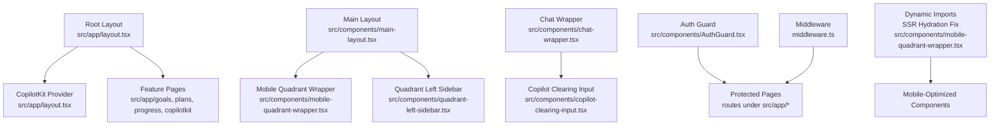

**Diagram sources**
- [src/app/layout.tsx:16-30](file://src/app/layout.tsx#L16-L30)
- [src/components/main-layout.tsx:13-164](file://src/components/main-layout.tsx#L13-L164)
- [src/components/mobile-quadrant-wrapper.tsx:1-18](file://src/components/mobile-quadrant-wrapper.tsx#L1-L18)
- [src/components/quadrant-left-sidebar.tsx:1-585](file://src/components/quadrant-left-sidebar.tsx#L1-L585)
- [src/components/AuthGuard.tsx:10-52](file://src/components/AuthGuard.tsx#L10-L52)
- [middleware.ts:3-34](file://middleware.ts#L3-L34)
- [src/components/chat-wrapper.tsx:1-709](file://src/components/chat-wrapper.tsx#L1-L709)
- [src/components/copilot-clearing-input.tsx:1-175](file://src/components/copilot-clearing-input.tsx#L1-L175)

**Section sources**
- [src/app/layout.tsx:1-31](file://src/app/layout.tsx#L1-L31)
- [src/components/main-layout.tsx:1-164](file://src/components/main-layout.tsx#L1-L164)
- [src/components/mobile-quadrant-wrapper.tsx:1-18](file://src/components/mobile-quadrant-wrapper.tsx#L1-L18)
- [src/components/quadrant-left-sidebar.tsx:1-585](file://src/components/quadrant-left-sidebar.tsx#L1-L585)
- [src/components/AuthGuard.tsx:1-53](file://src/components/AuthGuard.tsx#L1-L53)
- [middleware.ts:1-40](file://middleware.ts#L1-L40)

## Core Components
- **Root layout**: Sets metadata, viewport, global CSS, and wraps children with CopilotKit provider
- **Main layout**: Enhanced responsive two-pane layout with collapsible sidebar, mobile drawer, and sticky chat panel
- **Mobile quadrant wrapper**: Dynamic import component for mobile-optimized four-quadrant layout
- **Quadrant left sidebar**: Advanced four-quadrant task management with drag-and-drop functionality
- **Auth guard**: Client-side authentication check against /api/auth/me with redirect to login
- **Middleware**: Server-side route protection excluding static assets and login APIs
- **Chat wrapper**: Hydration-safe AI assistant integration with comprehensive styling
- **Copilot clearing input**: Reliable input component with auto-resizing and clear-after-send functionality

**Section sources**
- [src/app/layout.tsx:6-30](file://src/app/layout.tsx#L6-L30)
- [src/components/main-layout.tsx:13-164](file://src/components/main-layout.tsx#L13-L164)
- [src/components/mobile-quadrant-wrapper.tsx:1-18](file://src/components/mobile-quadrant-wrapper.tsx#L1-L18)
- [src/components/quadrant-left-sidebar.tsx:1-585](file://src/components/quadrant-left-sidebar.tsx#L1-L585)
- [src/components/AuthGuard.tsx:10-52](file://src/components/AuthGuard.tsx#L10-L52)
- [middleware.ts:3-34](file://middleware.ts#L3-L34)
- [src/components/chat-wrapper.tsx:1-709](file://src/components/chat-wrapper.tsx#L1-L709)
- [src/components/copilot-clearing-input.tsx:1-175](file://src/components/copilot-clearing-input.tsx#L1-L175)

## Architecture Overview
The frontend uses a layered approach with enhanced mobile-responsive design:
- Root layout initializes providers and global styles
- Feature pages render under protected routes with mobile-optimized layouts
- Middleware enforces authentication for non-API and non-static paths
- Dynamic imports handle SSR hydration for mobile components
- AI assistant integrates as both desktop sidebar and mobile drawer
- Four-quadrant layout adapts seamlessly between mobile and desktop views

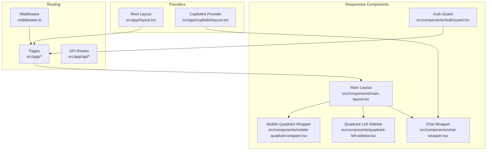

**Diagram sources**
- [src/app/layout.tsx:16-30](file://src/app/layout.tsx#L16-L30)
- [src/app/copilotkit/layout.tsx:10-18](file://src/app/copilotkit/layout.tsx#L10-L18)
- [middleware.ts:3-34](file://middleware.ts#L3-L34)
- [src/components/main-layout.tsx:13-164](file://src/components/main-layout.tsx#L13-L164)
- [src/components/mobile-quadrant-wrapper.tsx:1-18](file://src/components/mobile-quadrant-wrapper.tsx#L1-L18)
- [src/components/quadrant-left-sidebar.tsx:1-585](file://src/components/quadrant-left-sidebar.tsx#L1-L585)
- [src/components/AuthGuard.tsx:10-52](file://src/components/AuthGuard.tsx#L10-L52)
- [src/components/chat-wrapper.tsx:1-709](file://src/components/chat-wrapper.tsx#L1-L709)

## Detailed Component Analysis

### Enhanced Layout System and Component Hierarchy
The layout system now features a sophisticated mobile-responsive architecture:
- **Root layout** defines metadata, viewport, global CSS, and wraps children with CopilotKit provider
- **Main layout** composes:
  - Desktop: Fixed sidebar with collapsible functionality and desktop AI assistant
  - Mobile: Floating action button with animated drawer for AI assistant
  - Responsive content area with adaptive scrolling
- **Mobile quadrant wrapper** provides mobile-optimized four-quadrant layout via dynamic imports
- **Quadrant left sidebar** offers advanced task management with drag-and-drop and real-time updates

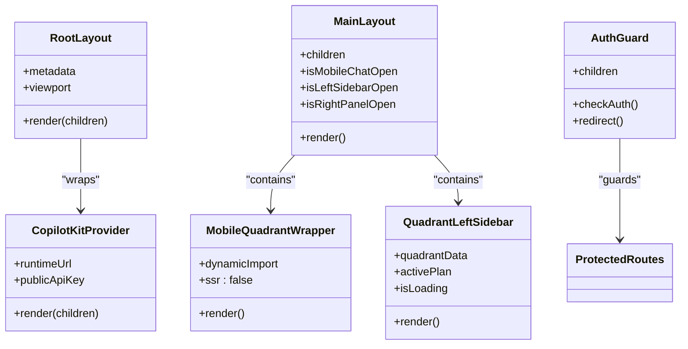

**Diagram sources**
- [src/app/layout.tsx:6-30](file://src/app/layout.tsx#L6-L30)
- [src/components/main-layout.tsx:13-164](file://src/components/main-layout.tsx#L13-L164)
- [src/components/mobile-quadrant-wrapper.tsx:1-18](file://src/components/mobile-quadrant-wrapper.tsx#L1-L18)
- [src/components/quadrant-left-sidebar.tsx:1-585](file://src/components/quadrant-left-sidebar.tsx#L1-L585)
- [src/components/AuthGuard.tsx:10-52](file://src/components/AuthGuard.tsx#L10-L52)
- [src/app/copilotkit/layout.tsx:10-18](file://src/app/copilotkit/layout.tsx#L10-L18)

**Section sources**
- [src/app/layout.tsx:6-30](file://src/app/layout.tsx#L6-L30)
- [src/components/main-layout.tsx:13-164](file://src/components/main-layout.tsx#L13-L164)
- [src/components/mobile-quadrant-wrapper.tsx:1-18](file://src/components/mobile-quadrant-wrapper.tsx#L1-L18)
- [src/components/quadrant-left-sidebar.tsx:1-585](file://src/components/quadrant-left-sidebar.tsx#L1-L585)
- [src/components/AuthGuard.tsx:10-52](file://src/components/AuthGuard.tsx#L10-L52)

### Authentication Guard Mechanisms
- Client-side guard performs an asynchronous check against /api/auth/me
- On failure, redirects to /login
- Loading state prevents flicker during auth resolution

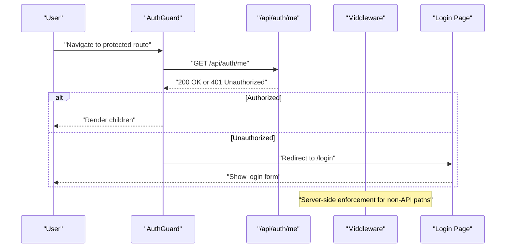

**Diagram sources**
- [src/components/AuthGuard.tsx:14-32](file://src/components/AuthGuard.tsx#L14-L32)
- [src/app/api/auth/me/route.ts:4-26](file://src/app/api/auth/me/route.ts#L4-L26)
- [middleware.ts:19-30](file://middleware.ts#L19-L30)

**Section sources**
- [src/components/AuthGuard.tsx:10-52](file://src/components/AuthGuard.tsx#L10-L52)
- [src/app/api/auth/me/route.ts:1-27](file://src/app/api/auth/me/route.ts#L1-L27)
- [middleware.ts:3-34](file://middleware.ts#L3-L34)

### Routing Architecture
- Static assets and login routes bypass middleware
- API routes under /api/ are protected by middleware returning 401 JSON
- Feature pages under src/app/* are rendered with optional AuthGuard wrappers

**Diagram sources**
- [middleware.ts:3-34](file://middleware.ts#L3-L34)

**Section sources**
- [middleware.ts:3-34](file://middleware.ts#L3-L34)

### UI Component Library Integration (Radix UI and shadcn/ui)
- Button component demonstrates shadcn/ui design system with variants and sizes backed by Radix UI slots and class variance authority
- Consistent styling and accessibility attributes are applied across components

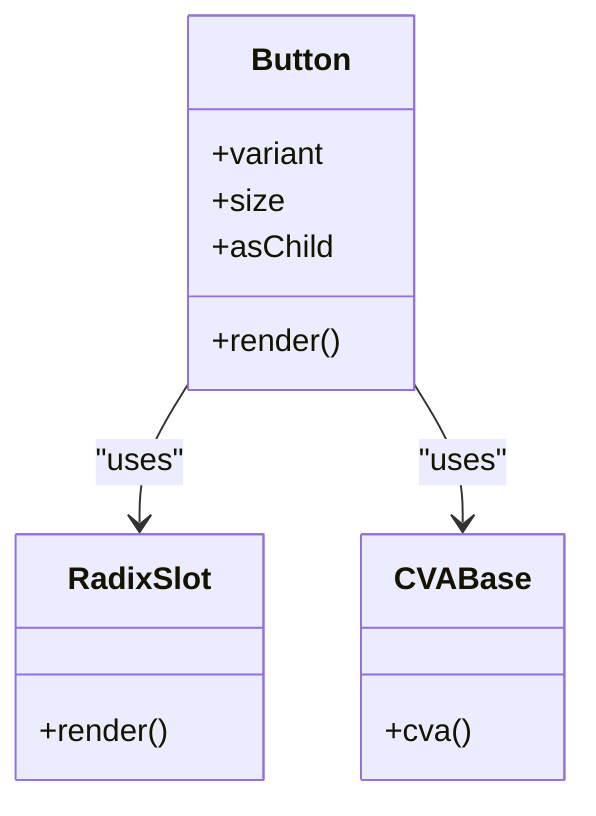

**Diagram sources**
- [src/components/ui/button.tsx:7-57](file://src/components/ui/button.tsx#L7-L57)

**Section sources**
- [src/components/ui/button.tsx:7-57](file://src/components/ui/button.tsx#L7-L57)

### CopilotKit Provider Setup and AI Interaction Patterns
- Root-level provider configured with runtimeUrl
- Feature-specific CopilotKit layout supports cloud/public API key mode
- ChatWrapper encapsulates CopilotChat with hydration-safe initialization and extensive CSS customization
- Custom input component ensures reliable clearing after send and auto-resizing behavior

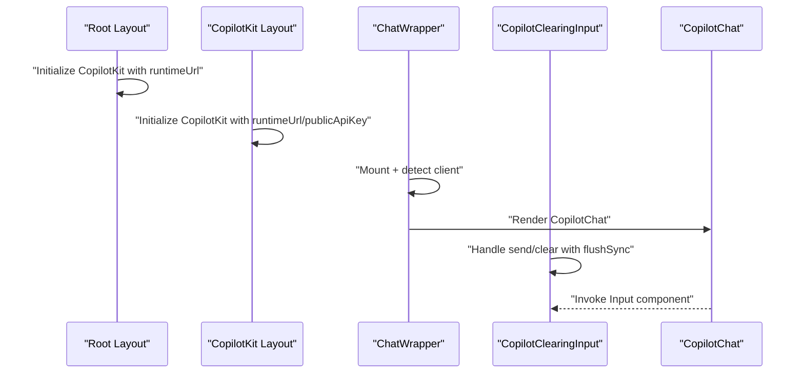

**Diagram sources**
- [src/app/layout.tsx:24-26](file://src/app/layout.tsx#L24-L26)
- [src/app/copilotkit/layout.tsx:12-17](file://src/app/copilotkit/layout.tsx#L12-L17)
- [src/components/chat-wrapper.tsx:7-708](file://src/components/chat-wrapper.tsx#L7-L708)
- [src/components/copilot-clearing-input.tsx:84-174](file://src/components/copilot-clearing-input.tsx#L84-L174)

**Section sources**
- [src/app/layout.tsx:24-26](file://src/app/layout.tsx#L24-L26)
- [src/app/copilotkit/layout.tsx:10-18](file://src/app/copilotkit/layout.tsx#L10-L18)
- [src/app/copilotkit/page.tsx:12-26](file://src/app/copilotkit/page.tsx#L12-L26)
- [src/components/chat-wrapper.tsx:7-708](file://src/components/chat-wrapper.tsx#L7-L708)
- [src/components/copilot-clearing-input.tsx:84-174](file://src/components/copilot-clearing-input.tsx#L84-L174)

## Mobile-Responsive Design System

### Mobile-First Component Architecture
The application implements a comprehensive mobile-responsive design system with the following key components:

#### Dynamic Import Strategy
- **MobileQuadrantWrapper** uses Next.js dynamic imports with `{ ssr: false }` to prevent hydration errors
- Ensures mobile components render correctly without server-side rendering conflicts
- Maintains optimal performance by loading mobile-specific components only when needed

#### Adaptive Layout Patterns
- **Desktop Layout**: Fixed sidebar with collapsible functionality, desktop AI assistant panel
- **Mobile Layout**: Floating action button with animated drawer, responsive content area
- **Hybrid Approach**: Seamless transition between desktop and mobile experiences

#### Responsive Component States
- **MainLayout** manages three key states: mobile chat open/close, left sidebar open/close, right panel open/close
- **State Management**: Uses React hooks to track component visibility and user preferences
- **Animation Transitions**: Smooth animations for drawer opening/closing and panel toggling

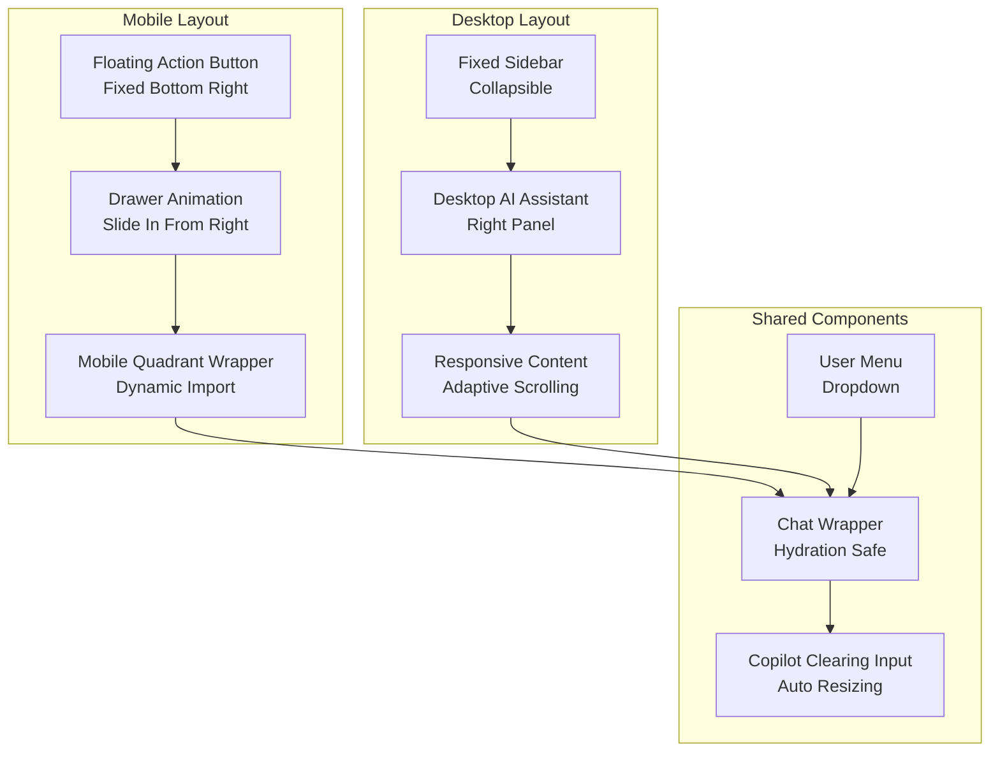

**Diagram sources**
- [src/components/main-layout.tsx:95-161](file://src/components/main-layout.tsx#L95-L161)
- [src/components/mobile-quadrant-wrapper.tsx:1-18](file://src/components/mobile-quadrant-wrapper.tsx#L1-L18)
- [src/components/chat-wrapper.tsx:1-709](file://src/components/chat-wrapper.tsx#L1-L709)
- [src/components/copilot-clearing-input.tsx:1-175](file://src/components/copilot-clearing-input.tsx#L1-L175)

**Section sources**
- [src/components/main-layout.tsx:95-161](file://src/components/main-layout.tsx#L95-L161)
- [src/components/mobile-quadrant-wrapper.tsx:1-18](file://src/components/mobile-quadrant-wrapper.tsx#L1-L18)
- [src/components/chat-wrapper.tsx:1-709](file://src/components/chat-wrapper.tsx#L1-L709)
- [src/components/copilot-clearing-input.tsx:1-175](file://src/components/copilot-clearing-input.tsx#L1-L175)

### Four-Quadrant Layout Enhancement
The four-quadrant layout system provides sophisticated task management with advanced features:

#### Drag-and-Drop Functionality
- **@dnd-kit Integration**: Full drag-and-drop support for task reorganization
- **Visual Feedback**: Real-time drag overlays and drop targets
- **Collision Detection**: Precise quadrant detection during drag operations

#### Advanced Task Management
- **Priority Quadrants**: Four-quadrant system with color-coded categories
- **Task Completion Tracking**: Automatic completion status calculation
- **Recurring Task Support**: Special handling for periodic tasks

#### Mobile Optimization
- **Touch-Friendly Interface**: Large touch targets and gesture support
- **Responsive Grid**: Adapts to different screen sizes and orientations
- **Performance Optimization**: Efficient rendering for mobile devices

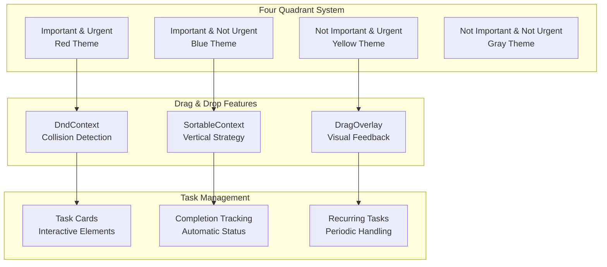

**Diagram sources**
- [src/components/quadrant-left-sidebar.tsx:58-99](file://src/components/quadrant-left-sidebar.tsx#L58-L99)
- [src/components/quadrant-left-sidebar.tsx:551-582](file://src/components/quadrant-left-sidebar.tsx#L551-L582)
- [src/components/quadrant-left-sidebar.tsx:209-282](file://src/components/quadrant-left-sidebar.tsx#L209-L282)

**Section sources**
- [src/components/quadrant-left-sidebar.tsx:58-99](file://src/components/quadrant-left-sidebar.tsx#L58-L99)
- [src/components/quadrant-left-sidebar.tsx:551-582](file://src/components/quadrant-left-sidebar.tsx#L551-L582)
- [src/components/quadrant-left-sidebar.tsx:209-282](file://src/components/quadrant-left-sidebar.tsx#L209-L282)

## Component Hierarchy Enhancement

### Enhanced Component Composition
The component hierarchy now features sophisticated composition patterns that adapt to different screen sizes and user contexts:

#### Parent-Child Relationships
- **MainLayout** serves as the primary container for all feature pages
- **MobileQuadrantWrapper** provides mobile-specific four-quadrant layout
- **QuadrantLeftSidebar** offers advanced task management functionality
- **ChatWrapper** encapsulates AI assistant interactions
- **CopilotClearingInput** provides specialized input handling

#### State Propagation Patterns
- **Top-down State Flow**: MainLayout manages global state passed down to child components
- **Event-Driven Updates**: Child components trigger state changes through callback functions
- **Cross-Component Communication**: Custom events enable communication between unrelated components

#### Lifecycle Management
- **Mount Detection**: Components detect client-side mounting for hydration-safe rendering
- **Cleanup Functions**: Proper cleanup of event listeners and observers
- **Memory Management**: Efficient resource cleanup to prevent memory leaks

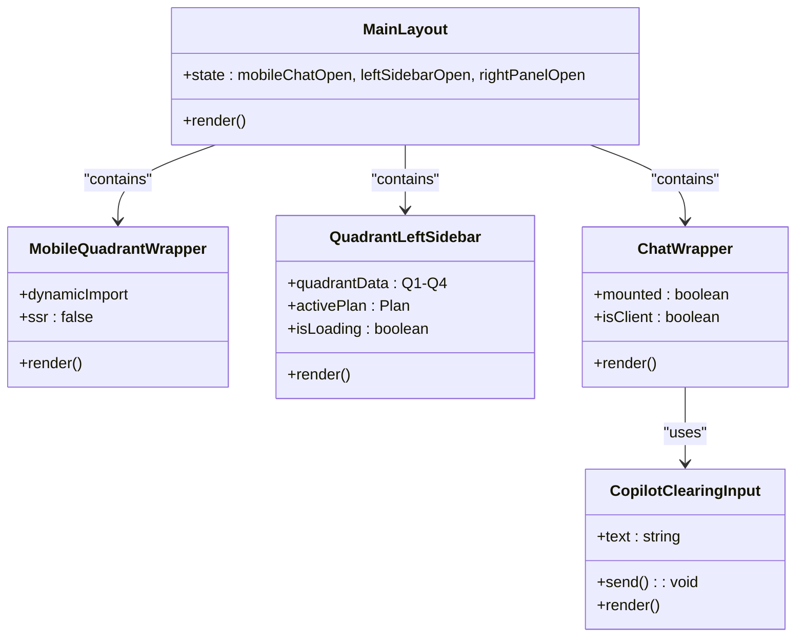

**Diagram sources**
- [src/components/main-layout.tsx:13-164](file://src/components/main-layout.tsx#L13-L164)
- [src/components/mobile-quadrant-wrapper.tsx:1-18](file://src/components/mobile-quadrant-wrapper.tsx#L1-L18)
- [src/components/quadrant-left-sidebar.tsx:1-585](file://src/components/quadrant-left-sidebar.tsx#L1-L585)
- [src/components/chat-wrapper.tsx:1-709](file://src/components/chat-wrapper.tsx#L1-L709)
- [src/components/copilot-clearing-input.tsx:1-175](file://src/components/copilot-clearing-input.tsx#L1-L175)

**Section sources**
- [src/components/main-layout.tsx:13-164](file://src/components/main-layout.tsx#L13-L164)
- [src/components/mobile-quadrant-wrapper.tsx:1-18](file://src/components/mobile-quadrant-wrapper.tsx#L1-L18)
- [src/components/quadrant-left-sidebar.tsx:1-585](file://src/components/quadrant-left-sidebar.tsx#L1-L585)
- [src/components/chat-wrapper.tsx:1-709](file://src/components/chat-wrapper.tsx#L1-L709)
- [src/components/copilot-clearing-input.tsx:1-175](file://src/components/copilot-clearing-input.tsx#L1-L175)

### Practical Examples: Composition, State Management, and Data Fetching
- **Composition**: MainLayout composes MobileQuadrantWrapper, QuadrantLeftSidebar, and ChatWrapper; ChatWrapper composes CopilotChat and custom input; AuthGuard wraps protected pages
- **State management**: MainLayout maintains state for mobile/desktop modes; QuadrantLeftSidebar manages task data and loading states; ChatWrapper manages mounted/client flags and hydration fixes
- **Data fetching**: AuthGuard fetches /api/auth/me; login/logout routes manage tokens via cookies; QuadrantLeftSidebar fetches quadrant data via /api/plan/priority

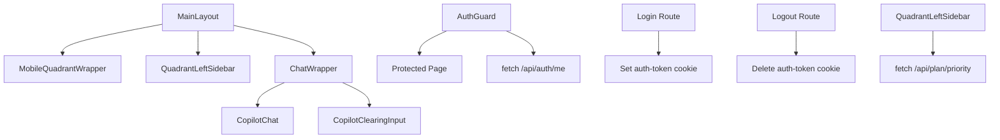

**Diagram sources**
- [src/components/main-layout.tsx:13-164](file://src/components/main-layout.tsx#L13-L164)
- [src/components/mobile-quadrant-wrapper.tsx:1-18](file://src/components/mobile-quadrant-wrapper.tsx#L1-L18)
- [src/components/quadrant-left-sidebar.tsx:399-460](file://src/components/quadrant-left-sidebar.tsx#L399-L460)
- [src/components/chat-wrapper.tsx:698-706](file://src/components/chat-wrapper.tsx#L698-L706)
- [src/components/copilot-clearing-input.tsx:105-119](file://src/components/copilot-clearing-input.tsx#L105-L119)
- [src/components/AuthGuard.tsx:17-29](file://src/components/AuthGuard.tsx#L17-L29)
- [src/app/api/auth/login/route.ts:28-35](file://src/app/api/auth/login/route.ts#L28-L35)
- [src/app/api/auth/logout/route.ts:8-9](file://src/app/api/auth/logout/route.ts#L8-L9)

**Section sources**
- [src/components/main-layout.tsx:13-164](file://src/components/main-layout.tsx#L13-L164)
- [src/components/mobile-quadrant-wrapper.tsx:1-18](file://src/components/mobile-quadrant-wrapper.tsx#L1-L18)
- [src/components/quadrant-left-sidebar.tsx:399-460](file://src/components/quadrant-left-sidebar.tsx#L399-L460)
- [src/components/chat-wrapper.tsx:698-706](file://src/components/chat-wrapper.tsx#L698-L706)
- [src/components/copilot-clearing-input.tsx:105-119](file://src/components/copilot-clearing-input.tsx#L105-L119)
- [src/components/AuthGuard.tsx:17-29](file://src/components/AuthGuard.tsx#L17-L29)
- [src/app/api/auth/login/route.ts:28-35](file://src/app/api/auth/login/route.ts#L28-L35)
- [src/app/api/auth/logout/route.ts:8-9](file://src/app/api/auth/logout/route.ts#L8-L9)

## Dependency Analysis
External libraries and integrations:
- Next.js 15 app directory runtime with enhanced mobile support
- CopilotKit for AI assistant and MCP tool integration
- Radix UI and shadcn/ui for accessible UI primitives
- Tailwind CSS v4 and styled-jsx for styling
- jsonwebtoken for JWT token handling
- @dnd-kit for drag-and-drop functionality
- lucide-react for SVG icons

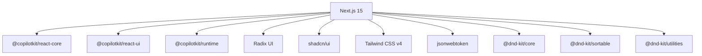

**Diagram sources**
- [package.json:16-39](file://package.json#L16-L39)

**Section sources**
- [package.json:16-39](file://package.json#L16-L39)

## Performance Considerations
- **Hydration safety**: ChatWrapper defers rendering until client-side mount and applies targeted CSS fixes to prevent hydration mismatches
- **Dynamic imports**: MobileQuadrantWrapper uses SSR disablement to prevent hydration errors on mobile components
- **Dev-only suppression**: next.config.ts suppresses noisy warnings during development while preserving meaningful logs
- **Responsive layout**: MainLayout uses flexible units and media queries to optimize performance across devices
- **Accessibility**: Components leverage Radix UI primitives and semantic markup for keyboard navigation and screen reader support
- **Performance optimization**: Dynamic imports reduce initial bundle size, improving mobile loading performance

**Section sources**
- [src/components/chat-wrapper.tsx:7-708](file://src/components/chat-wrapper.tsx#L7-L708)
- [src/components/mobile-quadrant-wrapper.tsx:1-18](file://src/components/mobile-quadrant-wrapper.tsx#L1-L18)
- [next.config.ts:8-25](file://next.config.ts#L8-L25)
- [src/components/main-layout.tsx:13-60](file://src/components/main-layout.tsx#L13-L60)

## Troubleshooting Guide
Common issues and debugging techniques:
- **Hydration errors in CopilotKit messages**: ChatWrapper includes MutationObserver and periodic fixes targeting paragraph and block elements inside markdown containers
- **Mobile component hydration issues**: MobileQuadrantWrapper uses dynamic imports with SSR disabled to prevent hydration conflicts
- **Development warnings**: next.config.ts customizes webpack to filter out specific console warnings during dev
- **Authentication loops**: verify middleware matcher excludes login and static assets; confirm cookie presence and expiration; check /api/auth/me response
- **CopilotKit not loading**: ensure runtimeUrl/publicApiKey are configured in providers; verify environment variables are present
- **Drag-and-drop issues**: Check @dnd-kit configuration and ensure proper sensor setup for mobile touch events
- **Mobile drawer animation problems**: Verify CSS animations and transition properties for mobile drawer components

**Section sources**
- [src/components/chat-wrapper.tsx:20-59](file://src/components/chat-wrapper.tsx#L20-L59)
- [src/components/mobile-quadrant-wrapper.tsx:1-18](file://src/components/mobile-quadrant-wrapper.tsx#L1-L18)
- [next.config.ts:8-25](file://next.config.ts#L8-L25)
- [middleware.ts:3-34](file://middleware.ts#L3-L34)
- [src/app/layout.tsx:24-26](file://src/app/layout.tsx#L24-L26)

## Conclusion
The frontend architecture leverages Next.js 15's app directory for structured layouts with a comprehensive mobile-responsive design system. The enhanced component hierarchy provides seamless transitions between mobile and desktop experiences, featuring sophisticated four-quadrant task management, intelligent AI assistant integration, and adaptive UI patterns. The architecture emphasizes responsive design, accessibility, and performance with targeted hydration fixes, dynamic imports for mobile components, and development-time logging controls.

## Appendices
- **Environment variables used**:
  - AUTH_SECRET for JWT signing
  - AUTH_USERNAME and AUTH_PASSWORD for credential validation
  - NEXT_PUBLIC_COPILOTKIT_RUNTIME_URL and NEXT_PUBLIC_COPILOT_API_KEY for CopilotKit cloud mode
- **API endpoints**:
  - POST /api/auth/login: validates credentials and sets auth-token cookie
  - POST /api/auth/logout: deletes auth-token cookie
  - GET /api/auth/me: returns current user if authenticated
  - GET /api/plan/priority: fetches four-quadrant task data
  - POST/PUT/DELETE /api/goal, /api/plan, /api/progress_record: CRUD operations for application data

**Section sources**
- [src/lib/auth.ts:5-46](file://src/lib/auth.ts#L5-L46)
- [src/app/api/auth/login/route.ts:28-35](file://src/app/api/auth/login/route.ts#L28-L35)
- [src/app/api/auth/logout/route.ts:8-9](file://src/app/api/auth/logout/route.ts#L8-L9)
- [src/app/api/auth/me/route.ts:4-18](file://src/app/api/auth/me/route.ts#L4-L18)
- [src/app/layout.tsx:24-26](file://src/app/layout.tsx#L24-L26)
- [src/app/copilotkit/layout.tsx:6-8](file://src/app/copilotkit/layout.tsx#L6-L8)
- [src/components/quadrant-left-sidebar.tsx:404-460](file://src/components/quadrant-left-sidebar.tsx#L404-L460)