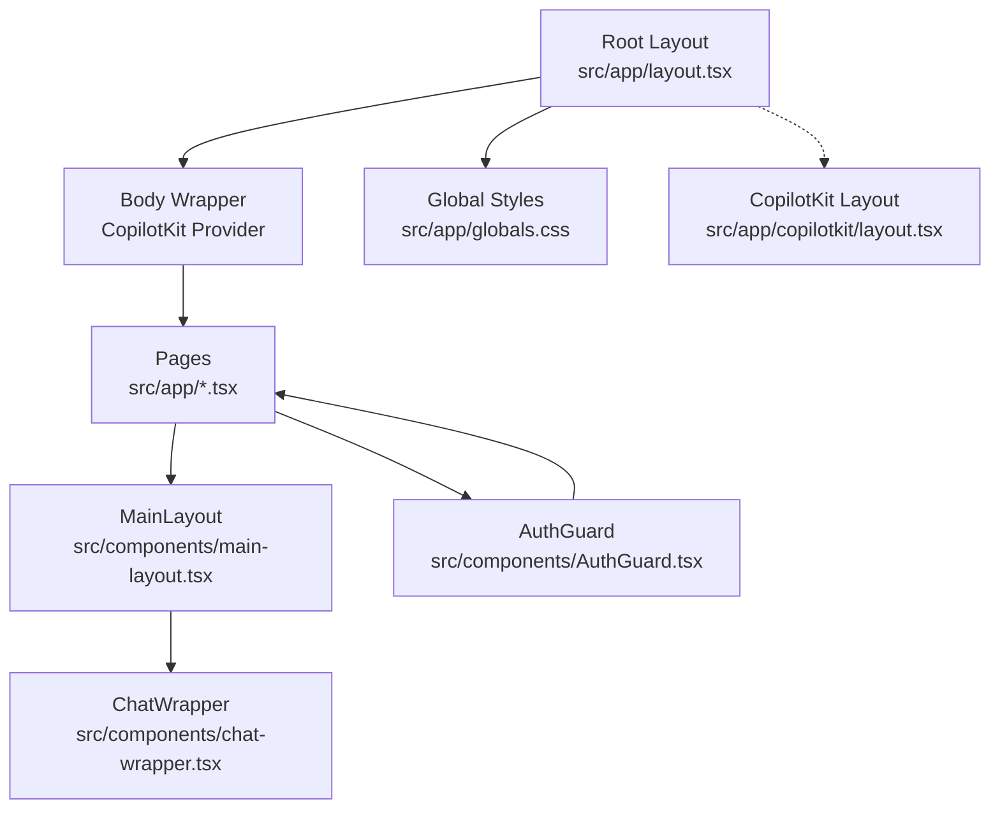
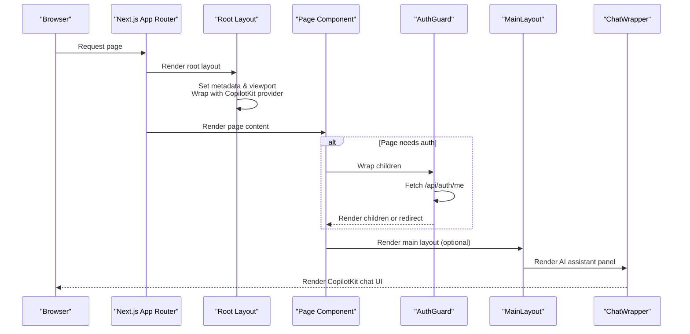
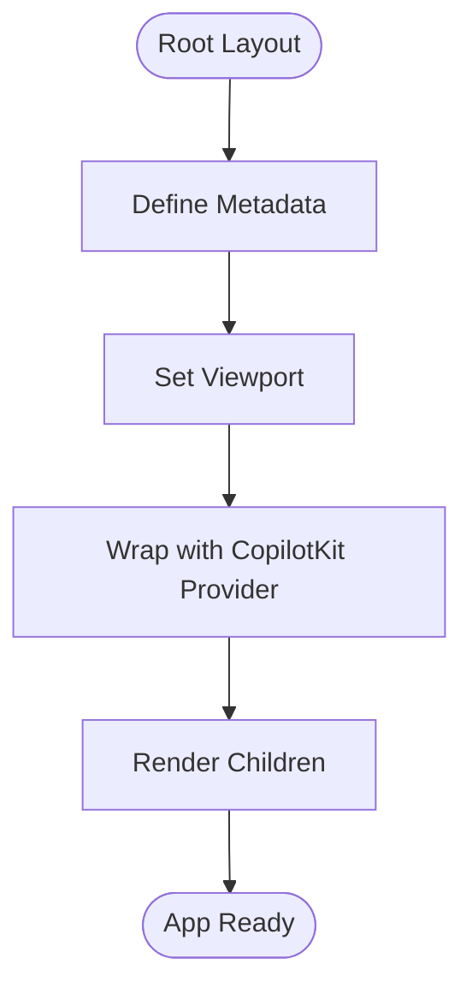
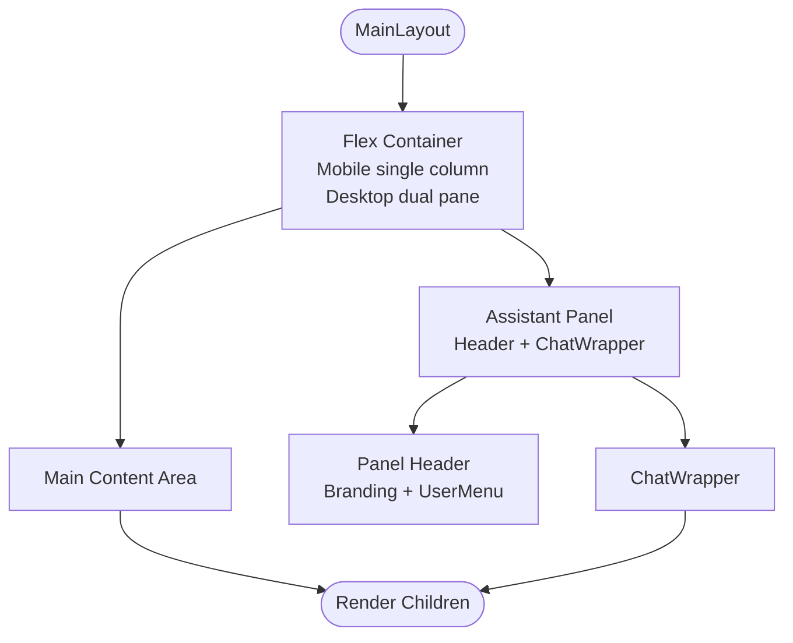
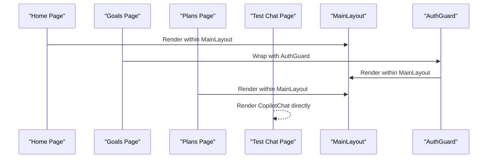
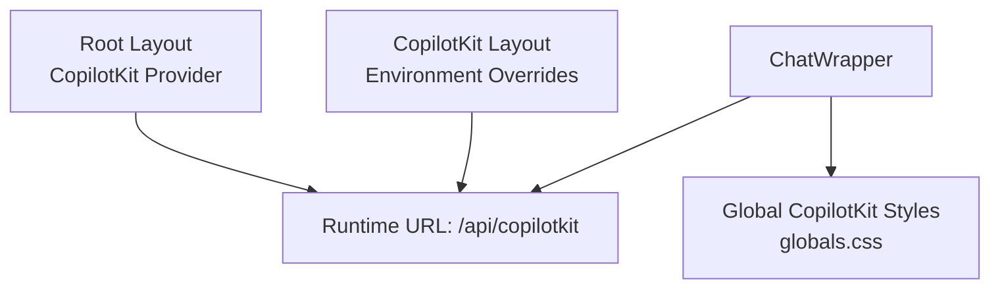
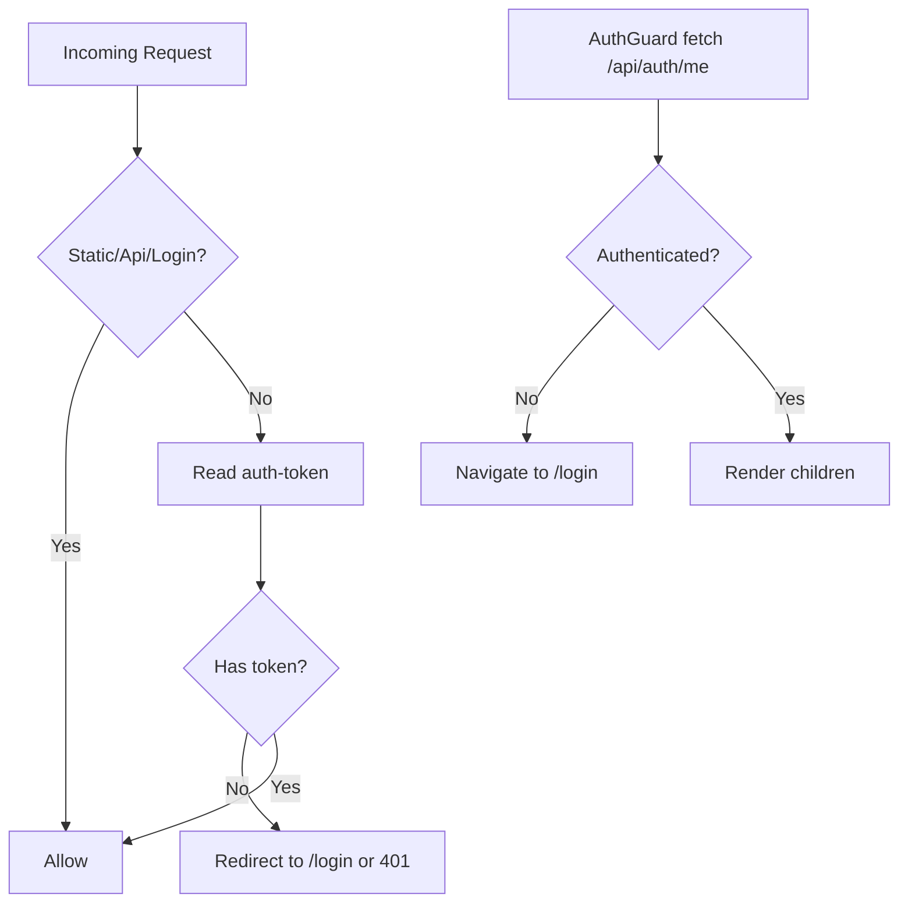
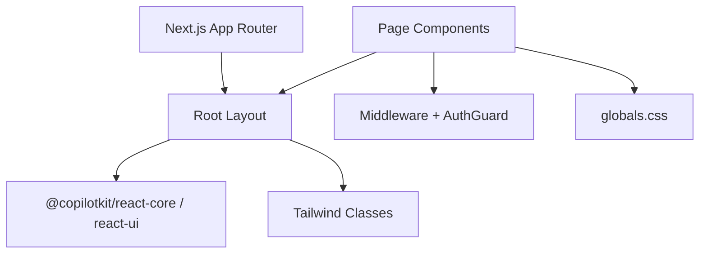

# Layout System

<cite>
**Referenced Files in This Document**
- [src/app/layout.tsx](file://src/app/layout.tsx)
- [src/app/copilotkit/layout.tsx](file://src/app/copilotkit/layout.tsx)
- [src/components/main-layout.tsx](file://src/components/main-layout.tsx)
- [src/components/chat-wrapper.tsx](file://src/components/chat-wrapper.tsx)
- [src/components/UserMenu.tsx](file://src/components/UserMenu.tsx)
- [src/app/page.tsx](file://src/app/page.tsx)
- [src/app/goals/page.tsx](file://src/app/goals/page.tsx)
- [src/app/plans/page.tsx](file://src/app/plans/page.tsx)
- [src/app/test-chat/page.tsx](file://src/app/test-chat/page.tsx)
- [src/app/globals.css](file://src/app/globals.css)
- [src/lib/auth.ts](file://src/lib/auth.ts)
- [middleware.ts](file://middleware.ts)
- [src/components/AuthGuard.tsx](file://src/components/AuthGuard.tsx)
- [package.json](file://package.json)
</cite>

## Table of Contents
1. [Introduction](#introduction)
2. [Project Structure](#project-structure)
3. [Core Components](#core-components)
4. [Architecture Overview](#architecture-overview)
5. [Detailed Component Analysis](#detailed-component-analysis)
6. [Dependency Analysis](#dependency-analysis)
7. [Performance Considerations](#performance-considerations)
8. [Troubleshooting Guide](#troubleshooting-guide)
9. [Conclusion](#conclusion)

## Introduction
This document explains the layout system for the Next.js app directory, focusing on the root layout, metadata and viewport configuration, the main layout component, child rendering patterns, and CopilotKit provider setup. It also covers layout composition strategies, authentication guards, responsive design, performance optimization, debugging tips, and best practices for maintainable layout architecture.

## Project Structure
The layout system is centered around:
- Root layout that sets global metadata, viewport, and wraps the entire app with the CopilotKit provider
- A reusable MainLayout component that defines the primary page shell with a main content area and an integrated AI assistant panel
- Page-level compositions that embed the MainLayout and optional authentication guards
- Middleware and client-side guards to enforce authentication
- Global styles and CopilotKit-specific styling

**Diagram sources**
- [src/app/layout.tsx:1-31](file://src/app/layout.tsx#L1-L31)
- [src/app/copilotkit/layout.tsx:1-20](file://src/app/copilotkit/layout.tsx#L1-L20)
- [src/components/main-layout.tsx:1-63](file://src/components/main-layout.tsx#L1-L63)
- [src/components/chat-wrapper.tsx:1-709](file://src/components/chat-wrapper.tsx#L1-L709)
- [src/app/globals.css:1-380](file://src/app/globals.css#L1-L380)

**Section sources**
- [src/app/layout.tsx:1-31](file://src/app/layout.tsx#L1-L31)
- [src/app/globals.css:1-380](file://src/app/globals.css#L1-L380)

## Core Components
- Root layout: Defines metadata, viewport, and wraps children with the CopilotKit provider. It ensures the AI assistant is globally available while maintaining a clean HTML shell.
- MainLayout: Provides a responsive two-pane layout with a collapsible AI assistant panel that adapts from bottom sheet on mobile to a sidebar on larger screens.
- ChatWrapper: Renders the CopilotKit chat inside the assistant panel, with hydration-safe initialization and extensive styling overrides for consistent appearance.
- Authentication: Enforced via middleware for server-side checks and a client-side AuthGuard for page-level protection.

**Section sources**
- [src/app/layout.tsx:6-30](file://src/app/layout.tsx#L6-L30)
- [src/components/main-layout.tsx:11-62](file://src/components/main-layout.tsx#L11-L62)
- [src/components/chat-wrapper.tsx:7-708](file://src/components/chat-wrapper.tsx#L7-L708)
- [middleware.ts:3-35](file://middleware.ts#L3-L35)
- [src/components/AuthGuard.tsx:10-53](file://src/components/AuthGuard.tsx#L10-L53)

## Architecture Overview
The layout architecture follows a layered approach:
- Root layout establishes global metadata and viewport, and initializes the CopilotKit runtime for the whole app.
- Page components choose whether to render within MainLayout (for authenticated dashboards) or standalone (for login/test pages).
- AuthGuard can wrap page content to enforce client-side checks after initial navigation.
- Middleware enforces server-side authentication for protected routes.

**Diagram sources**
- [src/app/layout.tsx:16-30](file://src/app/layout.tsx#L16-L30)
- [src/app/page.tsx:8-142](file://src/app/page.tsx#L8-L142)
- [src/components/AuthGuard.tsx:14-32](file://src/components/AuthGuard.tsx#L14-L32)
- [src/components/main-layout.tsx:11-62](file://src/components/main-layout.tsx#L11-L62)
- [src/components/chat-wrapper.tsx:7-708](file://src/components/chat-wrapper.tsx#L7-L708)

## Detailed Component Analysis

### Root Layout Implementation
- Metadata: Title and description are defined at the root level for SEO and social sharing.
- Viewport: Device-width and initial-scale are configured for responsive behavior.
- CopilotKit Provider: The root layout wraps children with the CopilotKit provider, enabling AI features across the app. The runtime URL is set to a server endpoint.

**Diagram sources**
- [src/app/layout.tsx:6-30](file://src/app/layout.tsx#L6-L30)

**Section sources**
- [src/app/layout.tsx:6-30](file://src/app/layout.tsx#L6-L30)

### Main Layout Component Structure
- Responsive container: Uses Tailwind utilities to switch between single-column mobile and split-pane desktop layouts.
- Assistant panel: Fixed-height bottom sheet on small screens, sticky sidebar on larger screens, with a header containing branding and user menu.
- Content area: Flexible main content region with overflow handling and appropriate sizing for both mobile and desktop.

**Diagram sources**
- [src/components/main-layout.tsx:11-62](file://src/components/main-layout.tsx#L11-L62)
- [src/components/UserMenu.tsx:10-104](file://src/components/UserMenu.tsx#L10-L104)
- [src/components/chat-wrapper.tsx:7-708](file://src/components/chat-wrapper.tsx#L7-L708)

**Section sources**
- [src/components/main-layout.tsx:11-62](file://src/components/main-layout.tsx#L11-L62)

### Child Component Rendering Patterns
- Home page: Uses MainLayout and performs server-side authentication check before rendering.
- Goals and Plans pages: Render within MainLayout; Goals page additionally wraps content with AuthGuard for client-side verification.
- Test chat page: Renders CopilotKit chat directly without MainLayout for isolated testing.

**Diagram sources**
- [src/app/page.tsx:16-142](file://src/app/page.tsx#L16-L142)
- [src/app/goals/page.tsx:94-312](file://src/app/goals/page.tsx#L94-L312)
- [src/app/plans/page.tsx:310-311](file://src/app/plans/page.tsx#L310-L311)
- [src/app/test-chat/page.tsx:5-24](file://src/app/test-chat/page.tsx#L5-L24)

**Section sources**
- [src/app/page.tsx:8-142](file://src/app/page.tsx#L8-L142)
- [src/app/goals/page.tsx:25-313](file://src/app/goals/page.tsx#L25-L313)
- [src/app/plans/page.tsx:52-807](file://src/app/plans/page.tsx#L52-L807)
- [src/app/test-chat/page.tsx:5-24](file://src/app/test-chat/page.tsx#L5-L24)

### CopilotKit Provider Setup and Impact
- Root-level provider: Ensures AI functionality is available site-wide.
- Dedicated CopilotKit layout: Allows overriding runtime URL and API key for environments using Copilot Cloud.
- ChatWrapper: Initializes the chat UI safely, applies global styles, and handles hydration-related fixes for markdown rendering.

**Diagram sources**
- [src/app/layout.tsx:24](file://src/app/layout.tsx#L24)
- [src/app/copilotkit/layout.tsx:10-18](file://src/app/copilotkit/layout.tsx#L10-L18)
- [src/components/chat-wrapper.tsx:7-708](file://src/components/chat-wrapper.tsx#L7-L708)
- [src/app/globals.css:129-184](file://src/app/globals.css#L129-L184)

**Section sources**
- [src/app/layout.tsx:24](file://src/app/layout.tsx#L24)
- [src/app/copilotkit/layout.tsx:10-18](file://src/app/copilotkit/layout.tsx#L10-L18)
- [src/components/chat-wrapper.tsx:7-708](file://src/components/chat-wrapper.tsx#L7-L708)
- [src/app/globals.css:129-184](file://src/app/globals.css#L129-L184)

### Authentication Guards and Middleware
- Middleware: Blocks unauthenticated requests to protected routes, redirects to login, and returns JSON for API routes.
- Client-side AuthGuard: Performs a client-side check against /api/auth/me and either renders children or navigates to login.

**Diagram sources**
- [middleware.ts:3-35](file://middleware.ts#L3-L35)
- [src/components/AuthGuard.tsx:14-32](file://src/components/AuthGuard.tsx#L14-L32)

**Section sources**
- [middleware.ts:3-35](file://middleware.ts#L3-L35)
- [src/components/AuthGuard.tsx:10-53](file://src/components/AuthGuard.tsx#L10-L53)
- [src/lib/auth.ts:49-69](file://src/lib/auth.ts#L49-L69)

### Layout Composition Strategies
- Conditional wrapping: Pages decide whether to render within MainLayout based on content type and authentication needs.
- Partial composition: Some pages (e.g., test-chat) bypass MainLayout to focus on isolated UI testing.
- Hybrid guards: Server middleware plus client-side AuthGuard provide robust protection.

**Section sources**
- [src/app/page.tsx:16-142](file://src/app/page.tsx#L16-L142)
- [src/app/goals/page.tsx:94-312](file://src/app/goals/page.tsx#L94-L312)
- [src/app/plans/page.tsx:310-311](file://src/app/plans/page.tsx#L310-L311)
- [src/app/test-chat/page.tsx:5-24](file://src/app/test-chat/page.tsx#L5-L24)

### Practical Examples
- Customizing the main layout: Adjust the responsive breakpoints and assistant panel sizing by modifying the flex and sizing classes in MainLayout.
- Adding a secondary sidebar: Extend MainLayout to include a left sidebar for navigation while keeping the assistant panel on the right.
- Testing chat independently: Use the test-chat page to validate UI and behavior without the full app shell.

**Section sources**
- [src/components/main-layout.tsx:11-62](file://src/components/main-layout.tsx#L11-L62)
- [src/app/test-chat/page.tsx:5-24](file://src/app/test-chat/page.tsx#L5-L24)

### Responsive Design Implementation
- Mobile-first: Main content occupies full width on small screens; assistant panel becomes a bottom sheet.
- Desktop adaptation: Assistant panel becomes a sticky sidebar with fixed height and scrollable content.
- Utility classes: Tailwind variants and custom utilities manage responsive behavior and dark mode.

**Section sources**
- [src/components/main-layout.tsx:13-60](file://src/components/main-layout.tsx#L13-L60)
- [src/app/globals.css:358-379](file://src/app/globals.css#L358-L379)

### Performance Optimization Techniques
- Client-side hydration safety: ChatWrapper defers rendering until client-side and applies mutation observers to fix hydration issues.
- Minimal reflows: Flexbox-based layout minimizes layout thrashing; fixed heights for assistant panel improve scroll stability.
- Environment-driven runtime: CopilotKit layout supports environment variables for runtime URL and API keys, enabling optimized routing.

**Section sources**
- [src/components/chat-wrapper.tsx:11-59](file://src/components/chat-wrapper.tsx#L11-L59)
- [src/app/copilotkit/layout.tsx:6-8](file://src/app/copilotkit/layout.tsx#L6-L8)

## Dependency Analysis
The layout system depends on:
- Next.js app directory conventions for root layout and page rendering
- CopilotKit libraries for AI assistant functionality
- Tailwind CSS for responsive styling
- Middleware and client-side guards for authentication

**Diagram sources**
- [package.json:16-40](file://package.json#L16-L40)
- [src/app/layout.tsx:1-31](file://src/app/layout.tsx#L1-L31)
- [src/app/globals.css:1-380](file://src/app/globals.css#L1-L380)
- [middleware.ts:1-40](file://middleware.ts#L1-L40)
- [src/components/AuthGuard.tsx:1-53](file://src/components/AuthGuard.tsx#L1-L53)

**Section sources**
- [package.json:16-40](file://package.json#L16-L40)
- [src/app/layout.tsx:1-31](file://src/app/layout.tsx#L1-L31)
- [src/app/globals.css:1-380](file://src/app/globals.css#L1-L380)
- [middleware.ts:1-40](file://middleware.ts#L1-L40)
- [src/components/AuthGuard.tsx:1-53](file://src/components/AuthGuard.tsx#L1-L53)

## Performance Considerations
- Defer rendering of heavy components until client-side to avoid hydration mismatches.
- Keep layout components lean; move heavy logic to page-level components.
- Use CSS containment and isolation where appropriate to minimize layout and paint costs.
- Leverage environment variables for runtime configuration to avoid unnecessary client-side logic.

## Troubleshooting Guide
Common issues and resolutions:
- Hydration errors in chat: ChatWrapper includes hydration safeguards and mutation observers; ensure it mounts only on the client.
- Authentication loops: Verify middleware matcher configuration and AuthGuard fetch endpoint alignment.
- CopilotKit styles not applying: Confirm globals.css imports and that the assistant panel uses the correct data attributes for styling.
- Responsive layout glitches: Review Tailwind breakpoints and ensure flex utilities are applied consistently across screen sizes.

**Section sources**
- [src/components/chat-wrapper.tsx:11-59](file://src/components/chat-wrapper.tsx#L11-L59)
- [middleware.ts:38-40](file://middleware.ts#L38-L40)
- [src/app/globals.css:129-184](file://src/app/globals.css#L129-L184)
- [src/components/main-layout.tsx:13-60](file://src/components/main-layout.tsx#L13-L60)

## Conclusion
The layout system combines a root layout with global metadata and CopilotKit initialization, a flexible MainLayout component for responsive page shells, and robust authentication enforcement through middleware and client-side guards. By composing these elements thoughtfully, the application achieves a maintainable, performant, and user-friendly interface with integrated AI assistance.