# Main Layout System

<cite>
**Referenced Files in This Document**
- [layout.tsx](file://src/app/layout.tsx)
- [main-layout.tsx](file://src/components/main-layout.tsx)
- [mobile-quadrant-wrapper.tsx](file://src/components/mobile-quadrant-wrapper.tsx)
- [middleware.ts](file://middleware.ts)
- [auth.ts](file://src/lib/auth.ts)
- [AuthGuard.tsx](file://src/components/AuthGuard.tsx)
- [UserMenu.tsx](file://src/components/UserMenu.tsx)
- [quadrant-left-sidebar.tsx](file://src/components/quadrant-left-sidebar.tsx)
- [task-pool.tsx](file://src/components/task-pool.tsx)
- [chat-wrapper.tsx](file://src/components/chat-wrapper.tsx)
- [plans/page.tsx](file://src/app/plans/page.tsx)
- [goals/page.tsx](file://src/app/goals/page.tsx)
- [progress/page.tsx](file://src/app/progress/page.tsx)
- [globals.css](file://src/app/globals.css)
- [package.json](file://package.json)
- [next.config.ts](file://next.config.ts)
</cite>

## Update Summary
**Changes Made**
- Enhanced responsive layout design with collapsible sidebars and improved desktop/mobile adaptation
- Added mobile drawer interface for AI assistant with slide-in animation effects
- Implemented collapsible four-quadrant sidebar with expand/collapse functionality
- Added mobile-only quadrant wrapper component for better mobile experience
- Updated layout system to support both desktop and mobile-first responsive design patterns

## Table of Contents
1. [Introduction](#introduction)
2. [Project Structure](#project-structure)
3. [Core Components](#core-components)
4. [Architecture Overview](#architecture-overview)
5. [Detailed Component Analysis](#detailed-component-analysis)
6. [Enhanced Responsive Layout System](#enhanced-responsive-layout-system)
7. [Mobile Drawer Interface](#mobile-drawer-interface)
8. [Collapsible Sidebar System](#collapsible-sidebar-system)
9. [Dependency Analysis](#dependency-analysis)
10. [Performance Considerations](#performance-considerations)
11. [Troubleshooting Guide](#troubleshooting-guide)
12. [Conclusion](#conclusion)

## Introduction

The Main Layout System is the foundational framework that orchestrates the user interface structure for the Goal Mate application. This system provides a sophisticated, responsive layout that adapts seamlessly across different screen sizes while maintaining consistent navigation and functionality. The layout system combines traditional web layout patterns with modern AI assistant integration, creating a unified user experience that supports goal management, plan tracking, and progress monitoring.

The system is built around three core pillars: responsive layout architecture, AI assistant integration, and authentication-aware routing. It ensures optimal user experience across desktop, tablet, and mobile devices while providing intelligent assistance through integrated AI capabilities.

**Updated** Enhanced with advanced responsive design patterns featuring collapsible sidebars, mobile drawer interfaces, and improved desktop/mobile adaptation for superior user experience across all device types.

## Project Structure

The layout system follows a modular architecture with clear separation of concerns:

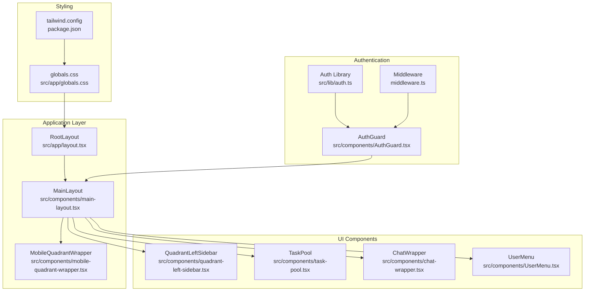

**Diagram sources**
- [layout.tsx:16-30](file://src/app/layout.tsx#L16-L30)
- [main-layout.tsx:12-69](file://src/components/main-layout.tsx#L12-L69)
- [mobile-quadrant-wrapper.tsx:11-17](file://src/components/mobile-quadrant-wrapper.tsx#L11-L17)
- [quadrant-left-sidebar.tsx:229-395](file://src/components/quadrant-left-sidebar.tsx#L229-L395)
- [task-pool.tsx:114-264](file://src/components/task-pool.tsx#L114-L264)
- [chat-wrapper.tsx:7-709](file://src/components/chat-wrapper.tsx#L7-L709)

**Section sources**
- [layout.tsx:1-31](file://src/app/layout.tsx#L1-L31)
- [main-layout.tsx:1-69](file://src/components/main-layout.tsx#L1-L69)
- [mobile-quadrant-wrapper.tsx:1-18](file://src/components/mobile-quadrant-wrapper.tsx#L1-L18)
- [globals.css:1-380](file://src/app/globals.css#L1-L380)

## Core Components

### Root Layout Container

The Root Layout serves as the primary container that establishes the global application structure and AI integration foundation. It provides essential metadata, viewport configuration, and wraps the entire application with AI assistant capabilities.

Key characteristics:
- **Metadata Management**: Defines application title and description for SEO and browser compatibility
- **Viewport Configuration**: Ensures proper mobile responsiveness and device scaling
- **AI Integration**: Wraps the entire application with CopilotKit for AI assistant functionality
- **Global Styling**: Imports comprehensive CSS framework and theme variables

### Enhanced Main Layout Architecture

The Main Layout implements a sophisticated responsive design optimized for productivity workflows across all device sizes:

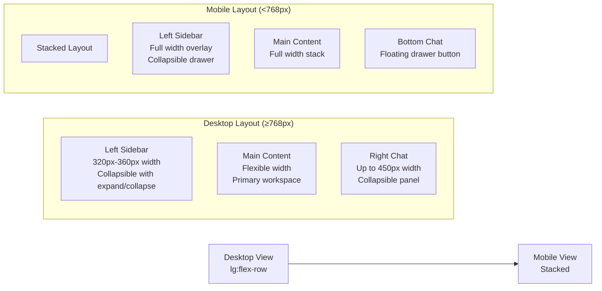

**Diagram sources**
- [main-layout.tsx:14-26](file://src/components/main-layout.tsx#L14-L26)

The layout employs advanced responsive techniques including:
- **Flexbox Grid System**: Utilizes `flex` and `flex-col` for responsive positioning
- **CSS Custom Properties**: Leverages `dvh` units for dynamic viewport height calculations
- **Tailwind Variants**: Implements responsive breakpoints (`lg:`, `md:`, `sm:`) for adaptive behavior
- **Overflow Management**: Carefully manages scroll behavior across different layout modes
- **Collapsible Panels**: Desktop-side collapsible panels with smooth transitions
- **Mobile-First Design**: Mobile drawer interface with slide-in animations

### AI Assistant Integration

The Chat Wrapper component provides seamless AI assistant functionality with sophisticated rendering and styling:

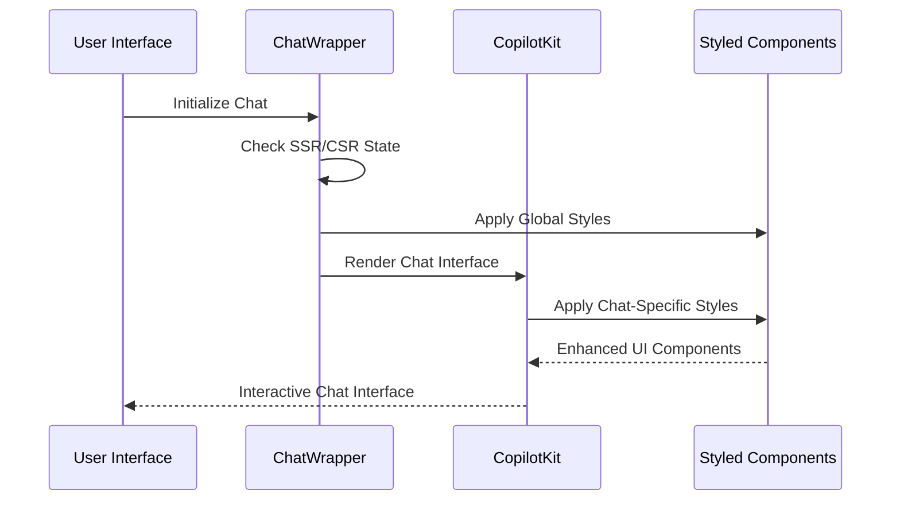

**Diagram sources**
- [chat-wrapper.tsx:7-709](file://src/components/chat-wrapper.tsx#L7-L709)

**Section sources**
- [layout.tsx:16-30](file://src/app/layout.tsx#L16-L30)
- [main-layout.tsx:12-69](file://src/components/main-layout.tsx#L12-L69)
- [chat-wrapper.tsx:7-709](file://src/components/chat-wrapper.tsx#L7-L709)

## Architecture Overview

The Main Layout System operates through a multi-layered architecture that ensures scalability, maintainability, and optimal user experience:

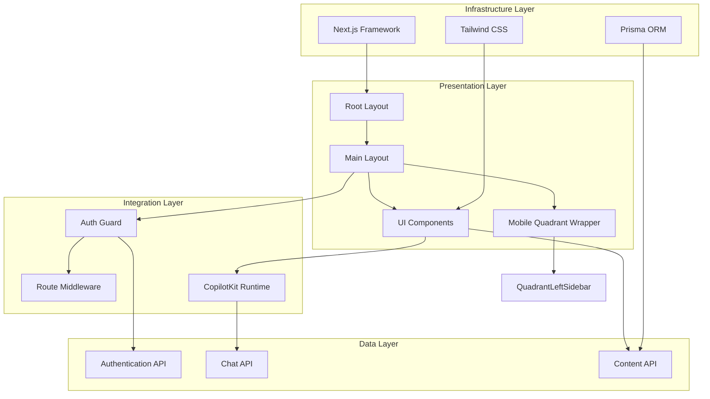

**Diagram sources**
- [layout.tsx:24-26](file://src/app/layout.tsx#L24-L26)
- [AuthGuard.tsx:10-53](file://src/components/AuthGuard.tsx#L10-L53)
- [middleware.ts:3-40](file://middleware.ts#L3-L40)
- [mobile-quadrant-wrapper.tsx:6-9](file://src/components/mobile-quadrant-wrapper.tsx#L6-L9)

The architecture emphasizes:
- **Separation of Concerns**: Clear boundaries between presentation, integration, and data layers
- **Asynchronous Operations**: Non-blocking authentication checks and API integrations
- **Responsive Design**: Adaptive layouts that work across all device sizes
- **AI Integration**: Seamless incorporation of AI assistant capabilities
- **Mobile Optimization**: Specialized mobile components and drawer interfaces

**Section sources**
- [layout.tsx:1-31](file://src/app/layout.tsx#L1-L31)
- [AuthGuard.tsx:1-53](file://src/components/AuthGuard.tsx#L1-L53)
- [middleware.ts:1-40](file://middleware.ts#L1-L40)
- [mobile-quadrant-wrapper.tsx:1-18](file://src/components/mobile-quadrant-wrapper.tsx#L1-L18)

## Detailed Component Analysis

### Authentication and Security System

The authentication system provides robust security through multiple layers of protection:

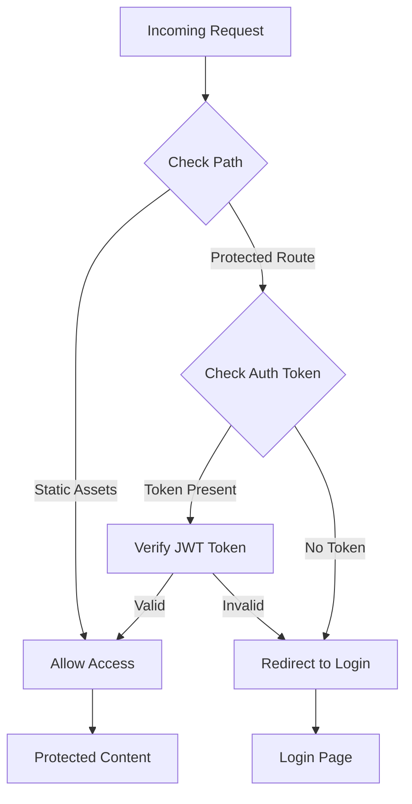

**Diagram sources**
- [middleware.ts:3-40](file://middleware.ts#L3-L40)
- [auth.ts:49-69](file://src/lib/auth.ts#L49-L69)

The system implements:
- **Token-Based Authentication**: Uses JWT tokens stored in cookies for session management
- **Route Protection**: Automatic redirection for unauthenticated users accessing protected routes
- **API Endpoint Security**: Direct 401 responses for unauthorized API requests
- **Client-Side Validation**: Real-time authentication checking through `/api/auth/me` endpoint

### Navigation and User Interface Components

The layout system coordinates multiple UI components that work together to provide a cohesive user experience:

#### Enhanced Quadrant Left Sidebar

The Quadrant Left Sidebar implements an advanced collapsible interface for task management with enhanced collision detection and HTML5 support:

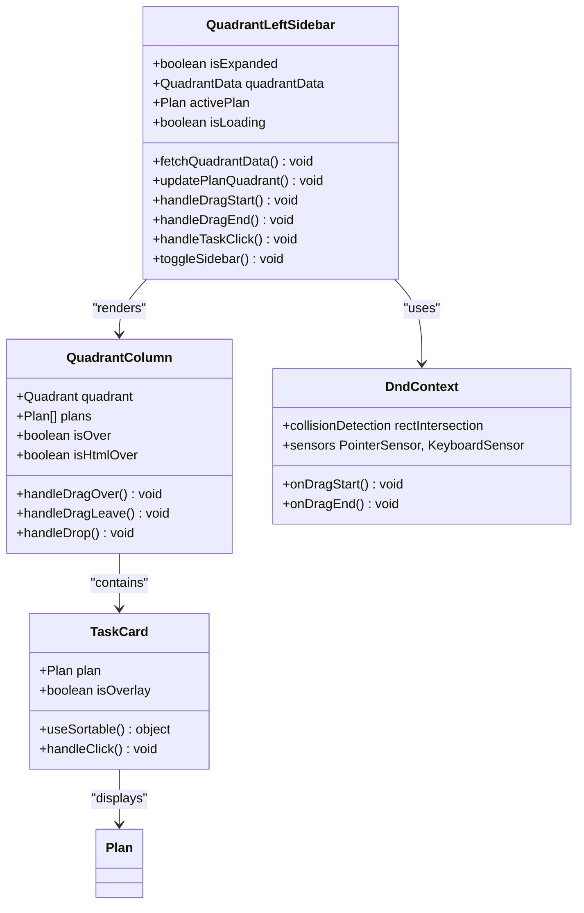

**Diagram sources**
- [quadrant-left-sidebar.tsx:229-395](file://src/components/quadrant-left-sidebar.tsx#L229-L395)
- [quadrant-left-sidebar.tsx:156-227](file://src/components/quadrant-left-sidebar.tsx#L156-L227)
- [quadrant-left-sidebar.tsx:92-148](file://src/components/quadrant-left-sidebar.tsx#L92-L148)
- [quadrant-left-sidebar.tsx:524-546](file://src/components/quadrant-left-sidebar.tsx#L524-L546)

**Updated** Enhanced with collapsible functionality featuring smooth width transitions, expand/collapse buttons, and mobile-friendly overlay mode.

#### User Menu System

The User Menu provides comprehensive user account management:

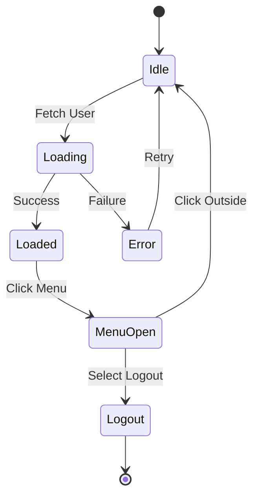

**Diagram sources**
- [UserMenu.tsx:10-104](file://src/components/UserMenu.tsx#L10-L104)

**Section sources**
- [quadrant-left-sidebar.tsx:1-558](file://src/components/quadrant-left-sidebar.tsx#L1-L558)
- [UserMenu.tsx:1-104](file://src/components/UserMenu.tsx#L1-L104)
- [auth.ts:1-69](file://src/lib/auth.ts#L1-L69)

### Responsive Design Implementation

The layout system implements sophisticated responsive design patterns:

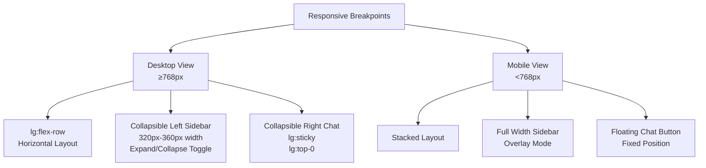

**Diagram sources**
- [main-layout.tsx:14-26](file://src/components/main-layout.tsx#L14-L26)
- [globals.css:359-380](file://src/app/globals.css#L359-L380)

**Section sources**
- [main-layout.tsx:1-69](file://src/components/main-layout.tsx#L1-L69)
- [globals.css:359-380](file://src/app/globals.css#L359-L380)

## Enhanced Responsive Layout System

**New Section** The Main Layout System now features an enhanced responsive design that provides optimal user experience across all device types through sophisticated layout adaptation and mobile-first design patterns.

### Desktop Layout Architecture

The desktop layout implements a sophisticated three-panel system with collapsible functionality:

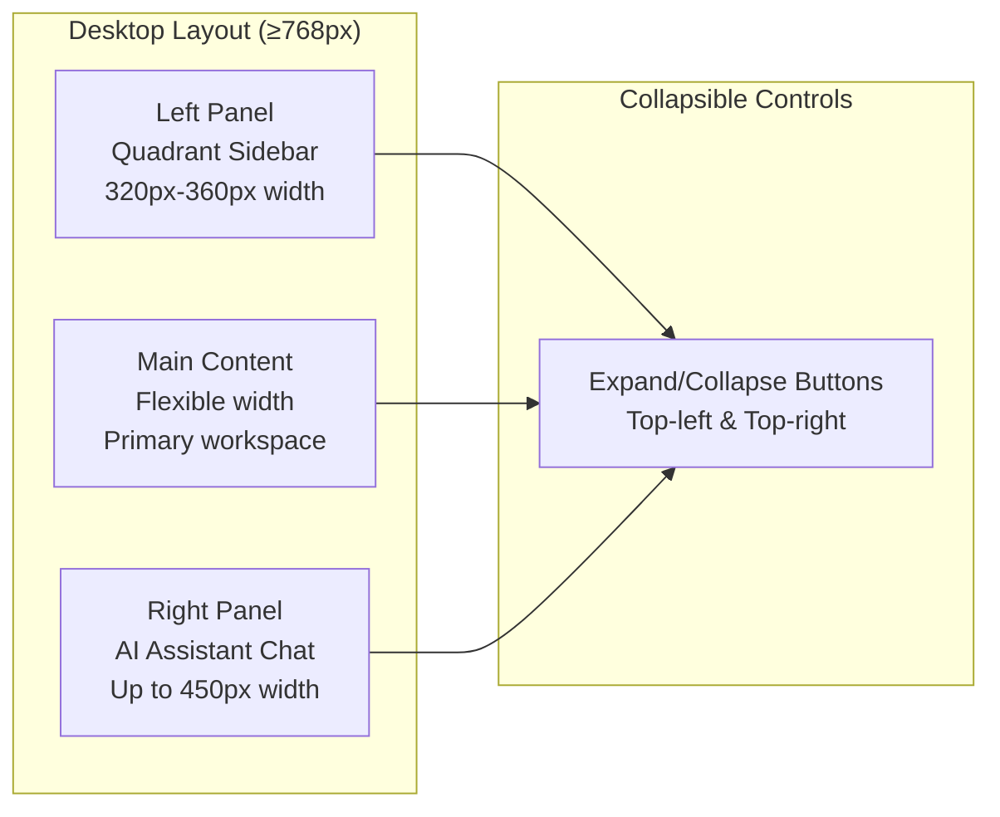

**Diagram sources**
- [main-layout.tsx:28-50](file://src/components/main-layout.tsx#L28-L50)

The desktop layout includes:
- **Collapsible Sidebars**: Smooth width transitions with expand/collapse functionality
- **Desktop-Only Controls**: Floating buttons positioned absolutely for easy access
- **Responsive Widths**: Flexible widths that adapt to content and screen size
- **Sticky Positioning**: Right panel uses sticky positioning for optimal scrolling

### Mobile Layout Architecture

The mobile layout implements a mobile-first approach with specialized components:

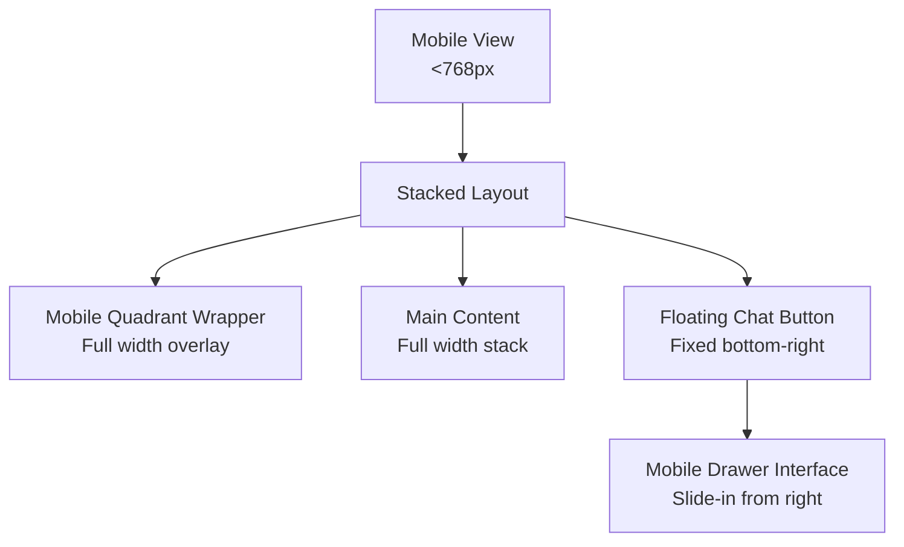

**Diagram sources**
- [main-layout.tsx:95-161](file://src/components/main-layout.tsx#L95-L161)
- [mobile-quadrant-wrapper.tsx:11-17](file://src/components/mobile-quadrant-wrapper.tsx#L11-L17)

The mobile layout includes:
- **Mobile-Only Wrapper**: Special wrapper component for mobile quadrant sidebar
- **Floating Action Button**: Persistent chat button for easy access
- **Slide-In Drawer**: Smooth animated drawer interface for AI assistant
- **Overlay Design**: Full-width overlay for quadrant sidebar on mobile

**Section sources**
- [main-layout.tsx:18-161](file://src/components/main-layout.tsx#L18-L161)
- [mobile-quadrant-wrapper.tsx:1-18](file://src/components/mobile-quadrant-wrapper.tsx#L1-L18)

## Mobile Drawer Interface

**New Section** The Main Layout System introduces a sophisticated mobile drawer interface for AI assistant functionality that provides seamless interaction on mobile devices.

### Drawer Architecture

The mobile drawer implements a slide-in interface with overlay background and smooth animations:

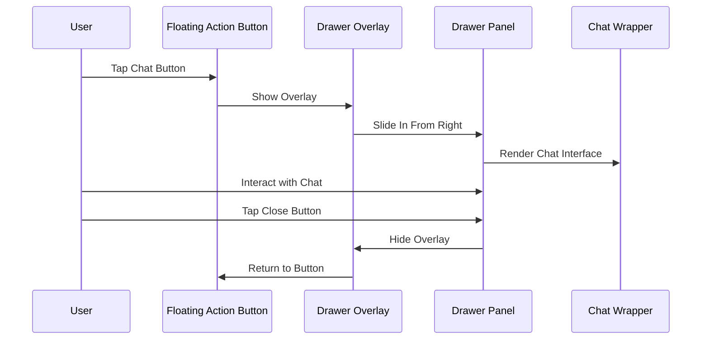

**Diagram sources**
- [main-layout.tsx:95-161](file://src/components/main-layout.tsx#L95-L161)

### Drawer Features

The mobile drawer interface includes several sophisticated features:

- **Overlay Background**: Semi-transparent overlay that dims the main content
- **Slide Animation**: Smooth slide-in animation from the right side
- **Responsive Width**: Adapts to screen size with maximum width constraint
- **Close Mechanism**: Overlay click and close button for easy dismissal
- **Persistent Button**: Floating action button remains accessible at all times

### Animation System

The drawer uses Tailwind CSS animation utilities for smooth transitions:

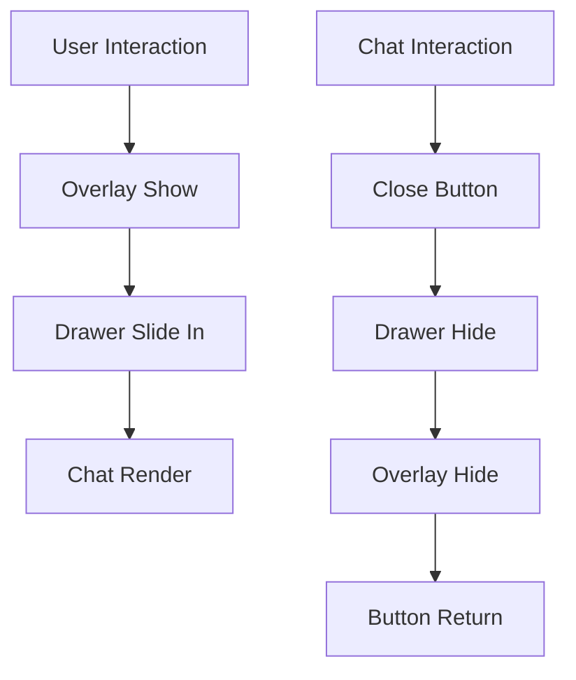

**Diagram sources**
- [main-layout.tsx:113](file://src/components/main-layout.tsx#L113)

**Section sources**
- [main-layout.tsx:95-161](file://src/components/main-layout.tsx#L95-L161)

## Collapsible Sidebar System

**New Section** The Main Layout System implements a sophisticated collapsible sidebar system that provides optimal space utilization on desktop devices while maintaining full functionality.

### Collapsible Sidebar Architecture

The collapsible sidebar system provides expand/collapse functionality with smooth transitions:

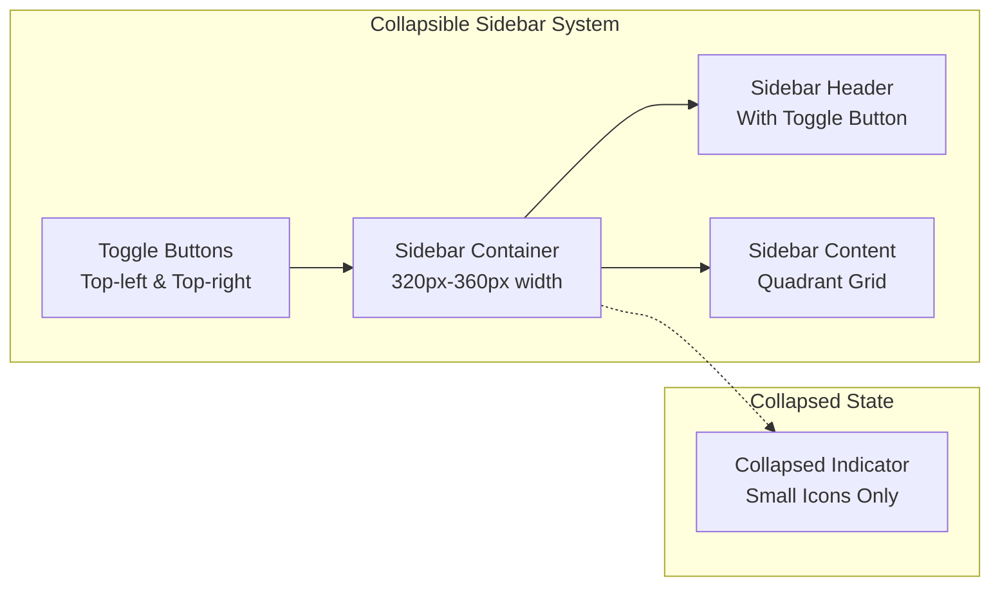

**Diagram sources**
- [main-layout.tsx:28-50](file://src/components/main-layout.tsx#L28-L50)
- [quadrant-left-sidebar.tsx:509-530](file://src/components/quadrant-left-sidebar.tsx#L509-L530)

### Collapsible Features

The collapsible sidebar includes several key features:

- **Width Transitions**: Smooth width changes from expanded to collapsed state
- **Icon-Only Mode**: Collapsed state displays only quadrant indicators
- **Toggle Controls**: Separate controls for expanding/collapsing left and right panels
- **State Persistence**: Maintains expanded/collapsed state across navigation
- **Responsive Behavior**: Automatically adapts to different screen sizes

### Desktop-Only Controls

The collapsible system includes desktop-specific controls:

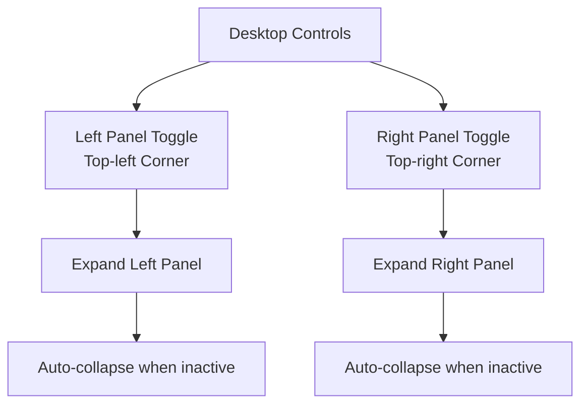

**Diagram sources**
- [main-layout.tsx:30-48](file://src/components/main-layout.tsx#L30-L48)

**Section sources**
- [main-layout.tsx:28-50](file://src/components/main-layout.tsx#L28-L50)
- [quadrant-left-sidebar.tsx:509-530](file://src/components/quadrant-left-sidebar.tsx#L509-L530)

## Dependency Analysis

The Main Layout System has well-defined dependencies that support modularity and maintainability:

```mermaid
graph TB
subgraph "External Dependencies"
NextJS[Next.js 15.3.6]
Tailwind[Tailwind CSS 4]
CopilotKit[@copilotkit/react-ui 1.8.13]
DnDKit[@dnd-kit/core 6.3.1]
DnDKitSortable[@dnd-kit/sortable 10.0.0]
DnDKitUtilities[@dnd-kit/utilities 3.2.2]
RadixUI[@radix-ui/react-*]
LucideReact[lucide-react 0.511.0]
HTML5[Native HTML5 Drag API]
DynamicImport[next/dynamic]
AnimateCSS[tw-animate-css 1.3.2]
end
subgraph "Internal Dependencies"
LayoutSystem[Layout System]
AuthSystem[Authentication System]
UIComponents[UI Components]
APIHandlers[API Handlers]
end
subgraph "Development Dependencies"
TypeScript[TypeScript 5]
ESLint[ESLint 9]
Prisma[Prisma 6.8.2]
end
NextJS --> LayoutSystem
Tailwind --> LayoutSystem
CopilotKit --> LayoutSystem
DnDKit --> UIComponents
DnDKitSortable --> UIComponents
DnDKitUtilities --> UIComponents
LucideReact --> UIComponents
DynamicImport --> MobileQuadrantWrapper
AnimateCSS --> LayoutSystem
LayoutSystem --> AuthSystem
LayoutSystem --> UIComponents
UIComponents --> APIHandlers
TypeScript --> NextJS
ESLint --> NextJS
Prisma --> APIHandlers
```

**Diagram sources**
- [package.json:16-43](file://package.json#L16-L43)
- [next.config.ts:1-29](file://next.config.ts#L1-29)

**Updated** Enhanced with @dnd-kit/sortable 10.0.0 and @dnd-kit/utilities 3.2.2 for improved drag-and-drop functionality, lucide-react 0.511.0 for enhanced iconography, and tw-animate-css 1.3.2 for smooth animation effects.

**Section sources**
- [package.json:1-64](file://package.json#L1-L64)
- [next.config.ts:1-29](file://next.config.ts#L1-L29)

## Performance Considerations

The layout system incorporates several performance optimization strategies:

### Rendering Optimizations

- **Conditional Rendering**: Components only render when necessary based on state changes
- **Lazy Loading**: AI assistant components load after initial page render
- **Memory Management**: Proper cleanup of event listeners and intervals in sidebar component
- **Efficient State Updates**: Minimal re-renders through optimized state management
- **Collision Detection Optimization**: Rectangle intersection algorithm provides efficient collision detection
- **Dynamic Imports**: Mobile quadrant wrapper uses dynamic imports to avoid SSR hydration issues

### Network Performance

- **API Caching**: Automatic data refresh every 30 seconds for quadrant data
- **Efficient Requests**: Batched API calls and proper error handling
- **Optimized Images**: SVG icons and vector graphics for crisp rendering

### Mobile Performance

- **Touch Optimization**: Proper touch event handling for drag-and-drop operations
- **Reduced Animations**: Motion reduction support for accessibility compliance
- **Battery Efficiency**: Minimized background processes and polling intervals
- **HTML5 Performance**: Native drag-and-drop APIs provide optimal mobile performance
- **Animation Performance**: Hardware-accelerated CSS transitions for smooth drawer animations

### Responsive Performance

**New Section** The enhanced responsive system includes several performance optimizations:
- **Breakpoint Optimization**: Efficient breakpoint handling with minimal reflows
- **Collapsible Transitions**: CSS transforms provide hardware-accelerated animations
- **Mobile-First Approach**: Optimized mobile components with reduced complexity
- **Drawer Animation**: Smooth slide-in/out animations with proper timing functions
- **State Management**: Optimized state updates prevent unnecessary re-renders across layout changes

**Section sources**
- [quadrant-left-sidebar.tsx:525-526](file://src/components/quadrant-left-sidebar.tsx#L525-L526)
- [task-pool.tsx:229](file://src/components/task-pool.tsx#L229)
- [mobile-quadrant-wrapper.tsx:6-9](file://src/components/mobile-quadrant-wrapper.tsx#L6-L9)

## Troubleshooting Guide

### Common Issues and Solutions

#### Authentication Problems

**Issue**: Users redirected to login despite having valid tokens
**Solution**: Check token validity and expiration in authentication library

**Issue**: API requests failing with 401 errors
**Solution**: Verify middleware configuration and token presence in cookies

#### Layout Rendering Issues

**Issue**: Chat interface not displaying properly on mobile
**Solution**: Verify responsive breakpoint configurations and CSS custom properties

**Issue**: Sidebar not responding to drag operations
**Solution**: Check DnD Kit initialization and sensor configuration

#### Collapsible Sidebar Issues

**New Section** Enhanced troubleshooting for collapsible sidebar functionality:

**Issue**: Collapsible sidebar not expanding/collapsing properly
**Solution**: Verify state management and CSS transition classes are applied correctly

**Issue**: Desktop toggle buttons not visible
**Solution**: Check lg:flex visibility classes and z-index positioning

**Issue**: Collapsed state not persisting across navigation
**Solution**: Verify state persistence and component lifecycle management

#### Mobile Drawer Issues

**New Section** Enhanced troubleshooting for mobile drawer functionality:

**Issue**: Drawer not sliding in smoothly
**Solution**: Verify animate-in and slide-in-from-right classes are applied correctly

**Issue**: Overlay not covering main content
**Solution**: Check z-index values and fixed positioning classes

**Issue**: Drawer not closing properly
**Solution**: Verify click handlers and state management for mobileChatOpen state

#### Performance Issues

**Issue**: Slow page loading times
**Solution**: Review component lazy loading and optimize heavy computations

**Issue**: Memory leaks in sidebar component
**Solution**: Ensure proper cleanup of event listeners and intervals

**Section sources**
- [middleware.ts:19-35](file://middleware.ts#L19-L35)
- [quadrant-left-sidebar.tsx:266-271](file://src/components/quadrant-left-sidebar.tsx#L266-L271)
- [next.config.ts:8-25](file://next.config.ts#L8-L25)
- [quadrant-left-sidebar.tsx:525-526](file://src/components/quadrant-left-sidebar.tsx#L525-L526)
- [task-pool.tsx:229](file://src/components/task-pool.tsx#L229)
- [main-layout.tsx:95-161](file://src/components/main-layout.tsx#L95-L161)

## Conclusion

The Main Layout System represents a sophisticated approach to building modern web applications with integrated AI capabilities and exceptional responsive design. Through careful architectural design, the system achieves optimal user experience across all device types while maintaining robust security and performance standards.

Key achievements include:
- **Responsive Design Mastery**: Seamless adaptation between desktop and mobile interfaces with collapsible sidebars
- **AI Integration**: Natural incorporation of AI assistant functionality without disrupting user workflow
- **Security Excellence**: Multi-layered authentication and authorization system
- **Performance Optimization**: Careful consideration of rendering, network, and memory efficiency
- **Drag-and-Drop Excellence**: Advanced collision detection and HTML5 support for seamless task management
- **Mobile-First Innovation**: Sophisticated mobile drawer interface with smooth animations
- **Collapsible Interface**: Intelligent space management with expand/collapse functionality
- **Maintainability**: Clear component separation and well-defined dependencies

**Updated** The enhanced responsive layout system with collapsible sidebars, mobile drawer interface, and improved desktop/mobile adaptation provides unprecedented flexibility in user interface design, allowing users to seamlessly navigate between different device contexts while maintaining productivity and functionality.

The system serves as a foundation for the Goal Mate application's productivity-focused workflow, enabling users to manage goals, plans, and progress through an intuitive, AI-enhanced interface that adapts to their needs and context while providing powerful drag-and-drop capabilities for efficient task organization and sophisticated responsive design patterns for optimal user experience across all devices.